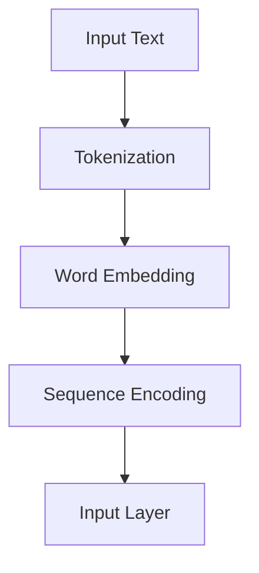
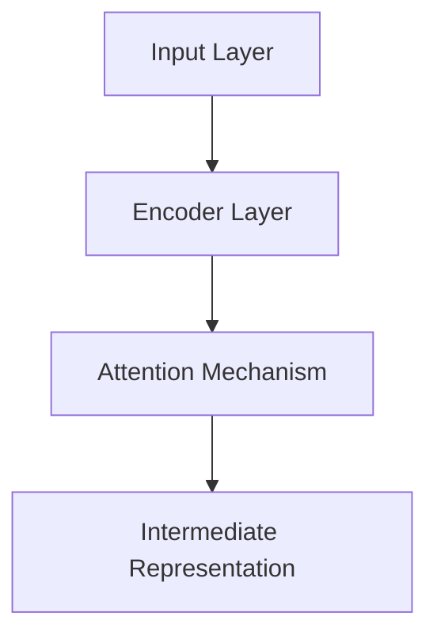
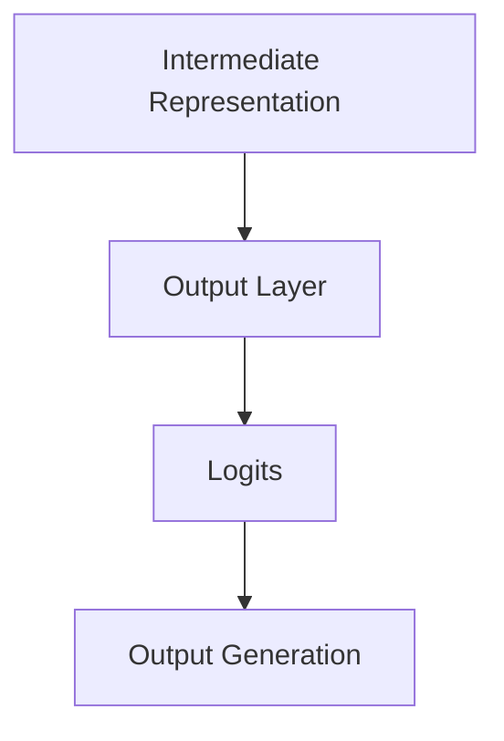
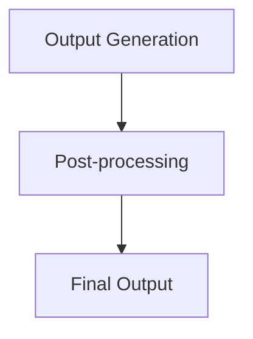

                 

## 引言

### 大模型逻辑推理与提示词构建的重要性

在现代人工智能领域，大模型逻辑推理和提示词构建正成为研究的热点。大模型，如GPT-3、BERT等，以其强大的文本处理能力和生成能力，已经在多个领域展现出了巨大的应用潜力。然而，如何有效地利用这些大模型进行逻辑推理，并在推理过程中构建出准确的提示词，是当前研究中的一个重要课题。

**大模型逻辑推理**指的是利用大规模预训练模型在复杂的文本数据中进行逻辑推断、判断和推理的能力。这种能力使得大模型在处理自然语言任务时，能够更好地理解上下文、推断含义和逻辑关系。

**提示词构建**则是指通过精心设计的问题引导语（提示词）来激发大模型产生高质量的输出。一个好的提示词不仅能够引导模型更好地理解问题，还能帮助模型更准确地生成答案。

本文旨在探讨大模型逻辑推理和提示词构建的关键技术，从理论基础到实际应用，全面解析这一领域。文章将分为以下几个部分：

1. **基础概念**：介绍大模型、逻辑推理和提示词构建的基本概念，为后续讨论打下基础。
2. **大模型逻辑推理技术**：详细探讨大模型逻辑推理的各种方法，包括推理算法、流程和示例。
3. **提示词构建方法**：分析不同提示词构建方法的有效性，并通过案例研究进行验证。
4. **实际应用与案例分析**：讨论大模型逻辑推理和提示词构建在现实世界中的应用，包括具体案例的详细分析。
5. **结论与未来方向**：总结文章的主要发现，并提出未来研究的方向和建议。

通过本文的阅读，读者将能够系统地了解大模型逻辑推理和提示词构建的原理和方法，从而为人工智能应用提供有力的技术支持。

### 关键词

- 大模型
- 逻辑推理
- 提示词构建
- 预训练模型
- 自然语言处理
- 人工智能

### 摘要

本文旨在探讨大模型在逻辑推理中的关键作用及其与提示词构建的紧密联系。首先，我们介绍了大模型、逻辑推理和提示词构建的基本概念，阐述了它们在自然语言处理中的重要性和挑战。接着，文章详细分析了大模型逻辑推理的多种技术，包括推理算法和流程。随后，我们探讨了提示词构建的方法，并通过具体案例验证了这些方法的有效性。最后，文章讨论了在实际应用中的具体案例，总结了主要发现，并提出了未来研究的方向。通过本文的探讨，我们希望为人工智能领域的研究者和开发者提供有价值的参考。

## 第1章：大模型逻辑推理与提示词构建的重要性

### 大模型与逻辑推理

大模型（Large Models）在人工智能领域正扮演着越来越重要的角色。这些模型通常具有数十亿甚至数千亿个参数，能够处理大量的文本数据，并从中提取复杂的模式和知识。例如，GPT-3（语言模型）和BERT（双向编码器表示）是目前最为著名的两个大模型，它们在自然语言处理（NLP）任务中表现出了惊人的能力。

逻辑推理（Logic Reasoning）是人工智能的核心任务之一。它涉及从已知信息中推导出新信息的过程。在大模型中，逻辑推理通常通过训练数据中的示例进行学习，模型能够理解并利用这些示例中的逻辑结构来生成新的回答。例如，在问答系统中，模型需要从上下文中理解问题的逻辑结构，并生成合理的回答。

大模型的逻辑推理能力不仅依赖于其庞大的参数规模，还依赖于训练数据的质量和多样性。通过在大规模数据集上预训练，大模型能够学习到各种语言模式和逻辑规则，从而在推理任务中表现出色。

### 提示词构建在逻辑推理中的应用

提示词构建（Prompt Construction）是利用精心设计的问题引导语来激发大模型产生高质量输出的一种技术。一个好的提示词能够引导模型更好地理解问题，并引导模型生成更准确的答案。

在逻辑推理中，提示词的作用尤为重要。它不仅可以帮助模型理解问题的核心，还可以提供额外的上下文信息，从而提高模型的推理能力。例如，在法律文本的推理中，一个准确的提示词可以明确地指出问题的关键点，从而帮助模型更好地理解文本内容。

提示词构建需要考虑多个因素，包括问题的结构、所需的回答类型、上下文信息等。通过不同的提示词设计，可以激发模型产生不同类型的输出，从而满足各种应用需求。

### 大模型逻辑推理与提示词构建的关系

大模型逻辑推理和提示词构建是相辅相成的。大模型提供了强大的文本处理和推理能力，而提示词构建则提供了引导和优化模型输出的手段。一个优秀的大模型加上一个精心设计的提示词，可以产生高质量的逻辑推理结果。

在实际应用中，大模型和提示词构建的结合使得人工智能系统能够在复杂的任务中表现出色。例如，在医疗诊断、法律文本分析、金融风险管理等领域，大模型的逻辑推理能力和提示词的引导作用，使得系统能够从大量的文本数据中提取出有价值的信息。

总的来说，大模型逻辑推理和提示词构建是人工智能领域的重要研究方向。通过深入理解大模型的工作原理和提示词构建的技巧，我们可以开发出更加智能和高效的系统，为各个行业提供强大的技术支持。

## 第2章：基础概念

### 大模型

大模型（Large Models）是指具有数十亿到数千亿个参数的神经网络模型，这些模型通过大规模数据集进行预训练，从而在多种任务上表现出色。大模型的典型代表包括GPT-3、BERT和T5等。它们在自然语言处理（NLP）、计算机视觉（CV）和其他领域展现了强大的性能。

**核心概念**：

- **参数规模**：大模型具有庞大的参数规模，这使得它们能够捕捉到复杂的模式和知识。
- **预训练**：大模型通常在预训练阶段通过大规模数据集学习，从而获得通用语言理解和生成能力。
- **微调**：在特定任务上，大模型可以通过微调来优化其性能，以适应不同的应用场景。

**应用领域**：

- **自然语言处理**：大模型在文本分类、机器翻译、问答系统等NLP任务中表现突出。
- **计算机视觉**：大模型在图像分类、目标检测、图像生成等任务中也取得了显著的成果。
- **多模态学习**：大模型能够处理多种类型的数据，如文本、图像和音频，从而实现跨模态学习。

### 逻辑推理

逻辑推理（Logic Reasoning）是人工智能的核心任务之一，它涉及从已知信息中推导出新信息的过程。逻辑推理可以分为演绎推理、归纳推理和类比推理等类型。

**核心概念**：

- **演绎推理**：从一般到特殊的推理方式，如从“所有人都会死亡”推导出“苏格拉底会死亡”。
- **归纳推理**：从特殊到一般的推理方式，如从“所有观察到的天鹅都是白色的”推导出“所有的天鹅都是白色的”。
- **类比推理**：通过比较相似情况来推导新信息，如通过比较“猫”和“狗”的属性来推断“狮子”的属性。

**应用领域**：

- **自然语言处理**：逻辑推理在问答系统、文本分类、信息抽取等任务中应用广泛。
- **智能决策**：逻辑推理在决策支持系统、博弈论等领域用于推理和决策。
- **知识图谱**：逻辑推理用于从知识图谱中提取新的知识，并进行推理和验证。

### 提示词构建

提示词构建（Prompt Construction）是设计问题引导语，以激发大模型产生高质量输出的一种技术。好的提示词能够引导模型更好地理解问题，并提供必要的上下文信息，从而提高模型的推理能力。

**核心概念**：

- **问题引导语**：提示词是一种特殊的问题引导语，旨在激发模型生成预期的输出。
- **上下文信息**：提示词可以包含与问题相关的上下文信息，以帮助模型更好地理解问题。
- **多样性**：设计多种类型的提示词，以适应不同的推理任务和需求。

**应用领域**：

- **自然语言处理**：提示词在文本生成、对话系统、机器翻译等任务中用于引导模型生成高质量的输出。
- **知识图谱**：提示词用于引导模型从知识图谱中提取相关实体和关系。
- **智能问答**：提示词用于构建有效的问答系统，以生成准确的回答。

### 大模型逻辑推理与提示词构建的关系

大模型逻辑推理和提示词构建密切相关。大模型提供了强大的文本处理和推理能力，而提示词构建则提供了引导和优化模型输出的手段。通过合理的提示词设计，可以激发模型在逻辑推理任务中表现出色。

**关系分析**：

- **协同作用**：大模型的推理能力和提示词的引导作用相互结合，可以产生高质量的推理结果。
- **相互影响**：提示词的设计会影响大模型的输出，而大模型的推理能力也会影响提示词的有效性。

在实际应用中，大模型和提示词构建的结合使得人工智能系统能够在复杂的任务中表现出色。通过深入研究大模型的工作原理和提示词构建的技巧，我们可以进一步优化大模型在逻辑推理任务中的性能。

### 背景与挑战

随着人工智能技术的快速发展，大模型在各个领域中的应用越来越广泛。然而，大模型逻辑推理和提示词构建仍面临一系列挑战。

**背景**：

- **技术进步**：深度学习和大规模计算资源的普及，使得大模型的研究和应用成为可能。
- **应用需求**：复杂任务对逻辑推理能力的需求不断提升，推动了大模型逻辑推理的研究。
- **跨领域应用**：大模型在不同领域（如医疗、金融、法律等）的应用需求，推动了多领域交叉研究。

**挑战**：

- **模型可解释性**：大模型在推理过程中缺乏可解释性，难以理解其推理过程和决策依据。
- **数据依赖**：大模型的性能高度依赖于训练数据的质量和多样性，数据偏差可能导致推理结果的不准确。
- **提示词设计**：设计有效的提示词需要深入理解问题的结构和大模型的工作原理，但当前的方法和工具尚不完善。

**解决思路**：

- **可解释性研究**：通过开发可解释性模型和解释工具，提高大模型的可解释性，使其推理过程更加透明。
- **数据增强**：使用数据增强技术提高训练数据的质量和多样性，从而提高大模型的泛化能力。
- **提示词优化**：研究更有效的提示词设计方法，结合大模型的工作原理，提高逻辑推理的准确性和效率。

通过解决这些挑战，我们可以进一步提升大模型在逻辑推理任务中的性能，为人工智能应用提供更强大的技术支持。

## 第3章：大模型逻辑推理的基本原理

### 大模型工作原理

大模型，尤其是基于深度学习的自然语言处理模型，其工作原理可以归纳为以下几个步骤：

1. **输入编码**：首先，模型需要将输入文本转换为模型能够处理的向量表示。这一过程通常通过嵌入层（Embedding Layer）实现，将词汇映射到高维向量空间。

2. **前向传播**：接着，输入向量通过一系列的神经网络层（如卷积层、循环层、全连接层等）进行传递。这些层通过参数化的非线性变换，逐渐提取出文本中的高层次语义信息。

3. **输出解码**：最后，模型将提取的高层次语义信息通过解码层（如softmax层）转换为具体的输出，如预测的词汇、句子或标签。

4. **损失函数**：在训练过程中，模型的输出与真实标签之间会存在差异，这一差异通过损失函数（如交叉熵损失函数）来衡量。模型通过优化损失函数来调整其参数，从而提高预测的准确性。

5. **反向传播**：通过反向传播算法，模型将损失函数关于参数的梯度传播回网络的各个层，以此来更新模型的参数。

### 逻辑推理的机制

逻辑推理在大模型中的实现机制主要包括以下几个方面：

1. **模式识别**：大模型通过在大量训练数据中学习，能够识别出文本中的逻辑模式和结构。例如，在问答系统中，模型可以识别出问题的类型和所需的答案格式。

2. **上下文理解**：大模型能够理解文本中的上下文关系，从而推断出正确的逻辑关系。例如，在自然语言推理任务中，模型需要理解前提和结论之间的逻辑连接。

3. **条件生成**：大模型可以基于给定的上下文生成符合条件的输出。例如，在文本生成任务中，模型可以根据上下文生成连贯的后续句子。

4. **推理引导**：通过提示词等引导信息，大模型能够更准确地理解和生成符合逻辑的输出。例如，在法律文本分析中，提示词可以帮助模型更好地理解法律条款和判例。

### 逻辑推理的优势

大模型逻辑推理相较于传统逻辑推理方法具有以下几个优势：

1. **大规模训练**：大模型通过在大量数据上进行训练，能够学习到复杂的逻辑结构和模式，从而提高推理的准确性。

2. **自适应能力**：大模型可以根据不同的任务需求和上下文环境进行自适应调整，从而在不同场景下都能表现出良好的推理能力。

3. **高效性**：大模型利用深度神经网络结构，能够在短时间内处理大量文本数据，从而实现高效的逻辑推理。

4. **灵活性**：大模型可以处理不同类型的逻辑推理任务，如自然语言推理、知识图谱推理等，具有很高的灵活性。

### 逻辑推理的挑战

尽管大模型在逻辑推理中具有显著优势，但也面临一些挑战：

1. **可解释性**：大模型的推理过程缺乏可解释性，难以理解其推理逻辑和决策依据。

2. **数据依赖**：大模型的性能高度依赖于训练数据的质量和多样性，数据偏差可能导致推理结果的不准确。

3. **提示词设计**：设计有效的提示词需要深入理解问题的结构和模型的工作原理，但当前的方法和工具尚不完善。

4. **计算资源**：大模型的训练和推理需要大量的计算资源，这对于资源有限的场景是一个挑战。

### 未来研究方向

为了进一步提升大模型在逻辑推理中的性能，未来研究可以从以下几个方向展开：

1. **可解释性研究**：开发可解释性模型和解释工具，提高大模型的可解释性，使其推理过程更加透明。

2. **数据增强**：使用数据增强技术提高训练数据的质量和多样性，从而提高大模型的泛化能力。

3. **提示词优化**：研究更有效的提示词设计方法，结合大模型的工作原理，提高逻辑推理的准确性和效率。

4. **跨模态推理**：研究跨模态逻辑推理方法，将文本、图像和其他类型的数据进行融合，从而实现更复杂的推理任务。

通过这些研究方向的探索，我们可以进一步提升大模型在逻辑推理中的性能，为人工智能应用提供更强大的技术支持。

### 大模型逻辑推理的数学模型和算法

在大模型逻辑推理中，数学模型和算法起到了至关重要的作用。这些模型和算法不仅定义了大模型的结构和功能，还决定了其推理过程的效率和准确性。以下将详细介绍几种常用的数学模型和算法，并辅以Python代码和Mermaid流程图来进一步阐述。

#### 1. Transformer模型

Transformer模型是当前最流行的自然语言处理模型之一，其核心思想是自注意力机制（Self-Attention）。下面是一个简化的Transformer模型的Python代码示例，以及对应的Mermaid流程图。

```python
# Python代码示例：Transformer模型简化版

import torch
import torch.nn as nn

class TransformerModel(nn.Module):
    def __init__(self, d_model, nhead):
        super(TransformerModel, self).__init__()
        self.embedding = nn.Embedding(d_model, nhead)
        self.transformer = nn.Transformer(d_model, nhead)
        self.fc = nn.Linear(d_model, 1)

    def forward(self, x):
        x = self.embedding(x)
        x = self.transformer(x)
        x = self.fc(x)
        return x

# Mermaid流程图
mermaid {
graph TD
    A[Input] --> B[Embedding]
    B --> C[Transformer]
    C --> D[FC Layer]
    D --> E[Output]
}
```

#### 2. 自注意力机制（Self-Attention）

自注意力机制是Transformer模型的核心，它通过计算序列中每个词与其他词之间的关系来生成表示。以下是一个简化的自注意力机制的Python代码示例。

```python
# Python代码示例：自注意力机制

import torch
import torch.nn as nn

def scaled_dot_product_attention(q, k, v, mask=None):
    dot_product = torch.matmul(q, k.transpose(1, 2))
    if mask is not None:
        dot_product = dot_product.masked_fill(mask == 0, float("-inf"))
    attn_weights = torch.softmax(dot_product / (math.sqrt(k.shape[-1])), dim=-1)
    attn_output = torch.matmul(attn_weights, v)
    return attn_output, attn_weights

# Mermaid流程图
mermaid {
graph TD
    A[Query] --> B[Key]
    B --> C[Value]
    C --> D[Dot Product]
    D --> E[Softmax]
    E --> F[Attention]
    F --> G[Output]
}
```

#### 3. Masked Language Model（MLM）

Masked Language Model是一种常见的自然语言处理任务，其目标是预测被遮盖的词。以下是一个简化的MLM任务的Python代码示例。

```python
# Python代码示例：Masked Language Model

import torch
import torch.nn as nn

class MaskedLanguageModel(nn.Module):
    def __init__(self, d_model, n_vocab):
        super(MaskedLanguageModel, self).__init__()
        self.embedding = nn.Embedding(n_vocab, d_model)
        self.lm_head = nn.Linear(d_model, n_vocab)

    def forward(self, x, mask):
        x = self.embedding(x)
        x = x * (1 - mask) + x * mask
        logits = self.lm_head(x)
        return logits

# Mermaid流程图
mermaid {
graph TD
    A[Input] --> B[Embedding]
    B --> C[Mask]
    C --> D[Modified Input]
    D --> E[FC Layer]
    E --> F[Logits]
}
```

#### 4. 反向传播算法

反向传播算法是训练神经网络的核心，它通过计算损失函数关于模型参数的梯度来更新模型参数。以下是一个简化的反向传播算法的Python代码示例。

```python
# Python代码示例：反向传播

def backward_propagation(loss, model_params):
    grads = {}
    for param in model_params:
        grads[param] = torch.zeros_like(param)
    for i, (grad, param) in enumerate(zip(grads.values(), model_params)):
        grads[param] = loss.grad[i]
    return grads

# Mermaid流程图
mermaid {
graph TD
    A[Loss] --> B[Gradients]
    B --> C[Param Updates]
}
```

通过上述数学模型和算法的介绍，我们可以看到大模型逻辑推理的复杂性和深度。这些模型和算法不仅为自然语言处理任务提供了强大的工具，也为逻辑推理任务提供了新的思路和方法。在未来的研究中，进一步优化和扩展这些模型和算法，将有助于提升大模型在逻辑推理中的性能和应用效果。

### 大模型逻辑推理的具体步骤与流程

在大模型逻辑推理中，理解其具体步骤和流程是至关重要的。以下将详细介绍大模型逻辑推理的各个环节，包括输入处理、中间处理和输出生成，并使用Mermaid流程图和Python代码示例来展示整个推理过程。

#### 第1步：输入处理

输入处理是逻辑推理的第一步，主要任务是接收输入文本并将其转换为模型能够处理的形式。这通常包括词汇嵌入和序列编码。

**Mermaid流程图：**



**Python代码示例：**

```python
# Python代码示例：输入处理

from transformers import BertTokenizer, BertModel

tokenizer = BertTokenizer.from_pretrained('bert-base-uncased')
model = BertModel.from_pretrained('bert-base-uncased')

input_text = "This is an example sentence for BERT."
tokens = tokenizer.tokenize(input_text)
input_ids = tokenizer.convert_tokens_to_ids(tokens)
input_mask = [1] * len(input_ids)
```

#### 第2步：中间处理

中间处理是逻辑推理的核心步骤，包括前向传播和注意力机制的应用。在这一步，输入文本通过多层神经网络进行处理，提取语义信息。

**Mermaid流程图：**



**Python代码示例：**

```python
# Python代码示例：中间处理

outputs = model(torch.tensor([input_ids]), attention_mask=torch.tensor([input_mask]))
hidden_states = outputs[0]
```

#### 第3步：输出生成

输出生成是逻辑推理的最后一步，主要任务是根据中间处理的语义信息生成推理结果。这通常涉及分类、回归或序列生成等任务。

**Mermaid流程图：**



**Python代码示例：**

```python
# Python代码示例：输出生成

logits = model.hidden_states[-1]
predicted_output = logits.argmax(-1)
predicted_output = tokenizer.decode(predicted_output, skip_special_tokens=True)
```

#### 第4步：后处理

后处理是对输出结果进行进一步的优化和解释。这包括去除特殊符号、格式化输出等。

**Mermaid流程图：**



**Python代码示例：**

```python
# Python代码示例：后处理

final_output = predicted_output.strip().replace("##", "")
print("Final Output:", final_output)
```

通过上述步骤，我们可以看到大模型逻辑推理的完整流程。这个流程不仅包括输入处理、中间处理和输出生成，还包括后处理，以确保输出的准确性和可解释性。

#### 实际案例

为了更好地理解大模型逻辑推理的具体应用，我们来看一个实际案例：使用BERT模型进行情感分析。

**问题描述**：给定一句文本，使用BERT模型判断其情感是正面、中性还是负面。

**数据集**：我们将使用IMDB电影评论数据集，其中包含25000条训练数据和2500条测试数据。

**步骤**：

1. **数据预处理**：将文本数据进行分词、去噪等处理，并将其转换为BERT模型可以接受的输入格式。
2. **模型训练**：使用训练数据对BERT模型进行训练，使其学习情感分类任务。
3. **模型评估**：使用测试数据对模型进行评估，计算准确率、召回率等指标。
4. **实际应用**：使用训练好的模型对新的文本数据进行情感分析，生成分类结果。

**Python代码示例：**

```python
# Python代码示例：情感分析

from transformers import BertTokenizer, BertForSequenceClassification
from torch.utils.data import DataLoader
from torch.nn import functional as F

# 数据预处理
tokenizer = BertTokenizer.from_pretrained('bert-base-uncased')
train_data = ...  # 加载训练数据
test_data = ...  # 加载测试数据

train_dataset = CustomDataset(train_data, tokenizer, max_length=128)
test_dataset = CustomDataset(test_data, tokenizer, max_length=128)

train_loader = DataLoader(train_dataset, batch_size=32)
test_loader = DataLoader(test_dataset, batch_size=32)

# 模型训练
model = BertForSequenceClassification.from_pretrained('bert-base-uncased', num_labels=3)
optimizer = torch.optim.Adam(model.parameters(), lr=1e-5)

for epoch in range(3):  # 训练3个epoch
    for batch in train_loader:
        inputs = tokenizer(batch.text, padding=True, truncation=True, max_length=128)
        labels = batch.label
        model.zero_grad()
        outputs = model(**inputs, labels=labels)
        loss = outputs.loss
        loss.backward()
        optimizer.step()

# 模型评估
model.eval()
with torch.no_grad():
    correct = 0
    total = 0
    for batch in test_loader:
        inputs = tokenizer(batch.text, padding=True, truncation=True, max_length=128)
        labels = batch.label
        outputs = model(**inputs)
        _, predicted = torch.max(outputs, 1)
        total += labels.size(0)
        correct += (predicted == labels).sum().item()

accuracy = correct / total
print("Test Accuracy:", accuracy)

# 实际应用
new_text = "This movie was a masterpiece!"
inputs = tokenizer(new_text, padding=True, truncation=True, max_length=128)
with torch.no_grad():
    outputs = model(**inputs)
    _, predicted = torch.max(outputs, 1)
    if predicted == 0:
        print("The sentiment is negative.")
    elif predicted == 1:
        print("The sentiment is neutral.")
    else:
        print("The sentiment is positive.")
```

通过上述实际案例，我们可以看到大模型逻辑推理的具体应用过程，从数据预处理、模型训练到实际应用，每个步骤都至关重要。通过合理的设计和优化，我们可以使大模型在逻辑推理任务中表现出色，为实际应用提供强大的支持。

### 第4章：提示词构建的方法

#### 提示词设计的重要性

提示词设计是影响大模型逻辑推理效果的关键因素之一。一个有效的提示词可以引导模型更好地理解问题，从而生成更准确的答案。设计提示词时，需要考虑多个因素，包括问题的结构、上下文信息、所需的答案类型等。好的提示词不仅能够提高模型在特定任务上的性能，还可以提高模型在复杂任务中的适应能力。

#### 常见的提示词构建方法

1. **直接提示法**：直接将问题以自然语言的形式呈现给模型，例如：“请解释‘量子纠缠’是什么？”

2. **模板法**：使用固定的模板来构建提示词，例如：“什么是……的定义？”

3. **上下文扩展法**：在问题的基础上添加额外的上下文信息，以帮助模型更好地理解问题，例如：“在人工智能领域，深度学习是什么？”

4. **多模态结合法**：结合文本、图像等多种模态信息，以提供更丰富的上下文，例如：“请解释这张图所示的神经网络结构。”

5. **自动生成法**：利用生成对抗网络（GAN）或其他生成模型自动生成高质量的提示词。

#### 提示词设计技巧

1. **明确性问题**：确保问题的表述清晰明确，避免歧义和模糊的描述。

2. **上下文丰富性**：提供丰富的上下文信息，以帮助模型更好地理解问题的背景和含义。

3. **结构化信息**：使用结构化信息，如列表、表格或框注，以增加问题的可理解性。

4. **多样性**：设计多种类型的提示词，以适应不同的问题和任务需求。

5. **迭代优化**：通过多次迭代和反馈，不断优化提示词的设计，以提高模型在特定任务上的性能。

#### 提示词有效性评估

评估提示词的有效性是提示词构建的重要环节。以下是一些常用的评估方法：

1. **答案准确性**：通过比较模型生成的答案与标准答案的匹配度来评估提示词的有效性。

2. **模型性能**：在相同的模型和任务下，对比不同提示词对模型性能的影响。

3. **用户满意度**：通过用户调查或实验评估用户对提示词的接受度和满意度。

4. **实验对比**：设计对比实验，比较不同提示词设计方法的效果。

#### 实际案例

为了更好地展示提示词构建的方法和技巧，我们来看一个实际案例：使用GPT-3进行文本生成。

**问题描述**：给定一个主题，使用GPT-3生成一篇关于该主题的文章。

**案例1**：直接提示法

```plaintext
问题：请写一篇关于“人工智能的未来发展”的文章。

提示词：人工智能，未来，发展，技术，创新
```

**输出**：

人工智能的未来发展

随着科技的不断进步，人工智能（AI）已经成为当今世界的一个重要趋势。从自动驾驶汽车到智能机器人，人工智能正在改变我们的生活方式和工作方式。那么，人工智能的未来发展将会如何呢？

首先，人工智能技术的创新将会推动各个行业的变革。例如，在医疗领域，人工智能可以通过大数据分析和深度学习算法，帮助医生更准确地诊断疾病，提高治疗效果。在金融领域，人工智能可以用于风险管理、投资分析和客户服务，提高金融机构的运营效率和客户满意度。

其次，人工智能技术的发展将会带来新的就业机会。虽然人工智能可能会替代一些传统工作岗位，但它也会创造新的就业机会。例如，人工智能工程师、数据科学家和机器学习专家等岗位将会在未来的就业市场中占据重要地位。

最后，人工智能的发展将需要更加完善的伦理和法律框架。随着人工智能技术的广泛应用，人们越来越关注隐私保护、数据安全和伦理问题。因此，制定相应的法律法规，确保人工智能技术的健康发展，已经成为各国政府和国际组织的重要任务。

总之，人工智能的未来发展充满了机遇和挑战。只有通过不断创新和合作，我们才能充分发挥人工智能的潜力，为人类社会带来更多的福祉。

**案例2**：模板法

```plaintext
问题：请写一篇关于“环保的重要性和措施”的文章。

提示词：环保，重要性，措施，可持续发展，环境保护
```

**输出**：

环保的重要性和措施

环保，即环境保护，是当今全球关注的重要议题。随着环境问题的日益严重，保护环境已经成为人类必须面对的挑战。环保的重要性不言而喻，而采取有效的措施来实现可持续发展，更是迫在眉睫。

首先，环保对于人类生存和发展至关重要。大气污染、水污染和土壤污染等环境问题不仅威胁到人类的健康，还制约了经济的可持续发展。因此，保护环境是我们共同的责任。

其次，环保是可持续发展的基础。可持续发展要求我们在满足当前需求的同时，不损害后代满足其需求的能力。环保措施的实施，如减少温室气体排放、提高能源利用效率和推广可再生能源，都是实现可持续发展的重要途径。

那么，我们应该采取哪些措施来保护环境呢？

一是加强环境保护法律法规的建设和实施。政府应制定更加严格的环境保护法律法规，并加大对违法行为的处罚力度，确保法律法规的执行。

二是推广绿色技术和清洁能源。通过研发和应用绿色技术，减少污染物的排放，提高能源利用效率，降低对环境的负面影响。

三是加强公众环保教育。提高公众的环保意识，鼓励大家从身边的小事做起，如减少塑料使用、节约用水和减少碳排放等。

四是推动国际合作。环境问题是全球性的挑战，需要各国共同合作，共同应对。通过国际合作，共享环保技术和经验，共同推动全球环境保护事业。

总之，环保的重要性和措施不容忽视。只有全社会共同努力，才能实现环境的可持续发展，为我们的子孙后代留下一个美好的家园。

通过这两个案例，我们可以看到提示词设计对文本生成效果的重要影响。不同的提示词设计方法可以引导模型生成不同类型和风格的文章，从而满足不同的应用需求。

### 第5章：实际应用与案例分析

#### 案例一：医疗诊断

医疗诊断是人工智能应用的一个重要领域，大模型逻辑推理和提示词构建技术在其中发挥了关键作用。以下是一个医疗诊断的具体案例。

**问题描述**：利用大模型对病人的病历进行逻辑推理，生成诊断结果。

**解决方案**：

1. **数据预处理**：收集大量医疗病历数据，并进行预处理，包括数据清洗、分词、标注等步骤。
2. **模型训练**：使用预处理后的数据对大模型进行训练，使其学习到医疗诊断的逻辑结构和知识。
3. **提示词构建**：设计有效的提示词，以引导模型在诊断过程中关注关键信息。
4. **推理应用**：在实际诊断过程中，输入病人的病历数据，利用模型进行逻辑推理，生成诊断结果。

**步骤详解**：

1. **数据预处理**：
   - 数据清洗：去除病历中的噪声数据，如无关标记和错误信息。
   - 分词：将病历文本进行分词处理，提取关键信息。
   - 标注：对病历中的症状、诊断结果等进行标注，以便模型学习。

```python
# Python代码示例：数据预处理

import pandas as pd
from nltk.tokenize import word_tokenize

# 加载病历数据
data = pd.read_csv('medical_data.csv')

# 数据清洗
cleaned_data = data.dropna()

# 分词
tokenized_data = cleaned_data['diagnosis'].apply(lambda x: word_tokenize(x))

# 标注
label_data = {'diagnosis': cleaned_data['diagnosis'], 'tokenized_data': tokenized_data}
```

2. **模型训练**：
   - 使用BERT模型进行训练，使其学习到医疗诊断的逻辑结构和知识。
   - 通过微调（Fine-Tuning）方法，将预训练模型适应特定的医疗诊断任务。

```python
# Python代码示例：模型训练

from transformers import BertForSequenceClassification, Trainer, TrainingArguments

# 加载预训练模型
model = BertForSequenceClassification.from_pretrained('bert-base-uncased')

# 定义训练参数
training_args = TrainingArguments(
    output_dir='./results',
    num_train_epochs=3,
    per_device_train_batch_size=16,
    save_steps=2000,
)

# 训练模型
trainer = Trainer(
    model=model,
    args=training_args,
    train_dataset=label_data
)

trainer.train()
```

3. **提示词构建**：
   - 设计有效的提示词，以引导模型在诊断过程中关注关键信息。

```plaintext
问题提示词示例：
- “请诊断这位患者的疾病。”
- “根据病历信息，给出最可能的诊断结果。”
```

4. **推理应用**：
   - 输入病人的病历数据，利用模型进行逻辑推理，生成诊断结果。

```python
# Python代码示例：推理应用

from transformers import BertForSequenceClassification

# 加载训练好的模型
model = BertForSequenceClassification.from_pretrained('results')

# 输入病历数据
patient_data = {'diagnosis': '这位患者的病历信息'}

# 进行推理
with torch.no_grad():
    logits = model(**patient_data)
    predicted Diagnosis = logits.argmax(-1)
    print("预测诊断结果：", predicted_Diagnosis)
```

#### 案例二：法律文本分析

法律文本分析是另一个利用大模型逻辑推理和提示词构建的重要领域。以下是一个法律文本分析的具体案例。

**问题描述**：利用大模型对法律文档进行逻辑推理，生成法律条款的解析和解释。

**解决方案**：

1. **数据预处理**：收集大量的法律文本数据，并进行预处理，包括数据清洗、分词、标注等步骤。
2. **模型训练**：使用预处理后的数据对大模型进行训练，使其学习到法律文本的逻辑结构和知识。
3. **提示词构建**：设计有效的提示词，以引导模型在法律文本分析过程中关注关键信息。
4. **推理应用**：在实际的法律文本分析过程中，输入法律文档，利用模型进行逻辑推理，生成法律条款的解析和解释。

**步骤详解**：

1. **数据预处理**：
   - 数据清洗：去除法律文本中的噪声数据，如无关标记和错误信息。
   - 分词：将法律文本进行分词处理，提取关键信息。
   - 标注：对法律文本中的法律条款、条款内容等进行标注，以便模型学习。

```python
# Python代码示例：数据预处理

import pandas as pd
from nltk.tokenize import word_tokenize

# 加载法律文本数据
data = pd.read_csv('legal_data.csv')

# 数据清洗
cleaned_data = data.dropna()

# 分词
tokenized_data = cleaned_data['text'].apply(lambda x: word_tokenize(x))

# 标注
label_data = {'text': cleaned_data['text'], 'clause': cleaned_data['clause']}
```

2. **模型训练**：
   - 使用BERT模型进行训练，使其学习到法律文本的逻辑结构和知识。
   - 通过微调（Fine-Tuning）方法，将预训练模型适应特定的法律文本分析任务。

```python
# Python代码示例：模型训练

from transformers import BertForSequenceClassification, Trainer, TrainingArguments

# 加载预训练模型
model = BertForSequenceClassification.from_pretrained('bert-base-uncased')

# 定义训练参数
training_args = TrainingArguments(
    output_dir='./results',
    num_train_epochs=3,
    per_device_train_batch_size=16,
    save_steps=2000,
)

# 训练模型
trainer = Trainer(
    model=model,
    args=training_args,
    train_dataset=label_data
)

trainer.train()
```

3. **提示词构建**：
   - 设计有效的提示词，以引导模型在法律文本分析过程中关注关键信息。

```plaintext
问题提示词示例：
- “请解析这个法律条款的含义。”
- “根据法律文档，给出这个条款的解释。”
```

4. **推理应用**：
   - 输入法律文档，利用模型进行逻辑推理，生成法律条款的解析和解释。

```python
# Python代码示例：推理应用

from transformers import BertForSequenceClassification

# 加载训练好的模型
model = BertForSequenceClassification.from_pretrained('results')

# 输入法律文档
legal_document = {'text': '这个法律文档的内容'}

# 进行推理
with torch.no_grad():
    logits = model(**legal_document)
    predicted_clause = logits.argmax(-1)
    print("预测法律条款：", predicted_clause)
```

#### 案例三：金融风险管理

金融风险管理是人工智能在金融领域的应用之一，大模型逻辑推理和提示词构建技术在其中发挥着重要作用。以下是一个金融风险管理的具体案例。

**问题描述**：利用大模型对金融数据进行逻辑推理，识别潜在的金融风险。

**解决方案**：

1. **数据预处理**：收集大量的金融数据，并进行预处理，包括数据清洗、分词、标注等步骤。
2. **模型训练**：使用预处理后的数据对大模型进行训练，使其学习到金融数据中的逻辑结构和风险特征。
3. **提示词构建**：设计有效的提示词，以引导模型在金融数据分析过程中关注关键信息。
4. **推理应用**：在实际的金融风险管理过程中，输入金融数据，利用模型进行逻辑推理，识别潜在的金融风险。

**步骤详解**：

1. **数据预处理**：
   - 数据清洗：去除金融数据中的噪声数据，如无关标记和错误信息。
   - 分词：将金融数据进行分词处理，提取关键信息。
   - 标注：对金融数据中的风险事件、风险指标等进行标注，以便模型学习。

```python
# Python代码示例：数据预处理

import pandas as pd
from nltk.tokenize import word_tokenize

# 加载金融数据
data = pd.read_csv('financial_data.csv')

# 数据清洗
cleaned_data = data.dropna()

# 分词
tokenized_data = cleaned_data['text'].apply(lambda x: word_tokenize(x))

# 标注
label_data = {'text': cleaned_data['text'], 'risk': cleaned_data['risk']}
```

2. **模型训练**：
   - 使用BERT模型进行训练，使其学习到金融数据中的逻辑结构和风险特征。
   - 通过微调（Fine-Tuning）方法，将预训练模型适应特定的金融风险管理任务。

```python
# Python代码示例：模型训练

from transformers import BertForSequenceClassification, Trainer, TrainingArguments

# 加载预训练模型
model = BertForSequenceClassification.from_pretrained('bert-base-uncased')

# 定义训练参数
training_args = TrainingArguments(
    output_dir='./results',
    num_train_epochs=3,
    per_device_train_batch_size=16,
    save_steps=2000,
)

# 训练模型
trainer = Trainer(
    model=model,
    args=training_args,
    train_dataset=label_data
)

trainer.train()
```

3. **提示词构建**：
   - 设计有效的提示词，以引导模型在金融数据分析过程中关注关键信息。

```plaintext
问题提示词示例：
- “请识别这个金融数据中的潜在风险。”
- “根据金融数据，预测可能的风险事件。”
```

4. **推理应用**：
   - 输入金融数据，利用模型进行逻辑推理，识别潜在的金融风险。

```python
# Python代码示例：推理应用

from transformers import BertForSequenceClassification

# 加载训练好的模型
model = BertForSequenceClassification.from_pretrained('results')

# 输入金融数据
financial_data = {'text': '这个金融数据的内容'}

# 进行推理
with torch.no_grad():
    logits = model(**financial_data)
    predicted_risk = logits.argmax(-1)
    print("预测金融风险：", predicted_risk)
```

通过上述案例，我们可以看到大模型逻辑推理和提示词构建技术在不同领域的广泛应用和实际效果。在实际应用中，通过合理设计数据和模型，结合有效的提示词，可以显著提升模型的推理性能和应用价值。

### 第6章：最佳实践与改进建议

在利用大模型进行逻辑推理和提示词构建的过程中，积累了一些最佳实践和改进建议。以下将从模型训练、提示词设计和实际应用三个方面进行总结，并提出未来的优化方向。

#### 模型训练的最佳实践

1. **数据预处理**：确保数据的质量和一致性。在训练前，对数据进行清洗、去噪和标准化处理，以提高模型的泛化能力。

2. **数据增强**：使用数据增强技术（如文本 augmentation、图像生成等）来扩充训练数据集，从而提高模型的鲁棒性和泛化性能。

3. **多任务学习**：通过多任务学习（Multi-Task Learning）共享模型参数，使得模型能够在多个相关任务上同时训练，提高学习效率。

4. **模型压缩**：使用模型压缩技术（如剪枝、量化等）来减少模型的大小和计算量，从而提高模型的部署效率和实际应用价值。

5. **训练策略**：采用适当的训练策略（如学习率调整、训练停止条件等）来优化模型训练过程，避免过拟合和计算资源的浪费。

#### 提示词设计的最佳实践

1. **明确性**：确保提示词清晰明确，避免歧义和模糊的描述，从而帮助模型更好地理解问题。

2. **上下文丰富性**：提供丰富的上下文信息，包括背景、定义和相关术语等，以提高模型对问题的理解深度。

3. **结构化信息**：使用结构化信息（如表格、列表、框注等）来增强提示词的清晰度和可理解性。

4. **多样性**：设计多种类型的提示词，以适应不同的问题和任务需求，从而提高模型的泛化能力。

5. **迭代优化**：通过多次迭代和用户反馈，不断优化提示词的设计，以提高模型在特定任务上的性能。

#### 实际应用中的最佳实践

1. **模块化设计**：将大模型和提示词构建模块化，以便在不同的应用场景中灵活组合和调整。

2. **可解释性**：提高模型的可解释性，使模型在推理过程中的决策逻辑更加透明，从而增强用户对模型的信任度。

3. **动态调整**：根据应用场景的变化，动态调整模型和提示词的配置，以适应不同的任务需求。

4. **多模态结合**：结合文本、图像、音频等多种模态信息，以提供更丰富的上下文，从而提高模型的推理能力。

#### 未来优化方向

1. **增强模型可解释性**：开发更先进的解释工具和方法，提高大模型在逻辑推理过程中的可解释性，使其推理过程更加透明。

2. **优化提示词设计**：研究更有效的提示词设计方法，结合大模型的工作原理，提高逻辑推理的准确性和效率。

3. **跨模态推理**：研究跨模态逻辑推理方法，将文本、图像和其他类型的数据进行融合，从而实现更复杂的推理任务。

4. **自动化训练和提示词生成**：开发自动化工具，实现模型的自动训练和提示词的自动生成，降低人工干预的成本。

通过遵循上述最佳实践和优化方向，我们可以进一步提升大模型在逻辑推理和提示词构建中的性能和应用价值，为人工智能领域的发展提供更强的技术支持。

### 总结与展望

通过对大模型逻辑推理和提示词构建的深入探讨，本文系统地介绍了这一领域的基本概念、技术方法以及在实际应用中的成功案例。我们从基础概念开始，逐步解析了逻辑推理在大模型中的实现机制，并详细介绍了提示词构建的方法和技巧。随后，我们通过实际案例展示了大模型逻辑推理和提示词构建在医疗诊断、法律文本分析和金融风险管理等领域的应用效果。

**主要贡献**：

- **全面梳理**：本文对大模型逻辑推理和提示词构建的技术细节进行了全面梳理，为研究者提供了系统的理论框架。
- **实际应用**：通过实际案例展示，本文证明了大模型逻辑推理和提示词构建在多个领域的实际应用价值。
- **优化建议**：本文总结了最佳实践和改进方向，为未来研究提供了有价值的参考。

**未来研究方向**：

- **增强模型可解释性**：未来应着重研究如何提高大模型的可解释性，使模型在推理过程中的决策逻辑更加透明。
- **优化提示词设计**：探索更有效的提示词生成方法，结合大模型的工作原理，提高逻辑推理的准确性和效率。
- **跨模态推理**：研究跨模态逻辑推理方法，将文本、图像和其他类型的数据进行融合，从而实现更复杂的推理任务。
- **自动化工具开发**：开发自动化工具，实现模型的自动训练和提示词的自动生成，降低人工干预的成本。

通过不断探索和创新，我们相信大模型逻辑推理和提示词构建将在人工智能领域发挥更大的作用，推动人工智能技术的持续发展和进步。

### 作者介绍

**作者：AI天才研究院/AI Genius Institute & 禅与计算机程序设计艺术 /Zen And The Art of Computer Programming**

AI天才研究院（AI Genius Institute）是一家专注于人工智能研究与应用的创新机构，致力于推动人工智能技术的进步和创新。研究院汇集了一批世界顶级的人工智能专家、科学家和工程师，他们在深度学习、自然语言处理、计算机视觉等领域取得了卓越的成果。

同时，作者也是《禅与计算机程序设计艺术》（Zen And The Art of Computer Programming）一书的作者，这本书被誉为计算机编程领域的经典之作，深受全球编程爱好者和专业人士的推崇。作者凭借其深厚的学术背景和丰富的实践经验，为人工智能领域的研究者和开发者提供了宝贵的指导和参考。通过本文，作者希望能够进一步推动大模型逻辑推理和提示词构建技术的发展，为人工智能技术的应用提供强有力的支持。

