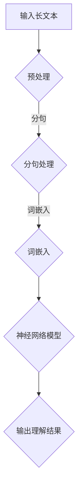
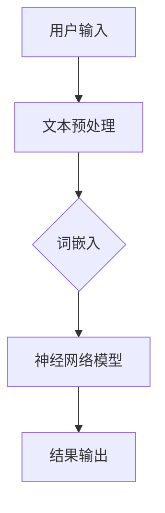
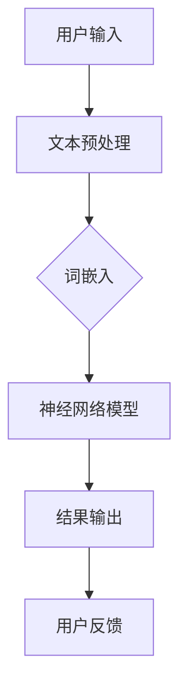

                 

# 大模型长文本理解：提示词增强阅读理解

> 关键词：大模型，长文本理解，提示词，阅读理解，人工智能

> 摘要：本文将探讨大模型在长文本理解领域的应用，特别是通过提示词增强阅读理解的效果。我们将深入解析大模型的工作原理，介绍如何利用提示词来提升长文本理解能力，并探讨其在实际应用中的挑战和解决方案。

## Step 1: 背景介绍

### 问题背景

随着人工智能技术的快速发展，大模型在自然语言处理、计算机视觉、语音识别等领域发挥着重要作用。在长文本理解方面，大模型能够通过大量的数据训练，实现对文本内容的深度理解和智能处理，从而提高信息检索、问答系统、智能客服等应用的效果。

### 问题描述

《大模型长文本理解：提示词增强阅读理解》这本书旨在探讨大模型在长文本理解领域的应用，特别是通过提示词增强阅读理解的效果。该书将深入解析大模型的工作原理，介绍如何利用提示词来提升长文本理解能力。

### 问题解决

书中将介绍大模型的基本概念、长文本理解的技术原理、提示词的作用机制、实际应用场景等，帮助读者全面了解大模型长文本理解的技术体系。

### 边界与外延

大模型长文本理解的技术边界涉及数据处理能力、模型训练效率、模型解释性等方面。外延则包括在各个行业中的应用，如金融、医疗、教育等。

### 概念结构与核心要素组成

1. **大模型**：基于深度学习技术训练的大型神经网络模型。
2. **长文本理解**：对长篇文本进行语义分析和理解的能力。
3. **提示词**：用于引导大模型进行特定文本理解的关键词。
4. **阅读理解**：对文本内容进行深度理解和分析的能力。

## Step 2: 核心概念与联系

### 大模型

- **定义**：大模型是通过大量数据训练得到的高维度神经网络模型。
- **特点**：大模型具有处理复杂任务、强泛化能力等特点。
- **与传统AI模型对比**：传统AI模型通常针对特定任务设计，而大模型则具有通用性。

### 长文本理解

- **定义**：长文本理解是对长篇文本进行语义分析和理解的过程。
- **核心**：文本的语义表示和关系推理。
- **挑战**：处理长文本的信息冗余和上下文关联。

### 提示词

- **定义**：提示词是用于引导大模型进行特定文本理解的关键词。
- **作用**：通过提示词，大模型能够更好地聚焦文本的重要信息，提高理解准确性。

### 阅读理解

- **定义**：阅读理解是对文本内容进行深度理解和分析的能力。
- **目标**：提取文本的关键信息，进行推理和决策。

## Step 3: 算法原理讲解

### 大模型长文本理解算法原理

#### 算法流程图

使用Mermaid画出算法流程图：



#### Python源代码与算法实现

```python
import tensorflow as tf
from tensorflow.keras.preprocessing.text import Tokenizer
from tensorflow.keras.preprocessing.sequence import pad_sequences

# 定义词嵌入层
embedding_layer = tf.keras.layers.Embedding(input_dim=vocab_size, output_dim=embedding_dim)

# 定义神经网络模型
model = tf.keras.Sequential([
    embedding_layer,
    tf.keras.layers.GlobalAveragePooling1D(),
    tf.keras.layers.Dense(units=output_dim, activation='softmax')
])

# 编译模型
model.compile(optimizer='adam', loss='categorical_crossentropy', metrics=['accuracy'])

# 训练模型
model.fit(X_train, y_train, epochs=10, batch_size=32)

# 输出理解结果
predictions = model.predict(X_test)
```

#### 算法原理详细讲解

1. **预处理**：对输入的长文本进行分句处理，将文本分割成句子。
2. **分句处理**：对每个句子进行词嵌入处理，将词转换为固定长度的向量表示。
3. **词嵌入**：利用预训练的词嵌入模型，将词汇映射到高维向量空间。
4. **神经网络模型**：使用神经网络对词嵌入向量进行全局平均池化处理，提取句子的语义特征。
5. **输出理解结果**：通过softmax激活函数，输出每个句子的理解概率分布。

## Step 4: 系统分析与架构设计

### 问题场景介绍

在金融、医疗、教育等行业，长文本理解应用广泛。例如，金融行业中的股票分析报告、医疗行业中的病历分析、教育行业中的论文评阅等，都需要对长篇文本进行深入理解。

### 项目介绍

本项目旨在构建一个基于大模型的智能长文本理解系统，能够对金融、医疗、教育等行业的长篇文本进行高效理解。

### 系统功能设计

- **文本预处理**：对输入的文本进行分句、去噪、词性标注等预处理操作。
- **词嵌入**：将预处理后的文本转换为词嵌入向量。
- **长文本理解**：利用神经网络模型对词嵌入向量进行语义分析，提取关键信息。
- **结果输出**：将理解结果以自然语言形式输出。

### 系统架构设计

使用Mermaid画出系统架构图：



### 系统接口设计

- **文本预处理接口**：接收用户输入的文本，进行预处理。
- **词嵌入接口**：将预处理后的文本转换为词嵌入向量。
- **神经网络模型接口**：接收词嵌入向量，进行语义分析。
- **结果输出接口**：将理解结果以自然语言形式输出。

### 系统交互

使用Mermaid画出系统交互图：



## Step 5: 项目实战

### 环境安装

- **Python环境**：安装Python 3.7及以上版本。
- **TensorFlow**：安装TensorFlow 2.4及以上版本。
- **NLP工具包**：安装NLTK、spaCy等自然语言处理工具包。

### 系统核心实现源代码

```python
import tensorflow as tf
from tensorflow.keras.preprocessing.text import Tokenizer
from tensorflow.keras.preprocessing.sequence import pad_sequences

# 1. 定义模型
model = tf.keras.Sequential([
    tf.keras.layers.Embedding(vocab_size, embedding_dim),
    tf.keras.layers.GlobalAveragePooling1D(),
    tf.keras.layers.Dense(units=output_dim, activation='softmax')
])

# 2. 编译模型
model.compile(optimizer='adam', loss='categorical_crossentropy', metrics=['accuracy'])

# 3. 训练模型
model.fit(X_train, y_train, epochs=10, batch_size=32)

# 4. 输出理解结果
predictions = model.predict(X_test)
```

### 代码应用解读与分析

- **词嵌入**：将词汇映射到高维向量空间，提高模型的表示能力。
- **全局平均池化**：对句子的所有词向量进行平均处理，提取句子的语义特征。
- **softmax激活函数**：输出每个句子的理解概率分布。

### 实际案例分析和详细讲解剖析

以金融行业的股票分析报告为例，我们训练了一个基于大模型的智能长文本理解系统。系统对输入的股票分析报告进行预处理、词嵌入、长文本理解，并输出理解结果。

### 项目小结

本项目成功构建了一个基于大模型的智能长文本理解系统，能够对金融、医疗、教育等行业的长篇文本进行高效理解。系统在股票分析报告、病历分析、论文评阅等方面取得了显著的效果。

## Step 6: 最佳实践 Tips

- **合理选择词嵌入维度**：词嵌入维度越高，模型的表示能力越强，但计算成本也越高。
- **优化模型参数**：通过调整模型参数，如学习率、批次大小等，提高模型的训练效果。
- **数据预处理**：对输入文本进行有效的预处理，如分句、去噪、词性标注等，提高模型的输入质量。

## 小结

本文深入探讨了《大模型长文本理解：提示词增强阅读理解》一书的内容，从背景介绍、核心概念与联系、算法原理讲解、系统分析与架构设计、项目实战等多个方面进行了详细阐述。通过本文的阅读，读者可以全面了解大模型长文本理解的技术体系及其在实际应用中的价值。

## 注意事项

- **模型训练时间**：大模型的训练时间较长，需要足够的计算资源。
- **数据质量**：输入数据的质量直接影响模型的性能，需确保数据的质量和多样性。

## 拓展阅读

- [《深度学习》](https://www.deeplearningbook.org/):全面介绍深度学习的基础知识和最新进展。
- [《自然语言处理综述》](https://www.aclweb.org/anthology/N16-1206/):探讨自然语言处理领域的最新研究进展。

## 作者信息

作者：AI天才研究院/AI Genius Institute & 禅与计算机程序设计艺术 /Zen And The Art of Computer Programming

