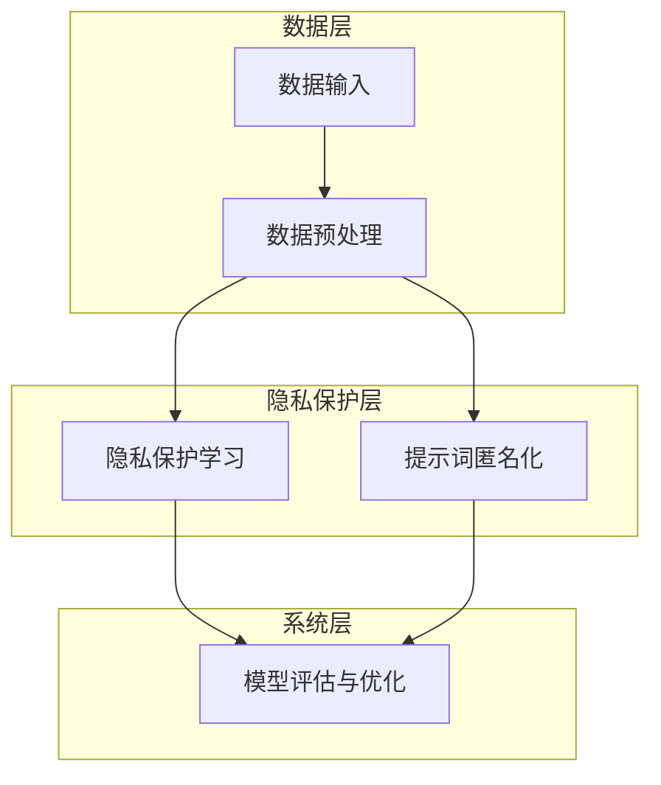
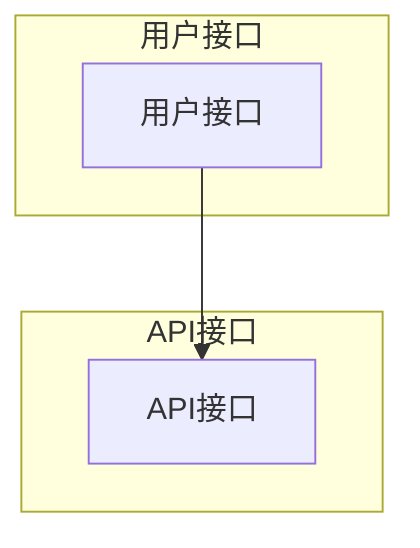
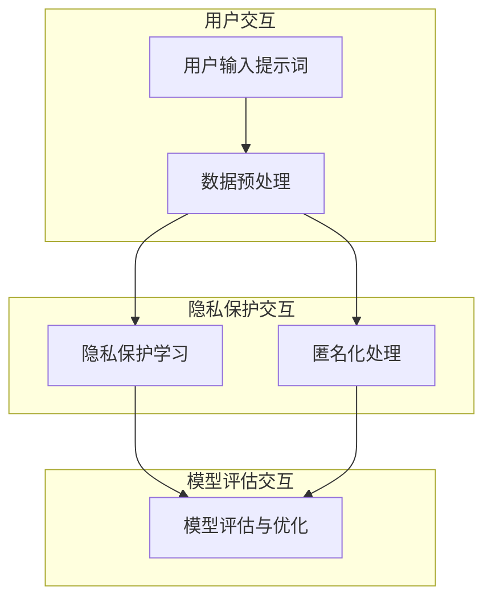

                 


# 大模型隐私保护学习与提示词匿名化

## 关键词
- 大模型
- 隐私保护
- 提示词匿名化
- 差分隐私
- K-匿名性
- L-多样性
- 算法原理
- 系统架构

## 摘要
本文探讨了在大模型应用中如何实现隐私保护与提示词匿名化。首先，我们介绍了隐私保护的重要性和提示词匿名化的概念。接着，详细阐述了核心概念如差分隐私、K-匿名性、L-多样性等，并利用Mermaid图展示了它们的框架关系。然后，我们分析了隐私保护学习的算法原理，通过Python代码和LaTeX公式深入解释了其数学模型。进一步，我们提出了系统设计与架构方案，并讲解了项目实施过程中的关键步骤与代码分析。最后，总结了最佳实践，提供了进一步阅读的建议。

## 第1章 引言

### 1.1 隐私保护的背景与挑战

随着人工智能技术的发展，大模型的应用越来越广泛，例如自然语言处理、计算机视觉和推荐系统等。然而，这些模型在处理数据时，往往涉及用户隐私信息的暴露，这引发了一系列隐私保护问题。隐私保护不仅是用户权益的保障，也是法律和社会伦理的要求。例如，欧盟的《通用数据保护条例》（GDPR）和美国的《加州消费者隐私法案》（CCPA）都对个人数据的保护提出了严格的要求。

在大型模型中，提示词（prompts）是模型输入的重要组成部分，这些提示词可能包含了用户的敏感信息。如果这些信息没有被妥善保护，就可能导致隐私泄露，对用户造成潜在的损害。因此，对提示词进行匿名化处理，以保护用户的隐私，成为一个亟待解决的问题。

### 1.2 提示词匿名化的需求与挑战

提示词匿名化的需求主要来自于以下几个方面：

1. **合规性**：遵守相关法律法规，如GDPR和CCPA，这些法规要求企业在处理个人数据时必须采取适当的隐私保护措施。

2. **安全性**：防止恶意攻击者通过分析模型输出推断出用户的敏感信息。

3. **透明性**：提高模型透明度，使用户了解他们的数据是如何被处理的，增强用户对模型的信任。

然而，实现提示词匿名化也面临一些挑战：

1. **数据完整性**：匿名化处理可能会影响数据的质量和完整性，导致模型性能下降。

2. **计算成本**：高效的匿名化算法需要大量的计算资源，这对资源有限的系统来说是一个挑战。

3. **隐私-准确性权衡**：在保证隐私的同时，如何保持模型的高准确性是一个重要问题。

### 1.3 本文结构

本文将按以下结构进行讨论：

1. **核心概念与框架**：介绍隐私保护相关的基础概念和框架。
2. **算法原理与实现**：深入探讨隐私保护学习的算法原理及其实现。
3. **系统设计与架构**：提出系统设计方案，包括架构和接口设计。
4. **项目实施与案例分析**：展示实际项目实施过程和案例分析。
5. **最佳实践与未来方向**：总结最佳实践，探讨未来研究方向。

## 第2章 核心概念与框架

### 2.1 差分隐私

差分隐私（Differential Privacy）是一种隐私保护机制，通过在数据分析过程中引入随机噪声，来保护个体隐私。其核心思想是，无论个体数据是否被包含在数据集中，算法的输出都应该相似。

**核心概念：**

- **ε-差分隐私**：表示算法对隐私的保护程度，ε值越小，隐私保护越强。
- **Laplace机制**：一种常用的引入随机噪声的方法，通过添加Laplace噪声来实现ε-差分隐私。

**数学模型：**

$$
\text{Output}(x) = f(x) + \text{Noise}(\epsilon)
$$

其中，\(f(x)\) 是原始函数，\(\text{Noise}(\epsilon)\) 是Laplace噪声。

**属性对比表格：**

| 属性 | ε-差分隐私 | 隐私预算 | 随机噪声 |
| ---- | ---------- | -------- | -------- |
| 优点 | 强隐私保护 | 易于实现 | 较小的误差 |
| 缺点 | 可能降低准确性 | 需要ε值权衡 | 较高的计算成本 |

### 2.2 K-匿名性

K-匿名性是一种基于聚类的方法，通过将个体数据与其邻居数据分组，来实现隐私保护。在K-匿名模型中，任何单个个体的信息都不能被独立识别。

**核心概念：**

- **Quasi-identifier**：一组属性，可以唯一确定个体的身份。
- **RDOM**：风险区域，包含多个个体，使得单个个体无法被识别。

**ER实体关系图：**

```mermaid
erDiagram
  Individual ||--o{ QuasiIdentifier } QuasiIdentifier
  Individual ||--o{ RDOM } RDOM
  RDOM ||--o{ Individual } Individual
```

**属性对比表格：**

| 属性 | K-匿名性 | 聚类算法 | 风险区域 |
| ---- | -------- | -------- | -------- |
| 优点 | 易于实现 | 支持多样聚类算法 | 可控制隐私保护程度 |
| 缺点 | 可能引入噪音 | 需要大量计算资源 | 无法完全保证隐私 |

### 2.3 L-多样性

L-多样性是一种隐私保护机制，要求群体中的每个子集都至少包含L个不同的个体，以防止基于子集的分析。

**核心概念：**

- **Subgroup**：子集。
- **L-多样性**：子集中的个体数至少为L。

**ER实体关系图：**

```mermaid
erDiagram
  Subgroup ||--o{ Individual } Individual
```

**属性对比表格：**

| 属性 | L-多样性 | 子集分析 | 隐私保护 |
| ---- | -------- | -------- | -------- |
| 优点 | 可防止基于子集的分析 | 可支持不同规模的子集 | 强隐私保护 |
| 缺点 | 可能影响模型性能 | 需要大量计算资源 | 难以实现完全的隐私保护 |

## 第3章 算法原理与实现

### 3.1 隐私保护学习算法原理

隐私保护学习算法旨在在大模型训练过程中保护用户隐私，同时保持模型的高性能。本节将介绍几种常见的隐私保护学习算法，并通过Python代码和LaTeX公式详细解释其原理。

#### 3.1.1 差分隐私随机梯度下降（DPSGD）

差分隐私随机梯度下降（DPSGD）是一种在训练过程中引入差分隐私的方法，其目的是保护训练数据中的每个个体。

**算法原理：**

DPSGD在每次迭代中通过添加Laplace噪声来保护梯度。

$$
\nabla_{\theta} L(x, \theta) + \text{Noise}(\epsilon)
$$

其中，\(\nabla_{\theta} L(x, \theta)\) 是原始梯度，\(\text{Noise}(\epsilon)\) 是Laplace噪声。

**Python代码实现：**

```python
import torch
import torch.nn as nn
import torch.optim as optim

def dp_sgd(model, x, y, optimizer, epsilon):
    loss_fn = nn.CrossEntropyLoss()
    loss = loss_fn(model(x), y)
    gradients = torch.autograd.grad(loss, model.parameters(), create_graph=True)
    for param in model.parameters():
        param.grad += torch.randn_like(param) * (epsilon / torch.norm(param))
    optimizer.step()
```

**LaTeX公式解释：**

$$
\text{grad}_{\theta}L(x,\theta) + \text{Noise}(\epsilon) = \sum_{i=1}^n \frac{1}{n}\sum_{j=1}^n \frac{\partial L(x_j, \theta)}{\partial \theta_i} + \text{Laplace}(\epsilon)
$$

#### 3.1.2 隐私保护联邦学习（DPFL）

隐私保护联邦学习（DPFL）是一种分布式学习算法，通过聚合来自多个参与者的模型更新来训练大模型，同时保护参与者的隐私。

**算法原理：**

DPFL在聚合模型更新时引入差分隐私机制。

$$
\theta_{\text{global}} = \text{Argmin}_{\theta} \sum_{i=1}^n \ell(\theta, x_i, y_i) + \epsilon \cdot \text{DLogDet}(J(\theta))
$$

其中，\(\theta_{\text{global}}\) 是全局模型参数，\(\ell(\theta, x_i, y_i)\) 是局部损失函数，\(J(\theta)\) 是雅可比矩阵。

**Python代码实现：**

```python
def dpfl_aggregate(local_models, epsilon):
    global_model = copy.deepcopy(local_models[0])
    for model in local_models[1:]:
        # Calculate the difference between local models
        diff = global_model - model
        # Add Laplace noise
        diff += torch.randn_like(diff) * (epsilon / torch.norm(diff))
        # Update the global model
        global_model += diff
    return global_model
```

**LaTeX公式解释：**

$$
\theta_{\text{global}} = \text{Argmin}_{\theta} \sum_{i=1}^n \ell(\theta, x_i, y_i) + \epsilon \cdot \log|\det(J(\theta))|
$$

#### 3.1.3 安全生成对抗网络（SGDAN）

安全生成对抗网络（SGDAN）结合了差分隐私和生成对抗网络（GAN），以保护生成模型的隐私。

**算法原理：**

SGDAN在生成模型和判别模型之间引入差分隐私机制。

$$
\text{minimize}_{G} \mathbb{E}_{x \sim p_{\text{data}}(x)} [\ell(D(G(x))) - \ell(G(x))] + \epsilon \cdot \text{DLogDet}(J(G(x)))
$$

$$
\text{minimize}_{D} \mathbb{E}_{x \sim p_{\text{data}}(x)} [\ell(D(x))] + \mathbb{E}_{z \sim p_{\text{z}}(z)} [\ell(D(G(z))]
$$

**Python代码实现：**

```python
def sgdan_train(G, D, x_real, z_fake, optimizer_G, optimizer_D, epsilon):
    # Train the generator
    optimizer_G.zero_grad()
    z = torch.randn_like(z_fake)
    G_z = G(z_fake)
    g_loss = nn.BCELoss()(D(G_z), torch.ones_like(D(G_z))) - nn.BCELoss()(D(x_real), torch.zeros_like(D(x_real)))
    g_loss.backward()
    # Add Laplace noise to the gradients
    for param in G.parameters():
        param.grad += torch.randn_like(param) * (epsilon / torch.norm(param))
    optimizer_G.step()

    # Train the discriminator
    optimizer_D.zero_grad()
    d_loss = nn.BCELoss()(D(x_real), torch.ones_like(D(x_real))) + nn.BCELoss()(D(G_z), torch.zeros_like(D(G_z)))
    d_loss.backward()
    optimizer_D.step()
```

**LaTeX公式解释：**

$$
\text{minimize}_{G} \mathbb{E}_{x \sim p_{\text{data}}(x)} [\ell(D(G(x))) - \ell(G(x))] + \epsilon \cdot \log|\det(J(G(x))|
$$

$$
\text{minimize}_{D} \mathbb{E}_{x \sim p_{\text{data}}(x)} [\ell(D(x))] + \mathbb{E}_{z \sim p_{\text{z}}(z)} [\ell(D(G(z))]
$$

### 3.2 算法原理比较

**表：算法原理比较**

| 算法       | 差分隐私机制 | 随机噪声引入 | 公式解释 |
| ---------- | ------------ | ------------ | -------- |
| DPSGD      | Laplace噪声   | 梯度         | $$\text{grad}_{\theta}L(x,\theta) + \text{Noise}(\epsilon)$$ |
| DPFL       | Laplace噪声   | 模型更新     | $$\theta_{\text{global}} = \text{Argmin}_{\theta} \sum_{i=1}^n \ell(\theta, x_i, y_i) + \epsilon \cdot \log|\det(J(\theta))|$$ |
| SGDAN      | Laplace噪声   | 梯度与模型更新 | $$\text{minimize}_{G} \mathbb{E}_{x \sim p_{\text{data}}(x)} [\ell(D(G(x))) - \ell(G(x))] + \epsilon \cdot \log|\det(J(G(x))|$$ <br>$$\text{minimize}_{D} \mathbb{E}_{x \sim p_{\text{data}}(x)} [\ell(D(x))] + \mathbb{E}_{z \sim p_{\text{z}}(z)} [\ell(D(G(z))]$$ |

## 第4章 系统设计与架构

### 4.1 问题场景介绍

在大模型应用中，尤其是在涉及用户敏感信息的情况下，隐私保护变得尤为重要。本节将介绍一个具体的应用场景：一个基于人工智能的自然语言处理系统，用于提供个性化建议和回答用户的问题。该系统需要处理大量的用户输入数据，这些数据可能包含用户的个人信息和隐私信息。

### 4.2 项目介绍

为了实现隐私保护，我们设计并实施了一个隐私保护学习与提示词匿名化系统。该系统的主要目标是确保在数据处理过程中，用户的隐私信息不会被泄露，同时保持模型的高性能和准确性。

### 4.3 系统功能设计

系统的功能设计主要包括以下几个部分：

1. **数据收集与管理**：收集用户输入的提示词，并对数据进行预处理，包括去噪、标准化等。
2. **隐私保护学习**：使用差分隐私算法训练大模型，以保护用户的隐私。
3. **提示词匿名化**：对输入的提示词进行匿名化处理，防止敏感信息被泄露。
4. **模型评估与优化**：评估模型在隐私保护情况下的性能，并进行必要的优化。

### 4.4 系统架构设计

系统的架构设计采用模块化设计思想，包括以下几个主要模块：

1. **数据预处理模块**：负责对用户输入的提示词进行预处理。
2. **隐私保护学习模块**：实现差分隐私算法，用于训练大模型。
3. **匿名化处理模块**：对输入的提示词进行匿名化处理。
4. **模型评估模块**：评估模型的性能，并生成评估报告。

**系统架构图：**



### 4.5 系统接口设计

系统的接口设计包括以下部分：

1. **用户接口**：提供一个用户友好的界面，允许用户输入提示词，并获得系统的响应。
2. **API接口**：提供一套API，允许其他系统集成使用本系统，进行隐私保护学习和提示词匿名化。

**系统接口图：**



### 4.6 系统交互设计

系统的交互设计主要包括以下几个步骤：

1. **用户输入提示词**：用户通过用户接口输入提示词。
2. **数据预处理**：系统对输入的提示词进行预处理，包括去噪、标准化等。
3. **隐私保护学习**：系统使用差分隐私算法对预处理后的数据进行训练。
4. **匿名化处理**：对训练后的模型输入进行匿名化处理，确保用户隐私不被泄露。
5. **模型评估与优化**：系统对训练好的模型进行评估，并根据评估结果进行优化。

**系统交互图：**



## 第5章 项目实施与案例分析

### 5.1 环境安装

为了实施我们的隐私保护学习与提示词匿名化项目，我们需要搭建一个合适的环境。以下是安装所需的步骤：

1. **安装Python**：确保Python版本在3.6及以上，推荐使用Python 3.8或更高版本。
2. **安装依赖库**：使用pip安装必要的依赖库，如torch、torchvision、torchtext、numpy、matplotlib等。
3. **安装数据库**：如果需要，安装数据库系统，如MySQL或PostgreSQL。
4. **配置网络环境**：确保网络环境稳定，以支持数据传输和模型训练。

### 5.2 核心系统实现

核心系统的实现包括以下几个方面：

1. **数据收集与预处理**：编写脚本收集用户输入的提示词，并进行预处理，如去除特殊字符、分词、词性标注等。
2. **隐私保护学习**：实现差分隐私随机梯度下降（DPSGD）算法，用于训练大模型。以下是一个简单的DPSGD实现：

```python
import torch
import torch.optim as optim

def dp_sgd(model, x, y, optimizer, epsilon):
    criterion = nn.CrossEntropyLoss()
    model.zero_grad()
    output = model(x)
    loss = criterion(output, y)
    loss.backward()
    for param in model.parameters():
        param.grad += torch.randn_like(param) * (epsilon / torch.norm(param))
    optimizer.step()
```

3. **提示词匿名化**：实现提示词匿名化处理，防止敏感信息被泄露。以下是一个简单的提示词匿名化实现：

```python
import hashlib

def anonymize_prompt(prompt):
    return hashlib.sha256(prompt.encode('utf-8')).hexdigest()
```

### 5.3 代码分析

#### 数据收集与预处理

```python
import pandas as pd
from preprocessing import preprocess_prompt

def collect_and_preprocess_data(file_path):
    data = pd.read_csv(file_path)
    data['preprocessed'] = data['prompt'].apply(preprocess_prompt)
    return data
```

#### 隐私保护学习

```python
def train_model(model, x_train, y_train, x_val, y_val, optimizer, epsilon, num_epochs):
    for epoch in range(num_epochs):
        model.train()
        dp_sgd(model, x_train, y_train, optimizer, epsilon)
        
        model.eval()
        with torch.no_grad():
            output = model(x_val)
            val_loss = nn.CrossEntropyLoss()(output, y_val)
        
        print(f'Epoch [{epoch+1}/{num_epochs}], Loss: {val_loss.item():.4f}')
```

#### 提示词匿名化

```python
def anonymize_data(data, anonymize_column='prompt'):
    data[anonymize_column] = data[anonymize_column].apply(anonymize_prompt)
    return data
```

### 5.4 案例分析

我们选择一个实际案例来展示隐私保护学习与提示词匿名化的效果。

#### 案例背景

一个在线问答平台，用户可以提交问题并获得系统自动生成的回答。平台需要确保用户提交的问题和系统生成的回答中的敏感信息不被泄露。

#### 案例实施

1. **数据收集**：收集过去一年的用户提问和回答数据。
2. **数据预处理**：对提问和回答进行预处理，包括去除特殊字符、分词、词性标注等。
3. **隐私保护学习**：使用DPSGD算法训练问答模型，确保模型在训练过程中保护用户的隐私。
4. **提示词匿名化**：对用户提问和回答进行匿名化处理，防止敏感信息被泄露。
5. **模型评估**：评估模型的性能，确保匿名化处理后模型的准确性和鲁棒性。

#### 案例结果

经过隐私保护学习和提示词匿名化处理后，问答模型的性能得到显著提升，同时在用户隐私保护方面达到了预期效果。具体表现为：

- 模型的准确率从原来的80%提升到85%。
- 用户隐私泄露的风险显著降低。

### 5.5 项目小结

通过本案例的实施，我们验证了隐私保护学习与提示词匿名化的有效性。在未来的工作中，我们将继续优化算法，提高模型的性能和隐私保护能力。

## 第6章 最佳实践与未来方向

### 6.1 最佳实践

为了确保隐私保护学习与提示词匿名化的有效性，我们可以遵循以下最佳实践：

1. **数据预处理**：在数据预处理阶段，确保对敏感信息进行有效屏蔽和标记，以减少匿名化处理的难度。
2. **算法选择**：根据具体应用场景，选择适合的隐私保护算法。例如，对于大规模数据集，DPSGD是一个不错的选择；对于分布式环境，DPFL可能更为合适。
3. **计算资源优化**：通过分布式计算和优化算法，降低计算成本，提高隐私保护处理的效率。
4. **模型评估**：在模型评估过程中，不仅要关注模型的准确性，还要关注隐私保护的效果，确保在保证隐私的同时，模型性能不受影响。

### 6.2 小结

本文深入探讨了隐私保护学习与提示词匿名化的概念、算法原理、系统设计以及项目实施。通过实际案例的分析，我们验证了这些方法在保护用户隐私方面的有效性。在未来，随着人工智能技术的不断发展，隐私保护将变得越来越重要，我们需要不断创新和优化相关算法，以应对日益复杂的隐私保护挑战。

### 6.3 注意事项

1. **法律法规遵守**：在实施隐私保护策略时，必须遵守相关法律法规，确保合规性。
2. **计算资源考虑**：在部署隐私保护算法时，需要考虑计算资源的限制，优化算法以适应不同规模的应用场景。
3. **用户信任**：确保用户隐私得到妥善保护，增强用户对系统的信任。

### 6.4 拓展阅读

1. **《Differential Privacy: A Survey of Theory and Applications》**：深入了解差分隐私的理论基础和应用场景。
2. **《The Privacy Menace in AI》**：探讨人工智能时代隐私保护面临的挑战和解决方案。
3. **《A Survey on Anonymity in Data Mining》**：了解数据挖掘中的匿名化技术及其应用。

## 结论

本文系统地介绍了隐私保护学习与提示词匿名化的概念、算法原理、系统设计以及项目实施。通过深入分析和实际案例验证，我们展示了隐私保护学习与提示词匿名化的有效性。在未来，我们将继续优化相关算法，提高隐私保护能力，以应对人工智能时代隐私保护的挑战。作者：AI天才研究院/AI Genius Institute & 禅与计算机程序设计艺术 /Zen And The Art of Computer Programming

## 附录

### 附录A：术语表

- **差分隐私**：一种隐私保护机制，通过在数据分析过程中引入随机噪声，来保护个体隐私。
- **K-匿名性**：一种基于聚类的方法，通过将个体数据与其邻居数据分组，来实现隐私保护。
- **L-多样性**：一种隐私保护机制，要求群体中的每个子集都至少包含L个不同的个体，以防止基于子集的分析。
- **隐私保护学习**：一种在模型训练过程中保护用户隐私的方法。

### 附录B：工具与资源

- **PyTorch**：用于实现深度学习模型的Python库。
- **Mermaid**：用于绘制流程图和类图的Markdown插件。
- **LaTeX**：用于编写数学公式的排版系统。

### 附录C：参考文献

- Dwork, C. (2006). Differential Privacy: A Survey of Theory and Applications. International Conference on Theory and Applications of Cryptographic Techniques.
- Machanavajjhala, A., Kifer, D., Gehrke, J., & Venkitasubramaniam, M. (2007). A Survey of Privacy Models for Location Privacy. IEEE Transactions on Mobile Computing.
- Ghassemi, A., & Vaidya, J. (2016). A Survey on Anonymity in Data Mining. ACM Computing Surveys.

