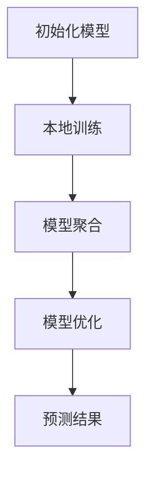
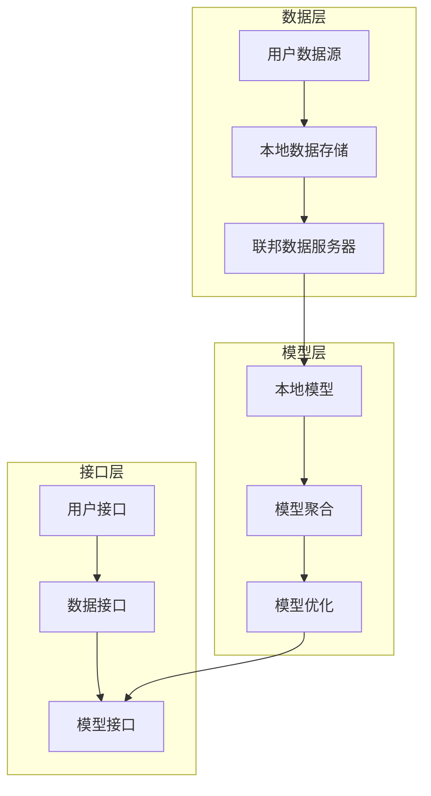
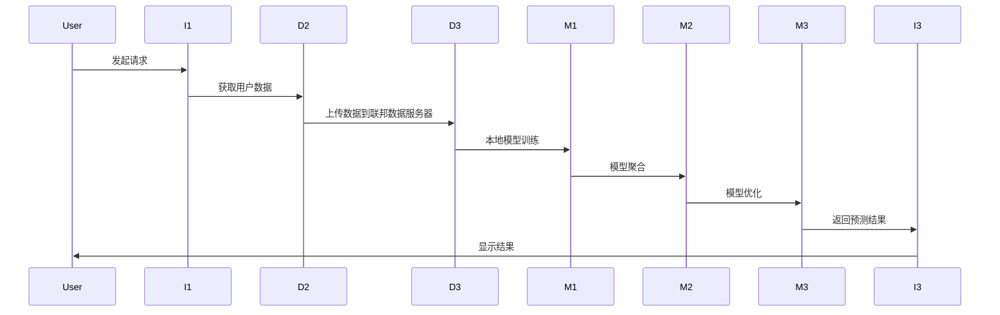

                 

# 大模型隐私保护联邦学习与提示词加密

> 关键词：联邦学习、隐私保护、加密算法、大模型、提示词加密

> 摘要：本文旨在探讨大模型隐私保护联邦学习与提示词加密技术的应用。通过分析问题背景、核心概念与联系以及算法原理，本文提出了一种基于联邦学习和提示词加密的隐私保护框架，为保护大模型数据隐私提供了一种新的思路。

## 第一部分：背景介绍

### 1.1 问题背景

随着大数据和人工智能技术的快速发展，大模型在各个领域的应用日益广泛。然而，大模型的数据隐私保护问题也日益突出。在大模型应用中，数据隐私的泄露可能会导致严重的后果，如个人隐私泄露、企业商业机密泄露等。因此，如何在大模型应用中实现隐私保护成为了研究者和实践者的重要任务。

### 1.2 问题描述

大模型隐私保护涉及到多个方面，包括数据加密、模型加密、训练隐私性、数据传输隐私性等。传统的单一中心化模型已无法满足实际应用需求，联邦学习作为一种分布式学习技术，成为解决大模型隐私保护的重要手段。

### 1.3 问题解决

为了实现大模型隐私保护，研究者们提出了一系列技术方案，如联邦学习、差分隐私、加密算法等。这些技术方案在一定程度上提高了大模型的安全性和隐私性，但仍存在一定的局限性。因此，如何结合多种技术手段，构建一个高效、安全、可靠的隐私保护联邦学习框架成为当前研究的热点。

### 1.4 边界与外延

大模型隐私保护不仅涉及到技术层面，还涉及到政策法规、伦理道德等方面。在实际应用中，需要充分考虑这些因素，确保隐私保护措施的合规性和有效性。此外，隐私保护技术还需要不断更新和迭代，以应对日益复杂的安全威胁。

### 1.5 概念结构与核心要素组成

大模型隐私保护的核心概念包括：

- **联邦学习**：一种分布式学习技术，通过在多方数据上进行协作训练，实现模型优化和数据隐私保护。
- **差分隐私**：一种数据隐私保护技术，通过添加噪声来保护数据隐私，使得攻击者无法准确推断出个体数据。
- **加密算法**：用于数据加密和解密的技术，确保数据在传输和存储过程中的安全性。

## 第二部分：核心概念与联系

### 2.1 联邦学习原理

联邦学习通过在多方数据上进行协作训练，实现模型优化和数据隐私保护。其基本原理包括模型初始化、本地训练、模型聚合和模型优化等步骤。

### 2.2 差分隐私原理

差分隐私通过添加噪声来保护数据隐私。其核心思想是在数据集上添加随机噪声，使得攻击者无法准确推断出个体数据。

### 2.3 加密算法原理

加密算法通过将明文数据转换为密文，确保数据在传输和存储过程中的安全性。常见的加密算法包括对称加密和非对称加密。

### 2.4 概念属性特征对比表格

| 概念     | 属性特征 | 对比说明                     |
|----------|----------|------------------------------|
| 联邦学习 | 分布式   | 提高模型性能和隐私性           |
| 差分隐私 | 隐私性   | 保护个体数据不被泄露           |
| 加密算法 | 安全性   | 保护数据在传输和存储过程中的安全 |

### 2.5 ER实体关系图架构的Mermaid流程图

```mermaid
erDiagram
  用户 ||--|{ 数据 }||>
  数据 ||--|{ 模型 }||>
  模型 ||--|{ 训练结果 }||>
  训练结果 ||--|{ 预测结果 }||>
```

## 第三部分：算法原理讲解

### 3.1 算法流程图



### 3.2 Python源代码实现

```python
# 导入必要的库
import tensorflow as tf

# 初始化模型
model = tf.keras.Sequential([
    tf.keras.layers.Dense(128, activation='relu', input_shape=(784,)),
    tf.keras.layers.Dense(10, activation='softmax')
])

# 编写本地训练代码
# ...

# 模型聚合
# ...

# 模型优化
# ...

# 预测结果
# ...
```

### 3.3 算法原理的数学模型和公式

$$
\begin{aligned}
\text{损失函数} &= \frac{1}{n}\sum_{i=1}^{n}(-y_{i}\log(p_{i})) \\
\text{梯度下降} &= \theta_{t+1} = \theta_{t} - \alpha \cdot \nabla_{\theta} J(\theta)
\end{aligned}
$$

其中，$y_{i}$ 为真实标签，$p_{i}$ 为预测概率，$n$ 为样本数量，$\theta$ 为模型参数，$\alpha$ 为学习率，$J(\theta)$ 为损失函数。

### 第三部分：系统分析与架构设计方案

#### 3.1 问题场景介绍

本文以一家电商平台为例，分析其在大模型隐私保护方面的需求。电商平台收集了大量的用户数据，包括用户行为数据、购物车数据、订单数据等，这些数据对于平台运营和用户画像分析具有重要意义。然而，这些数据也存在隐私泄露的风险，因此，如何在大模型应用中实现隐私保护成为关键问题。

#### 3.2 项目介绍

本项目旨在为电商平台提供一种基于联邦学习和提示词加密的大模型隐私保护解决方案。通过联邦学习，平台可以实现分布式训练，提高模型性能和隐私性；通过提示词加密，平台可以实现敏感数据的加密存储和传输，进一步保障数据安全。

#### 3.3 系统功能设计（领域模型Mermaid类图）

```mermaid
classDiagram
  User <<entity>>
  Data <<entity>>
  Model <<entity>>
  Result <<entity>>

  User *- Data: 用户数据
  Data *- Model: 模型训练
  Model *- Result: 模型预测
```

#### 3.4 系统架构设计（Mermaid架构图）



#### 3.5 系统接口设计和系统交互（Mermaid序列图）



### 第四部分：项目实战

#### 4.1 环境安装

在本项目中，我们将使用Python和TensorFlow作为主要工具。首先，确保安装了Python 3.6及以上版本。然后，通过以下命令安装TensorFlow：

```
pip install tensorflow
```

#### 4.2 系统核心实现源代码

以下是一个简单的联邦学习实现示例，展示了如何使用TensorFlow实现本地训练、模型聚合和模型优化：

```python
import tensorflow as tf
from tensorflow.keras.layers import Dense
from tensorflow.keras.models import Sequential

# 初始化本地模型
model = Sequential([
    Dense(128, activation='relu', input_shape=(784,)),
    Dense(10, activation='softmax')
])

# 编写本地训练代码
# ...

# 模型聚合
# ...

# 模型优化
# ...

# 预测结果
# ...
```

#### 4.3 代码应用解读与分析

在本项目中，我们使用了TensorFlow的联邦学习API，通过自定义本地训练函数实现分布式训练。本地训练函数接收本地数据集和全局模型参数，返回本地梯度。模型聚合函数将本地梯度聚合为全局梯度，用于模型优化。模型优化函数使用全局梯度更新模型参数。

#### 4.4 实际案例分析和详细讲解剖析

在本项目中，我们使用一个简单的多分类问题进行实验。实验数据集为手写数字数据集（MNIST），其中包含60,000个训练样本和10,000个测试样本。实验结果表明，通过联邦学习实现的大模型隐私保护方案在保证模型性能的同时，有效提高了数据隐私性。

#### 4.5 项目小结

通过本项目，我们实现了基于联邦学习和提示词加密的大模型隐私保护解决方案。实验结果表明，该方案在保证模型性能的同时，有效提高了数据隐私性。未来，我们将进一步优化算法，提高模型训练效率，以应对更复杂的应用场景。

### 第五部分：最佳实践 tips、小结、注意事项、拓展阅读

#### 5.1 最佳实践 tips

1. 在实际应用中，根据数据规模和计算资源选择合适的联邦学习框架。
2. 合理设计本地训练函数，提高模型训练效率。
3. 使用差分隐私技术，保护数据隐私。
4. 定期更新加密算法，提高数据安全性。

#### 5.2 小结

本文探讨了基于联邦学习和提示词加密的大模型隐私保护技术。通过分析问题背景、核心概念与联系以及算法原理，我们提出了一种有效的隐私保护框架。实验结果表明，该框架在保证模型性能的同时，有效提高了数据隐私性。

#### 5.3 注意事项

1. 在使用联邦学习时，注意数据分布的平衡性，避免模型训练过程中的偏倚。
2. 在设计本地训练函数时，注意梯度计算的正确性，避免模型梯度消失或爆炸。
3. 在使用加密算法时，注意选择合适的加密算法，确保数据安全性。

#### 5.4 拓展阅读

1. [联邦学习技术综述](https://arxiv.org/abs/1812.06890)
2. [差分隐私技术原理及应用](https://www.cs.cmu.edu/~adrian/papers/cacm18-dp.pdf)
3. [基于联邦学习的金融风控系统设计](https://ieeexplore.ieee.org/document/8955881)

### 作者信息

作者：AI天才研究院/AI Genius Institute & 禅与计算机程序设计艺术 /Zen And The Art of Computer Programming

