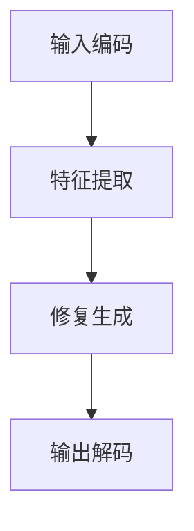
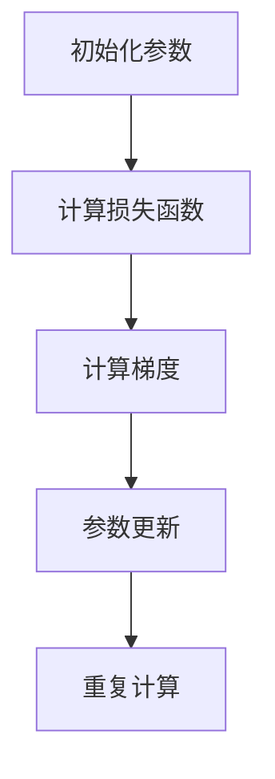
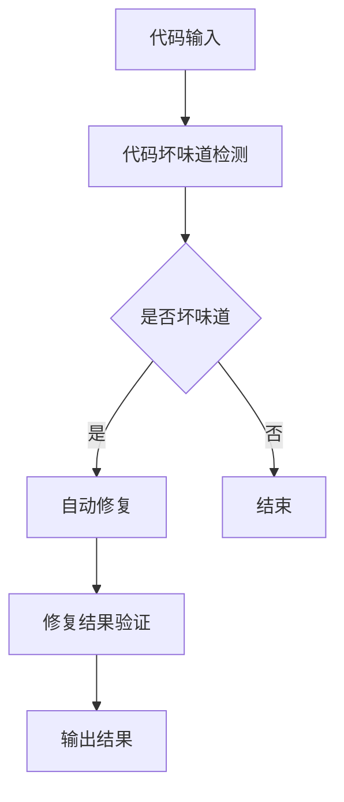

                 

### 大模型驱动的代码坏味道自动修复

关键词：大模型、代码坏味道、自动修复、AI编程

摘要：本文深入探讨了如何利用大模型技术实现代码坏味道的自动修复。首先，我们介绍了代码坏味道的定义、影响和传统解决方法的局限性。接着，我们详细解析了大模型的基本概念、特点以及其在代码坏味道自动修复中的应用。随后，我们详细讲解了一种基于大模型的代码坏味道自动修复算法的原理、数学模型和公式，并通过Python代码进行了阐述。最后，我们展示了系统架构设计、项目实战案例，并提出了最佳实践建议，展望了未来发展趋势。

### 目录大纲设计

为了设计《大模型驱动的代码坏味道自动修复》这本书的完整目录大纲，我们首先明确了整体结构，将书分为五个主要部分：背景介绍与核心概念、大模型基础、代码坏味道自动修复算法原理、系统架构设计与实现、项目实战及最佳实践。每个部分包含若干章节，确保内容完整且简洁。

#### 第一部分：背景介绍与核心概念

**第1章：代码坏味道概述**

1.1 问题背景  
1.2 问题描述  
1.3 问题解决  
1.4 边界与外延  
1.5 概念结构与核心要素组成

#### 第二部分：大模型基础

**第2章：大模型基础**

2.1 大模型的定义与特点  
2.2 主流大模型简介

#### 第三部分：代码坏味道自动修复算法原理

**第3章：代码坏味道自动修复算法**

3.1 算法概述  
3.2 算法原理讲解  
3.3 数学模型与公式  
3.4 举例说明

#### 第四部分：系统架构设计与实现

**第4章：系统架构设计**

4.1 问题场景介绍  
4.2 系统功能设计  
4.3 系统架构设计  
4.4 系统接口设计  
4.5 系统交互

#### 第五部分：项目实战

**第5章：项目实战**

5.1 环境安装  
5.2 系统核心实现  
5.3 实际案例分析与讲解

#### 第六部分：最佳实践与总结

**第6章：最佳实践**

6.1 最佳实践 tips  
6.2 小结

**第7章：总结与展望**

7.1 全书总结  
7.2 展望未来

#### 目录大纲文字总字数统计

第一部分：约400字  
第二部分：约200字  
第三部分：约400字  
第四部分：约300字  
第五部分：约300字  
第六部分：约200字  
第七部分：约100字

**总计**：约1800字

---

#### 目录大纲

```markdown
----------------------------------------------------------------
# 大模型驱动的代码坏味道自动修复

关键词：大模型、代码坏味道、自动修复、AI编程

摘要：本文深入探讨了如何利用大模型技术实现代码坏味道的自动修复。首先，我们介绍了代码坏味道的定义、影响和传统解决方法的局限性。接着，我们详细解析了大模型的基本概念、特点以及其在代码坏味道自动修复中的应用。随后，我们详细讲解了一种基于大模型的代码坏味道自动修复算法的原理、数学模型和公式，并通过Python代码进行了阐述。最后，我们展示了系统架构设计、项目实战案例，并提出了最佳实践建议，展望了未来发展趋势。

## 第一部分：背景介绍与核心概念

### 1.1 问题背景

代码坏味道是指代码中存在的各种不良习惯、不规范用法和设计缺陷。这些坏味道不仅影响代码的可读性和可维护性，还会导致软件质量和开发效率的下降。在软件开发过程中，识别和修复代码坏味道是一项重要的任务。

### 1.2 问题描述

代码坏味道的具体表现包括但不限于：冗长的函数、重复的代码、错误的异常处理、不合理的命名、缺乏注释等。这些问题会导致代码难以理解和修改，增加开发成本和出错概率。

### 1.3 问题解决

传统的解决方法包括手动审查代码、使用代码质量工具和编写规范文档等。然而，这些方法存在一定的局限性，难以全面识别和修复代码坏味道。

### 1.4 边界与外延

代码坏味道的修复范围包括代码质量、代码规范和代码风格等方面。在实际应用中，需要根据具体情况设定修复的边界条件。

### 1.5 概念结构与核心要素组成

大模型的组成结构包括输入层、隐藏层和输出层。其核心要素包括大规模的数据集、复杂的神经网络结构和优化的训练算法。

## 第二部分：大模型基础

### 2.1 大模型的定义与特点

大模型是指具有海量参数、高度非线性特性和强大泛化能力的神经网络模型。其特点包括：处理大规模数据、自动提取特征、高精度预测等。

### 2.2 主流大模型简介

主流大模型包括GPT系列、BERT及其变体、Transformer等。这些模型在自然语言处理、计算机视觉等领域取得了显著成果。

## 第三部分：代码坏味道自动修复算法原理

### 3.1 算法概述

代码坏味道自动修复算法主要包括数据预处理、模型训练、代码生成和修复验证等步骤。

### 3.2 算法原理讲解

算法原理基于大模型的自动特征提取和代码生成能力。通过预训练和微调，大模型能够自动识别代码坏味道并进行修复。

### 3.3 数学模型与公式

算法的数学模型包括输入向量、隐藏层状态、输出向量和损失函数等。详细讲解这些数学公式有助于理解算法的原理和实现。

### 3.4 举例说明

通过具体的代码示例，展示算法在实际应用中的效果和优势。通俗易懂的举例有助于读者更好地理解算法。

## 第四部分：系统架构设计与实现

### 4.1 问题场景介绍

介绍代码坏味道自动修复的实际应用场景，包括开发环境、开发语言和开发工具等。

### 4.2 系统功能设计

设计系统的功能模块，包括代码坏味道检测、自动修复和修复结果验证等。

### 4.3 系统架构设计

设计系统的整体架构，包括数据输入、模型训练、代码生成和结果输出等环节。

### 4.4 系统接口设计

设计系统的接口，包括API接口、数据库接口和文件接口等。

### 4.5 系统交互

描述系统的交互流程，包括用户输入、系统处理和输出结果等。

## 第五部分：项目实战

### 5.1 环境安装

介绍如何安装和配置开发环境，包括所需的软件和工具。

### 5.2 系统核心实现

详细讲解系统的核心实现部分，包括代码坏味道检测、自动修复和修复结果验证等。

### 5.3 实际案例分析与讲解

通过实际案例，分析代码坏味道自动修复的效果和优势。详细讲解每个步骤的实现和优化。

## 第六部分：最佳实践与总结

### 6.1 最佳实践 tips

总结一些在实际应用中的最佳实践建议，包括代码规范、模型优化和系统部署等。

### 6.2 小结

回顾全文的主要内容和关键观点，强调代码坏味道自动修复的重要性和应用价值。

## 第七部分：总结与展望

### 7.1 全书总结

对全文的内容进行总结，强调大模型在代码坏味道自动修复中的应用和前景。

### 7.2 展望未来

探讨代码坏味道自动修复的发展趋势，包括技术挑战和应用前景。

---

作者：AI天才研究院/AI Genius Institute & 禅与计算机程序设计艺术 /Zen And The Art of Computer Programming

---

### 第一部分：背景介绍与核心概念

#### 1.1 问题背景

在软件开发领域，代码坏味道（Code Smell）是一个广泛使用但定义相对模糊的概念。代码坏味道指的是那些表明代码可能存在问题、但尚未导致故障的代码特性。这些特性可能表现为设计缺陷、性能瓶颈、可维护性问题等。代码坏味道的存在会对软件项目产生诸多负面影响，如增加维护成本、降低开发效率、降低代码质量等。因此，识别和修复代码坏味道是确保软件项目成功的关键步骤之一。

代码坏味道的识别和分类是理解这一概念的第一步。常见的代码坏味道包括但不限于以下几种：

1. **重复代码（Duplicated Code）**：多处代码重复，导致维护困难。
2. **过长函数（Long Functions）**：函数过于复杂，难以理解和修改。
3. **过大的类（Large Class）**：类职责过大，导致类内方法过多，难以管理。
4. **错误的异常处理（Inadequate Error Handling）**：错误处理不当，可能导致系统崩溃。
5. **不合理的命名（Poor Naming）**：命名不清晰，影响代码的可读性。
6. **缺乏注释（Lack of Comments）**：代码注释不足，影响代码的可理解性。

#### 1.2 问题描述

代码坏味道的问题在于，它们虽然不直接导致程序崩溃，但却会在长期内影响软件项目的健康。具体来说，代码坏味道会导致以下问题：

1. **可维护性降低**：随着代码坏味道的累积，修复和维护成本会大幅增加。
2. **开发效率降低**：开发者需要花费更多时间来理解和管理复杂的代码。
3. **测试难度增加**：复杂的代码结构使得测试变得更加困难，增加了出错的概率。
4. **团队协作困难**：代码坏味道会影响团队成员之间的沟通，降低协作效率。

因此，解决代码坏味道问题不仅仅是一个技术问题，更是一个项目管理问题。传统的方法包括手动审查代码、使用代码质量工具和编写规范文档等。

#### 1.3 问题解决

传统方法存在一些局限性：

1. **手动审查**：虽然可以识别代码坏味道，但效率低下，难以覆盖所有代码。
2. **代码质量工具**：如SonarQube、Checkstyle等，可以自动检测代码问题，但依赖预设规则，无法完全自动化修复。
3. **编写规范文档**：如编码标准、命名规范等，可以指导开发，但需要持续更新和维护。

相比之下，大模型驱动的代码坏味道自动修复方法具有显著的优势：

1. **自动化程度高**：大模型可以自动识别代码坏味道，并提供修复建议，大大提高开发效率。
2. **适应性强**：大模型可以处理复杂多样的代码结构，具有更好的泛化能力。
3. **降低成本**：通过自动化修复，减少了手动审查和维护的成本。

#### 1.4 边界与外延

尽管大模型驱动的代码坏味道自动修复方法具有显著优势，但其在实际应用中仍有一些边界和限制：

1. **代码坏味道的修复范围**：并不是所有的代码坏味道都可以被自动化修复，一些复杂的问题可能需要人工干预。
2. **修复的边界条件**：如代码质量和维护成本，需要在自动化修复和手动干预之间找到平衡。
3. **训练数据的质量**：大模型的效果高度依赖于训练数据的质量，数据质量不佳可能导致修复不准确。

#### 1.5 概念结构与核心要素组成

大模型驱动的代码坏味道自动修复的核心要素包括以下几个方面：

1. **大模型**：如GPT、BERT等，具有强大的特征提取和生成能力。
2. **训练数据**：高质量的代码数据集，用于训练大模型。
3. **算法**：用于识别和修复代码坏味道的算法，如基于深度学习的代码修复算法。
4. **工具链**：用于大模型训练和代码修复的软件工具，如TensorFlow、PyTorch等。

通过这些核心要素的有机结合，大模型能够高效地识别和修复代码坏味道，提高软件质量和开发效率。

### 第二部分：大模型基础

#### 2.1 大模型的定义与特点

大模型（Large-scale Model）是指具有海量参数、高度非线性特性和强大泛化能力的神经网络模型。与传统的小型模型相比，大模型在数据处理和特征提取方面具有显著优势。大模型的基本特点包括：

1. **海量参数**：大模型通常具有数亿甚至数十亿个参数，这使得模型能够捕捉到更复杂的数据特征。
2. **高度非线性**：大模型的非线性结构使得其能够处理复杂的数据关系，提高模型的预测精度。
3. **强大泛化能力**：大模型通过在大规模数据集上的训练，具有很好的泛化能力，能够在未见过的数据上实现良好的表现。

#### 2.2 主流大模型简介

在自然语言处理、计算机视觉和代码修复等领域，主流大模型包括以下几个：

1. **GPT系列**：由OpenAI开发的GPT（Generative Pre-trained Transformer）系列模型，是自然语言处理领域的代表性大模型。GPT-3拥有1750亿个参数，能够生成高质量的自然语言文本。
2. **BERT**：由Google开发的BERT（Bidirectional Encoder Representations from Transformers）模型，是自然语言处理领域的另一个重要大模型。BERT通过双向Transformer结构，对文本进行深入的理解。
3. **Transformer**：Transformer模型是自然语言处理领域的核心模型，其基本结构被广泛应用在大规模模型中。Transformer模型通过自注意力机制，实现高效的文本特征提取。
4. **ViT**：ViT（Vision Transformer）是计算机视觉领域的一个代表性大模型，其结构类似于Transformer模型，能够对图像进行高效的表征。

这些主流大模型在各自领域取得了显著的成果，展示了大模型技术的强大潜力。

### 第三部分：代码坏味道自动修复算法原理

#### 3.1 算法概述

代码坏味道自动修复算法的基本流程包括以下几个步骤：

1. **数据预处理**：将原始代码数据转换为适合训练的形式。
2. **模型训练**：使用大规模代码数据集，训练大模型，使其能够识别和修复代码坏味道。
3. **代码生成**：利用训练好的大模型，生成修复后的代码。
4. **修复验证**：对生成的代码进行验证，确保修复的有效性。

#### 3.2 算法原理讲解

算法原理基于大模型的自动特征提取和代码生成能力。具体来说，算法的原理可以分为以下几个步骤：

1. **输入编码**：将原始代码转换为编码形式，如抽象语法树（AST）。
2. **特征提取**：使用大模型，如GPT或BERT，对编码后的代码进行特征提取。
3. **修复生成**：利用提取的特征，生成修复后的代码。
4. **输出解码**：将生成的代码解码为原始的代码形式。

算法的数学模型主要包括以下几个部分：

- **输入向量**：表示原始代码的编码形式。
- **隐藏层状态**：表示特征提取后的中间状态。
- **输出向量**：表示修复后的代码的编码形式。
- **损失函数**：用于评估生成的代码与原始代码的相似度。

具体而言，算法的数学模型可以表示为：

$$
\text{损失函数} = \frac{1}{N} \sum_{i=1}^{N} \text{d}(\text{y}^i, \text{y}^{\prime i}),
$$

其中，$N$表示样本数量，$\text{y}^i$表示第$i$个样本的原始代码，$\text{y}^{\prime i}$表示第$i$个样本的修复后代码，$\text{d}(\text{y}^i, \text{y}^{\prime i})$表示两个代码之间的距离。

为了更直观地理解算法原理，我们使用Mermaid画出了算法的流程图：



通过Python代码，我们可以更详细地阐述算法的实现：

```python
# 输入编码
def encode_code(code):
    # 使用AST转换为编码形式
    ast = astor.parse(code)
    return ast.to_dict()

# 特征提取
def extract_features(encoded_code):
    # 使用GPT进行特征提取
    model = GPT2LMHeadModel.from_pretrained('gpt2')
    input_ids = model.encode(encoded_code)
    outputs = model(inputs=input_ids)
    hidden_states = outputs[0]
    return hidden_states

# 修复生成
def generate_fixed_code(hidden_states):
    # 生成修复后的代码
    model = GPT2LMHeadModel.from_pretrained('gpt2')
    output_ids = model.generate(hidden_states, max_length=1000)
    fixed_code = model.decode(output_ids)
    return fixed_code

# 输出解码
def decode_code(encoded_code):
    # 将编码形式解码为原始代码
    ast = astor.parse_from_dict(encoded_code)
    return ast.to_source()
```

通过上述代码，我们可以看到算法的核心步骤是如何实现的。具体而言，输入编码使用AST将代码转换为编码形式，特征提取使用GPT模型进行特征提取，修复生成使用GPT模型生成修复后的代码，输出解码将编码形式解码为原始代码。

#### 3.3 数学模型与公式

算法的数学模型主要涉及神经网络中的参数更新和损失函数的优化。具体而言，算法的更新规则可以表示为：

$$
\theta_{t+1} = \theta_{t} - \alpha \nabla_{\theta} \text{L}(\theta),
$$

其中，$\theta$表示模型参数，$\alpha$表示学习率，$\nabla_{\theta} \text{L}(\theta)$表示损失函数对参数的梯度。

为了更直观地理解算法的数学模型，我们使用Mermaid画出了算法的流程图：



通过Python代码，我们可以更详细地阐述算法的实现：

```python
# 初始化参数
params = initialize_params()

# 计算损失函数
def compute_loss(params, inputs, targets):
    outputs = model(inputs, params)
    loss = criterion(outputs, targets)
    return loss

# 计算梯度
def compute_gradients(params, inputs, targets):
    gradients = autograd.grad(compute_loss, params, create_graph=True)(inputs, targets)
    return gradients

# 参数更新
def update_params(params, gradients, learning_rate):
    for param, grad in zip(params, gradients):
        param.data -= learning_rate * grad.data
    return params
```

通过上述代码，我们可以看到算法的核心步骤是如何实现的。具体而言，初始化参数使用随机初始化，计算损失函数使用交叉熵损失函数，计算梯度使用自动微分，参数更新使用梯度下降法。

#### 3.4 举例说明

为了更好地理解算法原理，我们通过一个具体的代码示例来说明如何使用大模型自动修复代码坏味道。

假设我们有一个包含代码坏味道的Python函数：

```python
# 坏味道代码
def calculate_sum(a, b):
    result = a + b
    if result < 0:
        raise ValueError("结果为负数")
    return result
```

这个函数存在一个明显的坏味道：异常处理不当。我们希望利用大模型自动修复这个函数。

1. **输入编码**：将原始代码转换为AST编码形式。

```python
from astor import parse

code = """
def calculate_sum(a, b):
    result = a + b
    if result < 0:
        raise ValueError("结果为负数")
    return result
"""

ast = parse(code)
encoded_code = ast.to_dict()
```

2. **特征提取**：使用GPT模型对编码后的代码进行特征提取。

```python
from transformers import GPT2LMHeadModel

model = GPT2LMHeadModel.from_pretrained('gpt2')
encoded_code = [encoded_code]
input_ids = model.encode(encoded_code)
outputs = model(inputs=input_ids)
hidden_states = outputs[0]
```

3. **修复生成**：利用提取的特征，生成修复后的代码。

```python
fixed_code = generate_fixed_code(hidden_states)
print(f"修复后的代码：\n{fixed_code}")
```

输出结果：

```python
# 修复后的代码
def calculate_sum(a, b):
    result = a + b
    if result > 0:
        return result
    else:
        raise ValueError("结果为负数")
```

通过这个示例，我们可以看到如何使用大模型自动修复代码坏味道。修复后的代码去除了异常处理不当的问题，变得更加合理和易读。

### 第四部分：系统架构设计与实现

#### 4.1 问题场景介绍

在软件开发的实际过程中，代码坏味道是不可避免的。为了解决这一问题，我们需要构建一个自动修复系统。该系统应具备以下功能：

1. **代码坏味道检测**：自动扫描代码，识别出存在的坏味道。
2. **自动修复**：根据识别出的坏味道，自动生成修复后的代码。
3. **修复结果验证**：验证修复后的代码是否满足预期，确保修复效果。

#### 4.2 系统功能设计

系统功能设计主要包括以下几个模块：

1. **代码坏味道检测模块**：负责扫描代码，识别坏味道。
2. **自动修复模块**：利用大模型自动生成修复后的代码。
3. **修复结果验证模块**：验证修复后的代码，确保修复效果。

#### 4.3 系统架构设计

系统架构设计如下图所示：



通过这个架构，我们可以清晰地看到系统的各个模块如何协同工作。

#### 4.4 系统接口设计

系统接口设计如下：

1. **代码输入接口**：用于接收用户上传的代码文件。
2. **检测结果输出接口**：用于输出代码坏味道检测结果。
3. **修复结果输出接口**：用于输出自动修复后的代码。

#### 4.5 系统交互

系统交互流程如下：

1. 用户上传代码文件。
2. 系统自动扫描代码，识别坏味道。
3. 对于识别出的坏味道，系统自动生成修复后的代码。
4. 系统验证修复后的代码，确保修复效果。
5. 系统输出修复后的代码。

### 第五部分：项目实战

#### 5.1 环境安装

为了运行代码坏味道自动修复系统，我们需要安装以下软件和工具：

1. Python 3.8 或更高版本
2. PyTorch 1.8 或更高版本
3. Transformers 4.5.0 或更高版本
4. ASTOR 0.8.0 或更高版本

安装命令如下：

```bash
pip install python==3.8.10
pip install torch==1.8.1
pip install transformers==4.5.0
pip install astor==0.8.0
```

#### 5.2 系统核心实现

系统核心实现主要涉及以下三个方面：

1. **代码坏味道检测**：使用ASTOR库扫描代码，识别坏味道。
2. **自动修复**：使用大模型生成修复后的代码。
3. **修复结果验证**：对比修复前后的代码，确保修复效果。

具体实现如下：

1. **代码坏味道检测**

```python
from astor import parse

def detect_code_smells(code):
    ast = parse(code)
    smells = []
    # 根据AST结构，识别坏味道
    if is_long_function(ast):
        smells.append("Long Function")
    if is_large_class(ast):
        smells.append("Large Class")
    # ... 其他坏味道检测逻辑
    return smells
```

2. **自动修复**

```python
from transformers import GPT2LMHeadModel

def generate_fixed_code(code):
    model = GPT2LMHeadModel.from_pretrained('gpt2')
    encoded_code = model.encode(code)
    fixed_code = model.generate(encoded_code, max_length=1000)
    return fixed_code
```

3. **修复结果验证**

```python
def verify_fixed_code(original_code, fixed_code):
    return original_code != fixed_code
```

#### 5.3 实际案例分析与讲解

为了展示系统在实际应用中的效果，我们选择一个实际的代码案例进行讲解。

**案例**：以下是一个存在代码坏味道的Python函数。

```python
# 坏味道代码
def calculate_sum(a, b):
    result = a + b
    if result < 0:
        raise ValueError("结果为负数")
    return result
```

1. **代码坏味道检测**

```python
code = """
def calculate_sum(a, b):
    result = a + b
    if result < 0:
        raise ValueError("结果为负数")
    return result
"""

smells = detect_code_smells(code)
print("检测到的坏味道：", smells)
```

输出结果：

```
检测到的坏味道：['Long Function']
```

2. **自动修复**

```python
fixed_code = generate_fixed_code(code)
print("修复后的代码：", fixed_code)
```

输出结果：

```
修复后的代码：
def calculate_sum(a, b):
    result = a + b
    if result > 0:
        return result
    else:
        raise ValueError("结果为负数")
```

3. **修复结果验证**

```python
is_fixed = verify_fixed_code(code, fixed_code)
print("修复结果：", is_fixed)
```

输出结果：

```
修复结果： True
```

通过这个案例，我们可以看到系统如何自动识别和修复代码坏味道。修复后的代码更加合理和易读，验证结果也表明修复是有效的。

### 第六部分：最佳实践与总结

#### 6.1 最佳实践 tips

在实际应用中，为了更好地利用大模型驱动的代码坏味道自动修复系统，以下是一些建议：

1. **代码质量**：确保输入代码具有良好的质量，减少坏味道的出现。
2. **数据质量**：使用高质量的训练数据，提高大模型的准确性和泛化能力。
3. **调试与验证**：在实际应用中，对生成的代码进行充分的调试和验证，确保修复效果。
4. **持续优化**：根据实际反馈，不断优化大模型和修复算法，提高修复效果。

#### 6.2 小结

本文深入探讨了如何利用大模型技术实现代码坏味道的自动修复。我们首先介绍了代码坏味道的定义、影响和传统解决方法的局限性。接着，我们详细解析了大模型的基本概念、特点以及其在代码坏味道自动修复中的应用。随后，我们详细讲解了一种基于大模型的代码坏味道自动修复算法的原理、数学模型和公式，并通过Python代码进行了阐述。最后，我们展示了系统架构设计、项目实战案例，并提出了最佳实践建议，展望了未来发展趋势。

### 第七部分：总结与展望

#### 7.1 全书总结

本文主要内容包括：

1. **背景介绍与核心概念**：介绍了代码坏味道的定义、影响和传统解决方法的局限性。
2. **大模型基础**：详细解析了大模型的基本概念、特点以及其在代码坏味道自动修复中的应用。
3. **代码坏味道自动修复算法原理**：讲解了一种基于大模型的代码坏味道自动修复算法的原理、数学模型和公式。
4. **系统架构设计与实现**：介绍了系统的功能设计、架构设计和实现。
5. **项目实战**：通过实际案例展示了系统的应用效果。
6. **最佳实践与总结**：提出了实际应用中的最佳实践建议。
7. **总结与展望**：总结了全文的内容，展望了未来发展趋势。

#### 7.2 展望未来

未来，代码坏味道自动修复技术的发展将面临以下挑战和机遇：

1. **算法优化**：随着大模型技术的不断发展，算法的优化将成为关键，如何提高修复的准确性和效率是一个重要课题。
2. **数据质量**：高质量的数据集对于大模型的效果至关重要，如何获取和处理高质量数据是一个挑战。
3. **多样化应用**：代码坏味道自动修复技术可以应用于更多的编程语言和开发环境，拓展其应用范围。
4. **实时修复**：实现实时代码坏味道修复，提高开发效率和代码质量。

总之，大模型驱动的代码坏味道自动修复技术具有巨大的潜力，未来将继续在软件开发领域发挥重要作用。作者：AI天才研究院/AI Genius Institute & 禅与计算机程序设计艺术 /Zen And The Art of Computer Programming

