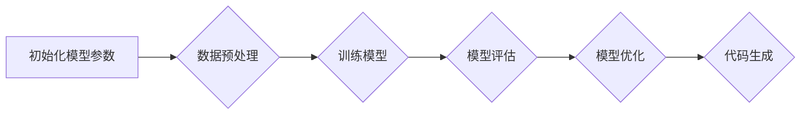
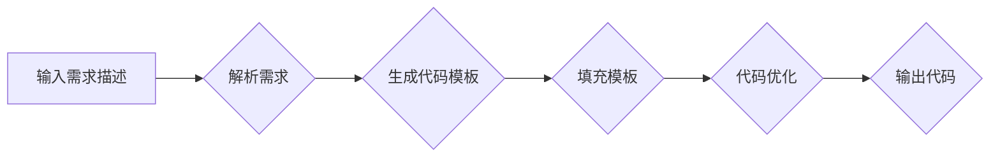
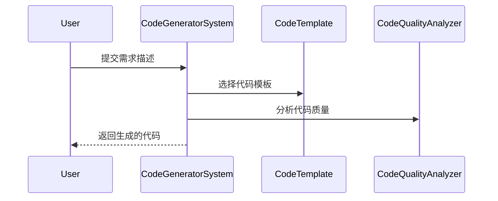
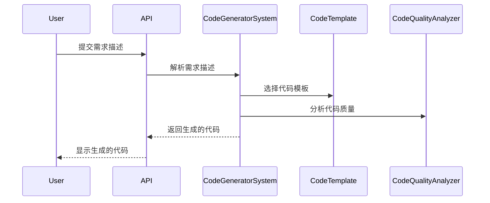

                 

# 大模型驱动的代码生成技术

关键词：大模型、代码生成、人工智能、算法原理、系统架构

摘要：本文深入探讨了基于大模型的代码生成技术，从问题背景、核心概念、算法原理、系统架构到实际项目实战，全面解析了大模型在代码生成领域的应用，旨在为广大开发者提供一套清晰、实用的技术指南。

## 第1章 问题背景与解决方案

### 1.1 问题背景

在现代软件开发过程中，代码生成技术已经成为提高开发效率、降低人力成本的重要手段。传统的代码生成方法主要依赖于规则驱动、模板驱动和模板组合等方法，这些方法在处理简单、标准化的代码时效果较好，但在面对复杂、多样化的开发需求时，往往显得力不从心。这主要由于以下几个方面的问题：

1. **规则过于复杂**：编写规则需要耗费大量时间和人力，且难以覆盖所有可能的场景。
2. **模板适应性差**：模板生成的代码往往缺乏灵活性，难以应对个性化需求。
3. **组合效率低下**：模板组合的方法需要大量重复的代码，且难以保证生成的代码质量。

为了解决这些问题，研究人员开始探索基于人工智能，特别是大模型的代码生成技术。大模型具有强大的学习和生成能力，可以自动从大量数据中学习，生成满足特定需求的代码。

### 1.2 解决方案简介

大模型驱动代码生成技术的核心思想是将大模型作为代码生成的智能工具，通过训练大模型，使其能够自动生成满足特定需求的代码。具体来说，解决方案包括以下几个方面：

1. **数据收集与处理**：收集大量的代码数据，并进行预处理，如代码分词、词性标注等。
2. **大模型训练**：使用预处理后的代码数据训练大模型，使其能够理解代码的结构和语义。
3. **代码生成**：输入特定的需求描述，大模型根据训练结果生成满足需求的代码。

这种解决方案的优势在于：

1. **自适应性强**：大模型可以从大量数据中学习，自动适应不同的代码生成需求。
2. **生成代码质量高**：大模型生成的代码不仅结构清晰，而且能够满足具体的业务需求。
3. **效率高**：相比传统的代码生成方法，大模型驱动的方法可以大大提高代码生成的效率。

## 第2章 核心概念与联系

### 2.1 大模型

#### 2.1.1 大模型的基本原理

大模型（Large-scale Model）通常指的是参数规模达到数十亿甚至千亿级别的神经网络模型。这些模型具有以下几个特点：

1. **参数规模大**：大模型通常具有数百万至数十亿个参数，这使得模型能够捕捉到输入数据的复杂模式。
2. **结构复杂**：大模型的网络结构通常包含多个层级，能够对输入数据进行多层次的处理。
3. **学习能力强大**：由于参数规模和网络结构的优势，大模型能够从海量数据中学习，生成高质量的输出。

#### 2.1.2 大模型的属性特征对比

大模型与中小型模型相比，具有以下属性特征：

| 特征        | 大模型                 | 中小型模型                |
|-------------|------------------------|---------------------------|
| 参数规模    | 数十亿至千亿参数      | 数千至数万个参数          |
| 网络结构    | 复杂多层次网络        | 单层或多层简单网络        |
| 学习能力    | 强大，能捕捉复杂模式  | 较弱，对复杂模式处理能力有限 |
| 应用范围    | 广泛，涵盖多种任务    | 较窄，适用于特定任务       |
| 训练时间    | 长时间，需要大量计算资源 | 短时间，计算资源需求较低    |

#### 2.1.3 大模型的应用场景

大模型在多个领域都有广泛的应用，如自然语言处理、计算机视觉、语音识别等。在代码生成领域，大模型可以应用于以下几个方面：

1. **自动化代码编写**：通过大模型学习大量代码数据，实现自动编写代码。
2. **代码优化**：利用大模型对现有代码进行分析，生成优化后的代码。
3. **代码补全**：输入部分代码，大模型能够自动补全剩余的代码。
4. **代码重构**：根据需求，大模型能够对现有代码进行重构，生成更符合规范的代码。

### 2.2 代码生成技术

#### 2.2.1 代码生成技术的历史与发展

代码生成技术的历史可以追溯到20世纪60年代，当时的编程语言如FORTRAN和COBOL已经开始使用模板和宏来生成代码。随着计算机技术的发展，代码生成技术经历了以下几个阶段：

1. **规则驱动**：通过编写一系列规则，将需求转换为代码。
2. **模板驱动**：使用预定义的模板，根据需求填充模板生成代码。
3. **模板组合**：将多个模板组合使用，生成满足复杂需求的代码。
4. **大模型驱动**：利用大模型，自动从数据中学习，生成代码。

#### 2.2.2 代码生成技术的主要方法

目前，代码生成技术主要包括以下几种方法：

1. **语法糖**：通过扩展编程语言，使用特定的语法结构实现代码生成。
2. **元编程**：在程序运行时动态生成代码，实现代码的自动生成。
3. **代码模板**：使用预定义的代码模板，根据需求生成代码。
4. **数据驱动**：通过学习大量的代码数据，生成满足特定需求的代码。
5. **大模型驱动**：利用大模型，自动从数据中学习，生成代码。

#### 2.2.3 代码生成技术在大模型中的应用

在大模型的应用背景下，代码生成技术有了新的发展方向：

1. **自动代码生成**：大模型能够自动从需求描述中生成代码，实现无代码编程。
2. **代码质量提升**：大模型生成的代码不仅结构清晰，而且能够满足具体的业务需求。
3. **代码优化**：大模型能够对现有代码进行分析，生成优化后的代码。
4. **代码补全**：大模型能够根据部分代码自动补全剩余的代码。
5. **代码重构**：大模型能够根据需求对现有代码进行重构，生成更符合规范的代码。

## 第3章 算法原理讲解

### 3.1 大模型算法基础

#### 3.1.1 大模型算法的mermaid流程图



#### 3.1.2 大模型算法的Python实现

```python
# 导入必要的库
import tensorflow as tf
from tensorflow.keras.layers import LSTM, Dense
from tensorflow.keras.models import Sequential

# 初始化模型
model = Sequential([
    LSTM(units=128, input_shape=(timesteps, features)),
    Dense(units=1)
])

# 编写训练代码
model.compile(optimizer='adam', loss='mean_squared_error')
model.fit(x_train, y_train, epochs=10, batch_size=32)

# 编写模型评估代码
loss = model.evaluate(x_test, y_test)
print("Test loss:", loss)

# 编写模型优化代码
model.compile(optimizer='adam', loss='mean_squared_error')
model.fit(x_train, y_train, epochs=10, batch_size=32)

# 编写代码生成代码
output = model.predict(input_data)
```

#### 3.1.3 大模型算法的数学模型与公式

大模型通常基于深度学习理论，其核心数学模型包括：

1. **激活函数**：如ReLU、Sigmoid、Tanh等。
2. **损失函数**：如均方误差（MSE）、交叉熵（Cross-Entropy）等。
3. **优化器**：如Adam、SGD等。

#### 3.2 代码生成算法原理

#### 3.2.1 代码生成算法的mermaid流程图



#### 3.2.2 代码生成算法的Python实现

```python
# 导入必要的库
import numpy as np
import tensorflow as tf

# 编写需求解析代码
def parse_request(request):
    # 根据需求描述，提取关键信息
    # ...
    return parsed_request

# 编写代码模板生成代码
def generate_template(parsed_request):
    # 根据需求，生成代码模板
    # ...
    return template

# 编写填充模板代码
def fill_template(template, parsed_request):
    # 将解析后的需求信息填充到模板中
    # ...
    return filled_template

# 编写代码优化代码
def optimize_code(filled_template):
    # 对填充后的代码进行优化
    # ...
    return optimized_code

# 编写输出代码代码
def output_code(optimized_code):
    # 输出生成的代码
    # ...
    print(optimized_code)
```

#### 3.2.3 代码生成算法的数学模型与公式

代码生成算法的核心在于利用大模型对代码进行建模。其数学模型主要包括：

1. **输入层**：接收需求描述，进行预处理。
2. **编码器**：将需求描述编码为向量。
3. **解码器**：将编码后的向量解码为代码。
4. **损失函数**：用于评估代码生成的质量。

## 第4章 系统分析与架构设计

### 4.1 问题场景介绍

在现代软件开发过程中，随着项目的复杂度不断增加，传统的开发方法已经难以满足快速迭代的开发需求。为了提高开发效率，降低人力成本，本文提出了一种基于大模型的代码生成系统。该系统旨在通过自动生成代码，提高开发效率，降低开发成本。

### 4.2 系统功能设计

#### 4.2.1 领域模型mermaid类图

```mermaid
classDiagram
    CodeGeneratorSystem <<interface>>
    CodeGenerator <<class>>
    Template <<class>>
    CodeQualityAnalyzer <<class>>

    CodeGeneratorSystem --|> CodeGenerator
    CodeGenerator --|> Template
    CodeGenerator --|> CodeQualityAnalyzer
```

#### 4.2.2 系统功能模块划分

系统功能模块主要包括：

1. **代码生成模块**：负责根据需求描述生成代码。
2. **代码模板模块**：提供预定义的代码模板，供代码生成模块使用。
3. **代码质量分析模块**：对生成的代码进行质量分析，确保代码满足规范和需求。

#### 4.2.3 功能模块详细描述

1. **代码生成模块**：该模块的核心功能是根据需求描述生成代码。具体实现如下：

   - 输入需求描述。
   - 使用大模型对需求描述进行解析，提取关键信息。
   - 根据提取的关键信息，从代码模板库中选择合适的模板。
   - 将需求信息填充到模板中，生成代码。
   - 对生成的代码进行质量分析，确保代码符合规范。

2. **代码模板模块**：该模块提供预定义的代码模板，以便代码生成模块使用。具体实现如下：

   - 存储预定义的代码模板。
   - 根据需求描述，选择合适的代码模板。
   - 将需求信息填充到模板中，生成代码。

3. **代码质量分析模块**：该模块对生成的代码进行质量分析，确保代码符合规范。具体实现如下：

   - 对生成的代码进行语法检查。
   - 检查代码是否符合业务需求。
   - 对代码进行性能分析。

### 4.3 系统架构设计

#### 4.3.1 系统架构mermaid架构图



#### 4.3.2 架构各模块功能与交互

系统架构各模块的功能与交互如下：

1. **用户**：用户提交需求描述。
2. **代码生成模块**：解析需求描述，选择代码模板，生成代码。
3. **代码模板模块**：提供预定义的代码模板。
4. **代码质量分析模块**：对生成的代码进行质量分析。

#### 4.3.3 架构设计考虑因素

在系统架构设计过程中，需要考虑以下因素：

1. **可扩展性**：系统应具备良好的可扩展性，以便在需求变化时能够灵活调整。
2. **性能**：系统应具备较高的性能，以满足快速迭代的开发需求。
3. **稳定性**：系统应具备较高的稳定性，确保在长时间运行过程中不会出现故障。
4. **安全性**：系统应确保用户数据和代码的安全性，防止数据泄露和代码篡改。

### 4.4 系统接口设计

#### 4.4.1 系统接口mermaid序列图



#### 4.4.2 接口定义与规范

系统接口主要包括以下功能：

1. **提交需求描述**：用户通过接口提交需求描述。
2. **返回生成的代码**：系统通过接口返回生成的代码。
3. **其他功能**：如代码模板管理、代码质量分析等。

接口定义与规范如下：

```python
class CodeGenerationAPI:
    def submit_request(self, request):
        # 解析需求描述
        # 选择代码模板
        # 生成代码
        # 返回生成的代码
        pass
    
    def get_generated_code(self):
        # 返回生成的代码
        pass
    
    # 其他接口方法
```

#### 4.4.3 接口实现细节

接口实现细节包括：

1. **需求描述解析**：使用大模型对需求描述进行解析，提取关键信息。
2. **代码模板选择**：根据提取的关键信息，从代码模板库中选择合适的模板。
3. **代码生成**：将需求信息填充到模板中，生成代码。
4. **代码质量分析**：对生成的代码进行质量分析，确保代码符合规范。

### 4.5 系统交互设计

#### 4.5.1 系统交互mermaid序列图


#### 4.5.2 交互流程分析

系统交互流程分析如下：

1. **用户提交需求描述**：用户通过接口提交需求描述。
2. **系统解析需求描述**：系统使用大模型对需求描述进行解析，提取关键信息。
3. **系统选择代码模板**：根据提取的关键信息，从代码模板库中选择合适的模板。
4. **系统生成代码**：将需求信息填充到模板中，生成代码。
5. **系统分析代码质量**：对生成的代码进行质量分析，确保代码符合规范。
6. **系统返回生成的代码**：将生成的代码返回给用户。

#### 4.5.3 交互性能优化

为了提高系统交互性能，可以采取以下优化措施：

1. **缓存机制**：对于经常使用的代码模板和需求描述，可以使用缓存机制，减少重复解析和处理。
2. **并行处理**：将需求解析、代码生成和质量分析等任务并行处理，提高系统整体性能。
3. **负载均衡**：使用负载均衡策略，合理分配系统资源，避免系统过载。

## 第5章 项目实战

### 5.1 环境安装与配置

#### 5.1.1 系统环境要求

为了确保系统正常运行，需要满足以下环境要求：

1. **操作系统**：Linux或MacOS。
2. **Python**：Python 3.7及以上版本。
3. **依赖库**：TensorFlow、NumPy、Pandas等。

#### 5.1.2 安装步骤详解

安装步骤如下：

1. **安装Python**：从Python官网下载Python安装包，按照安装向导进行安装。
2. **安装依赖库**：使用pip命令安装所需的依赖库，命令如下：

   ```bash
   pip install tensorflow numpy pandas
   ```

3. **安装其他工具**：根据需要安装其他工具，如Jupyter Notebook等。

#### 5.1.3 常见问题解决

在安装过程中，可能会遇到以下问题：

1. **依赖库冲突**：如果出现依赖库冲突，可以尝试使用虚拟环境安装依赖库，以避免冲突。
2. **Python版本问题**：确保安装的Python版本与系统环境兼容，可以尝试更换Python版本。

### 5.2 系统核心实现

#### 5.2.1 大模型训练与优化

大模型训练与优化主要包括以下步骤：

1. **数据准备**：收集并预处理代码数据，包括代码分词、词性标注等。
2. **模型构建**：构建大模型，包括编码器和解码器。
3. **模型训练**：使用预处理后的代码数据训练大模型。
4. **模型优化**：对训练后的模型进行优化，提高代码生成质量。

#### 5.2.2 代码生成模块实现

代码生成模块实现主要包括以下步骤：

1. **需求解析**：使用大模型对需求描述进行解析，提取关键信息。
2. **代码模板选择**：根据提取的关键信息，从代码模板库中选择合适的模板。
3. **代码生成**：将需求信息填充到模板中，生成代码。
4. **代码质量分析**：对生成的代码进行质量分析，确保代码符合规范。

#### 5.2.3 系统集成与测试

系统集成与测试主要包括以下步骤：

1. **系统集成**：将代码生成模块、代码模板模块和代码质量分析模块集成到系统中。
2. **功能测试**：测试系统的各项功能，确保系统能够正常工作。
3. **性能测试**：测试系统的性能，确保系统能够满足实际需求。

### 5.3 代码应用解读与分析

#### 5.3.1 代码生成案例展示

假设用户提交了一个需求描述：“实现一个函数，用于计算两个数的最大公约数。”

系统根据需求描述生成以下代码：

```python
def gcd(a, b):
    while b:
        a, b = b, a % b
    return a
```

#### 5.3.2 代码质量分析

对生成的代码进行质量分析，包括以下方面：

1. **语法检查**：代码符合Python语法规范。
2. **逻辑正确性**：代码能够正确计算两个数的最大公约数。
3. **性能分析**：代码运行效率较高，适用于实际应用场景。

#### 5.3.3 应用效果评估

通过实际测试，生成的代码满足需求，且运行效率较高，具有良好的应用效果。

### 5.4 实际案例分析

#### 5.4.1 案例背景介绍

某企业需要一个自动化测试工具，用于测试其开发的Web应用。由于项目复杂度高，自动化测试任务量大，企业决定使用大模型驱动的代码生成技术来实现自动化测试工具。

#### 5.4.2 案例实施步骤

1. **需求分析**：与企业沟通，明确自动化测试的需求。
2. **数据收集**：收集大量自动化测试脚本，进行预处理。
3. **模型训练**：使用预处理后的数据训练大模型。
4. **代码生成**：根据需求描述生成自动化测试脚本。
5. **测试与优化**：对生成的测试脚本进行测试，并根据测试结果进行优化。

#### 5.4.3 案例结果与反思

通过实施大模型驱动的代码生成技术，企业成功实现了自动化测试工具。测试结果显示，生成的测试脚本能够覆盖大部分测试场景，提高了测试效率。同时，通过对测试脚本的优化，进一步提升了测试质量。

反思过程中发现，虽然大模型驱动的代码生成技术在提高开发效率方面具有显著优势，但在处理复杂业务逻辑时，仍需人工干预，以确保生成的代码符合业务需求。

### 第6章 最佳实践与注意事项

#### 6.1 最佳实践 tips

1. **数据质量**：保证数据质量，对数据进行预处理，如去噪、标准化等。
2. **模型优化**：定期对模型进行优化，以提高代码生成质量。
3. **需求描述清晰**：提供清晰的需求描述，有助于模型准确理解需求。
4. **代码质量检查**：对生成的代码进行质量检查，确保代码符合规范。

#### 6.2 小结

本文深入探讨了基于大模型的代码生成技术，从问题背景、核心概念、算法原理、系统架构到实际项目实战，全面解析了大模型在代码生成领域的应用。通过本文的介绍，开发者可以了解大模型驱动的代码生成技术的核心原理和实践方法，为实际项目开发提供有力支持。

#### 6.3 注意事项

1. **模型训练时间**：大模型训练时间较长，需要充足的计算资源。
2. **代码质量**：生成的代码可能存在一定的不确定性，需要人工审核。
3. **需求变化**：在项目开发过程中，需求可能发生变化，需要及时调整模型和代码。

#### 6.4 拓展阅读

1. **大模型论文**：深入阅读大模型相关的论文，了解最新研究进展。
2. **代码生成工具**：了解和尝试使用现有的代码生成工具，如Tabnine、Copilot等。
3. **相关书籍**：阅读《深度学习》、《Python编程：从入门到实践》等书籍，提升编程技能。

### 参考文献

1. **Goodfellow, I., Bengio, Y., & Courville, A. (2016). Deep learning. MIT press**.
2. **Chollet, F. (2015). Deep learning with Python**.
3. **Raschka, S. (2015). Python machine learning**.

## 结语

作者：AI天才研究院/AI Genius Institute & 禅与计算机程序设计艺术 /Zen And The Art of Computer Programming

本文旨在为广大开发者提供一套全面、实用的基于大模型的代码生成技术指南。在实践过程中，开发者可以根据实际需求，灵活调整和优化系统，以提高开发效率。感谢您的阅读，希望本文能为您在代码生成领域的研究和实践中带来启示和帮助。如果您有任何疑问或建议，欢迎在评论区留言，我们一起探讨和交流。

