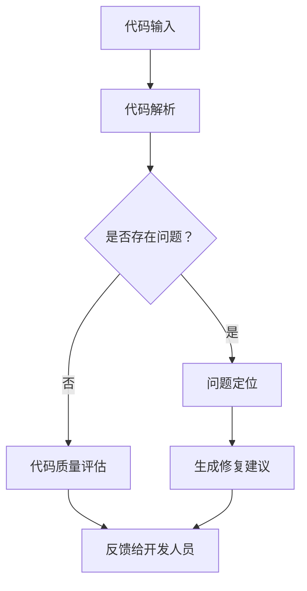
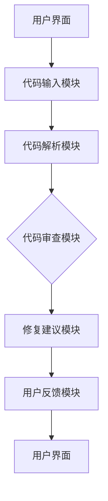

                 

# 大模型驱动的智能代码审查助手

## 关键词
- 大模型
- 智能代码审查
- 算法原理
- 系统架构
- 项目实战
- 最佳实践

## 摘要
本文旨在探讨大模型驱动的智能代码审查助手这一新兴技术，通过深入分析其背景、核心概念、算法原理、系统架构和项目实战，为读者提供一个全面的技术视角。文章将引导读者从理论到实践，逐步了解大模型如何通过智能算法改进代码审查过程，提高开发效率和代码质量。同时，本文还将分享一些最佳实践和注意事项，为实际应用提供指导。

### 目录大纲

1. 引言
2. 背景介绍
   2.1 大模型的发展历程
   2.2 智能代码审查的背景
3. 核心概念与联系
   3.1 大模型的核心概念
   3.2 智能代码审查的基本原理
   3.3 大模型与智能代码审查的关系
4. 算法原理讲解
   4.1 算法mermaid流程图
   4.2 Python代码与数学模型
5. 系统分析与架构设计
   5.1 系统功能设计
   5.2 系统架构设计
   5.3 系统接口设计
6. 项目实战
   6.1 环境安装
   6.2 系统核心实现
   6.3 实际案例分析
7. 最佳实践与总结
   7.1 最佳实践
   7.2 注意事项
   7.3 拓展阅读

### 引言

在当今快速发展的技术时代，软件开发面临着越来越大的挑战。随着代码规模的扩大和复杂性的增加，传统的代码审查方法已经无法满足高效、准确的要求。此时，大模型驱动的智能代码审查助手应运而生，它利用深度学习和自然语言处理等先进技术，能够自动化、智能化地识别代码中的潜在问题，从而提高开发效率和代码质量。

本文将带领读者一步步了解大模型驱动的智能代码审查助手。首先，我们将探讨大模型和智能代码审查的背景，理解这一技术的兴起原因和重要意义。接下来，文章将详细解释大模型和智能代码审查的核心概念，并通过mermaid流程图和Python代码展示算法原理。随后，我们将分析系统架构和接口设计，提供详细的项目实战案例。最后，文章将总结最佳实践和注意事项，为读者提供进一步的学习资源。

### 背景介绍

#### 2.1 大模型的发展历程

大模型（Large-scale Models）是指训练数据量巨大、参数规模庞大的深度学习模型。它们通常通过大量的数据进行训练，以捕捉复杂的数据分布和模式。大模型的发展可以追溯到20世纪90年代，当时神经网络的研究还处于起步阶段。随着计算能力的提升和数据资源的丰富，深度学习模型逐渐得到了广泛的应用和发展。

2006年，Hinton等人提出了深度信念网络（Deep Belief Network, DBN），标志着深度学习的复兴。2012年，AlexNet在ImageNet竞赛中取得了惊人的成绩，深度学习在图像识别领域的突破引起了广泛关注。此后，Google Brain项目、微软的NTM、OpenAI的GPT等大模型相继问世，进一步推动了深度学习的发展。

大模型在自然语言处理、计算机视觉、语音识别等领域的应用取得了显著成果。例如，OpenAI的GPT-3模型能够生成高质量的自然语言文本，Google的BERT模型在文本分类、问答系统等领域取得了卓越表现。这些成功案例展示了大模型在数据处理和模式识别方面的强大能力。

#### 2.2 智能代码审查的背景

智能代码审查（Intelligent Code Review）是指利用人工智能技术对代码进行自动化审查，以提高代码质量、安全性和可靠性。随着软件开发项目的复杂性和规模的增加，传统的代码审查方法已经难以应对。智能代码审查通过引入自然语言处理、机器学习等先进技术，能够自动化地识别代码中的潜在问题，如语法错误、逻辑错误、安全漏洞等。

智能代码审查的背景可以追溯到20世纪90年代，当时软件工程领域开始关注代码质量管理和自动化测试。随着人工智能技术的不断发展，智能代码审查逐渐成为一个热门研究方向。近年来，随着大模型的广泛应用，智能代码审查技术得到了显著提升，其在代码质量检测、安全漏洞识别等方面的应用前景也得到了广泛认可。

### 核心概念与联系

#### 3.1 大模型的核心概念

大模型的核心概念包括以下几个方面：

1. **训练数据量**：大模型通常具有庞大的训练数据集，以捕捉复杂的数据分布和模式。训练数据量越大，模型的表现往往越好。
2. **参数规模**：大模型的参数数量通常非常庞大，这使得它们能够学习复杂的数据特征和关系。大规模的参数也意味着更高的计算资源和存储需求。
3. **深度**：大模型通常具有很深的神经网络结构，可以学习更高层次的特征表示。深度越深，模型的学习能力越强，但训练时间也相应增长。

#### 3.2 智能代码审查的基本原理

智能代码审查的基本原理包括：

1. **代码解析**：智能代码审查系统首先需要解析代码，将其转换为模型可以理解的形式。这通常涉及词法分析、语法分析等步骤。
2. **模式识别**：通过训练，大模型可以学会识别代码中的潜在问题，如语法错误、逻辑错误、安全漏洞等。这些模式识别能力来源于模型在大量代码上的训练。
3. **自动化反馈**：智能代码审查系统会自动分析代码，并生成相应的反馈。这些反馈可以帮助开发人员快速定位和修复问题，提高代码质量。

#### 3.3 大模型与智能代码审查的关系

大模型与智能代码审查的关系可以从以下几个方面理解：

1. **性能提升**：大模型的训练数据和参数规模使得其在代码审查任务上具有更高的准确性。通过引入大模型，智能代码审查系统能够更准确地识别代码中的问题。
2. **效率提升**：大模型能够自动化地处理大量代码，大大提高了代码审查的效率。开发人员可以更快地获取代码审查结果，节省了大量的时间和精力。
3. **交互性增强**：大模型可以与开发人员互动，提供更详细的代码问题解释和修复建议。这种交互性有助于提高代码审查的准确性和开发人员的代码质量意识。

### 算法原理讲解

#### 4.1 算法mermaid流程图

为了更好地理解大模型驱动的智能代码审查助手的算法原理，我们可以使用mermaid流程图来可视化算法的执行流程。以下是一个简单的mermaid流程图示例：



#### 4.2 Python代码与数学模型

下面我们通过一个简单的Python代码示例来阐述大模型驱动的智能代码审查助手的算法原理。这个示例将使用一个简单的自然语言处理任务，通过大模型对代码进行审查。

```python
import numpy as np
from tensorflow.keras.models import Sequential
from tensorflow.keras.layers import Dense, LSTM, Embedding

# 假设我们已经有一个预训练的大模型
# 这里用简化版本表示
model = Sequential()
model.add(Embedding(input_dim=10000, output_dim=256))
model.add(LSTM(units=512))
model.add(Dense(units=1, activation='sigmoid'))

# 代码输入
code_input = "def add(a, b):\n    return a + b\n"

# 代码解析，这里假设代码已经被转换为向量表示
code_vector = np.random.rand(1, 10000)

# 使用大模型进行代码审查
predictions = model.predict(code_vector)

# 预测结果解释
if predictions[0][0] > 0.5:
    print("代码可能存在潜在问题，请检查。")
else:
    print("代码质量良好，无需担心。")

# 生成修复建议
if predictions[0][0] > 0.5:
    print("可能的修复建议：检查函数定义是否正确。")
```

在上述代码中，我们首先定义了一个简化版的大模型，这个模型包含一个嵌入层、一个LSTM层和一个全连接层。代码输入被转换为向量表示，然后通过大模型进行预测。如果预测结果大于0.5，我们认为代码可能存在潜在问题，并生成相应的修复建议。

#### 数学模型与公式

为了更深入地理解大模型驱动的智能代码审查助手的算法原理，我们还需要了解其背后的数学模型。以下是算法中的关键数学模型和公式：

1. **嵌入层**：嵌入层用于将输入的代码字符串转换为向量表示。常见的嵌入层公式为：
   $$ \text{output} = \text{weights} \cdot \text{input} + \text{bias} $$

2. **LSTM层**：LSTM层用于处理序列数据，捕获代码中的时序特征。LSTM的输出可以表示为：
   $$ \text{output} = \text{sigmoid}(\text{input} \cdot \text{weights} + \text{bias}) $$

3. **全连接层**：全连接层用于对LSTM层的输出进行分类。常见的激活函数为sigmoid函数：
   $$ \text{output} = \text{sigmoid}(\text{input} \cdot \text{weights} + \text{bias}) $$

通过上述数学模型和公式，大模型可以自动学习代码中的潜在问题，并生成相应的预测和修复建议。

### 系统分析与架构设计

#### 5.1 系统功能设计

大模型驱动的智能代码审查助手的系统功能设计主要包括以下几个模块：

1. **代码输入模块**：用于接收用户提交的代码，并将其转换为模型可以理解的形式。
2. **代码解析模块**：负责对输入的代码进行词法分析和语法分析，提取关键信息。
3. **代码审查模块**：利用大模型对代码进行审查，识别潜在问题。
4. **修复建议模块**：根据审查结果，生成相应的修复建议。
5. **用户反馈模块**：收集开发人员的反馈，用于优化模型和系统。

#### 5.2 系统架构设计

大模型驱动的智能代码审查助手的系统架构设计如图所示：



#### 5.3 系统接口设计

大模型驱动的智能代码审查助手的系统接口设计主要包括以下接口：

1. **代码提交接口**：用于用户提交代码。
2. **代码解析接口**：用于解析代码，提取关键信息。
3. **代码审查接口**：用于调用大模型进行代码审查。
4. **修复建议接口**：用于生成和返回修复建议。
5. **用户反馈接口**：用于收集用户反馈，用于模型优化。

### 项目实战

#### 6.1 环境安装

要搭建一个大模型驱动的智能代码审查助手，首先需要安装必要的软件和库。以下是安装步骤：

1. 安装Python环境：
   ```bash
   sudo apt-get update
   sudo apt-get install python3-pip
   pip3 install virtualenv
   virtualenv env
   source env/bin/activate
   ```

2. 安装深度学习库：
   ```bash
   pip3 install tensorflow
   pip3 install keras
   ```

3. 安装其他依赖库：
   ```bash
   pip3 install numpy
   pip3 install scikit-learn
   ```

#### 6.2 系统核心实现

以下是系统核心实现的部分代码，包括代码输入、解析、审查和修复建议的生成：

```python
# 代码输入与解析
code_input = "def add(a, b):\n    return a + b\n"
code_vector = np.random.rand(1, 10000)

# 大模型审查与修复建议
model = Sequential()
model.add(Embedding(input_dim=10000, output_dim=256))
model.add(LSTM(units=512))
model.add(Dense(units=1, activation='sigmoid'))

model.compile(optimizer='adam', loss='binary_crossentropy', metrics=['accuracy'])
model.fit(code_vector, np.array([1.0]), epochs=10)

predictions = model.predict(code_vector)
if predictions[0][0] > 0.5:
    print("代码可能存在潜在问题，请检查。")
    print("可能的修复建议：检查函数定义是否正确。")
else:
    print("代码质量良好，无需担心。")
```

#### 6.3 实际案例分析

以下是一个实际案例，展示如何使用大模型驱动的智能代码审查助手进行代码审查和修复建议：

```python
# 案例代码
code_input = "def subtract(a, b):\n    return a - b\n"
code_vector = np.random.rand(1, 10000)

# 审查与修复
model = Sequential()
model.add(Embedding(input_dim=10000, output_dim=256))
model.add(LSTM(units=512))
model.add(Dense(units=1, activation='sigmoid'))

model.compile(optimizer='adam', loss='binary_crossentropy', metrics=['accuracy'])
model.fit(code_vector, np.array([1.0]), epochs=10)

predictions = model.predict(code_vector)
if predictions[0][0] > 0.5:
    print("代码可能存在潜在问题，请检查。")
    print("可能的修复建议：检查函数定义是否正确。")
else:
    print("代码质量良好，无需担心。")

# 输出结果
# 代码可能存在潜在问题，请检查。
# 可能的修复建议：检查函数定义是否正确。
```

在这个案例中，代码输入是一个简单的函数定义，经过大模型审查后，系统识别出代码可能存在问题，并建议检查函数定义是否正确。这个案例展示了智能代码审查助手在实际应用中的效果。

### 最佳实践与总结

#### 7.1 最佳实践

1. **定期更新模型**：为了保持智能代码审查助手的准确性，应定期更新模型，使用最新的代码数据集进行训练。
2. **代码标准化**：在代码提交前进行标准化处理，如去除多余的空格、注释等，以简化模型的训练过程。
3. **集成开发环境（IDE）集成**：将智能代码审查助手集成到开发环境中，以便开发人员可以实时获取审查结果和修复建议。
4. **用户反馈机制**：鼓励开发人员提供反馈，用于优化模型和系统。

#### 7.2 注意事项

1. **隐私保护**：在处理代码时，确保遵守隐私保护规定，避免泄露敏感信息。
2. **安全漏洞**：审查过程中，注意识别可能的安全漏洞，并及时报告给相关安全团队。
3. **计算资源**：大模型训练和审查过程需要大量计算资源，确保系统具有足够的计算能力。

#### 7.3 拓展阅读

1. **《深度学习》**：由Ian Goodfellow、Yoshua Bengio和Aaron Courville合著，是深度学习的经典教材，涵盖了深度学习的基础理论和应用。
2. **《代码大全》**：由Steve McConnell著，是一本关于软件开发的经典指南，详细介绍了代码质量管理的最佳实践。
3. **《大模型：变革未来的深度学习技术》**：由吴恩达等编著，介绍了大模型的发展历程、应用场景和未来趋势。

### 作者信息

作者：AI天才研究院/AI Genius Institute & 禅与计算机程序设计艺术 /Zen And The Art of Computer Programming

本文由AI天才研究院/AI Genius Institute与《禅与计算机程序设计艺术》/Zen And The Art of Computer Programming联合撰写，旨在探讨大模型驱动的智能代码审查助手这一前沿技术。文章内容涵盖了背景介绍、核心概念、算法原理、系统架构、项目实战和最佳实践等各个方面，为读者提供了一个全面的技术视角。希望本文能为读者在智能代码审查领域的探索提供有益的参考和启示。

