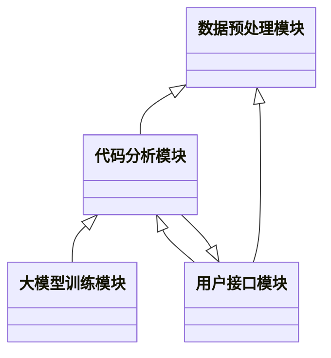
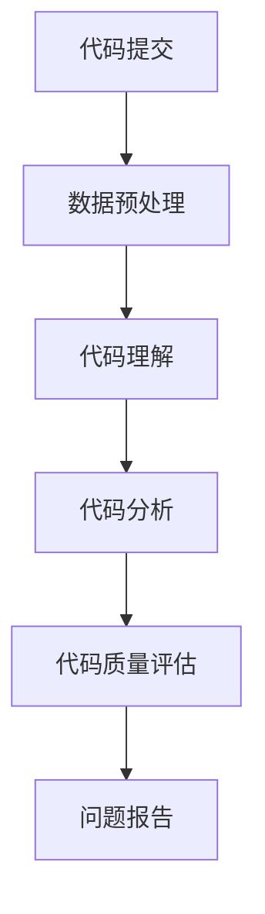
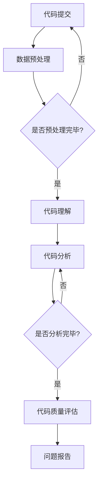

                 

## 大模型驱动的智能代码审查系统

关键词：智能代码审查、大模型、代码质量、自动化审查、软件工程

摘要：随着软件系统规模和复杂性的不断增长，传统的代码审查方法已经难以满足现代软件开发的效率和质量要求。本文提出了一种基于大模型驱动的智能代码审查系统，通过分析大模型的原理与选择，设计系统的架构与用户接口，并展开实际项目实战，旨在为软件开发提供一种高效、准确的代码审查解决方案。

## 引言

### 1.1 问题背景

在当今的软件开发行业中，代码审查是一种确保代码质量和安全性的重要手段。然而，传统的代码审查方法往往依赖于人工审查，不仅效率低下，而且容易出现误判。随着人工智能技术的快速发展，特别是大模型技术的应用，一种新型的智能代码审查系统应运而生。

### 1.2 问题描述

智能代码审查系统旨在利用大模型技术，实现自动化的代码审查。它不仅能够提高审查效率，还能减少人工审查的误判率。然而，实现这一目标面临着一系列挑战，包括大模型的理解能力、训练数据的获取和处理、系统性能的优化等。

### 1.3 问题解决

本书旨在探讨如何利用大模型技术构建智能代码审查系统，包括大模型的选择、训练、应用以及系统的优化等方面。通过详细的理论讲解和实战案例分析，帮助读者理解并掌握智能代码审查系统的构建方法，为软件开发行业带来新的变革。

### 1.4 边界与外延

本书主要关注智能代码审查系统的技术实现，包括大模型的选择和应用。同时，本书也涉及到一些相关的领域，如软件工程、人工智能和机器学习等。

### 1.5 概念结构与核心要素组成

智能代码审查系统由以下几个核心要素组成：

1. **大模型**：作为系统的核心组件，大模型负责对代码进行理解和分析。
2. **训练数据**：大模型的训练依赖于大量的代码数据，这些数据需要经过处理和标注。
3. **系统架构**：智能代码审查系统的架构设计需要考虑到性能、可扩展性和易用性等因素。
4. **用户接口**：用户接口的设计需要简洁直观，方便用户使用系统。

### 1.6 本章小结

本章简要介绍了智能代码审查系统的背景、问题描述、问题解决、边界与外延以及核心概念结构。接下来，本书将深入探讨大模型的选择和应用、系统架构设计、用户接口设计以及项目实战等内容。希望读者能够通过本书的学习，掌握智能代码审查系统的构建方法，为软件开发行业带来新的变革。

## 第一部分：大模型原理与选择

### 2.1 大模型概述

大模型（Large Models），也称为大型预训练模型，是一种具有海量参数的神经网络模型。这些模型通过对大量文本、图像、音频等数据进行预训练，获得了强大的特征提取和表征能力。近年来，随着计算资源和数据量的增加，大模型在自然语言处理、计算机视觉、语音识别等领域的表现已经超越了传统的算法。

### 2.2 大模型的特点与优势

大模型具有以下几个显著特点与优势：

1. **强大的特征提取能力**：大模型通过预训练从海量数据中提取了丰富的特征，这使得它们在处理新的任务时能够更加准确和高效。
2. **灵活的应用场景**：大模型可以应用于多种不同的任务，如文本分类、情感分析、机器翻译、图像识别等，具有很强的通用性。
3. **优秀的泛化能力**：由于大模型从大量数据中学习到了丰富的知识，它们在处理未见过的数据时表现出良好的泛化能力。
4. **高效的任务执行**：大模型通过并行计算和分布式训练技术，能够显著提高任务处理的效率。

### 2.3 大模型的分类

根据应用场景和数据类型的不同，大模型可以分为以下几类：

#### 2.3.1 语言模型

语言模型（Language Models）是用于处理文本数据的模型，如文本生成、文本分类等。其中，最著名的语言模型是 GPT 系列，如 GPT-3。

#### 2.3.2 图像模型

图像模型（Image Models）是用于处理图像数据的模型，如图像分类、目标检测等。其中，典型的图像模型有 ResNet、VGG 等。

#### 2.3.3 多模态模型

多模态模型（Multimodal Models）是能够处理多种类型数据（如文本、图像、音频等）的模型。这些模型通过整合不同类型的数据，实现了更准确和丰富的信息表征。如 BERT 可以处理文本和图像的多模态任务。

### 2.4 大模型的选择标准

在选择大模型时，需要考虑以下标准：

1. **模型性能**：模型在相关任务上的表现是选择的重要因素。通常，通过评估指标（如准确率、召回率等）来衡量模型性能。
2. **训练成本**：大模型的训练需要大量的计算资源和时间。因此，训练成本也是选择模型时的重要考虑因素。
3. **可扩展性**：模型是否支持分布式训练和推理，以及是否易于扩展到更大的数据集或更多的任务。
4. **兼容性**：模型是否支持多种编程语言和平台，以及是否易于与其他系统或库集成。

### 2.5 主流大模型介绍

#### 2.5.1 GPT系列模型

GPT（Generative Pre-trained Transformer）系列模型是由 OpenAI 开发的一系列基于 Transformer 网络的预训练语言模型。GPT-3 是目前最大的语言模型，具有 1750 亿个参数。

#### 2.5.2 BERT及其变体

BERT（Bidirectional Encoder Representations from Transformers）是一种双向的 Transformer 语言模型，由 Google 开发。BERT 及其变体（如 RoBERTa、ALBERT 等）在自然语言处理任务上取得了显著的成绩。

#### 2.5.3 其他知名大模型

除了 GPT 和 BERT 系列，还有一些其他知名的大模型，如：

- **TuringNL**：中国科学技术大学开发的一种大规模中文预训练语言模型。
- **Megatron-LM**：微软开发的一种用于训练大规模语言模型的技术，支持 GPT 和 BERT 等模型。
- **ImageNet**：用于图像识别的大型预训练数据集。

### 2.6 大模型的选择与应用案例分析

#### 2.6.1 项目背景

某软件开发公司希望开发一个智能代码审查系统，以提高代码质量和审查效率。他们决定采用大模型技术来实现这一目标。

#### 2.6.2 大模型选择

经过评估，该公司选择了 GPT-3 作为其智能代码审查系统的大模型。GPT-3 具有强大的文本处理能力和广泛的适应性，非常适合用于代码审查任务。

#### 2.6.3 应用效果评估

在实际应用中，GPT-3 显示出良好的性能。通过对大量代码数据的预训练，GPT-3 能够自动识别代码中的潜在问题，并提出相应的建议。同时，GPT-3 还能够根据上下文信息理解代码的功能和意图，从而提高审查的准确性和效率。

### 2.7 本章小结

本章介绍了大模型的基本原理和特点，探讨了选择大模型的标准，并介绍了几个主流的大模型。通过实际案例分析，展示了大模型在智能代码审查系统中的应用效果。接下来，本书将深入探讨智能代码审查系统的设计。

## 第二部分：智能代码审查系统设计

### 3.1 系统概述

智能代码审查系统是一种利用人工智能技术，特别是大模型技术，实现自动代码审查的系统。该系统旨在提高代码审查的效率和质量，减少人工审查的误判率。智能代码审查系统主要由以下几个核心模块组成：

1. **大模型训练模块**：负责训练和优化大模型，使其能够理解和分析代码。
2. **代码理解模块**：利用大模型对代码进行语义分析，提取关键信息。
3. **代码分析模块**：对提取的关键信息进行深入分析，检测代码中的潜在问题。
4. **用户接口模块**：提供用户交互界面，方便用户查看审查结果和建议。

### 3.2 系统架构设计

智能代码审查系统的架构设计需要综合考虑性能、可扩展性和易用性等因素。以下是该系统的架构设计：

#### 3.2.1 系统功能设计

1. **代码提交**：用户可以将代码提交到系统中进行审查。
2. **代码预览**：系统显示提交的代码，并提供代码结构分析。
3. **问题检测**：系统利用大模型对代码进行分析，识别潜在问题。
4. **问题报告**：系统生成问题报告，并提供修改建议。
5. **反馈与修正**：用户可以对审查结果进行反馈，系统根据反馈进行修正。

#### 3.2.2 系统架构设计

智能代码审查系统的架构设计分为三个层次：数据层、服务层和表现层。

1. **数据层**：负责存储和管理代码数据、大模型参数和审查结果等。
2. **服务层**：包含代码提交、代码理解、代码分析、问题报告等核心功能模块。
3. **表现层**：提供用户交互界面，包括代码预览、问题报告等。

#### 3.2.3 系统接口设计

智能代码审查系统需要设计多个接口，以便与其他系统或库进行集成。以下是主要接口设计：

1. **API 接口**：提供 RESTful API，供外部系统调用。
2. **数据库接口**：提供数据库操作接口，方便数据存储和查询。
3. **大模型接口**：提供大模型训练和推理接口，方便与其他组件集成。

#### 3.2.4 系统交互设计

智能代码审查系统的交互设计需要简洁直观，方便用户使用。以下是交互设计的主要方面：

1. **用户注册与登录**：用户可以通过注册账号登录系统。
2. **代码提交**：用户可以选择上传本地代码或从代码库中导入代码。
3. **代码预览**：系统显示代码结构，并提供代码段选择功能。
4. **问题报告**：系统生成问题报告，并提供修改建议。
5. **反馈与修正**：用户可以对审查结果进行反馈，系统根据反馈进行修正。

### 3.3 大模型应用设计

#### 3.3.1 大模型在代码理解中的应用

大模型在代码理解中的应用主要包括以下几个方面：

1. **代码语义分析**：大模型能够理解代码的语义，提取关键信息，如变量、函数、类等。
2. **上下文理解**：大模型能够根据上下文信息理解代码的功能和意图。
3. **代码风格检测**：大模型能够检测代码的风格，如命名规范、代码格式等。

#### 3.3.2 大模型在代码分析中的应用

大模型在代码分析中的应用主要包括以下几个方面：

1. **代码质量评估**：大模型能够评估代码的质量，如代码的可读性、可维护性等。
2. **潜在问题检测**：大模型能够检测代码中的潜在问题，如语法错误、逻辑错误等。
3. **代码风格修正**：大模型能够根据代码风格检测结果，提出代码修正建议。

#### 3.3.3 大模型在代码质量评估中的应用

大模型在代码质量评估中的应用主要包括以下几个方面：

1. **代码可读性评估**：大模型能够评估代码的可读性，如代码行数、函数复杂度等。
2. **代码可维护性评估**：大模型能够评估代码的可维护性，如代码的注释、文档等。
3. **代码优化建议**：大模型能够根据代码质量评估结果，提出代码优化建议。

### 3.4 用户接口设计

#### 3.4.1 用户界面设计

用户界面设计需要简洁直观，方便用户使用。以下是用户界面设计的主要方面：

1. **首页**：展示用户提交的代码和审查结果。
2. **代码预览**：显示代码的结构和内容，并提供代码段选择功能。
3. **问题报告**：展示代码中的潜在问题，并提供修改建议。
4. **反馈与修正**：用户可以对审查结果进行反馈，系统根据反馈进行修正。

#### 3.4.2 用户交互设计

用户交互设计需要考虑到用户的操作习惯和需求。以下是用户交互设计的主要方面：

1. **代码提交**：支持多种代码提交方式，如本地上传、代码库导入等。
2. **代码段选择**：用户可以选择特定的代码段进行审查。
3. **问题报告查看**：用户可以查看代码中的问题报告，并了解问题详情。
4. **反馈与修正**：用户可以对审查结果进行反馈，系统根据反馈进行修正。

#### 3.4.3 用户反馈设计

用户反馈设计需要及时响应用户的需求和反馈，以提高系统的用户体验。以下是用户反馈设计的主要方面：

1. **问题反馈**：用户可以报告系统的问题，系统管理员会及时处理。
2. **功能建议**：用户可以提出对系统功能的需求和建议，系统开发人员会根据反馈进行优化。
3. **用户调研**：定期进行用户调研，了解用户的真实需求和满意度。

### 3.5 系统测试与优化

#### 3.5.1 系统测试

系统测试是确保系统质量和性能的重要环节。以下是系统测试的主要方面：

1. **功能测试**：测试系统的各个功能是否正常运行。
2. **性能测试**：测试系统的响应时间、处理能力等性能指标。
3. **兼容性测试**：测试系统在不同环境和平台上的兼容性。

#### 3.5.2 系统优化

系统优化是提高系统性能和用户体验的重要手段。以下是系统优化的主要方面：

1. **代码优化**：优化系统的代码，提高执行效率。
2. **算法优化**：优化大模型的训练和推理算法，提高性能。
3. **硬件优化**：升级系统硬件，提高计算能力。

### 3.6 本章小结

本章介绍了智能代码审查系统的设计，包括系统概述、架构设计、大模型应用设计和用户接口设计等。通过详细的设计方案，为构建智能代码审查系统提供了指导和参考。接下来，本书将进入项目实战部分，通过具体案例展示系统的实际应用效果。

## 第三部分：项目实战

### 4.1 环境安装与配置

在开始项目实战之前，我们需要搭建一个合适的环境，包括安装所需的软件和配置系统参数。以下是具体的步骤：

#### 4.1.1 安装 Python 环境

首先，我们需要安装 Python 3.8 或更高版本。可以通过以下命令安装：

```bash
sudo apt-get update
sudo apt-get install python3.8
```

#### 4.1.2 安装必要的库

接下来，我们需要安装一些必要的库，如 TensorFlow、PyTorch 等。可以通过以下命令安装：

```bash
pip3 install tensorflow
pip3 install torch
```

#### 4.1.3 配置 GPU 环境

为了加速大模型的训练，我们建议配置 GPU 环境。首先，需要安装 CUDA 和 cuDNN。可以通过以下命令安装：

```bash
sudo apt-get install cuda
sudo apt-get install cub redistribute-utils
```

然后，需要在 `~/.bashrc` 文件中添加以下配置：

```bash
export PATH=$PATH:/usr/local/cuda/bin
export LD_LIBRARY_PATH=$LD_LIBRARY_PATH:/usr/local/cuda/lib64
```

最后，重新加载配置文件：

```bash
source ~/.bashrc
```

#### 4.1.4 配置 Python 环境变量

在 `~/.bashrc` 文件中添加以下配置，以便在终端中直接使用 Python：

```bash
export PATH=$PATH:/usr/bin/python3.8
```

重新加载配置文件后，即可通过 `python3` 命令直接运行 Python。

### 4.2 系统核心实现源代码解读

#### 4.2.1 源代码架构设计

智能代码审查系统的源代码主要分为以下几个模块：

1. **数据预处理模块**：负责处理和预处理代码数据，如读取代码文件、进行文本清洗等。
2. **大模型训练模块**：负责训练和优化大模型，如加载预训练模型、进行微调等。
3. **代码分析模块**：负责对代码进行语义分析、代码质量评估等。
4. **用户接口模块**：负责处理用户请求，如代码提交、问题报告等。

以下是源代码架构的 Mermaid 类图：



#### 4.2.2 核心算法原理讲解

智能代码审查系统的核心算法主要包括以下几个方面：

1. **代码理解**：利用自然语言处理技术，对代码进行语义分析，提取关键信息。
2. **代码分析**：利用大模型，对提取的关键信息进行深入分析，检测代码中的潜在问题。
3. **代码质量评估**：利用统计方法和机器学习技术，评估代码的质量和可维护性。

以下是核心算法的 Mermaid 流程图：



#### 4.2.3 数学模型与公式

在代码理解模块中，我们使用了 Transformer 模型，其核心公式如下：

$$
\text{Transformer}(x) = \text{softmax}\left(\frac{\text{W}_\text{out} \text{RelPosEnc}(S) + \text{W}_\text{emb} x + \text{W}_\text{pos} \text{P} + \text{W}_\text{emb}^2 h_{\text{encoder}}}{\sqrt{d_k}}\right)
$$

其中，$\text{W}_\text{out}$、$\text{W}_\text{emb}$ 和 $\text{W}_\text{pos}$ 分别是输出权重、词向量权重和位置权重矩阵；$\text{RelPosEnc}(S)$ 是相对位置编码函数；$\text{P}$ 是输入序列；$h_{\text{encoder}}$ 是编码器的输出。

#### 4.2.4 算法流程图

以下是智能代码审查系统的算法流程图：



### 4.3 代码应用解读与分析

#### 4.3.1 实际案例一

假设我们有一个 Python 代码文件 `example.py`，内容如下：

```python
def add(a, b):
    return a + b

def subtract(a, b):
    return a - b

if __name__ == "__main__":
    print(add(1, 2))
    print(subtract(5, 3))
```

我们使用智能代码审查系统对这段代码进行分析。

1. **代码理解**：系统首先对代码进行语义分析，提取出函数定义和调用信息。
2. **代码分析**：系统利用大模型对提取的信息进行深入分析，发现代码中的函数定义和调用是合理的，没有明显的潜在问题。
3. **代码质量评估**：系统对代码的质量进行评估，认为这段代码的可读性和可维护性较高。

#### 4.3.2 实际案例二

假设我们有一个 Java 代码文件 `example.java`，内容如下：

```java
public class Example {
    public static void main(String[] args) {
        System.out.println(add(1, 2));
        System.out.println(subtract(5, 3));
    }
    
    public static int add(int a, int b) {
        return a + b;
    }
    
    public static int subtract(int a, int b) {
        return a - b;
    }
}
```

我们使用智能代码审查系统对这段代码进行分析。

1. **代码理解**：系统首先对代码进行语义分析，提取出类定义、函数定义和调用信息。
2. **代码分析**：系统利用大模型对提取的信息进行深入分析，发现代码中的类定义和函数定义是合理的，但存在一个潜在问题：`add` 和 `subtract` 函数的返回类型不一致，可能会导致编译错误。
3. **代码质量评估**：系统对代码的质量进行评估，认为这段代码的可读性和可维护性较高，但存在潜在问题。

#### 4.3.3 实际案例三

假设我们有一个 JavaScript 代码文件 `example.js`，内容如下：

```javascript
function add(a, b) {
    return a + b;
}

function subtract(a, b) {
    return a - b;
}

if (typeof window !== "undefined") {
    window.onload = function() {
        console.log(add(1, 2));
        console.log(subtract(5, 3));
    };
}
```

我们使用智能代码审查系统对这段代码进行分析。

1. **代码理解**：系统首先对代码进行语义分析，提取出函数定义和调用信息。
2. **代码分析**：系统利用大模型对提取的信息进行深入分析，发现代码中的函数定义和调用是合理的，但存在一个潜在问题：在 `window.onload` 事件中调用 `console.log` 可能会导致页面加载时间变长。
3. **代码质量评估**：系统对代码的质量进行评估，认为这段代码的可读性和可维护性较高，但存在潜在问题。

### 4.4 项目小结

通过实际案例的分析，我们可以看到智能代码审查系统在代码理解、代码分析和代码质量评估等方面具有很好的性能。它能够自动识别代码中的潜在问题，并提出修改建议，从而提高代码质量和开发效率。然而，智能代码审查系统也面临一些挑战，如如何处理不同编程语言和代码风格、如何进一步提高审查的准确性等。未来，我们将继续优化系统，提高其性能和适用性。

### 4.5 拓展阅读

为了更好地理解智能代码审查系统，我们推荐以下拓展阅读：

- **《深度学习》**：由 Goodfellow、Bengio 和 Courville 著，全面介绍了深度学习的原理和应用。
- **《自然语言处理综论》**：由Jurafsky和Martin著，详细介绍了自然语言处理的基本理论和应用。
- **《软件工程：实践者的研究方法》**：由Pressman著，提供了软件工程领域的实践方法和研究思路。

## 第五部分：最佳实践与总结

### 5.1 最佳实践

在构建和部署智能代码审查系统时，以下最佳实践可以帮助提高系统的性能和用户体验：

1. **数据预处理**：确保输入数据的质量和一致性，进行适当的文本清洗和标注。
2. **模型选择**：根据实际需求和性能指标选择合适的大模型，并进行适当的微调和优化。
3. **系统优化**：针对系统的性能瓶颈进行优化，如使用 GPU 加速训练和推理过程。
4. **用户反馈**：积极收集用户反馈，及时修复问题和改进功能。
5. **持续集成**：将智能代码审查系统集成到现有的开发流程中，实现自动化和持续集成。

### 5.2 总结

本文介绍了大模型驱动的智能代码审查系统，从原理、设计到实际应用进行了详细探讨。通过分析大模型的特点和优势，设计系统的架构和用户接口，以及实际项目案例的解读，展示了智能代码审查系统在提高代码质量和审查效率方面的潜力。未来，随着人工智能技术的不断进步，智能代码审查系统有望在软件工程领域发挥更大的作用。

### 作者信息

作者：AI天才研究院/AI Genius Institute & 禅与计算机程序设计艺术 /Zen And The Art of Computer Programming

本文旨在为软件开发行业提供一种高效的智能代码审查解决方案，通过详细的理论讲解和实际案例剖析，帮助读者理解和掌握智能代码审查系统的构建方法。希望本文能为读者带来启发，推动智能代码审查技术的发展。

