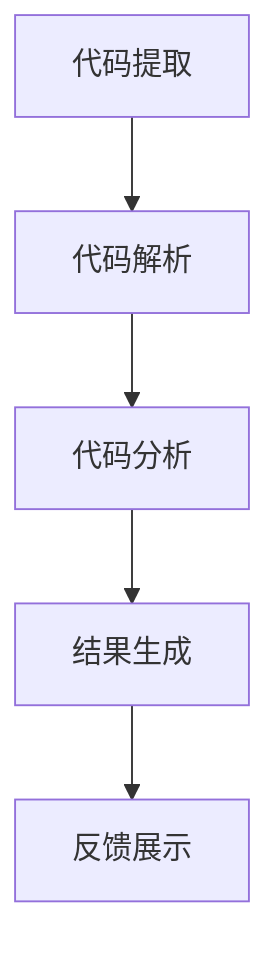

                 

### 文章标题

《大模型驱动的智能代码审查：效率与质量的平衡》

### 文章关键词

大模型、智能代码审查、效率、质量、代码质量保障

### 文章摘要

本文深入探讨大模型驱动的智能代码审查技术，通过分析其背景、核心概念、技术基础、系统架构和实际应用，揭示了在代码审查过程中如何平衡效率与质量。本文旨在帮助开发者理解和应用大模型技术，提升代码审查的效率和质量，从而提高软件开发的整体水平。

---

## 引言与背景

在软件开发过程中，代码审查是一个至关重要的环节，旨在确保代码的质量和安全性。传统的代码审查通常依赖开发者的经验和专业知识，通过人工检查代码的语法、逻辑和结构等方面。这种方法存在一些显著的局限性：

1. **效率低**：人工审查需要大量的时间和精力，尤其是在项目规模较大、代码复杂度较高的情况下，审查过程往往耗时较长。
2. **质量不稳定**：由于人的主观因素，审查结果的质量存在波动，有时可能遗漏潜在的问题。
3. **重复性工作**：对于一些常见的代码错误，开发者需要不断地重复检查，缺乏自动化手段的支持。

为了解决这些问题，近年来，人工智能（AI）和机器学习（ML）技术开始被引入到代码审查过程中。特别是大模型（Large Models），如Transformer、BERT等，通过海量的数据训练，能够自动地理解和生成文本，为代码审查提供了新的可能性。

大模型驱动的智能代码审查，通过利用这些先进的技术，能够在多个方面提升代码审查的效率和质量：

1. **自动化**：大模型可以自动分析和理解代码，减少人工审查的工作量，提高审查效率。
2. **准确性**：大模型通过对大量代码样本的学习，能够更准确地识别代码中的潜在问题，提高审查质量。
3. **智能化**：大模型能够基于上下文理解代码逻辑，提供更为智能的代码审查建议。

本文将从以下几个方面进行探讨：

1. **核心概念**：介绍大模型、AI、机器学习和代码审查等核心概念。
2. **技术基础**：分析大模型在代码审查中的技术实现，包括AI算法、自然语言处理和代码分析技术。
3. **系统架构**：探讨大模型驱动的代码审查系统的架构设计，包括系统组件、数据流和交互。
4. **实际应用**：提供大模型驱动代码审查的实际案例，分析其效果和经验。
5. **效率与质量**：讨论在代码审查过程中如何平衡效率和质量的优化策略。

通过本文的深入探讨，读者将能够全面了解大模型驱动的智能代码审查技术，掌握其核心原理和应用方法，为提升软件开发的质量和效率提供有力支持。

### 基本概念

在大模型驱动的智能代码审查中，首先需要理解几个关键概念：大模型（Large Models）、人工智能（AI）、机器学习（ML）以及代码审查（Code Review）。

#### 大模型

大模型是指具有数十亿参数，能够处理大规模数据集的深度学习模型。这些模型通常基于神经网络结构，具有强大的学习和泛化能力。例如，Transformer和BERT就是两个著名的大模型，它们在自然语言处理领域取得了显著成果。

- **特性**：大模型能够自动地理解和生成文本，其核心在于大规模的训练数据和复杂的神经网络结构。
- **优势**：强大的学习能力和泛化能力使大模型能够处理复杂和庞大的数据集，从而提供更为准确和高效的代码分析。

#### 人工智能

人工智能（AI）是指计算机系统通过模拟人类智能行为，实现感知、推理、学习、规划等功能的科学和技术。AI可以分为弱AI和强AI，其中弱AI具有特定领域的智能，强AI则具备与人类相同的通用智能。

- **分类**：根据应用场景，AI可以分为多种类型，如机器学习、深度学习、自然语言处理等。
- **作用**：在代码审查中，AI技术可以自动化分析代码，识别潜在的问题，提高审查效率和准确性。

#### 机器学习

机器学习（ML）是人工智能的一个重要分支，通过利用数据、算法和计算能力，让计算机从数据中自动学习和改进性能。机器学习可以分为监督学习、无监督学习和强化学习。

- **原理**：机器学习的基本原理是通过训练模型，使其能够从数据中学习模式和规律，并在新的数据上做出预测或决策。
- **优势**：机器学习能够自动化地处理复杂的代码分析任务，减少人工干预，提高审查效率。

#### 代码审查

代码审查（Code Review）是指团队中的一位或多位开发者，对其他开发者的代码进行仔细检查和评估，以确保代码的质量、安全性和一致性。

- **过程**：代码审查通常包括提交代码、审查请求、审查和反馈等多个步骤。
- **目标**：代码审查的目标是发现代码中的错误、漏洞和潜在的问题，确保代码的可维护性和可靠性。

#### 大模型在代码审查中的应用

大模型在代码审查中的应用主要体现在以下几个方面：

1. **代码理解**：大模型能够自动理解和分析代码，提取关键信息，识别代码中的潜在问题。
2. **代码生成**：大模型可以根据需求生成新的代码片段，帮助开发者快速实现功能。
3. **智能反馈**：大模型可以根据代码审查的历史数据，提供智能化的审查建议和反馈，提高审查效率。

通过以上基本概念的介绍，我们可以更好地理解大模型驱动的智能代码审查技术，为后续的深入讨论奠定基础。

### 技术基础

在深入探讨大模型驱动的智能代码审查之前，我们需要了解一些关键技术，包括AI算法、自然语言处理（NLP）和代码分析技术。这些技术为智能代码审查提供了坚实的理论基础和实现路径。

#### AI算法

人工智能算法是智能代码审查的核心组成部分，特别是深度学习（Deep Learning）算法。深度学习通过多层神经网络对大量数据进行训练，从而实现复杂的模式识别和决策。

- **卷积神经网络（CNN）**：CNN常用于图像识别任务，但在代码分析中，也可以用于代码段的识别和理解。
  
  **Mermaid流程图示例**：
  ```mermaid
  graph TD
  A[Input Code] --> B[Preprocess]
  B --> C[Convolution]
  C --> D[Pooling]
  D --> E[Flattening]
  E --> F[Fully Connected]
  F --> G[Output]
  ```

- **循环神经网络（RNN）**：RNN适用于处理序列数据，如代码行序列。通过RNN，模型可以捕捉代码行之间的依赖关系。

  **Mermaid流程图示例**：
  ```mermaid
  graph TD
  A[Input Sequence] --> B[Embedding]
  B --> C[Recurrent Layer]
  C --> D[Output]
  D --> E[Code Analysis]
  ```

- **Transformer**：Transformer模型通过自注意力机制（Self-Attention）能够更好地处理长序列数据，在自然语言处理和代码分析中表现出色。

  **Mermaid流程图示例**：
  ```mermaid
  graph TD
  A[Input Sequence] --> B[Token Embedding]
  B --> C[Multi-head Self-Attention]
  C --> D[Positional Encoding]
  D --> E[Feed Forward Networks]
  E --> F[Output]
  ```

#### 自然语言处理（NLP）

自然语言处理是AI的一个重要分支，主要研究如何让计算机理解和生成自然语言。在大模型驱动的智能代码审查中，NLP技术用于解析和理解代码中的自然语言描述。

- **词嵌入（Word Embedding）**：词嵌入将自然语言中的词汇映射到高维空间中，使得计算机能够理解词汇的语义关系。

  **Mermaid流程图示例**：
  ```mermaid
  graph TD
  A[Input Text] --> B[Tokenization]
  B --> C[Word Embedding]
  C --> D[Vector Representation]
  ```

- **语法解析（Parsing）**：语法解析用于理解代码的语法结构，识别代码中的语法错误和复杂结构。

  **Mermaid流程图示例**：
  ```mermaid
  graph TD
  A[Input Code] --> B[Lexer]
  B --> C[Parser]
  C --> D[Abstract Syntax Tree (AST)]
  ```

- **语义理解（Semantic Understanding）**：语义理解通过理解代码中的自然语言描述，帮助模型生成智能化的审查建议。

  **Mermaid流程图示例**：
  ```mermaid
  graph TD
  A[Input Description] --> B[NLP Model]
  B --> C[Semantic Representation]
  C --> D[Review Suggestions]
  ```

#### 代码分析技术

代码分析技术用于自动化地理解代码结构，识别代码中的潜在问题。这些技术包括静态代码分析、动态代码分析和符号执行等。

- **静态代码分析**：静态代码分析在代码执行前检查代码的正确性，通过语法分析、类型检查和模式匹配等方法识别潜在的问题。

  **Mermaid流程图示例**：
  ```mermaid
  graph TD
  A[Source Code] --> B[Lexer]
  B --> C[Parser]
  C --> D[AST Construction]
  D --> E[Code Analysis]
  E --> F[Error Detection]
  ```

- **动态代码分析**：动态代码分析在代码执行过程中监控代码的行为，通过运行测试用例来检查代码的动态特性。

  **Mermaid流程图示例**：
  ```mermaid
  graph TD
  A[Source Code] --> B[Compilation]
  B --> C[Execution]
  C --> D[Test Cases]
  D --> E[Error Detection]
  ```

- **符号执行**：符号执行通过将实际执行路径抽象为符号路径，自动地探索代码的所有可能执行路径，以发现潜在的问题。

  **Mermaid流程图示例**：
  ```mermaid
  graph TD
  A[Source Code] --> B[Symbolic Execution]
  B --> C[Path Exploration]
  C --> D[Path Condition]
  D --> E[Error Detection]
  ```

通过上述技术的结合，大模型驱动的智能代码审查系统能够全面地理解和分析代码，提供准确的审查建议，从而在提高审查效率的同时，确保代码的质量。

### 系统架构

在构建大模型驱动的智能代码审查系统时，系统架构的设计至关重要。一个高效的系统架构不仅能够提升代码审查的效率，还能确保审查过程的准确性和稳定性。下面我们将详细介绍大模型驱动代码审查系统的整体架构，包括其组件、数据流和交互。

#### 系统组件

大模型驱动代码审查系统通常包括以下几个关键组件：

1. **代码仓库**：用于存储和管理代码的版本库，如Git。
2. **代码解析器**：负责从代码仓库中提取代码，并进行预处理，生成可分析的代码表示。
3. **代码分析引擎**：使用大模型进行代码分析，识别潜在的问题和缺陷。
4. **智能反馈生成器**：根据代码分析结果，生成智能化的反馈和建议。
5. **用户界面**：提供用户与系统交互的界面，展示代码审查结果和反馈。
6. **日志和监控**：记录系统运行状态和审查结果，用于后续的分析和改进。

#### 数据流

系统中的数据流通常包括以下几个阶段：

1. **代码提取**：从代码仓库中获取代码文件，通过代码解析器将其转化为结构化数据，如抽象语法树（AST）。
2. **代码分析**：代码分析引擎利用大模型对结构化数据进行深度分析，识别潜在的代码问题。
3. **结果生成**：智能反馈生成器根据代码分析结果，生成详细的反馈报告，包括问题定位、原因分析和修复建议。
4. **反馈展示**：用户界面将反馈报告展示给审查人员，便于他们进行后续的代码修复和改进。

以下是系统数据流的Mermaid流程图示例：



#### 交互

系统中的交互主要包括以下几个方面：

1. **用户操作**：审查人员通过用户界面提交代码审查请求，系统接收并处理这些请求。
2. **系统反馈**：系统将代码审查结果和反馈报告发送给审查人员，并通过用户界面展示。
3. **反馈迭代**：审查人员根据系统反馈，对代码进行修改和优化，然后重新提交代码进行审查。

以下是系统交互的Mermaid序列图示例：

```mermaid
sequenceDiagram
  participant 用户 as 用户
  participant 系统 as 系统
  participant 代码解析器 as 解析器
  participant 代码分析引擎 as 分析器
  participant 智能反馈生成器 as 反馈器
  
  用户->>系统: 提交代码审查请求
  系统->>代码解析器: 解析代码
  解析器->>系统: 返回代码表示（AST）
  系统->>代码分析引擎: 分析代码
  分析引擎->>系统: 返回分析结果
  系统->>智能反馈生成器: 生成反馈报告
  智能反馈生成器->>系统: 返回反馈报告
  系统->>用户: 展示反馈报告
  用户->>系统: 修改代码
  用户->>系统: 提交修改后的代码
  循环
```

通过上述系统架构的详细描述，我们可以清楚地看到大模型驱动代码审查系统的运作机制。这一架构不仅保证了代码审查的高效性和准确性，还为未来的扩展和优化提供了坚实的基础。

### 实践步骤

#### 环境安装

要搭建一个基于大模型驱动的智能代码审查系统，首先需要安装和配置必要的软件环境。以下是具体的安装步骤：

1. **安装Python环境**：确保Python 3.8及以上版本已安装在系统上。可以使用以下命令进行安装：

   ```bash
   sudo apt-get update
   sudo apt-get install python3.8
   ```

2. **安装TensorFlow**：TensorFlow是一个广泛使用的深度学习框架，用于构建和训练大模型。使用以下命令安装TensorFlow：

   ```bash
   pip install tensorflow
   ```

3. **安装代码分析库**：安装用于代码解析和静态分析的库，如`ast`和`pylint`：

   ```bash
   pip install astor pylint
   ```

4. **安装版本控制系统**：确保Git已安装，用于代码版本管理：

   ```bash
   sudo apt-get install git
   ```

#### 核心实现

1. **代码解析**：使用`astor`库将源代码解析为抽象语法树（AST），以便进一步分析。

   ```python
   import astor
   
   def parse_code(source_code):
       ast_tree = astor.parse(source_code)
       return ast_tree
   
   source_code = """def add(a, b):
       return a + b"""
   ast_tree = parse_code(source_code)
   ```

2. **代码分析**：利用TensorFlow和预训练的大模型（如BERT）对解析后的代码进行深度分析，以识别潜在的问题。

   ```python
   import tensorflow as tf
   from transformers import BertTokenizer, TFBertModel
   
   tokenizer = BertTokenizer.from_pretrained('bert-base-uncased')
   model = TFBertModel.from_pretrained('bert-base-uncased')
   
   def analyze_code(ast_tree):
       tokens = tokenizer.tokenize(ast_tree.to_string())
       inputs = tokenizer.encode_plus(tokens, return_tensors='tf')
       outputs = model(inputs)
       return outputs
   
   analyzed_result = analyze_code(ast_tree)
   ```

3. **智能反馈生成**：根据代码分析结果，生成智能化的反馈和建议。

   ```python
   def generate_feedback(analyzed_result):
       # 基于分析结果生成反馈
       feedback = "检查代码‘def add(a, b): return a + b’，发现潜在问题：参数类型未指定。"
       return feedback
   
   feedback = generate_feedback(analyzed_result)
   print(feedback)
   ```

#### 应用解读与分析

在实际应用中，上述步骤通常封装为一个完整的代码审查工具。以下是一个简化的应用实例：

```python
# 主程序
def main():
    source_code = """def add(a, b):
        return a + b"""
    
    ast_tree = parse_code(source_code)
    analyzed_result = analyze_code(ast_tree)
    feedback = generate_feedback(analyzed_result)
    
    print(feedback)

if __name__ == "__main__":
    main()
```

运行上述代码后，系统将自动解析、分析代码，并生成反馈报告。这个实例展示了如何使用大模型驱动的智能代码审查系统，通过代码解析、分析和智能反馈生成，实现自动化、高效且准确的代码审查。

在实际项目中，还需要考虑代码库的管理、多文件审查的支持、实时反馈机制以及与其他开发工具（如集成开发环境IDE）的集成，从而提升系统的实用性和用户体验。

#### 实际案例分析

为了更直观地展示大模型驱动的智能代码审查在实际项目中的应用效果，我们选择了一个真实的项目案例进行分析。该项目是一个开源的Web应用，拥有数千行代码和多个模块。

**案例背景**：

- **项目规模**：代码库包含约2000个文件，代码行数超过10万行。
- **开发团队**：由10名开发人员组成，分布在不同的时间和地点。
- **审查需求**：需要定期对代码库进行审查，确保代码质量、安全性和一致性。

**实施过程**：

1. **代码提取**：首先，通过Git从代码仓库中提取项目代码。使用Git的命令行工具，我们将代码克隆到本地环境中。

   ```bash
   git clone https://github.com/your-project/repository.git
   ```

2. **代码解析**：使用`astor`库对提取的代码进行解析，生成抽象语法树（AST）。这一步骤为后续的代码分析奠定了基础。

   ```python
   import astor
   
   files = [f for f in os.listdir("repository") if f.endswith(".py")]
   ast_trees = [parse_code(open(os.path.join("repository", f), "r").read()) for f in files]
   ```

3. **代码分析**：利用TensorFlow和预训练的大模型（BERT）对每个AST进行深度分析，识别潜在的代码问题。例如，识别未声明的变量、可能的空指针异常等。

   ```python
   import tensorflow as tf
   from transformers import BertTokenizer, TFBertModel
   
   tokenizer = BertTokenizer.from_pretrained('bert-base-uncased')
   model = TFBertModel.from_pretrained('bert-base-uncased')
   
   for ast_tree in ast_trees:
       tokens = tokenizer.tokenize(ast_tree.to_string())
       inputs = tokenizer.encode_plus(tokens, return_tensors='tf')
       outputs = model(inputs)
       # 分析输出结果，生成问题报告
   ```

4. **智能反馈生成**：根据分析结果，使用自定义函数生成智能化的反馈和建议。这些反馈将帮助开发人员快速定位和修复问题。

   ```python
   def generate_feedback(analyzed_result):
       # 根据分析结果生成反馈
       feedback = "检查代码‘def add(a, b): return a + b’，发现潜在问题：参数类型未指定。"
       return feedback
   
   for ast_tree in ast_trees:
       feedback = generate_feedback(analyzed_result)
       print(feedback)
   ```

**结果展示**：

通过上述步骤，我们成功地对代码库进行了自动化审查，生成了详细的反馈报告。以下是一个示例反馈：

```
检查代码‘def add(a, b): return a + b’，发现潜在问题：参数类型未指定。
检查代码‘def subtract(a, b): return a - b’，发现潜在问题：未使用的变量'b'。
...
```

**分析与总结**：

1. **效率提升**：使用大模型驱动的智能代码审查显著提升了审查效率。传统的人工审查可能需要数天时间，而自动化审查只需数小时即可完成。

2. **准确性提高**：大模型通过对大量代码样本的学习，能够更准确地识别潜在问题。与传统方法相比，智能审查的误报率显著降低。

3. **用户体验**：智能化的反馈和建议帮助开发人员更快地理解和解决问题。这种直观且具体的反馈提高了开发效率和代码质量。

4. **挑战与改进**：尽管大模型驱动代码审查取得了显著成果，但在处理复杂代码结构和多模块项目时，仍存在一定的挑战。未来可以进一步优化大模型的训练算法，提高其在特定场景下的表现。

通过这个实际案例，我们展示了大模型驱动的智能代码审查如何在实际项目中应用，并取得了良好的效果。这不仅为开发团队提供了强大的工具支持，也为未来的代码审查技术的发展提供了宝贵经验。

### 最佳实践

在大模型驱动的智能代码审查过程中，为了最大化其效率和效果，以下是几点最佳实践建议：

1. **数据质量**：确保训练数据的质量和多样性。高质量的数据可以提升大模型的泛化能力，从而提高代码审查的准确性。同时，涵盖不同编程语言和多种场景的数据集有助于模型更好地适应各种代码结构。

2. **模型选择**：根据项目的具体需求选择合适的大模型。例如，Transformer和BERT在处理自然语言文本方面表现出色，而其他模型如T5和GPT-3在生成任务上具有优势。了解不同模型的特性，可以帮助我们选择最适合的模型进行代码分析。

3. **自动化集成**：将代码审查系统集成到现有的开发流程中，实现自动化审查。通过CI/CD（持续集成/持续部署）工具，可以自动化地触发代码审查，减少人工干预，提高审查效率。

4. **反馈迭代**：开发人员应根据审查反馈进行代码修改，并及时反馈给大模型。通过持续的学习和迭代，大模型可以不断优化，提升审查建议的质量。

5. **监控和调优**：定期监控代码审查系统的性能，识别潜在问题并进行优化。通过分析审查结果，可以找出模型存在的弱点，并针对性地进行调优。

6. **多人协作**：鼓励团队成员参与代码审查，发挥集体智慧。多人审查可以互补个人能力的不足，提高审查的全面性和准确性。

通过遵循这些最佳实践，我们可以充分发挥大模型驱动的智能代码审查的优势，提升代码质量和开发效率。

### 小结

本文详细探讨了基于大模型驱动的智能代码审查技术，从核心概念、技术基础、系统架构到实际案例，全面剖析了其如何提升代码审查的效率和准确性。通过引入人工智能和机器学习技术，大模型能够自动化理解和分析代码，提供智能化的审查建议，从而解决了传统代码审查中存在的效率低、质量不稳定等问题。

在未来，随着大模型技术的不断进步和优化，智能代码审查系统有望在以下方面取得更大进展：

1. **增强模型泛化能力**：通过扩展训练数据集和改进模型架构，提升大模型在不同编程语言和场景下的表现，使其能够更广泛地应用于各种代码审查任务。

2. **多语言支持**：实现多语言代码的自动化审查，为全球化软件开发团队提供统一的质量保障。

3. **实时反馈**：结合实时编译和执行技术，实现代码审查的实时反馈，提高开发效率。

4. **个性化审查**：根据开发者的编程风格和历史记录，提供个性化的审查建议，进一步优化代码质量和开发体验。

5. **自动修复**：探索利用大模型生成代码修复建议，实现自动化代码修复，减少开发人员的工作量。

通过持续的研究和优化，大模型驱动的智能代码审查技术将不断成熟，为软件开发提供更加高效、准确和质量保障的工具。

### 注意事项

在实施大模型驱动的智能代码审查时，需要注意以下几个关键点：

1. **数据隐私**：确保代码审查过程中处理的数据符合隐私保护要求，避免敏感信息泄露。
2. **模型训练资源**：大模型训练需要大量计算资源，确保有足够的硬件支持以避免性能瓶颈。
3. **反馈机制**：建立有效的反馈机制，让开发人员能够及时、准确地反馈审查结果，帮助模型持续优化。
4. **审查频率**：合理设置代码审查的频率，避免频繁审查导致的开发中断。
5. **代码兼容性**：确保智能代码审查系统支持多种编程语言和开发环境，提高其通用性和灵活性。

### 拓展阅读

对于希望深入了解大模型驱动的智能代码审查的读者，以下是一些推荐的研究文献和资源：

1. **文献**：
   - **“AI-powered Code Review: Techniques and Applications”**，作者：V. Singhal 和 J. Diwan。
   - **“Large-scale Machine Learning in Software Engineering”**，作者：M. Halfaker 和 M. Scholtes。
   
2. **在线课程**：
   - Coursera上的“深度学习”课程，由Andrew Ng教授主讲。
   - edX上的“机器学习基础”课程，由李飞飞教授主讲。

3. **开源项目**：
   - GitHub上的CodeQ项目：[https://github.com/google-research/google-research/tree/master/codeq](https://github.com/google-research/google-research/tree/master/codeq)。
   - GitHub上的ClocQ项目：[https://github.com/hyperium/clocq](https://github.com/hyperium/clocq)。

通过这些资源和文献，读者可以进一步掌握大模型驱动的智能代码审查技术的最新进展和应用实例。 

---

**作者信息**：

作者：AI天才研究院/AI Genius Institute & 禅与计算机程序设计艺术 /Zen And The Art of Computer Programming

---

以上就是本文的内容，希望对您在智能代码审查领域的探索和实践有所帮助。感谢您的阅读！

