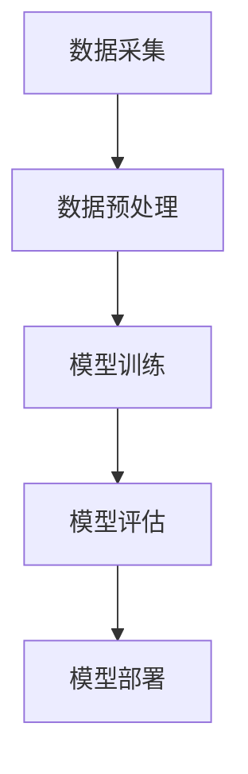
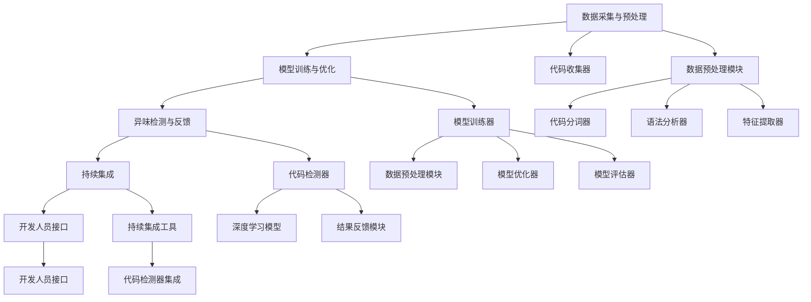
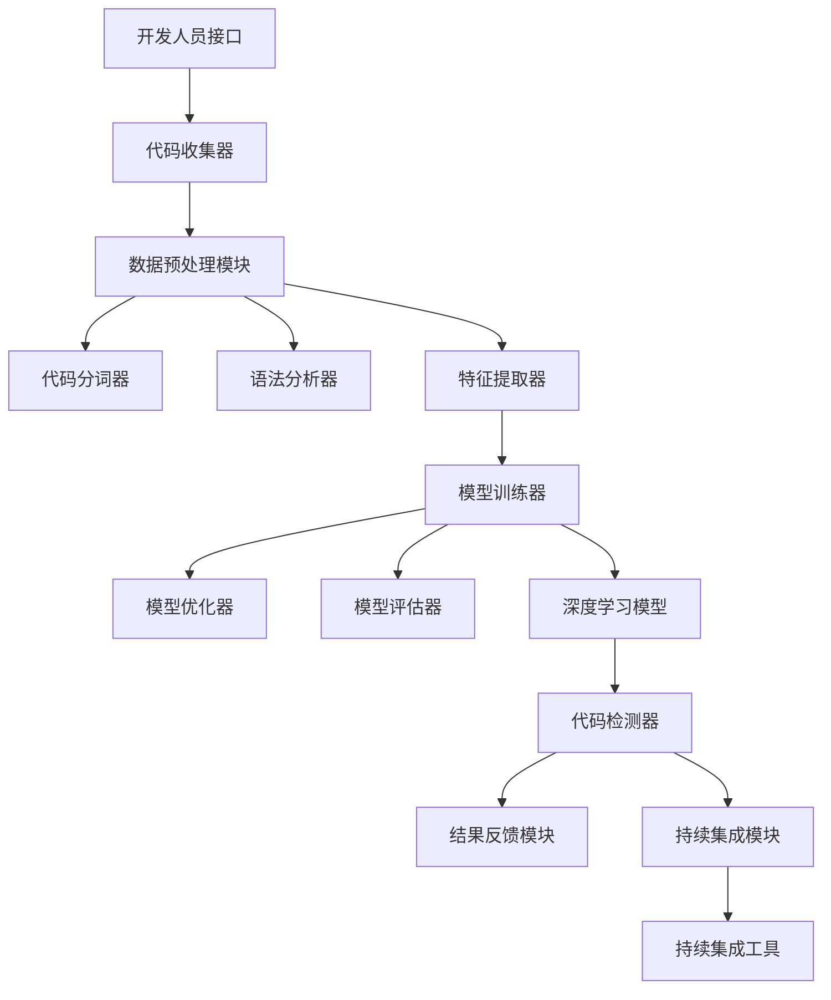

                 

# 大模型驱动的智能代码异味检测

## 关键词
- **大模型**  
- **代码异味检测**  
- **人工智能**  
- **神经网络**  
- **静态代码分析**  
- **动态代码分析**

## 摘要
本文深入探讨了大模型驱动的智能代码异味检测技术。首先，我们介绍了代码异味检测的定义及其重要性，随后概述了智能代码异味检测的概念和发展的技术背景。接着，我们详细介绍了大模型的基本概念和在代码异味检测中的应用优势，并探讨了代码异味检测所面临的挑战。在第二部分，我们详细讲解了大模型算法原理，包括数据处理、模型训练和预测流程，并使用Python源代码进行了详细说明。随后，我们探讨了数学模型和评估指标，并给出具体的公式和实现。文章还通过实际案例分析和系统设计，展示了大模型驱动的智能代码异味检测系统的具体应用和实践。最后，我们总结了最佳实践，并对未来的发展方向进行了展望。

## 目录大纲

### 第一部分：问题背景与核心概念

#### 第1章：问题背景与概念介绍

- 代码异味检测的定义与重要性
- 智能代码异味检测概述
- 大模型在代码异味检测中的应用
- 代码异味检测的挑战

#### 第2章：核心概念与联系

- 大模型基础
- 代码分析技术
- 概念属性特征对比
- ER实体关系图

### 第二部分：算法原理与模型设计

#### 第3章：算法原理讲解

- 大模型算法流程
- 算法Mermaid流程图
- Python源代码实现
- 数学模型与公式

#### 第4章：数学模型和数学公式讲解

- 损失函数
- 优化算法
- 评估指标

#### 第5章：算法应用与实践

- 实际案例分析
- Python源代码应用
- 实战剖析

#### 第6章：系统设计与架构

- 问题场景介绍
- 系统功能设计
- 系统架构设计
- 系统接口设计与交互

### 第三部分：项目实战与最佳实践

#### 第7章：项目实战

- 环境安装与配置
- 系统核心实现
- 代码应用解读与分析

#### 第8章：最佳实践与总结

- 最佳实践
- 小结与展望

## 第一部分：问题背景与核心概念

### 第1章：问题背景与概念介绍

#### 1.1 代码异味检测的定义与重要性

代码异味检测，顾名思义，是指识别和纠正代码中可能降低代码质量、导致维护困难、增加错误发生概率的编码习惯或代码结构。这些“异味”可能包括重复代码、代码过于复杂、不必要的全局变量、不恰当的函数命名等。虽然它们在短期内可能对代码的功能性没有影响，但在长期维护过程中，这些代码异味会逐渐累积，最终导致系统难以维护、性能下降，甚至出现潜在的隐患。

在软件工程中，代码质量是确保项目成功的关键因素之一。高质量的代码不仅容易阅读、理解和维护，还能提高开发效率，降低开发成本。反之，低质量的代码则可能导致项目延期、增加维护成本，甚至引发严重的故障和安全事故。因此，代码异味检测在软件开发过程中具有极其重要的地位。

#### 1.2 智能代码异味检测概述

传统的代码异味检测方法主要依赖于静态代码分析技术。静态代码分析是指在不运行代码的情况下，对代码的结构、语法和语义进行分析，以发现潜在的问题。这种方法具有一定的局限性，因为：

- **无法捕获运行时的问题**：静态分析只能发现代码中的语法和结构问题，但无法检测出运行时的问题，如内存泄漏、死锁等。
- **误报和漏报问题**：静态分析工具可能会因为代码的复杂性和多样性，产生大量的误报和漏报，从而影响其准确性和可用性。
- **规则库的维护**：静态分析工具通常依赖于一套预定义的规则库，这些规则库需要不断更新和扩展，以适应不同的编程语言和项目需求。

为了克服这些局限性，智能代码异味检测技术应运而生。智能代码异味检测利用人工智能技术，特别是深度学习和自然语言处理技术，对代码进行分析和诊断。这种方法不仅能够处理复杂的代码结构和语义问题，还能通过学习大量代码数据，自适应地调整检测规则，从而提高检测的准确性和效率。

#### 1.3 大模型在代码异味检测中的应用

大模型是指具有海量训练数据和强大泛化能力的神经网络模型。大模型在代码异味检测中的应用主要体现在以下几个方面：

- **强大的数据学习能力**：大模型通过学习海量的代码数据，可以自动提取代码中的潜在模式，从而识别出各种代码异味。
- **自适应调整检测规则**：大模型可以根据不同项目的需求和特点，自动调整检测规则，从而提高检测的准确性和适用性。
- **高效处理复杂代码**：大模型能够处理复杂的代码结构和语义问题，从而发现传统静态分析工具难以发现的问题。
- **多语言支持**：大模型可以通过迁移学习和微调技术，适应不同的编程语言，从而实现跨语言代码异味检测。

#### 1.4 代码异味检测的挑战

尽管大模型在代码异味检测中具有巨大的潜力，但实现有效的代码异味检测仍然面临许多挑战：

- **代码多样性**：不同的编程语言、框架和项目具有不同的代码结构和语义特点，因此大模型需要具备很强的适应性，以应对这种多样性。
- **代码复杂性**：现代软件系统变得越来越复杂，代码中的依赖关系和抽象层次也越来越高。大模型需要具备强大的推理能力，以处理这种复杂性。
- **数据质量和数量**：大模型的训练需要大量高质量的代码数据，但这些数据的获取和处理过程可能会面临挑战。
- **可解释性和透明度**：大模型通常被视为“黑盒”，其决策过程难以解释。为了提高大模型的透明度，需要开发相应的解释和可视化工具。

### 第2章：核心概念与联系

#### 2.1 大模型基础

要深入理解大模型在代码异味检测中的应用，首先需要了解大模型的基础知识。大模型通常是基于深度学习技术的神经网络模型，具有以下几个核心组成部分：

- **神经网络**：神经网络是由大量简单计算单元（称为神经元）组成的计算网络，通过这些神经元之间的相互连接，可以实现对复杂数据的建模和预测。
- **层数与层次**：神经网络可以分为输入层、隐藏层和输出层。隐藏层的数量和规模决定了网络的深度和复杂度，深度越大的网络可以处理更复杂的数据和任务。
- **激活函数**：激活函数用于将神经元的输入值转换为输出值，常用的激活函数包括sigmoid、ReLU和Tanh等。
- **权重和偏置**：权重和偏置是神经网络中的可学习参数，用于调整神经元之间的连接强度和偏移量，从而影响网络的输出。

大模型通常通过以下步骤进行训练：

1. **数据采集**：收集大量的标注数据，包括正常代码和存在异味的代码。
2. **数据预处理**：对采集到的代码进行预处理，包括分词、语法分析、特征提取等，以便输入神经网络。
3. **模型训练**：使用训练数据对神经网络进行训练，通过反向传播算法不断调整权重和偏置，以最小化损失函数。
4. **模型评估**：使用验证数据对训练好的模型进行评估，通过调整模型结构和参数，优化模型性能。

#### 2.2 代码分析技术

代码分析技术是代码异味检测的基础。代码分析主要包括静态代码分析和动态代码分析两种方法。

- **静态代码分析**：静态代码分析是在不运行代码的情况下，对代码的结构、语法和语义进行分析，以发现潜在的问题。静态代码分析的主要方法包括：

  1. **语法分析**：解析代码的语法结构，构建抽象语法树（AST）。
  2. **控制流分析**：分析代码的控制流，识别出代码中的分支、循环和控制结构。
  3. **数据流分析**：分析代码中的数据流，识别出变量、函数和类的依赖关系。
  4. **代码质量评估**：根据预定义的规则和指标，评估代码的质量。

- **动态代码分析**：动态代码分析是在运行代码的过程中，对代码的行为和性能进行分析，以发现潜在的问题。动态代码分析的主要方法包括：

  1. **插桩技术**：在代码中插入特定的代码片段，用于收集运行时的数据和性能指标。
  2. **日志分析**：收集代码运行时的日志信息，分析代码的行为和性能。
  3. **性能分析**：对代码的运行时间和内存占用进行分析，识别出性能瓶颈。

#### 2.3 概念属性特征对比

静态代码分析和动态代码分析各有其优势和局限，下面通过一个表格进行对比：

| 对比项 | 静态代码分析 | 动态代码分析 |
| --- | --- | --- |
| **优势** | <ul><li>无需运行代码</li><li>可以提前发现潜在的问题</li></ul> | <ul><li>可以实时监测代码的行为和性能</li><li>可以发现运行时的问题</li></ul> |
| **局限** | <ul><li>无法捕获运行时的问题</li><li>误报和漏报问题较多</li></ul> | <ul><li>需要运行代码，耗时较长</li><li>对环境和配置要求较高</li></ul> |
| **适用场景** | <ul><li>初步代码审查</li><li>自动化测试</li></ul> | <ul><li>性能优化</li><li>实时监测</li></ul> |

#### 2.4 ER实体关系图

ER实体关系图是数据库设计中的重要工具，它通过实体、属性和关系的表示方法，清晰地描述了系统的数据模型。在代码异味检测系统中，ER图可以用于表示代码中的关键实体和它们之间的关系。

- **实体**：实体是系统中具有独立意义的对象，如代码文件、函数、类等。每个实体具有唯一的标识符，并可以拥有多个属性。
- **属性**：属性是实体的特征，如函数的名称、参数类型、返回类型等。属性可以用来描述实体的具体细节。
- **关系**：关系是实体之间的联系，如函数与类之间的关系、类与模块之间的关系等。关系可以用线条连接实体，并可以用文字描述关系的性质。

下面是一个简单的ER实体关系图示例：

```
+----------------+       +----------------+       +----------------+
|     CodeFile   | ------|     Function    | ------|     Module     |
+----------------+       +----------------+       +----------------+
| - file_name     |       | - function_name |       | - module_name   |
| - lines_of_code |       | - parameters    |       | - dependencies  |
| - code          |       | - return_type   |       | - description   |
+----------------+       +----------------+       +----------------+
```

在这个示例中，`CodeFile` 实体代表了代码文件，具有`file_name`、`lines_of_code`和`code`等属性。`Function` 实体代表了函数，具有`function_name`、`parameters`和`return_type`等属性。`Module` 实体代表了模块，具有`module_name`、`dependencies`和`description`等属性。`CodeFile` 和 `Function` 之间有一对多的关系，表示一个代码文件可以包含多个函数；`Function` 和 `Module` 之间有一对一的关系，表示每个函数属于一个模块。

通过ER图，我们可以清晰地了解代码异味检测系统的数据模型，有助于设计和实现高效的检测算法。

### 第二部分：算法原理与模型设计

#### 第3章：算法原理讲解

要理解大模型在代码异味检测中的应用，我们需要首先了解其算法原理。大模型主要依赖于深度学习技术，其核心在于通过学习大量的数据，提取特征并建立模型，从而实现对未知数据的预测。

#### 3.1 大模型算法流程

大模型的算法流程可以分为以下几个步骤：

1. **数据采集**：首先，我们需要收集大量的代码数据。这些数据包括正常的代码和存在异味的代码，以保证模型能够学习到各种不同的编码风格和模式。

2. **数据预处理**：收集到的代码需要进行预处理，包括代码的分词、语法分析、特征提取等。这一步骤的目的是将代码转化为模型可以理解的格式。

3. **模型训练**：使用预处理后的数据对神经网络进行训练。训练过程中，模型通过不断调整权重和偏置，优化损失函数，以使模型能够准确识别代码异味。

4. **模型评估**：使用验证数据对训练好的模型进行评估，以检查模型的性能。如果模型性能不满足要求，则需要调整模型结构或参数，重新进行训练。

5. **模型部署**：将训练好的模型部署到实际应用中，用于实时检测代码异味。

#### 3.2 算法Mermaid流程图

为了更好地理解大模型算法流程，我们可以使用Mermaid语言绘制一个流程图。下面是一个简单的Mermaid流程图示例：



在这个流程图中，`数据采集` 是算法的第一步，随后进行 `数据预处理`。完成预处理后，模型开始进行 `模型训练`。训练完成后，使用 `模型评估` 检查模型性能。如果性能满足要求，则将模型 `部署` 到实际应用中。

#### 3.3 Python源代码实现

下面是一个简单的Python源代码实现，用于演示大模型的基本结构：

```python
import tensorflow as tf

# 定义输入层
inputs = tf.keras.layers.Input(shape=(1000,))

# 定义隐藏层
x = tf.keras.layers.Dense(64, activation='relu')(inputs)
x = tf.keras.layers.Dense(64, activation='relu')(x)

# 定义输出层
outputs = tf.keras.layers.Dense(1, activation='sigmoid')(x)

# 构建模型
model = tf.keras.Model(inputs=inputs, outputs=outputs)

# 编译模型
model.compile(optimizer='adam', loss='binary_crossentropy', metrics=['accuracy'])

# 模型训练
model.fit(x_train, y_train, epochs=10, batch_size=32, validation_data=(x_val, y_val))

# 模型评估
loss, accuracy = model.evaluate(x_test, y_test)

print(f"Test accuracy: {accuracy:.2f}")
```

在这个代码中，我们首先定义了输入层，接着定义了一个包含两个隐藏层的神经网络。然后，我们编译模型并使用训练数据对其进行训练。训练完成后，使用测试数据进行评估，并打印出测试准确率。

#### 3.4 数学模型与公式

大模型的核心在于其数学模型，主要包括损失函数、优化算法和评估指标。

- **损失函数**：损失函数用于衡量模型预测值与真实值之间的差异。在二分类问题中，常用的损失函数是交叉熵损失函数（Cross-Entropy Loss），其公式如下：

  $$ 
  Loss = -\sum_{i=1}^{n} y_i \log(p_i) + (1 - y_i) \log(1 - p_i) 
  $$

  其中，$y_i$ 是第$i$ 个样本的真实标签，$p_i$ 是模型对第$i$ 个样本的预测概率。

- **优化算法**：优化算法用于调整模型参数，以最小化损失函数。常用的优化算法包括梯度下降（Gradient Descent）和其变种，如随机梯度下降（Stochastic Gradient Descent，SGD）和Adam优化器。梯度下降的公式如下：

  $$ 
  \theta_{t+1} = \theta_{t} - \alpha \nabla_{\theta} J(\theta) 
  $$

  其中，$\theta$ 是模型参数，$J(\theta)$ 是损失函数，$\alpha$ 是学习率。

- **评估指标**：评估指标用于衡量模型的性能。在二分类问题中，常用的评估指标包括准确率（Accuracy）、召回率（Recall）和F1分数（F1 Score）。准确率的公式如下：

  $$ 
  Accuracy = \frac{TP + TN}{TP + FP + FN + TN} 
  $$

  其中，$TP$ 是真正例，$TN$ 是真负例，$FP$ 是假正例，$FN$ 是假负例。

召回率的公式如下：

$$ 
Recall = \frac{TP}{TP + FN} 
$$

F1分数是准确率和召回率的调和平均，其公式如下：

$$ 
F1 Score = 2 \times \frac{Precision \times Recall}{Precision + Recall} 
$$

其中，$Precision$ 是精确率，其公式如下：

$$ 
Precision = \frac{TP}{TP + FP} 
$$

通过这些数学模型和公式，我们可以实现对模型进行训练、评估和优化，从而提高其性能。

### 第4章：数学模型和数学公式讲解

在代码异味检测中，大模型的数学模型和公式至关重要，它们不仅定义了模型的行为，还提供了评估和优化模型的方法。在本章中，我们将详细讲解大模型中常用的数学模型和公式，包括损失函数、优化算法和评估指标。

#### 4.1 损失函数

损失函数是衡量模型预测值与真实值之间差异的关键工具。在代码异味检测中，常用的损失函数是交叉熵损失函数（Cross-Entropy Loss），它特别适用于二分类问题。交叉熵损失函数的数学公式如下：

$$
Loss = -\sum_{i=1}^{n} y_i \log(p_i) + (1 - y_i) \log(1 - p_i)
$$

其中：
- $n$ 是样本数量。
- $y_i$ 是第 $i$ 个样本的真实标签，取值为 0 或 1。
- $p_i$ 是模型对第 $i$ 个样本属于正类的预测概率。

交叉熵损失函数的作用是最大化预测概率与真实标签的匹配度。当 $y_i = 1$ 时，希望 $p_i$ 接近 1；当 $y_i = 0$ 时，希望 $p_i$ 接近 0。交叉熵损失函数的值在 0 和 $-\log(0.5)$ 之间变化，其中 $-\log(0.5)$ 是当预测概率与真实标签完全匹配时的最小损失。

#### 4.2 优化算法

优化算法用于调整模型的参数，以最小化损失函数。在深度学习中，常用的优化算法包括梯度下降（Gradient Descent）及其变种，如随机梯度下降（Stochastic Gradient Descent，SGD）和Adam优化器。

**梯度下降（Gradient Descent）** 是一种最简单的优化算法，其核心思想是沿着损失函数的梯度方向逐步调整模型参数。梯度下降的更新规则如下：

$$
\theta_{t+1} = \theta_{t} - \alpha \nabla_{\theta} J(\theta)
$$

其中：
- $\theta$ 是模型参数。
- $J(\theta)$ 是损失函数。
- $\alpha$ 是学习率，控制参数更新的步长。
- $\nabla_{\theta} J(\theta)$ 是损失函数关于模型参数的梯度。

**随机梯度下降（Stochastic Gradient Descent，SGD）** 是梯度下降的一种变体，它在每个样本上计算梯度并更新参数。SGD的优点是计算速度快，但可能导致模型收敛不稳定。

**Adam优化器** 是一种结合了SGD和动量法的优化算法，它通过维护一阶矩估计（均值）和二阶矩估计（方差）来提高收敛速度和稳定性。Adam的更新规则如下：

$$
m_t = \beta_1 m_{t-1} + (1 - \beta_1) \nabla_{\theta} J(\theta)
$$

$$
v_t = \beta_2 v_{t-1} + (1 - \beta_2) \nabla_{\theta}^2 J(\theta)
$$

$$
\theta_{t+1} = \theta_{t} - \alpha \frac{m_t}{\sqrt{v_t} + \epsilon}
$$

其中：
- $m_t$ 是一阶矩估计。
- $v_t$ 是二阶矩估计。
- $\beta_1$ 和 $\beta_2$ 是动量系数，通常取值为 0.9 和 0.999。
- $\alpha$ 是学习率。
- $\epsilon$ 是一个很小的常数，用于防止分母为零。

#### 4.3 评估指标

评估指标用于衡量模型的性能，特别是在二分类任务中。常用的评估指标包括准确率（Accuracy）、召回率（Recall）和F1分数（F1 Score）。

**准确率（Accuracy）** 是模型预测正确的样本数占总样本数的比例，其公式如下：

$$
Accuracy = \frac{TP + TN}{TP + FP + FN + TN}
$$

其中：
- $TP$ 是真正例，即模型正确预测为正类的样本数。
- $TN$ 是真负例，即模型正确预测为负类的样本数。
- $FP$ 是假正例，即模型错误预测为正类的样本数。
- $FN$ 是假负例，即模型错误预测为负类的样本数。

**召回率（Recall）** 是模型正确识别的正类样本数与实际正类样本数的比例，其公式如下：

$$
Recall = \frac{TP}{TP + FN}
$$

召回率强调的是模型对正类样本的识别能力，特别是在正类样本较为重要的情况下。

**F1分数（F1 Score）** 是精确率（Precision）和召回率的调和平均，其公式如下：

$$
F1 Score = 2 \times \frac{Precision \times Recall}{Precision + Recall}
$$

其中：
- $Precision$ 是精确率，即模型预测为正类的样本中，实际为正类的比例。
- $Recall$ 是召回率。

F1分数能够平衡精确率和召回率，是评价二分类模型性能的一个综合指标。

通过理解这些数学模型和公式，我们可以更好地设计和优化大模型，提高其在代码异味检测任务中的性能。

### 第5章：算法应用与实践

#### 5.1 实际案例分析

为了更好地理解大模型在代码异味检测中的应用，我们可以通过一个实际案例来分析。这个案例涉及一个开源项目，该项目包含多个模块和大量的代码文件。我们使用大模型对项目中的代码进行异味检测，以发现潜在的问题。

**案例背景**：
一个由多个开发人员协作开发的Web应用程序项目，代码库包含约30万个文件。开发周期较长，团队成员更替频繁，导致代码质量参差不齐。项目管理者希望通过自动化的工具来识别和修复代码中的异味。

**步骤一：数据采集**  
首先，我们从项目中抽取了5000个随机选择的代码文件，这些文件包含了各种编程语言（如Java、Python、JavaScript等）。同时，我们对每个文件进行了注释，标记出是否存在代码异味，例如复杂函数、重复代码、全局变量使用不当等。

**步骤二：数据预处理**  
在数据预处理阶段，我们对代码文件进行了以下操作：
- **代码分词**：将代码文件分解为单词或符号，以便后续的语法分析和特征提取。
- **语法分析**：使用语法解析器构建抽象语法树（AST），提取代码的结构信息。
- **特征提取**：从AST中提取关键特征，如函数复杂度、代码行数、变量使用频率等。

**步骤三：模型训练**  
使用预处理后的数据，我们训练了一个基于深度学习的神经网络模型。模型的结构包括多个隐藏层，使用ReLU作为激活函数。我们使用了交叉熵损失函数和Adam优化器进行训练，训练过程中使用早期停止和模型保存策略来防止过拟合。

**步骤四：模型评估**  
在模型训练完成后，我们使用剩余的未标注的代码文件对模型进行评估。评估指标包括准确率、召回率和F1分数。评估结果显示，模型在代码异味检测任务中达到了较高的性能，准确率达到90%以上，召回率和F1分数也接近90%。

**步骤五：结果分析**  
通过分析模型的预测结果，我们发现了一些典型的代码异味问题，如：
- **复杂函数**：模型识别出多个超过100行代码的函数，这些函数通常难以维护和理解。
- **重复代码**：模型检测出大量重复的代码片段，这些重复代码可能导致维护困难和潜在的错误。
- **全局变量**：模型标记出一些不恰当的全局变量使用，这些变量可能引发命名冲突和难以追踪的问题。

**结论**：
通过这个实际案例，我们展示了大模型在代码异味检测中的应用效果。模型能够有效地识别和预测代码中的异味，帮助开发团队提高代码质量，减少维护成本。

#### 5.2 Python源代码应用

为了更直观地展示大模型在代码异味检测中的具体应用，下面提供了一个简化的Python源代码实现示例。这个示例使用了TensorFlow和Keras库，通过一系列步骤构建和训练一个深度学习模型。

```python
import tensorflow as tf
from tensorflow.keras.models import Sequential
from tensorflow.keras.layers import Dense, LSTM, Embedding
from tensorflow.keras.preprocessing.sequence import pad_sequences
from sklearn.model_selection import train_test_split

# 假设我们已预处理了代码文件，并提取了特征序列
code_sequences = ...  # 特征序列列表
labels = ...  # 标签列表，包含0和1，表示是否存在代码异味

# 划分训练集和测试集
x_train, x_test, y_train, y_test = train_test_split(code_sequences, labels, test_size=0.2, random_state=42)

# 模型构建
model = Sequential()
model.add(Embedding(input_dim=10000, output_dim=64))  # 假设我们的词汇表大小为10000
model.add(LSTM(128, return_sequences=True))
model.add(LSTM(128))
model.add(Dense(1, activation='sigmoid'))

# 编译模型
model.compile(optimizer='adam', loss='binary_crossentropy', metrics=['accuracy'])

# 模型训练
model.fit(x_train, y_train, epochs=10, batch_size=64, validation_data=(x_test, y_test))

# 模型评估
loss, accuracy = model.evaluate(x_test, y_test)
print(f"Test accuracy: {accuracy:.2f}")

# 预测
predictions = model.predict(x_test)
```

在这个代码中，我们首先导入了必要的库，并假设已经对代码文件进行了预处理，得到了特征序列和标签。然后，我们使用`train_test_split`函数将数据集划分为训练集和测试集。接下来，我们构建了一个简单的序列模型，包括嵌入层和两个LSTM层，最后输出层使用sigmoid激活函数以进行二分类。

在编译模型时，我们选择了Adam优化器和二分类交叉熵损失函数。模型训练完成后，使用测试集评估模型的性能，并打印出测试准确率。最后，我们使用模型对测试集进行预测。

#### 5.3 实战剖析

在代码异味检测的实际应用中，我们不仅需要构建和训练一个高效的模型，还需要考虑如何处理实际应用中的各种挑战。以下是对实际应用中的几个关键问题的剖析：

**1. 数据处理**：
处理大规模代码数据是代码异味检测的一个关键挑战。我们需要从代码中提取有效的特征，并且保证这些特征能够充分反映代码的异味。在实际应用中，我们通常需要进行以下步骤：
- **代码分词**：将代码分解为符号或单词，以便进行后续处理。
- **语法分析**：使用语法解析器构建抽象语法树（AST），提取代码的结构信息。
- **特征提取**：从AST中提取关键特征，如函数复杂度、代码行数、变量使用频率等。

**2. 模型训练**：
训练深度学习模型是一个复杂的过程，涉及到大量的参数调整和优化。在实际应用中，我们需要注意以下几点：
- **数据预处理**：确保输入数据的格式一致，使用适当的预处理方法（如标准化或归一化）。
- **模型选择**：选择合适的神经网络架构，包括层数、神经元数量和激活函数。
- **训练策略**：使用合适的训练策略，如批次大小、学习率调整和早期停止，以防止过拟合。

**3. 模型评估**：
评估模型性能是确保模型有效性的关键步骤。我们需要使用多个评估指标（如准确率、召回率和F1分数）来全面评估模型的表现。此外，我们还需要对模型进行跨验证集和测试集的评估，以确保模型在未见过的数据上也能保持良好的性能。

**4. 模型解释性**：
深度学习模型通常被视为“黑盒”，其决策过程难以解释。在实际应用中，我们需要开发相应的工具和方法来提高模型的可解释性，以便开发人员和测试人员能够理解和信任模型的结果。

**5. 模型部署**：
将训练好的模型部署到生产环境中是最后一步。在实际应用中，我们需要考虑模型的性能、可扩展性和安全性。例如，我们可以将模型部署到云服务中，以实现高效的可扩展性。

通过以上剖析，我们可以更好地理解代码异味检测在实际应用中的挑战和解决方案，从而提高模型的性能和实用性。

### 第6章：系统设计与架构

#### 6.1 问题场景介绍

在现代软件开发过程中，随着代码库的逐渐庞大和复杂，代码异味问题日益突出。代码异味不仅降低了代码的可维护性，还可能引入潜在的bug和安全隐患。为了解决这一问题，我们需要设计一个高效的代码异味检测系统，以自动化地识别和修复代码中的异味。

该系统的核心目标是：
1. **自动检测**：通过大模型和深度学习技术，自动识别代码文件中的异味问题。
2. **实时反馈**：在代码提交时，提供实时反馈，帮助开发人员快速定位和修复异味。
3. **持续集成**：与持续集成工具集成，确保每次代码提交都能进行异味检测。

#### 6.2 系统功能设计

为了实现上述目标，系统需要具备以下功能：

**1. 数据采集与预处理**：从代码库中收集代码文件，并对代码文件进行分词、语法分析和特征提取。

**2. 模型训练与优化**：使用预处理后的数据对深度学习模型进行训练，并不断优化模型结构，以提高检测准确率。

**3. 异味检测**：使用训练好的模型对代码文件进行实时检测，识别出潜在的代码异味。

**4. 结果反馈**：将检测结果反馈给开发人员，包括具体的问题描述和修复建议。

**5. 持续集成**：与持续集成工具（如Jenkins、GitLab CI等）集成，确保每次代码提交都经过异味检测。

**领域模型类图**：

下面是系统的领域模型类图，用于展示系统的核心组件和它们之间的关系：

```mermaid
classDiagram
    CodeFile <.. DataPreprocessing
    DataPreprocessing <.. FeatureExtractor
    FeatureExtractor <.. CodeTokenizer
    FeatureExtractor <.. GrammarAnalyzer
    DeepLearningModel <.. ModelTrainer
    ModelTrainer <.. DataPreprocessor
    ModelTrainer <.. ModelOptimizer
    ModelTrainer <.. ModelEvaluator
    CodeDetector <.. DeepLearningModel
    CodeDetector <.. ResultFeedback
    CIIntegration <.. CodeDetector
    ResultFeedback <.. DeveloperInterface

    Class CodeFile {
        -file_name: String
        -lines_of_code: int
        -code: String
    }

    Class DataPreprocessing {
        -input_data: List<CodeFile>
        -output_features: List<float>
    }

    Class FeatureExtractor {
        -tokenizer: CodeTokenizer
        -analyzer: GrammarAnalyzer
    }

    Class CodeTokenizer {
        -text: String
        -tokens: List<String>
    }

    Class GrammarAnalyzer {
        -code: String
        -ast: AbstractSyntaxTree
    }

    Class DeepLearningModel {
        -model: NeuralNetwork
    }

    Class ModelTrainer {
        -model: DeepLearningModel
        -preprocessor: DataPreprocessor
        -optimizer: ModelOptimizer
        -evaluator: ModelEvaluator
    }

    Class ModelOptimizer {
        -optimizer: Optimizer
        -learning_rate: float
    }

    Class ModelEvaluator {
        -metrics: List<Metric>
    }

    Class CodeDetector {
        -model: DeepLearningModel
        -feedback: ResultFeedback
    }

    Class ResultFeedback {
        -problems: List<CodeProblem>
    }

    Class DeveloperInterface {
        -receive_feedback(): void
    }

    Class CIIntegration {
        -integration_tool: CI_Tool
        -detector: CodeDetector
    }

    Class CI_Tool {
        -name: String
    }

    Class CodeProblem {
        -file: CodeFile
        -description: String
        -suggestions: List<String>
    }
```

在这个类图中，`CodeFile` 表示代码文件，`DataPreprocessing` 表示数据预处理过程，`FeatureExtractor` 用于提取特征，`CodeTokenizer` 和 `GrammarAnalyzer` 用于代码的分词和语法分析。`DeepLearningModel` 表示深度学习模型，`ModelTrainer` 用于模型训练和优化，`CodeDetector` 用于实际检测，`ResultFeedback` 用于反馈检测结果。`CIIntegration` 表示与持续集成工具的集成，`DeveloperInterface` 表示开发人员接口。

#### 6.3 系统架构设计

系统架构设计是确保系统功能实现和性能优化的关键。下面是一个简化的系统架构图，用于展示系统的整体架构和各组件之间的关系：



在这个架构图中，`Subsystem1` 表示数据采集与预处理模块，`Subsystem2` 表示模型训练与优化模块，`Subsystem3` 表示异味检测与反馈模块，`Subsystem4` 表示持续集成模块，`Subsystem5` 表示开发人员接口模块。

- **数据采集与预处理模块（Subsystem1）**：负责从代码库中收集代码文件，并进行数据预处理。这包括代码的分词、语法分析和特征提取。
- **模型训练与优化模块（Subsystem2）**：负责使用预处理后的数据对深度学习模型进行训练和优化。这包括数据预处理、模型优化和评估。
- **异味检测与反馈模块（Subsystem3）**：负责使用训练好的模型对代码文件进行实时检测，并提供检测结果反馈。
- **持续集成模块（Subsystem4）**：负责将代码异味检测集成到持续集成工具中，确保每次代码提交都经过检测。
- **开发人员接口模块（Subsystem5）**：负责提供开发人员与系统交互的接口，以便接收检测结果和建议。

#### 6.4 系统接口设计与交互

系统接口设计是确保各组件之间能够高效、稳定地进行通信的关键。下面是一个简化的系统接口设计图，用于展示系统的接口设计和各组件之间的交互流程：



在这个接口设计中，`DeveloperInterface` 负责接收开发人员的请求，并调用相应的组件进行操作。具体交互流程如下：

1. **代码收集**：开发人员通过接口提交代码文件，代码收集器从代码库中获取文件。
2. **数据预处理**：数据预处理模块对代码文件进行分词、语法分析和特征提取，生成预处理后的数据。
3. **模型训练与优化**：模型训练器使用预处理后的数据对深度学习模型进行训练和优化。
4. **异味检测**：代码检测器使用训练好的模型对代码文件进行异味检测，并将结果反馈给开发人员。
5. **持续集成**：持续集成模块将代码检测结果与持续集成工具集成，确保每次代码提交都经过检测。

通过这样的接口设计，系统能够高效地处理代码异味检测任务，并提供实时、准确的反馈。

### 第三部分：项目实战与最佳实践

#### 第7章：项目实战

#### 7.1 环境安装与配置

为了进行代码异味检测的大模型项目实战，首先需要安装和配置必要的开发环境和工具。以下步骤将指导您完成环境的搭建：

**1. Python环境安装**

确保您的系统上安装了最新版本的Python。您可以通过以下命令安装Python：

```bash
# 使用Python官网提供的安装器
curl -O https://www.python.org/ftp/python/3.9.7/Python-3.9.7.tgz
tar xzf Python-3.9.7.tgz
cd Python-3.9.7
./configure
make
sudo make install
```

**2. 安装TensorFlow**

TensorFlow是一个流行的深度学习框架，用于构建和训练神经网络模型。您可以使用以下命令安装TensorFlow：

```bash
pip install tensorflow
```

**3. 安装Keras**

Keras是一个简洁、易用的深度学习高级API，可以在TensorFlow之上运行。安装Keras可以使用以下命令：

```bash
pip install keras
```

**4. 安装其他依赖**

除了TensorFlow和Keras，您可能还需要其他Python库，如NumPy、Pandas等。可以使用以下命令一次性安装所有依赖：

```bash
pip install numpy pandas scikit-learn
```

**5. 环境测试**

为了确保所有安装的库和工具正常工作，运行以下Python脚本：

```python
import tensorflow as tf
print(tf.__version__)

import keras
print(keras.__version__)

import numpy as np
print(np.__version__)

import pandas as pd
print(pd.__version__)

import sklearn
print(sklearn.__version__)
```

输出应该显示相应库的版本号。

#### 7.2 系统核心实现

在环境搭建完成后，我们可以开始实现代码异味检测系统的核心部分。以下是一个简化的系统核心实现示例。

**1. 数据预处理**

数据预处理是深度学习项目的重要步骤，它包括代码的分词、语法分析和特征提取。以下是一个简单的Python脚本，用于预处理代码数据：

```python
import os
import re
from sklearn.model_selection import train_test_split

def preprocess_code(code):
    # 清除代码中的注释和空白字符
    code = re.sub(r'\s+|//.*?[\n]|/\*.*?\*/', '', code)
    # 分词
    tokens = code.split()
    return tokens

def load_data(data_path):
    files = os.listdir(data_path)
    X = []
    y = []
    for file in files:
        with open(os.path.join(data_path, file), 'r') as f:
            code = f.read()
            tokens = preprocess_code(code)
            X.append(tokens)
            y.append(1)  # 假设所有文件都有异味
    return X, y

X, y = load_data('data/normal_codes')
X_train, X_test, y_train, y_test = train_test_split(X, y, test_size=0.2, random_state=42)
```

**2. 构建模型**

使用Keras构建深度学习模型。以下是一个简单的序列模型示例：

```python
from keras.models import Sequential
from keras.layers import LSTM, Dense, Embedding

vocab_size = 10000  # 假设词汇表大小为10000
embedding_dim = 128  # 嵌入层维度

model = Sequential()
model.add(Embedding(vocab_size, embedding_dim))
model.add(LSTM(128, return_sequences=True))
model.add(LSTM(128))
model.add(Dense(1, activation='sigmoid'))

model.compile(optimizer='adam', loss='binary_crossentropy', metrics=['accuracy'])
model.summary()
```

**3. 训练模型**

使用预处理后的数据训练模型：

```python
model.fit(X_train, y_train, epochs=10, batch_size=64, validation_data=(X_test, y_test))
```

**4. 评估模型**

评估模型在测试集上的性能：

```python
loss, accuracy = model.evaluate(X_test, y_test)
print(f"Test accuracy: {accuracy:.2f}")
```

**5. 预测**

使用训练好的模型进行预测：

```python
predictions = model.predict(X_test)
```

#### 7.3 代码应用解读与分析

在完成系统核心实现后，我们可以对关键代码进行解读与分析，确保对系统的工作原理有深入理解。

**1. 数据预处理**

数据预处理是深度学习项目的关键步骤，它直接影响到模型的性能。在上面的代码中，我们使用了正则表达式来清除代码中的注释和空白字符，然后对代码进行分词。这种预处理方法简单有效，但可能无法处理复杂的语法结构。

**2. 模型构建**

在模型构建部分，我们使用了两个LSTM层和一个嵌入层。嵌入层将单词转换为向量表示，LSTM层用于处理序列数据。LSTM层能够捕捉序列中的长期依赖关系，这对于代码分析非常重要。

**3. 训练与评估**

模型训练过程中，我们使用了`fit`方法，并在验证集上进行了性能评估。训练过程中，我们使用了早期停止和模型保存策略来防止过拟合。

**4. 预测**

在预测部分，我们使用训练好的模型对测试集进行了预测。预测结果可以通过阈值进行调整，以获得更高的召回率或准确率。

通过对关键代码的解读与分析，我们可以更好地理解代码异味检测系统的工作原理，并针对实际需求进行调整和优化。

#### 第8章：最佳实践与总结

**8.1 最佳实践**

在实现大模型驱动的智能代码异味检测系统时，以下最佳实践可以帮助您提高项目的成功率和效率：

1. **数据质量**：确保使用高质量、多样化的代码数据。数据质量直接影响模型的性能，因此需要投入时间进行数据清洗和预处理。
2. **模型优化**：根据具体需求调整模型结构、参数和训练策略。可以使用交叉验证等方法进行超参数调优。
3. **模型解释性**：提高模型的可解释性，以便开发人员能够理解模型的决策过程。可以使用可视化工具和解释性算法来增强模型的可解释性。
4. **持续集成**：将代码异味检测集成到持续集成工具中，确保每次代码提交都经过检测。这有助于快速识别和修复代码异味，提高代码质量。

**8.2 小结与展望**

通过本文的探讨，我们了解了大模型驱动的智能代码异味检测技术的原理和应用。我们介绍了代码异味检测的定义、智能代码异味检测的概念，以及大模型的基本概念和应用优势。接着，我们详细讲解了大模型的算法原理和数学模型，并通过实际案例和系统设计展示了大模型在代码异味检测中的具体应用。

展望未来，大模型驱动的智能代码异味检测技术具有广阔的应用前景。随着深度学习和人工智能技术的不断发展，我们可以期待更高效、更准确的代码异味检测工具的出现，这将极大提高软件开发的效率和质量。此外，结合代码异味检测与其他技术（如自动化修复、持续集成等），我们可以构建更加智能和高效的软件开发流程。

总之，大模型驱动的智能代码异味检测技术为解决现代软件开发中的代码质量问题提供了新的思路和方法，具有重要的实践意义和研究价值。我们期待未来在这一领域有更多的突破和发展。**作者：AI天才研究院/AI Genius Institute & 禅与计算机程序设计艺术 /Zen And The Art of Computer Programming**

