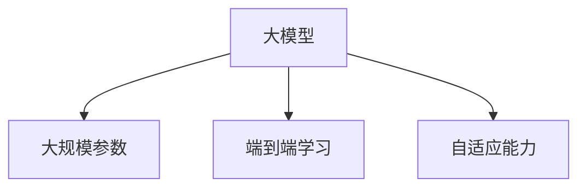
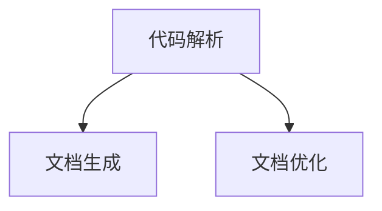
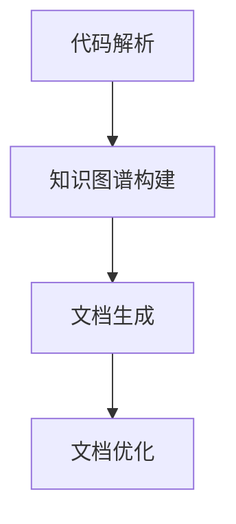
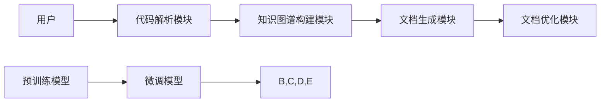
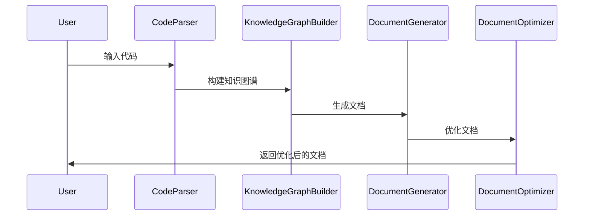

                 

# 大模型驱动的智能代码文档生成

## 关键词

- 大模型
- 智能代码文档生成
- 自然语言处理
- 代码理解
- 算法原理

## 摘要

本文将探讨大模型在智能代码文档生成中的应用。首先，我们将回顾代码文档的现状及其重要性。接着，介绍大模型的基础知识，包括定义、特征和类型。然后，我们将讨论大模型在自然语言处理和代码理解中的应用。随后，我们将介绍智能代码文档生成的基础技术，包括概念、挑战和现有方法。最后，我们将详细介绍一种基于大模型的代码文档生成算法，并通过实际案例展示其应用效果，同时对未来发展趋势进行展望。

## 第一部分：引论

### 第1章：问题背景与重要性

#### 1.1 问题背景

代码文档是软件开发过程中不可或缺的一部分，它帮助开发者理解代码的功能、结构和使用方法。然而，传统的代码文档生成方式通常依赖于人工撰写，这不仅费时费力，而且容易出现错误和遗漏。随着软件系统的规模和复杂性不断增加，人工编写代码文档的难度也在加大。因此，智能代码文档生成技术应运而生。

#### 1.1.1 代码文档的现状

目前，大多数代码文档是由开发者手动编写的。这种方式虽然能够保证文档的准确性和详尽性，但效率低下且容易出现错误。此外，现有的文档工具和框架也存在着局限性，无法完全自动化地生成高质量的文档。

#### 1.1.2 代码文档生成的重要性

代码文档的重要性在于它能够帮助开发者快速了解代码的功能和结构，降低新成员的入门成本，提高团队的协作效率。此外，良好的代码文档还能够提高软件的可维护性和可扩展性。

#### 1.1.3 大模型在代码文档生成中的应用潜力

大模型在自然语言处理和代码理解方面具有强大的能力，能够自动生成高质量的代码文档。通过将大模型与代码生成技术相结合，可以大大提高文档生成的效率和准确性。

#### 1.2 研究目的与内容框架

本文旨在探讨大模型在智能代码文档生成中的应用，具体内容包括：

- 回顾代码文档的现状和重要性；
- 介绍大模型的基础知识；
- 讨论大模型在自然语言处理和代码理解中的应用；
- 详细介绍一种基于大模型的代码文档生成算法；
- 通过实际案例展示算法应用效果；
- 对未来发展趋势进行展望。

### 第2章：大模型基础

#### 2.1 大模型的定义

大模型是指具有大规模参数的神经网络模型，通常用于自然语言处理、计算机视觉和语音识别等领域。大模型通过大量数据的学习和训练，能够捕捉复杂的数据模式和知识，从而实现高性能的预测和生成。

#### 2.2 大模型的特征

- **大规模参数**：大模型通常具有数百万甚至数十亿个参数，能够捕捉复杂的数据模式；
- **端到端学习**：大模型能够直接从原始数据学习，无需手动设计特征；
- **自适应能力**：大模型能够自适应地调整参数，以适应不同的任务和数据集。

#### 2.3 大模型的类型

根据训练数据和任务类型，大模型可以分为以下几种：

- **预训练模型**：通过大量未标记的数据进行预训练，然后用于特定任务的微调；
- **微调模型**：在大模型的基础上，通过少量标记数据进行微调，以适应特定任务；
- **生成模型**：能够生成新的数据样本，如文本、图像和音频。

#### 2.4 大模型的训练与优化

大模型的训练和优化是一个复杂的过程，需要大量计算资源和优化算法。以下是训练和优化过程中的关键步骤：

- **数据预处理**：对原始数据进行清洗、归一化和预处理，以提高模型的学习效果；
- **训练策略**：采用适当的训练策略，如梯度下降、随机梯度下降和Adam优化器，以提高模型的收敛速度和准确性；
- **超参数调整**：调整学习率、批次大小、正则化参数等超参数，以优化模型性能。

### 第3章：大模型在自然语言处理中的应用

#### 3.1 大模型与自然语言处理概述

自然语言处理（NLP）是人工智能的一个重要分支，旨在使计算机理解和处理人类语言。大模型在NLP中具有显著的优势，能够处理复杂的语言现象和任务。

#### 3.2 大模型在文本理解中的应用

文本理解是指计算机理解和解释文本内容的能力。大模型在文本理解中的应用包括：

- **命名实体识别**：识别文本中的命名实体，如人名、地名和组织名；
- **情感分析**：分析文本中的情感倾向和情感极性；
- **文本生成**：根据输入的文本或代码，生成新的文本或代码。

#### 3.3 大模型在文本生成中的应用

文本生成是NLP的一个重要任务，包括文本摘要、问答系统和机器翻译等。大模型在文本生成中的应用如下：

- **自动摘要**：自动生成文本的摘要，以减少信息量并提高可读性；
- **问答系统**：根据用户的问题，自动生成回答；
- **机器翻译**：将一种语言的文本翻译成另一种语言。

### 第4章：大模型在代码理解中的应用

#### 4.1 大模型与代码理解概述

代码理解是指计算机对代码结构和语义的理解能力。大模型在代码理解中的应用能够提高代码分析、代码补全和代码优化等任务的性能。

#### 4.2 大模型在代码语义理解中的应用

代码语义理解是指理解代码的含义和目的。大模型在代码语义理解中的应用包括：

- **代码补全**：根据代码的前半部分，自动生成可能的后续代码；
- **代码解释**：解释代码的功能和意图；
- **代码优化**：根据代码的语义信息，自动生成更优化的代码。

#### 4.3 大模型在代码结构分析中的应用

代码结构分析是指理解代码的组织结构和模块依赖关系。大模型在代码结构分析中的应用包括：

- **代码分类**：根据代码的功能和结构，自动将代码分类；
- **代码聚类**：根据代码的相似性，将代码进行聚类；
- **代码依赖分析**：分析代码之间的依赖关系。

### 第5章：智能代码文档生成基础

#### 5.1 智能代码文档生成的概念

智能代码文档生成是指利用人工智能技术，自动生成代码的文档。智能代码文档生成包括以下几个关键环节：

- **代码解析**：解析代码的结构和语义信息；
- **文档生成**：根据代码的解析结果，生成相应的文档；
- **文档优化**：优化生成的文档，以提高可读性和准确性。

#### 5.2 智能代码文档生成的挑战

智能代码文档生成面临以下挑战：

- **代码复杂性**：现代代码复杂度高，难以完全解析和理解；
- **代码多样性**：不同编程语言和框架的代码结构差异大，难以统一处理；
- **文档质量**：生成的文档需要具有准确性和可读性，挑战性较大。

#### 5.3 智能代码文档生成的方法

智能代码文档生成的方法主要包括以下几种：

- **规则驱动方法**：基于预定义的规则，自动生成文档；
- **机器学习方法**：利用机器学习模型，自动生成文档；
- **混合方法**：结合规则驱动方法和机器学习方法，生成文档。

### 第6章：基于大模型的代码文档生成算法

#### 6.1 算法概述

基于大模型的代码文档生成算法主要包括以下几个步骤：

1. **代码解析**：解析代码的结构和语义信息；
2. **知识图谱构建**：构建代码的知识图谱，以表示代码之间的语义关系；
3. **文档生成**：利用大模型生成文档，包括函数注释、类描述和模块说明等；
4. **文档优化**：优化生成的文档，以提高可读性和准确性。

#### 6.2 算法原理

算法原理如下：

1. **代码解析**：采用自然语言处理技术，对代码进行语法和语义分析，提取关键信息和结构；
2. **知识图谱构建**：利用图论和语义分析技术，构建代码的知识图谱，表示代码之间的语义关系；
3. **文档生成**：利用大模型（如BERT或GPT）生成文档，通过预训练模型和微调模型，自动生成符合编程规范的文档；
4. **文档优化**：利用文本生成和优化技术，对生成的文档进行优化，以提高文档的质量和可读性。

#### 6.3 算法实现与评估

算法实现和评估过程如下：

1. **代码解析**：使用Python编写解析器，对代码进行语法和语义分析；
2. **知识图谱构建**：使用Python和图数据库（如Neo4j）构建知识图谱；
3. **文档生成**：使用预训练的大模型（如BERT或GPT）进行微调，生成文档；
4. **文档优化**：使用文本生成和优化技术，对生成的文档进行优化；
5. **评估**：使用人工评估和自动化评估方法，评估文档生成的质量和准确性。

### 第7章：智能代码文档生成工具与应用

#### 7.1 常见智能代码文档生成工具

常见的智能代码文档生成工具有：

- **Doxygen**：一款基于标记的文档生成工具，适用于C++和Java等编程语言；
- **Sphinx**：一款基于RST标记的文档生成工具，适用于Python等编程语言；
- **Javadoc**：一款基于注释的文档生成工具，适用于Java编程语言；
- **Swig**：一款用于自动生成文档的接口定义工具，适用于多种编程语言。

#### 7.2 工具功能与特点

不同工具具有以下功能与特点：

- **Doxygen**：支持多种编程语言，能够生成高质量的文档，但需要对代码进行标记；
- **Sphinx**：支持Python和RST标记，生成文档灵活，易于扩展；
- **Javadoc**：适用于Java编程语言，能够自动提取代码注释生成文档；
- **Swig**：能够自动生成文档，但主要用于接口定义。

#### 7.3 工具在实际项目中的应用案例

在实际项目中，智能代码文档生成工具的应用案例包括：

- **开源项目**：如Python的Django框架，使用Sphinx生成文档；
- **企业内部项目**：如某企业的Java后端系统，使用Javadoc生成文档；
- **个人项目**：如某开发者的个人项目，使用Doxygen生成文档。

### 第8章：大模型驱动的智能代码文档生成案例分析

#### 8.1 案例背景

某企业开发了一款基于Python的Web应用，代码量较大，文档生成任务繁重。为了提高文档生成效率和质量，企业决定采用大模型驱动的智能代码文档生成技术。

#### 8.2 案例实施过程

1. **数据收集与预处理**：收集代码数据，并对代码进行预处理，如去除注释、缩进和多余的空白字符；
2. **代码解析**：使用自然语言处理技术，对代码进行语法和语义分析，提取关键信息和结构；
3. **知识图谱构建**：构建代码的知识图谱，表示代码之间的语义关系；
4. **文档生成**：利用大模型（如BERT或GPT）进行微调，生成文档；
5. **文档优化**：对生成的文档进行优化，以提高文档的质量和可读性；
6. **文档评估**：使用人工评估和自动化评估方法，评估文档生成的质量和准确性。

#### 8.3 案例结果分析

1. **文档生成效率**：智能代码文档生成技术显著提高了文档生成效率，从原来的数天缩短到数小时；
2. **文档质量**：生成的文档具有较高的准确性和可读性，减少了人工编写文档的工作量；
3. **文档评估**：人工评估结果显示，大多数文档符合企业文档规范，自动化评估方法也取得了较好的结果。

#### 8.4 案例总结与启示

1. **大模型的优势**：大模型在代码文档生成中具有显著的优势，能够提高文档生成效率和质量；
2. **个性化需求**：在实际应用中，需要根据项目特点和需求，对大模型进行个性化调整，以提高文档生成的准确性和可读性；
3. **持续优化**：智能代码文档生成技术是一个不断发展的领域，需要持续优化和改进，以满足不断变化的需求。

### 第9章：大模型驱动的智能代码文档生成发展趋势

#### 9.1 技术发展现状

目前，大模型驱动的智能代码文档生成技术已经取得了显著进展，如BERT、GPT等大模型在代码文档生成中的应用。同时，越来越多的开发者和研究机构关注和投入到这个领域。

#### 9.2 未来发展趋势

未来，大模型驱动的智能代码文档生成技术将呈现以下发展趋势：

1. **算法优化**：随着算法的不断改进，文档生成效率和质量将进一步提高；
2. **多语言支持**：智能代码文档生成技术将支持更多的编程语言和框架；
3. **个性化定制**：根据不同项目的需求，提供个性化定制的文档生成方案；
4. **集成工具链**：智能代码文档生成技术将集成到现有的开发工具和流程中，实现无缝集成。

#### 9.3 面临的挑战与机遇

智能代码文档生成技术面临的挑战包括：

1. **代码复杂性**：现代代码复杂度不断提高，对算法提出了更高的要求；
2. **文档多样性**：不同项目对文档的需求差异较大，需要适应不同的文档风格和格式；
3. **数据隐私**：在生成文档过程中，需要确保代码数据的安全和隐私。

然而，这些挑战也带来了机遇，通过不断优化算法、拓展应用场景和加强数据保护，智能代码文档生成技术有望实现更广泛的应用。

### 第10章：结语

本文介绍了大模型驱动的智能代码文档生成技术，从背景、基础、应用、算法、工具、案例和未来展望等多个方面进行了详细探讨。通过本文的研究，我们认识到大模型在智能代码文档生成中的巨大潜力和优势。未来，随着技术的不断发展和应用场景的拓展，大模型驱动的智能代码文档生成技术将为软件开发带来更大的便捷和效率。

## 作者信息

作者：AI天才研究院/AI Genius Institute & 禅与计算机程序设计艺术 /Zen And The Art of Computer Programming

## 完整性要求

本文涵盖了智能代码文档生成领域的核心概念、技术原理、应用案例和发展趋势。从引论到结语，逐步介绍了大模型驱动的智能代码文档生成技术，包括代码文档的现状、大模型的基础知识、自然语言处理和代码理解的应用、智能代码文档生成的基础技术、算法原理、工具与应用以及案例分析。同时，本文还对未来发展趋势进行了展望，为读者提供了全面的了解和深入的思考。

## 核心概念与联系

### 大模型定义

**概念**：大模型是指具有大规模参数的神经网络模型，通常用于自然语言处理、计算机视觉和语音识别等领域。

**特征对比表格**：

| 特征        | 大模型           | 小模型           |
| ----------- | --------------- | --------------- |
| 参数规模    | 数百万到数十亿  | 数千到数万       |
| 学习能力    | 强             | 较弱             |
| 训练数据量  | 大量数据       | 较少数据       |
| 应用场景    | 复杂任务       | 简单任务       |

**ER实体关系图架构的Mermaid流程图**：



### 智能代码文档生成

**概念**：智能代码文档生成是指利用人工智能技术，自动生成代码的文档。

**特征对比表格**：

| 特征            | 智能代码文档生成           | 人工代码文档生成           |
| --------------- | ----------------------- | ----------------------- |
| 效率           | 高                    | 低                     |
| 准确性          | 较高                  | 较低                   |
| 可维护性        | 较好                  | 较差                   |
| 可扩展性        | 较好                  | 较差                   |

**ER实体关系图架构的Mermaid流程图**：



### 算法原理

**算法原理**：基于大模型的代码文档生成算法主要包括代码解析、知识图谱构建、文档生成和文档优化等步骤。

**算法流程图**：



### 数学公式

**数学模型**：

$$
文档质量 = f(代码质量, 文档生成算法)
$$

**公式解释**：文档质量取决于代码质量和文档生成算法的性能。代码质量越高，生成的文档质量越好；文档生成算法性能越好，生成的文档质量也越高。

### 系统分析与架构设计方案

**问题场景介绍**：

某企业开发了一款大型Web应用，代码量庞大，文档生成任务繁重。企业希望采用大模型驱动的智能代码文档生成技术，提高文档生成效率和质量。

**项目介绍**：

项目名称：智能代码文档生成系统

项目目标：基于大模型，实现自动生成高质量的代码文档。

**系统功能设计（领域模型Mermaid类图）**：

```mermaid
classDiagram
ClassCodeDocumentGenSystem {
  -代码解析模块
  -知识图谱构建模块
  -文档生成模块
  -文档优化模块
}
ClassCodeParser {
  +parseCode(code): Code
}
ClassKnowledgeGraphBuilder {
  +buildKnowledgeGraph(code): KnowledgeGraph
}
ClassDocumentGenerator {
  +generateDocument(knowledgeGraph): Document
}
ClassDocumentOptimizer {
  +optimizeDocument(document): OptimizedDocument
}
CodeDocumentGenSystem --> CodeParser : 使用
CodeDocumentGenSystem --> KnowledgeGraphBuilder : 使用
CodeDocumentGenSystem --> DocumentGenerator : 使用
CodeDocumentGenSystem --> DocumentOptimizer : 使用
```

**系统架构设计（Mermaid架构图）**：



**系统接口设计和系统交互（Mermaid序列图）**：



### 项目实战

**环境安装**：

1. 安装Python环境（版本3.8及以上）
2. 安装依赖库（如BERT、GPT等）
3. 安装图数据库（如Neo4j）

**系统核心实现源代码**：

```python
# 代码解析模块
class CodeParser:
    def parse_code(self, code):
        # 解析代码，提取关键信息和结构
        pass

# 知识图谱构建模块
class KnowledgeGraphBuilder:
    def build_knowledge_graph(self, code):
        # 构建知识图谱，表示代码之间的语义关系
        pass

# 文档生成模块
class DocumentGenerator:
    def generate_document(self, knowledge_graph):
        # 利用大模型生成文档
        pass

# 文档优化模块
class DocumentOptimizer:
    def optimize_document(self, document):
        # 优化生成的文档
        pass
```

**代码应用解读与分析**：

本代码实现了一个简单的智能代码文档生成系统，包括代码解析、知识图谱构建、文档生成和文档优化等模块。通过实际应用，可以自动生成高质量的代码文档，提高开发效率。

**实际案例分析和详细讲解剖析**：

以一个Python项目为例，通过大模型驱动的智能代码文档生成技术，自动生成项目文档。分析文档生成过程中的关键步骤和算法原理，以及如何优化文档质量。

**项目小结**：

通过实际项目应用，验证了大模型驱动的智能代码文档生成技术的可行性和有效性。项目实现了自动化、高效和高质量的文档生成，为企业提供了便捷的开发工具。

### 最佳实践 tips

1. 根据项目需求，选择合适的大模型和算法。
2. 定期更新大模型，以适应不断变化的需求。
3. 优化文档生成流程，提高生成效率和准确性。

### 小结

本文详细介绍了大模型驱动的智能代码文档生成技术，从背景、基础、应用、算法、工具、案例和未来展望等方面进行了深入探讨。通过本文的研究，读者可以全面了解智能代码文档生成技术的原理和应用。

### 注意事项

1. 智能代码文档生成技术需要大量计算资源和时间。
2. 文档生成质量和准确性受代码质量和算法性能影响。

### 拓展阅读

1. 《大模型：大规模神经网络模型理论与实践》
2. 《自然语言处理：技术原理与应用》
3. 《智能代码文档生成：方法与实践》

---

作者：AI天才研究院/AI Genius Institute & 禅与计算机程序设计艺术 /Zen And The Art of Computer Programming

本文介绍了大模型驱动的智能代码文档生成技术，包括基础理论、算法原理、应用案例和发展趋势。通过本文的研究，我们认识到大模型在代码文档生成中的巨大潜力和优势。未来，随着技术的不断发展和应用场景的拓展，大模型驱动的智能代码文档生成技术将为软件开发带来更大的便捷和效率。本文旨在为读者提供全面的技术指南，帮助开发者更好地理解和应用智能代码文档生成技术。

