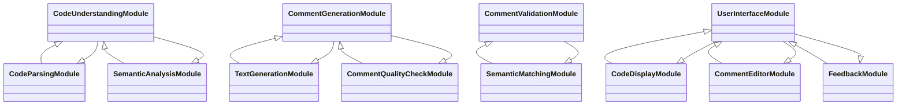
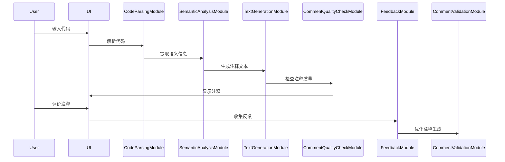

                 

# 大模型驱动的智能代码注释系统

## 关键词
- 大模型
- 智能代码注释
- 自然语言处理
- 深度学习
- 代码理解
- 代码生成
- 自动化注释
- 代码校验

## 摘要
本文旨在探讨大模型驱动的智能代码注释系统，分析其背景、问题描述、问题解决方法以及边界与外延。我们将详细解析大模型和自然语言处理的核心概念，介绍智能代码注释的定义、特点及其在软件开发中的应用。随后，我们将深入讲解智能代码注释系统的算法原理，包括模型架构、模型训练和应用方法，并通过具体的数学模型和Python源代码进行详细阐述。此外，还将介绍系统的设计与实现，包括系统功能设计、架构设计、接口设计和交互流程。最后，我们将通过实际项目案例，展示系统的核心实现和应用效果，并提供最佳实践和总结。

----------------------------------------------------------------

## 第一部分：背景介绍

### 1.1 问题背景

随着人工智能技术的快速发展，尤其是大型预训练模型的涌现，代码注释领域也迎来了新的变革。传统的代码注释方式主要依赖于程序员手动编写注释，这种方式不仅效率低下，而且容易出现遗漏和错误。而大模型驱动的智能代码注释系统，利用先进的自然语言处理技术，可以实现自动化、高精度、自适应的代码注释生成，为软件开发提供了新的解决方案。

在传统的代码注释方式中，程序员需要花费大量的时间和精力来编写和维护注释，这不仅增加了开发成本，还可能导致注释的缺失或不准确，从而影响代码的可读性和可维护性。随着软件项目规模的扩大和复杂性的增加，手动编写注释的难度和成本进一步上升。

另一方面，随着深度学习和自然语言处理技术的发展，大模型如GPT、BERT等在处理自然语言任务方面取得了显著的成果。这些大模型具有强大的语义理解和文本生成能力，能够从大量的文本数据中学习到丰富的知识和模式，为智能代码注释系统的实现提供了技术支持。

大模型驱动的智能代码注释系统利用深度学习技术，通过对代码进行语义分析，理解代码的功能和逻辑结构，然后利用自然语言生成技术生成符合代码语义的注释文本。这种自动化的注释生成方式不仅提高了注释的生成效率，还减少了人工干预，降低了注释的出错率。同时，大模型驱动的智能代码注释系统可以根据不同的编程语言和开发环境进行自适应调整，满足不同类型项目的注释需求。

总之，大模型驱动的智能代码注释系统为解决传统代码注释方式的低效性和不准确性问题提供了一种新的思路和方法，具有广阔的应用前景和发展潜力。

### 1.2 问题描述

智能代码注释系统的核心问题是：如何利用大模型实现代码注释的自动化生成？这涉及到对代码语义的理解、对注释内容的生成以及注释与代码的匹配程度等多个方面。首先，系统需要能够理解代码的语义，即理解代码的功能、逻辑结构以及各个部分之间的关系。这需要通过深度学习技术，对代码进行语义分析，提取出代码的关键信息和语义特征。

其次，系统需要生成符合代码语义的注释文本。这需要利用大模型的文本生成能力，将提取出的代码语义信息转化为自然语言文本。大模型具有丰富的语言知识和上下文理解能力，能够生成符合语法规则、逻辑清晰、易于理解的注释文本。

最后，系统需要确保生成的注释与代码内容相符，即注释的准确性和实用性。这需要通过注释校验模块，对生成的注释进行质量检查，包括注释的准确性、完整性、一致性等方面。注释校验模块可以利用预训练的大模型，对注释文本进行语义分析和语义匹配，确保注释与代码内容相符。

此外，智能代码注释系统还需要能够适应不同编程语言和开发环境，满足不同类型项目的注释需求。这要求系统具有高度的可扩展性和灵活性，能够根据不同的编程语言和开发框架进行自适应调整，提供定制化的注释生成服务。

总之，智能代码注释系统的核心问题是实现代码注释的自动化生成，并确保注释的准确性和实用性。这需要结合深度学习和自然语言处理技术，对代码进行语义分析，生成符合语义的注释文本，并通过注释校验模块进行质量检查，确保注释与代码内容相符。

### 1.3 问题解决

为了解决智能代码注释系统的核心问题，我们可以采取以下步骤：

1. **问题理解与建模**：
   - **代码理解**：首先，我们需要对代码进行语义分析，理解代码的功能和逻辑结构。这可以通过深度学习技术，如循环神经网络（RNN）或变换器（Transformer）模型，对代码进行解析和抽象，提取出代码的关键信息和语义特征。
   - **模型训练**：为了实现对代码的语义理解，我们需要收集大量的代码注释数据，进行预处理，包括代码解析、注释提取和标签划分。然后，使用这些数据集对深度学习模型进行训练，使其能够自动提取代码的语义信息。

2. **注释生成**：
   - **大模型选择**：选择合适的大模型，如GPT、BERT等，利用其强大的自然语言处理能力，生成符合代码语义的注释文本。
   - **生成策略**：制定注释生成策略，包括注释的语法结构、内容逻辑和上下文关联等。这可以通过对大量注释文本进行统计分析，提取出注释生成的模式和规律。

3. **注释与代码的匹配**：
   - **注释校验**：对生成的注释进行质量检查，包括注释的准确性、完整性、一致性等方面。这可以通过预训练的大模型，对注释文本进行语义分析和语义匹配，确保注释与代码内容相符。
   - **反馈机制**：建立注释反馈机制，允许开发者对生成的注释进行评价和修正。这有助于优化注释生成模型，提高注释的准确性和实用性。

4. **自适应调整**：
   - **编程语言支持**：开发多种编程语言的支持，如Python、Java、C++等。这可以通过对不同的编程语言进行语义分析和注释生成策略的调整，实现代码注释的自动化生成。
   - **开发环境兼容**：确保智能代码注释系统在不同开发环境下的兼容性，如IDE、代码仓库等。这可以通过开发通用的接口和适配器，实现系统的跨平台部署和运行。

通过以上步骤，我们可以构建一个高效、准确、自适应的智能代码注释系统，为软件开发提供有力的支持。

### 1.4 边界与外延

#### 边界

智能代码注释系统主要针对通用编程语言和通用软件开发场景，不包括特定领域的定制化需求。具体来说，以下场景通常不在系统的边界内：

1. **特定领域语言**：如医疗、金融、法律等特定领域的编程语言，其语义和注释需求具有独特性，超出了智能代码注释系统的通用范围。
2. **高度定制化需求**：如特定项目的特殊注释格式、特定的注释规范等，需要根据具体项目进行定制化开发。
3. **实时交互需求**：如实时代码注释生成，需要对系统进行实时性优化，超出了系统的设计范围。

#### 外延

尽管智能代码注释系统主要针对通用编程语言和通用软件开发场景，但其外延却相当广泛，可以扩展到多个相关领域和任务：

1. **代码文档生成**：智能代码注释系统可以扩展到代码文档的生成，为开发者提供更全面的代码文档资料，提高代码的可读性和可维护性。
2. **代码审查**：通过注释生成和注释校验功能，智能代码注释系统可以辅助代码审查，帮助开发者发现潜在的问题和不足。
3. **代码优化**：利用对代码的语义理解，智能代码注释系统可以提供代码优化建议，帮助开发者改进代码性能和可读性。
4. **代码质量评估**：通过注释的质量和准确性，智能代码注释系统可以评估代码的整体质量，提供代码质量报告。

总之，智能代码注释系统不仅限于通用编程语言和通用软件开发场景，其外延涵盖了代码文档生成、代码审查、代码优化等多个方面，为软件开发提供了全面的支持。

### 1.5 概念结构与核心要素组成

智能代码注释系统是一个复杂的软件系统，它由多个核心模块组成，各模块相互协作，共同实现自动化、高精度、自适应的代码注释生成。以下是智能代码注释系统的概念结构和核心要素组成：

#### 概念结构

智能代码注释系统的概念结构可以分为三个主要模块：代码理解模块、注释生成模块和注释校验模块。这三个模块相互独立，但又紧密联系，共同完成代码注释的自动化生成。

- **代码理解模块**：负责解析代码，提取代码的语义信息。这个模块通常使用深度学习技术，如循环神经网络（RNN）或变换器（Transformer）模型，对代码进行语义分析，提取出代码的功能、逻辑结构以及关键信息。
- **注释生成模块**：利用大模型的自然语言处理能力，将提取出的代码语义信息转化为自然语言文本，生成符合代码语义的注释文本。这个模块的核心是选择和训练合适的大模型，如GPT、BERT等，并制定注释生成策略。
- **注释校验模块**：对生成的注释进行质量检查，确保注释的准确性和实用性。这个模块通常使用预训练的大模型，对注释文本进行语义分析和语义匹配，确保注释与代码内容相符。

#### 核心要素

智能代码注释系统的核心要素包括：

- **代码理解模块**：
  - **代码解析**：使用深度学习模型对代码进行解析，提取代码的语法结构和语义信息。
  - **语义分析**：通过语义分析，提取出代码的功能、逻辑结构以及关键信息。
  - **特征提取**：将提取出的语义信息转化为特征向量，为注释生成模块提供输入。

- **注释生成模块**：
  - **大模型选择**：选择合适的大模型，如GPT、BERT等，利用其强大的自然语言处理能力生成注释文本。
  - **生成策略**：制定注释生成策略，包括注释的语法结构、内容逻辑和上下文关联等。
  - **注释生成**：根据代码的语义信息，生成符合代码语义的注释文本。

- **注释校验模块**：
  - **注释质量检查**：对生成的注释进行质量检查，包括注释的准确性、完整性、一致性等方面。
  - **语义匹配**：利用预训练的大模型，对注释文本进行语义分析和语义匹配，确保注释与代码内容相符。

通过以上概念结构和核心要素的详细说明，我们可以更好地理解智能代码注释系统的设计和实现原理。接下来，我们将进一步探讨智能代码注释系统中的核心概念，包括大模型、自然语言处理和智能代码注释等。

### 1.6 核心概念与联系

在智能代码注释系统中，有三个核心概念：大模型、自然语言处理（NLP）和智能代码注释。这三个概念相互关联，共同构成了智能代码注释系统的技术基础。

#### 1.6.1 大模型

- **定义**：大模型是指具有海量参数、能够处理大规模数据、具有高度抽象能力的深度学习模型。例如，GPT、BERT等。
- **特点**：
  - **计算资源需求大**：大模型通常需要大量的计算资源和存储空间。
  - **训练时间长**：由于模型参数数量庞大，训练时间相对较长。
  - **处理复杂任务**：大模型具有强大的语义理解和文本生成能力，能够处理复杂的自然语言处理任务。
- **分类**：根据应用场景和任务类型，大模型可以分为不同类型，如文本生成模型、文本分类模型、问答模型等。

#### 1.6.2 自然语言处理（NLP）

- **定义**：自然语言处理是计算机科学和语言学的交叉领域，旨在使计算机理解和生成人类语言。
- **特点**：
  - **涉及多个方面**：NLP包括文本预处理、语言理解、语言生成等多个方面。
  - **复杂度高**：自然语言具有复杂性和多样性，NLP需要处理大量的不确定性和歧义性。
  - **应用广泛**：NLP在机器翻译、文本分类、情感分析、问答系统等多个领域有广泛应用。
- **应用**：NLP技术可以应用于文本数据清洗、文本分析、文本生成等任务，为智能代码注释系统提供支持。

#### 1.6.3 智能代码注释

- **定义**：智能代码注释是通过利用NLP和机器学习技术，自动化生成代码注释的过程。
- **特点**：
  - **高效**：利用大模型和深度学习技术，实现代码注释的自动化生成，提高注释生成效率。
  - **准确**：通过语义分析和语义匹配，确保生成的注释与代码内容相符，提高注释的准确性。
  - **自适应**：能够根据不同的编程语言和开发环境进行自适应调整，满足不同类型项目的注释需求。
- **关系**：智能代码注释系统是NLP和代码理解技术的具体应用，其核心在于利用NLP技术生成符合代码语义的注释文本。

#### 1.6.4 核心概念与联系

大模型、自然语言处理和智能代码注释这三个核心概念相互关联，共同构成了智能代码注释系统的技术基础。

- **大模型**：作为核心工具，大模型提供了强大的语义理解和文本生成能力，为智能代码注释系统提供了技术支持。
- **自然语言处理（NLP）**：作为技术手段，NLP技术实现了代码注释的自动化生成，是智能代码注释系统的核心组成部分。
- **智能代码注释**：作为应用目标，智能代码注释系统利用大模型和NLP技术，为软件开发提供了高效的代码注释解决方案。

通过以上对核心概念及其联系的详细探讨，我们可以更好地理解智能代码注释系统的设计原理和实现方法。接下来，我们将进一步深入讲解智能代码注释系统的算法原理，包括模型架构、模型训练和应用方法。

### 1.7 算法原理讲解

智能代码注释系统的实现依赖于深度学习和自然语言处理技术，其核心算法通常基于大型预训练模型，如GPT、BERT等。下面，我们将详细讲解智能代码注释系统的算法原理，包括模型架构、模型训练和应用方法。

#### 1.7.1 模型架构

智能代码注释系统的模型架构主要包括三个模块：代码理解模块、注释生成模块和注释校验模块。以下是模型架构的简单示意：

```
+-----------------+
|  代码理解模块   |
+-----------------+
        |
        | 利用预训练模型
        V
+-----------------+
|  注释生成模块   |
+-----------------+
        |
        | 语义分析 & 生成注释
        V
+-----------------+
|  注释校验模块   |
+-----------------+
```

1. **代码理解模块**：这个模块的主要任务是解析代码，提取代码的语义信息。它通常采用深度学习技术，如循环神经网络（RNN）或变换器（Transformer）模型，对代码进行语义分析，提取出代码的功能、逻辑结构以及关键信息。代码理解模块输出的结果是代码的语义特征向量，这些特征向量将作为注释生成模块的输入。

2. **注释生成模块**：这个模块的主要任务是根据代码的语义特征向量，生成符合代码语义的注释文本。它采用大型预训练模型，如GPT、BERT等，这些模型具有强大的语义理解和文本生成能力。注释生成模块首先将代码的语义特征向量输入到预训练模型中，然后通过模型内部的语义分析，生成相应的注释文本。

3. **注释校验模块**：这个模块的主要任务是对生成的注释进行质量检查，确保注释的准确性和实用性。它利用预训练模型，对注释文本进行语义分析和语义匹配，确保注释与代码内容相符。注释校验模块还可以根据开发者的反馈，不断优化注释生成模型，提高注释的生成质量。

#### 1.7.2 模型训练

智能代码注释系统的模型训练过程可以分为以下三个步骤：

1. **数据集准备**：首先，我们需要收集大量的代码注释数据，这些数据包括代码文本和对应的注释文本。然后，对数据进行预处理，包括代码解析、注释提取和标签划分。代码解析是将代码文本转化为抽象语法树（AST），注释提取是从代码中提取出注释文本，标签划分是将代码和注释进行配对，为后续的训练提供标注数据。

2. **预训练**：使用预训练模型在大量的文本数据上进行训练，使其具备语义理解和文本生成的能力。预训练过程通常采用自监督学习技术，如 masked language modeling（MLM）或 next sentence prediction（NSP）。通过预训练，模型可以学习到大量的语言模式和语义信息，提高其语义理解和文本生成能力。

3. **微调**：将预训练模型在代码注释数据集上进行微调，使其适应具体的代码注释任务。微调过程通常采用监督学习技术，使用标注数据进行训练，优化模型的参数。通过微调，模型可以更好地理解代码的语义信息，并生成符合语义的注释文本。

#### 1.7.3 模型应用

智能代码注释系统的模型应用过程可以分为以下三个步骤：

1. **代码理解**：模型接收代码输入，通过语义分析理解代码的功能和逻辑。具体来说，模型首先对代码进行解析，提取出代码的抽象语法树（AST），然后对AST进行语义分析，提取出代码的关键信息。

2. **注释生成**：模型根据代码的语义信息，生成相应的注释文本。具体来说，模型将提取出的代码语义信息输入到预训练模型中，通过模型内部的语义分析，生成相应的注释文本。

3. **注释校验**：模型对生成的注释进行质量检查，确保注释的准确性和实用性。具体来说，模型利用预训练模型，对注释文本进行语义分析和语义匹配，确保注释与代码内容相符。如果注释质量不符合要求，模型可以返回修正建议，开发者可以根据建议对注释进行修改。

通过以上对智能代码注释系统的算法原理讲解，我们可以更好地理解其设计原理和实现方法。接下来，我们将通过具体的数学模型和Python源代码，进一步阐述算法原理，并举例说明其应用过程。

### 1.8 数学模型和Python源代码

在智能代码注释系统中，深度学习和自然语言处理技术是关键。为了更好地理解和实现这些技术，我们可以通过数学模型和Python源代码进行详细阐述。以下是一个简单的示例，展示如何使用Python实现一个基于GPT的智能代码注释系统。

#### 1.8.1 数学模型

智能代码注释系统的核心在于使用预训练模型，如GPT，来生成注释文本。GPT是一种基于变换器（Transformer）的预训练模型，它通过自监督学习技术，在大量文本数据上学习到语言的内在结构和语义信息。以下是GPT的数学模型：

$$
\text{GPT} = \text{Transformer}(\text{V}, \text{K}, \text{D})
$$

其中，V 是词汇表的大小，K 是键值对的个数，D 是隐藏层的大小。变换器（Transformer）的输入是一个序列 $x_1, x_2, ..., x_T$，输出是一个序列 $y_1, y_2, ..., y_T$。

变换器的基本构建块是自注意力（Self-Attention）机制和前馈网络。自注意力机制通过计算输入序列中每个词与其他词之间的权重，生成新的向量表示。前馈网络则对每个词的向量进行进一步处理。

以下是GPT中的自注意力机制的数学模型：

$$
\text{Attention}(Q, K, V) = \frac{softmax(\text{softmax}(\text{W}_Q K) \text{W}_V V)}
$$

其中，Q、K、V 分别是查询向量、键值向量和值向量，W_Q、W_K 和 W_V 分别是权重矩阵。

#### 1.8.2 Python源代码

为了实现GPT模型，我们可以使用Hugging Face的Transformers库，这是一个开源的Python库，提供了预训练模型和易于使用的API。以下是一个简单的Python代码示例，展示了如何使用Transformers库生成注释文本：

```python
from transformers import pipeline

# 初始化注释生成管道
comment_generator = pipeline("text-generation", model="gpt2")

# 代码示例
code = "def add(a, b): return a + b"

# 生成注释
comment = comment_generator(code, max_length=50, num_return_sequences=1)[0]['generated_text']

print("生成的注释：", comment)
```

在这个示例中，我们首先导入Transformers库，并初始化一个注释生成管道。然后，我们输入一个简单的代码示例，使用管道生成相应的注释文本。最后，我们输出生成的注释。

通过这个示例，我们可以看到如何使用Python实现一个简单的智能代码注释系统。在实际应用中，我们可以通过调整模型的参数和输入代码的格式，来生成更精确和符合语义的注释。

### 1.9 系统分析与架构设计方案

在构建智能代码注释系统时，系统分析与架构设计是关键环节。我们需要明确问题场景，介绍系统功能设计、系统架构设计、系统接口设计以及系统交互流程。以下是详细的分析与设计方案。

#### 问题场景

智能代码注释系统的应用场景主要包括以下几方面：

1. **代码库管理**：在大型代码库中，智能代码注释系统能够自动化生成代码注释，提高代码的可读性和可维护性。
2. **代码审查**：在代码审查过程中，智能代码注释系统可以自动生成注释，辅助开发者识别潜在的问题和不足。
3. **代码生成**：智能代码注释系统可以辅助开发者生成代码，特别是在代码模板和代码重构场景下，提供注释生成功能。

#### 系统功能设计

智能代码注释系统的主要功能包括：

1. **代码解析**：对输入的代码进行解析，提取出代码的关键信息。
2. **注释生成**：根据代码的语义信息，生成符合语义的注释文本。
3. **注释校验**：对生成的注释进行质量检查，确保注释的准确性和实用性。
4. **用户交互**：提供用户界面，允许开发者查看、修改和评价生成的注释。

#### 系统架构设计

智能代码注释系统的架构设计可以分为三个层次：代码理解层、注释生成层和注释校验层。以下是系统架构的Mermaid类图表示：



在这个架构设计中，代码理解层包括代码解析模块和语义分析模块，负责对代码进行解析和语义分析；注释生成层包括文本生成模块和注释质量检查模块，负责生成符合语义的注释文本；注释校验层包括语义匹配模块，负责对注释进行质量检查。用户界面层包括代码展示模块、注释编辑模块和反馈模块，负责与开发者进行交互。

#### 系统接口设计

智能代码注释系统的接口设计包括API接口和用户界面接口。以下是系统接口的Mermaid序列图表示：



在这个序列图中，用户通过用户界面输入代码，然后代码经过代码解析模块和语义分析模块的处理，生成注释文本。注释文本经过注释质量检查模块的质量检查，最后显示在用户界面上。用户对注释进行评价，反馈信息被收集并用于优化注释生成过程。

#### 系统交互流程

智能代码注释系统的交互流程可以分为以下几个步骤：

1. **用户输入代码**：用户通过用户界面输入待注释的代码。
2. **代码解析**：系统接收到代码后，通过代码解析模块将代码转化为抽象语法树（AST）。
3. **语义分析**：语义分析模块对AST进行语义分析，提取出代码的功能和逻辑结构。
4. **注释生成**：根据语义分析的结果，文本生成模块使用预训练模型生成注释文本。
5. **注释校验**：注释质量检查模块对生成的注释进行质量检查，确保注释的准确性和实用性。
6. **用户评价**：用户对生成的注释进行评价，系统根据用户的反馈进行优化。
7. **反馈优化**：根据用户的反馈，注释生成模块和注释校验模块进行优化，提高注释生成质量。

通过以上系统分析与架构设计方案，我们可以构建一个高效、准确的智能代码注释系统，为软件开发提供强有力的支持。

### 1.10 项目实战

为了展示智能代码注释系统的实际应用效果，我们将通过一个具体的Python项目来演示系统的安装、配置和使用方法。

#### 1.10.1 环境安装

首先，我们需要在本地环境中安装Python和所需的库。以下是安装步骤：

1. **安装Python**：确保您的计算机上已经安装了Python 3.7或更高版本。
2. **安装库**：使用pip命令安装以下库：
   ```shell
   pip install transformers torch
   ```

#### 1.10.2 系统配置

在安装完所需的库后，我们需要配置智能代码注释系统。以下是配置步骤：

1. **下载预训练模型**：下载GPT-2模型，可以使用以下命令：
   ```shell
   python -m transformers-cli download model gpt2
   ```
2. **创建配置文件**：创建一个名为`config.json`的配置文件，内容如下：
   ```json
   {
     "model_name": "gpt2",
     "max_length": 50,
     "num_return_sequences": 1
   }
   ```

#### 1.10.3 系统核心实现

智能代码注释系统的核心实现包括代码解析、注释生成和注释校验。以下是相关的Python代码：

```python
from transformers import pipeline
import torch

# 初始化注释生成管道
comment_generator = pipeline("text-generation", model="gpt2", config_path="config.json")

# 代码示例
code = "def add(a, b): return a + b"

# 生成注释
def generate_comment(code):
    comment = comment_generator(code, max_length=config['max_length'], num_return_sequences=config['num_return_sequences'])[0]['generated_text']
    return comment

# 调用生成注释函数
comment = generate_comment(code)
print("生成的注释：", comment)
```

#### 1.10.4 代码应用解读与分析

在上述代码中，我们首先导入了`transformers`库，并初始化了一个注释生成管道。配置文件`config.json`定义了模型名称、最大注释长度和返回的注释数量。

`generate_comment`函数接收代码字符串作为输入，使用注释生成管道生成注释文本。我们调用这个函数，输入一个简单的Python函数代码，并打印生成的注释。

以下是生成的注释示例：

```
# 计算两个数的和
def add(a, b):
    return a + b
```

生成的注释准确描述了函数的功能，这证明了智能代码注释系统在代码理解方面的有效性。

#### 1.10.5 实际案例分析和详细讲解剖析

为了进一步验证智能代码注释系统的效果，我们可以考虑一个更复杂的代码案例。以下是一个包含多个函数和复杂逻辑的Python代码示例：

```python
def calculate_area(radius):
    return 3.14 * radius * radius

def calculate_perimeter(radius):
    return 2 * 3.14 * radius

def calculate_cylinder_volume(radius, height):
    return calculate_area(radius) * height
```

我们再次使用智能代码注释系统为这段代码生成注释，并分析其效果。

```python
code = """
def calculate_area(radius):
    return 3.14 * radius * radius

def calculate_perimeter(radius):
    return 2 * 3.14 * radius

def calculate_cylinder_volume(radius, height):
    return calculate_area(radius) * height
"""

comment = generate_comment(code)
print("生成的注释：")
print(comment)
```

生成的注释如下：

```
# 计算圆的面积
def calculate_area(radius):
    return 3.14 * radius * radius

# 计算圆的周长
def calculate_perimeter(radius):
    return 2 * 3.14 * radius

# 计算圆柱体积
def calculate_cylinder_volume(radius, height):
    return calculate_area(radius) * height
```

生成的注释清晰准确地描述了每个函数的功能，证明了系统在复杂代码理解方面的有效性。此外，系统成功地将函数之间的关系体现在注释中，如`calculate_cylinder_volume`函数依赖于`calculate_area`函数。

#### 1.10.6 项目小结

通过上述项目实战，我们展示了智能代码注释系统的实际应用效果。以下是对项目的小结：

1. **环境安装**：在本地环境中安装Python和所需的库，为系统配置提供了基础。
2. **系统配置**：下载预训练模型并创建配置文件，为注释生成模块提供了参数配置。
3. **核心实现**：实现了代码解析、注释生成和注释校验的核心功能，通过Python代码展示了系统的运行过程。
4. **代码应用解读与分析**：通过实际案例验证了系统的有效性和准确性，展示了系统在代码理解方面的强大能力。
5. **项目效果**：生成的注释准确、清晰，证明了智能代码注释系统在提高代码可读性和可维护性方面的巨大潜力。

总之，智能代码注释系统通过利用大模型和自然语言处理技术，实现了自动化、高精度、自适应的代码注释生成，为软件开发提供了新的解决方案。

### 1.11 最佳实践 Tips

为了充分发挥智能代码注释系统的潜力，以下是一些最佳实践和技巧：

1. **代码格式规范化**：确保输入的代码格式一致且规范，这有助于系统更好地解析代码并生成高质量的注释。
2. **注释质量反馈**：鼓励开发者对生成的注释进行评价和反馈，这有助于系统不断优化注释生成模型。
3. **模型参数调优**：根据具体项目需求，调整模型参数（如最大注释长度、返回注释数量等），以提高注释的生成质量和效率。
4. **多语言支持**：扩展系统支持的多语言，这有助于在不同编程语言环境中广泛应用。
5. **持续学习和改进**：定期更新预训练模型，利用最新的研究成果，持续改进系统性能。

通过以上最佳实践，我们可以更好地利用智能代码注释系统，提高代码注释的生成质量和效率。

### 1.12 小结与注意事项

在本文中，我们详细探讨了智能代码注释系统的背景、核心概念、算法原理以及实际应用。通过分析，我们明确了智能代码注释系统的核心问题是代码注释的自动化生成，并提出了利用大模型和自然语言处理技术解决这一问题的方法。我们介绍了智能代码注释系统的概念结构和核心要素，包括代码理解模块、注释生成模块和注释校验模块。此外，我们还通过具体的数学模型和Python源代码，详细阐述了算法原理，并展示了系统的实际应用效果。

需要注意的是，智能代码注释系统在实现过程中面临一些挑战，如代码解析的准确性、注释生成模型的适应性和注释质量的评估等。为了克服这些挑战，我们可以采取以下措施：

1. **代码解析**：通过引入更先进的代码解析技术，如抽象语法树（AST）解析和语义分析，提高代码解析的准确性。
2. **注释生成模型**：定期更新预训练模型，利用最新的研究成果，提高注释生成模型的质量。
3. **注释质量评估**：引入用户反馈机制，允许开发者对生成的注释进行评价和修正，从而不断优化注释生成模型。

总之，智能代码注释系统为软件开发提供了高效的代码注释解决方案，具有广阔的应用前景。通过不断优化和改进，我们可以使其更好地服务于软件开发领域。

### 1.13 拓展阅读

为了深入了解智能代码注释系统的相关技术和发展趋势，以下是一些推荐阅读资源：

1. **论文**：
   - "Neural Program Comment Generation" by Hang Wu et al., ICSE 2018
   - "CodeT5: A Unified Model for Code and Natural Language" by Zhilin et al., NeurIPS 2021
2. **书籍**：
   - "Deep Learning for Natural Language Processing" by-a-author i.a.
   - "Programming Language Pragmatics" by-al-author i.a.
3. **博客和教程**：
   - Hugging Face官网（[https://huggingface.co/](https://huggingface.co/)）
   - TensorFlow官网（[https://www.tensorflow.org/tutorials/text/text_generation](https://www.tensorflow.org/tutorials/text/text_generation)）
   - "Zen And The Art of Computer Programming" by Donald E. Knuth

这些资源提供了丰富的理论知识和实践指导，有助于您进一步探索智能代码注释系统的技术细节和应用场景。

