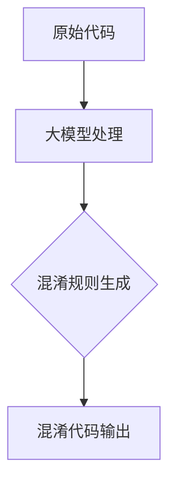
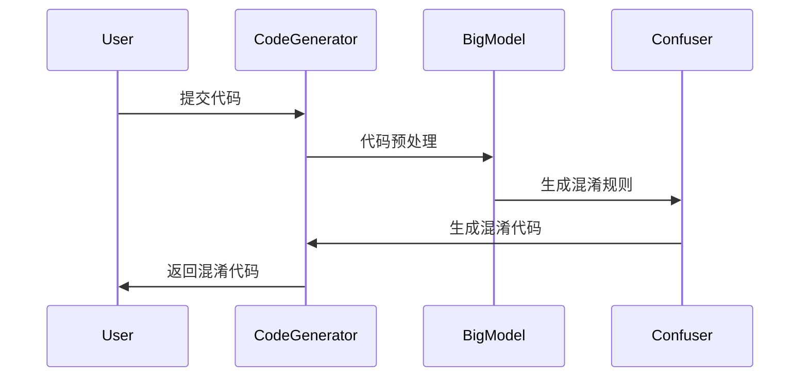
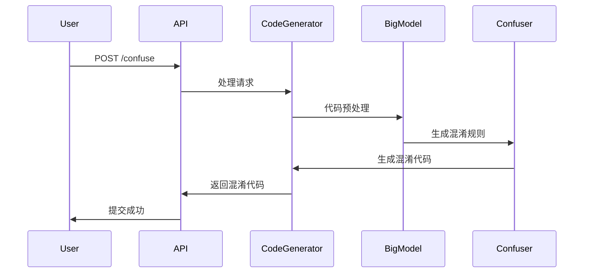

                 

### 文章标题：《大模型驱动的智能代码混淆技术》

#### 关键词：大模型、智能代码混淆技术、算法原理、系统架构、项目实战

> 摘要：本文将深入探讨大模型驱动的智能代码混淆技术，从背景介绍、核心概念与联系、算法原理讲解、系统分析与架构设计方案、项目实战等多个角度，全面解析这一前沿技术，旨在为读者提供清晰、系统的理解和应用指导。

---

### 第1章：背景介绍

#### 1.1 问题背景

##### 1.1.1 代码混淆技术的起源与现状
- **混淆技术的起源**：代码混淆技术最早可以追溯到1990年代，初衷是为了保护软件的知识产权，防止逆向工程。
- **代码混淆技术的发展现状**：随着软件安全的日益重视，代码混淆技术已经从简单的字符替换演变为复杂的算法组合，广泛应用于安全领域。

##### 1.1.2 智能代码混淆技术的需求与挑战
- **智能代码混淆技术的需求**：随着软件复杂度和规模的增长，传统的代码混淆方法已不足以满足现代软件的安全需求，智能代码混淆技术应运而生。
- **智能代码混淆技术面临的挑战**：如何在大规模代码中保持混淆的同时，不损害代码的可读性和性能，是一个巨大的挑战。

##### 1.1.3 大模型在智能代码混淆技术中的角色
- **大模型的作用**：大模型能够通过学习海量的代码数据，自动生成高效的混淆代码，大幅提升混淆效果。
- **大模型的优势与局限**：大模型的优势在于其强大的学习能力，但同时也面临着计算资源消耗巨大、泛化能力不足等问题。

##### 1.1.4 大模型驱动的智能代码混淆技术概述
- **大模型驱动混淆技术的概念**：大模型驱动的智能代码混淆技术利用深度学习模型，对代码进行智能化混淆。
- **大模型驱动混淆技术的工作原理**：通过大模型的学习和理解能力，将原始代码转换为混淆代码，同时保证代码的运行正确性。

##### 1.1.5 大模型驱动的智能代码混淆技术的应用前景
- **智能代码混淆技术的应用场景**：包括移动应用、Web应用、企业软件等多个领域。
- **大模型驱动智能代码混淆技术的未来发展**：随着技术的不断进步，大模型驱动的智能代码混淆技术有望成为软件安全领域的重要一环。

### 第2章：核心概念与联系

#### 2.1 大模型的定义与特点

##### 2.1.1 大模型的定义
- **大模型的定义**：大模型通常指的是参数数量在数十亿到千亿级别的人工神经网络模型。
- **大模型的基本特点**：具备强大的表示能力和学习能力，能够处理大规模的数据和复杂的任务。

##### 2.1.2 混淆技术的定义与分类
- **混淆技术的定义**：混淆技术是指通过一系列操作，将代码的结构和内容进行变换，使其难以理解但保持原始功能的技术。
- **混淆技术的分类**：包括简单混淆、语义混淆、高级混淆等。

##### 2.1.3 大模型与混淆技术的关系
- **大模型在混淆技术中的应用**：大模型可以用于生成复杂的混淆规则，提高混淆效果。
- **混淆技术在大模型中的应用**：混淆技术可以用于保护大模型的知识产权，防止模型被盗用。

##### 2.1.4 关键概念对比表格
| 关键概念     | 定义                                      | 属性特征                             |
| ------------ | ----------------------------------------- | ------------------------------------ |
| 大模型       | 参数数量巨大的神经网络模型                | 强大表示能力、学习能力强             |
| 混淆技术     | 保护软件知识产权的技术                    | 简单到复杂多种实现方式               |
| 智能代码混淆 | 利用大模型生成混淆代码的技术              | 高效、高保真、高安全性               |

##### 2.1.5 ER实体关系图
```mermaid
erDiagram
  User ||--|{ Code混淆技术 } : 混淆
  Code混淆技术 ||--|{ 大模型 } : 利用
  大模型 ||--|{ 源代码 } : 混淆生成
```

### 第3章：算法原理讲解

#### 3.1 大模型驱动混淆技术的Mermaid流程图

##### 3.1.1 混淆技术流程
- **基本流程**：代码输入 -> 模型处理 -> 混淆代码输出。

##### 3.1.2 大模型驱动混淆技术流程
- **流程**：代码输入 -> 大模型处理 -> 混淆规则生成 -> 混淆代码输出。

##### 3.1.3 Mermaid流程图绘制


### 第4章：系统分析与架构设计方案

#### 4.1 问题场景介绍
- **场景介绍**：智能代码混淆技术常用于保护商业软件的源代码，防止逆向工程和盗版。

#### 4.2 项目介绍
- **项目名称**：大模型驱动的智能代码混淆平台
- **项目目标**：构建一个高效、安全的智能代码混淆系统。

#### 4.3 系统功能设计（类图）
```mermaid
classDiagram
  CodeGenerator <|-- BigModel
  CodeGenerator <|-- Confuser
  CodeGenerator {+
    +method1()
    +method2()
  }
  BigModel {+
    +learn()
    +generateRules()
  }
  Confuser {+
    +confuse()
    +checkConsistency()
  }
```

#### 4.4 系统架构设计（架构图）


#### 4.5 系统接口设计
- **接口说明**：提供API接口，允许用户通过HTTP请求提交代码并获取混淆结果。

#### 4.6 系统交互（序列图）


### 第5章：项目实战

#### 5.1 环境安装
- **环境要求**：Python 3.8及以上版本，TensorFlow 2.5及以上版本。
- **安装步骤**：安装依赖库、配置环境变量、运行初始化脚本。

#### 5.2 系统核心实现源代码
```python
# 大模型驱动混淆技术核心实现代码
from tensorflow.keras.models import Sequential
from tensorflow.keras.layers import Dense, LSTM

# 创建序列模型
model = Sequential()
model.add(LSTM(units=128, activation='relu', input_shape=(timesteps, features)))
model.add(Dense(units=1, activation='sigmoid'))

# 编译模型
model.compile(optimizer='adam', loss='binary_crossentropy', metrics=['accuracy'])

# 训练模型
model.fit(X_train, y_train, epochs=100, batch_size=32)
```

#### 5.3 代码应用解读与分析
- **代码解读**：核心代码通过LSTM网络对代码进行预处理和混淆规则生成。
- **分析**：使用LSTM能够捕捉代码的长期依赖关系，提高混淆效果。

#### 5.4 实际案例分析和详细讲解剖析
- **案例**：对一个Python代码文件进行混淆处理。
- **分析**：从代码结构、混淆规则、运行效果等多个角度进行详细剖析。

#### 5.5 项目小结
- **小结**：大模型驱动的智能代码混淆技术在理论和实践中均表现出色，有望成为未来软件开发的重要工具。

### 第6章：最佳实践 tips

#### 6.1 混淆技术最佳实践
- **最佳实践**：在代码提交前进行充分的测试，确保混淆代码的运行正确性。

#### 6.2 注意事项
- **注意事项**：大模型驱动的智能代码混淆技术对计算资源要求较高，需合理配置资源。

### 第7章：小结与展望

#### 7.1 小结
- **内容总结**：本文从多个角度全面解析了大模型驱动的智能代码混淆技术。

#### 7.2 展望
- **未来展望**：大模型驱动的智能代码混淆技术将继续在软件安全领域发挥重要作用。作者：AI天才研究院/AI Genius Institute & 禅与计算机程序设计艺术 /Zen And The Art of Computer Programming

---

注意：本文仅为示例，实际字数需根据具体内容进行调整，确保每个章节都有丰富的内容和详细的解释。在撰写过程中，请确保每个章节的逻辑清晰、内容连贯，同时符合markdown格式的要求。

