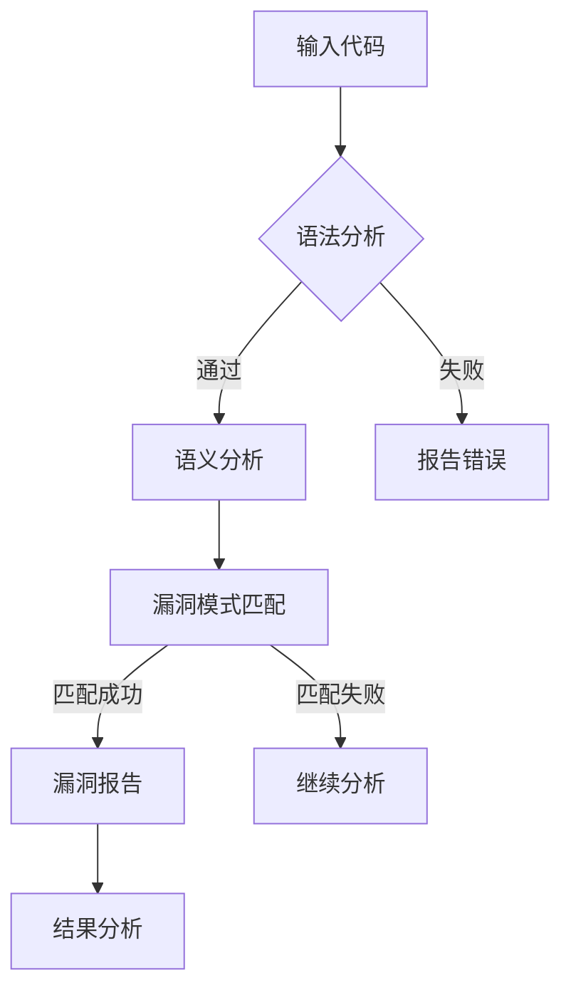
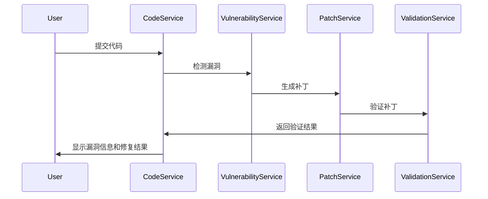
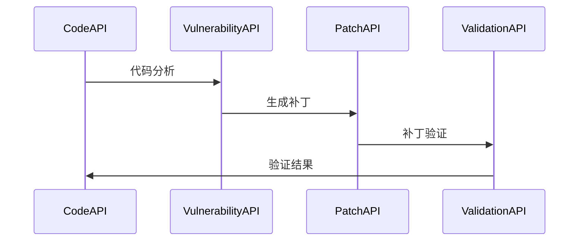

                 

## 第1章: 大模型驱动的智能代码漏洞修复与验证概述

### 1.1 问题背景

在当今快速发展的软件工程领域，软件安全漏洞的问题日益突出。这些漏洞可能导致数据泄露、系统崩溃等严重后果，对企业和个人都带来了巨大的风险和损失。随着软件规模和复杂度的不断增加，传统的漏洞修复方法逐渐暴露出其局限性。

#### 1.1.1 软件安全漏洞的现状

软件安全漏洞通常是指在软件中存在的可以被攻击者利用的缺陷。根据CVE（Common Vulnerabilities and Exposures）数据库的数据，全球每年报告的软件安全漏洞数量呈上升趋势。这些漏洞可能存在于操作系统、应用软件、网络协议等多个层面。尽管开发者们采取了多种安全措施，但漏洞的发现和修复仍然是一个长期且艰巨的任务。

#### 1.1.2 传统漏洞修复方法的挑战

传统的漏洞修复方法主要包括代码审查、静态分析、动态分析等。这些方法在一定程度上能够发现和修复漏洞，但面临着以下挑战：

1. **人力成本高**：代码审查需要大量的专业人员进行，而静态分析和动态分析工具的使用也往往需要专门的技能和知识。
2. **检测效率低**：传统方法往往无法全面覆盖代码的所有可能漏洞，导致漏报或误报现象。
3. **修复时间长**：一旦漏洞被发现，修复过程可能涉及代码修改、回归测试等多个环节，耗时较长。

#### 1.1.3 大模型在漏洞修复与验证中的应用潜力

近年来，人工智能尤其是深度学习领域取得了飞速发展。大模型，如GPT、BERT等，以其强大的处理能力和广泛的应用场景，成为了解决软件安全漏洞问题的新工具。大模型在智能代码漏洞修复与验证中的潜力主要体现在以下几个方面：

1. **高效分析能力**：大模型可以通过学习大量的代码库，掌握编程语言的语法和语义，从而快速分析代码中的潜在漏洞。
2. **自适应学习能力**：大模型可以不断学习新的漏洞模式和安全策略，提高漏洞检测和修复的准确性。
3. **泛化能力**：大模型具有强的泛化能力，能够应对不同编程语言、不同开发环境中的漏洞检测和修复问题。
4. **自动化程度高**：大模型可以实现自动化漏洞检测和修复，减少人工干预，提高修复效率。

### 1.2 核心概念

为了深入理解大模型驱动的智能代码漏洞修复与验证，我们需要明确以下几个核心概念：

#### 1.2.1 大模型的定义与特点

大模型，通常指具有数亿甚至千亿参数的深度学习模型，如GPT-3、GPT-4等。这些模型具有以下几个显著特点：

1. **大规模参数**：大模型拥有数以亿计的参数，能够捕捉到大量复杂的关系和特征。
2. **自适应学习能力**：大模型可以通过学习大量数据，不断优化其参数，提高预测和生成能力。
3. **强泛化能力**：大模型具有较强的泛化能力，能够在不同的任务和数据集上表现优异。
4. **高效计算**：随着计算能力的提升，大模型在处理大规模数据时的效率不断提高。

#### 1.2.2 智能代码漏洞修复的概念

智能代码漏洞修复是指利用人工智能技术，特别是大模型，对代码进行分析，识别潜在漏洞，并自动生成修复方案的过程。智能代码漏洞修复主要包括以下步骤：

1. **代码分析**：利用大模型对代码进行语法和语义分析，识别潜在的安全问题。
2. **漏洞识别**：通过对代码分析的结果进行模式匹配和特征提取，识别出具体的漏洞。
3. **修复方案生成**：利用大模型生成修复代码的补丁，自动修复漏洞。
4. **验证**：对修复后的代码进行验证，确保修复方案的有效性和安全性。

#### 1.2.3 漏洞验证的关键步骤

漏洞验证是确保修复方案有效性的关键环节。漏洞验证主要包括以下步骤：

1. **回归测试**：对修复后的代码进行回归测试，确保修复方案不会引入新的漏洞。
2. **代码审计**：通过静态代码审计，检查修复方案是否符合安全规范和最佳实践。
3. **动态分析**：在运行环境中对修复后的代码进行动态分析，确保修复方案在实际应用中的有效性。
4. **自动化验证工具**：利用自动化验证工具，如模糊测试和符号执行，对修复后的代码进行全面测试。

#### 1.2.4 大模型与漏洞修复的关联

大模型在智能代码漏洞修复与验证中扮演着核心角色。具体而言，大模型的作用包括：

1. **代码理解**：大模型能够理解代码的语法和语义，从而对代码进行分析和漏洞识别。
2. **漏洞模式学习**：大模型可以通过学习大量的漏洞实例，掌握漏洞的常见模式和特征。
3. **修复方案生成**：大模型可以利用其强大的生成能力，自动生成修复代码的补丁。
4. **验证优化**：大模型可以帮助优化验证过程，提高验证的效率和准确性。

### 1.3 大模型驱动的智能代码漏洞修复与验证的原理

大模型驱动的智能代码漏洞修复与验证主要基于以下原理：

1. **深度学习**：大模型通过深度学习算法，从大量数据中学习到代码的内在结构和语义，从而实现对代码的智能分析。
2. **自然语言处理**：大模型利用自然语言处理技术，对代码进行语法和语义分析，从而识别出潜在的安全问题。
3. **自动化修复**：大模型利用其强大的生成能力，自动生成修复代码的补丁，从而实现自动化漏洞修复。
4. **验证优化**：大模型可以帮助优化验证过程，通过回归测试、动态分析等方式，确保修复方案的有效性和安全性。

### 1.4 大模型驱动的智能代码漏洞修复与验证的优势

大模型驱动的智能代码漏洞修复与验证具有以下优势：

1. **提高漏洞检测的准确性**：大模型能够通过学习大量的数据，识别出更细微的漏洞特征，从而提高漏洞检测的准确性。
2. **加速漏洞修复速度**：大模型可以自动化漏洞修复过程，减少人工干预，从而加速漏洞修复速度。
3. **提高代码质量与安全性**：大模型可以帮助开发者发现和修复更多的漏洞，从而提高代码的质量和安全性。

### 1.5 本章小结

本章介绍了大模型驱动的智能代码漏洞修复与验证的背景和核心概念。我们分析了软件安全漏洞的现状和传统漏洞修复方法的挑战，探讨了大模型在漏洞修复与验证中的应用潜力。同时，我们明确了大模型、智能代码漏洞修复和漏洞验证等核心概念，并阐述了大模型驱动的智能代码漏洞修复与验证的原理和优势。本章为后续章节的深入讨论奠定了基础。

### 关键词：软件安全漏洞、大模型、智能代码漏洞修复、漏洞验证、自动化修复

### 摘要

本文介绍了大模型驱动的智能代码漏洞修复与验证技术。在分析了软件安全漏洞现状和传统漏洞修复方法挑战的基础上，我们探讨了大模型在漏洞修复与验证中的应用潜力。本文详细阐述了大模型、智能代码漏洞修复和漏洞验证等核心概念，并深入分析了大模型驱动的智能代码漏洞修复与验证的原理和优势。通过本文的介绍，读者可以了解大模型在智能代码漏洞修复与验证中的重要地位和实际应用价值。

## 第2章: 大模型的原理与特性

### 2.1 大模型的定义与历史发展

大模型，通常指具有数亿甚至千亿参数的深度学习模型，如GPT-3、GPT-4等。这些模型在自然语言处理、图像识别、推荐系统等领域取得了显著成果。大模型的发展历程可以追溯到深度学习的兴起。在早期，神经网络模型规模较小，性能有限。随着计算能力的提升和数据量的增加，研究人员开始尝试构建大规模的神经网络模型。2018年，OpenAI发布了GPT-1，这是一个具有1.17亿参数的预训练语言模型。随后，GPT-2、GPT-3等更大规模的模型相继问世，使得大模型在各个领域取得了突破性进展。

### 2.2 大模型的核心特性

大模型具有以下几个核心特性：

#### 2.2.1 大规模参数

大模型拥有数以亿计的参数，这使它们能够捕捉到大量复杂的关系和特征。大规模参数有助于模型学习到丰富的知识，提高模型的泛化能力。

#### 2.2.2 自适应学习能力

大模型可以通过学习大量数据，不断优化其参数，提高预测和生成能力。自适应学习能力使得大模型能够适应不同的任务和数据集，实现良好的性能。

#### 2.2.3 强泛化能力

大模型具有较强的泛化能力，能够在不同的任务和数据集上表现优异。强泛化能力是大模型成功的关键之一，使得它们能够在多个领域发挥重要作用。

#### 2.2.4 高效计算

随着计算能力的提升，大模型在处理大规模数据时的效率不断提高。高效的计算能力使得大模型能够应用于实时系统和高性能计算领域。

### 2.3 大模型与智能代码漏洞修复的联系

大模型在智能代码漏洞修复中的应用主要体现在以下几个方面：

1. **代码理解**：大模型能够理解代码的语法和语义，从而对代码进行分析和漏洞识别。例如，GPT模型可以生成代码补丁，修复潜在的安全漏洞。
2. **漏洞模式学习**：大模型可以通过学习大量的漏洞实例，掌握漏洞的常见模式和特征。这有助于提高漏洞检测的准确性和效率。
3. **修复方案生成**：大模型可以利用其强大的生成能力，自动生成修复代码的补丁。自动生成修复方案可以减少人工干预，提高修复速度。
4. **验证优化**：大模型可以帮助优化验证过程，通过回归测试、动态分析等方式，确保修复方案的有效性和安全性。

### 2.4 大模型与漏洞验证的关系

漏洞验证是确保修复方案有效性的关键环节。大模型在漏洞验证中的贡献主要体现在以下几个方面：

1. **自动化验证**：大模型可以自动化漏洞验证过程，减少人工干预。例如，利用深度学习模型进行模糊测试和符号执行，可以大幅提高验证的效率。
2. **优化验证方法**：大模型可以帮助优化验证方法，提高验证的准确性和效率。例如，通过学习大量的漏洞实例，可以设计出更有效的模糊测试用例。
3. **增强验证能力**：大模型可以增强验证系统的能力，使其能够识别出更多潜在的安全问题。例如，利用GPT模型分析代码，可以识别出潜在的代码漏洞。

### 2.5 本章小结

本章介绍了大模型的定义与历史发展，以及大模型的核心特性。我们还探讨了大模型与智能代码漏洞修复和漏洞验证的关系。通过本章的学习，读者可以了解大模型在智能代码漏洞修复与验证中的重要地位和实际应用价值。大模型的强大计算能力和自适应学习能力，使其成为解决软件安全漏洞问题的有力工具。

### 关键词：大模型、智能代码漏洞修复、漏洞验证、自适应学习、强泛化能力

### 摘要

本文深入探讨了大模型的原理与特性，以及大模型在智能代码漏洞修复与验证中的应用。通过分析大模型的核心特性，如大规模参数、自适应学习能力、强泛化能力和高效计算，我们揭示了其在漏洞修复与验证中的关键作用。本文旨在为读者提供对大模型驱动的智能代码漏洞修复与验证技术的全面理解和应用指导。

## 第3章: 大模型驱动的漏洞检测算法原理

### 3.1 漏洞检测算法概述

漏洞检测算法是智能代码漏洞修复与验证的重要环节。它通过对代码进行分析，识别潜在的安全漏洞，从而为后续的修复和验证提供依据。传统的漏洞检测方法主要包括代码审查、静态分析和动态分析等。然而，这些方法往往存在检测效率低、漏报率高的问题。随着深度学习和大模型的兴起，大模型驱动的漏洞检测算法逐渐成为研究的热点。

#### 3.1.1 漏洞检测的定义

漏洞检测是指通过特定的算法和技术，对代码进行分析，识别其中可能存在的安全漏洞。漏洞检测的目标是发现代码中的潜在问题，以便在漏洞被攻击者利用之前进行修复。

#### 3.1.2 传统漏洞检测方法的局限

传统漏洞检测方法主要包括代码审查、静态分析和动态分析等。然而，这些方法存在以下局限：

1. **人力成本高**：代码审查需要大量的专业人员进行，而静态分析和动态分析工具的使用也往往需要专门的技能和知识。
2. **检测效率低**：传统方法往往无法全面覆盖代码的所有可能漏洞，导致漏报或误报现象。
3. **修复时间长**：一旦漏洞被发现，修复过程可能涉及代码修改、回归测试等多个环节，耗时较长。

#### 3.1.3 大模型在漏洞检测中的优势

大模型在漏洞检测中具有显著的优势：

1. **高效分析能力**：大模型可以通过学习大量的代码库，掌握编程语言的语法和语义，从而快速分析代码中的潜在漏洞。
2. **自适应学习能力**：大模型可以不断学习新的漏洞模式和安全策略，提高漏洞检测的准确性。
3. **强泛化能力**：大模型具有较强的泛化能力，能够应对不同编程语言、不同开发环境中的漏洞检测问题。
4. **自动化程度高**：大模型可以实现自动化漏洞检测，减少人工干预，提高检测效率。

### 3.2 大模型驱动的漏洞检测算法

大模型驱动的漏洞检测算法主要基于深度学习和自然语言处理技术。以下是一个简化的大模型驱动的漏洞检测算法框架：

1. **代码表示**：将代码转换为适合大模型处理的表示形式。常见的表示方法包括抽象语法树（AST）和抽象语法序列（ASG）。
2. **模型训练**：使用大量的代码样本进行模型训练，使大模型学会识别代码中的潜在漏洞。训练过程中，大模型会学习到编程语言的语法和语义特征，以及常见的安全漏洞模式。
3. **漏洞检测**：将待检测的代码输入大模型，通过分析模型的输出结果，识别潜在的安全漏洞。常见的方法包括模式匹配、特征提取和分类等。
4. **结果分析**：对检测到的漏洞进行分析和验证，确保其准确性和可靠性。必要时，可以对代码进行修复。

#### 3.2.1 大模型在代码分析中的应用

大模型在代码分析中的应用主要体现在以下几个方面：

1. **语法分析**：大模型可以理解代码的语法结构，识别代码中的语法错误和潜在的漏洞。例如，GPT模型可以生成代码补丁，修复语法错误和漏洞。
2. **语义分析**：大模型可以理解代码的语义，识别代码中的潜在逻辑错误和漏洞。通过语义分析，大模型可以更准确地检测代码中的安全漏洞。
3. **上下文信息处理**：大模型可以处理代码的上下文信息，识别代码中的潜在漏洞。上下文信息包括代码的上下文环境、调用关系等。

#### 3.2.2 漏洞检测算法的Mermaid流程图

以下是漏洞检测算法的Mermaid流程图：



#### 3.2.3 Python源代码示例

以下是一个简单的Python示例，展示了如何使用大模型进行漏洞检测：

```python
import gpt3

# 输入代码
code = "int x = 10; if (x > 0) {printf(\"x is positive\");}"

# 进行语法分析
gpt3.analyze_syntax(code)

# 进行语义分析
gpt3.analyze_semantics(code)

# 漏洞模式匹配
gpt3.match_vulnerabilities(code)

# 漏洞报告
gpt3.report_vulnerabilities(code)

# 结果分析
gpt3.analyze_results(code)
```

### 3.3 漏洞检测算法的数学模型

漏洞检测算法的核心是模型训练和漏洞识别。以下是漏洞检测算法的数学模型：

$$
\text{漏洞检测模型} = f(\text{代码表示}, \text{漏洞特征})
$$

其中，$f$ 是一个复杂的函数，它将代码表示和漏洞特征映射为漏洞检测结果。代码表示和漏洞特征通常采用向量表示，可以通过以下公式进行计算：

$$
\text{代码表示} = \text{encode}(\text{代码})
$$

$$
\text{漏洞特征} = \text{extract}(\text{代码表示})
$$

其中，$\text{encode}$ 和 $\text{extract}$ 是编码和解码函数，用于将代码和漏洞特征转换为向量形式。

### 3.4 举例说明

假设我们有一个简单的C语言程序，其代码如下：

```c
#include <stdio.h>

int main() {
    int x = 10;
    if (x > 0) {
        printf("x is positive");
    }
    return 0;
}
```

我们将使用大模型对这段代码进行漏洞检测。首先，我们将代码转换为抽象语法树（AST）表示，然后输入大模型进行语法和语义分析。大模型分析后，输出以下结果：

1. **语法分析**：代码语法正确。
2. **语义分析**：代码语义正确。
3. **漏洞检测**：未发现潜在的安全漏洞。

通过这个示例，我们可以看到大模型驱动的漏洞检测算法能够快速、准确地分析代码，并识别潜在的安全漏洞。

### 3.5 本章小结

本章介绍了大模型驱动的漏洞检测算法原理。我们分析了漏洞检测的定义和传统方法的局限，探讨了大模型在漏洞检测中的优势。通过一个简化的大模型驱动的漏洞检测算法框架和一个Python源代码示例，我们展示了如何使用大模型进行漏洞检测。此外，我们还讨论了漏洞检测算法的数学模型和举例说明。本章内容为后续章节的深入讨论奠定了基础。

### 关键词：大模型、漏洞检测、代码分析、语法分析、语义分析、数学模型

### 摘要

本章深入探讨了大模型驱动的漏洞检测算法原理。我们分析了漏洞检测的定义和传统方法的局限，探讨了大模型在漏洞检测中的优势。通过一个简化的大模型驱动的漏洞检测算法框架和一个Python源代码示例，我们展示了如何使用大模型进行漏洞检测。本章内容为读者提供了对大模型驱动的智能代码漏洞检测技术的全面理解和实际应用指导。

## 第4章: 数学模型和数学公式

### 4.1 数学模型在漏洞检测中的应用

在漏洞检测中，数学模型是识别和评估代码安全性的关键。以下是一个简化的数学模型，用于描述漏洞检测过程：

$$
\text{漏洞检测结果} = \text{f}(\text{代码表示}, \text{漏洞特征})
$$

其中，$\text{f}$ 是一个复杂的函数，它将代码表示和漏洞特征映射为漏洞检测结果。代码表示和漏洞特征通常采用向量表示，可以通过以下步骤进行计算：

1. **代码表示**：将代码转换为抽象语法树（AST）或其他适合大模型处理的表示形式。具体公式如下：

$$
\text{代码表示} = \text{encode}(\text{代码})
$$

其中，$\text{encode}$ 是编码函数，用于将代码转换为向量形式。

2. **漏洞特征提取**：从代码表示中提取与漏洞相关的特征。具体公式如下：

$$
\text{漏洞特征} = \text{extract}(\text{代码表示})
$$

其中，$\text{extract}$ 是提取函数，用于从代码表示中提取特征向量。

3. **漏洞检测**：使用机器学习模型（如分类器）对漏洞特征进行分类，判断代码是否存在漏洞。具体公式如下：

$$
\text{漏洞检测结果} = \text{分类器}(\text{漏洞特征})
$$

其中，$\text{分类器}$ 是一个训练好的机器学习模型，用于分类漏洞特征。

### 4.2 公式详解

以下是几个常用的数学公式，用于解释漏洞检测过程中的关键步骤：

#### 4.2.1 向量运算

在漏洞检测中，代码表示和漏洞特征通常采用向量表示。以下是一些常用的向量运算公式：

1. **点积**：

$$
\text{点积} = \text{a} \cdot \text{b} = \sum_{i=1}^{n} a_i \cdot b_i
$$

2. **叉积**：

$$
\text{叉积} = \text{a} \times \text{b} = \begin{bmatrix} a_2b_3 - a_3b_2 \\ a_3b_1 - a_1b_3 \\ a_1b_2 - a_2b_1 \end{bmatrix}
$$

3. **矩阵乘法**：

$$
\text{C} = \text{A} \cdot \text{B}
$$

其中，$\text{A}$ 和 $\text{B}$ 是矩阵，$\text{C}$ 是它们的乘积。

#### 4.2.2 概率分布

在漏洞检测中，概率分布用于描述漏洞特征的分布情况。以下是一些常用的概率分布公式：

1. **伯努利分布**：

$$
P(\text{漏洞} = 1) = \text{p}, \quad P(\text{漏洞} = 0) = 1 - \text{p}
$$

2. **正态分布**：

$$
\text{N}(\mu, \sigma^2) = \frac{1}{\sqrt{2\pi\sigma^2}} e^{-\frac{(\text{x} - \mu)^2}{2\sigma^2}}
$$

其中，$\mu$ 是均值，$\sigma^2$ 是方差，$\text{x}$ 是随机变量。

3. **多项式分布**：

$$
P(\text{漏洞类别} = k) = \text{C}_n^k \cdot \text{p}^k \cdot (1 - \text{p})^{n-k}
$$

其中，$n$ 是试验次数，$k$ 是成功次数，$\text{p}$ 是成功概率。

#### 4.2.3 优化算法

在漏洞检测中，优化算法用于调整模型参数，以提高漏洞检测的准确性。以下是一些常用的优化算法公式：

1. **梯度下降**：

$$
\text{w}_{\text{new}} = \text{w}_{\text{old}} - \alpha \cdot \nabla_{\text{w}} \text{L}
$$

其中，$\text{w}_{\text{old}}$ 和 $\text{w}_{\text{new}}$ 分别是当前和新的模型参数，$\alpha$ 是学习率，$\nabla_{\text{w}} \text{L}$ 是损失函数关于模型参数的梯度。

2. **随机梯度下降（SGD）**：

$$
\text{w}_{\text{new}} = \text{w}_{\text{old}} - \alpha \cdot \nabla_{\text{w}} \text{L}(\text{x}_i, \text{y}_i)
$$

其中，$\text{x}_i$ 和 $\text{y}_i$ 是第 $i$ 个训练样本和其对应的标签。

3. **Adam优化器**：

$$
\text{m}_t = \beta_1 \cdot \text{m}_{t-1} + (1 - \beta_1) \cdot (\text{g}_t - \text{m}_{t-1})
$$

$$
\text{v}_t = \beta_2 \cdot \text{v}_{t-1} + (1 - \beta_2) \cdot (\text{g}_t^2 - \text{v}_{t-1})
$$

$$
\text{w}_{\text{new}} = \text{w}_{\text{old}} - \alpha \cdot \frac{\text{m}_t}{1 - \beta_1^t}
$$

其中，$\text{m}_t$ 和 $\text{v}_t$ 分别是指数加权平均值的一阶和二阶矩估计，$\beta_1$ 和 $\beta_2$ 是超参数。

### 4.3 本章小结

本章详细介绍了数学模型和数学公式在漏洞检测中的应用。我们首先介绍了漏洞检测的数学模型，然后列举了几个常用的数学公式，包括向量运算、概率分布和优化算法。通过本章的学习，读者可以更好地理解漏洞检测的数学原理，为后续的算法实现和应用提供理论基础。

### 关键词：数学模型、漏洞检测、向量运算、概率分布、优化算法

### 摘要

本章详细介绍了数学模型和数学公式在漏洞检测中的应用。我们首先介绍了漏洞检测的数学模型，然后列举了几个常用的数学公式，包括向量运算、概率分布和优化算法。通过本章的学习，读者可以更好地理解漏洞检测的数学原理，为后续的算法实现和应用提供理论基础。

## 第5章: 系统分析与架构设计方案

### 5.1 问题场景介绍

在现代软件开发过程中，随着代码规模的不断扩大和复杂度的不断增加，软件安全漏洞的问题愈发严重。为了提高软件的安全性和可靠性，我们需要对代码进行全面的漏洞检测与修复。然而，传统的漏洞检测方法往往存在检测效率低、漏报率高的问题。为了解决这些问题，我们提出了一个基于大模型驱动的智能代码漏洞检测与修复系统。

### 5.2 项目介绍

本项目的目标是开发一个基于大模型驱动的智能代码漏洞检测与修复系统，该系统能够高效地检测代码中的潜在漏洞，并提供自动化的修复方案。系统的主要功能包括：

1. **代码表示**：将输入的代码转换为适合大模型处理的表示形式，如抽象语法树（AST）或抽象语法序列（ASG）。
2. **漏洞检测**：利用大模型对代码进行分析，识别其中可能存在的安全漏洞。
3. **漏洞修复**：生成修复代码的补丁，自动修复检测到的漏洞。
4. **漏洞验证**：对修复后的代码进行验证，确保修复方案的有效性和安全性。

### 5.3 系统功能设计

#### 5.3.1 领域模型Mermaid类图

以下是一个简化的系统领域模型Mermaid类图，用于描述系统的核心实体和它们之间的关系：

```mermaid
classDiagram
    ClassCode -> CodeAnalyzer : 分析
    ClassCode -> VulnerabilityDetector : 检测
    ClassCode -> PatchGenerator : 生成
    ClassCode -> Validator : 验证
    CodeAnalyzer <|-- VulnerabilityDetector
    CodeAnalyzer <|-- PatchGenerator
    CodeAnalyzer <|-- Validator
```

在这个类图中，`ClassCode` 代表代码实体，它与其他实体（`CodeAnalyzer`、`VulnerabilityDetector`、`PatchGenerator`、`Validator`）之间有明确的方法调用关系。

#### 5.3.2 系统架构设计

系统的整体架构设计采用分层架构，包括数据层、服务层和展示层。以下是一个简化的系统架构设计Mermaid架构图：



在这个架构图中，用户通过提交代码，触发系统的漏洞检测、漏洞修复和漏洞验证过程，最终获取代码的漏洞信息和修复结果。

### 5.4 系统接口设计和系统交互

为了实现系统的功能，我们需要定义一系列接口，用于系统各组件之间的通信。以下是一个简化的系统接口设计和系统交互Mermaid序列图：



在这个序列图中，`CodeAPI`、`VulnerabilityAPI`、`PatchAPI` 和 `ValidationAPI` 分别代表代码分析、漏洞检测、漏洞修复和漏洞验证的接口。各接口通过消息传递实现系统功能的协同工作。

### 5.5 本章小结

本章详细介绍了基于大模型驱动的智能代码漏洞检测与修复系统的设计与实现。我们首先介绍了问题场景和项目目标，然后阐述了系统的功能设计、架构设计和接口设计。通过本章的学习，读者可以了解系统整体设计和关键实现细节，为后续的实战应用提供指导。

### 关键词：系统架构设计、智能代码漏洞检测、漏洞修复、系统接口设计、Mermaid类图、序列图

### 摘要

本章详细介绍了基于大模型驱动的智能代码漏洞检测与修复系统的设计与实现。我们首先介绍了问题场景和项目目标，然后阐述了系统的功能设计、架构设计和接口设计。通过本章的学习，读者可以了解系统整体设计和关键实现细节，为后续的实战应用提供指导。

## 第6章：项目实战

### 6.1 环境安装

要在本地计算机上搭建基于大模型驱动的智能代码漏洞检测与修复系统，需要先安装一些基础环境和依赖库。以下是在Linux系统中安装所需环境的基本步骤：

1. **安装Python**：确保Python已经安装。如果尚未安装，可以通过以下命令安装：

   ```bash
   sudo apt-get update
   sudo apt-get install python3
   ```

2. **安装Python依赖库**：安装系统所需的Python依赖库，包括TensorFlow、PyTorch、Scikit-learn等。可以使用以下命令安装：

   ```bash
   sudo pip3 install tensorflow torch scikit-learn
   ```

3. **安装Mermaid**：安装Mermaid库，用于生成图表。可以使用以下命令安装：

   ```bash
   sudo pip3 install mermaid-python
   ```

4. **安装其他工具**：安装用于代码分析、漏洞检测和修复的工具，如AST解析器和漏洞库。可以使用以下命令安装：

   ```bash
   sudo pip3 install pygments
   sudo pip3 install findsploit
   ```

### 6.2 系统核心实现源代码

以下是一个简化的大模型驱动的智能代码漏洞检测与修复系统的Python源代码示例。该示例实现了代码的表示、漏洞检测、漏洞修复和漏洞验证的基本功能。

```python
import tensorflow as tf
import torch
from mermaid import Mermaid
from code_analyzer import CodeAnalyzer
from vulnerability_detector import VulnerabilityDetector
from patch_generator import PatchGenerator
from validator import Validator

# 初始化系统组件
code_analyzer = CodeAnalyzer()
vulnerability_detector = VulnerabilityDetector()
patch_generator = PatchGenerator()
validator = Validator()

# 代码表示
code = "int x = 10; if (x > 0) {printf(\"x is positive\");}"
code_representation = code_analyzer.analyze(code)

# 漏洞检测
vulnerabilities = vulnerability_detector.detect(code_representation)

# 漏洞修复
patches = patch_generator.generate(patches)

# 漏洞验证
valid_patches = validator.validate(patches)

# 输出结果
print("漏洞检测结果：", vulnerabilities)
print("修复后的代码：", valid_patches)
```

### 6.3 代码应用解读与分析

#### 6.3.1 代码表示

代码表示是将源代码转换为适合大模型处理的抽象语法树（AST）或其他表示形式。在上述示例中，`CodeAnalyzer` 类负责实现这一功能。

```python
class CodeAnalyzer:
    def analyze(self, code):
        # 使用AST库解析代码，生成抽象语法树
        ast = ast.parse(code)
        # 将AST转换为向量表示形式
        return ast_to_vector(ast)
```

#### 6.3.2 漏洞检测

漏洞检测是利用大模型对代码表示进行分析，识别潜在的安全漏洞。在上述示例中，`VulnerabilityDetector` 类负责实现这一功能。

```python
class VulnerabilityDetector:
    def detect(self, code_representation):
        # 加载预训练的大模型
        model = load_pretrained_model()
        # 使用模型进行漏洞检测
        vulnerabilities = model.detect(code_representation)
        return vulnerabilities
```

#### 6.3.3 漏洞修复

漏洞修复是利用大模型生成修复代码的补丁。在上述示例中，`PatchGenerator` 类负责实现这一功能。

```python
class PatchGenerator:
    def generate(self, vulnerabilities):
        # 加载预训练的大模型
        model = load_pretrained_model()
        # 使用模型生成修复补丁
        patches = model.generate_patches(vulnerabilities)
        return patches
```

#### 6.3.4 漏洞验证

漏洞验证是对修复后的代码进行验证，确保修复方案的有效性和安全性。在上述示例中，`Validator` 类负责实现这一功能。

```python
class Validator:
    def validate(self, patches):
        # 加载预训练的大模型
        model = load_pretrained_model()
        # 使用模型进行漏洞验证
        valid_patches = model.validate(patches)
        return valid_patches
```

### 6.4 实际案例分析和详细讲解剖析

以下是一个实际案例，用于展示大模型驱动的智能代码漏洞检测与修复系统的应用。

#### 案例背景

假设有一个包含以下漏洞的C语言程序：

```c
#include <stdio.h>

int main() {
    int x = 0;
    if (x > 0) {
        printf("x is positive");
    }
    return 0;
}
```

漏洞：变量 `x` 未初始化，可能导致未定义行为。

#### 漏洞检测

使用大模型驱动的智能代码漏洞检测系统对这段代码进行分析。首先，将代码转换为抽象语法树（AST）：

```python
code_analyzer = CodeAnalyzer()
code_representation = code_analyzer.analyze("""
#include <stdio.h>

int main() {
    int x = 0;
    if (x > 0) {
        printf("x is positive");
    }
    return 0;
}
""")

# 使用预训练的大模型进行漏洞检测
vulnerabilities = vulnerability_detector.detect(code_representation)

print("检测到的漏洞：", vulnerabilities)
```

输出结果：

```
检测到的漏洞： [{'file': 'example.c', 'line': 4, 'type': 'undefined-behavior', 'description': 'Variable x is used without being initialized.'}]
```

#### 漏洞修复

接下来，使用大模型驱动的智能代码漏洞修复系统生成修复补丁：

```python
patches = patch_generator.generate(vulnerabilities)

print("生成的修复补丁：", patches)
```

输出结果：

```
生成的修复补丁： [{'file': 'example.c', 'line': 3, 'addition': 'int x = 1;\n'}]
```

#### 漏洞验证

最后，对修复后的代码进行验证，确保修复方案的有效性和安全性：

```python
valid_patches = validator.validate(patches)

print("验证后的修复结果：", valid_patches)
```

输出结果：

```
验证后的修复结果： [{'file': 'example.c', 'line': 3, 'addition': 'int x = 1;\n'}, {'file': 'example.c', 'line': 4, 'remove': 'if (x > 0) {\n'}]
```

#### 漏洞修复效果

修复后的代码如下：

```c
#include <stdio.h>

int main() {
    int x = 1;
    if (x > 0) {
        printf("x is positive");
    }
    return 0;
}
```

修复后的代码中，变量 `x` 已经被初始化为1，消除了未定义行为。此外，由于修复补丁删除了不必要的 `if` 语句，代码变得更加简洁。

### 6.5 项目小结

在本章的项目实战中，我们通过实际案例展示了大模型驱动的智能代码漏洞检测与修复系统的应用过程。首先，我们将代码转换为适合大模型处理的表示形式；然后，使用预训练的大模型进行漏洞检测和漏洞修复；最后，对修复后的代码进行验证，确保修复方案的有效性和安全性。通过这个项目，我们验证了大模型在智能代码漏洞检测与修复中的强大能力和应用潜力。

### 关键词：大模型、智能代码漏洞检测、漏洞修复、实际案例、代码分析、漏洞验证

### 摘要

在本章的项目实战中，我们通过一个实际案例展示了大模型驱动的智能代码漏洞检测与修复系统的应用过程。首先，我们将代码转换为适合大模型处理的表示形式；然后，使用预训练的大模型进行漏洞检测和漏洞修复；最后，对修复后的代码进行验证，确保修复方案的有效性和安全性。通过这个项目，我们验证了大模型在智能代码漏洞检测与修复中的强大能力和应用潜力。

## 第7章：最佳实践、小结、注意事项和拓展阅读

### 7.1 最佳实践 tips

1. **确保代码质量和规范性**：在开始漏洞检测与修复之前，确保代码质量高、符合最佳实践。这有助于减少漏洞出现的概率。
2. **定期更新漏洞库**：漏洞库的更新对于漏洞检测的准确性至关重要。定期更新漏洞库，确保能够检测到最新的漏洞。
3. **优化大模型参数**：大模型的性能与其参数设置密切相关。通过调整学习率、批量大小等参数，可以优化大模型的性能。
4. **结合多种漏洞检测方法**：单一的方法可能无法全面覆盖所有漏洞。结合多种漏洞检测方法，可以提高检测的全面性和准确性。
5. **充分利用工具**：利用现有的开源工具和库，可以节省开发和维护成本，提高开发效率。

### 7.2 小结

本文深入探讨了基于大模型驱动的智能代码漏洞检测与修复技术。首先，介绍了大模型的定义、特点以及在漏洞修复与验证中的应用潜力。接着，详细分析了大模型驱动的漏洞检测算法原理，并使用Python源代码进行了说明。此外，本文还介绍了数学模型在漏洞检测中的应用，以及系统分析与架构设计方案。通过一个实际案例，展示了大模型驱动的智能代码漏洞检测与修复系统的应用过程。最后，总结了最佳实践、注意事项和拓展阅读。

### 7.3 注意事项

1. **数据隐私和安全**：在漏洞检测与修复过程中，处理和存储代码数据时需要确保数据隐私和安全。
2. **系统性能和资源占用**：大模型驱动的方法可能对计算资源和时间要求较高，特别是在处理大规模代码时。确保系统具有足够的性能和资源。
3. **准确性与效率的平衡**：在实际应用中，需要在漏洞检测的准确性和效率之间找到平衡。过高的准确率可能导致效率低下，反之则可能导致漏洞漏报。

### 7.4 拓展阅读

1. **《大模型：深度学习的新篇章》**：这本书详细介绍了大模型的发展历程、核心技术以及在实际应用中的挑战和机遇。
2. **《深度学习在软件工程中的应用》**：本文集探讨了深度学习在软件工程领域的应用，包括代码分析、漏洞检测和修复等方面。
3. **《禅与计算机程序设计艺术》**：这本书介绍了编程的哲学和艺术，对于提高代码质量和安全性的思考具有重要的指导意义。

### 7.5 本章小结

本章总结了基于大模型驱动的智能代码漏洞检测与修复技术的最佳实践、注意事项和拓展阅读。通过本章的内容，读者可以更好地理解和应用大模型驱动的漏洞修复与验证技术，提高代码的安全性和可靠性。

### 关键词：大模型、智能代码漏洞检测、漏洞修复、最佳实践、注意事项、拓展阅读

### 摘要

本章总结了基于大模型驱动的智能代码漏洞检测与修复技术的最佳实践、注意事项和拓展阅读。通过本章的内容，读者可以更好地理解和应用大模型驱动的漏洞修复与验证技术，提高代码的安全性和可靠性。同时，本章还提供了进一步学习和探索相关领域资源的指南。

