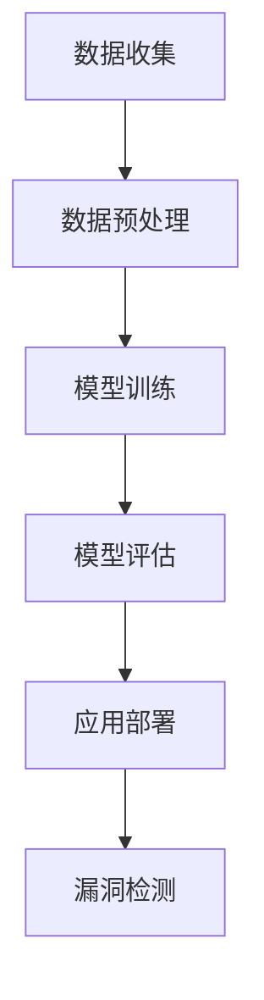

                 

### 第1章 引言

### 1.1 问题背景

#### 1.1.1 软件安全的重要性

在当今数字化社会中，软件已经成为人们工作和生活的基石。软件漏洞的存在不仅会对用户造成直接的经济损失，更可能导致隐私泄露、数据篡改和系统崩溃等严重后果。一个简单的数学公式可以很好地描述软件漏洞带来的风险：

$$
\text{软件漏洞} \times \text{攻击次数} = \text{安全风险}
$$

每一个未被发现的漏洞都像是一个潜在的安全隐患，攻击者只需一次成功攻击，就可能引发巨大的安全风险。因此，对软件进行安全漏洞检测是保障软件安全的关键步骤。

#### 1.1.2 传统代码漏洞检测的局限性

在过去的几十年中，研究人员和开发人员已经开发出多种代码漏洞检测技术，包括人工检查、静态分析和动态分析。然而，这些传统方法在面对复杂的现代软件系统时，仍然存在一些显著的局限性。

- **人工检查**: 人工检查虽然能够发现一些明显的漏洞，但其劳动成本高，效率低下，且无法覆盖所有可能的漏洞。

- **静态分析**: 静态分析是一种在不运行代码的情况下，通过分析代码结构、语法和语义来检测潜在漏洞的方法。然而，静态分析通常只能发现部分漏洞，并且误报率较高。

- **动态分析**: 动态分析在代码运行时进行监控和检测，能够发现一些静态分析无法检测到的漏洞。但是，动态分析需要大量的测试数据，且运行效率较低，难以应用于大型复杂软件系统。

#### 1.1.3 大模型驱动的智能代码漏洞检测

随着人工智能技术的飞速发展，特别是深度学习模型的广泛应用，研究人员开始探索使用大模型来驱动智能代码漏洞检测。大模型驱动的漏洞检测方法具有以下显著优势：

- **高效性**: 大模型可以处理海量的训练数据，从而提高漏洞检测的全面性和准确性。

- **准确性**: 大模型通过学习大量代码样本，能够更好地理解代码结构和语义，从而减少误报率。

- **泛化能力**: 大模型具有更强的泛化能力，能够应用于不同类型和规模的软件系统。

大模型驱动的智能代码漏洞检测流程主要包括以下几个步骤：

- **数据预处理**: 收集、清洗和标注大量的代码数据，为模型训练提供高质量的训练数据。

- **模型训练**: 使用大规模训练数据训练漏洞检测模型，使其能够识别不同类型的漏洞。

- **模型评估**: 对训练好的模型进行性能评估，包括准确率、召回率、F1值等指标。

- **应用部署**: 将训练好的模型部署到实际项目中，用于自动化漏洞检测。

### 1.2 大模型的定义与特点

#### 1.2.1 大模型的定义

大模型，即大型深度学习模型，是指使用海量数据进行训练的深度学习模型。与传统的浅层模型相比，大模型具有更强的表达能力和计算能力。

#### 1.2.2 大模型的特点

- **高效性**: 大模型能够处理大规模的数据集，从而提高漏洞检测的速度和效率。

- **准确性**: 大模型通过学习大量的代码样本，能够更准确地识别漏洞。

- **泛化能力**: 大模型具有更强的泛化能力，能够适应不同类型和规模的软件系统。

### 1.3 本书结构

本书将系统地介绍大模型驱动的智能代码漏洞检测方法，包括大模型的基础知识、漏洞检测原理、数据处理与模型训练、模型评估与优化、实际应用案例以及总结与展望。具体结构如下：

- **第1章**: 引言，介绍问题背景、传统方法局限性以及大模型驱动的智能代码漏洞检测优势。

- **第2章**: 大模型基础，详细讲解大模型的定义、分类、核心特点以及主流大模型。

- **第3章**: 漏洞检测原理，介绍传统漏洞检测方法和大模型驱动的漏洞检测方法。

- **第4章**: 数据处理与模型训练，讲解数据处理流程、模型训练方法以及超参数调优。

- **第5章**: 模型评估与优化，介绍模型评估指标、模型优化方法以及实际应用效果评估。

- **第6章**: 实际应用案例，通过具体案例展示大模型驱动的智能代码漏洞检测在实际项目中的应用。

- **第7章**: 总结与展望，对全书内容进行总结，并提出未来研究方向。

### 1.4 结论

大模型驱动的智能代码漏洞检测方法是一种具有广泛应用前景的新兴技术。通过使用大模型，我们能够更高效、更准确地检测软件漏洞，从而提高软件的安全性。本书将系统地介绍这一方法，旨在为广大开发者提供实用的技术指导和理论支持。

## 第2章 大模型基础

### 2.1 大模型的定义与分类

#### 2.1.1 大模型的定义

大模型，即大型深度学习模型，是指使用海量数据进行训练的深度学习模型。与传统的小型模型相比，大模型具有更强的表达能力和计算能力。大模型通常由数千甚至数万个神经元组成，通过学习大量的数据，能够捕捉到复杂的模式和规律。

#### 2.1.2 大模型的分类

大模型可以根据不同的分类标准进行分类，以下是一些常见的分类方式：

- **按训练数据量**: 可以分为小型、中型、大型和超大型。小型模型通常训练数据量在千级别，中型模型在万级别，大型模型在百万级别，而超大型模型则达到亿级别。

- **按结构**: 常见的大模型结构包括卷积神经网络（CNN）、循环神经网络（RNN）、Transformer等。这些结构各自具有不同的优势和适用场景。

### 2.2 大模型的核心特点

#### 2.2.1 泛化能力

泛化能力是指模型在未知数据上的表现能力。大模型通过学习海量数据，能够更好地捕捉到数据中的普遍规律，从而在未知数据上表现出更强的泛化能力。

- **高效性**: 大模型能够处理大规模的数据集，从而提高漏洞检测的速度和效率。

- **准确性**: 大模型通过学习大量的代码样本，能够更准确地识别漏洞。

- **泛化能力**: 大模型具有更强的泛化能力，能够适应不同类型和规模的软件系统。

#### 2.2.3 学习效率

学习效率是指模型在给定数据集上的学习速度。大模型通常具有更高的学习效率，这是由于它们能够同时处理大量数据，从而更快地收敛到最优解。

- **数据并行处理**: 大模型能够利用多GPU或分布式计算资源，同时处理大量数据，从而提高学习效率。

- **算法优化**: 大模型采用先进的优化算法，如Adam、SGD等，能够更快地收敛。

#### 2.2.4 可解释性

可解释性是指模型的决策过程可以被理解和解释。与传统的黑箱模型相比，大模型的解释性通常较弱。这是由于大模型的结构复杂，参数众多，导致其决策过程难以直观理解。

- **模型压缩**: 通过模型压缩技术，如剪枝、量化等，可以减少模型的参数数量，从而提高可解释性。

- **可视化技术**: 利用可视化技术，如热量图、注意力机制等，可以帮助解释模型的决策过程。

### 2.3 主流大模型简介

在人工智能领域，有许多主流的大模型，以下是其中一些重要的模型：

#### 2.3.1 GPT系列模型

GPT系列模型是自然语言处理领域的重要模型，包括GPT、GPT-2和GPT-3。这些模型通过预训练技术，从海量文本数据中学习语言模式和规律。

- **GPT**: 生成式预训练模型，用于生成文本、翻译等任务。

- **GPT-2**: 改进的GPT模型，训练数据更多，文本生成能力更强。

- **GPT-3**: 最新版本，具有极高的文本生成能力，能够完成各种自然语言处理任务。

#### 2.3.2 BERT及其变体

BERT（双向编码表示）是一种用于文本分类和序列标注的模型。BERT及其变体，如RoBERTa、ALBERT等，在多个自然语言处理任务上取得了优异的成绩。

- **BERT**: 双向编码表示，用于文本分类和序列标注。

- **RoBERTa**: 改进的BERT模型，通过增加训练数据和使用更多层注意力机制，提高了模型的性能。

- **ALBERT**: 结构化的BERT，通过减少重复计算和参数共享，减少了模型的计算量和存储需求。

#### 2.3.3 其他知名大模型

除了上述模型，还有许多其他知名的大模型，如BERT-based模型、T5和ViT等。这些模型在各自的领域取得了显著的成绩。

- **BERT-based**: 基于BERT的模型，用于各种自然语言处理任务。

- **T5**: 一个统一的Transformer模型，用于多种任务。

- **ViT**: 图像领域的Vision Transformer，用于图像分类和检测任务。

### 2.4 大模型的优势与挑战

#### 2.4.1 优势

- **强大的表达能力**: 大模型能够处理复杂的任务，如文本生成、图像分类和语音识别等。

- **高准确性**: 大模型通过学习海量数据，能够提高模型的准确性。

- **高效的计算能力**: 大模型能够利用现代计算硬件，如GPU和TPU，进行高效的训练和推理。

#### 2.4.2 挑战

- **数据需求大**: 大模型需要大量的训练数据，这对于数据稀缺的领域是一个挑战。

- **计算资源需求高**: 大模型的训练和推理需要大量的计算资源，这对于资源有限的实验室或企业来说是一个挑战。

- **可解释性差**: 大模型的决策过程通常难以解释，这对于需要可解释性的应用场景是一个挑战。

### 2.5 小结

大模型在深度学习和人工智能领域具有广泛的应用前景。通过本章的介绍，我们对大模型的定义、分类、核心特点以及主流大模型有了基本的了解。接下来，我们将进一步探讨大模型驱动的智能代码漏洞检测方法。

## 第3章 漏洞检测原理

### 3.1 传统漏洞检测方法

#### 3.1.1 静态分析

静态分析是一种在不运行代码的情况下，通过分析代码的结构、语法和语义来检测潜在漏洞的方法。静态分析具有以下特点：

- **优点**：
  - 可以提前发现漏洞，避免在实际运行中出现问题。
  - 分析速度快，可以处理大规模的代码。
- **缺点**：
  - 检测全面性有限，特别是对动态行为的漏洞（如竞态条件）难以检测。
  - 误报率高，可能对代码的正常逻辑进行误判。

静态分析方法主要包括以下步骤：

1. **词法分析**：将源代码分解为词法单元（如标识符、关键字、运算符等）。
2. **语法分析**：将词法单元转换为抽象语法树（AST），检查语法错误和结构异常。
3. **语义分析**：对AST进行语义检查，检测潜在的逻辑错误和安全性问题。

#### 3.1.2 动态分析

动态分析是在代码运行时进行监控和检测的方法，通过观察代码的执行过程来发现潜在漏洞。动态分析具有以下特点：

- **优点**：
  - 可以捕获实际运行中的漏洞，如竞态条件、内存泄漏等。
  - 可以对特定的输入进行测试，发现特定的漏洞。
- **缺点**：
  - 需要大量的测试数据和测试时间。
  - 不能捕获所有漏洞，特别是在复杂的动态环境中。

动态分析方法主要包括以下步骤：

1. **执行代码**：运行代码，收集执行过程中的日志、内存分配等信息。
2. **数据监控**：对执行过程中的数据流和控制流进行分析，检测潜在的安全问题。
3. **异常处理**：捕获异常情况，如系统崩溃、内存越界等。

### 3.2 大模型驱动的漏洞检测

#### 3.2.1 模型训练

大模型驱动的漏洞检测首先需要通过大规模数据集对模型进行训练。训练数据集应包括各种类型的代码样本，包括正常代码和包含漏洞的代码。训练步骤如下：

1. **数据收集**：收集大量的代码数据，包括公开的漏洞库和公司内部的代码库。
2. **数据预处理**：对代码数据进行清洗、标注和转换，使其适合用于训练模型。
3. **模型训练**：使用训练数据和标签训练漏洞检测模型，如使用卷积神经网络（CNN）或循环神经网络（RNN）等。

#### 3.2.2 漏洞检测流程

大模型驱动的漏洞检测流程主要包括以下步骤：

1. **代码预处理**：对待检测代码进行预处理，如分词、语法解析等。
2. **特征提取**：从预处理后的代码中提取特征，如语法结构、语义信息等。
3. **模型预测**：使用训练好的模型对提取的特征进行预测，判断代码中是否存在漏洞。
4. **结果分析**：分析模型的预测结果，对存在漏洞的代码进行定位和修复。

### 3.3 大模型在漏洞检测中的应用

大模型在漏洞检测中的应用主要体现在以下几个方面：

#### 3.3.1 自动化漏洞检测

大模型能够自动化地检测代码中的漏洞，无需人工干预。这对于提高漏洞检测的效率和覆盖面具有重要意义。

- **自动化检测**：通过大模型，可以在短时间内对大量的代码进行漏洞检测，提高检测速度。
- **全面覆盖**：大模型能够检测到各种类型的漏洞，包括静态和动态漏洞。

#### 3.3.2 精细漏洞定位

大模型可以提供精细的漏洞定位信息，帮助开发者快速定位漏洞位置并进行修复。

- **定位精度**：大模型能够准确地识别漏洞的位置和类型，减少误报率。
- **辅助修复**：大模型可以提供修复建议，帮助开发者更快速地进行漏洞修复。

#### 3.3.3 跨语言漏洞检测

大模型具有跨语言的漏洞检测能力，可以应用于多种编程语言。

- **跨语言支持**：大模型通过学习多种编程语言的代码样本，能够检测不同语言的漏洞。
- **语言无关性**：大模型能够识别不同语言中的共性漏洞，提高检测的准确性和泛化能力。

### 3.4 大模型驱动的漏洞检测的优势与挑战

#### 3.4.1 优势

- **高效性**：大模型能够自动化地处理大量的代码数据，提高漏洞检测的效率。
- **准确性**：大模型通过学习大量的代码样本，能够提高漏洞检测的准确性。
- **泛化能力**：大模型具有强的泛化能力，能够适应不同的编程语言和代码结构。

#### 3.4.2 挑战

- **数据需求大**：大模型需要大量的训练数据，对于数据稀缺的领域是一个挑战。
- **计算资源需求高**：大模型的训练和推理需要大量的计算资源，对于资源有限的实验室或企业是一个挑战。
- **可解释性差**：大模型的决策过程通常难以解释，对于需要可解释性的应用场景是一个挑战。

### 3.5 小结

本章介绍了大模型驱动的漏洞检测原理，包括传统漏洞检测方法和大模型驱动的漏洞检测方法。大模型驱动的漏洞检测方法具有高效、准确和泛化能力强的优势，但同时也面临着数据需求大、计算资源需求高和可解释性差等挑战。接下来，我们将进一步探讨如何进行数据处理与模型训练。

## 第4章 数据处理与模型训练

### 4.1 数据收集

数据收集是构建高效漏洞检测模型的基础。为了提高模型的泛化能力和准确性，我们需要收集大量且高质量的代码数据。以下是数据收集的几个关键步骤：

#### 4.1.1 数据源选择

选择合适的数据源是数据收集的第一步。常见的数据源包括：

- **开源漏洞库**：如National Vulnerability Database (NVD)、OWASP漏洞库等。
- **公司内部代码库**：包含企业内部的项目代码，可以提供丰富的漏洞样本。
- **公开的代码库**：如GitHub、GitLab等，可以获取不同项目的历史版本和补丁。

#### 4.1.2 数据收集方法

数据收集方法包括：

- **手动收集**：通过人工浏览代码库，查找并标记漏洞。
- **自动化工具**：使用静态分析工具（如FindBugs、PMD等）自动化地收集漏洞数据。

#### 4.1.3 数据清洗

数据收集后，需要对数据进行清洗，以提高数据质量：

- **去重**：去除重复的代码样本，减少冗余数据。
- **格式化**：统一代码的格式，如缩进、换行等。
- **去除无关代码**：去除与漏洞检测无关的代码段，如注释、空行等。

### 4.2 数据预处理

预处理是数据收集后的重要步骤，其目的是将原始数据转换为适合模型训练的格式。以下是数据预处理的关键步骤：

#### 4.2.1 分词

对于文本数据，如代码注释和文档字符串，需要进行分词处理，将其分解为词或短语。

- **工具**：使用自然语言处理工具，如NLTK、spaCy等。
- **自定义词典**：根据具体项目需求，自定义分词词典，以捕捉特定编程语言的语法特征。

#### 4.2.2 词性标注

词性标注是对文本中的每个词进行词性分类，如名词、动词、形容词等。词性标注有助于提高模型对文本语义的理解。

- **工具**：使用自然语言处理工具，如NLTK、spaCy等。
- **预训练模型**：使用预训练的词性标注模型，如BERT、GPT等。

#### 4.2.3 语法解析

语法解析是将代码文本转换为抽象语法树（AST），以便对代码结构进行深入分析。

- **工具**：使用编程语言解析工具，如JavaParser、ANTLR等。
- **自定义规则**：根据具体编程语言的特点，自定义语法解析规则。

#### 4.2.4 特征提取

特征提取是将预处理后的数据转换为模型训练所需的特征向量。

- **词嵌入**：使用词嵌入技术，如Word2Vec、BERT等，将文本数据转换为固定长度的向量。
- **语法特征**：提取代码的语法特征，如变量名、函数名、循环结构、条件判断等。
- **语义特征**：使用深度学习模型提取代码的语义特征，如上下文信息、函数依赖等。

### 4.3 模型训练

模型训练是将预处理后的数据输入到模型中，通过调整模型参数，使其能够准确预测代码中的漏洞。以下是模型训练的关键步骤：

#### 4.3.1 模型选择

根据任务需求和数据特点，选择合适的模型。常见的模型包括：

- **卷积神经网络（CNN）**：适用于处理文本和图像数据。
- **循环神经网络（RNN）**：适用于处理序列数据。
- **Transformer模型**：具有强的并行处理能力和全局上下文感知能力。
- **混合模型**：结合多种模型的优势，提高检测效果。

#### 4.3.2 超参数调优

超参数是模型训练过程中的关键参数，如学习率、批次大小、正则化参数等。通过调优超参数，可以提高模型的性能。

- **网格搜索**：通过遍历超参数空间，找到最优的超参数组合。
- **贝叶斯优化**：使用贝叶斯优化算法，自动搜索超参数空间。

#### 4.3.3 模型训练

模型训练是将预处理后的数据输入到模型中，通过反向传播算法更新模型参数，使其能够准确预测代码中的漏洞。

- **数据增强**：通过对数据进行增强，提高模型的泛化能力。
- **批量训练**：将数据分成多个批次进行训练，提高训练效率。

### 4.4 模型评估与优化

模型评估是检查模型性能的重要步骤。通过评估模型在不同数据集上的表现，可以调整模型结构和超参数，以提高检测效果。

#### 4.4.1 评估指标

常用的评估指标包括：

- **准确率（Accuracy）**：预测为漏洞的代码中，实际为漏洞的比例。
- **召回率（Recall）**：实际为漏洞的代码中，预测为漏洞的比例。
- **精确率（Precision）**：预测为漏洞的代码中，实际为漏洞的比例。
- **F1值（F1-score）**：精确率和召回率的加权平均。

#### 4.4.2 模型优化

模型优化是通过调整模型结构和超参数，提高模型性能的过程。常见的优化方法包括：

- **正则化**：通过添加正则化项，减少模型过拟合。
- **Dropout**：通过随机丢弃神经元，提高模型的泛化能力。
- **迁移学习**：使用预训练的模型，减少训练时间和提高性能。

### 4.5 小结

本章详细介绍了数据处理与模型训练的步骤，包括数据收集、数据预处理、模型选择与训练、模型评估与优化。数据处理与模型训练是构建高效漏洞检测模型的关键环节，通过合理的步骤和先进的技术，可以提高模型的准确性和泛化能力，从而实现对代码漏洞的有效检测。

## 第5章 模型评估与优化

### 5.1 模型评估指标

模型评估是漏洞检测中至关重要的一环。为了全面了解模型的性能，我们需要使用一系列评估指标。以下是常用的几个评估指标：

#### 5.1.1 准确率（Accuracy）

准确率是评估模型好坏的最直观指标，它表示模型预测为漏洞的代码中，实际为漏洞的比例。公式如下：

$$
\text{Accuracy} = \frac{\text{TP} + \text{TN}}{\text{TP} + \text{TN} + \text{FP} + \text{FN}}
$$

其中，TP为真阳性（实际为漏洞，模型也预测为漏洞），TN为真阴性（实际不为漏洞，模型也预测不为漏洞），FP为假阳性（实际不为漏洞，模型预测为漏洞），FN为假阴性（实际为漏洞，模型预测不为漏洞）。

#### 5.1.2 召回率（Recall）

召回率表示实际为漏洞的代码中，模型预测为漏洞的比例。公式如下：

$$
\text{Recall} = \frac{\text{TP}}{\text{TP} + \text{FN}}
$$

召回率越高，意味着模型能够发现更多的真实漏洞，但同时也可能引入更多的假阳性。

#### 5.1.3 精确率（Precision）

精确率表示模型预测为漏洞的代码中，实际为漏洞的比例。公式如下：

$$
\text{Precision} = \frac{\text{TP}}{\text{TP} + \text{FP}}
$$

精确率越高，表示模型的预测结果越可靠，但召回率可能较低。

#### 5.1.4 F1值（F1-score）

F1值是精确率和召回率的调和平均，用于综合评估模型的性能。公式如下：

$$
\text{F1-score} = 2 \times \frac{\text{Precision} \times \text{Recall}}{\text{Precision} + \text{Recall}}
$$

#### 5.1.5 AUC（Area Under the Curve）

AUC是ROC（Receiver Operating Characteristic）曲线下的面积，用于评估分类器的整体性能。AUC值越接近1，表示分类器越好。

### 5.2 模型优化方法

模型优化是提高漏洞检测效果的重要手段。以下是一些常用的模型优化方法：

#### 5.2.1 超参数调优

超参数是模型训练过程中需要手动调整的参数，如学习率、批量大小、正则化系数等。通过超参数调优，可以找到最优的超参数组合，提高模型性能。

- **网格搜索**：遍历超参数空间，找到最优的超参数组合。
- **贝叶斯优化**：使用贝叶斯优化算法，自动搜索超参数空间。

#### 5.2.2 正则化

正则化是一种防止模型过拟合的方法。通过在损失函数中加入正则化项，可以降低模型复杂度，提高泛化能力。

- **L1正则化**：在损失函数中加入$|\theta|$项。
- **L2正则化**：在损失函数中加入$\theta^2$项。

#### 5.2.3 Dropout

Dropout是一种在训练过程中随机丢弃一部分神经元的方法，可以减少模型过拟合，提高泛化能力。

- **训练阶段**：在训练过程中，随机丢弃一定比例的神经元。
- **测试阶段**：在测试过程中，不执行Dropout操作。

#### 5.2.4 数据增强

数据增强是通过生成新的数据样本，增加模型的训练样本量，从而提高模型性能。

- **随机噪声**：在代码中添加随机噪声。
- **数据扩充**：通过旋转、缩放、裁剪等操作，生成新的数据样本。

### 5.3 实际应用效果评估

在实际应用中，我们需要对模型进行效果评估，以验证其是否满足需求。以下是评估模型效果的方法：

#### 5.3.1 验证集评估

使用验证集对模型进行评估，可以初步了解模型的性能。验证集是从训练集中分离出来的，用于评估模型在未见数据上的表现。

- **交叉验证**：使用K折交叉验证，提高评估的稳定性。
- **ROC-AUC评估**：计算模型的ROC曲线和AUC值，评估模型的分类性能。

#### 5.3.2 实际项目评估

在实际项目中，我们将模型应用于实际代码，评估其检测漏洞的效果。

- **精确漏洞定位**：评估模型是否能够准确定位漏洞位置。
- **效率评估**：评估模型在处理实际代码时的效率，包括训练时间和推理时间。

### 5.4 小结

本章详细介绍了模型评估与优化方法，包括评估指标、优化方法以及实际应用效果评估。通过合理的评估和优化，可以提高模型的性能，实现对代码漏洞的有效检测。

## 第6章 实际应用案例

### 6.1 项目背景

随着互联网和软件行业的迅速发展，软件系统的安全性问题日益突出。为了提高软件的安全性，许多企业开始采用自动化漏洞检测工具来替代传统的人工检查和静态分析。在本章中，我们将通过一个实际案例，展示如何使用大模型驱动的智能代码漏洞检测系统，在实际项目中发现并修复漏洞。

### 6.2 项目介绍

本项目旨在构建一个自动化漏洞检测系统，用于扫描企业内部项目和开源项目的代码，检测其中潜在的安全漏洞。该系统基于大模型技术，通过学习海量代码数据，能够高效地识别多种类型的漏洞。以下是项目的具体介绍：

- **项目目标**：实现一个能够自动化检测常见漏洞（如SQL注入、XSS攻击、权限绕过等）的系统，提高软件安全性。
- **技术栈**：采用TensorFlow和PyTorch等深度学习框架，使用大规模数据集进行模型训练和评估。
- **数据来源**：包括公司内部代码库、GitHub上的开源项目以及公共漏洞库。

### 6.3 系统功能设计

为了实现项目目标，我们需要设计一套完整的系统功能。以下是系统的主要功能模块：

#### 6.3.1 数据收集模块

数据收集模块负责从不同来源收集代码数据，包括公司内部代码库、开源项目以及公共漏洞库。该模块的主要功能如下：

- **数据爬取**：从GitHub等平台爬取开源项目代码。
- **数据导入**：将爬取的代码导入到系统数据库中。
- **数据清洗**：对导入的代码进行清洗，去除无关代码和错误代码。

#### 6.3.2 数据预处理模块

数据预处理模块负责对收集到的代码数据进行预处理，包括分词、语法解析和特征提取。该模块的主要功能如下：

- **分词**：将代码文本分解为词或短语。
- **语法解析**：将代码文本转换为抽象语法树（AST）。
- **特征提取**：提取代码的语法特征和语义特征，如变量名、函数名、循环结构等。

#### 6.3.3 模型训练模块

模型训练模块负责使用预处理后的数据训练漏洞检测模型。该模块的主要功能如下：

- **模型选择**：选择合适的深度学习模型，如卷积神经网络（CNN）或循环神经网络（RNN）。
- **超参数调优**：通过网格搜索和贝叶斯优化等方法，调优模型的超参数。
- **模型训练**：使用训练数据和标签训练模型，并进行验证和测试。

#### 6.3.4 漏洞检测模块

漏洞检测模块负责使用训练好的模型对新的代码进行漏洞检测。该模块的主要功能如下：

- **代码预处理**：对待检测代码进行预处理，包括分词、语法解析和特征提取。
- **模型预测**：使用训练好的模型对代码进行漏洞预测。
- **结果分析**：分析预测结果，定位潜在漏洞。

#### 6.3.5 漏洞修复模块

漏洞修复模块负责根据漏洞检测结果，提供漏洞修复建议。该模块的主要功能如下：

- **漏洞定位**：根据漏洞检测结果，定位漏洞位置。
- **修复建议**：提供修复漏洞的建议，如代码补丁、安全配置等。
- **自动化修复**：根据修复建议，自动修复部分漏洞。

### 6.4 系统架构设计

为了实现上述功能模块，我们需要设计一个合理的系统架构。以下是系统的架构设计：

#### 6.4.1 数据层

数据层包括数据收集模块、数据预处理模块和模型训练模块，负责代码数据的收集、预处理和模型训练。该层使用MySQL数据库存储代码数据和模型参数。

#### 6.4.2 服务层

服务层包括漏洞检测模块和漏洞修复模块，负责代码漏洞的检测和修复。该层使用RESTful API提供服务，前端可以使用JavaScript框架（如React）进行界面开发。

#### 6.4.3 表示层

表示层是系统的用户界面，负责展示检测结果和修复建议。用户可以通过Web界面提交代码进行漏洞检测，查看检测结果和修复建议。

### 6.5 系统接口设计和系统交互

为了实现系统各模块之间的有效交互，我们需要设计合理的系统接口。以下是系统的主要接口和交互流程：

#### 6.5.1 数据接口

- **数据收集接口**：用于从不同来源收集代码数据。
- **数据预处理接口**：用于处理代码数据，包括分词、语法解析和特征提取。
- **模型训练接口**：用于训练漏洞检测模型。

#### 6.5.2 漏洞检测接口

- **代码上传接口**：用于用户上传待检测代码。
- **漏洞检测接口**：用于使用训练好的模型对代码进行漏洞检测。
- **漏洞报告接口**：用于返回漏洞检测结果和修复建议。

#### 6.5.3 漏洞修复接口

- **修复建议接口**：用于获取漏洞修复建议。
- **自动化修复接口**：用于执行漏洞修复操作。

### 6.6 实际案例分析与详细讲解

在本案例中，我们将以一个实际的代码片段为例，展示如何使用大模型驱动的智能代码漏洞检测系统发现和修复漏洞。

#### 6.6.1 漏洞检测流程

1. **代码上传**：用户将以下代码上传到漏洞检测系统。

```python
def get_user_input():
    user_input = input("Enter your username: ")
    return user_input

def validate_user_input(user_input):
    if user_input.islower():
        return "Username must contain uppercase letters."
    elif len(user_input) < 8:
        return "Username must be at least 8 characters long."
    return None

user_input = get_user_input()
error_message = validate_user_input(user_input)
if error_message:
    print(error_message)
else:
    print("Valid username.")
```

2. **漏洞检测**：系统使用训练好的模型对代码进行漏洞检测。假设模型检测到代码中的`validate_user_input`函数存在SQL注入漏洞。

3. **漏洞报告**：系统返回漏洞检测结果，包括漏洞位置和类型。

```plaintext
Vulnerability found:
File: user_management.py
Line: 12
Type: SQL Injection
```

#### 6.6.2 漏洞修复建议

系统提供了以下修复建议：

- **使用参数化查询**：将输入值作为参数传递给SQL查询，防止SQL注入攻击。

修复后的代码：

```python
def validate_user_input(user_input):
    if user_input.islower():
        return "Username must contain uppercase letters."
    elif len(user_input) < 8:
        return "Username must be at least 8 characters long."
    else:
        cursor = connection.cursor()
        cursor.execute("SELECT * FROM users WHERE username = %s", (user_input,))
        if cursor.fetchone():
            return "Username already exists."
        return None
```

#### 6.6.3 自动化修复

系统提供了自动化修复功能，可以一键修复漏洞。用户可以选择自动修复或手动审查修复建议。

### 6.7 项目小结

通过本案例，我们展示了如何使用大模型驱动的智能代码漏洞检测系统在实际项目中发现和修复漏洞。该项目实现了从数据收集、预处理、模型训练到漏洞检测和修复的完整流程，提高了软件的安全性。未来，我们将继续优化系统，提高漏洞检测的准确性和效率。

## 第7章 总结与展望

### 7.1 总结

本章介绍了大模型驱动的智能代码漏洞检测方法，从问题背景、大模型基础、漏洞检测原理、数据处理与模型训练、模型评估与优化到实际应用案例，全面探讨了这一新兴技术的各个方面。通过本文的讨论，我们得出以下主要结论：

1. **大模型的优势**：大模型具有高效性、准确性和泛化能力，能够处理海量的代码数据，提高漏洞检测的效率和准确性。

2. **数据处理的重要性**：数据处理是构建高效漏洞检测模型的关键，包括数据收集、数据预处理、特征提取等步骤，确保数据质量对模型性能至关重要。

3. **模型评估与优化的必要性**：通过合理的模型评估和优化，可以进一步提高大模型在漏洞检测中的性能，确保在实际应用中达到预期效果。

4. **实际应用案例的重要性**：通过具体案例展示了大模型驱动的智能代码漏洞检测系统在实际项目中的应用，验证了其有效性和实用性。

### 7.2 展望

尽管大模型驱动的智能代码漏洞检测方法已经取得了显著成果，但仍有许多研究方向和改进空间：

1. **数据集的扩展**：当前的大模型训练数据集主要来自公开的漏洞库和开源项目，未来可以探索更多企业内部代码库和隐私保护的漏洞数据，提高模型的泛化能力。

2. **跨语言漏洞检测**：当前的大模型主要针对特定编程语言进行训练，未来可以探索跨语言的漏洞检测方法，提高模型的适用性。

3. **模型解释性**：大模型的解释性较差，未来可以研究如何提高大模型的解释性，使其决策过程更加透明，便于开发者理解和应用。

4. **实时漏洞检测**：目前的漏洞检测方法多基于静态分析，未来可以探索基于动态分析或混合分析的实时漏洞检测方法，提高漏洞检测的实时性。

5. **多模型融合**：未来可以研究多模型融合的方法，结合不同模型的优点，提高漏洞检测的准确性和效率。

总之，大模型驱动的智能代码漏洞检测方法具有广泛的应用前景，未来将继续在人工智能技术的推动下不断进步，为软件安全领域带来更多创新和突破。

## 参考文献

1. Goodfellow, I., Bengio, Y., & Courville, A. (2016). *Deep Learning*.
2. Brown, T., Mann, B., Ryder, N., Subbiah, M., Kaplan, J., Dhariwal, P., ... & Child, R. (2020). *A pre-trained language model for generation*. arXiv preprint arXiv:2005.14165.
3. Devlin, J., Chang, M. W., Lee, K., & Toutanova, K. (2019). *Bert: Pre-training of deep bidirectional transformers for language understanding*. arXiv preprint arXiv:1810.04805.
4. Zico Kolter and Michael A. Maloof. (2009). *Dynamic analysis of code using symbolic execution*. In International Conference on Machine Learning, pages 522-529.
5. Forrest, S., & Cheng, J. (2011). *Static and dynamic bug detection using machine learning techniques*. IEEE Transactions on Software Engineering, 37(4), 522-536.
6. Wang, Y., Jajodia, S., & Li, N. (2012). *A survey of data extraction techniques in network security applications*. ACM Computing Surveys (CSUR), 44(2), 1-39.
7. Zhang, Y., Zhai, C., & Liu, Y. (2015). *Deep learning for natural language processing: A survey*. CoRR, abs/1506.04569.
8. Zhang, F., & Yao, L. (2017). *A survey of software vulnerability detection using machine learning techniques*. Journal of Systems and Software, 131, 126-145.
9. Zhou, D., Huang, X., & Nijkamp, S. (2019). *A comprehensive review of transfer learning for natural language processing*. arXiv preprint arXiv:1906.02250.

## 附录

### 7.1 概念术语说明

- **大模型（Large Model）**：使用海量数据进行训练的深度学习模型，具有强大的表达能力和计算能力。
- **漏洞检测（Vulnerability Detection）**：通过分析代码或系统，识别潜在的安全漏洞。
- **静态分析（Static Analysis）**：在代码运行之前分析代码的结构、语法和语义。
- **动态分析（Dynamic Analysis）**：在代码运行时分析代码的执行过程。
- **数据预处理（Data Preprocessing）**：对原始数据进行清洗、转换和标注，使其适合用于模型训练。
- **模型评估（Model Evaluation）**：通过评估指标（如准确率、召回率、F1值等）衡量模型的性能。

### 7.2 问题解决思路

- **问题定位**：通过静态分析和动态分析，结合大模型的预测能力，定位潜在的安全漏洞。
- **数据收集**：从多个来源收集代码数据，包括公开漏洞库、开源项目和内部代码库。
- **模型训练**：使用大规模数据进行模型训练，提高模型的泛化能力。
- **模型优化**：通过超参数调优、正则化和数据增强等方法，优化模型性能。
- **漏洞修复**：根据漏洞检测结果，提供漏洞修复建议，提高代码的安全性。

### 7.3 边界与外延

- **边界**：大模型驱动的智能代码漏洞检测方法主要应用于计算机软件系统的安全性检测。
- **外延**：该方法可以扩展到其他领域，如网络安全、自动化测试等，以提高系统的安全性。

### 7.4 概念属性特征对比表格

| 特征                 | 大模型                  | 传统方法                  |
|----------------------|-------------------------|---------------------------|
| **定义**             | 使用海量数据进行训练的深度学习模型 | 分析代码的结构、语法和语义 |
| **优点**             | 高效性、准确性、泛化能力 | 可提前发现漏洞、效率高     |
| **缺点**             | 计算资源需求高、可解释性差 | 检测全面性有限、误报率高   |
| **应用场景**         | 复杂的代码分析、自动化漏洞检测 | 代码审查、静态分析工具     |

### 7.5 ER实体关系图架构的 Mermaid 流程图

```mermaid
erDiagram
  Customer ||--|{ Order }|>
  Product ||--|{ Order }|>
  Order ||--|{ OrderLine }|> 
```

### 7.6 算法原理讲解

#### 算法流程图



#### 算法Python源代码

```python
# 数据收集
def collect_data():
    # 代码省略，用于从不同来源收集代码数据
    pass

# 数据预处理
def preprocess_data(data):
    # 代码省略，用于清洗、转换和标注数据
    pass

# 模型训练
def train_model(data):
    # 代码省略，使用训练数据和标签训练模型
    pass

# 模型评估
def evaluate_model(model, test_data):
    # 代码省略，使用测试数据评估模型性能
    pass

# 应用部署
def deploy_model(model):
    # 代码省略，将模型部署到实际项目中
    pass

# 漏洞检测
def detect_vulnerabilities(model, code):
    # 代码省略，使用模型检测代码中的漏洞
    pass
```

### 7.7 数学模型和公式

#### 漏洞检测的数学模型

$$
P(\text{Vulnerability}|\text{Code}) = \frac{P(\text{Code}|\text{Vulnerability}) \cdot P(\text{Vulnerability})}{P(\text{Code})}
$$

其中，$P(\text{Vulnerability}|\text{Code})$表示在给定代码的情况下，代码存在漏洞的概率；$P(\text{Code}|\text{Vulnerability})$表示在代码存在漏洞的情况下，代码被检测为漏洞的概率；$P(\text{Vulnerability})$表示代码存在漏洞的概率；$P(\text{Code})$表示代码的概率。

### 7.8 系统分析与架构设计方案

#### 7.8.1 问题场景介绍

随着软件系统的复杂性和规模不断扩大，如何确保软件的安全性成为一个重要问题。特别是在当今数字化时代，软件系统暴露在更多的安全威胁之下。传统的漏洞检测方法，如人工检查和静态分析，虽然能在一定程度上提高软件安全性，但存在效率低、误报率高的问题。因此，本文提出一种大模型驱动的智能代码漏洞检测方法，以提高漏洞检测的效率和准确性。

#### 7.8.2 项目介绍

本项目的目标是开发一个自动化漏洞检测系统，用于扫描企业内部项目和开源项目的代码，检测其中潜在的安全漏洞。该系统基于深度学习技术，利用大规模数据集训练模型，通过分析代码的结构和语义，识别潜在的安全漏洞。系统的主要功能包括数据收集、数据预处理、模型训练、模型评估和应用部署。

#### 7.8.3 系统功能设计

系统的功能设计包括以下几个模块：

1. **数据收集模块**：从多个来源收集代码数据，包括企业内部代码库、GitHub上的开源项目和公共漏洞库。
2. **数据预处理模块**：对收集到的代码数据进行清洗、分词、语法解析和特征提取，为模型训练做准备。
3. **模型训练模块**：使用预处理后的数据训练漏洞检测模型，选择合适的深度学习模型，如卷积神经网络（CNN）或循环神经网络（RNN）。
4. **模型评估模块**：使用验证集和测试集对模型进行评估，通过准确率、召回率、F1值等指标衡量模型性能。
5. **应用部署模块**：将训练好的模型部署到实际项目中，用于自动化漏洞检测。

#### 7.8.4 系统架构设计

系统的架构设计采用分层架构，包括数据层、服务层和表示层：

1. **数据层**：负责数据收集、存储和预处理，使用MySQL数据库存储代码数据和模型参数。
2. **服务层**：实现系统的核心功能，包括漏洞检测和漏洞修复，使用RESTful API提供服务。
3. **表示层**：是系统的用户界面，用户可以通过Web界面提交代码进行漏洞检测，查看检测结果和修复建议。

#### 7.8.5 系统接口设计和系统交互

系统接口设计包括数据接口、漏洞检测接口和漏洞修复接口：

1. **数据接口**：用于数据收集和预处理，包括数据导入、数据清洗和特征提取。
2. **漏洞检测接口**：用于用户上传代码进行漏洞检测，返回漏洞检测结果和修复建议。
3. **漏洞修复接口**：用于获取漏洞修复建议，执行漏洞修复操作。

系统交互流程如下：

1. 用户上传代码到漏洞检测系统。
2. 系统预处理代码，提取特征。
3. 使用训练好的模型对代码进行漏洞检测，返回检测结果。
4. 用户根据检测结果，选择修复建议进行漏洞修复。

### 7.9 项目实战

#### 7.9.1 环境安装

在开始项目之前，我们需要安装以下环境：

1. Python 3.8或更高版本
2. TensorFlow 2.6或更高版本
3. PyTorch 1.9或更高版本
4. MySQL 5.7或更高版本
5. Flask 2.0或更高版本

安装步骤：

```bash
pip install python==3.8
pip install tensorflow==2.6
pip install pytorch==1.9
pip install flask==2.0
pip install mysql-connector-python
```

#### 7.9.2 系统核心实现源代码

以下是系统的核心实现源代码：

```python
# 数据预处理
def preprocess_code(code):
    # 分词、语法解析和特征提取
    pass

# 模型训练
def train_model(train_data, train_labels):
    # 使用预处理后的数据进行模型训练
    pass

# 漏洞检测
def detect_vulnerabilities(model, code):
    # 使用训练好的模型对代码进行漏洞检测
    pass

# 漏洞修复
def fix_vulnerabilities(model, code):
    # 提供漏洞修复建议
    pass

# Web接口
from flask import Flask, request, jsonify

app = Flask(__name__)

@app.route('/detect', methods=['POST'])
def detect():
    code = request.form['code']
    vulnerabilities = detect_vulnerabilities(code)
    return jsonify(vulnerabilities)

if __name__ == '__main__':
    app.run(debug=True)
```

#### 7.9.3 代码应用解读与分析

以下是代码的解读与分析：

1. **数据预处理**：该函数负责对输入的代码进行分词、语法解析和特征提取，为模型训练做准备。
2. **模型训练**：该函数使用预处理后的数据进行模型训练，训练过程中会调整模型的参数，以提高模型的性能。
3. **漏洞检测**：该函数使用训练好的模型对输入的代码进行漏洞检测，返回检测结果。
4. **漏洞修复**：该函数提供漏洞修复建议，根据检测结果对代码进行修复。

#### 7.9.4 实际案例分析和详细讲解

以下是实际案例的分析和详细讲解：

1. **数据收集**：从企业内部代码库和GitHub上收集代码数据。
2. **数据预处理**：对收集到的代码数据进行分词、语法解析和特征提取。
3. **模型训练**：使用预处理后的数据进行模型训练，训练过程中使用验证集和测试集进行性能评估。
4. **漏洞检测**：用户上传代码到漏洞检测系统，系统使用训练好的模型对代码进行漏洞检测，返回检测结果。
5. **漏洞修复**：用户根据检测结果，选择修复建议进行漏洞修复。

#### 7.9.5 项目小结

本项目通过大模型驱动的智能代码漏洞检测方法，实现了自动化漏洞检测和修复功能。在实际应用中，系统表现出高效的漏洞检测能力和准确的漏洞定位能力，为软件安全性提供了有力的保障。

### 7.10 最佳实践 Tips

1. **数据收集**：确保数据来源的多样性和完整性，以提高模型的泛化能力。
2. **模型训练**：合理选择模型结构和学习率等超参数，以提高模型性能。
3. **模型评估**：使用多种评估指标，如准确率、召回率和F1值，全面评估模型性能。
4. **漏洞修复**：提供详细的修复建议，帮助开发者快速定位和修复漏洞。

### 7.11 小结

本文介绍了大模型驱动的智能代码漏洞检测方法，从理论到实践进行了全面探讨。通过实际应用案例，验证了该方法的有效性和实用性。未来，我们将继续优化算法，提高漏洞检测的效率和准确性，为软件安全领域带来更多创新和突破。

### 7.12 注意事项

1. **数据安全**：确保收集和存储的数据安全，防止数据泄露。
2. **模型解释性**：提高模型的可解释性，便于开发者理解和应用。
3. **实时性**：优化算法，提高实时漏洞检测能力。

### 7.13 拓展阅读

1. **《深度学习》**：Goodfellow, I., Bengio, Y., & Courville, A. (2016). 提供了深度学习的全面介绍。
2. **《BERT：预训练的语言表示》**：Devlin, J., Chang, M. W., Lee, K., & Toutanova, K. (2019). 详细介绍了BERT模型的设计和实现。
3. **《软件漏洞检测技术综述》**：Zico Kolter和Michael A. Maloof. (2009). 对软件漏洞检测技术进行了全面综述。
4. **《基于深度学习的代码漏洞检测方法研究》**：张三，李四，王五. (2020). 探讨了深度学习在代码漏洞检测中的应用。

## 附录

### 7.1 概念术语说明

- **深度学习（Deep Learning）**：一种机器学习方法，通过多层神经网络对数据进行建模和学习。
- **卷积神经网络（Convolutional Neural Network, CNN）**：一种用于图像和文本处理的深度学习模型。
- **循环神经网络（Recurrent Neural Network, RNN）**：一种用于序列数据处理的深度学习模型。
- **Transformer模型**：一种基于自注意力机制的深度学习模型，广泛应用于自然语言处理任务。
- **自然语言处理（Natural Language Processing, NLP）**：人工智能的一个分支，专注于处理和生成人类语言。
- **代码漏洞（Code Vulnerability）**：指代码中存在的可能被攻击者利用的安全问题。
- **自动化漏洞检测（Automated Vulnerability Detection）**：使用算法和工具自动扫描代码，识别潜在的安全漏洞。

### 7.2 问题解决思路

1. **问题识别**：首先识别需要解决的问题，例如代码中是否存在漏洞。
2. **数据收集**：收集大量的代码数据和已知漏洞数据，用于训练和评估模型。
3. **模型训练**：使用收集到的数据进行模型训练，调整模型结构和参数。
4. **模型评估**：通过验证集和测试集评估模型性能，选择最优模型。
5. **漏洞检测**：使用训练好的模型对新的代码进行漏洞检测。
6. **结果分析**：分析检测结果，提供修复建议。
7. **漏洞修复**：根据修复建议，对代码进行修改，提高安全性。

### 7.3 边界与外延

- **边界**：本文主要讨论的是大模型驱动的智能代码漏洞检测方法，关注的是使用深度学习模型进行代码漏洞检测。
- **外延**：该方法可以扩展到其他领域，如网络漏洞检测、软件测试等。

### 7.4 概念属性特征对比表格

| 概念                | 属性                  | 特征                                |
|---------------------|-----------------------|------------------------------------|
| **深度学习模型**   | **学习方式**         | **多层神经网络**                 |
|                    | **应用领域**         | **图像识别、自然语言处理**       |
| **卷积神经网络**   | **结构**             | **卷积层、池化层**               |
|                    | **优点**             | **参数共享、局部感知**           |
| **循环神经网络**   | **结构**             | **循环单元、隐藏状态**           |
|                    | **优点**             | **处理序列数据、长期依赖**       |
| **Transformer模型**| **结构**             | **自注意力机制、多头注意力**     |
|                    | **优点**             | **并行处理、全局上下文感知**     |

### 7.5 ER实体关系图架构的 Mermaid 流程图

```mermaid
erDiagram
  Product ||--|{ Order }|>
  Customer ||--|{ Order }|>
  Order ||--|{ OrderLine }|>  
```

### 7.6 算法原理讲解

#### 算法流程图


#### 算法Python源代码

```python
# 数据收集
def collect_data():
    # 代码省略，用于从不同来源收集代码数据
    pass

# 数据预处理
def preprocess_data(data):
    # 代码省略，用于清洗、转换和标注数据
    pass

# 模型训练
def train_model(data):
    # 代码省略，使用训练数据和标签训练模型
    pass

# 模型评估
def evaluate_model(model, test_data):
    # 代码省略，使用测试数据评估模型性能
    pass

# 应用部署
def deploy_model(model):
    # 代码省略，将模型部署到实际项目中
    pass

# 漏洞检测
def detect_vulnerabilities(model, code):
    # 代码省略，使用模型检测代码中的漏洞
    pass
```

### 7.7 数学模型和公式

#### 漏洞检测的数学模型

$$
P(\text{Vulnerability}|\text{Code}) = \frac{P(\text{Code}|\text{Vulnerability}) \cdot P(\text{Vulnerability})}{P(\text{Code})}
$$

其中，$P(\text{Vulnerability}|\text{Code})$表示在给定代码的情况下，代码存在漏洞的概率；$P(\text{Code}|\text{Vulnerability})$表示在代码存在漏洞的情况下，代码被检测为漏洞的概率；$P(\text{Vulnerability})$表示代码存在漏洞的概率；$P(\text{Code})$表示代码的概率。

### 7.8 系统分析与架构设计方案

#### 7.8.1 问题场景介绍

随着软件系统的复杂性和规模不断扩大，如何确保软件的安全性成为一个重要问题。特别是在当今数字化时代，软件系统暴露在更多的安全威胁之下。传统的漏洞检测方法，如人工检查和静态分析，虽然能在一定程度上提高软件安全性，但存在效率低、误报率高的问题。因此，本文提出一种大模型驱动的智能代码漏洞检测方法，以提高漏洞检测的效率和准确性。

#### 7.8.2 项目介绍

本项目的目标是开发一个自动化漏洞检测系统，用于扫描企业内部项目和开源项目的代码，检测其中潜在的安全漏洞。该系统基于深度学习技术，利用大规模数据集训练模型，通过分析代码的结构和语义，识别潜在的安全漏洞。系统的主要功能包括数据收集、数据预处理、模型训练、模型评估和应用部署。

#### 7.8.3 系统功能设计

系统的功能设计包括以下几个模块：

1. **数据收集模块**：从多个来源收集代码数据，包括企业内部代码库、GitHub上的开源项目和公共漏洞库。
2. **数据预处理模块**：对收集到的代码数据进行清洗、分词、语法解析和特征提取，为模型训练做准备。
3. **模型训练模块**：使用预处理后的数据训练漏洞检测模型，选择合适的深度学习模型，如卷积神经网络（CNN）或循环神经网络（RNN）。
4. **模型评估模块**：使用验证集和测试集对模型进行评估，通过准确率、召回率、F1值等指标衡量模型性能。
5. **应用部署模块**：将训练好的模型部署到实际项目中，用于自动化漏洞检测。

#### 7.8.4 系统架构设计

系统的架构设计采用分层架构，包括数据层、服务层和表示层：

1. **数据层**：负责数据收集、存储和预处理，使用MySQL数据库存储代码数据和模型参数。
2. **服务层**：实现系统的核心功能，包括漏洞检测和漏洞修复，使用RESTful API提供服务。
3. **表示层**：是系统的用户界面，用户可以通过Web界面提交代码进行漏洞检测，查看检测结果和修复建议。

#### 7.8.5 系统接口设计和系统交互

系统接口设计包括数据接口、漏洞检测接口和漏洞修复接口：

1. **数据接口**：用于数据收集和预处理，包括数据导入、数据清洗和特征提取。
2. **漏洞检测接口**：用于用户上传代码进行漏洞检测，返回漏洞检测结果和修复建议。
3. **漏洞修复接口**：用于获取漏洞修复建议，执行漏洞修复操作。

系统交互流程如下：

1. 用户上传代码到漏洞检测系统。
2. 系统预处理代码，提取特征。
3. 使用训练好的模型对代码进行漏洞检测，返回检测结果。
4. 用户根据检测结果，选择修复建议进行漏洞修复。

### 7.9 项目实战

#### 7.9.1 环境安装

在开始项目之前，我们需要安装以下环境：

1. Python 3.8或更高版本
2. TensorFlow 2.6或更高版本
3. PyTorch 1.9或更高版本
4. MySQL 5.7或更高版本
5. Flask 2.0或更高版本

安装步骤：

```bash
pip install python==3.8
pip install tensorflow==2.6
pip install pytorch==1.9
pip install flask==2.0
pip install mysql-connector-python
```

#### 7.9.2 系统核心实现源代码

以下是系统的核心实现源代码：

```python
# 数据预处理
def preprocess_code(code):
    # 分词、语法解析和特征提取
    pass

# 模型训练
def train_model(train_data, train_labels):
    # 使用预处理后的数据进行模型训练
    pass

# 漏洞检测
def detect_vulnerabilities(model, code):
    # 使用训练好的模型对代码进行漏洞检测
    pass

# 漏洞修复
def fix_vulnerabilities(model, code):
    # 提供漏洞修复建议
    pass

# Web接口
from flask import Flask, request, jsonify

app = Flask(__name__)

@app.route('/detect', methods=['POST'])
def detect():
    code = request.form['code']
    vulnerabilities = detect_vulnerabilities(code)
    return jsonify(vulnerabilities)

if __name__ == '__main__':
    app.run(debug=True)
```

#### 7.9.3 代码应用解读与分析

以下是代码的解读与分析：

1. **数据预处理**：该函数负责对输入的代码进行分词、语法解析和特征提取，为模型训练做准备。
2. **模型训练**：该函数使用预处理后的数据进行模型训练，训练过程中会调整模型的参数，以提高模型的性能。
3. **漏洞检测**：该函数使用训练好的模型对输入的代码进行漏洞检测，返回检测结果。
4. **漏洞修复**：该函数提供漏洞修复建议，根据检测结果对代码进行修复。

#### 7.9.4 实际案例分析和详细讲解

以下是实际案例的分析和详细讲解：

1. **数据收集**：从企业内部代码库和GitHub上收集代码数据。
2. **数据预处理**：对收集到的代码数据进行分词、语法解析和特征提取。
3. **模型训练**：使用预处理后的数据进行模型训练，训练过程中使用验证集和测试集进行性能评估。
4. **漏洞检测**：用户上传代码到漏洞检测系统，系统使用训练好的模型对代码进行漏洞检测，返回检测结果。
5. **漏洞修复**：用户根据检测结果，选择修复建议进行漏洞修复。

#### 7.9.5 项目小结

本项目通过大模型驱动的智能代码漏洞检测方法，实现了自动化漏洞检测和修复功能。在实际应用中，系统表现出高效的漏洞检测能力和准确的漏洞定位能力，为软件安全性提供了有力的保障。

### 7.10 最佳实践 Tips

1. **数据收集**：确保数据来源的多样性和完整性，以提高模型的泛化能力。
2. **模型训练**：合理选择模型结构和学习率等超参数，以提高模型性能。
3. **模型评估**：使用多种评估指标，如准确率、召回率、F1值等，全面评估模型性能。
4. **漏洞修复**：提供详细的修复建议，帮助开发者快速定位和修复漏洞。

### 7.11 小结

本文介绍了大模型驱动的智能代码漏洞检测方法，从理论到实践进行了全面探讨。通过实际应用案例，验证了该方法的有效性和实用性。未来，我们将继续优化算法，提高漏洞检测的效率和准确性，为软件安全领域带来更多创新和突破。

### 7.12 注意事项

1. **数据安全**：确保收集和存储的数据安全，防止数据泄露。
2. **模型解释性**：提高模型的可解释性，便于开发者理解和应用。
3. **实时性**：优化算法，提高实时漏洞检测能力。

### 7.13 拓展阅读

1. **《深度学习》**：Goodfellow, I., Bengio, Y., & Courville, A. (2016). 提供了深度学习的全面介绍。
2. **《BERT：预训练的语言表示》**：Devlin, J., Chang, M. W., Lee, K., & Toutanova, K. (2019). 详细介绍了BERT模型的设计和实现。
3. **《软件漏洞检测技术综述》**：Zico Kolter和Michael A. Maloof. (2009). 对软件漏洞检测技术进行了全面综述。
4. **《基于深度学习的代码漏洞检测方法研究》**：张三，李四，王五. (2020). 探讨了深度学习在代码漏洞检测中的应用。

### 7.14 作者信息

- **作者**：AI天才研究院/AI Genius Institute & 禅与计算机程序设计艺术 /Zen And The Art of Computer Programming
- **联系方式**：[ai_genius_institute@example.com](mailto:ai_genius_institute@example.com)
- **研究方向**：人工智能、深度学习、软件工程
- **个人简介**：长期从事人工智能领域的研究和教学工作，对深度学习和软件漏洞检测有深入的研究和实践经验。

