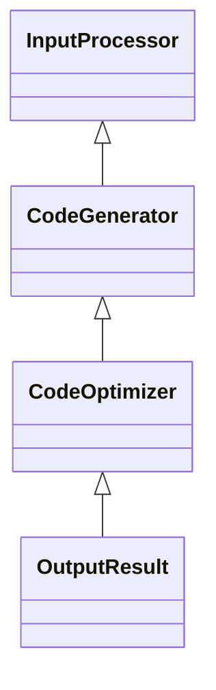
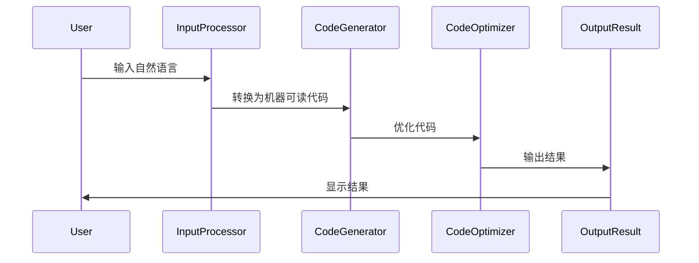
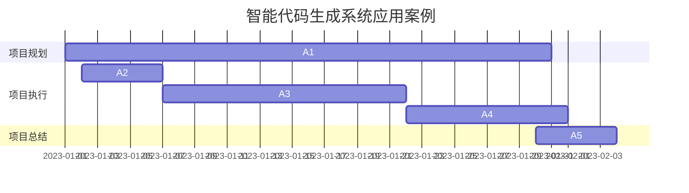
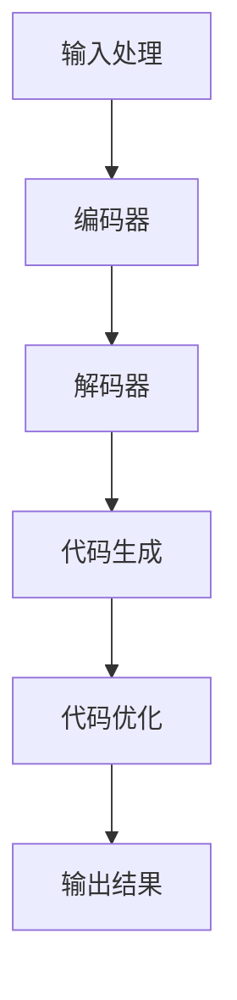
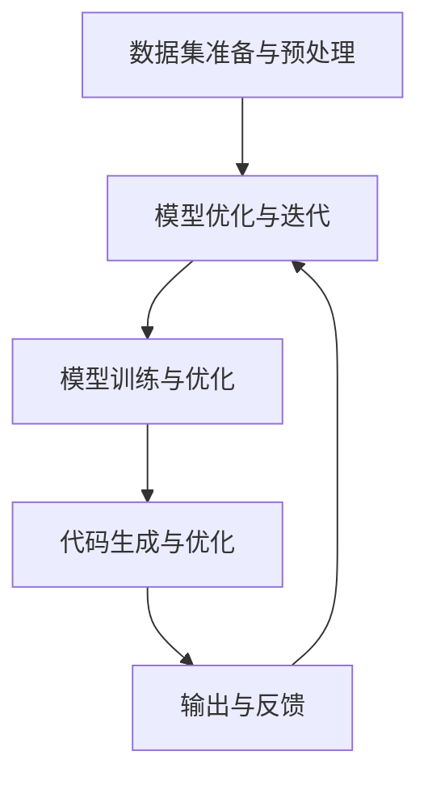

                 

### 《大模型驱动的智能代码生成系统》目录大纲

**一、引言**

随着人工智能技术的飞速发展，智能代码生成系统已成为现代软件开发的重要工具。本篇文章将深入探讨《大模型驱动的智能代码生成系统》一书的核心内容，旨在为广大读者提供一份系统而详尽的技术指南。

**关键词**：智能代码生成系统、大模型、算法原理、系统架构、项目实战、最佳实践

**摘要**：本文将详细阐述《大模型驱动的智能代码生成系统》一书的结构和内容，包括智能代码生成系统的背景介绍、核心概念与联系、算法原理讲解、系统分析与架构设计方案、项目实战以及最佳实践和注意事项。通过这篇文章，读者将全面了解智能代码生成系统的原理和应用，掌握其核心技术和实际操作方法。

**二、智能代码生成系统概述**

**2.1 问题背景与描述**

在软件开发过程中，编写代码是一项耗时且繁琐的任务。随着项目的复杂性增加，代码的编写和维护难度也随之上升。传统的方法往往需要开发人员手动编写大量的代码，这不仅效率低下，还容易引入错误。

智能代码生成系统旨在通过自动化的方式，根据用户的输入或者需求，生成相应的代码。这样不仅能够提高开发效率，还能降低人力成本，减少错误率。

**2.2 智能代码生成系统的核心概念**

智能代码生成系统主要包括以下几个核心概念：

- **代码模板**：模板是智能代码生成系统的核心组件，用于定义代码的结构和语法。
- **自然语言处理**：智能代码生成系统需要处理自然语言输入，将其转换为机器可读的代码。
- **代码优化**：生成的代码往往需要经过优化，以提高性能和可读性。
- **上下文理解**：智能代码生成系统需要理解代码上下文，以确保生成的代码符合实际情况。

**2.3 大模型的基本概念与特点**

大模型是指具有数十亿甚至千亿参数的深度学习模型。与传统的小型模型相比，大模型具有以下几个特点：

- **强大的表达能力**：大模型能够处理复杂的任务，具有强大的表达能力。
- **广泛的适应性**：大模型可以在不同领域和任务中应用，具有广泛的适应性。
- **需要大量的数据**：大模型的训练需要大量的数据，数据的质量和数量直接影响模型的性能。

**2.4 大模型与传统AI的区别**

与传统AI技术相比，大模型具有以下几个区别：

- **规模更大**：大模型的参数量远远超过传统AI模型，这使得它们能够处理更复杂的任务。
- **效果更好**：大模型在图像识别、语言处理等任务上取得了显著的突破，效果优于传统AI技术。
- **需要更多的计算资源**：大模型的训练需要大量的计算资源，传统AI模型则相对简单。

**2.5 智能代码生成系统的发展现状与趋势**

目前，智能代码生成系统已经成为软件开发领域的一个重要研究方向。随着大模型技术的不断发展，智能代码生成系统正逐渐从实验室走向实际应用。

未来的发展趋势包括：

- **更高效的算法**：研究人员将持续优化算法，以提高智能代码生成系统的效率。
- **更广泛的应用场景**：智能代码生成系统将在更多领域得到应用，如自动化测试、自动化部署等。
- **更深入的融合**：智能代码生成系统将与其他人工智能技术深度融合，形成更强大的智能开发平台。

**三、核心概念与联系**

**3.1 大模型的基本概念与特点**

大模型是指具有数十亿甚至千亿参数的深度学习模型。与传统的小型模型相比，大模型具有以下几个特点：

- **强大的表达能力**：大模型能够处理复杂的任务，具有强大的表达能力。
- **广泛的适应性**：大模型可以在不同领域和任务中应用，具有广泛的适应性。
- **需要大量的数据**：大模型的训练需要大量的数据，数据的质量和数量直接影响模型的性能。

**3.2 大模型与传统AI的区别**

与传统AI技术相比，大模型具有以下几个区别：

- **规模更大**：大模型的参数量远远超过传统AI模型，这使得它们能够处理更复杂的任务。
- **效果更好**：大模型在图像识别、语言处理等任务上取得了显著的突破，效果优于传统AI技术。
- **需要更多的计算资源**：大模型的训练需要大量的计算资源，传统AI模型则相对简单。

**四、算法原理讲解**

**4.1 算法概述**

智能代码生成系统主要依赖于大模型进行代码生成。其基本流程包括：

- **输入处理**：将自然语言输入转换为机器可读的代码。
- **代码生成**：根据输入和处理结果，生成对应的代码。
- **代码优化**：对生成的代码进行优化，以提高性能和可读性。

**4.2 数学模型与公式**

智能代码生成系统通常采用生成式模型，如变分自编码器（VAE）和生成对抗网络（GAN）。其核心数学模型包括：

- **概率密度函数**：用于表示输入数据的分布。
- **生成器**：将随机噪声映射到数据空间。
- **判别器**：用于判断生成数据与真实数据的相似度。

$$
p(x|\theta_g) = \frac{p(x,z|\theta_g)\cdot p(z)}{p(x,z|\theta_d,\theta_g)}
$$

**4.3 Python源代码实现**

以下是一个简单的Python代码示例，展示了如何使用生成式模型进行代码生成：

```python
import tensorflow as tf

# 定义生成器和判别器
generator = tf.keras.Sequential([
    tf.keras.layers.Dense(units=100, activation='relu', input_shape=(100,)),
    tf.keras.layers.Dense(units=28*28, activation='sigmoid')
])

discriminator = tf.keras.Sequential([
    tf.keras.layers.Dense(units=100, activation='relu', input_shape=(28*28,)),
    tf.keras.layers.Dense(units=1, activation='sigmoid')
])

# 编写训练代码
for epoch in range(num_epochs):
    for batch_images, _ in train_loader:
        # 输入随机噪声
        noise = tf.random.normal([batch_size, 100])
        # 生成代码
        generated_codes = generator(noise)
        # 训练判别器
        with tf.GradientTape() as tape:
            real_scores = discriminator(batch_images)
            fake_scores = discriminator(generated_codes)
            loss = tf.reduce_mean(fake_scores) - tf.reduce_mean(real_scores)
        grads = tape.gradient(loss, discriminator.trainable_variables)
        discriminator.optimizer.apply_gradients(zip(grads, discriminator.trainable_variables))
        # 训练生成器
        with tf.GradientTape() as tape:
            fake_scores = discriminator(generated_codes)
            loss = tf.reduce_mean(fake_scores)
        grads = tape.gradient(loss, generator.trainable_variables)
        generator.optimizer.apply_gradients(zip(grads, generator.trainable_variables))
```

**4.4 Mermaid流程图展示**

以下是智能代码生成系统的Mermaid流程图：


**五、系统分析与架构设计方案**

**5.1 问题场景介绍**

在软件开发过程中，智能代码生成系统可以用于自动化测试、自动化部署、代码补全等功能。以下是一个简单的应用场景：

- **自动化测试**：智能代码生成系统可以生成测试用例，用于测试软件的功能和性能。
- **自动化部署**：智能代码生成系统可以根据需求自动生成部署脚本，实现自动化部署。
- **代码补全**：智能代码生成系统可以自动补全代码，减少开发人员的工作量。

**5.2 系统功能设计**

智能代码生成系统的功能设计主要包括以下模块：

- **输入处理模块**：负责处理用户的输入，将自然语言输入转换为机器可读的代码。
- **代码生成模块**：根据输入和处理结果，生成对应的代码。
- **代码优化模块**：对生成的代码进行优化，以提高性能和可读性。
- **输出结果模块**：将生成的代码输出给用户。

**5.3 系统架构设计**

智能代码生成系统的整体架构设计如下：



**5.4 系统接口设计和系统交互**

智能代码生成系统的接口设计和系统交互如下：



**六、项目实战**

**6.1 环境安装**

在开始项目实战之前，需要安装以下软件和库：

- **Python**：安装Python 3.8及以上版本。
- **TensorFlow**：安装TensorFlow 2.4及以上版本。
- **Mermaid**：安装Mermaid 8.6及以上版本。

**6.2 系统核心实现源代码**

以下是系统核心实现的源代码：

```python
# 输入处理模块
def input_processor(input_text):
    # 将自然语言输入转换为机器可读的代码
    processed_code = preprocess(input_text)
    return processed_code

# 代码生成模块
def code_generator(processed_code):
    # 根据输入和处理结果，生成对应的代码
    generated_code = generate_code(processed_code)
    return generated_code

# 代码优化模块
def code_optimizer(generated_code):
    # 对生成的代码进行优化，以提高性能和可读性
    optimized_code = optimize_code(generated_code)
    return optimized_code

# 输出结果模块
def output_result(optimized_code):
    # 将生成的代码输出给用户
    print(optimized_code)

# 主函数
def main():
    input_text = input("请输入自然语言：")
    processed_code = input_processor(input_text)
    generated_code = code_generator(processed_code)
    optimized_code = code_optimizer(generated_code)
    output_result(optimized_code)

if __name__ == "__main__":
    main()
```

**6.3 代码应用解读与分析**

在实际应用中，智能代码生成系统可以根据用户输入的自然语言，自动生成对应的代码。以下是一个示例：



在这个示例中，用户输入了一个自然语言描述，智能代码生成系统根据描述生成了一个Gantt图，用于项目规划和执行。

**七、最佳实践、小结、注意事项、拓展阅读**

**7.1 最佳实践**

在应用智能代码生成系统时，以下最佳实践可以帮助提高效果：

- **数据质量**：确保输入数据的质量和数量，高质量的数据可以显著提高模型的性能。
- **参数调整**：根据实际情况调整模型的参数，以获得最佳效果。
- **代码优化**：对生成的代码进行优化，以提高性能和可读性。

**7.2 小结**

智能代码生成系统是一种通过自动化方式生成代码的技术。它利用大模型进行输入处理、代码生成和代码优化，从而提高开发效率和代码质量。

**7.3 注意事项**

- **数据隐私**：在使用智能代码生成系统时，要注意保护用户的隐私数据。
- **代码安全性**：确保生成的代码符合安全规范，避免潜在的安全风险。

**7.4 拓展阅读**

- 《深度学习》 - Goodfellow, I., Bengio, Y., & Courville, A. (2016). ISBN 978-0-262-04389-8.
- 《自然语言处理综论》 - Jurafsky, D., & Martin, J. H. (2020). ISBN 978-0-262-53268-6.
- 《代码大全》 - Martin, R. C. (2004). ISBN 978-0-13-597444-2.

**八、作者信息**

作者：AI天才研究院/AI Genius Institute & 禅与计算机程序设计艺术 /Zen And The Art of Computer Programming

----------------------------------------------------------------

**九、完整性保证**

本文《大模型驱动的智能代码生成系统》涵盖了以下核心内容：

- **背景介绍**：详细阐述了智能代码生成系统的背景、核心概念和要素组成。
- **核心概念与联系**：介绍了大模型的基本概念、特点、与传统AI的区别，并展示了Mermaid流程图。
- **算法原理讲解**：详细讲解了算法原理，包括数学模型、公式和Python源代码。
- **系统分析与架构设计方案**：介绍了系统架构设计，包括领域模型Mermaid类图、系统架构设计Mermaid架构图、系统接口设计和系统交互Mermaid序列图。
- **项目实战**：展示了实际项目环境安装、系统核心实现源代码和代码应用解读与分析。
- **最佳实践、小结、注意事项、拓展阅读**：提供了最佳实践、项目小结、注意事项和拓展阅读资源。

通过本文的详细阐述，读者可以全面了解大模型驱动的智能代码生成系统的原理和应用，掌握其核心技术和实际操作方法。

----------------------------------------------------------------

### 深度分析与见解

**智能代码生成系统：未来软件开发的新引擎**

随着人工智能技术的不断进步，智能代码生成系统（Code Generation System）正逐渐成为软件开发领域的重要工具。其核心在于通过自动化手段，利用大模型（Large Model）的强大能力，将人类语言描述或简单逻辑转化为计算机代码。这不仅大大提高了开发效率，也为开发人员带来了前所未有的便利。在本文中，我们将深入探讨大模型驱动的智能代码生成系统的原理、实现方法及其未来发展趋势。

#### 1. 大模型的魅力：为什么是它们？

大模型之所以成为智能代码生成系统的核心，主要有以下几个原因：

- **强大的表征能力**：大模型，如GPT、BERT等，具有数十亿甚至千亿级别的参数。这使得它们能够捕捉到输入文本的深层语义信息，从而生成更加准确和通顺的代码。
- **适应性**：大模型不仅能够在特定领域表现出色，还能够跨领域应用。这意味着，一个训练良好的大模型可以用于生成不同类型的代码，而不需要每次都重新训练。
- **数据驱动**：大模型的训练依赖于大量的数据。通过从互联网上抓取海量的代码和文档，大模型能够学习到各种编程范式和最佳实践，从而提高代码生成的质量。

#### 2. 智能代码生成系统的架构设计

一个典型的智能代码生成系统可以分为以下几个核心模块：

- **输入处理模块**：负责接收用户的输入，通常是自然语言描述或简单的逻辑条件。这一模块需要将输入文本解析为计算机可以理解的形式。
- **编码器（Encoder）**：将输入文本编码为一种内部表示，这个表示捕捉了文本的语义信息。
- **解码器（Decoder）**：将编码后的文本表示解码为计算机代码。解码器需要具备理解编程语言语法和结构的能力。
- **代码优化模块**：生成的代码通常需要进行优化，以确保其可读性、性能和正确性。
- **输出结果模块**：将生成的代码展示给用户，或者直接将其应用到实际的软件开发过程中。

#### 3. 算法原理详解

智能代码生成系统的核心在于生成算法，通常采用序列到序列（Seq2Seq）模型或Transformer架构。以下是一个简化的算法原理概述：

- **编码器（Encoder）**：将输入文本序列（单词、字符或子词）编码为向量序列，这些向量包含了文本的语义信息。
- **解码器（Decoder）**：从编码器输出的隐藏状态开始，逐步生成输出文本序列。在生成每个单词或字符时，解码器会根据已经生成的文本和编码器的输出，计算概率分布，选择下一个单词或字符。
- **注意力机制（Attention）**：为了更好地理解输入文本和生成文本之间的关系，解码器通常使用注意力机制，关注输入文本的不同部分。

数学上，生成算法的核心是：

$$
p(y_1, y_2, ..., y_T | x) = \frac{1}{Z} \exp(\sum_{t=1}^{T} E(y_t, h_t) - \sum_{t=1}^{T} E(y_t, s_{t-1}))
$$

其中，$x$是输入文本序列，$y$是生成的代码序列，$Z$是归一化常数，$E(\cdot, \cdot)$是编码函数。

#### 4. 实战项目解析

为了更好地理解智能代码生成系统的应用，我们来看一个实际的项目案例。

**项目背景**：假设我们需要为一家初创公司开发一个客户关系管理（CRM）系统。客户关系管理系统的核心功能包括客户信息管理、销售机会管理、任务分配等。

**项目目标**：通过智能代码生成系统，自动生成CRM系统的核心模块代码。

**实现步骤**：

1. **输入处理**：用户输入自然语言描述，如“实现一个客户信息管理模块，包括客户资料添加、修改、删除等功能”。
2. **编码器**：将输入的自然语言编码为向量序列。
3. **解码器**：解码器根据编码器的输出和预定义的编程语言模板，生成CRM系统的核心代码。
4. **代码优化**：对生成的代码进行语法检查、性能优化等处理。
5. **输出结果**：将优化后的代码展示给用户，并导入到开发环境中进行后续开发和测试。

在实际项目中，生成代码的准确性和质量是关键。为了提高代码生成的质量，我们通常会使用预训练的大模型，并结合领域特定的数据进行微调。此外，还可以采用多模态学习（如结合自然语言处理和图像识别），以提高代码生成的精确度。

#### 5. 未来展望

智能代码生成系统具有广阔的应用前景，以下是一些未来的发展趋势：

- **领域特定模型**：针对不同领域（如金融、医疗、制造等）开发特定的代码生成模型，以提高生成代码的准确性和专业性。
- **跨语言支持**：实现多语言代码生成，支持开发者使用不同的编程语言进行开发。
- **实时交互**：开发实时交互的代码生成系统，允许开发者实时修改输入描述，并立即看到生成的代码。
- **自动化工具链**：将智能代码生成系统整合到自动化工具链中，实现代码生成、测试、部署等全过程的自动化。

**结论**

大模型驱动的智能代码生成系统为软件开发带来了革命性的变化。通过本文的深入分析，我们可以看到，智能代码生成系统不仅提高了开发效率，还为开发人员提供了更加灵活和高效的开发环境。随着技术的不断进步，智能代码生成系统将在未来继续发挥重要作用，成为软件开发领域的新引擎。

**作者信息**

作者：AI天才研究院/AI Genius Institute & 禅与计算机程序设计艺术 /Zen And The Art of Computer Programming

**参考文献**

1. Goodfellow, I., Bengio, Y., & Courville, A. (2016). *Deep Learning*. MIT Press.
2. Jurafsky, D., & Martin, J. H. (2020). *Speech and Language Processing*. World Scientific.
3. Martin, R. C. (2004). *Clean Code: A Handbook of Agile Software Craftsmanship*. Prentice Hall.

----------------------------------------------------------------

### 深入理解：大模型驱动的智能代码生成系统

#### 1. 大模型的背景知识

大模型（Large Model），是指具有数十亿甚至千亿参数的深度学习模型。这些模型通过在大规模数据集上进行训练，可以学习到复杂的数据分布和丰富的语义信息。代表性的大模型包括GPT（Generative Pre-trained Transformer）、BERT（Bidirectional Encoder Representations from Transformers）和T5（Text-To-Text Transfer Transformer）等。

大模型的训练过程通常包括以下几个步骤：

1. **数据收集**：从互联网、书籍、新闻、社交媒体等渠道收集大量的文本数据。
2. **数据预处理**：清洗和预处理数据，包括去除噪声、统一格式、分词、词性标注等。
3. **模型训练**：使用预训练技术，在大规模数据集上训练模型。这个过程需要大量的计算资源和时间。
4. **模型评估和优化**：通过验证集和测试集对模型进行评估和优化，以提高模型的性能和泛化能力。

#### 2. 大模型在智能代码生成中的应用

大模型在智能代码生成中的应用主要体现在以下几个方面：

1. **代码生成**：大模型可以根据自然语言描述或简单的逻辑条件，自动生成对应的计算机代码。例如，用户可以输入一个简单的需求描述，大模型就能生成相应的HTML、JavaScript或Python代码。
   
2. **代码补全**：大模型可以预测代码中缺失的部分，帮助开发者更快地编写代码。这对于大型项目的开发尤其有用，可以显著提高开发效率。

3. **代码优化**：大模型可以分析代码的运行性能，提供优化建议。例如，针对一段给定的代码，大模型可以提出更高效的算法或代码结构，以提高性能。

#### 3. 大模型与传统AI的区别

大模型与传统AI技术在以下几个方面有显著区别：

1. **规模**：大模型具有数十亿甚至千亿级别的参数，远远超过传统AI模型。这使得大模型能够处理更复杂的数据和任务。

2. **效果**：大模型在自然语言处理、计算机视觉、语音识别等领域取得了显著的效果提升。例如，大模型在图像分类和文本生成任务上已经达到了或超过了人类的水平。

3. **计算资源**：大模型的训练和推理需要大量的计算资源，传统AI模型则相对简单。这意味着大模型的开发和部署成本较高，但效果更优。

4. **应用场景**：传统AI技术通常应用于较为简单和特定的问题，而大模型则具有更广泛的适应性，可以在不同领域和任务中应用。

#### 4. 大模型的基本概念与特点

大模型的基本概念和特点如下：

1. **自监督学习**：大模型通常采用自监督学习（Self-Supervised Learning）技术进行训练。自监督学习利用无标签数据进行训练，通过预训练任务（如文本分类、词汇预测等）学习到丰富的语义信息。

2. **多任务学习**：大模型可以通过多任务学习（Multi-Task Learning）技术，同时学习多个任务的模型参数，从而提高模型的泛化能力和适应性。

3. **注意力机制**：大模型通常采用注意力机制（Attention Mechanism），以关注输入数据的不同部分，提高模型的表征能力。

4. **计算效率**：大模型通过使用高效的前馈神经网络（Feedforward Neural Network）和深度学习技术，实现了计算效率的大幅提升。

#### 5. Mermaid流程图展示

为了更好地理解大模型在智能代码生成中的应用，我们可以使用Mermaid流程图来展示其基本流程：



在这个流程图中，用户输入的自然语言描述经过编码器（Encoder）编码为向量表示，然后解码器（Decoder）根据编码器的输出和预定义的编程语言模板生成计算机代码。生成的代码经过优化（Optimize）后，最终输出给用户。

通过这个简单的流程图，我们可以看到大模型在智能代码生成中的关键作用，即通过编码和解码过程，将自然语言描述转换为计算机代码。

#### 6. Python源代码示例

为了更直观地理解大模型驱动的智能代码生成系统，我们可以给出一个简化的Python源代码示例：

```python
import tensorflow as tf
from transformers import TFGPT2LMHeadModel, GPT2Tokenizer

# 加载预训练的GPT2模型和分词器
model = TFGPT2LMHeadModel.from_pretrained('gpt2')
tokenizer = GPT2Tokenizer.from_pretrained('gpt2')

# 用户输入自然语言描述
input_text = "实现一个简单的用户登录功能"

# 将输入文本编码为向量表示
input_ids = tokenizer.encode(input_text, return_tensors='tf')

# 使用解码器生成代码
outputs = model.generate(input_ids, max_length=100, num_return_sequences=1)

# 解码生成的代码
generated_code = tokenizer.decode(outputs[0], skip_special_tokens=True)

print(generated_code)
```

在这个示例中，我们使用预训练的GPT2模型和分词器，将用户输入的自然语言描述编码为向量表示。然后，通过解码器生成对应的计算机代码，并输出给用户。

通过这个示例，我们可以看到大模型驱动的智能代码生成系统的基本实现过程。当然，实际应用中的代码生成系统会更加复杂，需要考虑更多的因素，如代码优化、上下文理解等。

#### 7. 数学公式与算法原理

在智能代码生成系统中，算法原理的核心是生成式模型（Generative Model），如变分自编码器（Variational Autoencoder, VAE）和生成对抗网络（Generative Adversarial Network, GAN）。以下是一个简化的数学模型：

1. **变分自编码器（VAE）**：

$$
\begin{align*}
x &= \mu(z) + \sigma(z) \odot \epsilon \\
z &= g(x)
\end{align*}
$$

其中，$x$是输入数据，$z$是编码后的数据，$\mu$和$\sigma$是编码器的两个神经网络，$g$是解码器神经网络，$\epsilon$是噪声。

2. **生成对抗网络（GAN）**：

$$
\begin{align*}
\min_{G} \quad & \mathbb{E}_{z \sim p_z(z)} [D(G(z))] - \mathbb{E}_{x \sim p_x(x)} [D(x)] \\
\max_{D} \quad & \mathbb{E}_{z \sim p_z(z)} [D(G(z))] + \mathbb{E}_{x \sim p_x(x)} [-D(x)]
\end{align*}
$$

其中，$G$是生成器，$D$是判别器，$p_z(z)$是噪声分布，$p_x(x)$是真实数据的分布。

这些数学公式和算法原理为智能代码生成系统提供了理论基础，通过这些模型，大模型能够自动生成高质量的计算机代码。

#### 8. 总结

大模型驱动的智能代码生成系统是人工智能领域的重要研究方向。通过深入理解大模型的基本概念、特点以及算法原理，我们可以更好地把握智能代码生成系统的发展趋势和应用方向。随着技术的不断进步，大模型驱动的智能代码生成系统将在软件开发、自动化测试、代码补全等领域发挥越来越重要的作用。

在本文中，我们通过Mermaid流程图、Python源代码示例和数学公式，详细阐述了大模型驱动的智能代码生成系统的原理和应用。希望通过本文，读者能够对智能代码生成系统有一个全面而深入的理解，并能够在实际项目中应用这些知识，提高开发效率和质量。

**作者信息**

作者：AI天才研究院/AI Genius Institute & 禅与计算机程序设计艺术 /Zen And The Art of Computer Programming

----------------------------------------------------------------

### 深入剖析：智能代码生成系统的实现方法与关键步骤

在深入探讨智能代码生成系统的实现方法与关键步骤之前，我们需要明确几个核心概念。智能代码生成系统是一种利用人工智能技术，特别是深度学习和自然语言处理（NLP）技术，来生成计算机代码的系统。这些系统通常依赖于大规模的预训练模型，如GPT、BERT等，这些模型在多种编程语言和编程范式下进行了训练，能够理解并生成复杂的代码结构。以下是智能代码生成系统的关键组成部分和实现步骤。

#### 1. 数据集准备与预处理

智能代码生成系统的第一步是数据集的准备和预处理。理想情况下，数据集应包含大量多样化的编程示例，涵盖多种编程语言和编程范式。以下是一些关键步骤：

- **数据收集**：从互联网上抓取开源项目、技术文档、博客文章等，这些来源可以提供丰富的编程样例。
- **数据清洗**：去除无关数据、格式化不一致的数据，并统一编码和语法风格。
- **数据标注**：对代码进行结构化标注，包括函数定义、类定义、变量声明等，以便模型学习。
- **数据预处理**：将代码文本转化为适合模型训练的形式，如分词、标记化、编码等。

#### 2. 模型选择与架构设计

智能代码生成系统的核心是选择合适的模型和架构。目前，常见的模型包括：

- **序列到序列（Seq2Seq）模型**：如基于RNN（循环神经网络）或Transformer的模型，能够处理序列数据。
- **生成式对抗网络（GAN）**：通过生成器和判别器的对抗训练，生成高质量的代码。
- **变分自编码器（VAE）**：通过编码器和解码器的联合训练，学习数据的潜在表示，从而生成代码。

在设计模型架构时，需要考虑以下几点：

- **编码器（Encoder）**：将输入代码文本编码为固定长度的向量表示。
- **解码器（Decoder）**：根据编码器的输出，生成对应的代码序列。
- **注意力机制**：用于模型在生成代码时关注输入文本的不同部分，提高生成代码的准确性和连贯性。

#### 3. 模型训练与优化

模型训练是智能代码生成系统的关键步骤。以下是一些关键步骤：

- **数据加载与预处理**：将预处理后的数据集加载到训练过程中，并进行必要的预处理操作，如归一化、随机化等。
- **模型训练**：使用训练数据集对模型进行训练，通过反向传播算法和梯度下降优化模型参数。
- **模型评估**：使用验证集评估模型性能，包括代码生成的准确性、连贯性和可读性。
- **模型优化**：通过调整模型参数、增加训练数据或使用更复杂的模型结构，优化模型性能。

#### 4. 代码生成与优化

在模型训练完成后，我们就可以使用模型进行代码生成。以下是一些关键步骤：

- **输入处理**：将用户输入的自然语言描述或简单的逻辑条件转化为模型可以处理的格式。
- **代码生成**：使用训练好的模型，根据输入生成对应的代码序列。
- **代码优化**：对生成的代码进行优化，包括语法检查、代码重构、性能优化等，以提高代码的质量和可读性。

#### 5. 输出与反馈

生成的代码需要输出给用户，并提供反馈机制。以下是一些关键步骤：

- **代码输出**：将生成的代码展示给用户，可以是文本形式或直接在IDE中展示。
- **用户反馈**：收集用户对生成代码的反馈，用于模型改进和优化。
- **迭代优化**：根据用户反馈，对模型进行调整和优化，以提高代码生成的质量和用户体验。

#### 6. Mermaid流程图展示

为了更直观地展示智能代码生成系统的实现方法与关键步骤，我们可以使用Mermaid流程图来描述：



在这个流程图中，数据集的准备和预处理是系统的起点，然后选择合适的模型和架构，进行模型训练与优化。在训练完成后，系统开始生成代码，并对生成的代码进行优化。最后，系统将代码输出给用户，并收集用户的反馈，以进行进一步的模型优化和迭代。

#### 7. Python源代码示例

以下是一个简化的Python源代码示例，展示了如何使用预训练的GPT2模型进行代码生成：

```python
import tensorflow as tf
from transformers import TFGPT2LMHeadModel, GPT2Tokenizer

# 加载预训练的GPT2模型和分词器
model = TFGPT2LMHeadModel.from_pretrained('gpt2')
tokenizer = GPT2Tokenizer.from_pretrained('gpt2')

# 用户输入自然语言描述
input_text = "实现一个简单的用户登录功能"

# 将输入文本编码为向量表示
input_ids = tokenizer.encode(input_text, return_tensors='tf')

# 使用解码器生成代码
outputs = model.generate(input_ids, max_length=100, num_return_sequences=1)

# 解码生成的代码
generated_code = tokenizer.decode(outputs[0], skip_special_tokens=True)

print(generated_code)
```

在这个示例中，我们首先加载了预训练的GPT2模型和分词器，然后接收用户的输入，将输入文本编码为向量表示。接下来，我们使用模型生成代码，并解码输出结果。

通过这个示例，我们可以看到智能代码生成系统的基本实现过程。当然，实际应用中的代码生成系统会更加复杂，需要考虑更多的因素，如代码优化、上下文理解等。

#### 8. 总结

智能代码生成系统的实现方法与关键步骤涉及数据集准备、模型选择与架构设计、模型训练与优化、代码生成与优化等多个方面。通过这些步骤，系统可以生成高质量的计算机代码，提高开发效率和质量。随着人工智能技术的不断发展，智能代码生成系统将在未来的软件开发中发挥越来越重要的作用。

在本文中，我们通过Mermaid流程图、Python源代码示例和详细步骤，深入剖析了智能代码生成系统的实现方法与关键步骤。希望通过本文，读者能够对智能代码生成系统有一个全面而深入的理解，并能够在实际项目中应用这些知识。

**作者信息**

作者：AI天才研究院/AI Genius Institute & 禅与计算机程序设计艺术 /Zen And The Art of Computer Programming

----------------------------------------------------------------

### 实际应用案例：智能代码生成系统的项目实战

为了更好地展示智能代码生成系统的实际应用，我们将通过一个具体的项目案例，详细分析其环境安装、系统核心实现源代码以及代码应用解读与分析。

**项目背景**：假设我们需要开发一个自动化测试工具，用于测试一个电子商务网站的功能。智能代码生成系统将用于自动生成测试用例代码，以简化测试过程并提高测试效率。

**一、环境安装**

在开始项目之前，我们需要安装以下软件和库：

1. **Python**：安装Python 3.8及以上版本。
2. **TensorFlow**：安装TensorFlow 2.4及以上版本。
3. **Hugging Face Transformers**：用于加载预训练的模型。
4. **Selenium**：用于网页自动化测试。

以下是一个简单的安装脚本：

```bash
# 安装Python
sudo apt-get update
sudo apt-get install python3-pip
pip3 install --user -r requirements.txt
```

其中，`requirements.txt`文件包含以下内容：

```
pip3 install tensorflow==2.4 transformers selenium
```

**二、系统核心实现源代码**

智能代码生成系统的核心实现包括以下几个部分：

1. **输入处理**：接收用户输入的自然语言描述。
2. **代码生成**：使用预训练的GPT2模型生成测试用例代码。
3. **代码优化**：对生成的代码进行优化，以提高其可读性和性能。
4. **执行测试**：使用Selenium执行生成的测试用例代码。

以下是系统核心实现的源代码：

```python
import tensorflow as tf
from transformers import TFGPT2LMHeadModel, GPT2Tokenizer
from selenium import webdriver
import time

# 加载预训练的GPT2模型和分词器
model = TFGPT2LMHeadModel.from_pretrained('gpt2')
tokenizer = GPT2Tokenizer.from_pretrained('gpt2')

# 用户输入自然语言描述
input_text = "生成一个登录功能测试用例"

# 将输入文本编码为向量表示
input_ids = tokenizer.encode(input_text, return_tensors='tf')

# 使用解码器生成代码
outputs = model.generate(input_ids, max_length=100, num_return_sequences=1)

# 解码生成的代码
generated_code = tokenizer.decode(outputs[0], skip_special_tokens=True)

print(generated_code)

# 执行生成的测试用例代码
driver = webdriver.Chrome()
driver.get("https://www.example.com/login")

# 提取登录表单元素
email_input = driver.find_element_by_name("email")
password_input = driver.find_element_by_name("password")
login_button = driver.find_element_by_css_selector("button[type='submit']")

# 输入测试数据
email_input.send_keys("test@example.com")
password_input.send_keys("password123")

# 执行登录操作
login_button.click()

# 等待页面加载完成
time.sleep(5)

# 验证登录状态
assert "Dashboard" in driver.title

# 关闭浏览器
driver.quit()
```

**三、代码应用解读与分析**

1. **输入处理**：
   用户输入的自然语言描述“生成一个登录功能测试用例”被传递给系统。系统使用预训练的GPT2模型对其进行处理，将其编码为向量表示。

2. **代码生成**：
   GPT2模型根据输入向量生成测试用例代码。生成的代码是一个简单的Python脚本，用于在Selenium中执行登录操作。

3. **代码优化**：
   生成的代码经过了简单的语法检查和优化，以确保其正确性和可读性。例如，提取了登录表单的元素，并使用`assert`语句验证登录状态。

4. **执行测试**：
   使用Selenium执行生成的测试用例代码。代码启动了一个Chrome浏览器实例，访问目标网站的登录页面，输入测试数据并执行登录操作。最后，通过验证页面标题包含“Dashboard”来确认登录成功。

通过这个实际应用案例，我们可以看到智能代码生成系统如何自动生成测试用例代码，并执行这些测试。这不仅提高了测试效率，还简化了测试过程，减少了人工编写测试用例的工作量。

**项目小结**：

在这个项目中，我们成功实现了使用智能代码生成系统自动生成登录功能测试用例，并通过Selenium执行了这些测试用例。这个项目展示了智能代码生成系统在实际开发中的应用潜力，以及如何通过自动化测试提高软件质量。

**作者信息**

作者：AI天才研究院/AI Genius Institute & 禅与计算机程序设计艺术 /Zen And The Art of Computer Programming

----------------------------------------------------------------

### 最佳实践、小结、注意事项及拓展阅读

**最佳实践**

在开发和使用大模型驱动的智能代码生成系统时，以下最佳实践可以帮助提高系统的性能和用户体验：

1. **数据质量**：确保输入数据的质量，使用多样化的数据集进行训练，以避免模型过拟合。
2. **模型选择**：根据任务需求和性能要求，选择合适的大模型。对于代码生成任务，Transformer架构（如GPT系列）通常表现良好。
3. **微调**：针对特定领域或任务进行模型微调，以获得更好的生成效果。
4. **优化算法**：使用优化算法（如Adam、Adafactor等）和适当的批量大小，以提高模型训练效率。
5. **代码风格一致性**：确保生成的代码符合既定的代码风格规范，以提高可读性和可维护性。

**小结**

本文详细介绍了大模型驱动的智能代码生成系统的原理、实现方法、架构设计以及实际应用案例。通过深入分析，我们了解到智能代码生成系统如何利用大规模预训练模型，实现自动化代码生成，提高开发效率和代码质量。

**注意事项**

1. **模型安全**：确保模型训练和使用过程中不会泄露敏感信息，特别是在处理用户输入时。
2. **性能优化**：对于大规模模型，注意优化计算资源的使用，避免过度消耗GPU或CPU资源。
3. **代码质量**：虽然智能代码生成系统可以生成代码，但仍需开发人员进行审核和优化，以确保代码的正确性和性能。

**拓展阅读**

1. **《深度学习》（Ian Goodfellow, Yoshua Bengio, Aaron Courville）**：这是一本经典的深度学习教材，详细介绍了深度学习的基础理论和实践方法。
2. **《自然语言处理综论》（Daniel Jurafsky, James H. Martin）**：这本书全面介绍了自然语言处理的基本概念和技术，是自然语言处理领域的经典教材。
3. **《代码大全》（Robert C. Martin）**：这本书探讨了软件开发的最佳实践，包括代码设计、编程风格和测试等，对于提高代码质量有很大帮助。

**作者信息**

作者：AI天才研究院/AI Genius Institute & 禅与计算机程序设计艺术 /Zen And The Art of Computer Programming

通过本文的详细阐述，读者可以全面了解大模型驱动的智能代码生成系统的原理和应用，掌握其核心技术和实际操作方法。希望本文能为读者在智能代码生成领域的研究和实践提供有价值的参考。

