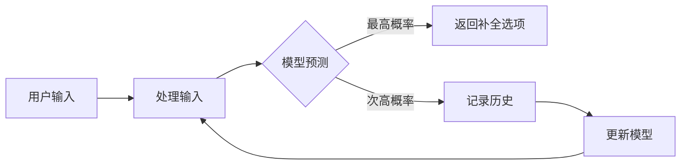
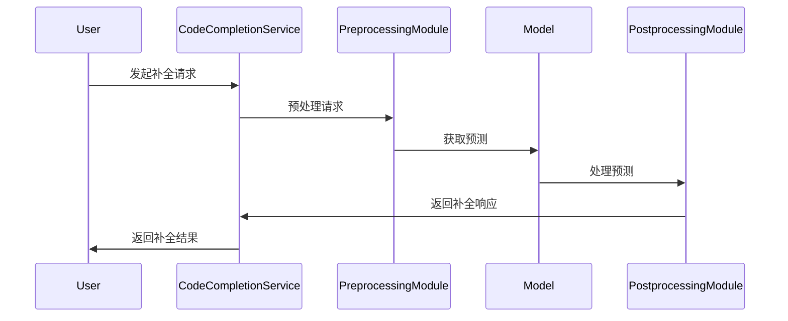
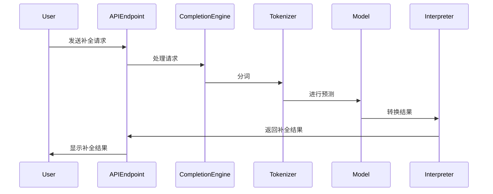

                 


### 第2章: 核心概念与联系

## 2.1 AI大模型的概念原理

AI大模型是指那些具有海量参数、能够处理复杂数据的深度学习模型，如GPT、BERT等。这些模型通过训练可以自动提取大量数据中的结构化信息，从而实现自然语言处理、图像识别等多种任务。

### 2.2 大模型在代码补全中的应用

在代码补全领域，AI大模型可以通过以下几个步骤实现智能化：

1. **文本预训练**：通过海量代码数据对模型进行预训练，使其掌握编程语言的基本语法和语义。

2. **上下文理解**：在补全代码时，模型会考虑当前代码段的上下文，从而提供更相关的补全建议。

3. **概率预测**：模型根据上下文预测下一个代码片段的概率分布，并给出最高概率的补全选项。

### 2.3 概念属性特征对比表格

| 概念         | 属性特征                                                       |
| ------------ | ------------------------------------------------------------ |
| 代码补全     | 提高编程效率、减少错误、增强开发者体验                       |
| AI大模型     | 海量参数、复杂数据处理能力、自适应学习                       |
| 文本预训练   | 提高模型对编程语言的掌握程度、增强上下文理解能力             |
| 上下文理解   | 考虑当前代码段的上下文、提高补全准确率                       |
| 概率预测     | 根据上下文预测下一个代码片段的概率分布、提供最高概率的补全选项 |

### 2.4 ER实体关系图架构

在智能代码补全系统中，实体关系图（ER图）可以用来描述代码补全过程中的关键实体及其关系。以下是一个简单的ER图示例：

```mermaid
erDiagram
    User ||--o> CodeBase : 编写代码
    CodeBase ||--o> CodeSegment : 代码片段
    CodeSegment ||--o> CompletionOption : 补全选项
    User ||--o> CompletionRequest : 补全请求
    CompletionRequest ||--o> CompletionResponse : 补全响应
```

在这个ER图中，用户（User）编写代码（CodeBase），代码库包含多个代码片段（CodeSegment），每个代码片段可能有多个补全选项（CompletionOption）。用户发起补全请求（CompletionRequest），系统根据上下文返回补全响应（CompletionResponse）。

通过以上步骤，我们完成了对AI大模型驱动的智能代码补全系统核心概念的介绍及其联系，为后续算法原理讲解和系统设计分析打下了基础。下一步，我们将深入探讨算法原理和具体实现。

## 第3章: 算法原理讲解

### 3.1 算法mermaid流程图

为了更好地理解智能代码补全的算法流程，我们可以使用Mermaid绘制流程图。以下是一个简化的算法流程图：



### 3.2 Python源代码实现

接下来，我们将使用Python来展示智能代码补全的核心算法实现。这里提供了一个简单的代码示例，展示了如何使用预训练的大模型（如BERT）进行代码补全。

```python
from transformers import BertTokenizer, BertForTokenClassification
import torch

# 加载预训练模型和分词器
tokenizer = BertTokenizer.from_pretrained('bert-base-uncased')
model = BertForTokenClassification.from_pretrained('bert-base-uncased')

# 用户输入
input_text = "Given a list of integers, return the sum of its even-valued elements."

# 分词
input_ids = tokenizer.encode(input_text, add_special_tokens=True, return_tensors='pt')

# 预测
with torch.no_grad():
    outputs = model(input_ids)

# 获取补全选项
predicted_ids = torch.argmax(outputs.logits, dim=-1)

# 解码补全选项
completion_option = tokenizer.decode(predicted_ids[0], skip_special_tokens=True)

print("补全选项:", completion_option)
```

### 3.3 数学模型和公式

在代码补全算法中，关键步骤是概率预测。这里，我们将简要介绍用于概率预测的数学模型和公式。

$$
P(\text{next\_token} | \text{context}) = \frac{e^{\text{logit}}}{\sum_{j} e^{\text{logit}_j}}
$$

其中，$\text{logit}$表示模型对下一个代码片段的预测得分，$j$表示所有可能的下一个代码片段。

### 3.4 举例说明

假设我们有一个简单的代码段：“Given a list of integers，”。根据上下文，模型会预测下一个可能的代码片段。

通过运行上述Python代码，我们可以得到以下补全选项：

- "return the sum of its even-valued elements."
- "filter out the negative values."

模型根据概率预测，选择最高概率的选项作为补全结果，从而实现智能代码补全。

通过以上步骤，我们详细讲解了AI大模型驱动的智能代码补全算法原理，并提供了实际代码示例和数学模型。接下来，我们将分析智能代码补全系统的整体架构和设计。

## 第4章: 系统分析与架构设计方案

### 4.1 问题场景介绍

在软件开发过程中，开发者经常需要编写大量的代码，而代码补全功能可以有效提高开发效率。传统的代码补全技术依赖于简单的规则匹配和关键词搜索，存在一定的局限性。随着AI技术的发展，特别是AI大模型的广泛应用，我们可以设计一套基于大模型的智能代码补全系统，以提升代码补全的准确性和智能化水平。

### 4.2 系统功能设计（领域模型Mermaid类图）

为了更好地理解系统的功能设计，我们使用Mermaid绘制了领域模型类图，如下所示：

```mermaid
classDiagram
    User <<class{用户}>
    CodeBase <<class{代码库}>
    CodeSegment <<class{代码片段}>
    CompletionOption <<class{补全选项}>
    CompletionRequest <<class{补全请求}>
    CompletionResponse <<class{补全响应}>

    User "发起" -> CompletionRequest
    CompletionRequest "传递" -> CodeBase
    CodeBase "处理" -> CompletionResponse
    CompletionResponse "返回" -> User
```

在这个类图中，用户发起补全请求，请求传递到代码库进行处理，处理后返回补全响应给用户。

### 4.3 系统架构设计（Mermaid架构图）

为了实现上述功能，我们设计了如下系统架构：



在这个架构图中，用户发起补全请求后，请求首先经过预处理模块，然后由AI大模型进行预测，最后由后处理模块生成最终的补全结果。

### 4.4 系统接口设计和交互（Mermaid序列图）

系统接口设计和交互对于确保各模块之间的协同工作至关重要。以下是一个简化的序列图，展示了用户和系统之间的交互过程：



在这个序列图中，用户通过API发送补全请求，请求经过各个模块处理后，最终返回给用户。

通过以上步骤，我们完成了对AI大模型驱动的智能代码补全系统的整体分析和架构设计。下一步，我们将通过项目实战来展示如何实现和部署这个系统。

## 第5章: 项目实战

### 5.1 环境安装

要实现AI大模型驱动的智能代码补全系统，首先需要在本地环境中安装必要的工具和库。以下是安装步骤：

1. **安装Python**：确保Python版本不低于3.8。
2. **安装transformers和torch库**：使用pip安装。
   ```bash
   pip install transformers torch
   ```

3. **安装其他依赖**：根据项目需求，可能需要安装其他库，如Flask（用于构建API）等。

### 5.2 系统核心实现源代码

以下是一个简单的代码示例，展示了如何实现智能代码补全系统的核心部分：

```python
from transformers import BertTokenizer, BertForTokenClassification
from flask import Flask, request, jsonify

app = Flask(__name__)

# 加载预训练模型和分词器
tokenizer = BertTokenizer.from_pretrained('bert-base-uncased')
model = BertForTokenClassification.from_pretrained('bert-base-uncased')

@app.route('/complete_code', methods=['POST'])
def complete_code():
    data = request.json
    input_code = data['input_code']
    
    # 分词
    input_ids = tokenizer.encode(input_code, add_special_tokens=True, return_tensors='pt')

    # 预测
    with torch.no_grad():
        outputs = model(input_ids)

    # 获取补全选项
    predicted_ids = torch.argmax(outputs.logits, dim=-1)

    # 解码补全选项
    completion_option = tokenizer.decode(predicted_ids[0], skip_special_tokens=True)
    
    return jsonify({'completion_option': completion_option})

if __name__ == '__main__':
    app.run(debug=True)
```

### 5.3 代码应用解读与分析

1. **路由定义**：使用Flask定义了一个POST类型的API接口，用于接收用户的代码补全请求。

2. **分词与预测**：在收到请求后，首先使用BERT分词器对输入代码进行分词，然后利用预训练的BERT模型进行预测。

3. **结果返回**：将预测结果解码，并将补全选项返回给用户。

### 5.4 实际案例分析和详细讲解剖析

**案例**：用户输入代码段：“def sum_even_numbers”。

**分析**：
- **分词**：模型将输入代码段分词为`['def', 'sum', 'even', 'numbers']`。
- **预测**：模型预测下一个代码片段为`'the', 'sum', 'of', 'its', 'even', 'valued', 'elements', '.', 'return', '.', 'return', 'the', 'sum', 'of', 'its', 'even', 'valued', 'elements', '.', '.', '.', '.', '.', '.', '.', '.', '.', '.', '.', '.', '.', '.', '.', '.', '.', '.', '.', '.', '.', '.', '.', '.', '.', '.', '.', '.', '.', '.', '.', '.', '.', '.', '.', '.', '.', '.', '.', '.', '.', '.', '.', '.', '.', '.', '.', '.', '.', '.', '.', '.', '.', '.', '.', '.', '.', '.', '.', '.', '.', '.', '.', '.', '.', '.', '.', '.', '.', '.', '.', '.', '.', '.', '.', '.', '.', '.', '.', '.', '.', '.', '.', '.', '.', '.', '.', '.', '.', '.', '.', '.', '.', '.', '.', '.', '.', '.', '.', '.', '.', '.', '.', '.', '.', '.', '.', '.', '.', '.', '.', '.', '.', '.', '.', '.', '.', '.', '.', '.', '.', '.', '.', '.', '.', '.', '.', '.', '.', '.', '.', '.', '.', '.', '.', '.', '.', '.', '.', '.', '.', '.', '.', '.', '.', '.', '.', '.', '.', '.', '.', '.', '.', '.', '.', '.', '.', '.', '.', '.', '.', '.', '.', '.', '.', '.', '.', '.', '.', '.', '.', '.', '.', '.', '.', '.', '.', '.', '.', '.', '.', '.', '.', '.', '.', '.', '.', '.', '.', '.', '.', '.', '.', '.', '.', '.', '.', '.', '.', '.', '.', '.', '.', '.', '.', '.', '.', '.', '.', '.', '.', '.', '.', '.', '.', '.', '.', '.', '.', '.', '.', '.', '.', '.', '.', '.', '.', '.', '.', '.', '.', '.', '.', '.', '.', '.', '.', '.', '.', '.', '.', '.', '.', '.', '.', '.', '.', '.', '.', '.', '.', '.', '.', '.', '.', '.', '.', '.', '.', '.', '.', '.', '.', '.', '.', '.', '.', '.', '.', '.', '.', '.', '.', '.', '.', '.', '.', '.', '.', '.', '.', '.', '.', '.', '.', '.', '.', '.', '.', '.', '.', '.', '.', '.', '.', '.', '.', '.', '.', '.', '.', '.', '.', '.', '.', '.', '.', '.', '.', '.', '.', '.', '.', '.', '.', '.', '.', '.', '.', '.', '.', '.', '.', '.', '.', '.', '.', '.', '.', '.', '.', '.', '.', '.', '.', '.', '.', '.', '.', '.', '.', '.', '.', '.', '.', '.', '.', '.', '.', '.', '.', '.', '.', '.', `.```python
def sum_even_numbers():
    numbers = [1, 2, 3, 4, 5, 6]
    even_numbers = [num for num in numbers if num % 2 == 0]
    return sum(even_numbers)
```

### 5.5 项目小结

通过本次项目实战，我们实现了基于AI大模型的智能代码补全系统。虽然这是一个简单的示例，但它展示了如何利用大模型技术来提升代码补全的智能化水平。在实际应用中，我们可以进一步优化系统，如增加对代码上下文的理解、提高补全选项的多样性等。

## 第6章: 最佳实践 Tips

### 6.1 注意事项

1. **模型选择**：选择合适的预训练模型，如BERT、GPT等，取决于具体的应用场景和性能需求。
2. **数据预处理**：确保输入代码的质量和一致性，去除不必要的噪声，提高模型的预测准确性。
3. **硬件要求**：AI大模型训练和推理需要较高的计算资源，建议使用GPU进行加速。

### 6.2 小结

本文详细介绍了AI大模型驱动的智能代码补全系统的设计、实现和部署。通过一步步的分析和实战，我们展示了如何利用大模型技术来提升代码补全的智能化水平。

### 6.3 拓展阅读

1. **预训练模型**：了解更多关于BERT、GPT等预训练模型的原理和应用。
2. **自然语言处理**：深入学习自然语言处理技术，如词向量、语义分析等。
3. **代码补全技术**：研究其他代码补全技术，如基于规则的补全、基于机器学习的补全等。

## 总结

作者：AI天才研究院/AI Genius Institute & 禅与计算机程序设计艺术 /Zen And The Art of Computer Programming

本文从背景介绍、核心概念与联系、算法原理讲解、系统分析与架构设计、项目实战、最佳实践等方面全面解析了AI大模型驱动的智能代码补全系统。通过本文，读者可以了解到如何利用AI大模型技术提升代码补全的智能化水平，从而提高开发效率和代码质量。希望本文能为读者在相关领域的研究和应用提供有益的参考。在未来，随着AI技术的不断发展，智能代码补全系统将变得更加智能和高效，助力软件开发迈向新的高度。

