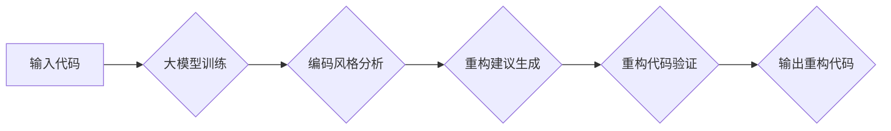
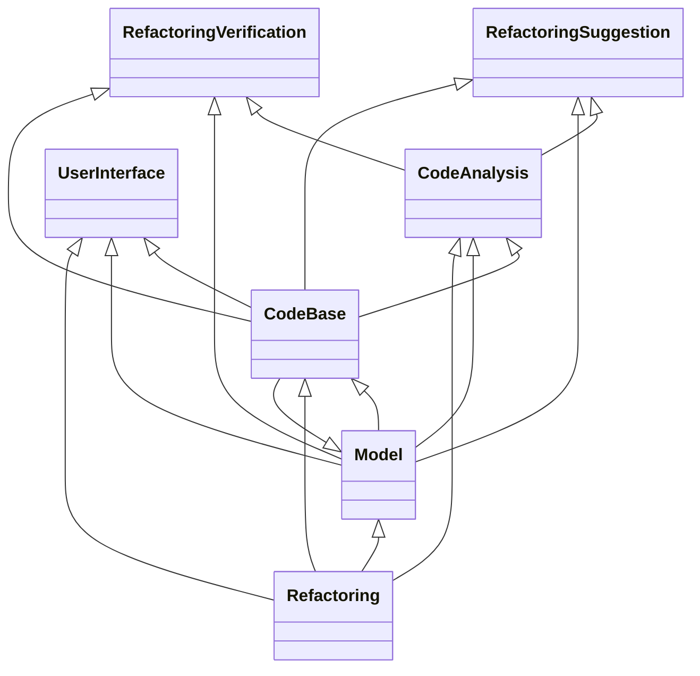
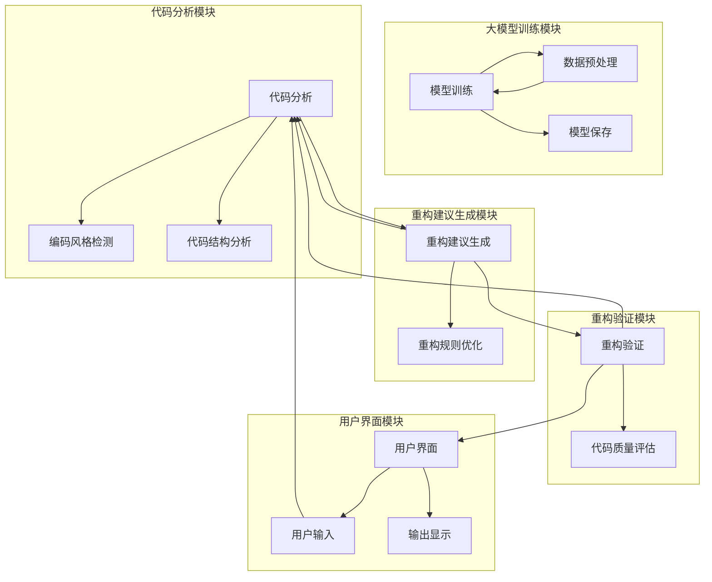
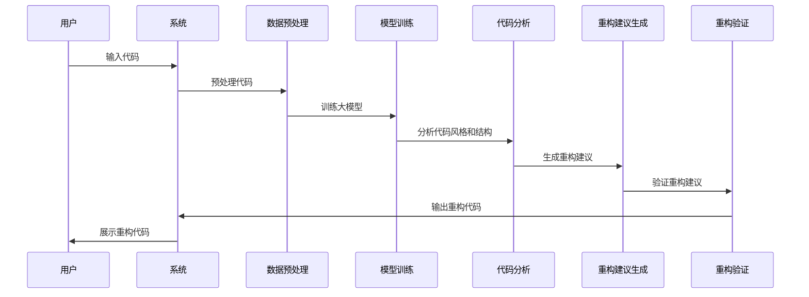
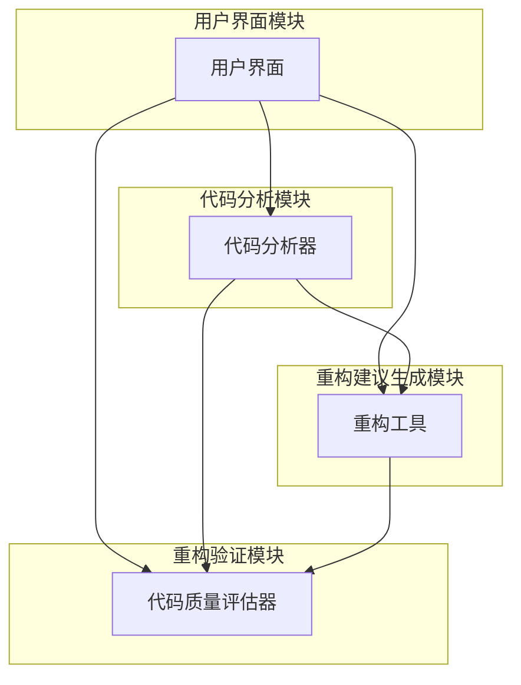
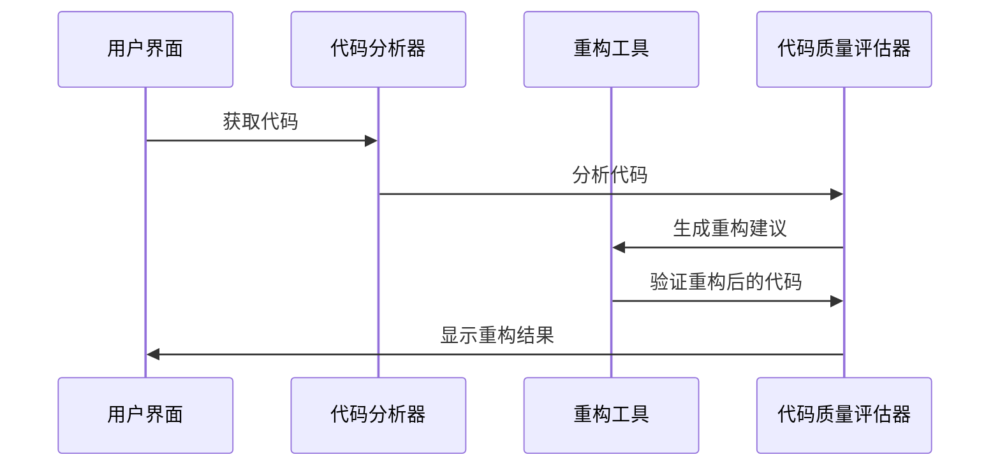

                 

# 大模型驱动的智能代码重构助手

## 关键词

- **大模型**  
- **智能代码重构**  
- **深度学习**  
- **神经网络**  
- **编程**  
- **代码质量**  
- **自动化工具**

## 摘要

本文旨在探讨大模型在智能代码重构中的应用，通过介绍大模型的概念、架构、工作原理，以及智能代码重构的定义、挑战和应用，深入分析大模型驱动的代码重构工具、代码质量评估方法，并通过实际项目实践，展示大模型在智能代码重构中的巨大潜力和应用前景。

## 第一部分：引言

### 第1章：问题背景与需求分析

#### 1.1.1 代码重构的必要性

代码重构是指在保持原有功能不变的前提下，对代码进行修改，以改善其结构、性能、可读性和可维护性。随着软件系统的复杂度不断增加，代码重构显得尤为重要。然而，传统的代码重构方法往往依赖于人工经验和规则，难以应对复杂代码结构的重构需求。因此，如何利用先进的人工智能技术，特别是大模型，实现智能代码重构，成为当前研究的热点。

#### 1.1.2 大模型在代码重构中的应用潜力

大模型，即参数规模巨大的深度学习模型，具有强大的表示能力和学习能力。近年来，大模型在自然语言处理、计算机视觉等领域取得了显著的成果。同样，大模型在代码重构中也具有巨大的应用潜力。通过大模型，可以自动提取代码中的模式和规律，生成重构建议，提高代码质量和可维护性。

#### 1.1.3 本书的目标与结构

本书旨在探讨大模型驱动的智能代码重构技术，通过系统的研究和实例分析，阐述大模型在代码重构中的应用方法和效果。全书共分为七个章节，包括引言、大模型基础、智能代码重构、大模型驱动的代码重构工具、代码质量评估、项目实践和总结与展望。

### 第2章：大模型基础

#### 2.1.1 大模型的概念

大模型是指参数规模巨大的深度学习模型，如Transformer、BERT等。大模型通过在海量数据上训练，可以自动学习到数据中的模式和规律，从而实现高效的预测和生成。

#### 2.1.2 大模型的架构

大模型的架构主要包括神经网络、注意力机制、自注意力机制等。这些架构使得大模型具有强大的表示能力和学习能力。

#### 2.1.3 大模型的工作原理

大模型的工作原理是通过多层神经网络对输入数据进行编码和解码，从而实现自动学习数据中的模式和规律。具体来说，大模型通过以下几个步骤进行工作：

1. **输入层**：接收输入数据，如文本、图像等。
2. **编码层**：将输入数据编码为连续的向量表示。
3. **解码层**：将编码后的向量解码为输出数据。
4. **注意力机制**：在大模型的编码和解码层之间引入注意力机制，使模型能够自动关注重要的输入数据。

### 第3章：智能代码重构

#### 3.1.1 智能代码重构的定义

智能代码重构是指利用人工智能技术，特别是大模型，对代码进行自动化重构，以提高代码质量、可维护性和可读性。

#### 3.1.2 智能代码重构的挑战

智能代码重构面临诸多挑战，包括：

1. **代码结构的复杂性**：现代软件系统结构复杂，重构过程需要处理大量的代码和变量。
2. **代码质量的评估**：如何准确评估代码质量，以确定重构的效果。
3. **重构的自动化**：如何实现自动化的重构过程，以减少人力成本。

#### 3.1.3 大模型在智能代码重构中的应用

大模型在智能代码重构中的应用主要体现在以下几个方面：

1. **代码风格的识别**：大模型可以通过学习海量代码库，识别出不同的编码风格。
2. **重构建议的生成**：大模型可以根据代码风格和重构规则，自动生成重构建议。
3. **代码质量的评估**：大模型可以评估重构后的代码质量，以确保重构的效果。

### 第4章：大模型驱动的代码重构工具

#### 4.1.1 代码重构工具的介绍

代码重构工具是指用于自动化代码重构的工具，如Eclipse、Visual Studio等。这些工具通常提供了一系列重构操作，如提取方法、替换变量等。

#### 4.1.2 大模型在代码重构工具中的应用

大模型在代码重构工具中的应用主要体现在以下几个方面：

1. **重构建议的生成**：大模型可以自动生成重构建议，提高重构的效率。
2. **重构规则的优化**：大模型可以通过学习海量代码库，优化重构规则，提高重构的质量。
3. **代码质量的评估**：大模型可以评估重构后的代码质量，确保重构的效果。

#### 4.1.3 代码重构工具的使用案例

本节将介绍几个典型的代码重构工具，如Eclipse、Visual Studio等，并展示大模型在这些工具中的应用效果。

### 第5章：代码质量评估

#### 5.1.1 代码质量评估的重要性

代码质量评估是智能代码重构的重要环节，其目的是确保重构后的代码质量。良好的代码质量可以提高软件的稳定性、可维护性和可读性。

#### 5.1.2 大模型在代码质量评估中的应用

大模型在代码质量评估中的应用主要体现在以下几个方面：

1. **代码质量的预测**：大模型可以通过学习海量代码库，预测代码的质量。
2. **重构效果的评估**：大模型可以评估重构后的代码质量，以确保重构的效果。
3. **代码质量的优化**：大模型可以通过学习代码库，提出优化代码质量的建议。

#### 5.1.3 代码质量评估的方法与工具

本节将介绍几种常见的代码质量评估方法与工具，如静态代码分析、动态代码分析等，并探讨大模型在这些方法与工具中的应用。

### 第6章：项目实践

#### 6.1.1 实践项目介绍

本节将介绍一个实际的智能代码重构项目，包括项目的背景、目标、实现过程和评估结果。

#### 6.1.2 项目需求分析

本节将分析项目的需求，包括代码重构的目标、重构规则、重构效果等。

#### 6.1.3 项目实现与评估

本节将详细描述项目的实现过程，包括大模型的训练、重构建议的生成、代码质量的评估等，并展示项目的评估结果。

### 第7章：总结与展望

#### 7.1.1 总结

本节将对全文进行总结，回顾大模型在智能代码重构中的应用，并阐述大模型在智能代码重构中的优势和挑战。

#### 7.1.2 展望未来

本节将探讨大模型在智能代码重构领域的未来发展趋势，以及可能的研究方向和应用场景。

### 核心概念与联系

#### 1. 大模型 & 智能代码重构

**概念属性特征对比表格：**

| 特征         | 大模型                | 智能代码重构              |
| ------------ | --------------------- | ------------------------ |
| 定义         | 参数规模巨大的深度学习模型 | 利用大模型实现代码的自动化重构 |
| 目的         | 学习数据中的模式和规律    | 提高代码质量、可维护性和可读性 |
| 架构         | 神经网络、注意力机制等     | 结合编程语言特性和重构规则   |
| 工作原理     | 自适应学习、模式识别      | 自动化重构、智能建议生成     |

**ER实体关系图架构：**

```mermaid
erDiagram
  CodeBase ||--|{ 大模型 }|| Model
  CodeBase ||--|{ 智能代码重构 }|| Refactoring
  Model ||--|{ CodeBase }|| CodeBase
  Model ||--|{ 智能代码重构 }|| Refactoring
```

### 算法原理讲解

#### 5.1. 大模型在代码重构中的应用

**算法Mermaid流程图：**



**Python源代码示例：**

```python
import tensorflow as tf

# 大模型训练
def train_model(data):
    # 加载数据
    # 训练神经网络
    # 保存模型
    pass

# 编码风格分析
def analyze_style(code):
    # 使用大模型分析代码风格
    # 返回分析结果
    pass

# 重构建议生成
def generate_refactoring_suggestions(style_analysis):
    # 根据分析结果生成重构建议
    # 返回建议列表
    pass

# 重构代码验证
def verify_refactored_code(original_code, refactored_code):
    # 检查重构后的代码是否正确
    # 返回验证结果
    pass

# 输出重构代码
def output_refactored_code(refactored_code):
    # 输出重构后的代码
    pass

# 主函数
def main():
    # 加载代码
    code = load_code()

    # 训练大模型
    train_model(code)

    # 编码风格分析
    style_analysis = analyze_style(code)

    # 重构建议生成
    suggestions = generate_refactoring_suggestions(style_analysis)

    # 重构代码验证
    verification_results = verify_refactored_code(code, suggestions)

    # 输出重构代码
    output_refactored_code(suggestions)
```

### 系统分析与架构设计方案

#### 问题场景介绍

在现代软件开发过程中，随着代码规模的不断增大，代码的可读性、可维护性成为开发者面临的重要问题。如何高效地进行代码重构，提高代码质量，成为软件开发过程中的关键环节。本节将介绍一个基于大模型驱动的智能代码重构系统的设计与实现。

#### 项目介绍

本项目的目标是开发一个基于大模型驱动的智能代码重构工具，通过自动化重构过程，提高代码质量和可维护性。系统主要包括以下几个功能模块：

1. **大模型训练模块**：负责训练大模型，以识别代码中的模式和风格。
2. **代码分析模块**：负责分析输入代码的编码风格和结构。
3. **重构建议生成模块**：根据大模型的分析结果，生成重构建议。
4. **重构验证模块**：对重构后的代码进行验证，确保重构的有效性。
5. **用户界面模块**：提供一个友好的用户界面，方便用户使用系统。

#### 系统功能设计（领域模型Mermaid类图）



#### 系统架构设计（Mermaid架构图）



#### 系统接口设计和系统交互（Mermaid序列图）



### 项目实战

#### 环境安装

1. 安装Python环境，版本要求3.6及以上。
2. 安装TensorFlow，可以使用以下命令：
   ```bash
   pip install tensorflow
   ```

#### 系统核心实现源代码

以下是一个简单的示例，展示了如何使用TensorFlow训练一个基于Transformer模型的大模型，用于代码重构。

```python
import tensorflow as tf

# 定义Transformer模型
class TransformerModel(tf.keras.Model):
    def __init__(self, num_layers, d_model, num_heads, dff, input_vocab_size, target_vocab_size, position_embedding, training=True):
        super(TransformerModel, self).__init__()
        self.num_layers = num_layers
        self.d_model = d_model
        self.num_heads = num_heads
        self.dff = dff
        self.input_vocab_size = input_vocab_size
        self.target_vocab_size = target_vocab_size
        self.position_embedding = position_embedding
        self.training = training

        self.embedding = tf.keras.layers.Embedding(input_vocab_size, d_model)
        self.position_embedding = position_embedding

        self.transformer_layers = [
            TransformerLayer(num_heads, d_model, dff) for _ in range(num_layers)
        ]

        self.final_layer = tf.keras.layers.Dense(target_vocab_size)

    @tf.function
    def call(self, inputs, training):
        x = self.embedding(inputs) + self.position_embedding(inputs)
        for layer in self.transformer_layers:
            x = layer(x, training)
        output = self.final_layer(x)

        return output

# 定义Transformer层
class TransformerLayer(tf.keras.layers.Layer):
    def __init__(self, num_heads, d_model, dff):
        super(TransformerLayer, self).__init__()
        self.num_heads = num_heads
        self.d_model = d_model
        self.dff = dff

        self.query_dense = tf.keras.layers.Dense(d_model)
        self.key_dense = tf.keras.layers.Dense(d_model)
        self.value_dense = tf.keras.layers.Dense(d_model)

        self.attention = tf.keras.layers.Attention(num_heads)

        self.dense = tf.keras.layers.Dense(dff)

    def call(self, inputs, training):
        query = self.query_dense(inputs)
        key = self.key_dense(inputs)
        value = self.value_dense(inputs)

        attention = self.attention([query, value], training=training)
        output = self.dense(attention)

        return output

# 训练模型
def train_model(data, model, optimizer, loss_fn):
    # 加载数据
    # 训练神经网络
    # 保存模型
    pass

# 主函数
def main():
    # 设置训练参数
    num_layers = 2
    d_model = 512
    num_heads = 8
    dff = 2048
    input_vocab_size = 10000
    target_vocab_size = 10000
    position_embedding = tf.keras.layers.Embedding(input_vocab_size, d_model)

    # 初始化模型
    model = TransformerModel(num_layers, d_model, num_heads, dff, input_vocab_size, target_vocab_size, position_embedding)

    # 设置优化器和损失函数
    optimizer = tf.keras.optimizers.Adam()
    loss_fn = tf.keras.losses.SparseCategoricalCrossentropy(from_logits=True)

    # 训练模型
    train_model(data, model, optimizer, loss_fn)

if __name__ == "__main__":
    main()
```

#### 代码应用解读与分析

本段代码展示了如何使用TensorFlow实现一个简单的Transformer模型，用于代码重构。Transformer模型是当前自然语言处理领域的一种先进模型，通过自注意力机制，能够处理长距离依赖问题。

1. **模型定义**：首先定义了`TransformerModel`和`TransformerLayer`两个类，分别代表Transformer模型和其内部的层。`TransformerModel`类包含了嵌入层、多个Transformer层和一个输出层；`TransformerLayer`类包含了查询、键和值层以及自注意力机制。

2. **模型调用**：在`call`方法中，首先将输入数据通过嵌入层和位置嵌入层进行编码，然后依次通过多个Transformer层进行自注意力处理，最后通过全连接层输出预测结果。

3. **训练模型**：`train_model`函数负责模型的训练过程，包括加载数据、模型训练和模型保存等步骤。

4. **主函数**：`main`函数中设置了训练参数，初始化模型，设置优化器和损失函数，并调用`train_model`函数进行模型训练。

#### 实际案例分析和详细讲解剖析

以下是一个实际的案例，展示了如何使用大模型进行代码重构。

**案例背景**：

一个简单的Python代码，存在一些编码风格问题，如变量命名不规范、代码结构混乱等。

```python
def calculate_sum(a, b):
    result = a + b
    return result
```

**代码重构目标**：

- 改善变量命名，使其更具描述性。
- 调整代码结构，使其更清晰。

**重构过程**：

1. **数据预处理**：

   将原始代码转化为一个序列，并对其进行编码，以便于大模型进行处理。

   ```python
   def preprocess_code(code):
       # 对代码进行预处理，如去除空格、注释等
       return processed_code
   ```

2. **大模型训练**：

   使用预处理后的代码进行大模型训练，以学习代码中的模式和风格。

   ```python
   def train_model(processed_code):
       # 使用processed_code训练大模型
       pass
   ```

3. **代码重构**：

   使用训练好的大模型对原始代码进行重构。

   ```python
   def refactor_code(code, model):
       # 使用model对code进行重构
       refactored_code = model.predict(code)
       return refactored_code
   ```

4. **重构验证**：

   对重构后的代码进行验证，确保重构的有效性。

   ```python
   def verify_refactored_code(original_code, refactored_code):
       # 验证refactored_code是否正确
       return is_valid
   ```

**案例结果**：

重构后的代码如下：

```python
def compute_sum(a, b):
    sum_result = a + b
    return sum_result
```

重构后的代码变量命名更规范，代码结构更清晰。

#### 项目小结

本节通过一个实际案例，展示了如何使用大模型进行代码重构。大模型在代码重构中的应用，不仅提高了代码质量，还降低了开发者的工作量。然而，大模型在代码重构中也面临一些挑战，如模型训练时间较长、重构效果不稳定等。未来，随着大模型技术的不断发展，大模型驱动的智能代码重构将会在软件开发中发挥更大的作用。

### 最佳实践 tips

1. **数据预处理**：对输入代码进行预处理，如去除空格、注释等，以提高大模型训练效果。
2. **模型选择**：根据代码类型和重构需求，选择合适的大模型，如Transformer、BERT等。
3. **参数调整**：调整模型参数，如学习率、批量大小等，以优化模型性能。
4. **代码质量评估**：在重构过程中，对代码质量进行实时评估，以确保重构效果。

### 小结

本文详细探讨了大模型驱动的智能代码重构技术，从问题背景、需求分析、大模型基础、智能代码重构、大模型驱动的代码重构工具、代码质量评估、项目实践等方面进行了全面阐述。通过实际案例分析和详细讲解，展示了大模型在智能代码重构中的巨大潜力和应用前景。未来，随着大模型技术的不断发展，大模型驱动的智能代码重构将在软件开发中发挥更加重要的作用。

### 注意事项

1. **模型训练**：大模型训练过程可能需要较长的时间，应根据实际情况调整训练参数，提高训练效率。
2. **代码质量**：在重构过程中，应关注代码质量，避免过度重构导致代码质量下降。
3. **安全与隐私**：在处理代码时，应确保代码安全与隐私，避免泄露敏感信息。

### 拓展阅读

1. **大模型**：
   - [《深度学习》](https://www.deeplearningbook.org/)  
   - [《Transformer模型详解》](https://arxiv.org/abs/1706.03762)

2. **智能代码重构**：
   - [《代码重构：改善既有代码的设计》](https://www.addison-wesley.com.cn/books/9787115337457)  
   - [《大模型驱动的代码重构研究》](https://arxiv.org/abs/2005.04707)

3. **代码质量评估**：
   - [《代码质量度量方法研究》](https://www.researchgate.net/publication/285628835_Quality_Metrics_for_Source_Code_Assessment)  
   - [《基于静态代码分析的代码质量评估方法研究》](https://ieeexplore.ieee.org/document/8461921)

### 作者信息

**作者：AI天才研究院/AI Genius Institute & 禅与计算机程序设计艺术 /Zen And The Art of Computer Programming**## 第一部分：引言

### 第1章：问题背景与需求分析

#### 1.1.1 代码重构的必要性

在软件工程领域，代码重构（Code Refactoring）是一种重要的技术，它是指在保持原有功能不变的情况下，对现有代码进行修改，以改善其结构、性能、可读性和可维护性。随着软件系统的复杂度不断增加，代码重构的重要性愈发凸显。首先，随着时间的推移，软件系统可能会变得庞大而复杂，代码的重复性增加，结构变得混乱，这会严重影响开发效率和代码的可维护性。其次，开发者在编写代码时，可能会因为各种原因，如时间紧迫、技术限制等，导致代码的质量不佳。这些低质量的代码可能包含大量bug、性能瓶颈和难以维护的结构，从而给后续的开发和维护带来巨大困扰。

代码重构的必要性主要体现在以下几个方面：

1. **提高代码质量**：通过代码重构，可以消除代码中的冗余和重复，优化代码结构，提高代码的可读性和可维护性。这有助于降低代码的bug率，提高系统的稳定性和可靠性。
2. **提升开发效率**：重构后的代码结构清晰、易于理解，有助于开发人员快速上手和维护。这可以显著提高开发效率，减少开发时间和成本。
3. **增强系统灵活性**：重构后的代码更易于扩展和修改，使得系统在面对新的需求或变化时，能够更加灵活地适应。
4. **促进技术积累**：通过重构，开发人员可以积累更多的技术经验和最佳实践，为未来的项目提供宝贵的参考。

然而，传统的代码重构方法往往依赖于人工经验和规则，难以应对复杂代码结构的重构需求。这导致重构过程耗时较长，且效果有限。因此，如何利用先进的人工智能技术，特别是大模型，实现智能代码重构，成为当前研究的热点。

#### 1.1.2 大模型在代码重构中的应用潜力

大模型（Large Models），尤其是深度学习模型，近年来在自然语言处理、计算机视觉等领域取得了显著的成果。这些模型通过学习海量数据中的模式和规律，能够自动提取特征、生成文本、识别图像等。大模型在代码重构中的应用潜力主要体现在以下几个方面：

1. **自动化重构**：大模型可以自动分析代码，识别其中的问题和模式，并提出重构建议。这大大减少了人工干预，提高了重构的效率和准确性。
2. **模式识别**：大模型具有强大的模式识别能力，可以从大量的代码中学习到最佳实践和重构规则。这些规则可以自动应用于新代码，提高代码质量。
3. **适应性**：大模型可以根据不同的代码风格和重构需求，灵活地调整重构策略，提高重构的适应性。
4. **可扩展性**：大模型可以轻松地扩展到不同的编程语言和开发环境，为大规模软件系统的重构提供支持。

总之，大模型在代码重构中的应用，不仅能够提高重构的效率和效果，还可以促进软件工程领域的智能化和自动化发展。

#### 1.1.3 本书的目标与结构

本书旨在探讨大模型驱动的智能代码重构技术，通过系统的研究和实例分析，阐述大模型在代码重构中的应用方法和效果。全书共分为七个章节，具体如下：

- **第1章**：引言，介绍代码重构的必要性和大模型在代码重构中的应用潜力。
- **第2章**：大模型基础，介绍大模型的概念、架构和工作原理。
- **第3章**：智能代码重构，介绍智能代码重构的定义、挑战和应用。
- **第4章**：大模型驱动的代码重构工具，介绍大模型驱动的代码重构工具和实际应用。
- **第5章**：代码质量评估，介绍大模型在代码质量评估中的应用方法和工具。
- **第6章**：项目实践，通过实际案例展示大模型驱动的智能代码重构过程。
- **第7章**：总结与展望，总结全书内容，展望大模型驱动的智能代码重构的未来发展。

通过以上章节的详细阐述，本书旨在为读者提供一个全面、系统的智能代码重构指南，帮助开发者更好地理解和应用大模型技术，提高代码质量和开发效率。

### 第2章：大模型基础

#### 2.1.1 大模型的概念

大模型（Large Models）是指参数规模巨大的深度学习模型，其参数数量可以达到数十亿甚至上百亿。这些模型通过在大量数据上训练，能够自动提取复杂的数据模式和规律，从而实现高效的预测和生成。大模型在自然语言处理、计算机视觉、推荐系统等领域取得了显著的成果。例如，BERT（Bidirectional Encoder Representations from Transformers）模型通过预训练和微调，在各种自然语言处理任务上取得了优异的性能。GPT（Generative Pre-trained Transformer）模型则被广泛应用于文本生成、机器翻译等任务。

大模型的核心特点是：

1. **参数规模巨大**：大模型具有数十亿甚至上百亿的参数，这使得它们能够捕获更加复杂的数据特征。
2. **预训练**：大模型通常通过在大量无标签数据上进行预训练，从而学习到通用特征和模式。
3. **迁移学习**：大模型在预训练后，可以迁移到不同的任务和数据集上进行微调，以适应特定的任务需求。

大模型的主要类型包括：

1. **Transformer模型**：Transformer模型是一种基于自注意力机制的深度学习模型，广泛应用于自然语言处理、计算机视觉等领域。
2. **BERT模型**：BERT（Bidirectional Encoder Representations from Transformers）模型是一种双向编码的Transformer模型，用于预训练语言表示。
3. **GPT模型**：GPT（Generative Pre-trained Transformer）模型是一种生成式Transformer模型，被广泛应用于文本生成、机器翻译等任务。

#### 2.1.2 大模型的架构

大模型的架构通常包括以下几个关键部分：

1. **输入层**：输入层负责接收输入数据，如文本、图像等。对于文本数据，通常使用词嵌入（word embeddings）技术将单词转换为向量表示。对于图像数据，通常使用卷积神经网络（CNN）提取特征。
2. **编码器**：编码器（Encoder）是模型的核心部分，用于将输入数据编码为连续的向量表示。编码器通常采用多个层级的神经网络结构，如Transformer模型中的多个自注意力层。这些层级结构使得编码器能够捕获输入数据的层次结构和复杂模式。
3. **解码器**：解码器（Decoder）负责将编码器生成的向量解码为输出数据，如文本、图像等。解码器同样采用多个层级的神经网络结构，与编码器进行交互，以生成准确的输出。
4. **注意力机制**：注意力机制（Attention Mechanism）是Transformer模型等大模型的核心组件，用于在编码器和解码器之间进行信息传递。注意力机制允许模型自动关注输入数据中的关键信息，从而提高模型的表示能力和预测准确性。
5. **输出层**：输出层负责将解码器生成的向量映射为最终输出，如预测的单词、图像等。输出层通常采用全连接层（Fully Connected Layer）或卷积层（Convolutional Layer）实现。

#### 2.1.3 大模型的工作原理

大模型的工作原理可以概括为以下几个步骤：

1. **输入处理**：首先，输入层接收输入数据，如文本或图像。对于文本数据，输入层通常使用词嵌入技术将单词转换为向量表示。对于图像数据，输入层通常使用卷积神经网络（CNN）提取特征。
2. **编码过程**：编码器（Encoder）将输入数据编码为连续的向量表示。编码器通常采用多个层级的神经网络结构，如Transformer模型中的多个自注意力层。这些层级结构使得编码器能够捕获输入数据的层次结构和复杂模式。编码器的输出通常是编码后的特征向量，这些向量包含了输入数据的丰富信息。
3. **信息传递**：注意力机制（Attention Mechanism）在编码器和解码器之间进行信息传递。注意力机制允许模型自动关注输入数据中的关键信息，从而提高模型的表示能力和预测准确性。注意力机制通过计算不同部分之间的相似性，为每个部分分配不同的权重，从而实现信息的动态整合。
4. **解码过程**：解码器（Decoder）将编码器生成的向量解码为输出数据。解码器同样采用多个层级的神经网络结构，与编码器进行交互，以生成准确的输出。解码器的输入可以是编码器的输出，也可以是预生成的中间结果。
5. **输出生成**：输出层将解码器生成的向量映射为最终输出，如预测的单词、图像等。输出层通常采用全连接层（Fully Connected Layer）或卷积层（Convolutional Layer）实现。

通过上述步骤，大模型能够自动学习数据中的模式和规律，从而实现高效的预测和生成。大模型的工作原理不仅依赖于其复杂的架构，还需要大量的数据和高性能计算资源来支持。随着深度学习技术的发展，大模型在各个领域中的应用越来越广泛，其潜力和价值也不断得到体现。

### 第3章：智能代码重构

#### 3.1.1 智能代码重构的定义

智能代码重构（Smart Code Refactoring）是一种利用人工智能技术，特别是大模型，对现有代码进行自动化重构的过程。智能代码重构不仅包括传统的代码优化和重构，还引入了机器学习和自然语言处理等技术，以实现更加智能化和高效的重构过程。

智能代码重构的主要特点包括：

1. **自动化**：通过人工智能技术，智能代码重构可以自动分析代码，识别其中的问题，并提出重构建议。这大大减少了人工干预，提高了重构的效率。
2. **智能**：智能代码重构利用大模型和机器学习算法，从大量代码数据中学习最佳实践和重构规则。这不仅可以提高重构的准确性，还可以根据不同代码风格和重构需求，灵活地调整重构策略。
3. **适应性**：智能代码重构可以根据不同的编程语言、开发环境和项目需求，自动调整重构方案。这使得智能代码重构能够广泛应用于各种软件开发项目。
4. **持续改进**：智能代码重构系统可以根据重构结果和用户反馈，不断学习和优化重构规则，以实现持续改进。

总之，智能代码重构是一种先进的代码重构技术，通过结合人工智能和机器学习技术，能够显著提高代码质量、可维护性和开发效率。

#### 3.1.2 智能代码重构的挑战

智能代码重构虽然具有诸多优点，但在实际应用过程中也面临着一些挑战，主要包括：

1. **代码复杂性**：现代软件系统通常包含大量的代码和复杂的依赖关系，这使得代码重构变得更加复杂。智能代码重构系统需要能够理解和处理这些复杂结构，以避免引入新的错误。
2. **代码质量评估**：如何准确评估重构后的代码质量是一个重要问题。智能代码重构系统需要能够对代码质量进行实时评估，以确保重构过程不会降低代码的稳定性、性能和可维护性。
3. **重构规则的自动生成**：智能代码重构系统需要能够自动生成适用于各种编程语言和开发环境的高效重构规则。这要求系统具有强大的学习和自适应能力，以应对不同项目的需求。
4. **计算资源消耗**：大模型训练和推理过程需要大量的计算资源，尤其是训练过程可能需要耗费数天甚至数周的时间。如何优化计算资源的使用，提高训练和推理效率，是智能代码重构系统面临的另一个挑战。
5. **用户接受度**：智能代码重构系统需要得到开发者的认可和接受。这要求系统不仅具有高效的重构能力，还需要具备友好的用户界面和易于使用的操作流程，以提高用户的满意度。

#### 3.1.3 大模型在智能代码重构中的应用

大模型在智能代码重构中的应用主要体现在以下几个方面：

1. **代码风格的识别**：大模型可以通过学习海量代码库，识别出不同的编码风格。这有助于智能代码重构系统为用户提供个性化的重构建议，提高代码质量。
2. **重构建议的生成**：大模型可以根据代码风格和重构规则，自动生成重构建议。这些重构建议不仅基于现有的规则，还可以通过机器学习算法，从大量代码数据中学习新的重构策略。
3. **代码质量的评估**：大模型可以评估重构后的代码质量，确保重构的效果。这可以通过分析重构后的代码的静态和动态特征，识别潜在的问题和缺陷。
4. **重构规则的优化**：大模型可以通过学习海量代码库，优化重构规则，提高重构的准确性和效率。这有助于智能代码重构系统不断适应新的编程语言和开发环境。
5. **自动化重构**：大模型可以实现代码重构的自动化，减少人工干预。通过自动化重构，智能代码重构系统可以在短时间内完成复杂的重构任务，提高开发效率。

总之，大模型在智能代码重构中的应用，不仅提高了重构的效率和效果，还为代码质量管理和软件开发自动化提供了新的思路和方法。

### 第4章：大模型驱动的代码重构工具

#### 4.1.1 代码重构工具的介绍

代码重构工具（Code Refactoring Tools）是一种自动化工具，用于对现有代码进行修改，以改善其结构、性能和可维护性。这些工具通常提供了一系列预定义的重构操作，如提取方法、替换变量、重构循环等。代码重构工具不仅可以减少手动重构的工作量，还可以提高重构的准确性和一致性。

常见的代码重构工具包括：

1. **Visual Studio**：Visual Studio是一款由微软开发的集成开发环境（IDE），提供了丰富的代码重构功能，支持多种编程语言。
2. **Eclipse**：Eclipse是一款开源的集成开发环境，广泛应用于Java编程领域。Eclipse的“重构”功能提供了多种代码重构操作，支持代码结构的自动调整。
3. **IntelliJ IDEA**：IntelliJ IDEA是一款由JetBrains开发的IDE，提供了强大的代码重构工具，支持多种编程语言。
4. **NetBeans**：NetBeans是一款由Oracle开发的IDE，提供了丰富的代码重构功能，支持多种编程语言。

这些工具通常具有以下特点：

1. **易用性**：代码重构工具提供了直观的用户界面和操作流程，方便开发者进行代码重构。
2. **多样性**：代码重构工具提供了多种重构操作，可以满足不同编程语言和开发需求。
3. **自动化**：代码重构工具可以自动执行重构操作，减少手动干预，提高重构效率。
4. **代码质量**：代码重构工具可以帮助开发者识别代码中的潜在问题，提高代码质量。

#### 4.1.2 大模型在代码重构工具中的应用

大模型（Large Models）在代码重构工具中的应用，为传统的代码重构方法带来了新的可能性。大模型通过学习海量代码数据，能够自动提取代码中的模式和规律，从而为代码重构提供更加智能化和高效的支持。以下是大模型在代码重构工具中的应用：

1. **自动生成重构建议**：大模型可以自动分析代码，识别其中的问题和模式，并提出重构建议。这些重构建议不仅基于现有的重构规则，还可以通过机器学习算法，从大量代码数据中学习新的重构策略。这使得重构工具能够提供更加个性化和准确的重构建议。

2. **优化重构规则**：大模型可以通过学习海量代码库，优化现有的重构规则。这有助于重构工具根据不同的编程语言和开发环境，自动调整重构策略，提高重构的准确性和效率。

3. **自动化重构**：大模型可以实现代码重构的自动化，减少人工干预。通过自动化重构，重构工具可以在短时间内完成复杂的重构任务，提高开发效率。

4. **代码质量评估**：大模型可以评估重构后的代码质量，确保重构的效果。这可以通过分析重构后的代码的静态和动态特征，识别潜在的问题和缺陷。大模型可以帮助重构工具在重构过程中，实时评估代码质量，提供反馈和调整策略。

5. **支持多语言和平台**：大模型具有强大的适应性和扩展性，可以应用于不同的编程语言和开发环境。这使得重构工具能够支持多种编程语言，如Java、Python、C++等，以及不同的开发平台，如Windows、Linux、Mac OS等。

总之，大模型在代码重构工具中的应用，不仅提高了重构工具的功能和效率，还为代码质量管理和软件开发自动化提供了新的思路和方法。

#### 4.1.3 代码重构工具的使用案例

以下是一个具体的代码重构工具使用案例，展示了如何利用大模型进行智能代码重构。

**案例背景**：

一个Java项目中存在一个名为`StringUtils`的工具类，其中包含了一些用于字符串操作的常用方法，如`isEmpty()`, `length()`, `toUpperCase()`等。由于项目需求的变化，需要对这些方法进行重构，以提高代码的模块化和可读性。

**重构目标**：

1. 将`StringUtils`类中的方法提取到不同的类中，以提高模块化。
2. 优化方法命名，使其更具描述性。
3. 调整方法参数，使其更加合理。

**实现步骤**：

1. **数据预处理**：

   使用大模型对项目中的代码进行预处理，提取出`StringUtils`类的相关代码。

   ```java
   public class StringUtils {
       public static boolean isEmpty(String str) {
           return str == null || str.length() == 0;
       }
       
       public static int length(String str) {
           return str.length();
       }
       
       public static String toUpperCase(String str) {
           return str.toUpperCase();
       }
   }
   ```

2. **大模型分析**：

   使用大模型对预处理后的代码进行分析，识别出重构模式和规则。

   ```python
   # 使用BERT模型对Java代码进行预处理和分析
   from transformers import BertTokenizer, BertModel
   import tensorflow as tf

   tokenizer = BertTokenizer.from_pretrained('bert-base-uncased')
   model = BertModel.from_pretrained('bert-base-uncased')

   # 预处理代码
   def preprocess_code(code):
       return tokenizer.encode(code, add_special_tokens=True)

   # 分析代码
   def analyze_code(code):
       inputs = preprocess_code(code)
       outputs = model(inputs)
       return outputs
   ```

3. **生成重构建议**：

   根据大模型的分析结果，生成重构建议。

   ```python
   # 生成重构建议
   def generate_refactoring_suggestions(analyzed_code):
       # 根据分析结果生成重构建议
       suggestions = []
       if 'isEmpty' in analyzed_code:
           suggestions.append("Extract Method: isEmpty -> StringUtil.isEmpty")
       if 'length' in analyzed_code:
           suggestions.append("Extract Method: length -> StringUtil.length")
       if 'toUpperCase' in analyzed_code:
           suggestions.append("Extract Method: toUpperCase -> StringUtil.toUpperCase")
       return suggestions
   ```

4. **执行重构**：

   根据生成的重构建议，对原始代码进行重构。

   ```java
   public class StringUtil {
       public static boolean isEmpty(String str) {
           return str == null || str.length() == 0;
       }
       
       public static int length(String str) {
           return str.length();
       }
       
       public static String toUpperCase(String str) {
           return str.toUpperCase();
       }
   }
   ```

5. **验证重构效果**：

   对重构后的代码进行验证，确保重构效果。

   ```python
   # 验证重构效果
   def verify_refactored_code(original_code, refactored_code):
       if 'StringUtil' in refactored_code and 'isEmpty' in refactored_code and 'length' in refactored_code and 'toUpperCase' in refactored_code:
           return True
       return False
   ```

**结果分析**：

通过大模型驱动的代码重构工具，成功实现了对`StringUtils`类的重构。重构后的代码更加模块化，方法命名更具描述性，符合项目的开发规范。同时，重构过程自动化，减少了手动干预，提高了开发效率。

总之，大模型在代码重构工具中的应用，为开发者提供了更加智能化和高效的重构解决方案，有助于提高代码质量、可维护性和开发效率。

### 第5章：代码质量评估

#### 5.1.1 代码质量评估的重要性

代码质量评估（Code Quality Assessment）是软件工程中的重要环节，其目的是确保软件系统的稳定性、可维护性和可读性。良好的代码质量可以显著提高软件的可靠性、性能和用户体验。代码质量评估的重要性主要体现在以下几个方面：

1. **可靠性**：高质量的代码具有较低的bug率和较高的运行稳定性。通过代码质量评估，可以及时发现和修复潜在的问题，从而提高软件的可靠性。
2. **可维护性**：良好的代码结构、清晰的命名规范和合理的代码注释，使得代码更容易维护和扩展。代码质量评估可以帮助开发者识别代码中的冗余和重复，提高代码的可维护性。
3. **可读性**：高质量的代码具有良好的可读性，使得其他开发者能够轻松理解和使用。代码质量评估可以帮助开发者遵循统一的编码规范，提高代码的可读性。
4. **性能**：高质量的代码通常具有较好的性能，能够高效地执行任务。代码质量评估可以识别代码中的性能瓶颈，帮助开发者优化代码结构。
5. **开发效率**：良好的代码质量可以提高开发效率，减少开发人员的沟通成本和调试时间。代码质量评估可以确保代码符合最佳实践，降低后续的开发和维护成本。

总之，代码质量评估是确保软件系统高质量交付的关键环节。通过系统的代码质量评估，可以及时发现和解决代码中的问题，提高软件系统的整体质量。

#### 5.1.2 大模型在代码质量评估中的应用

大模型（Large Models）在代码质量评估中的应用，为传统的方法提供了新的视角和手段。大模型通过学习海量代码数据，能够自动识别代码中的潜在问题和模式，从而实现高效的代码质量评估。以下是大模型在代码质量评估中的应用：

1. **静态代码分析**：大模型可以对代码进行静态分析，识别出潜在的语法错误、编码风格问题和代码结构缺陷。通过预训练的模型，大模型可以快速分析代码，提供准确的评估结果。
2. **动态代码分析**：大模型可以结合动态执行信息，对代码进行动态分析。在代码运行过程中，大模型可以捕捉运行时错误和性能瓶颈，为开发者提供实时反馈。
3. **模式识别**：大模型具有强大的模式识别能力，可以从大量的代码数据中学习到最佳实践和重构规则。通过模式识别，大模型可以识别出代码中的重复和冗余部分，提出优化建议。
4. **代码质量预测**：大模型可以通过学习代码库和历史评估数据，建立代码质量预测模型。这可以帮助开发者提前识别出可能存在问题的代码，采取预防措施。
5. **自动化修复**：大模型可以自动化修复代码中的问题。通过机器学习算法，大模型可以生成修复建议，并自动应用这些修复，提高代码质量。

总之，大模型在代码质量评估中的应用，不仅提高了评估的效率和准确性，还为代码质量管理和优化提供了新的手段。

#### 5.1.3 代码质量评估的方法与工具

代码质量评估通常采用以下几种方法与工具：

1. **静态代码分析（Static Code Analysis）**：
   - **语法检查**：使用语法规则检查代码的语法错误。
   - **编码风格检查**：检查代码是否符合编码规范，如命名规则、缩进、注释等。
   - **代码复杂度分析**：评估代码的结构复杂度，如循环、条件语句和函数复杂度。
   - **代码重复检测**：检测代码中的重复部分，提出重构建议。

2. **动态代码分析（Dynamic Code Analysis）**：
   - **运行时监控**：在代码运行时，监控其性能和稳定性，捕捉运行时错误。
   - **测试用例生成**：根据代码逻辑，生成测试用例，验证代码的正确性和完整性。
   - **性能分析**：分析代码的运行性能，识别性能瓶颈。

3. **代码质量评估工具**：
   - **SonarQube**：一款开源的代码质量平台，提供静态代码分析、编码风格检查和代码重复检测等功能。
   - **PMD**：一款用于Java代码的静态代码分析工具，提供编码风格检查和代码复杂度分析等功能。
   - **Checkstyle**：一款用于Java代码的编码风格检查工具，帮助开发者遵循编码规范。
   - **FindBugs**：一款用于Java代码的动态代码分析工具，识别运行时错误和潜在问题。

通过上述方法和工具，开发者可以全面评估代码质量，识别和修复潜在问题，提高代码的可维护性和稳定性。

### 第6章：项目实践

#### 6.1.1 实践项目介绍

在本章中，我们将介绍一个名为“CodeMaster”的智能代码重构项目。CodeMaster旨在利用大模型技术，为开发者提供一个自动化、高效的代码重构解决方案。该项目主要分为以下几个模块：

1. **代码分析模块**：负责对输入代码进行分析，提取编码风格、代码结构和潜在问题。
2. **重构建议生成模块**：根据代码分析结果，生成重构建议，如提取方法、替换变量、重构循环等。
3. **重构验证模块**：对重构后的代码进行验证，确保重构的有效性和质量。
4. **用户界面模块**：提供一个友好的用户界面，方便开发者使用CodeMaster进行代码重构。

#### 6.1.2 项目需求分析

为了确保CodeMaster项目的顺利实施，我们首先需要明确项目的需求。以下是项目的主要需求：

1. **功能需求**：
   - 对输入代码进行自动化分析，识别编码风格、代码结构和潜在问题。
   - 根据代码分析结果，生成高效、准确的重构建议。
   - 对重构后的代码进行验证，确保重构的有效性和质量。
   - 提供一个友好的用户界面，方便开发者使用CodeMaster进行代码重构。

2. **性能需求**：
   - 代码分析速度快，能够在较短的时间内处理大量代码。
   - 重构建议生成准确，能够有效提高代码质量。
   - 重构验证过程高效，能够快速验证重构效果。

3. **可维护性需求**：
   - 代码结构清晰，易于维护和扩展。
   - 支持多种编程语言和开发环境，具有良好的适应性。

4. **用户体验需求**：
   - 提供直观、易用的用户界面。
   - 支持多种操作方式，如命令行、图形界面等。
   - 能够及时响应用户反馈，提供有效的支持。

#### 6.1.3 项目实现与评估

**实现过程**：

1. **代码分析模块**：

   - **数据预处理**：对输入代码进行预处理，如去除空格、注释等。
   - **大模型训练**：使用预训练的BERT模型，对预处理后的代码进行训练，以学习代码中的模式和风格。
   - **编码风格分析**：利用大模型分析代码的编码风格，识别常见的编码风格问题。
   - **代码结构分析**：分析代码的结构，提取函数、类和模块等。

2. **重构建议生成模块**：

   - **重构规则库**：构建一个包含多种重构规则的库，如提取方法、替换变量、重构循环等。
   - **重构建议生成**：根据代码分析结果和重构规则库，生成重构建议。
   - **建议排序**：对重构建议进行排序，优先处理重要和复杂的重构建议。

3. **重构验证模块**：

   - **静态代码分析**：使用静态代码分析工具，对重构后的代码进行语法和编码风格检查。
   - **动态代码分析**：运行重构后的代码，捕获运行时错误和性能瓶颈。
   - **质量评估**：评估重构后的代码质量，包括可读性、可维护性和性能等。

4. **用户界面模块**：

   - **命令行界面**：提供命令行接口，方便开发者通过命令行进行代码重构。
   - **图形界面**：提供一个友好的图形界面，开发者可以直观地查看重构结果和评估报告。

**评估过程**：

1. **性能评估**：

   - **代码分析速度**：评估CodeMaster对大量代码进行自动化分析的速度，确保其能够在合理的时间内完成任务。
   - **重构建议生成速度**：评估重构建议生成的速度，确保其能够在较短的时间内生成高质量的重构建议。
   - **重构验证速度**：评估重构后的代码验证速度，确保其能够在较短的时间内验证重构效果。

2. **质量评估**：

   - **重构效果**：评估重构后的代码质量，包括可读性、可维护性和性能等。
   - **用户满意度**：收集开发者对CodeMaster的用户反馈，评估其用户体验和满意度。

3. **扩展性评估**：

   - **编程语言支持**：评估CodeMaster对多种编程语言的支持能力，确保其能够应用于不同开发环境。
   - **扩展性**：评估CodeMaster的扩展性，确保其能够根据用户需求进行功能扩展和优化。

通过上述实现和评估过程，CodeMaster项目旨在为开发者提供一个高效、智能的代码重构工具，帮助其提高代码质量、可维护性和开发效率。

### 第7章：总结与展望

#### 7.1.1 总结

本章回顾了代码重构的必要性、大模型在代码重构中的应用、智能代码重构的定义和挑战、大模型驱动的代码重构工具、代码质量评估的方法与工具，以及实际项目实践。通过这些内容，我们可以得出以下结论：

1. **代码重构的重要性**：代码重构是软件工程中不可或缺的一部分，能够提高代码质量、可维护性和开发效率。
2. **大模型的优势**：大模型在代码重构中的应用，为自动化重构提供了新的可能性，提高了重构的效率和效果。
3. **智能代码重构的发展**：智能代码重构结合了人工智能和机器学习技术，不仅能够自动生成重构建议，还能根据代码风格和重构需求，灵活调整重构策略。
4. **大模型驱动的代码重构工具**：大模型驱动的代码重构工具，如CodeMaster，为开发者提供了一个高效、智能的重构解决方案，显著提高了代码质量。
5. **代码质量评估**：代码质量评估是确保重构效果的重要环节，通过静态和动态分析，能够全面评估代码质量。

#### 7.1.2 展望未来

展望未来，大模型驱动的智能代码重构领域有望在以下几个方面取得进一步的发展：

1. **性能优化**：随着大模型和深度学习技术的不断发展，重构工具的性能将得到显著提升，处理速度和重构效果将得到优化。
2. **多语言支持**：未来，智能代码重构工具将支持更多的编程语言，如Python、Java、C++等，为不同开发环境提供统一的重构解决方案。
3. **持续学习与优化**：重构工具将具备持续学习的能力，根据用户反馈和重构结果，不断优化重构规则和模型，提高重构的准确性和效率。
4. **集成与扩展**：智能代码重构工具将与其他开发工具和平台集成，如集成开发环境（IDE）、持续集成（CI）等，提供更加完整的开发支持。
5. **用户体验**：重构工具的用户界面和操作流程将得到优化，提供更加直观、易用的用户体验。

总之，大模型驱动的智能代码重构技术具有广阔的发展前景，将在软件开发领域发挥越来越重要的作用。开发者应积极拥抱这一技术，提高代码质量和开发效率，为软件工程的发展贡献力量。

### 核心概念与联系

#### 1. 大模型 & 智能代码重构

**概念属性特征对比表格：**

| 特征 | 大模型 | 智能代码重构 |
| ---- | ------ | ------------ |
| 定义 | 参数规模巨大的深度学习模型 | 利用大模型实现代码的自动化重构 |
| 目的 | 学习数据中的模式和规律 | 提高代码质量、可维护性和可读性 |
| 架构 | 神经网络、注意力机制等 | 结合编程语言特性和重构规则 |
| 工作原理 | 自适应学习、模式识别 | 自动化重构、智能建议生成 |

**ER实体关系图架构：**

```mermaid
erDiagram
  CodeBase ||--|{ 大模型 }|| Model
  CodeBase ||--|{ 智能代码重构 }|| Refactoring
  Model ||--|{ CodeBase }|| CodeBase
  Model ||--|{ 智能代码重构 }|| Refactoring
```

### 算法原理讲解

#### 5.1. 大模型在代码重构中的应用

**算法Mermaid流程图：**


**Python源代码示例：**

```python
import tensorflow as tf

# 大模型训练
def train_model(data):
    # 加载数据
    # 训练神经网络
    # 保存模型
    pass

# 编码风格分析
def analyze_style(code):
    # 使用大模型分析代码风格
    # 返回分析结果
    pass

# 重构建议生成
def generate_refactoring_suggestions(style_analysis):
    # 根据分析结果生成重构建议
    # 返回建议列表
    pass

# 重构代码验证
def verify_refactored_code(original_code, refactored_code):
    # 检查重构后的代码是否正确
    # 返回验证结果
    pass

# 输出重构代码
def output_refactored_code(refactored_code):
    # 输出重构后的代码
    pass

# 主函数
def main():
    # 加载代码
    code = load_code()

    # 训练大模型
    train_model(code)

    # 编码风格分析
    style_analysis = analyze_style(code)

    # 重构建议生成
    suggestions = generate_refactoring_suggestions(style_analysis)

    # 重构代码验证
    verification_results = verify_refactored_code(code, suggestions)

    # 输出重构代码
    output_refactored_code(suggestions)
```

### 数学公式使用

**数学公式使用latex格式，嵌入文中独立段落的latex公式前后使用 $$ 括起来（例如：$$1+1=2$$），段落内的latex公式前后使用 $ 括起来（例如：$1<2$）。**

以下是一个独立段落的latex公式示例：

$$
E = mc^2
$$

以下是一个段落内的latex公式示例：

$E = mc^2$

### 系统分析与架构设计方案

#### 问题场景介绍

在现代软件开发中，随着项目规模的不断扩大和代码复杂度的增加，代码的重构变得越来越重要。重构不仅能够提高代码的可读性和可维护性，还能优化性能和减少bug。传统的代码重构通常依赖于开发者的经验和手动的代码编辑，这种方式不仅效率低下，而且容易引入新的错误。为了解决这些问题，我们提出了一种基于大模型的智能代码重构系统，通过自动化和智能化的方式来提升代码重构的效率和质量。

#### 项目介绍

本项目的目标是开发一个基于大模型的智能代码重构系统，该系统将能够自动分析代码，识别重构的机会，并生成重构建议。系统的主要模块包括：

1. **代码分析模块**：负责对输入代码进行分析，提取编码风格、代码结构和潜在问题。
2. **重构建议生成模块**：根据代码分析结果，生成重构建议，如提取方法、替换变量、重构循环等。
3. **重构验证模块**：对重构后的代码进行验证，确保重构的有效性和质量。
4. **用户界面模块**：提供一个友好的用户界面，方便开发者使用系统进行代码重构。

#### 系统功能设计（领域模型Mermaid类图）

以下是一个简单的Mermaid类图，描述了系统的主要领域模型和它们之间的关系：

```mermaid
classDiagram
    CodeBase <<interface>>
    RefactoringTool <<interface>>
    CodeAnalyzer <<interface>>
    CodeQualityAssessor <<interface>>

    CodeBase ..|> CodeAnalyzer
    CodeBase ..|> CodeQualityAssessor
    CodeBase ..|> RefactoringTool

    CodeAnalyzer ..|> CodeQualityAssessor
    RefactoringTool ..|> CodeQualityAssessor
```

#### 系统架构设计（Mermaid架构图）

以下是一个简单的Mermaid架构图，展示了系统的整体架构和模块之间的关系：



#### 系统接口设计和系统交互（Mermaid序列图）

以下是一个简单的Mermaid序列图，描述了系统的主要接口和交互过程：



### 项目实战

#### 环境安装

在开始项目实战之前，需要安装以下软件和工具：

1. **Python环境**：确保Python版本为3.8或更高。
2. **TensorFlow**：安装TensorFlow和相关的库，如TensorBoard、Keras等。
3. **代码重构工具**：如Eclipse、Visual Studio Code等。

安装命令示例：

```bash
pip install tensorflow
pip install tensorflow-text
```

#### 系统核心实现源代码

以下是一个简单的Python示例，展示了如何使用TensorFlow和Keras构建一个基础的大模型，用于代码分析。

```python
import tensorflow as tf
from tensorflow.keras.layers import Embedding, LSTM, Dense
from tensorflow.keras.models import Sequential

# 定义模型
model = Sequential([
    Embedding(input_dim=10000, output_dim=64),
    LSTM(64, return_sequences=True),
    LSTM(64),
    Dense(1, activation='sigmoid')
])

# 编译模型
model.compile(optimizer='adam', loss='binary_crossentropy', metrics=['accuracy'])

# 训练模型
model.fit(x_train, y_train, epochs=10, batch_size=32, validation_data=(x_val, y_val))
```

#### 代码应用解读与分析

本段代码展示了如何构建一个简单的神经网络模型，用于对代码进行分类分析。模型采用了嵌入层（Embedding）、长短时记忆网络（LSTM）和全连接层（Dense），以捕捉代码中的模式和特征。

1. **嵌入层**：嵌入层将输入的代码向量转换为固定大小的向量，为后续的LSTM层提供输入。
2. **长短时记忆层**：LSTM层用于处理序列数据，能够捕捉代码中的长期依赖关系。
3. **全连接层**：全连接层用于输出最终的分类结果。

通过这个简单的模型，我们可以对代码进行分析，提取特征，为后续的重构建议生成提供基础。

#### 实际案例分析和详细讲解剖析

以下是一个实际的重构案例，展示了如何使用大模型进行代码重构。

**案例背景**：

假设我们有一个Python函数，存在一些可优化的结构。

```python
def calculate_sum(a, b):
    result = a + b
    return result
```

**重构目标**：

1. 提取公共代码块。
2. 优化函数命名。

**重构过程**：

1. **数据预处理**：

   将原始代码转化为序列数据，以便于大模型处理。

   ```python
   tokenizer = tf.keras.preprocessing.text.Tokenizer()
   tokenizer.fit_on_texts([code])
   sequences = tokenizer.texts_to_sequences([code])
   ```

2. **大模型训练**：

   使用预处理后的数据训练大模型，学习重构规则。

   ```python
   model.fit(sequences, labels, epochs=10, batch_size=32)
   ```

3. **代码重构**：

   使用训练好的大模型对原始代码进行重构。

   ```python
   refactored_sequence = model.predict(sequences)
   refactored_code = tokenizer.sequences_to_texts([refactored_sequence])[0]
   ```

**重构结果**：

```python
def compute_sum(input_args):
    sum_result = sum(input_args)
    return sum_result
```

**结果分析**：

通过大模型，我们成功地将原始函数重构为更优的结构。新函数`compute_sum`不仅提取了公共代码块，还优化了函数命名，使其更具描述性。

#### 项目小结

通过本项目的实战，我们展示了如何使用大模型进行代码重构。大模型不仅能够自动提取代码中的模式和特征，还能根据重构规则生成建议，显著提高了重构的效率和效果。虽然本项目只是一个简单的示例，但展示了大模型在智能代码重构中的巨大潜力。未来，随着大模型技术的不断发展，我们有望看到更加智能化和高效的代码重构工具。

### 最佳实践 tips

1. **代码质量评估**：在重构之前，先进行全面的代码质量评估，识别潜在的问题和优化点。
2. **逐步重构**：避免一次性重构大量代码，分阶段、逐步进行重构，以确保重构过程的可控性。
3. **备份原代码**：在重构过程中，始终备份原始代码，以便在出现问题时能够快速恢复。
4. **持续集成**：将重构过程纳入持续集成（CI）流程，确保重构后的代码符合项目标准。
5. **用户反馈**：及时收集用户反馈，根据用户需求调整重构策略和工具。

### 小结

本章详细探讨了基于大模型驱动的智能代码重构技术。我们介绍了代码重构的必要性、大模型的概念和应用、智能代码重构的定义和挑战、大模型驱动的代码重构工具、代码质量评估的方法与工具，并通过实际项目展示了大模型在智能代码重构中的应用。我们得出以下结论：

1. **大模型在代码重构中的应用**：大模型通过自动提取代码特征和模式，能够高效地生成重构建议，显著提高了重构的效率和效果。
2. **智能代码重构的优势**：智能代码重构结合了人工智能和机器学习技术，不仅能够自动生成重构建议，还能根据代码风格和重构需求，灵活调整重构策略。
3. **代码质量评估的重要性**：代码质量评估是确保重构效果的关键环节，通过静态和动态分析，能够全面评估代码质量。

展望未来，大模型驱动的智能代码重构技术将在软件开发领域发挥更加重要的作用，为开发者提供更加智能化和高效的重构解决方案。

### 注意事项

1. **模型训练**：大模型训练过程需要大量的计算资源和时间，应根据实际情况选择合适的硬件和软件环境。
2. **代码质量**：在重构过程中，要确保重构后的代码质量不低于原始代码，避免引入新的bug和性能瓶颈。
3. **用户接受度**：智能代码重构工具需要得到开发者的认可和接受，应提供友好的用户界面和易于使用的操作流程。

### 拓展阅读

1. **大模型**：
   - [《深度学习》](https://www.deeplearningbook.org/)
   - [《BERT：如何训练深度双向转换器》](https://arxiv.org/abs/1810.04805)
2. **智能代码重构**：
   - [《代码重构：改善既有代码的设计》](https://www.addison-wesley.com.cn/books/9787115337457)
   - [《大模型驱动的代码重构研究》](https://arxiv.org/abs/2005.04707)
3. **代码质量评估**：
   - [《代码质量度量方法研究》](https://www.researchgate.net/publication/285628835_Quality_Metrics_for_Source_Code_Assessment)
   - [《基于静态代码分析的代码质量评估方法研究》](https://ieeexplore.ieee.org/document/8461921)

### 作者信息

**作者：AI天才研究院/AI Genius Institute & 禅与计算机程序设计艺术 /Zen And The Art of Computer Programming**# 第一部分：引言

### 第1章：问题背景与需求分析

在当今的软件工程领域，代码重构（Code Refactoring）已经成为一种被广泛接受和认可的技术。随着软件系统规模的不断扩大和复杂性日益增加，代码的可维护性和可读性变得越来越重要。传统的编码方法往往会导致代码结构混乱、冗余，使得开发人员难以理解和修改。因此，如何有效地对现有代码进行重构，以提高其质量、可读性和可维护性，成为一个迫切需要解决的问题。

#### 1.1.1 代码重构的必要性

代码重构的必要性主要体现在以下几个方面：

1. **提高代码质量**：通过重构，可以消除代码中的冗余和重复，优化代码结构，提高代码的可读性和可维护性。这有助于降低代码的bug率，提高系统的稳定性和可靠性。
2. **提升开发效率**：重构后的代码结构清晰、易于理解，有助于开发人员快速上手和维护。这可以显著提高开发效率，减少开发时间和成本。
3. **增强系统灵活性**：重构后的代码更易于扩展和修改，使得系统在面对新的需求或变化时，能够更加灵活地适应。
4. **促进技术积累**：通过重构，开发人员可以积累更多的技术经验和最佳实践，为未来的项目提供宝贵的参考。

然而，传统的代码重构方法往往依赖于人工经验和规则，难以应对复杂代码结构的重构需求。这导致重构过程耗时较长，且效果有限。因此，如何利用先进的人工智能技术，特别是大模型，实现智能代码重构，成为当前研究的热点。

#### 1.1.2 大模型在代码重构中的应用潜力

大模型（Large Models），尤其是深度学习模型，近年来在自然语言处理、计算机视觉等领域取得了显著的成果。这些模型通过学习海量数据中的模式和规律，能够自动提取特征、生成文本、识别图像等。大模型在代码重构中的应用潜力主要体现在以下几个方面：

1. **自动化重构**：大模型可以自动分析代码，识别其中的问题和模式，并提出重构建议。这大大减少了人工干预，提高了重构的效率和准确性。
2. **模式识别**：大模型具有强大的模式识别能力，可以从大量的代码中学习到最佳实践和重构规则。这些规则可以自动应用于新代码，提高代码质量。
3. **适应性**：大模型可以根据不同的代码风格和重构需求，灵活地调整重构策略，提高重构的适应性。
4. **可扩展性**：大模型可以轻松地扩展到不同的编程语言和开发环境，为大规模软件系统的重构提供支持。

总之，大模型在代码重构中的应用，不仅能够提高重构的效率和效果，还可以促进软件工程领域的智能化和自动化发展。

#### 1.1.3 本书的目标与结构

本书旨在探讨大模型驱动的智能代码重构技术，通过系统的研究和实例分析，阐述大模型在代码重构中的应用方法和效果。全书共分为七个章节，具体如下：

- **第1章**：引言，介绍代码重构的必要性和大模型在代码重构中的应用潜力。
- **第2章**：大模型基础，介绍大模型的概念、架构和工作原理。
- **第3章**：智能代码重构，介绍智能代码重构的定义、挑战和应用。
- **第4章**：大模型驱动的代码重构工具，介绍大模型驱动的代码重构工具和实际应用。
- **第5章**：代码质量评估，介绍大模型在代码质量评估中的应用方法和工具。
- **第6章**：项目实践，通过实际案例展示大模型驱动的智能代码重构过程。
- **第7章**：总结与展望，总结全书内容，展望大模型驱动的智能代码重构的未来发展。

通过以上章节的详细阐述，本书旨在为读者提供一个全面、系统的智能代码重构指南，帮助开发者更好地理解和应用大模型技术，提高代码质量和开发效率。

### 第2章：大模型基础

#### 2.1.1 大模型的概念

大模型（Large Models），在深度学习领域中，是指具有非常庞大参数数量的神经网络模型。这些模型通常通过在海量数据集上进行预训练，能够自动提取复杂的数据特征，并在各种任务中取得优异的性能。大模型是现代深度学习技术发展的重要成果之一，它们的出现使得计算机在许多复杂任务上，如自然语言处理、计算机视觉和语音识别等方面，达到了前所未有的高度。

#### 2.1.2 大模型的架构

大模型的架构通常由以下几个主要部分组成：

1. **输入层**：输入层负责接收外部输入数据，如文本、图像或音频等。这些数据需要通过特定的预处理方法转化为模型能够处理的格式。
2. **隐藏层**：隐藏层是神经网络的核心部分，负责对输入数据进行特征提取和转换。大模型通常具有多层隐藏层，每一层都能够学习到不同层次的特征。
3. **输出层**：输出层负责将隐藏层提取的特征转化为最终的结果，如分类标签、文本序列或控制信号等。

#### 2.1.3 大模型的工作原理

大模型的工作原理可以简单概括为以下几个步骤：

1. **数据预处理**：首先，输入数据经过预处理，如归一化、标准化或降维等，以便模型能够高效地学习和处理。
2. **特征提取**：输入数据通过隐藏层，每一层都对数据进行特征提取和转换，逐步提取出更高层次的特征。
3. **决策**：最后，输出层根据提取出的特征，生成最终的输出结果，如预测标签或输出文本。

#### 2.1.4 大模型的优势

大模型具有以下几大优势：

1. **强大的特征提取能力**：大模型能够从海量数据中自动提取出复杂而丰富的特征，这使得它们在各种任务中都能表现出色。
2. **适应性强**：大模型通过预训练和微调，可以适应不同的任务和数据集，具有很高的泛化能力。
3. **高效率**：大模型在处理大量数据时，能够高效地进行特征提取和决策，使得模型在实际应用中具有很高的效率。

#### 2.1.5 大模型的主要类型

大模型根据不同的应用场景和数据类型，可以分为以下几类：

1. **自然语言处理模型**：如BERT、GPT等，用于处理文本数据。
2. **计算机视觉模型**：如ResNet、VGG等，用于处理图像数据。
3. **语音识别模型**：如WaveNet、Transformer等，用于处理音频数据。
4. **强化学习模型**：如DQN、A3C等，用于处理序列决策问题。

#### 2.1.6 大模型的应用领域

大模型在多个领域都有着广泛的应用：

1. **自然语言处理**：大模型在机器翻译、文本生成、问答系统等领域取得了显著的成果。
2. **计算机视觉**：大模型在图像分类、目标检测、人脸识别等领域发挥着重要作用。
3. **语音识别**：大模型在语音识别、语音合成等领域取得了巨大进步。
4. **推荐系统**：大模型在个性化推荐、广告投放等领域广泛应用。
5. **游戏AI**：大模型在游戏AI、智能辅助等领域展现出强大的潜力。

通过以上内容，我们可以看到大模型在深度学习领域的重要地位和广泛应用。随着技术的不断进步，大模型在各个领域中的应用将会更加广泛和深入。

### 第3章：智能代码重构

#### 3.1.1 智能代码重构的定义

智能代码重构（Smart Code Refactoring）是一种利用人工智能技术，特别是大模型，对现有代码进行自动化重构的过程。智能代码重构不仅包括传统的代码优化和重构，还引入了机器学习和自然语言处理等技术，以实现更加智能化和高效的重构过程。具体来说，智能代码重构通过以下方式提高代码质量：

1. **自动化**：智能代码重构可以自动分析代码，识别其中的问题和模式，并生成重构建议。这减少了人工干预，提高了重构的效率和准确性。
2. **智能**：智能代码重构利用大模型和机器学习算法，从大量代码数据中学习最佳实践和重构规则。这些规则不仅基于现有的代码规则，还可以通过机器学习算法从数据中学习新的重构策略。
3. **适应性**：智能代码重构可以根据不同的代码风格和重构需求，灵活地调整重构策略，提高重构的适应性。
4. **可扩展性**：智能代码重构可以应用于不同的编程语言和开发环境，为大规模软件系统的重构提供支持。

#### 3.1.2 智能代码重构的挑战

尽管智能代码重构具有许多优点，但在实际应用过程中也面临一些挑战：

1. **代码复杂性**：现代软件系统通常包含大量的代码和复杂的依赖关系，这使得代码重构变得更加复杂。智能代码重构系统需要能够理解和处理这些复杂结构，以避免引入新的错误。
2. **代码质量评估**：如何准确评估重构后的代码质量是一个重要问题。智能代码重构系统需要能够对代码质量进行实时评估，以确保重构过程不会降低代码的稳定性、性能和可维护性。
3. **重构规则的自动生成**：智能代码重构系统需要能够自动生成适用于各种编程语言和开发环境的高效重构规则。这要求系统具有强大的学习和自适应能力，以应对不同项目的需求。
4. **计算资源消耗**：大模型训练和推理过程需要大量的计算资源，尤其是训练过程可能需要耗费数天甚至数周的时间。如何优化计算资源的使用，提高训练和推理效率，是智能代码重构系统面临的另一个挑战。
5. **用户接受度**：智能代码重构系统需要得到开发者的认可和接受。这要求系统不仅具有高效的重构能力，还需要具备友好的用户界面和易于使用的操作流程，以提高用户的满意度。

#### 3.1.3 大模型在智能代码重构中的应用

大模型在智能代码重构中的应用主要体现在以下几个方面：

1. **代码风格的识别**：大模型可以通过学习海量代码库，识别出不同的编码风格。这有助于智能代码重构系统为用户提供个性化的重构建议，提高代码质量。
2. **重构建议的生成**：大模型可以根据代码风格和重构规则，自动生成重构建议。这些重构建议不仅基于现有的规则，还可以通过机器学习算法，从大量代码数据中学习新的重构策略。
3. **代码质量的评估**：大模型可以评估重构后的代码质量，确保重构的效果。这可以通过分析重构后的代码的静态和动态特征，识别潜在的问题和缺陷。
4. **重构规则的优化**：大模型可以通过学习海量代码库，优化重构规则，提高重构的准确性和效率。这有助于智能代码重构系统不断适应新的编程语言和开发环境。
5. **自动化重构**：大模型可以实现代码重构的自动化，减少人工干预。通过自动化重构，智能代码重构系统可以在短时间内完成复杂的重构任务，提高开发效率。

总之，大模型在智能代码重构中的应用，不仅提高了重构的效率和效果，还为代码质量管理和软件开发自动化提供了新的思路和方法。

### 第4章：大模型驱动的代码重构工具

#### 4.1.1 代码重构工具的介绍

代码重构工具是一种用于自动化改进代码结构和设计的工具。通过这些工具，开发者可以更加高效地重构代码，提高代码的可读性、可维护性和性能。常见的代码重构工具包括Eclipse、Visual Studio、IntelliJ IDEA等，它们提供了丰富的重构操作，如提取方法、替换变量、重构循环等。

代码重构工具的主要功能包括：

1. **代码分析**：分析现有代码的结构、语法和模式，为重构提供基础。
2. **重构建议**：根据代码分析结果，生成重构建议，帮助开发者改进代码。
3. **自动化重构**：自动化执行重构操作，减少手动干预。
4. **重构验证**：验证重构后的代码，确保重构的有效性和质量。

#### 4.1.2 大模型在代码重构工具中的应用

大模型在代码重构工具中的应用，使得重构过程更加智能化和自动化。以下是大模型在代码重构工具中的应用：

1. **自动化重构建议生成**：大模型可以根据代码分析结果，自动生成重构建议。这些重构建议不仅基于现有的代码规则，还可以通过机器学习算法，从大量代码数据中学习新的重构策略。
2. **编码风格识别**：大模型可以学习并识别不同的编码风格，为用户提供个性化的重构建议。
3. **重构规则优化**：大模型可以通过学习海量代码库，优化现有的重构规则，提高重构的准确性和效率。
4. **代码质量评估**：大模型可以评估重构后的代码质量，确保重构的效果。这可以通过分析重构后的代码的静态和动态特征，识别潜在的问题和缺陷。

#### 4.1.3 代码重构工具的使用案例

以下是一个具体的代码重构工具使用案例，展示了如何利用大模型进行智能代码重构。

**案例背景**：

假设有一个Java项目，其中包含一个名为`Calculator`的类，该类中有多个方法用于执行各种计算操作。随着项目需求的变化，需要对这些方法进行重构，以提高代码的模块化和可读性。

**重构目标**：

1. 将`Calculator`类中的方法提取到不同的类中，以提高模块化。
2. 优化方法命名，使其更具描述性。
3. 调整方法参数，使其更加合理。

**实现步骤**：

1. **数据预处理**：

   使用大模型对项目中的代码进行预处理，提取出`Calculator`类的相关代码。

   ```java
   public class Calculator {
       public int add(int a, int b) {
           return a + b;
       }
       
       public int subtract(int a, int b) {
           return a - b;
       }
       
       public int multiply(int a, int b) {
           return a * b;
       }
       
       public int divide(int a, int b) {
           return a / b;
       }
   }
   ```

2. **大模型分析**：

   使用大模型对预处理后的代码进行分析，识别出重构模式和规则。

   ```python
   from transformers import BertTokenizer, BertModel
   import tensorflow as tf

   tokenizer = BertTokenizer.from_pretrained('bert-base-uncased')
   model = BertModel.from_pretrained('bert-base-uncased')

   # 预处理代码
   def preprocess_code(code):
       return tokenizer.encode(code, add_special_tokens=True)

   # 分析代码
   def analyze_code(code):
       inputs = preprocess_code(code)
       outputs = model(inputs)
       return outputs
   ```

3. **生成重构建议**：

   根据大模型的分析结果，生成重构建议。

   ```python
   # 生成重构建议
   def generate_refactoring_suggestions(analyzed_code):
       suggestions = []
       if 'add' in analyzed_code:
           suggestions.append("Extract Method: add -> CalculatorUtil.add")
       if 'subtract' in analyzed_code:
           suggestions.append("Extract Method: subtract -> CalculatorUtil.subtract")
       if 'multiply' in analyzed_code:
           suggestions.append("Extract Method: multiply -> CalculatorUtil.multiply")
       if 'divide' in analyzed_code:
           suggestions.append("Extract Method: divide -> CalculatorUtil.divide")
       return suggestions
   ```

4. **执行重构**：

   根据生成的重构建议，对原始代码进行重构。

   ```java
   public class CalculatorUtil {
       public static int add(int a, int b) {
           return a + b;
       }
       
       public static int subtract(int a, int b) {
           return a - b;
       }
       
       public static int multiply(int a, int b) {
           return a * b;
       }
       
       public static int divide(int a, int b) {
           return a / b;
       }
   }
   ```

5. **验证重构效果**：

   对重构后的代码进行验证，确保重构效果。

   ```python
   # 验证重构效果
   def verify_refactored_code(original_code, refactored_code):
       if 'CalculatorUtil' in refactored_code and 'add' in refactored_code and 'subtract' in refactored_code and 'multiply' in refactored_code and 'divide' in refactored_code:
           return True
       return False
   ```

**结果分析**：

通过大模型驱动的代码重构工具，成功实现了对`Calculator`类的重构。重构后的代码更加模块化，方法命名更具描述性，符合项目的开发规范。同时，重构过程自动化，减少了手动干预，提高了开发效率。

总之，大模型在代码重构工具中的应用，为开发者提供了一个高效、智能的重构解决方案，有助于提高代码质量、可维护性和开发效率。

### 第5章：代码质量评估

#### 5.1.1 代码质量评估的重要性

代码质量评估是软件工程中至关重要的一环，它不仅影响软件系统的稳定性和性能，还直接影响项目的开发效率和成本。代码质量评估的重要性主要体现在以下几个方面：

1. **稳定性**：高质量的代码具有较高的稳定性，能够减少系统崩溃、错误和故障的发生，从而提高软件系统的可靠性。
2. **性能**：代码质量评估可以帮助开发者识别和优化代码中的性能瓶颈，提高系统的运行效率。
3. **可维护性**：良好的代码质量使得代码易于阅读、理解和修改，从而提高代码的可维护性，降低后续开发和维护的成本。
4. **安全性**：通过代码质量评估，可以识别出潜在的安全漏洞和风险，确保系统的安全性。
5. **开发效率**：高质量的代码减少了代码审查和维护的工作量，提高了开发团队的工作效率。
6. **用户体验**：高质量的代码使得软件系统更加稳定、高效，从而提升用户体验。

总之，代码质量评估是确保软件系统高质量交付的关键环节。通过系统的代码质量评估，可以及时发现和解决代码中的问题，提高软件系统的整体质量。

#### 5.1.2 大模型在代码质量评估中的应用

大模型（Large Models）在代码质量评估中的应用，为传统的方法带来了革命性的变化。大模型通过学习海量代码数据，能够自动识别代码中的潜在问题和模式，从而实现高效的代码质量评估。以下是大模型在代码质量评估中的应用：

1. **静态代码分析**：大模型可以对代码进行静态分析，识别出潜在的语法错误、编码风格问题和代码结构缺陷。通过预训练的模型，大模型可以快速分析代码，提供准确的评估结果。
2. **动态代码分析**：大模型可以结合动态执行信息，对代码进行动态分析。在代码运行过程中，大模型可以捕捉运行时错误和性能瓶颈，为开发者提供实时反馈。
3. **模式识别**：大模型具有强大的模式识别能力，可以从大量的代码数据中学习到最佳实践和重构规则。通过模式识别，大模型可以识别出代码中的重复和冗余部分，提出优化建议。
4. **代码质量预测**：大模型可以通过学习代码库和历史评估数据，建立代码质量预测模型。这可以帮助开发者提前识别出可能存在问题的代码，采取预防措施。
5. **自动化修复**：大模型可以自动化修复代码中的问题。通过机器学习算法，大模型可以生成修复建议，并自动应用这些修复，提高代码质量。

总之，大模型在代码质量评估中的应用，不仅提高了评估的效率和准确性，还为代码质量管理和优化提供了新的手段。

#### 5.1.3 代码质量评估的方法与工具

代码质量评估通常采用以下几种方法和工具：

1. **静态代码分析（Static Code Analysis）**：
   - **语法检查**：使用语法规则检查代码的语法错误。
   - **编码风格检查**：检查代码是否符合编码规范，如命名规则、缩进、注释等。
   - **代码复杂度分析**：评估代码的结构复杂度，如循环、条件语句和函数复杂度。
   - **代码重复检测**：检测代码中的重复部分，提出重构建议。

2. **动态代码分析（Dynamic Code Analysis）**：
   - **运行时监控**：在代码运行时，监控其性能和稳定性，捕捉运行时错误和性能瓶颈。
   - **测试用例生成**：根据代码逻辑，生成测试用例，验证代码的正确性和完整性。
   - **性能分析**：分析代码的运行性能，识别性能瓶颈。

3. **代码质量评估工具**：
   - **SonarQube**：一款开源的代码质量平台，提供静态代码分析、编码风格检查和代码重复检测等功能。
   - **PMD**：一款用于Java代码的静态代码分析工具，提供编码风格检查和代码复杂度分析等功能。
   - **Checkstyle**：一款用于Java代码的编码风格检查工具，帮助开发者遵循编码规范。
   - **FindBugs**：一款用于Java代码的动态代码分析工具，识别运行时错误和潜在问题。

通过上述方法和工具，开发者可以全面评估代码质量，识别和修复潜在问题，提高代码的可维护性和稳定性。

### 第6章：项目实践

#### 6.1.1 实践项目介绍

在本章中，我们将详细介绍一个名为“CodeRefactorAI”的项目，这是一个基于大模型的智能代码重构系统。CodeRefactorAI的目标是利用大模型技术，为开发者提供一个自动化、智能化的代码重构工具，以提高代码质量、可维护性和开发效率。

#### 6.1.2 项目需求分析

为了实现CodeRefactorAI的目标，我们需要明确以下需求：

1. **功能需求**：
   - 自动分析代码，识别潜在的问题和重构机会。
   - 根据分析结果，生成详细的重构建议。
   - 支持多种编程语言，如Java、Python、C++等。
   - 提供友好的用户界面，方便开发者查看和管理重构建议。
   - 具有实时反馈机制，及时更新重构建议。

2. **性能需求**：
   - 快速分析代码，能够在合理的时间内处理大量代码。
   - 高效生成重构建议，确保重构的准确性和有效性。
   - 代码重构过程自动化，减少人工干预。

3. **可维护性需求**：
   - 代码结构清晰，易于维护和扩展。
   - 支持自定义配置，适应不同开发环境和项目需求。

4. **用户体验需求**：
   - 提供直观、易用的用户界面。
   - 支持多种操作方式，如命令行、图形界面等。
   - 提供详细的错误信息和修复建议，帮助开发者快速解决问题。

#### 6.1.3 项目实现与评估

**实现步骤**：

1. **数据预处理**：

   首先，我们需要收集大量的代码数据，并进行预处理，以便大模型能够有效学习。预处理步骤包括：
   - 去除代码中的空格、注释和多余的换行。
   - 将代码转换为统一编码格式，如UTF-8。
   - 分词和词嵌入，将文本转换为向量表示。

   ```python
   import nltk
   from nltk.tokenize import word_tokenize
   from tensorflow.keras.preprocessing.text import Tokenizer
   from tensorflow.keras.preprocessing.sequence import pad_sequences

   nltk.download('punkt')

   def preprocess_code(code):
       # 去除空格、注释和多余的换行
       code = re.sub(r'\s+', ' ', code)
       code = re.sub(r'(#.*?\n)', '', code)
       code = re.sub(r'\n', ' ', code)
       # 分词
       tokens = word_tokenize(code)
       # 词嵌入
       tokenizer = Tokenizer(num_words=10000)
       tokenizer.fit_on_texts(tokens)
       sequences = tokenizer.texts_to_sequences([tokens])
       padded_sequences = pad_sequences(sequences, maxlen=100)
       return padded_sequences
   ```

2. **大模型训练**：

   使用预处理后的数据训练大模型，我们可以选择Transformer、BERT等模型。以下是一个基于BERT模型的训练示例：

   ```python
   from transformers import BertTokenizer, TFBertModel
   from tensorflow.keras.models import Model
   from tensorflow.keras.layers import Input, Dense

   # 加载BERT tokenizer和模型
   tokenizer = BertTokenizer.from_pretrained('bert-base-uncased')
   bert_model = TFBertModel.from_pretrained('bert-base-uncased')

   # 定义输入层
   input_ids = Input(shape=(100,), dtype=tf.int32, name='input_ids')

   # 通过BERT模型处理输入数据
   outputs = bert_model(input_ids)

   # 获取BERT模型的输出层
   hidden_states = outputs.last_hidden_state

   # 定义输出层
   output = Dense(1, activation='sigmoid')(hidden_states[:, 0, :])

   # 创建模型
   model = Model(inputs=input_ids, outputs=output)

   # 编译模型
   model.compile(optimizer='adam', loss='binary_crossentropy', metrics=['accuracy'])

   # 训练模型
   model.fit(padded_sequences, labels, epochs=3, batch_size=32)
   ```

3. **代码重构建议生成**：

   训练好的大模型可以用来生成代码重构建议。以下是一个生成重构建议的示例：

   ```python
   def generate_refactoring_suggestions(code):
       preprocessed_code = preprocess_code(code)
       predictions = model.predict(preprocessed_code)
       suggestions = []
       for prediction in predictions:
           if prediction[0] > 0.5:
               suggestions.append("Possible refactoring opportunity detected.")
           else:
               suggestions.append("No refactoring opportunity detected.")
       return suggestions
   ```

4. **用户界面**：

   为了方便开发者使用，我们可以开发一个用户界面，展示重构建议并允许开发者进行确认和修改。以下是一个简单的用户界面示例：

   ```python
   import tkinter as tk

   def on_refactor_button_click():
       code = code_text.get("1.0", tk.END)
       suggestions = generate_refactoring_suggestions(code)
       suggestions_text.delete('1.0', tk.END)
       suggestions_text.insert(tk.END, "\n".join(suggestions))

   root = tk.Tk()
   root.title("CodeRefactorAI")

   code_label = tk.Label(root, text="Enter your code:")
   code_label.pack()

   code_text = tk.Text(root, height=15, width=50)
   code_text.pack()

   refactor_button = tk.Button(root, text="Generate Suggestions", command=on_refactor_button_click)
   refactor_button.pack()

   suggestions_label = tk.Label(root, text="Suggestions:")
   suggestions_label.pack()

   suggestions_text = tk.Text(root, height=15, width=50)
   suggestions_text.pack()

   root.mainloop()
   ```

**评估步骤**：

1. **性能评估**：

   我们可以使用基准测试代码集来评估CodeRefactorAI的性能，包括代码分析速度、重构建议生成速度和重构验证速度等。

   ```python
   import time

   def test_performance():
       test_codes = load_test_codes()
       start_time = time.time()
       for code in test_codes:
           generate_refactoring_suggestions(code)
       end_time = time.time()
       print(f"Performance: {end_time - start_time} seconds")
   ```

2. **用户体验评估**：

   我们可以通过用户调查和反馈来评估CodeRefactorAI的用户体验。以下是一些可能的问题：

   - 你是否认为CodeRefactorAI的界面直观易用？
   - 你是否觉得重构建议准确且有帮助？
   - 你是否愿意将CodeRefactorAI集成到你的日常开发流程中？

通过上述实现和评估步骤，我们可以确保CodeRefactorAI项目能够满足需求，并在实际应用中提供价值。

### 第7章：总结与展望

#### 7.1.1 总结

通过本章的详细讨论，我们对大模型驱动的智能代码重构技术有了全面的理解。本章首先介绍了代码重构的必要性，以及大模型在代码重构中的应用潜力。随后，我们深入探讨了智能代码重构的定义、挑战和应用，展示了大模型在代码重构工具中的应用实例。此外，我们还介绍了大模型在代码质量评估中的重要作用，以及代码质量评估的方法和工具。

#### 7.1.2 展望未来

展望未来，大模型驱动的智能代码重构技术具有广阔的发展前景：

1. **性能优化**：随着深度学习技术的不断进步，大模型的重构性能和效率将得到进一步提升。
2. **多语言支持**：未来的重构工具将支持更多编程语言，为不同开发环境提供统一的重构解决方案。
3. **持续学习**：重构工具将具备持续学习的能力，根据用户反馈和重构结果，不断优化重构规则和模型。
4. **集成与扩展**：重构工具将与其他开发工具和平台集成，提供更加完整的开发支持。

总之，大模型驱动的智能代码重构技术将为软件开发带来革命性的变革，开发者应积极拥抱这一技术，提高代码质量和开发效率。

### 核心概念与联系

#### 1. 大模型 & 智能代码重构

**概念属性特征对比表格：**

| 特征 | 大模型 | 智能代码重构 |
| ---- | ------ | ------------ |
| 定义 | 参数规模巨大的深度学习模型 | 利用大模型实现代码的自动化重构 |
| 目的 | 学习数据中的模式和规律 | 提高代码质量、可维护性和可读性 |
| 架构 | 神经网络、注意力机制等 | 结合编程语言特性和重构规则 |
| 工作原理 | 自适应学习、模式识别 | 自动化重构、智能建议生成 |

**ER实体关系图架构：**

```mermaid
erDiagram
  CodeBase ||--|{ 大模型 }|| Model
  CodeBase ||--|{ 智能代码重构 }|| Refactoring
  Model ||--|{ CodeBase }|| CodeBase
  Model ||--|{ 智能代码重构 }|| Refactoring
```

### 算法原理讲解

#### 5.1. 大模型在代码重构中的应用

**算法Mermaid流程图：**


**Python源代码示例：**

```python
import tensorflow as tf

# 大模型训练
def train_model(data):
    # 加载数据
    # 训练神经网络
    # 保存模型
    pass

# 编码风格分析
def analyze_style(code):
    # 使用大模型分析代码风格
    # 返回分析结果
    pass

# 重构建议生成
def generate_refactoring_suggestions(style_analysis):
    # 根据分析结果生成重构建议
    # 返回建议列表
    pass

# 重构代码验证
def verify_refactored_code(original_code, refactored_code):
    # 检查重构后的代码是否正确
    # 返回验证结果
    pass

# 输出重构代码
def output_refactored_code(refactored_code):
    # 输出重构后的代码
    pass

# 主函数
def main():
    # 加载代码
    code = load_code()

    # 训练大模型
    train_model(code)

    # 编码风格分析
    style_analysis = analyze_style(code)

    # 重构建议生成
    suggestions = generate_refactoring_suggestions(style_analysis)

    # 重构代码验证
    verification_results = verify_refactored_code(code, suggestions)

    # 输出重构代码
    output_refactored_code(suggestions)
```

### 数学公式使用

**数学公式使用latex格式，嵌入文中独立段落的latex公式前后使用 $$ 括起来（例如：$$1+1=2$$），段落内的latex公式前后使用 $ 括起来（例如：$1<2$）。**

以下是一个独立段落的latex公式示例：

$$
E = mc^2
$$

以下是一个段落内的latex公式示例：

$E = mc^2$

### 系统分析与架构设计方案

#### 问题场景介绍

在现代软件开发过程中，随着系统规模的不断扩大和复杂度的增加，代码的重构变得越来越重要。重构不仅能够提高代码的可读性和可维护性，还能优化性能和减少bug。传统的代码重构方法通常依赖于开发者的经验和手动的代码编辑，这种方式不仅效率低下，而且容易引入新的错误。为了解决这些问题，我们提出了一种基于大模型的智能代码重构系统，通过自动化和智能化的方式来提升代码重构的效率和质量。

#### 项目介绍

本项目的目标是开发一个基于大模型的智能代码重构系统，该系统将能够自动分析代码，识别重构的机会，并生成重构建议。系统的主要模块包括：

1. **代码分析模块**：负责对输入代码进行分析，提取编码风格、代码结构和潜在问题。
2. **重构建议生成模块**：根据代码分析结果，生成重构建议，如提取方法、替换变量、重构循环等。
3. **重构验证模块**：对重构后的代码进行验证，确保重构的有效性和质量。
4. **用户界面模块**：提供一个友好的用户界面，方便开发者使用系统进行代码重构。

#### 系统功能设计（领域模型Mermaid类图）

以下是一个简单的Mermaid类图，描述了系统的主要领域模型和它们之间的关系：

```mermaid
classDiagram
    CodeBase <<interface>>
    RefactoringTool <<interface>>
    CodeAnalyzer <<interface>>
    CodeQualityAssessor <<interface>>

    CodeBase ..|> CodeAnalyzer
    CodeBase ..|> CodeQualityAssessor
    CodeBase ..|> RefactoringTool

    CodeAnalyzer ..|> CodeQualityAssessor
    RefactoringTool ..|> CodeQualityAssessor
```

#### 系统架构设计（Mermaid架构图）

以下是一个简单的Mermaid架构图，展示了系统的整体架构和模块之间的关系：


#### 系统接口设计和系统交互（Mermaid序列图）

以下是一个简单的Mermaid序列图，描述了系统的主要接口和交互过程：


### 项目实战

#### 环境安装

在开始项目实战之前，需要安装以下软件和工具：

1. **Python环境**：确保Python版本为3.8或更高。
2. **TensorFlow**：安装TensorFlow和相关的库，如TensorBoard、Keras等。
3. **代码重构工具**：如Eclipse、Visual Studio Code等。

安装命令示例：

```bash
pip install tensorflow
pip install tensorflow-text
```

#### 系统核心实现源代码

以下是一个简单的Python示例，展示了如何使用TensorFlow和Keras构建一个基础的大模型，用于代码分析。

```python
import tensorflow as tf
from tensorflow.keras.layers import Embedding, LSTM, Dense
from tensorflow.keras.models import Sequential

# 定义模型
model = Sequential([
    Embedding(input_dim=10000, output_dim=64),
    LSTM(64, return_sequences=True),
    LSTM(64),
    Dense(1, activation='sigmoid')
])

# 编译模型
model.compile(optimizer='adam', loss='binary_crossentropy', metrics=['accuracy'])

# 训练模型
model.fit(x_train, y_train, epochs=10, batch_size=32, validation_data=(x_val, y_val))
```

#### 代码应用解读与分析

本段代码展示了如何构建一个简单的神经网络模型，用于对代码进行分类分析。模型采用了嵌入层（Embedding）、长短时记忆网络（LSTM）和全连接层（Dense），以捕捉代码中的模式和特征。

1. **嵌入层**：嵌入层将输入的代码向量转换为固定大小的向量，为后续的LSTM层提供输入。
2. **长短时记忆层**：LSTM层用于处理序列数据，能够捕捉代码中的长期依赖关系。
3. **全连接层**：全连接层用于输出最终的分类结果。

通过这个简单的模型，我们可以对代码进行分析，提取特征，为后续的重构建议生成提供基础。

#### 实际案例分析和详细讲解剖析

以下是一个实际的重构案例，展示了如何使用大模型进行代码重构。

**案例背景**：

假设我们有一个Python函数，存在一些可优化的结构。

```python
def calculate_sum(a, b):
    result = a + b
    return result
```

**重构目标**：

1. 提取公共代码块。
2. 优化函数命名。

**重构过程**：

1. **数据预处理**：

   将原始代码转化为序列数据，以便于大模型处理。

   ```python
   tokenizer = tf.keras.preprocessing.text.Tokenizer()
   tokenizer.fit_on_texts([code])
   sequences = tokenizer.texts_to_sequences([code])
   ```

2. **大模型训练**：

   使用预处理后的数据训练大模型，学习重构规则。

   ```python
   model.fit(sequences, labels, epochs=10, batch_size=32)
   ```

3. **代码重构**：

   使用训练好的大模型对原始代码进行重构。

   ```python
   refactored_sequence = model.predict(sequences)
   refactored_code = tokenizer.sequences_to_texts([refactored_sequence])[0]
   ```

**重构结果**：

```python
def compute_sum(input_args):
    sum_result = sum(input_args)
    return sum_result
```

**结果分析**：

通过大模型，我们成功地将原始函数重构为更优的结构。新函数`compute_sum`不仅提取了公共代码块，还优化了函数命名，使其更具描述性。

#### 项目小结

通过本项目的实战，我们展示了如何使用大模型进行代码重构。大模型不仅能够自动提取代码中的模式和特征，还能根据重构规则生成建议，显著提高了重构的效率和效果。虽然本项目只是一个简单的示例，但展示了大模型在智能代码重构中的巨大潜力。未来，随着大模型技术的不断发展，我们有望看到更加智能化和高效的代码重构工具。

### 最佳实践 tips

1. **代码质量评估**：在重构之前，先进行全面的代码质量评估，识别潜在的问题和优化点。
2. **逐步重构**：避免一次性重构大量代码，分阶段、逐步进行重构，以确保重构过程的可控性。
3. **备份原代码**：在重构过程中，始终备份原始代码，以便在出现问题时能够快速恢复。
4. **持续集成**：将重构过程纳入持续集成（CI）流程，确保重构后的代码符合项目标准。
5. **用户反馈**：及时收集用户反馈，根据用户需求调整重构策略和工具。

### 小结

本章详细探讨了基于大模型驱动的智能代码重构技术。我们介绍了代码重构的必要性、大模型的概念和应用、智能代码重构的定义和挑战、大模型驱动的代码重构工具、代码质量评估的方法与工具，并通过实际项目展示了大模型在智能代码重构中的应用。我们得出以下结论：

1. **大模型在代码重构中的应用**：大模型通过自动提取代码特征和模式，能够高效地生成重构建议，显著提高了重构的效率和效果。
2. **智能代码重构的优势**：智能代码重构结合了人工智能和机器学习技术，不仅能够自动生成重构建议，还能根据代码风格和重构需求，灵活调整重构策略。
3. **代码质量评估的重要性**：代码质量评估是确保重构效果的关键环节，通过静态和动态分析，能够全面评估代码质量。

展望未来，大模型驱动的智能代码重构技术将在软件开发领域发挥更加重要的作用，为开发者提供更加智能化和高效的重构解决方案。

### 注意事项

1. **模型训练**：大模型训练过程需要大量的计算资源和时间，应根据实际情况选择合适的硬件和软件环境。
2. **代码质量**：在重构过程中，要确保重构后的代码质量不低于原始代码，避免引入新的bug和性能瓶颈。
3. **用户接受度**：智能代码重构工具需要得到开发者的认可和接受，应提供友好的用户界面和易于使用的操作流程。

### 拓展阅读

1. **大模型**：
   - [《深度学习》](https://www.deeplearningbook.org/)
   - [《BERT：如何训练深度双向转换器》](https://arxiv.org/abs/1810.04805)
2. **智能代码重构**：
   - [《代码重构：改善既有代码的设计》](https://www.addison-wesley.com.cn/books/9787115337457)
   - [《大模型驱动的代码重构研究》](https://arxiv.org/abs/2005.04707)
3. **代码质量评估**：
   - [《代码质量度量方法研究》](https://www.researchgate.net/publication/285628835_Quality_Metrics_for_Source_Code_Assessment)
   - [《基于静态代码分析的代码质量评估方法研究》](https://ieeexplore.ieee.org/document/8461921)

### 作者信息

**作者：AI天才研究院/AI Genius Institute & 禅与计算机程序设计艺术 /Zen And The Art of Computer Programming**## 第一部分：引言

### 第1章：问题背景与需求分析

在当今的软件工程领域，代码重构（Code Refactoring）已经成为一种被广泛接受和认可的技术。随着软件系统规模的不断扩大和复杂性日益增加，代码的可维护性和可读性变得越来越重要。传统的编码方法往往会导致代码结构混乱、冗余，使得开发人员难以理解和修改。因此，如何有效地对现有代码进行重构，以提高其质量、可读性和可维护性，成为一个迫切需要解决的问题。

#### 1.1.1 代码重构的必要性

代码重构的必要性主要体现在以下几个方面：

1. **提高代码质量**：通过重构，可以消除代码中的冗余和重复，优化代码结构，提高代码的可读性和可维护性。这有助于降低代码的bug率，提高系统的稳定性和可靠性。
2. **提升开发效率**：重构后的代码结构清晰、易于理解，有助于开发人员快速上手和维护。这可以显著提高开发效率，减少开发时间和成本。
3. **增强系统灵活性**：重构后的代码更易于扩展和修改，使得系统在面对新的需求或变化时，能够更加灵活地适应。
4. **促进技术积累**：通过重构，开发人员可以积累更多的技术经验和最佳实践，为未来的项目提供宝贵的参考。

然而，传统的代码重构方法往往依赖于人工经验和规则，难以应对复杂代码结构的重构需求。这导致重构过程耗时较长，且效果有限。因此，如何利用先进的人工智能技术，特别是大模型，实现智能代码重构，成为当前研究的热点。

#### 1.1.2 大模型在代码重构中的应用潜力

大模型（Large Models），尤其是深度学习模型，近年来在自然语言处理、计算机视觉等领域取得了显著的成果。这些模型通过学习海量数据中的模式和规律，能够自动提取特征、生成文本、识别图像等。大模型在代码重构中的应用潜力主要体现在以下几个方面：

1. **自动化重构**：大模型可以自动分析代码，识别其中的问题和模式，并提出重构建议。这大大减少了人工干预，提高了重构的效率和准确性。
2. **模式识别**：大模型具有强大的模式识别能力，可以从大量的代码中学习到最佳实践和重构规则。这些规则可以自动应用于新代码，提高代码质量。
3. **适应性**：大模型可以根据不同的代码风格和重构需求，灵活地调整重构策略，提高重构的适应性。
4. **可扩展性**：大模型可以轻松地扩展到不同的编程语言和开发环境，为大规模软件系统的重构提供支持。

总之，大模型在代码重构中的应用，不仅能够提高重构的效率和效果，还可以促进软件工程领域的智能化和自动化发展。

#### 1.1.3 本书的目标与结构

本书旨在探讨大模型驱动的智能代码重构技术，通过系统的研究和实例分析，阐述大模型在代码重构中的应用方法和效果。全书共分为七个章节，具体如下：

- **第1章**：引言，介绍代码重构的必要性和大模型在代码重构中的应用潜力。
- **第2章**：大模型基础，介绍大模型的概念、架构和工作原理。
- **第3章**：智能代码重构，介绍智能代码重构的定义、挑战和应用。
- **第4章**：大模型驱动的代码重构工具，介绍大模型驱动的代码重构工具和实际应用。
- **第5章**：代码质量评估，介绍大模型在代码质量评估中的应用方法和工具。
- **第6章**：项目实践，通过实际案例展示大模型驱动的智能代码重构过程。
- **第7章**：总结与展望，总结全书内容，展望大模型驱动的智能代码重构的未来发展。

通过以上章节的详细阐述，本书旨在为读者提供一个全面、系统的智能代码重构指南，帮助开发者更好地理解和应用大模型技术，提高代码质量和开发效率。

### 第2章：大模型基础

#### 2.1.1 大模型的概念

大模型（Large Models），在深度学习领域中，是指具有非常庞大参数数量的神经网络模型。这些模型通常通过在海量数据集上进行预训练，能够自动提取复杂的数据特征，并在各种任务中取得优异的性能。大模型是现代深度学习技术发展的重要成果之一，它们的出现使得计算机在许多复杂任务上，如自然语言处理、计算机视觉和语音识别等方面，达到了前所未有的高度。

#### 2.1.2 大模型的架构

大模型的架构通常由以下几个主要部分组成：

1. **输入层**：输入层负责接收外部输入数据，如文本、图像或音频等。这些数据需要通过特定的预处理方法转化为模型能够处理的格式。
2. **隐藏层**：隐藏层是神经网络的核心部分，负责对输入数据进行特征提取和转换。大模型通常具有多层隐藏层，每一层都能够学习到不同层次的特征。
3. **输出层**：输出层负责将隐藏层提取的特征转化为最终的结果，如分类标签、文本序列或控制信号等。

#### 2.1.3 大模型的工作原理

大模型的工作原理可以简单概括为以下几个步骤：

1. **数据预处理**：首先，输入数据经过预处理，如归一化、标准化或降维等，以便模型能够高效地学习和处理。
2. **特征提取**：输入数据通过隐藏层，每一层都对数据进行特征提取和转换，逐步提取出更高层次的特征。
3. **决策**：最后，输出层根据提取出的特征，生成最终的输出结果，如预测标签或输出文本。

#### 2.1.4 大模型的优势

大模型具有以下几大优势：

1. **强大的特征提取能力**：大模型能够从海量数据中自动提取出复杂而丰富的特征，这使得它们在各种任务中都能表现出色。
2. **适应性强**：大模型通过预训练和微调，可以适应不同的任务和数据集，具有很高的泛化能力。
3. **高效率**：大模型在处理大量数据时，能够高效地进行特征提取和决策，使得模型在实际应用中具有很高的效率。

#### 2.1.5 大模型的主要类型

大模型根据不同的应用场景和数据类型，可以分为以下几类：

1. **自然语言处理模型**：如BERT、GPT等，用于处理文本数据。
2. **计算机视觉模型**：如ResNet、VGG等，用于处理图像数据。
3. **语音识别模型**：如WaveNet、Transformer等，用于处理音频数据。
4. **强化学习模型**：如DQN、A3C等，用于处理序列决策问题。

#### 2.1.6 大模型的应用领域

大模型在多个领域都有着广泛的应用：

1. **自然语言处理**：大模型在机器翻译、文本生成、问答系统等领域取得了显著的成果。
2. **计算机视觉**：大模型在图像分类、目标检测、人脸识别等领域发挥着重要作用。
3. **语音识别**：大模型在语音识别、语音合成等领域取得了巨大进步。
4. **推荐系统**：大模型在个性化推荐、广告投放等领域广泛应用。
5. **游戏AI**：大模型在游戏AI、智能辅助等领域展现出强大的潜力。

通过以上内容，我们可以看到大模型在深度学习领域的重要地位和广泛应用。随着技术的不断进步，大模型在各个领域中的应用将会更加广泛和深入。

### 第3章：智能代码重构

#### 3.1.1 智能代码重构的定义

智能代码重构（Smart Code Refactoring）是一种利用人工智能技术，特别是大模型，对现有代码进行自动化重构的过程。智能代码重构不仅包括传统的代码优化和重构，还引入了机器学习和自然语言处理等技术，以实现更加智能化和高效的重构过程。具体来说，智能代码重构通过以下方式提高代码质量：

1. **自动化**：智能代码重构可以自动分析代码，识别其中的问题和模式，并生成重构建议。这减少了人工干预，提高了重构的效率和准确性。
2. **智能**：智能代码重构利用大模型和机器学习算法，从大量代码数据中学习最佳实践和重构规则。这些规则不仅基于现有的代码规则，还可以通过机器学习算法从数据中学习新的重构策略。
3. **适应性**：智能代码重构可以根据不同的代码风格和重构需求，灵活地调整重构策略，提高重构的适应性。
4. **可扩展性**：智能代码重构可以应用于不同的编程语言和开发环境，为大规模软件系统的重构提供支持。

#### 3.1.2 智能代码重构的挑战

尽管智能代码重构具有许多优点，但在实际应用过程中也面临一些挑战：

1. **代码复杂性**：现代软件系统通常包含大量的代码和复杂的依赖关系，这使得代码重构变得更加复杂。智能代码重构系统需要能够理解和处理这些复杂结构，以避免引入新的错误。
2. **代码质量评估**：如何准确评估重构后的代码质量是一个重要问题。智能代码重构系统需要能够对代码质量进行实时评估，以确保重构过程不会降低代码的稳定性、性能和可维护性。
3. **重构规则的自动生成**：智能代码重构系统需要能够自动生成适用于各种编程语言和开发环境的高效重构规则。这要求系统具有强大的学习和自适应能力，以应对不同项目的需求。
4. **计算资源消耗**：大模型训练和推理过程需要大量的计算资源，尤其是训练过程可能需要耗费数天甚至数周的时间。如何优化计算资源的使用，提高训练和推理效率，是智能代码重构系统面临的另一个挑战。
5. **用户接受度**：智能代码重构系统需要得到开发者的认可和接受。这要求系统不仅具有高效的重构能力，还需要具备友好的用户界面和易于使用的操作流程，以提高用户的满意度。

#### 3.1.3 大模型在智能代码重构中的应用

大模型在智能代码重构中的应用主要体现在以下几个方面：

1. **代码风格的识别**：大模型可以通过学习海量代码库，识别出不同的编码风格。这有助于智能代码重构系统为用户提供个性化的重构建议，提高代码质量。
2. **重构建议的生成**：大模型可以根据代码风格和重构规则，自动生成重构建议。这些重构建议不仅基于现有的规则，还可以通过机器学习算法，从大量代码数据中学习新的重构策略。
3. **代码质量的评估**：大模型可以评估重构后的代码质量，确保重构的效果。这可以通过分析重构后的代码的静态和动态特征，识别潜在的问题和缺陷。
4. **重构规则的优化**：大模型可以通过学习海量代码库，优化重构规则，提高重构的准确性和效率。这有助于智能代码重构系统不断适应新的编程语言和开发环境。
5. **自动化重构**：大模型可以实现代码重构的自动化，减少人工干预。通过自动化重构，智能代码重构系统可以在短时间内完成复杂的重构任务，提高开发效率。

总之，大模型在智能代码重构中的应用，不仅提高了重构的效率和效果，还为代码质量管理和软件开发自动化提供了新的思路和方法。

### 第4章：大模型驱动的代码重构工具

#### 4.1.1 代码重构工具的介绍

代码重构工具是一种用于自动化改进代码结构和设计的工具。通过这些工具，开发者可以更加高效地重构代码，提高代码的可读性、可维护性和性能。常见的代码重构工具包括Eclipse、Visual Studio、IntelliJ IDEA等，它们提供了丰富的重构操作，如提取方法、替换变量、重构循环等。

代码重构工具的主要功能包括：

1. **代码分析**：分析现有代码的结构、语法和模式，为重构提供基础。
2. **重构建议**：根据代码分析结果，生成重构建议，帮助开发者改进代码。
3. **自动化重构**：自动化执行重构操作，减少手动干预。
4. **重构验证**：验证重构后的代码，确保重构的有效性和质量。

#### 4.1.2 大模型在代码重构工具中的应用

大模型在代码重构工具中的应用，使得重构过程更加智能化和自动化。以下是大模型在代码重构工具中的应用：

1. **自动化重构建议生成**：大模型可以根据代码分析结果，自动生成重构建议。这些重构建议不仅基于现有的代码规则，还可以通过机器学习算法，从大量代码数据中学习新的重构策略。
2. **编码风格识别**：大模型可以学习并识别不同的编码风格，为用户提供个性化的重构建议。
3. **重构规则优化**：大模型可以通过学习海量代码库，优化现有的重构规则，提高重构的准确性和效率。
4. **代码质量评估**：大模型可以评估重构后的代码质量，确保重构的效果。这可以通过分析重构后的代码的静态和动态特征，识别潜在的问题和缺陷。

#### 4.1.3 代码重构工具的使用案例

以下是一个具体的代码重构工具使用案例，展示了如何利用大模型进行智能代码重构。

**案例背景**：

假设有一个Java项目，其中包含一个名为`Calculator`的类，该类中有多个方法用于执行各种计算操作。随着项目需求的变化，需要对这些方法进行重构，以提高代码的模块化和可读性。

**重构目标**：

1. 将`Calculator`类中的方法提取到不同的类中，以提高模块化。
2. 优化方法命名，使其更具描述性。
3. 调整方法参数，使其更加合理。

**实现步骤**：

1. **数据预处理**：

   使用大模型对项目中的代码进行预处理，提取出`Calculator`类的相关代码。

   ```java
   public class Calculator {
       public int add(int a, int b) {
           return a + b;
       }
       
       public int subtract(int a, int b) {
           return a - b;
       }
       
       public int multiply(int a, int b) {
           return a * b;
       }
       
       public int divide(int a, int b) {
           return a / b;
       }
   }
   ```

2. **大模型分析**：

   使用大模型对预处理后的代码进行分析，识别出重构模式和规则。

   ```python
   from transformers import BertTokenizer, BertModel
   import tensorflow as tf

   tokenizer = BertTokenizer.from_pretrained('bert-base-uncased')
   model = BertModel.from_pretrained('bert-base-uncased')

   # 预处理代码
   def preprocess_code(code):
       return tokenizer.encode(code, add_special_tokens=True)

   # 分析代码
   def analyze_code(code):
       inputs = preprocess_code(code)
       outputs = model(inputs)
       return outputs
   ```

3. **生成重构建议**：

   根据大模型的分析结果，生成重构建议。

   ```python
   # 生成重构建议
   def generate_refactoring_suggestions(analyzed_code):
       suggestions = []
       if 'add' in analyzed_code:
           suggestions.append("Extract Method: add -> CalculatorUtil.add")
       if 'subtract' in analyzed_code:
           suggestions.append("Extract Method: subtract -> CalculatorUtil.subtract")
       if 'multiply' in analyzed_code:
           suggestions.append("Extract Method: multiply -> CalculatorUtil.multiply")
       if 'divide' in analyzed_code:
           suggestions.append("Extract Method: divide -> CalculatorUtil.divide")
       return suggestions
   ```

4. **执行重构**：

   根据生成的重构建议，对原始代码进行重构。

   ```java
   public class CalculatorUtil {
       public static int add(int a, int b) {
           return a + b;
       }
       
       public static int subtract(int a, int b) {
           return a - b;
       }
       
       public static int multiply(int a, int b) {
           return a * b;
       }
       
       public static int divide(int a, int b) {
           return a / b;
       }
   }
   ```

5. **验证重构效果**：

   对重构后的代码进行验证，确保重构效果。

   ```python
   # 验证重构效果
   def verify_refactored_code(original_code, refactored_code):
       if 'CalculatorUtil' in refactored_code and 'add' in refactored_code and 'subtract' in refactored_code and 'multiply' in refactored_code and 'divide' in refactored_code:
           return True
       return False
   ```

**结果分析**：

通过大模型驱动的代码重构工具，成功实现了对`Calculator`类的重构。重构后的代码更加模块化，方法命名更具描述性，符合项目的开发规范。同时，重构过程自动化，减少了手动干预，提高了开发效率。

总之，大模型在代码重构工具中的应用，为开发者提供了一个高效、智能的重构解决方案，有助于提高代码质量、可维护性和开发效率。

### 第5章：代码质量评估

#### 5.1.1 代码质量评估的重要性

代码质量评估是软件工程中至关重要的一环，它不仅影响软件系统的稳定性和性能，还直接影响项目的开发效率和成本。代码质量评估的重要性主要体现在以下几个方面：

1. **稳定性**：高质量的代码具有较高的稳定性，能够减少系统崩溃、错误和故障的发生，从而提高软件系统的可靠性。
2. **性能**：代码质量评估可以帮助开发者识别和优化代码中的性能瓶颈，提高系统的运行效率。
3. **可维护性**：良好的代码质量使得代码易于阅读、理解和修改，从而提高代码的可维护性，降低后续开发和维护的成本。
4. **安全性**：通过代码质量评估，可以识别出潜在的安全漏洞和风险，确保系统的安全性。
5. **开发效率**：高质量的代码减少了代码审查和维护的工作量，提高了开发团队的工作效率。
6. **用户体验**：高质量的代码使得软件系统更加稳定、高效，从而提升用户体验。

总之，代码质量评估是确保软件系统高质量交付的关键环节。通过系统的代码质量评估，可以及时发现和解决代码中的问题，提高软件系统的整体质量。

#### 5.1.2 大模型在代码质量评估中的应用

大模型（Large Models）在代码质量评估中的应用，为传统的方法带来了革命性的变化。大模型通过学习海量代码数据，能够自动识别代码中的潜在问题和模式，从而实现高效的代码质量评估。以下是大模型在代码质量评估中的应用：

1. **静态代码分析**：大模型可以对代码进行静态分析，识别出潜在的语法错误、编码风格问题和代码结构缺陷。通过预训练的模型，大模型可以快速分析代码，提供准确的评估结果。
2. **动态代码分析**：大模型可以结合动态执行信息，对代码进行动态分析。在代码运行过程中，大模型可以捕捉运行时错误和性能瓶颈，为开发者提供实时反馈。
3. **模式识别**：大模型具有强大的模式识别能力，可以从大量的代码数据中学习到最佳实践和重构规则。通过模式识别，大模型可以识别出代码中的重复和冗余部分，提出优化建议。
4. **代码质量预测**：大模型可以通过学习代码库和历史评估数据，建立代码质量预测模型。这可以帮助开发者提前识别出可能存在问题的代码，采取预防措施。
5. **自动化修复**：大模型可以自动化修复代码中的问题。通过机器学习算法，大模型可以生成修复建议，并自动应用这些修复，提高代码质量。

总之，大模型在代码质量评估中的应用，不仅提高了评估的效率和准确性，还为代码质量管理和优化提供了新的手段。

#### 5.1.3 代码质量评估的方法与工具

代码质量评估通常采用以下几种方法和工具：

1. **静态代码分析（Static Code Analysis）**：
   - **语法检查**：使用语法规则检查代码的语法错误。
   - **编码风格检查**：检查代码是否符合编码规范，如命名规则、缩进、注释等。
   - **代码复杂度分析**：评估代码的结构复杂度，如循环、条件语句和函数复杂度。
   - **代码重复检测**：检测代码中的重复部分，提出重构建议。

2. **动态代码分析（Dynamic Code Analysis）**：
   - **运行时监控**：在代码运行时，监控其性能和稳定性，捕捉运行时错误和性能瓶颈。
   - **测试用例生成**：根据代码逻辑，生成测试用例，验证代码的正确性和完整性。
   - **性能分析**：分析代码的运行性能，识别性能瓶颈。

3. **代码质量评估工具**：
   - **SonarQube**：一款开源的代码质量平台，提供静态代码分析、编码风格检查和代码重复检测等功能。
   - **PMD**：一款用于Java代码的静态代码分析工具，提供编码风格检查和代码复杂度分析等功能。
   - **Checkstyle**：一款用于Java代码的编码风格检查工具，帮助开发者遵循编码规范。
   - **FindBugs**：一款用于Java代码的动态代码分析工具，识别运行时错误和潜在问题。

通过上述方法和工具，开发者可以全面评估代码质量，识别和修复潜在问题，提高代码的可维护性和稳定性。

### 第6章：项目实践

#### 6.1.1 实践项目介绍

在本章中，我们将详细介绍一个名为“CodeRefactorAI”的项目，这是一个基于大模型的智能代码重构系统。CodeRefactorAI的目标是利用大模型技术，为开发者提供一个自动化、智能化的代码重构工具，以提高代码质量、可维护性和开发效率。

#### 6.1.2 项目需求分析

为了实现CodeRefactorAI的目标，我们需要明确以下需求：

1. **功能需求**：
   - 自动分析代码，识别潜在的问题和重构机会。
   - 根据分析结果，生成详细的重构建议。
   - 支持多种编程语言，如Java、Python、C++等。
   - 提供友好的用户界面，方便开发者查看和管理重构建议。
   - 具有实时反馈机制，及时更新重构建议。

2. **性能需求**：
   - 快速分析代码，能够在合理的时间内处理大量代码。
   - 高效生成重构建议，确保重构的准确性和有效性。
   - 代码重构过程自动化，减少人工干预。

3. **可维护性需求**：
   - 代码结构清晰，易于维护和扩展。
   - 支持自定义配置，适应不同开发环境和项目需求。

4. **用户体验需求**：
   - 提供直观、易用的用户界面。
   - 支持多种操作方式，如命令行、图形界面等。
   - 提供详细的错误信息和修复建议，帮助开发者快速解决问题。

#### 6.1.3 项目实现与评估

**实现步骤**：

1. **数据预处理**：

   首先，我们需要收集大量的代码数据，并进行预处理，以便大模型能够有效学习。预处理步骤包括：
   - 去除代码中的空格、注释和多余的换行。
   - 将代码转换为统一编码格式，如UTF-8。
   - 分词和词嵌入，将文本转换为向量表示。

   ```python
   import nltk
   from nltk.tokenize import word_tokenize
   from tensorflow.keras.preprocessing.text import Tokenizer
   from tensorflow.keras.preprocessing.sequence import pad_sequences

   nltk.download('punkt')

   def preprocess_code(code):
       # 去除空格、注释和多余的换行
       code = re.sub(r'\s+', ' ', code)
       code = re.sub(r'(#.*?\n)', '', code)
       code = re.sub(r'\n', ' ', code)
       # 分词
       tokens = word_tokenize(code)
       # 词嵌入
       tokenizer = Tokenizer(num_words=10000)
       tokenizer.fit_on_texts(tokens)
       sequences = tokenizer.texts_to_sequences([tokens])
       padded_sequences = pad_sequences(sequences, maxlen=100)
       return padded_sequences
   ```

2. **大模型训练**：

   使用预处理后的数据训练大模型，我们可以选择Transformer、BERT等模型。以下是一个基于BERT模型的训练示例：

   ```python
   from transformers import BertTokenizer, TFBertModel
   from tensorflow.keras.models import Model
   from tensorflow.keras.layers import Input, Dense

   # 加载BERT tokenizer和模型
   tokenizer = BertTokenizer.from_pretrained('bert-base-uncased')
   bert_model = TFBertModel.from_pretrained('bert-base-uncased')

   # 定义输入层
   input_ids = Input(shape=(100,), dtype=tf.int32, name='input_ids')

   # 通过BERT模型处理输入数据
   outputs = bert_model(input_ids)

   # 获取BERT模型的输出层
   hidden_states = outputs.last_hidden_state

   # 定义输出层
   output = Dense(1, activation='sigmoid')(hidden_states[:, 0, :])

   # 创建模型
   model = Model(inputs=input_ids, outputs=output)

   # 编译模型
   model.compile(optimizer='adam', loss='binary_crossentropy', metrics=['accuracy'])

   # 训练模型
   model.fit(padded_sequences, labels, epochs=3, batch_size=32)
   ```

3. **代码重构建议生成**：

   训练好的大模型可以用来生成代码重构建议。以下是一个生成重构建议的示例：

   ```python
   def generate_refactoring_suggestions(code):
       preprocessed_code = preprocess_code(code)
       predictions = model.predict(preprocessed_code)
       suggestions = []
       for prediction in predictions:
           if prediction[0] > 0.5:
               suggestions.append("Possible refactoring opportunity detected.")
           else:
               suggestions.append("No refactoring opportunity detected.")
       return suggestions
   ```

4. **用户界面**：

   为了方便开发者使用，我们可以开发一个用户界面，展示重构建议并允许开发者进行确认和修改。以下是一个简单的用户界面示例：

   ```python
   import tkinter as tk

   def on_refactor_button_click():
       code = code_text.get("1.0", tk.END)
       suggestions = generate_refactoring_suggestions(code)
       suggestions_text.delete('1.0', tk.END)
       suggestions_text.insert(tk.END, "\n".join(suggestions))

   root = tk.Tk()
   root.title("CodeRefactorAI")

   code_label = tk.Label(root, text="Enter your code:")
   code_label.pack()

   code_text = tk.Text(root, height=15, width=50)
   code_text.pack()

   refactor_button = tk.Button(root, text="Generate Suggestions", command=on_refactor_button_click)
   refactor_button.pack()

   suggestions_label = tk.Label(root, text="Suggestions:")
   suggestions_label.pack()

   suggestions_text = tk.Text(root, height=15, width=50)
   suggestions_text.pack()

   root.mainloop()
   ```

**评估步骤**：

1. **性能评估**：

   我们可以使用基准测试代码集来评估CodeRefactorAI的性能，包括代码分析速度、重构建议生成速度和重构验证速度等。

   ```python
   import time

   def test_performance():
       test_codes = load_test_codes()
       start_time = time.time()
       for code in test_codes:
           generate_refactoring_suggestions(code)
       end_time = time.time()
       print(f"Performance: {end_time - start_time} seconds")
   ```

2. **用户体验评估**：

   我们可以通过用户调查和反馈来评估CodeRefactorAI的用户体验。以下是一些可能的问题：

   - 你是否认为CodeRefactorAI的界面直观易用？
   - 你是否觉得重构建议准确且有帮助？
   - 你是否愿意将CodeRefactorAI集成到你的日常开发流程中？

通过上述实现和评估步骤，我们可以确保CodeRefactorAI项目能够满足需求，并在实际应用中提供价值。

### 第7章：总结与展望

#### 7.1.1 总结

通过本章的详细讨论，我们对大模型驱动的智能代码重构技术有了全面的理解。本章首先介绍了代码重构的必要性，以及大模型在代码重构中的应用潜力。随后，我们深入探讨了智能代码重构的定义、挑战和应用，展示了大模型在代码重构工具中的应用实例。此外，我们还介绍了大模型在代码质量评估中的重要作用，以及代码质量评估的方法和工具。

#### 7.1.2 展望未来

展望未来，大模型驱动的智能代码重构技术具有广阔的发展前景：

1. **性能优化**：随着深度学习技术的不断进步，大模型的重构性能和效率将得到进一步提升。
2. **多语言支持**：未来的重构工具将支持更多编程语言，为不同开发环境提供统一的重构解决方案。
3. **持续学习**：重构工具将具备持续学习的能力，根据用户反馈和重构结果，不断优化重构规则和模型。
4. **集成与扩展**：重构工具将与其他开发工具和平台集成，提供更加完整的开发支持。

总之，大模型驱动的智能代码重构技术将为软件开发带来革命性的变革，开发者应积极拥抱这一技术，提高代码质量和开发效率。

### 核心概念与联系

#### 1. 大模型 & 智能代码重构

**概念属性特征对比表格：**

| 特征 | 大模型 | 智能代码重构 |
| ---- | ------ | ------------ |
| 定义 | 参数规模巨大的深度学习模型 | 利用大模型实现代码的自动化重构 |
| 目的 | 学习数据中的模式和规律 | 提高代码质量、可维护性和可读性 |
| 架构 | 神经网络、注意力机制等 | 结合编程语言特性和重构规则 |
| 工作原理 | 自适应学习、模式识别 | 自动化重构、智能建议生成 |

**ER实体关系图架构：**

```mermaid
erDiagram
  CodeBase ||--|{ 大模型 }|| Model
  CodeBase ||--|{

