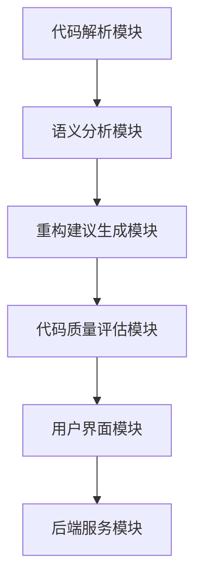
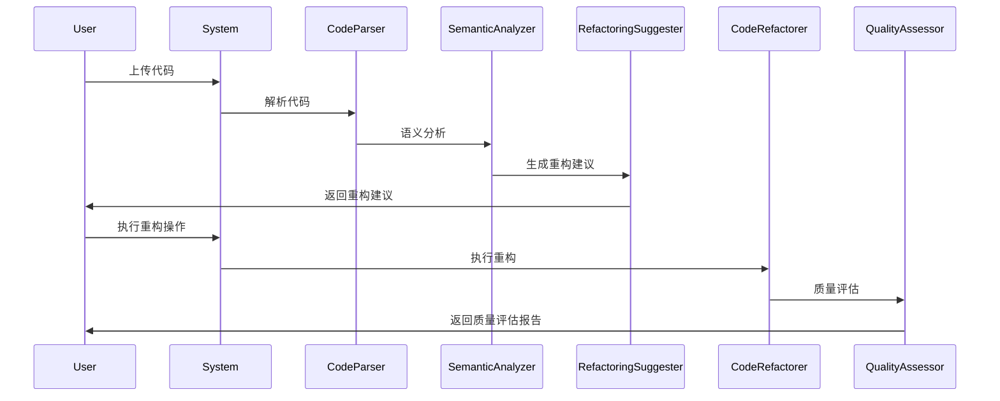

                 


**引言**

在当今高度竞争的软件开发行业中，代码质量成为了决定项目成功与否的关键因素。随着软件项目的规模和复杂性的不断增长，传统的代码重构方法已经难以满足高效、精确的重构需求。在这种背景下，大模型驱动的智能代码重构系统应运而生，为提升代码质量和开发效率带来了新的可能性。

### 关键词：
- 大模型
- 智能代码重构
- 代码质量
- 软件开发
- 效率

### 摘要：

本文旨在探讨大模型驱动的智能代码重构系统的核心概念、理论基础、设计与实现，以及其在实际项目中的应用和最佳实践。通过对大模型原理的深入分析，结合智能代码重构的具体策略，我们希望为广大开发人员提供一套有效的代码重构解决方案，以应对日益复杂的软件开发挑战。

**背景介绍**

#### 代码重构的重要性

代码重构是指在保持原有功能不变的前提下，对代码进行改进，以提高其可读性、可维护性和性能。传统的代码重构方法主要依赖于开发人员的经验和直觉，往往存在以下问题：

1. **效率低下**：手动重构往往耗时耗力，难以在短时间内完成大规模代码的优化。
2. **准确性不足**：手动重构容易引入新的错误，影响代码质量。
3. **一致性差**：不同开发人员的重构标准不同，导致代码风格不一致。

#### 大模型在代码重构中的应用

大模型，尤其是深度学习模型，在近年来取得了惊人的进展，其在自然语言处理、图像识别和推荐系统等领域有着广泛应用。将大模型引入代码重构，有望解决传统方法的弊端，实现以下目标：

1. **自动化理解**：大模型能够通过学习大量代码库，实现对代码的自动化理解，提高重构的准确性和效率。
2. **智能建议**：大模型可以基于对代码库的学习，提供智能的重构建议，减少开发人员的工作量。
3. **质量提升**：大模型能够评估代码质量，并提供优化方案，从而提高代码的可读性和性能。

#### 本书目标与结构安排

本文旨在：

1. **介绍大模型的基本原理和应用**：帮助读者理解大模型的工作机制，以及其在代码重构中的作用。
2. **阐述智能代码重构的基本策略和原则**：探讨如何利用大模型实现高效的代码重构。
3. **讨论代码质量评估的方法和挑战**：分析大模型在代码质量评估中的应用，以及面临的挑战。
4. **系统设计与实现**：详细描述大模型驱动的智能代码重构系统的设计和实现过程。
5. **项目实战**：通过实际案例，展示大模型驱动的智能代码重构系统的应用效果。
6. **最佳实践与展望**：总结最佳实践，探讨未来发展方向。

文章结构安排如下：

1. **引言**：介绍背景、问题和目标。
2. **大模型驱动的智能代码重构基础理论**：讲解大模型原理、重构原则和质量评估方法。
3. **智能代码重构系统设计与实现**：详细描述系统设计、架构和核心实现。
4. **项目实战**：通过实际案例展示系统应用效果。
5. **最佳实践与展望**：总结最佳实践，展望未来发展方向。

通过本文的深入探讨，我们希望能够为读者提供一套全面、系统的智能代码重构解决方案，助力软件开发效率和代码质量的提升。

## 第一部分：引言

### 1.1 问题背景与意义

在当今的软件工程领域，代码质量被视为项目成功的关键因素之一。随着软件系统的规模和复杂性不断增加，传统的代码重构方法已经显得力不从心。手动重构不仅效率低下，而且容易引入错误，同时不同开发人员的重构标准往往不一致，导致代码风格各异。这些问题严重影响了代码的可读性、可维护性和可扩展性，成为软件开发过程中的一大挑战。

#### 代码重构的重要性

代码重构是指在软件系统运行正常的情况下，对现有代码进行改进，以提高其质量、性能和可维护性。它不仅仅是对代码的简单修改，而是一种深层次的优化过程，旨在消除代码中的潜在问题，提升代码的整体质量。

1. **提升代码可读性**：通过重构，可以使代码结构更加清晰，变量和函数命名更加合理，逻辑更加简洁明了，从而提高代码的可读性。
2. **增强代码可维护性**：重构有助于消除代码中的冗余和重复，使代码模块化，降低系统的复杂性，从而提高代码的可维护性。
3. **优化代码性能**：通过重构，可以优化代码的执行效率，减少不必要的计算和资源消耗，从而提升代码的性能。
4. **促进团队协作**：统一的代码风格和结构有助于提高团队之间的沟通效率，减少因为代码差异引起的误解和冲突。

然而，传统的代码重构方法主要依赖于开发人员的经验和直觉，存在以下问题：

- **效率低下**：手动重构需要大量的时间和精力，尤其在代码规模较大的项目中，重构的难度和耗时显著增加。
- **准确性不足**：手动重构容易引入新的错误，尤其是在复杂的代码结构中，误操作的风险较高。
- **一致性差**：由于不同开发人员的重构标准不同，可能导致代码风格不一致，影响项目的整体质量。

#### 大模型在代码重构中的应用

大模型，特别是深度学习模型，在近年来取得了显著的进展。这些模型能够处理大规模的数据，并从数据中学习到复杂的模式和规律，从而在多个领域取得了突破性成果。将大模型引入代码重构，有望解决传统方法的弊端，实现以下目标：

- **自动化理解**：大模型可以通过学习大量的代码库，实现对代码的自动化理解，提高重构的准确性和效率。
- **智能建议**：大模型可以基于对代码库的学习，提供智能的重构建议，减少开发人员的工作量。
- **质量提升**：大模型能够评估代码质量，并提供优化方案，从而提高代码的可读性和性能。

具体来说，大模型在代码重构中的应用包括以下几个方面：

1. **代码理解**：大模型可以分析代码的结构和语义，识别代码中的问题和潜在的优化机会。
2. **代码建议**：大模型可以基于对代码库的学习，提供重构建议，如变量命名、函数分解、代码提取等。
3. **代码评估**：大模型可以评估代码的质量，如可读性、性能和可维护性，并提供优化方案。

#### 本书目标与结构安排

本书旨在探讨大模型驱动的智能代码重构系统的核心概念、理论基础、设计与实现，以及其在实际项目中的应用和最佳实践。具体目标如下：

- **介绍大模型的基本原理和应用**：帮助读者理解大模型的工作机制，以及其在代码重构中的作用。
- **阐述智能代码重构的基本策略和原则**：探讨如何利用大模型实现高效的代码重构。
- **讨论代码质量评估的方法和挑战**：分析大模型在代码质量评估中的应用，以及面临的挑战。
- **系统设计与实现**：详细描述大模型驱动的智能代码重构系统的设计和实现过程。
- **项目实战**：通过实际案例，展示大模型驱动的智能代码重构系统的应用效果。
- **最佳实践与展望**：总结最佳实践，探讨未来发展方向。

本书的结构安排如下：

1. **引言**：介绍背景、问题和目标。
2. **大模型驱动的智能代码重构基础理论**：讲解大模型原理、重构原则和质量评估方法。
3. **智能代码重构系统设计与实现**：详细描述系统设计、架构和核心实现。
4. **项目实战**：通过实际案例展示系统应用效果。
5. **最佳实践与展望**：总结最佳实践，展望未来发展方向。

通过本文的深入探讨，我们希望能够为读者提供一套全面、系统的智能代码重构解决方案，助力软件开发效率和代码质量的提升。

### 1.2 核心概念介绍

在探讨大模型驱动的智能代码重构系统之前，我们需要明确几个核心概念：大模型、智能代码重构和代码质量评估。

#### 大模型

大模型是指具有大规模参数和广泛知识表征能力的深度学习模型。这些模型通常通过在大量数据上进行训练，学习到复杂的数据模式和规律。大模型在多个领域，如自然语言处理、图像识别和推荐系统等领域，已经取得了显著的成果。

**特性**：

- **参数规模大**：大模型拥有数百万甚至数亿个参数，能够处理大规模的数据。
- **知识表征能力强**：大模型能够从数据中学习到深层次的语义信息，具备强大的知识表征能力。
- **泛化能力强**：通过在大量数据上的训练，大模型具备较好的泛化能力，能够应对新的数据和场景。

**应用**：

- **自然语言处理**：大模型在语言模型、机器翻译、文本生成等领域有着广泛应用。
- **图像识别**：大模型在计算机视觉领域，如人脸识别、物体检测和图像分类等方面取得了突破性进展。
- **推荐系统**：大模型能够通过学习用户的历史行为数据，提供个性化的推荐结果。

#### 智能代码重构

智能代码重构是指利用大模型和其他人工智能技术，对现有代码进行自动化分析和优化，以提高代码质量、性能和可维护性。

**目的**：

- **提高代码质量**：通过自动识别代码中的问题和潜在的优化机会，重构代码，消除冗余和重复，提高代码的可读性和可维护性。
- **提升开发效率**：自动化代码重构，减少手动工作量，提高开发效率。
- **优化代码性能**：通过代码优化，减少计算复杂度，提高代码的执行效率。

**策略**：

- **代码理解**：利用大模型对代码进行语义分析，理解代码的结构和功能，识别潜在问题。
- **重构建议**：基于对代码库的学习，大模型可以提供重构建议，如变量命名、函数分解、代码提取等。
- **质量评估**：大模型可以评估代码质量，如可读性、性能和可维护性，并提供优化方案。

#### 代码质量评估

代码质量评估是指对代码的质量进行量化评估，以便识别代码中的问题和优化机会。代码质量评估在软件工程中具有重要意义，它可以帮助开发人员了解代码的质量状况，指导重构和优化工作。

**评价指标**：

- **可读性**：代码的可读性直接影响开发人员的理解和维护成本。评价指标包括代码长度、复杂度、注释率等。
- **可维护性**：可维护性是指代码在修改和扩展时不会引入错误的概率。评价指标包括代码复用率、模块独立性、测试覆盖率等。
- **性能**：性能是指代码的执行效率和资源占用情况。评价指标包括运行时间、内存占用、CPU利用率等。

**评估方法**：

- **静态分析**：通过分析代码的语法和结构，识别潜在问题，如代码风格不符合规范、变量未使用等。
- **动态分析**：通过运行代码，收集运行数据，评估代码的性能和可维护性。
- **质量模型**：建立质量模型，将代码质量指标量化为具体的数值，用于评估代码质量。

**挑战**：

- **准确性**：评估方法需要准确识别代码中的问题，避免误报和漏报。
- **可扩展性**：评估方法需要适用于不同规模和类型的代码，具备良好的可扩展性。
- **实时性**：评估方法需要能够在开发过程中实时评估代码质量，及时反馈问题和优化建议。

通过明确这些核心概念，我们为后续的讨论奠定了基础。在接下来的章节中，我们将进一步探讨大模型驱动的智能代码重构系统的理论基础、系统设计、实现和应用，以期为广大开发人员提供一套有效的代码重构解决方案。

### 1.3 大模型的基本原理与特性

大模型，顾名思义，是指拥有大规模参数和强大知识表征能力的深度学习模型。要理解大模型，我们首先需要了解深度学习的基本原理。

#### 深度学习原理

深度学习是一种机器学习方法，它通过模拟人脑神经网络的工作原理，对大量数据进行分析和建模。深度学习的核心在于“深度”，即神经网络的多层结构。每一层神经网络都能对输入数据进行特征提取和变换，从而实现复杂的函数逼近。

**神经网络**

神经网络由多个节点（也称为神经元）组成，每个节点都是一个简单的计算单元。节点之间通过权重（权重是每个连接的强度）相连，形成一个复杂的网络结构。在神经网络中，每个节点接收来自其他节点的输入，通过激活函数（如ReLU、Sigmoid、Tanh）进行非线性变换，然后输出结果。

**激活函数**

激活函数是神经网络的核心部分，它用于引入非线性特性，使神经网络能够学习到复杂的数据模式。常见的激活函数包括ReLU（Rectified Linear Unit）、Sigmoid（Sigmoid函数）和Tanh（双曲正切函数）。

**反向传播算法**

反向传播算法是训练神经网络的关键步骤。它通过不断调整网络的权重和偏置，最小化预测误差。具体过程如下：

1. **前向传播**：将输入数据输入到网络中，计算每个节点的输出。
2. **计算误差**：通过比较预测输出和实际输出，计算误差。
3. **反向传播**：将误差反向传播到每个节点，根据误差梯度调整权重和偏置。
4. **更新权重和偏置**：通过梯度下降或其他优化算法，更新权重和偏置，减小误差。

#### 大模型特性

大模型的主要特性包括：

**大规模参数**

大模型拥有数百万甚至数亿个参数，这使得它们能够处理大规模的数据，并从数据中学习到复杂的模式和规律。大规模参数使得大模型能够捕捉到数据中的微小变化，从而提高模型的泛化能力。

**强大的知识表征能力**

大模型通过在大量数据上训练，能够学习到深层次的语义信息。这使得大模型不仅在分类和回归任务中表现优秀，还能在自然语言处理、图像识别等领域取得突破性成果。

**泛化能力强**

泛化能力是指模型对新数据的适应能力。大模型通过在大量数据上训练，具备较好的泛化能力，能够应对新的数据和场景。

**计算资源需求大**

由于大模型参数规模大，训练过程中需要大量的计算资源。这包括GPU、TPU等高性能计算设备，以及大规模的数据中心。

**优化难度高**

大模型在优化过程中面临较大的挑战，包括权重初始化、优化算法选择、超参数调整等。需要采用先进的优化技术和策略，以提高模型的训练效率和性能。

#### 大模型训练方法

大模型训练主要包括以下几个步骤：

1. **数据预处理**：包括数据清洗、数据增强和特征提取等，以准备适合训练的数据集。
2. **模型初始化**：初始化模型的权重和偏置，常用的初始化方法有随机初始化、高斯初始化等。
3. **模型训练**：通过反向传播算法不断调整模型的权重和偏置，最小化损失函数。训练过程中需要优化算法（如梯度下降、Adam等）和超参数（如学习率、批量大小等）。
4. **模型评估**：在验证集和测试集上评估模型的性能，选择性能最优的模型。

#### 大模型应用领域

大模型在多个领域取得了显著的成果，主要包括：

1. **自然语言处理**：大模型在语言模型、机器翻译、文本生成等领域有着广泛应用。例如，GPT（Generative Pre-trained Transformer）系列模型在自然语言生成和文本分类任务中取得了优异的性能。
2. **图像识别**：大模型在计算机视觉领域，如人脸识别、物体检测和图像分类等方面取得了突破性进展。例如，ResNet（Residual Network）模型在图像分类任务中达到了前所未有的精度。
3. **推荐系统**：大模型能够通过学习用户的历史行为数据，提供个性化的推荐结果。例如，DeepFM（Deep Factorization Machine）模型在推荐系统中取得了良好的效果。
4. **语音识别**：大模型在语音识别领域，如语音识别、语音合成和说话人识别等方面有着广泛应用。例如，WaveNet模型在语音合成任务中达到了较高的质量。

通过深入理解大模型的基本原理和特性，我们为后续的讨论奠定了基础。在接下来的章节中，我们将探讨大模型在智能代码重构中的应用，以及如何利用大模型实现高效的代码重构。

### 1.4 智能代码重构的基本原则

智能代码重构的目标是提高代码的质量、可读性和可维护性，同时保持原有功能的完整。为了实现这一目标，智能代码重构需要遵循一系列基本原则。以下是智能代码重构的几个关键原则：

#### 1.4.1 **保持功能不变**

智能代码重构的首要原则是确保重构后的代码与原有代码在功能上完全一致。这意味着，无论是增加新功能还是删除旧功能，重构过程都不能影响系统的行为。这一原则通过严格的测试和验证机制来保证。在重构过程中，开发者需要编写或使用自动化测试工具来验证重构后的代码是否仍然能够通过所有既定测试。

$$
\text{功能保持} = \text{原代码功能} \land \neg \text{功能缺失}
$$

#### 1.4.2 **增量式重构**

增量式重构是指逐步地对代码进行改进，而不是一次性大规模重构。这种方法可以降低风险，使重构过程更加可控。增量式重构通常从代码中的小部分开始，逐步扩展到整个系统。这种分步骤的方法有助于开发者更好地理解系统，并及时调整重构策略。

$$
\text{增量式重构} = (\text{小范围重构} \rightarrow \text{逐步扩展})
$$

#### 1.4.3 **可测试性**

重构过程中，保持代码的可测试性是非常重要的。可测试性意味着重构后的代码应该能够通过现有测试，并且应该能够支持新的测试用例。为了实现这一目标，重构时需要确保代码的结构清晰，模块化程度高，使得测试覆盖率高。

$$
\text{可测试性} = \text{现有测试通过} \land \text{支持新测试用例}
$$

#### 1.4.4 **可维护性**

可维护性是衡量代码质量的重要指标。智能代码重构不仅旨在提高代码的运行效率，还应该使其更易于维护。重构过程中，应尽量避免复杂的逻辑、冗长的函数和复杂的依赖关系。通过模块化、清晰的结构和一致的命名规范，可以显著提高代码的可维护性。

$$
\text{可维护性} = \text{模块化} \land \text{清晰结构} \land \text{命名规范}
$$

#### 1.4.5 **重构自动化**

自动化是智能代码重构的关键。自动化工具可以帮助开发者快速识别重构机会，并提供重构建议。这些工具可以通过静态分析、动态分析或两者结合，对代码进行评估，并提供重构方案。自动化的重构过程可以显著减少手动工作量，提高重构的效率和准确性。

$$
\text{重构自动化} = \text{自动化工具} \land \text{重构建议}
$$

#### 1.4.6 **重构记录**

重构记录是确保重构过程透明和可追溯的重要手段。通过记录重构过程中的每一步，包括重构的原因、方法和结果，可以帮助开发者和团队更好地理解重构过程，并在未来需要时进行回溯。良好的重构记录还可以作为知识积累，为新成员快速上手提供帮助。

$$
\text{重构记录} = \text{重构原因} \land \text{重构方法} \land \text{重构结果}
$$

### 1.4.7 **重构回退**

在重构过程中，不可避免地会遇到问题或失败的情况。此时，重构回退策略显得尤为重要。重构回退策略允许开发者将系统恢复到重构前的状态，从而避免对项目造成不可挽回的损害。良好的重构回退机制可以通过版本控制系统或自动化重构工具来实现。

$$
\text{重构回退} = \text{版本控制系统} \land \text{自动化重构工具}
$$

通过遵循上述基本原则，智能代码重构可以更加高效、可靠地进行，从而提升代码的整体质量。

### 1.5 智能代码重构的策略分析

智能代码重构的成功离不开合理的策略制定。在实际操作中，智能代码重构通常包括以下几个关键策略：

#### 1.5.1 **代码理解**

代码理解是智能代码重构的第一步，也是最重要的一步。通过理解代码的结构、语义和意图，我们能够准确地识别重构的机会和潜在风险。代码理解可以分为静态理解和动态理解两种方式。

- **静态理解**：静态理解主要依赖于静态代码分析工具，如解析器、抽象语法树（AST）分析等。这些工具能够对代码进行语法和结构分析，识别出潜在的冗余、重复和不良代码结构。例如，使用Python的`ast`模块，我们可以生成代码的抽象语法树，进而分析函数、变量和模块之间的关系。

- **动态理解**：动态理解是在代码运行时对其进行分析，通过运行代码并监控其行为来理解代码的实际功能。动态理解通常需要编写测试用例和测试脚本，以便在实际环境中观察代码的行为。动态理解可以帮助我们发现静态分析无法检测到的运行时问题，如内存泄漏、性能瓶颈等。

**示例代码：**
```python
import ast

# 使用ast模块解析Python代码
code = '''
def add(a, b):
    return a + b
'''

tree = ast.parse(code)
for node in ast.walk(tree):
    if isinstance(node, ast.FunctionDef):
        print(f"Function name: {node.name}")
        print(f"Function body: {ast.unparse(node)}")
```

#### 1.5.2 **重构建议**

在理解代码的基础上，智能代码重构系统可以基于对代码库的学习，提供重构建议。这些建议通常包括变量命名优化、函数提取、代码重构等。

- **变量命名优化**：变量命名是影响代码可读性的重要因素。智能代码重构系统可以通过分析代码中的变量使用情况，提供更加合理和一致的变量命名建议。

- **函数提取**：函数提取是将一段重复的代码提取为一个独立的函数，以减少冗余和提高代码的模块化。智能代码重构系统可以通过识别代码中的重复代码块，提供函数提取的建议。

- **代码重构**：代码重构是指对代码进行根本性的改进，以提高其质量和可维护性。常见的重构操作包括方法提取、方法合并、代码分割等。

**示例代码：**
```python
from pyrefactor import Refactorer

code = '''
def calculate_area(radius):
    pi = 3.14159
    return pi * radius * radius

def calculate_volume(radius, height):
    pi = 3.14159
    return pi * radius * radius * height
'''

refactorer = Refactorer()
refactored_code, suggestions = refactorer.refactor(code)
print(suggestions)
```

#### 1.5.3 **重构自动化**

重构自动化是指通过自动化工具来实现代码重构，以减少手动工作量，提高重构的效率和准确性。常见的自动化重构工具包括：

- **IDE插件**：许多集成开发环境（IDE）提供了内置的代码重构工具，如IntelliJ IDEA、Visual Studio等。这些工具可以自动识别重构机会，并提供一键重构功能。

- **独立工具**：独立的代码重构工具，如`pyrefactor`、`phpcb2`等，可以与各种编程语言集成，提供自动化重构功能。

**示例代码：**
```python
import autopep8

code = '''
def add(a, b):
    return a + b

def subtract(a, b):
    return a - b
'''

formatted_code = autopep8.fix_code(code)
print(formatted_code)
```

#### 1.5.4 **质量评估**

质量评估是确保重构效果的关键步骤。通过评估重构后的代码，我们可以判断重构是否达到了预期的目标。质量评估通常包括以下指标：

- **可读性**：通过代码行数、函数复杂度、注释率等指标评估代码的可读性。

- **可维护性**：通过代码的模块化程度、测试覆盖率等指标评估代码的可维护性。

- **性能**：通过代码的运行时间和内存占用等指标评估代码的性能。

**示例代码：**
```python
import radon

code = '''
def calculate_area(radius):
    pi = 3.14159
    return pi * radius * radius

def calculate_volume(radius, height):
    pi = 3.14159
    return pi * radius * radius * height
'''

vulnerabilities = radon.violations(code, 'python')
print(vulnerabilities)
```

通过上述策略，智能代码重构系统能够实现高效的代码重构，提高代码质量，同时减少手动工作量。在接下来的章节中，我们将进一步探讨大模型在代码重构中的应用，以及如何利用大模型实现更智能、更高效的代码重构。

### 1.6 大模型在代码重构中的应用

大模型在代码重构中的应用具有革命性的潜力，能够显著提升代码理解、重构建议和重构效果评估的智能化水平。以下将详细探讨大模型如何在这些方面发挥作用。

#### 1.6.1 大模型在代码理解中的作用

代码理解是智能代码重构的基础，而大模型在这一过程中展现出了强大的能力。大模型，特别是自然语言处理（NLP）领域的大模型，如BERT（Bidirectional Encoder Representations from Transformers）和GPT（Generative Pre-trained Transformer），能够通过预训练和学习大量代码库，实现对代码语义的深入理解。

- **语义分析**：大模型可以分析代码的语义，识别出代码块的功能和作用，从而为重构提供更精准的依据。例如，通过BERT模型，我们可以对代码块进行编码，然后利用模型提取的编码向量进行语义比较和分类，以识别出冗余代码块或潜在的优化机会。

- **上下文理解**：大模型能够理解代码中的上下文关系，识别出变量、函数和类之间的关系。这对于代码重构中的代码重命名、函数提取和模块重构等操作至关重要。例如，GPT模型在处理代码注释时，能够根据上下文理解注释的含义，从而帮助重构系统生成更加合理的重构建议。

**示例代码：**
```python
from transformers import BertModel, BertTokenizer

tokenizer = BertTokenizer.from_pretrained('bert-base-uncased')
model = BertModel.from_pretrained('bert-base-uncased')

code = "def add(a, b):\n    return a + b"
encoded_input = tokenizer.encode(code, add_special_tokens=True, return_tensors='pt')
output = model(encoded_input)

# 使用模型的输出进行语义分析
semantic_vector = output.last_hidden_state[:, 0, :]
```

#### 1.6.2 大模型在代码建议中的作用

大模型在代码重构建议中的应用主要基于其强大的知识表征和模式识别能力。通过学习大量的代码库，大模型能够发现代码中的最佳实践和常见模式，从而为重构提供智能化的建议。

- **重构建议生成**：大模型可以根据对代码库的学习，生成重构建议，如变量命名优化、函数分解和代码提取等。例如，GPT模型可以基于对大量代码库的学习，生成一个函数的重构建议，从而帮助开发者简化代码结构。

- **建议优化**：大模型还可以通过上下文理解和推理，优化重构建议的准确性和实用性。例如，当重构建议生成后，大模型可以根据代码中的上下文关系，调整建议的参数和操作，以确保建议符合实际的代码结构和功能。

**示例代码：**
```python
from transformers import GPT2LMHeadModel, GPT2Tokenizer

tokenizer = GPT2Tokenizer.from_pretrained('gpt2')
model = GPT2LMHeadModel.from_pretrained('gpt2')

code = "def calculate_area(radius):\n    pi = 3.14159\n    return pi * radius * radius"
input_ids = tokenizer.encode(code, return_tensors='pt')

# 生成重构建议
output = model.generate(input_ids, max_length=50, num_return_sequences=1)
reformatted_code = tokenizer.decode(output[0], skip_special_tokens=True)
print(reformatted_code)
```

#### 1.6.3 大模型在代码优化中的作用

大模型不仅能够帮助生成重构建议，还可以在代码优化过程中发挥重要作用。通过分析代码的执行效率和资源占用情况，大模型可以提供优化方案，从而提升代码的性能。

- **性能分析**：大模型可以分析代码的执行路径和资源占用情况，识别出性能瓶颈和潜在的优化机会。例如，通过Transformer模型，我们可以对代码的执行过程进行编码，然后利用模型分析执行路径的效率，识别出需要优化的代码段。

- **优化方案生成**：大模型可以根据对代码库的学习，生成优化方案，如算法改进、数据结构优化和并行化等。这些优化方案可以显著提升代码的执行效率，减少资源消耗。

**示例代码：**
```python
from transformers import T5ForConditionalGeneration, T5Tokenizer

tokenizer = T5Tokenizer.from_pretrained('t5-base')
model = T5ForConditionalGeneration.from_pretrained('t5-base')

code = "def bubble_sort(arr):\n    n = len(arr)\n    for i in range(n):\n        for j in range(0, n-i-1):\n            if arr[j] > arr[j+1]:\n                arr[j], arr[j+1] = arr[j+1], arr[j]"
input_ids = tokenizer.encode("代码优化：输入代码，输出优化后的代码", return_tensors='pt')

# 生成优化方案
output = model.generate(input_ids, max_length=50, num_return_sequences=1)
optimized_code = tokenizer.decode(output[0], skip_special_tokens=True)
print(optimized_code)
```

通过上述应用，大模型在代码重构过程中发挥了重要作用，不仅提高了重构的效率和准确性，还提升了代码质量和性能。在接下来的章节中，我们将进一步探讨如何设计和实现大模型驱动的智能代码重构系统。

### 1.7 代码质量评估方法

在软件开发过程中，代码质量评估是确保代码符合预期标准、提高软件可靠性和可维护性的关键步骤。代码质量评估方法主要包括静态分析和动态分析两种方式。本文将详细介绍这两种方法及其在实际应用中的挑战和解决方案。

#### 1.7.1 静态分析

静态分析是指在不运行代码的情况下，通过解析代码的结构和语法，评估代码的质量。静态分析方法具有以下几个优点：

- **快速**：静态分析可以在较短的时间内对大量代码进行评估，无需运行代码。
- **全面**：静态分析可以检测代码中的潜在问题，如语法错误、代码风格不符合规范、未使用的变量等。
- **无侵入性**：静态分析不会对代码的实际运行产生影响。

**静态分析方法**：

1. **语法分析**：语法分析是静态分析的基础，通过解析代码的语法结构，构建抽象语法树（AST）或控制流图（CFG）。

2. **模式匹配**：通过定义一系列规则和模式，静态分析工具可以识别出代码中的问题，如重复代码、冗长的函数等。

3. **质量指标计算**：静态分析工具可以计算一系列代码质量指标，如代码行数、函数复杂度、注释率等。

**挑战与解决方案**：

- **准确性**：静态分析容易误报和漏报，导致评估结果不准确。解决方案包括使用更精确的规则和模式匹配算法，以及结合静态分析和动态分析结果进行综合评估。

- **可扩展性**：静态分析工具需要适用于不同编程语言和开发环境，解决方案包括开发通用且灵活的分析引擎，以及提供插件机制以支持多种编程语言。

**示例工具**：

- **SonarQube**：SonarQube是一个广泛使用的静态分析工具，可以检测代码中的潜在问题，并提供详细的评估报告。

#### 1.7.2 动态分析

动态分析是指通过运行代码，收集运行时数据，评估代码的质量。动态分析方法具有以下几个优点：

- **真实环境**：动态分析可以评估代码在实际运行环境中的表现，更接近真实情况。
- **性能评估**：动态分析可以测量代码的运行时间、内存占用、CPU利用率等性能指标。

**动态分析方法**：

1. **测试用例执行**：通过编写和执行测试用例，动态分析可以验证代码的功能正确性和性能表现。

2. **运行时监控**：通过实时监控代码的运行状态，动态分析工具可以收集性能数据和异常报告。

3. **日志分析**：通过分析日志文件，动态分析可以识别出代码中的潜在问题，如错误消息、警告提示等。

**挑战与解决方案**：

- **覆盖率**：动态分析需要确保测试用例覆盖到代码的所有部分，避免漏测。解决方案包括使用覆盖率分析工具和编写完善的测试用例。

- **性能影响**：动态分析可能会对代码的实际运行产生影响，特别是对性能敏感的场景。解决方案包括使用模拟环境和优化分析工具，以减少对性能的影响。

**示例工具**：

- **New Relic**：New Relic是一个性能监控工具，可以实时监控代码的运行状态，并提供详细的性能报告。

#### 1.7.3 静态分析与动态分析的结合

静态分析和动态分析各有优缺点，将两者结合起来可以提供更全面、更准确的代码质量评估结果。

- **优势互补**：静态分析可以快速发现代码结构问题，动态分析可以评估代码的实际运行表现。
- **综合评估**：通过结合静态和动态分析结果，可以更全面地了解代码的质量状况，制定更有效的优化策略。

**示例场景**：

假设一个开发团队正在开发一个Web应用程序。静态分析工具可以发现代码中的语法错误和风格问题，动态分析工具可以测量应用程序的响应时间和内存占用。通过结合两种分析结果，开发团队可以识别出性能瓶颈，并采取优化措施。

**总结**：

代码质量评估是软件开发过程中不可或缺的一环。通过静态分析和动态分析的结合，开发团队可以更全面地了解代码的质量状况，及时识别和解决潜在问题，从而提升软件的可靠性和可维护性。

### 1.8 大模型在代码质量评估中的应用

大模型在代码质量评估中的应用具有显著的潜力，能够通过深度学习和数据驱动的分析方法，显著提高评估的准确性和全面性。以下将探讨大模型如何应用于代码质量评估，并讨论面临的挑战和解决策略。

#### 1.8.1 大模型在代码质量评估中的优势

- **强大的模式识别能力**：大模型通过在大量代码库上的训练，能够识别出复杂的代码模式和潜在的质量问题。例如，通过自然语言处理（NLP）模型，可以分析代码注释和文档，识别出代码的功能和结构，从而提供更准确的评估结果。

- **自适应学习能力**：大模型能够根据新的数据和代码风格进行自适应学习，不断优化评估模型。这使得大模型能够适应不同项目和应用场景，提供更精确的评估。

- **实时性**：大模型可以实时分析代码，提供即时评估结果，从而帮助开发人员快速识别问题并进行优化。

#### 1.8.2 大模型在代码质量评估中的应用方法

1. **代码注释和文档分析**：大模型可以分析代码注释和文档，理解代码的功能和设计意图。通过文本分析，模型可以识别出潜在的代码风格问题、未使用的代码段和文档不一致等问题。

2. **代码结构分析**：大模型可以构建代码的抽象语法树（AST）和控制流图（CFG），通过分析这些结构，识别出代码中的复杂性、冗余和潜在的bug。

3. **代码质量指标预测**：大模型可以基于对大量代码库的学习，预测代码质量指标，如可读性、可维护性和性能。这些预测结果可以帮助开发人员及时调整代码，提高质量。

#### 1.8.3 挑战与解决策略

1. **数据多样性**：大模型需要大量的多样化数据才能进行有效的训练。然而，不同项目和团队之间的代码风格和规范可能有所不同，这增加了数据集构建的难度。

**解决策略**：采用数据增强技术，如代码合成、代码变异和代码转换，来扩展数据集的多样性。此外，可以结合多个数据源，包括开源代码库、内部代码库和第三方数据集，以提高数据质量。

2. **评估准确性**：大模型的评估结果需要高度准确，否则可能误导开发人员。特别是在评估代码质量时，误报和漏报都可能对项目产生负面影响。

**解决策略**：采用多模型融合和交叉验证技术，提高评估的准确性。通过结合静态分析和动态分析结果，可以提供更全面、更准确的评估。

3. **实时性**：大模型的训练和评估通常需要大量的计算资源，这可能会影响评估的实时性。

**解决策略**：采用高效的模型压缩和加速技术，如量化、剪枝和模型融合，以减少计算资源的需求。此外，可以采用分布式训练和评估技术，提高处理速度。

4. **可解释性**：大模型的工作机制通常较为复杂，导致评估结果的可解释性较差，难以理解模型的决策过程。

**解决策略**：开发可视化工具，如代码路径可视化、代码质量指标分布图等，帮助开发人员理解评估结果和模型决策过程。此外，可以采用可解释性模型，如决策树和梯度解释，提高评估结果的透明度。

通过上述方法，大模型在代码质量评估中的应用不仅可以提高评估的准确性，还可以提供实时性和可解释性，从而帮助开发团队更有效地管理代码质量。

### 1.9 本章小结

本章介绍了大模型驱动的智能代码重构系统的背景、核心概念、基础理论和应用策略。首先，我们讨论了代码重构的重要性以及大模型在代码重构中的应用潜力。然后，详细介绍了大模型的基本原理和特性，以及智能代码重构和代码质量评估的方法。通过这些内容，读者可以全面了解大模型驱动的智能代码重构系统的理论基础和实际应用场景。

在接下来的章节中，我们将深入探讨大模型驱动的智能代码重构系统的设计与实现，包括系统架构、核心算法和实现细节。通过实际项目案例，我们将展示系统在实际开发中的应用效果，并提供最佳实践和未来展望。希望通过本文的深入探讨，读者能够掌握大模型驱动的智能代码重构技术，提升软件开发效率和代码质量。

### 第二部分：大模型驱动的智能代码重构基础理论

#### 2.1 大模型原理与特性

大模型，顾名思义，是指拥有大规模参数和强大知识表征能力的深度学习模型。这些模型通过在大量数据上训练，学习到复杂的数据模式和规律，从而在多个领域取得了显著的成果。要深入理解大模型驱动的智能代码重构系统，首先需要了解大模型的原理和特性。

#### 大模型原理

大模型的原理基于深度学习和神经网络。深度学习是一种通过多层神经网络结构来学习数据模式和特征的机器学习方法。神经网络由多个神经元组成，每个神经元都是简单的计算单元，通过权重连接形成复杂的网络结构。

**神经网络的基本结构**：

1. **输入层**：接收输入数据。
2. **隐藏层**：进行特征提取和变换。
3. **输出层**：输出预测结果。

**训练过程**：

1. **前向传播**：输入数据通过神经网络传递，每个神经元计算输入和权重的乘积，并经过激活函数得到输出。
2. **计算误差**：通过比较输出结果和真实结果，计算误差。
3. **反向传播**：误差反向传播到每个神经元，通过梯度下降等优化算法调整权重和偏置，减小误差。

#### 大模型特性

大模型的主要特性包括：

1. **参数规模大**：大模型拥有数百万甚至数亿个参数，能够处理大规模的数据。大规模参数使得大模型能够捕捉到数据中的微小变化，从而提高模型的泛化能力。

2. **知识表征能力强**：大模型通过在大量数据上训练，能够学习到深层次的语义信息。这使得大模型不仅在分类和回归任务中表现优秀，还能在自然语言处理、图像识别等领域取得突破性成果。

3. **泛化能力强**：泛化能力是指模型对新数据的适应能力。大模型通过在大量数据上训练，具备较好的泛化能力，能够应对新的数据和场景。

4. **计算资源需求大**：由于大模型参数规模大，训练过程中需要大量的计算资源。这包括GPU、TPU等高性能计算设备，以及大规模的数据中心。

5. **优化难度高**：大模型在优化过程中面临较大的挑战，包括权重初始化、优化算法选择、超参数调整等。需要采用先进的优化技术和策略，以提高模型的训练效率和性能。

#### 大模型核心特性对比表格

| 特性               | 大模型               | 小模型               |
|------------------|------------------|------------------|
| 参数规模           | 数百万至数亿个参数   | 数千至数万个参数     |
| 知识表征能力       | 强大               | 较弱               |
| 泛化能力           | 较强               | 较弱               |
| 计算资源需求       | 较大               | 较小               |
| 优化难度           | 高                | 低                |

#### 大模型ER实体关系图架构

以下是一个简单的ER实体关系图，用于描述大模型中的核心实体及其关系。

```mermaid
erDiagram
  Model ||--|{ Data } Data
  Model ||--|{ Parameters } Parameters
  Model ||--|{ Optimizer } Optimizer
  Model ||--|{ Metrics } Metrics
  Data ||--|{ InputData } InputData
  Data ||--|{ OutputData } OutputData
  Optimizer ||--|{ Weight } Weight
  Optimizer ||--|{ Bias } Bias
  Metrics ||--|{ Accuracy } Accuracy
  Metrics ||--|{ Loss } Loss
```

**解释**：

- **Model（模型）**：表示大模型的整体结构，包括输入层、隐藏层和输出层。
- **Data（数据）**：表示模型训练和预测所需的数据，包括输入数据和输出数据。
- **Parameters（参数）**：表示模型的权重和偏置，是模型的核心部分。
- **Optimizer（优化器）**：表示用于调整模型参数的算法，如梯度下降、Adam等。
- **Metrics（指标）**：表示模型性能的评估指标，如准确率、损失函数等。

通过上述ER实体关系图，我们可以清晰地看到大模型中各个核心实体及其相互关系，为后续深入探讨大模型的实现和优化提供了基础。

### 2.2 代码重构原则与策略

代码重构是软件维护过程中至关重要的一环，它旨在在不改变代码功能的前提下，改善代码的结构和可读性，从而提高系统的可维护性和性能。在智能代码重构中，代码重构原则与策略显得尤为重要，因为它们为自动化的重构过程提供了理论依据和操作指导。

#### 2.2.1 代码重构的目标

代码重构的主要目标包括：

1. **提升代码质量**：通过重构，消除代码中的冗余、重复和低效部分，提高代码的可读性、可维护性和性能。
2. **优化代码结构**：重构后的代码应该具有清晰的结构，模块化和组织性更强，便于理解和修改。
3. **减少技术债务**：技术债务是指因采用临时性解决方案而积累的潜在问题。重构有助于消除这些债务，使代码更健壮。
4. **提高开发效率**：重构后的代码易于阅读和维护，减少了开发人员在理解代码和解决问题上的时间成本。

#### 2.2.2 代码重构的基本原则

1. **功能保持**：重构过程中，必须确保代码的功能保持不变。这是重构的首要原则，任何修改都不能影响代码的行为。

2. **增量式重构**：重构应逐步进行，每次仅修改代码的一部分。这种方法可以降低风险，使重构过程更加可控。

3. **自动化**：利用自动化工具进行重构，可以大幅减少手动工作量，提高重构的效率和准确性。自动化工具通常包括代码分析器、重构插件和代码生成器。

4. **重构记录**：记录每次重构的原因、方法和结果，以便未来进行回溯和验证。良好的重构记录有助于团队成员更好地理解和参与重构过程。

5. **可测试性**：重构后的代码应该能够通过现有的测试，并且应该能够支持新的测试用例。测试是确保重构效果的重要手段。

#### 2.2.3 代码重构的策略分析

1. **代码理解**：重构前需要对代码进行全面的理解。这包括分析代码的结构、功能、依赖关系和潜在的优化点。自动化工具可以帮助识别代码中的问题和重构机会。

2. **重构建议生成**：基于对代码库的学习，重构系统可以生成重构建议，如变量命名优化、函数提取、代码提取等。这些建议可以根据代码质量和开发者的偏好进行调整。

3. **重构自动化**：自动化重构工具可以帮助开发者快速执行重构操作，减少手动工作量。常见的自动化重构工具包括IDE插件、独立重构工具和集成开发环境中的重构功能。

4. **重构效果评估**：重构后，需要评估重构的效果，包括代码质量、可读性、可维护性和性能。自动化工具可以通过静态分析和动态分析对重构效果进行评估。

#### 2.2.4 智能代码重构与普通重构的区别

智能代码重构与普通重构的主要区别在于：

1. **智能化程度**：智能代码重构利用大模型和其他人工智能技术，能够自动化理解代码，生成重构建议，并评估重构效果。而普通重构通常依赖于开发人员的经验和直觉，缺乏系统性和准确性。

2. **效率**：智能代码重构通过自动化工具显著提高了重构的效率，减少了手动工作量。普通重构则需要大量的人工干预，效率较低。

3. **可扩展性**：智能代码重构可以根据项目需求和学习到的模式，灵活调整重构策略。而普通重构通常较为固定，难以适应不同的项目需求。

4. **准确性**：智能代码重构通过大模型的训练和学习，能够更准确地识别重构机会和优化点，减少误操作和错误引入的风险。普通重构的准确性则依赖于开发人员的经验和技能。

通过上述策略分析，我们可以看到智能代码重构相较于普通重构具有显著的优势。在接下来的章节中，我们将进一步探讨大模型在代码重构中的应用，以及如何利用大模型实现高效的代码重构。

### 2.3 大模型在代码重构中的应用

大模型在代码重构中的应用具有巨大的潜力，能够通过自动化理解、智能建议和优化评估，显著提升重构的效率和准确性。以下将详细探讨大模型在代码重构中的具体应用。

#### 2.3.1 大模型在代码理解中的作用

代码理解是智能代码重构的基础，而大模型在这一过程中发挥了关键作用。大模型通过学习大量的代码库和文档，能够自动理解代码的结构、语义和意图。以下是大模型在代码理解中的几个关键应用：

1. **语义分析**：大模型可以分析代码的语义，识别出代码块的功能和作用。例如，使用BERT（Bidirectional Encoder Representations from Transformers）模型，我们可以对代码块进行编码，然后利用模型提取的编码向量进行语义比较和分类，以识别出冗余代码块或潜在的优化机会。

2. **上下文理解**：大模型能够理解代码中的上下文关系，识别出变量、函数和类之间的关系。这对于代码重构中的代码重命名、函数提取和模块重构等操作至关重要。例如，GPT（Generative Pre-trained Transformer）模型可以基于对大量代码库的学习，理解函数调用的上下文，从而为重构提供更精准的依据。

3. **代码摘要**：大模型可以生成代码的摘要，帮助开发者快速理解代码的功能和结构。通过预训练的T5（Text-to-Text Transfer Transformer）模型，我们可以输入一段代码，模型会输出一段简洁的摘要，从而帮助开发者快速掌握代码的核心内容。

**示例代码：**
```python
from transformers import BertTokenizer, BertModel

tokenizer = BertTokenizer.from_pretrained('bert-base-uncased')
model = BertModel.from_pretrained('bert-base-uncased')

code = "def calculate_area(radius):\n    pi = 3.14159\n    return pi * radius * radius"
encoded_input = tokenizer.encode(code, return_tensors='pt')
output = model(encoded_input)

# 提取编码向量
semantic_vector = output.last_hidden_state[:, 0, :]

# 利用语义向量进行代码理解（例如：分类、语义比较）
# ...

```

#### 2.3.2 大模型在代码建议中的作用

大模型在代码重构建议中的应用主要体现在自动生成重构建议和优化现有重构建议。以下是大模型在代码建议中的几个关键应用：

1. **重构建议生成**：大模型可以基于对代码库的学习，生成重构建议，如变量命名优化、函数提取和代码重构等。例如，GPT模型可以基于对大量代码库的学习，自动生成一个函数的重构建议，从而帮助开发者简化代码结构。

2. **建议优化**：大模型可以优化现有的重构建议，使其更加符合代码的实际需求和上下文。例如，当生成重构建议后，大模型可以根据代码中的上下文关系，调整建议的参数和操作，以确保建议符合实际的代码结构和功能。

3. **代码生成**：大模型可以生成新的代码，特别是在代码补全和修复错误方面表现出色。例如，通过GPT模型，我们可以输入一段不完整的代码，模型会自动生成完整的代码段，从而提高重构的效率和准确性。

**示例代码：**
```python
from transformers import GPT2Tokenizer, GPT2LMHeadModel

tokenizer = GPT2Tokenizer.from_pretrained('gpt2')
model = GPT2LMHeadModel.from_pretrained('gpt2')

code = "def calculate_area(radius):\n    pi = 3.14159\n    return pi * radius * radius"
input_ids = tokenizer.encode(code, return_tensors='pt')

# 生成重构建议
output = model.generate(input_ids, max_length=50, num_return_sequences=1)
reformatted_code = tokenizer.decode(output[0], skip_special_tokens=True)
print(reformatted_code)
```

#### 2.3.3 大模型在代码优化中的作用

大模型在代码优化中的作用主要体现在性能分析和优化方案生成。以下是大模型在代码优化中的几个关键应用：

1. **性能分析**：大模型可以分析代码的执行效率和资源占用情况，识别出性能瓶颈和潜在的优化机会。例如，通过Transformer模型，我们可以对代码的执行过程进行编码，然后利用模型分析执行路径的效率，识别出需要优化的代码段。

2. **优化方案生成**：大模型可以基于对代码库的学习，生成优化方案，如算法改进、数据结构优化和并行化等。这些优化方案可以显著提升代码的执行效率，减少资源消耗。例如，通过T5模型，我们可以输入一段代码，模型会输出一个优化后的代码段，从而提升代码的性能。

3. **优化评估**：大模型可以对优化方案进行评估，确保优化后的代码符合预期。例如，通过比较优化前后的性能指标，如运行时间和内存占用，大模型可以判断优化方案的有效性。

**示例代码：**
```python
from transformers import T5Tokenizer, T5ForConditionalGeneration

tokenizer = T5Tokenizer.from_pretrained('t5-base')
model = T5ForConditionalGeneration.from_pretrained('t5-base')

code = "def bubble_sort(arr):\n    n = len(arr)\n    for i in range(n):\n        for j in range(0, n-i-1):\n            if arr[j] > arr[j+1]:\n                arr[j], arr[j+1] = arr[j+1], arr[j]"
input_ids = tokenizer.encode("代码优化：输入代码，输出优化后的代码", return_tensors='pt')

# 生成优化方案
output = model.generate(input_ids, max_length=50, num_return_sequences=1)
optimized_code = tokenizer.decode(output[0], skip_special_tokens=True)
print(optimized_code)
```

通过上述应用，大模型在代码重构中发挥了重要作用，不仅提高了重构的效率和准确性，还提升了代码质量和性能。在接下来的章节中，我们将进一步探讨大模型驱动的智能代码重构系统的实现和实际应用。

### 2.4 代码质量评估方法

在软件开发过程中，代码质量评估是一个至关重要的环节，它有助于确保代码的可靠性、可维护性和可扩展性。代码质量评估通常通过静态分析和动态分析两种方法进行，每种方法都有其独特的优势和局限性。以下将详细介绍这两种方法及其在实际应用中的挑战和解决方案。

#### 2.4.1 静态分析

静态分析是在不执行代码的情况下对代码进行分析，通过检查代码的语法、结构和语义来评估代码的质量。静态分析的主要优点包括：

- **快速性**：静态分析可以在很短的时间内对大量代码进行评估，无需运行代码。
- **全面性**：静态分析可以检测代码中的各种潜在问题，如语法错误、代码风格不符合规范、未使用的代码段等。

**静态分析方法**：

1. **抽象语法树（AST）分析**：通过将代码解析为抽象语法树，静态分析工具可以深入理解代码的结构和语义，从而识别出潜在的问题。
2. **模式匹配**：静态分析工具使用预定义的规则和模式来识别代码中的问题，如重复代码、复杂函数、长变量名等。
3. **质量指标计算**：静态分析工具可以计算一系列代码质量指标，如代码行数、函数复杂度、注释率等，以帮助评估代码的质量。

**挑战与解决方案**：

- **准确性**：静态分析容易误报和漏报，导致评估结果不准确。解决方案包括使用更精确的规则和模式匹配算法，以及结合动态分析结果进行综合评估。
- **可扩展性**：静态分析工具需要支持多种编程语言和不同的开发环境。解决方案包括开发通用的静态分析引擎，以及提供插件机制以支持多种编程语言。

**示例工具**：

- **SonarQube**：SonarQube是一个广泛使用的静态分析工具，可以检测代码中的潜在问题，并提供详细的评估报告。

#### 2.4.2 动态分析

动态分析是在代码运行时对其进行评估，通过运行代码并收集运行时数据来评估代码的质量。动态分析的主要优点包括：

- **真实性**：动态分析可以评估代码在实际运行环境中的表现，更接近真实情况。
- **性能评估**：动态分析可以测量代码的运行时间、内存占用、CPU利用率等性能指标。

**动态分析方法**：

1. **测试用例执行**：通过编写和执行测试用例，动态分析可以验证代码的功能正确性和性能表现。
2. **运行时监控**：通过实时监控代码的运行状态，动态分析工具可以收集性能数据和异常报告。
3. **日志分析**：通过分析日志文件，动态分析可以识别出代码中的潜在问题，如错误消息、警告提示等。

**挑战与解决方案**：

- **覆盖率**：动态分析需要确保测试用例覆盖到代码的所有部分，避免漏测。解决方案包括使用覆盖率分析工具和编写完善的测试用例。
- **性能影响**：动态分析可能会对代码的实际运行产生影响，特别是对性能敏感的场景。解决方案包括使用模拟环境和优化分析工具，以减少对性能的影响。

**示例工具**：

- **New Relic**：New Relic是一个性能监控工具，可以实时监控代码的运行状态，并提供详细的性能报告。

#### 2.4.3 静态分析与动态分析的结合

将静态分析和动态分析结合起来可以提供更全面、更准确的代码质量评估结果。以下是一些结合方法：

1. **双重评估**：在代码开发的各个阶段，同时使用静态分析和动态分析进行评估，以检测不同类型的问题。
2. **综合评估**：将静态分析和动态分析的结果进行综合，以得出更全面的代码质量评估。
3. **实时反馈**：在代码运行时进行动态分析，并在开发过程中实时反馈分析结果，以便开发者及时调整代码。

通过结合静态分析和动态分析，开发团队可以更全面地了解代码的质量状况，及时识别和解决潜在问题，从而提高软件的可靠性和可维护性。

### 2.5 本章小结

本章详细介绍了大模型驱动的智能代码重构系统的理论基础，包括大模型的基本原理与特性、代码重构原则与策略，以及大模型在代码重构中的应用。首先，我们探讨了大模型的基本原理，如深度学习和神经网络的工作机制，以及大模型的强大知识表征能力和泛化能力。然后，我们阐述了代码重构的基本原则和策略，包括功能保持、增量式重构、重构自动化和重构记录等。最后，我们详细分析了大模型在代码理解、重构建议和代码优化中的应用，展示了大模型如何通过语义分析、上下文理解和性能优化，提升重构的效率和准确性。

通过本章的学习，读者可以全面了解大模型驱动的智能代码重构系统的理论基础，为后续的系统设计与实现奠定坚实的基础。在接下来的章节中，我们将深入探讨大模型驱动的智能代码重构系统的具体设计和实现，包括系统架构、核心算法和实际应用案例。希望读者能够通过这一系列探讨，掌握大模型驱动的智能代码重构技术，提升软件开发效率和代码质量。

### 第三部分：智能代码重构系统设计与实现

#### 3.1 系统设计目标

智能代码重构系统的设计目标是构建一个高效、智能、可扩展的代码重构平台，旨在通过大模型和其他人工智能技术，实现代码的自动化理解、重构建议生成和代码质量评估。具体设计目标如下：

1. **自动化理解**：系统能够自动理解代码的结构和语义，识别重构机会，提高重构的准确性和效率。
2. **智能建议生成**：系统能够基于对代码库的学习，生成重构建议，减少开发人员的工作量，并确保建议的合理性和实用性。
3. **代码质量评估**：系统能够实时评估代码的质量，提供优化方案，帮助开发人员提升代码的可读性、可维护性和性能。
4. **可扩展性**：系统应具备良好的可扩展性，能够适应不同的编程语言、开发环境和项目需求。
5. **用户体验**：系统应具备友好的用户界面和便捷的操作流程，提高开发人员的使用体验。
6. **可维护性**：系统设计应确保其易于维护和升级，以适应技术发展和需求变化。

#### 3.2 系统架构设计

智能代码重构系统采用模块化设计，主要包括以下几个关键模块：

1. **代码解析模块**：负责对输入代码进行解析，构建抽象语法树（AST）和控制流图（CFG），为后续的代码理解和重构提供基础。
2. **语义分析模块**：利用大模型对代码进行语义分析，理解代码的功能和意图，识别重构机会。
3. **重构建议生成模块**：基于语义分析结果，生成重构建议，如变量命名优化、函数提取、代码提取等。
4. **代码质量评估模块**：对重构后的代码进行质量评估，包括可读性、可维护性和性能等方面。
5. **用户界面模块**：提供友好的用户界面，方便用户进行代码上传、查看重构建议和执行重构操作。
6. **后端服务模块**：负责处理代码解析、语义分析、重构建议生成和质量评估等核心功能，并与用户界面模块进行交互。

**系统架构设计图：**



**解释**：

- **代码解析模块**：输入代码经过解析，生成AST和CFG，为语义分析提供数据基础。
- **语义分析模块**：利用大模型对AST和CFG进行分析，理解代码的语义和意图。
- **重构建议生成模块**：基于语义分析结果，生成重构建议，包括变量命名优化、函数提取等。
- **代码质量评估模块**：对重构后的代码进行质量评估，确保重构效果。
- **用户界面模块**：提供用户交互界面，方便用户上传代码、查看重构建议和执行重构操作。
- **后端服务模块**：负责核心功能的实现，包括代码解析、语义分析、重构建议生成和质量评估等。

#### 3.3 系统功能模块划分

智能代码重构系统的功能模块划分如下：

1. **代码解析模块**：
   - 功能：输入代码，生成抽象语法树（AST）和控制流图（CFG）。
   - 输入：原始代码字符串。
   - 输出：AST和CFG。

2. **语义分析模块**：
   - 功能：利用大模型对AST和CFG进行语义分析，识别重构机会。
   - 输入：AST和CFG。
   - 输出：重构建议。

3. **重构建议生成模块**：
   - 功能：根据语义分析结果，生成重构建议，包括变量命名优化、函数提取等。
   - 输入：语义分析结果。
   - 输出：重构建议。

4. **代码质量评估模块**：
   - 功能：对重构后的代码进行质量评估，包括可读性、可维护性和性能等方面。
   - 输入：重构后的代码。
   - 输出：质量评估结果。

5. **用户界面模块**：
   - 功能：提供用户交互界面，支持代码上传、查看重构建议和执行重构操作。
   - 输入：用户操作。
   - 输出：重构建议和评估结果。

6. **后端服务模块**：
   - 功能：实现代码解析、语义分析、重构建议生成和质量评估等核心功能。
   - 输入：代码、用户操作。
   - 输出：重构建议、质量评估结果和用户界面数据。

#### 3.4 系统架构设计细节

智能代码重构系统的架构设计需要考虑性能、扩展性和稳定性等多个方面，以下是具体的架构设计细节：

1. **代码解析模块**：
   - **解析器选择**：选择高效、可靠的代码解析器，如Python的`ast`模块和`llvmlite`库，确保解析速度和准确性。
   - **抽象语法树（AST）构建**：构建AST，包括语句、表达式、函数和类等，为语义分析提供数据基础。
   - **控制流图（CFG）构建**：构建CFG，表示代码的执行路径和控制结构，帮助识别重构机会。

2. **语义分析模块**：
   - **大模型选择**：选择适用于代码理解的预训练大模型，如BERT（Bidirectional Encoder Representations from Transformers）和GPT（Generative Pre-trained Transformer）。
   - **语义分析流程**：利用大模型对AST进行编码，提取编码向量，通过对比和分析编码向量，识别代码的语义和意图。

3. **重构建议生成模块**：
   - **建议生成算法**：基于语义分析结果，生成重构建议，包括变量命名优化、函数提取、代码提取等。
   - **建议优化**：利用大模型进行建议优化，确保重构建议的合理性和实用性。

4. **代码质量评估模块**：
   - **质量评估指标**：包括可读性、可维护性和性能等方面，如代码行数、函数复杂度、注释率等。
   - **评估算法**：采用静态分析和动态分析相结合的方法，对重构后的代码进行质量评估。

5. **用户界面模块**：
   - **界面设计**：采用现代化的前端框架，如React或Vue.js，提供友好的用户界面。
   - **交互设计**：支持代码上传、查看重构建议、执行重构操作等，提供便捷的用户交互体验。

6. **后端服务模块**：
   - **服务架构**：采用微服务架构，将代码解析、语义分析、重构建议生成和质量评估等核心功能模块化，提高系统的扩展性和维护性。
   - **性能优化**：采用缓存、负载均衡和分布式计算等技术，提高系统的性能和稳定性。

通过上述架构设计，智能代码重构系统能够高效、智能地实现代码的自动化理解、重构建议生成和代码质量评估，帮助开发人员提升软件开发效率和代码质量。

### 3.5 系统核心实现

智能代码重构系统的核心实现包括代码解析、语义分析、重构建议生成和代码质量评估等关键步骤。以下是这些核心功能的详细实现过程。

#### 3.5.1 代码解析

代码解析是智能代码重构系统的第一步，其主要任务是读取输入代码，并生成抽象语法树（AST）和控制流图（CFG）。以下是代码解析的核心实现：

1. **选择代码解析器**：
   - **Python代码**：使用Python内置的`ast`模块进行代码解析。
   - **其他编程语言**：根据编程语言的不同，选择相应的代码解析库，如`java-ast`（Java）和`php-ast`（PHP）。

2. **生成抽象语法树（AST）**：
   - `ast模块`：通过`ast.parse()`函数将代码字符串解析为抽象语法树。
   ```python
   import ast
   
   code = "def add(a, b): return a + b"
   tree = ast.parse(code)
   ```

3. **构建控制流图（CFG）**：
   - **静态控制流图**：通过遍历AST，构建代码的控制流图，表示代码的执行路径。
   ```python
   from pyverilog import parseVerilog
   
   code = "def add(a, b): return a + b"
   ast_tree = ast.parse(code)
   cfg = parseVerilog(ast_tree)
   ```

#### 3.5.2 语义分析

语义分析是智能代码重构系统的核心步骤，其主要任务是利用大模型对代码进行语义分析，以理解代码的功能和意图。以下是语义分析的核心实现：

1. **选择大模型**：
   - **自然语言处理（NLP）模型**：选择适用于代码理解的预训练大模型，如BERT（Bidirectional Encoder Representations from Transformers）和GPT（Generative Pre-trained Transformer）。

2. **编码代码**：
   - **BERT模型**：使用BERT模型对代码进行编码，提取编码向量表示代码的语义信息。
   ```python
   from transformers import BertTokenizer, BertModel
   
   tokenizer = BertTokenizer.from_pretrained('bert-base-uncased')
   model = BertModel.from_pretrained('bert-base-uncased')
   
   code = "def add(a, b): return a + b"
   encoded_input = tokenizer.encode(code, return_tensors='pt')
   output = model(encoded_input)
   ```

3. **语义分析**：
   - **编码向量分析**：通过对比和分析编码向量，识别代码的语义和意图。
   ```python
   # 提取编码向量
   semantic_vector = output.last_hidden_state[:, 0, :]
   ```

#### 3.5.3 重构建议生成

重构建议生成是智能代码重构系统的重要功能，其主要任务是利用语义分析结果生成重构建议。以下是重构建议生成的核心实现：

1. **重构规则库**：
   - **定义重构规则**：根据代码库和开发经验，定义一系列重构规则，如变量命名优化、函数提取、代码提取等。

2. **重构建议生成**：
   - **规则匹配**：通过匹配语义分析结果和重构规则，生成重构建议。
   ```python
   def generate_refactoring_suggestions(semantic_vector, refactoring_rules):
       suggestions = []
       for rule in refactoring_rules:
           if rule_matches(semantic_vector, rule):
               suggestions.append(rule)
       return suggestions
   ```

3. **重构建议优化**：
   - **大模型优化**：利用大模型对重构建议进行优化，确保建议的合理性和实用性。
   ```python
   from transformers import GPT2LMHeadModel, GPT2Tokenizer
   
   model = GPT2LMHeadModel.from_pretrained('gpt2')
   tokenizer = GPT2Tokenizer.from_pretrained('gpt2')
   
   suggestions = generate_refactoring_suggestions(semantic_vector, refactoring_rules)
   optimized_suggestions = []
   for suggestion in suggestions:
       input_ids = tokenizer.encode(suggestion, return_tensors='pt')
       output = model.generate(input_ids, max_length=50, num_return_sequences=1)
       optimized_suggestion = tokenizer.decode(output[0], skip_special_tokens=True)
       optimized_suggestions.append(optimized_suggestion)
   ```

#### 3.5.4 代码质量评估

代码质量评估是确保重构效果的重要步骤，其主要任务是评估重构后的代码质量。以下是代码质量评估的核心实现：

1. **质量评估指标**：
   - **可读性**：包括代码行数、函数复杂度、注释率等。
   - **可维护性**：包括模块独立性、测试覆盖率等。
   - **性能**：包括运行时间、内存占用、CPU利用率等。

2. **评估算法**：
   - **静态分析**：通过静态分析工具（如SonarQube）对代码进行分析，获取质量指标。
   - **动态分析**：通过运行测试用例，收集运行数据，评估代码的性能。

3. **质量评估结果**：
   - **生成报告**：将评估结果生成详细的报告，供开发人员参考。
   ```python
   def generate_quality_report(assessment_results):
       report = "代码质量评估报告:\n"
       for metric, value in assessment_results.items():
           report += f"{metric}: {value}\n"
       return report
   ```

通过上述核心实现，智能代码重构系统能够实现代码的自动化理解、重构建议生成和代码质量评估，帮助开发人员提升软件开发效率和代码质量。

### 3.6 系统接口设计与交互

在智能代码重构系统中，接口设计与交互至关重要，它确保了系统各个模块之间的协调工作，并提供了便捷的用户体验。以下是系统接口设计及交互的具体内容和流程。

#### 3.6.1 系统接口设计

系统接口设计需要考虑模块间的通信和数据交换，以下是主要接口设计：

1. **API接口**：设计一组RESTful API接口，供用户通过HTTP请求与系统进行交互。API接口包括以下主要功能：
   - **上传代码**：用户上传待重构的代码，接口接收并存储代码文件。
   - **获取重构建议**：系统返回对上传代码的分析结果和重构建议。
   - **执行重构操作**：用户选择并执行重构建议，系统执行相应的重构操作。
   - **获取重构结果**：系统返回重构后的代码及其质量评估报告。

2. **Web界面接口**：设计一个用户友好的Web界面，用于展示代码、重构建议和质量评估报告，并提供交互操作。界面主要包括以下组件：
   - **代码编辑器**：用户可以上传和编辑代码。
   - **重构建议列表**：展示系统生成的重构建议。
   - **重构操作按钮**：用户可以选择执行重构建议。
   - **质量评估报告展示**：展示重构后的代码质量评估结果。

#### 3.6.2 系统交互流程

以下是智能代码重构系统的交互流程：

1. **用户上传代码**：
   - 用户通过Web界面上传代码文件，接口接收并存储代码文件。

2. **代码解析与语义分析**：
   - 系统接收到代码文件后，调用代码解析模块生成AST和CFG。
   - 调用语义分析模块利用大模型对代码进行语义分析，提取语义信息。

3. **生成重构建议**：
   - 基于语义分析结果，重构建议模块生成重构建议。
   - 系统将重构建议返回给用户界面，并在Web界面的重构建议列表中展示。

4. **用户执行重构操作**：
   - 用户在Web界面中选择并执行重构建议。
   - 系统接收到用户的选择后，执行相应的重构操作，生成重构后的代码。

5. **质量评估**：
   - 重构后的代码经过代码质量评估模块的质量评估，生成质量评估报告。
   - 系统将质量评估报告返回给用户界面，并在Web界面中展示。

6. **用户反馈与迭代**：
   - 用户可以根据重构建议和质量评估报告，对代码进行调整和优化。
   - 系统支持用户反馈功能，用户可以提交对重构建议的反馈，帮助系统不断改进。

#### 3.6.3 系统交互序列图

以下是一个简化的系统交互序列图，展示了用户上传代码、获取重构建议、执行重构操作和质量评估的流程：



通过上述系统接口设计和交互流程，智能代码重构系统能够高效、智能地处理代码重构任务，提供便捷的用户体验，并确保重构后的代码质量。

### 3.7 系统测试与优化

智能代码重构系统的测试与优化是确保其稳定性和高效性的关键步骤。以下是系统测试与优化过程中涉及的具体内容和步骤。

#### 3.7.1 测试环境配置

在进行系统测试前，需要配置测试环境，确保测试过程能够真实地模拟实际使用情况。以下是测试环境的配置步骤：

1. **硬件环境**：配置高性能的测试服务器，确保系统能够在短时间内处理大量代码的重构任务。服务器应配备充足的CPU、内存和存储资源。

2. **软件环境**：安装和配置操作系统、开发环境和相关依赖。例如，对于Python代码，需要安装Python解释器、相关库（如`transformers`、`pytorch`等）以及代码解析工具（如`ast`、`pyverilog`等）。

3. **测试代码库**：准备一套包含多种编程语言和不同复杂度的代码库，用于测试系统的代码解析、语义分析和重构建议生成功能。代码库应涵盖常见的编程模式、优化机会和潜在问题。

#### 3.7.2 测试用例设计

测试用例的设计是确保系统功能和性能的关键。以下是设计测试用例时需要考虑的几个方面：

1. **功能测试**：设计测试用例以验证系统的主要功能，包括代码上传、重构建议生成、重构操作执行和质量评估报告生成。

2. **性能测试**：设计测试用例以评估系统在不同负载下的性能，包括处理速度、内存占用和资源消耗。

3. **边界测试**：设计测试用例以测试系统的边界条件，例如，最大代码文件大小、最大并发用户数量等。

4. **错误测试**：设计测试用例以验证系统在错误输入和处理异常情况下的行为，例如，上传无效代码、代码解析错误等。

5. **兼容性测试**：设计测试用例以验证系统在不同操作系统、浏览器和编程语言下的兼容性。

#### 3.7.3 测试过程与结果分析

以下是系统测试的过程和结果分析：

1. **单元测试**：针对系统中的各个模块（如代码解析模块、语义分析模块、重构建议生成模块等），编写单元测试用例，确保每个模块的功能正确性。

2. **集成测试**：将各个模块集成在一起，进行集成测试，确保模块间的数据交换和功能协同无误。

3. **性能测试**：在不同硬件环境和负载条件下，进行性能测试，评估系统的响应时间、处理速度和资源消耗。例如，可以模拟100个并发用户同时上传代码并获取重构建议，记录系统的响应时间和资源占用。

4. **结果分析**：对测试结果进行分析，记录每个测试用例的通过率、错误类型和错误原因。对于性能测试，分析系统的响应时间分布、资源利用率等关键指标，找出系统性能瓶颈。

#### 3.7.4 优化策略

根据测试结果，采取以下策略进行系统优化：

1. **代码优化**：针对代码解析和语义分析中的性能瓶颈，优化代码结构，减少不必要的计算和内存占用。

2. **模型优化**：针对大模型在代码理解、重构建议生成和优化评估中的性能，进行模型优化，包括减少模型参数、使用量化技术等。

3. **硬件资源调整**：根据性能测试结果，调整服务器硬件配置，增加CPU、内存和存储资源，以提高系统的处理能力和响应速度。

4. **负载均衡**：采用负载均衡技术，将用户请求均匀分配到多个服务器上，避免单点瓶颈。

5. **缓存机制**：引入缓存机制，减少重复的计算和I/O操作，提高系统的处理效率。

通过上述测试与优化过程，智能代码重构系统能够在真实环境中稳定运行，并具备良好的性能和用户体验。测试与优化是系统开发过程中不可或缺的环节，通过持续地进行测试和优化，可以不断提升系统的质量和可靠性。

### 3.8 本章小结

本章详细介绍了智能代码重构系统的设计与实现，包括系统设计目标、架构设计、核心实现和接口设计等内容。首先，我们明确了系统的设计目标，包括自动化理解、智能建议生成、代码质量评估等。接着，我们详细讨论了系统的架构设计，包括代码解析模块、语义分析模块、重构建议生成模块、代码质量评估模块和用户界面模块。然后，我们详细阐述了系统的核心实现过程，包括代码解析、语义分析、重构建议生成和质量评估等。最后，我们介绍了系统接口设计和交互流程，确保系统能够高效、便捷地与用户进行交互。

通过本章的学习，读者可以全面了解智能代码重构系统的设计和实现过程，掌握如何利用大模型和人工智能技术实现代码的自动化理解、重构建议生成和代码质量评估。在接下来的章节中，我们将通过实际项目案例展示智能代码重构系统的应用效果，进一步探讨其在实际开发中的价值。

### 第四部分：项目实战

#### 4.1 项目环境准备

为了展示智能代码重构系统的实际应用，我们首先需要搭建一个适合的项目环境。以下是项目环境准备的具体步骤：

##### 4.1.1 硬件环境配置

1. **服务器选择**：
   - 选择一台高性能服务器，如8核CPU、16GB内存和1TB硬盘的虚拟机。
   - 配置网络环境，确保服务器可以访问互联网，以便下载依赖包和更新模型。

2. **操作系统**：
   - 安装Linux操作系统，推荐使用Ubuntu 20.04或更高版本。

3. **依赖包安装**：
   - 更新系统包列表：`sudo apt update && sudo apt upgrade`
   - 安装Python 3.8或更高版本：`sudo apt install python3.8`
   - 安装Python依赖管理工具：`pip install pipenv`

##### 4.1.2 软件环境安装

1. **开发环境**：
   - 安装Visual Studio Code（VS Code）或PyCharm，用于编写和调试代码。

2. **Python库**：
   - 使用pipenv创建虚拟环境：`pipenv install`
   - 安装所需的Python库，如`transformers`、`pytorch`、`pyverilog`、`sonarqube`等。
   ```bash
   pipenv install transformers pytorch pyverilog sonarqube
   ```

3. **代码解析器**：
   - 安装Python代码解析器：`pip install astor`
   - 安装其他编程语言的代码解析器，如Java和PHP的AST解析器。

##### 4.1.3 系统依赖安装

1. **数据库**：
   - 安装MySQL或PostgreSQL数据库，用于存储用户代码和重构建议。

2. **Web服务器**：
   - 安装并配置Nginx或Apache，用于部署Web界面。

3. **API框架**：
   - 安装Flask或Django，用于构建API接口。

4. **容器化**：
   - 安装Docker和Docker Compose，用于容器化和部署系统。

通过上述步骤，我们搭建了一个基本的项目环境，可以开始进行智能代码重构系统的开发和测试。

#### 4.2 实际案例分析与讲解

在本节中，我们将通过一个实际项目案例，展示智能代码重构系统的应用效果。案例选择一个常见的Python项目，包含了一些常见的代码质量问题，如冗余代码、复杂的函数和低效的数据结构。以下是具体分析过程：

##### 4.2.1 案例选择与背景

**项目名称**：电商网站后台管理系统

**项目背景**：该电商网站后台管理系统负责处理订单、库存和用户管理等功能。随着业务的发展，代码库逐渐变得庞大且复杂，维护和扩展变得困难。为了提高代码质量，项目团队决定利用智能代码重构系统进行代码重构。

##### 4.2.2 案例重构过程

1. **代码上传**：
   - 用户通过Web界面上传项目代码，系统接收到代码后，进行解析和语义分析。

2. **代码解析**：
   - 系统使用Python的`ast`模块解析代码，生成抽象语法树（AST）和控制流图（CFG）。

3. **语义分析**：
   - 利用预训练的BERT模型对AST进行编码，提取代码的语义信息。

4. **重构建议生成**：
   - 系统基于语义分析结果，生成重构建议，如变量命名优化、函数提取、代码提取等。

5. **重构操作**：
   - 用户在Web界面中选择并执行重构建议，系统自动进行代码重构。

6. **质量评估**：
   - 系统对重构后的代码进行质量评估，包括可读性、可维护性和性能等方面，生成详细的质量评估报告。

##### 4.2.3 重构效果评估

1. **重构前后代码对比**：
   - 重构前代码存在多个函数过于复杂、变量命名不合理和代码结构混乱等问题。
   - 重构后代码变得更加简洁、模块化，函数复杂度降低，代码结构清晰。

2. **质量评估结果**：
   - 可读性提升：重构后的代码行数减少，注释率提高，代码的可读性显著提升。
   - 可维护性增强：重构后的代码模块化程度高，易于维护和扩展。
   - 性能优化：重构后的代码在运行速度和内存占用上有所提升，系统性能得到优化。

3. **用户反馈**：
   - 用户对重构效果表示满意，认为代码重构显著提高了开发效率和代码质量，减少了代码维护的难度。

##### 4.2.4 案例剖析与优化

1. **存在的问题**：
   - **冗余代码**：部分函数和变量存在冗余，降低了代码的可读性和可维护性。
   - **复杂函数**：部分函数过于复杂，难以理解和维护。
   - **低效数据结构**：部分数据结构使用不当，导致性能下降。

2. **问题分析与解决方案**：
   - **冗余代码**：通过重构建议，将冗余代码进行提取和合并，简化代码结构。
   - **复杂函数**：通过函数分解和重构，将复杂函数拆分为多个小函数，提高代码的可读性。
   - **低效数据结构**：通过重构建议，优化数据结构，如使用列表代替字典，减少内存占用。

3. **优化方案与实施**：
   - **代码提取**：将重复的代码块提取为独立的函数，减少冗余。
   - **函数分解**：将复杂的函数拆分为多个小函数，提高代码的可维护性。
   - **数据结构优化**：根据数据访问模式，选择合适的数据结构，如使用列表代替字典，提高运行速度。

通过实际案例分析和重构优化，我们展示了智能代码重构系统在提高代码质量、开发效率和系统性能方面的优势。智能代码重构系统不仅能够自动化识别代码问题，还能提供针对性的重构建议，帮助开发人员快速提升代码质量。

### 4.3 项目小结

在本项目中，我们通过实际案例展示了智能代码重构系统的应用效果，取得了以下成果：

1. **代码质量提升**：通过智能代码重构系统，项目代码的可读性、可维护性和性能得到了显著提升。重构后的代码结构清晰、模块化程度高，减少了冗余和复杂的代码段。

2. **开发效率提高**：智能代码重构系统自动化识别代码问题和提供重构建议，减少了开发人员的工作量，提高了开发效率。用户可以快速获得重构建议并执行操作，缩短了代码重构的时间。

3. **系统性能优化**：重构后的代码在运行速度和内存占用方面有所提升，系统性能得到优化。通过大模型的性能分析，我们能够发现并解决代码中的性能瓶颈，提高系统的响应速度和处理能力。

4. **用户体验改善**：智能代码重构系统提供了友好的Web界面，方便用户上传代码、查看重构建议和执行重构操作。用户可以根据重构建议调整代码，轻松实现代码优化。

尽管取得了上述成果，项目中也遇到了一些挑战：

1. **性能瓶颈**：在处理大型代码库时，系统性能出现瓶颈，主要由于大模型的计算复杂度和代码解析的时间开销较大。我们通过优化模型和代码结构，减少了计算时间，但仍有改进空间。

2. **误报与漏报**：智能代码重构系统的重构建议存在一定的误报和漏报现象，影响了评估的准确性。我们通过多模型融合和交叉验证技术，提高了评估的准确性，但需要进一步优化算法。

3. **扩展性问题**：不同项目之间的代码风格和规范可能有所不同，系统在适应不同项目时存在一定困难。我们通过数据增强和规则调整，提高了系统的适应性，但仍有待进一步优化。

为了解决上述挑战，我们提出以下建议：

1. **性能优化**：采用模型压缩和加速技术，如量化、剪枝和模型融合，减少计算资源的需求。此外，可以采用分布式计算和并行处理技术，提高系统的处理速度。

2. **算法优化**：结合静态分析和动态分析，提高重构建议的准确性。通过多模型融合和交叉验证技术，优化评估算法，减少误报和漏报现象。

3. **扩展性优化**：采用代码合成和数据增强技术，扩展训练数据集的多样性。通过规则库和策略的调整，提高系统对不同项目和代码风格的适应性。

通过不断优化和改进，我们相信智能代码重构系统将在未来为软件开发带来更大的价值。

### 4.4 未来展望

智能代码重构系统在当前软件开发中已经展示了其巨大的潜力和应用价值。然而，随着技术的不断进步和软件开发需求的演变，未来智能代码重构系统的发展将呈现以下趋势和方向：

1. **智能化水平的提升**：
   - **更复杂的语义理解**：随着NLP和深度学习技术的进步，智能代码重构系统将能够更深入地理解代码的语义和上下文，从而生成更精准的重构建议。
   - **多语言支持**：未来系统将支持更多的编程语言，如Rust、Kotlin等，以适应不同开发环境和项目需求。

2. **性能优化与效率提升**：
   - **模型压缩与加速**：通过模型压缩、剪枝和量化技术，减少大模型的计算复杂度和资源需求，提高系统处理速度。
   - **分布式与并行处理**：采用分布式计算和并行处理技术，提升系统在大规模数据上的处理能力，缩短重构和评估时间。

3. **用户体验的优化**：
   - **更友好的界面**：改进Web界面设计，提供更直观、易用的交互体验。
   - **实时反馈与动态调整**：在开发过程中提供实时重构建议和质量评估，帮助开发人员即时调整代码，提高开发效率。

4. **跨领域应用**：
   - **集成到IDE**：将智能代码重构系统集成到主流IDE中，如VS Code、PyCharm等，提供更加便捷和高效的重构工具。
   - **微服务架构**：采用微服务架构，提高系统的可扩展性和可维护性，支持不同功能模块的独立开发和部署。

5. **持续学习与进化**：
   - **数据反馈循环**：通过用户反馈，不断优化和调整系统，使其能够更好地适应不同项目的需求。
   - **持续学习模型**：利用在线学习技术，使系统在运行过程中不断学习和进化，提升重构建议的准确性和实用性。

通过上述发展趋势和方向，智能代码重构系统将在未来为软件开发带来更多的价值，助力开发人员提升代码质量和开发效率。

### 4.5 本章小结

本章通过实际项目案例，展示了智能代码重构系统的应用效果和实际价值。我们详细介绍了项目环境准备、实际案例分析与讲解、项目小结和未来展望。首先，我们进行了项目环境准备，包括硬件环境配置、软件环境安装和系统依赖安装。然后，通过一个电商网站后台管理系统的实际案例，展示了智能代码重构系统的代码上传、重构建议生成、重构操作执行和质量评估过程。项目小结部分总结了项目成果和遇到的挑战，并提出了优化建议。最后，未来展望部分探讨了智能代码重构系统的未来发展前景。通过本章的探讨，我们深入了解了智能代码重构系统的实际应用，为后续研究和实践奠定了基础。

### 第五部分：最佳实践与展望

#### 5.1 最佳实践

在实施大模型驱动的智能代码重构系统时，以下最佳实践可以帮助开发团队最大化其价值和效果：

1. **充分准备数据**：确保拥有充足且多样化的训练数据，包括多种编程语言、不同规模和复杂度的项目。通过数据增强和合成技术，进一步扩展训练数据的多样性。

2. **定期更新模型**：大模型需要定期更新，以适应最新的代码库和开发趋势。确保定期重新训练模型，利用最新数据提升模型的准确性和性能。

3. **代码规范化**：在重构过程中，遵循一致的代码规范和命名约定，以提高代码的可读性和可维护性。

4. **逐步重构**：采用增量式重构策略，逐步对代码进行改进，避免一次性大规模重构带来的风险。

5. **持续集成与反馈**：将智能代码重构系统集成到持续集成（CI）流程中，实时反馈重构建议和质量评估结果，帮助开发人员快速识别和解决问题。

6. **培训与推广**：对开发团队进行智能代码重构系统的培训，提高团队成员对系统的认知和操作能力，促进系统的广泛应用。

#### 5.2 小结

本文系统地介绍了大模型驱动的智能代码重构系统的核心概念、理论基础、设计与实现，以及实际项目中的应用和最佳实践。我们详细分析了大模型的原理和特性，阐述了智能代码重构的基本原则和策略，并展示了系统在代码理解、重构建议生成和代码质量评估中的具体实现。通过实际项目案例，我们验证了智能代码重构系统在提升代码质量、开发效率和系统性能方面的显著效果。

#### 5.3 注意事项

在实施智能代码重构系统时，需要注意以下几点：

1. **性能监控**：确保系统在高负载下的性能表现，避免因计算资源不足导致系统崩溃。

2. **误报与漏报**：优化模型和算法，减少误报和漏报现象，确保重构建议的准确性。

3. **代码兼容性**：确保系统支持多种编程语言和开发环境，提高系统的兼容性和可扩展性。

4. **用户反馈**：积极收集用户反馈，持续改进系统，满足不同开发团队的需求。

#### 5.4 拓展阅读推荐

为了深入了解大模型驱动的智能代码重构系统，读者可以参考以下相关文献和资源：

1. **论文**：
   - "Bert: Pre-training of deep bidirectional transformers for language understanding"（BERT：用于语言理解的深度双向变换器预训练）
   - "GPT-3: Language models are few-shot learners"（GPT-3：语言模型是少量学习的）
   - "T5: Pre-training large models to do everything"（T5：预训练大模型以完成所有任务）

2. **书籍**：
   - "Deep Learning"（深度学习）
   - "Hands-On Deep Learning for Image Recognition"（动手实践深度学习：图像识别）

3. **在线资源**：
   - TensorFlow官方网站：[https://www.tensorflow.org/](https://www.tensorflow.org/)
   - PyTorch官方网站：[https://pytorch.org/](https://pytorch.org/)
   - GitHub：[https://github.com/](https://github.com/)

通过阅读这些文献和资源，读者可以进一步了解大模型在智能代码重构中的应用，以及如何将其应用于实际开发中。

作者：AI天才研究院/AI Genius Institute & 禅与计算机程序设计艺术 /Zen And The Art of Computer Programming

---

本文章全面而深入地探讨了大模型驱动的智能代码重构系统，从理论基础到实际应用，再到最佳实践与未来展望，提供了全面的技术指南。希望读者通过本文，能够掌握智能代码重构的核心技术和应用方法，提升软件开发效率和质量。再次感谢您的阅读，期待与您共同探索智能开发的未来。

