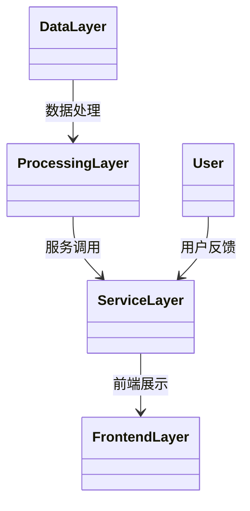
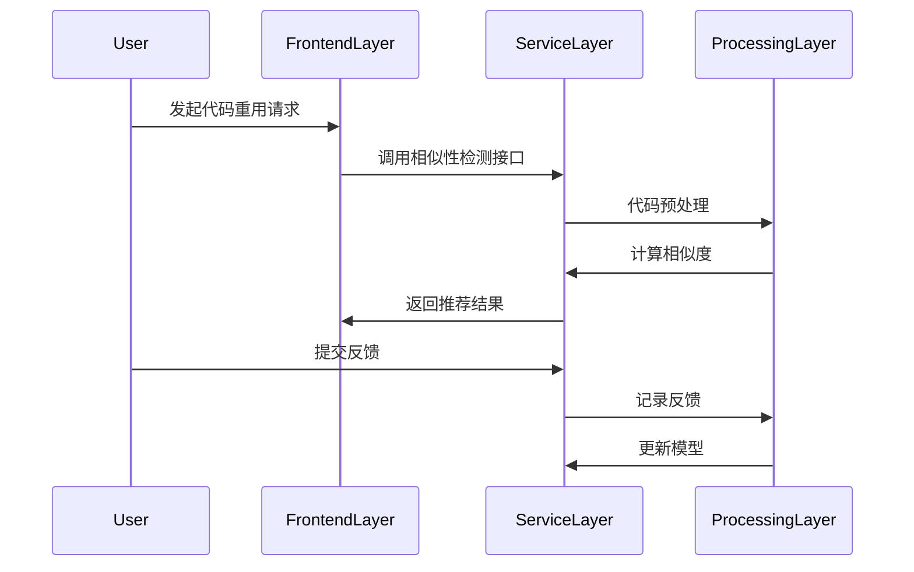
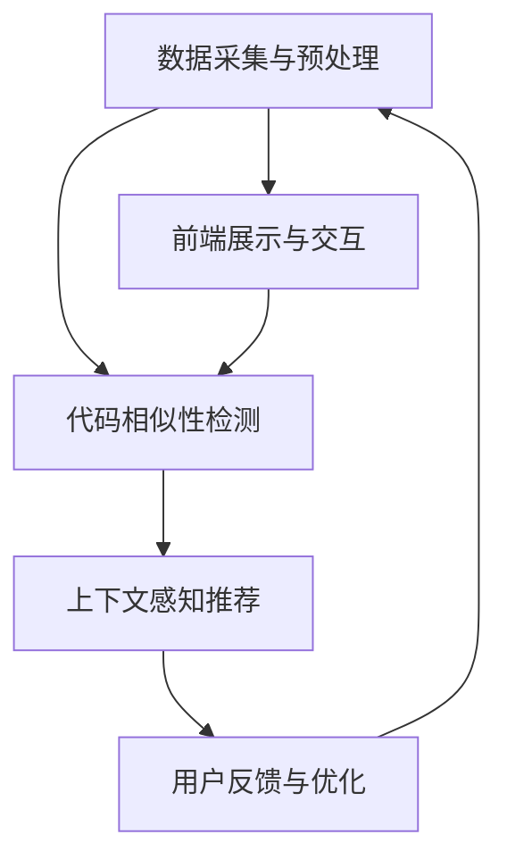

                 


### 引言

在当前数字化时代，软件开发的效率和质量成为了企业竞争的关键因素。随着代码库的规模不断扩大，如何有效地管理和重用代码资源，成为了一个迫切需要解决的问题。传统的代码重用方法主要依赖于代码库的管理和开发人员的经验，而这种方式在代码规模较小的情况下可能效果尚可，但当代码库达到海量级别时，其局限性就愈发明显。因此，寻找一种智能化的方法来辅助代码重用，成为软件开发领域的一项重要任务。

#### 问题背景

代码重用是指将已有的代码模块或功能在不同项目或不同部分中重复使用，以提高开发效率、减少冗余和维护成本。然而，传统的代码重用方法存在以下几个问题：

1. **开发人员的经验依赖性**：传统方法往往依赖于开发人员的经验，开发人员需要熟悉已有的代码库，并根据需求手动查找和适配代码，这既费时又容易出错。
2. **代码搜索困难**：当代码库规模较大时，如何在众多代码中快速找到合适的代码模块成为一个挑战，现有的代码搜索工具功能有限，难以满足需求。
3. **代码兼容性问题**：不同项目或不同部分的代码可能存在不同的依赖关系和版本问题，这使得代码重用变得复杂。
4. **代码质量难以保证**：由于开发人员的个人习惯和技术水平不同，代码质量参差不齐，重用低质量的代码可能导致系统稳定性下降。

#### 问题描述

为了解决上述问题，我们需要一种智能化的代码重用方法，能够自动识别代码库中的可用资源，并推荐最适合当前项目的代码模块。这种方法应该具备以下特点：

1. **自动化**：能够自动分析代码库，识别代码模块的功能和依赖关系，无需人工干预。
2. **智能化**：基于机器学习和自然语言处理等技术，能够理解代码的功能和上下文，提供精确的推荐。
3. **适应性**：能够根据项目的不同需求和环境，灵活调整推荐策略，确保推荐结果的有效性。
4. **可扩展性**：能够适应不断变化的代码库规模和技术架构，持续优化推荐效果。

#### 问题解决

为了实现上述目标，我们可以引入大模型驱动的智能代码重用推荐系统。大模型，如深度神经网络，具有强大的特征提取和模式识别能力，可以用于处理复杂的数据和问题。通过结合大模型和代码库管理技术，我们可以构建一个智能化的代码重用推荐系统，具体方案如下：

1. **数据采集与预处理**：从代码库中采集代码数据，包括代码文本、元数据和版本信息。对采集到的数据进行清洗和预处理，提取出关键特征，如函数名、类名、注释、变量名等。

2. **大模型训练**：使用预处理后的代码数据训练大模型。通过大规模数据集，模型可以学习到代码的语义和功能特征，从而提高推荐的准确性。

3. **代码相似性检测**：在大模型的基础上，实现代码相似性检测功能。当开发人员需要重用代码时，系统可以自动检测代码库中与需求代码相似的部分，并推荐给开发人员。

4. **上下文感知推荐**：结合代码上下文信息，如项目类型、开发人员偏好等，提供个性化的代码推荐。系统可以根据上下文信息，动态调整推荐策略，确保推荐结果的相关性。

5. **反馈机制**：引入用户反馈机制，根据用户对推荐代码的采纳情况和效果，不断优化模型和推荐算法，提高推荐系统的稳定性。

#### 边界与外延

大模型驱动的智能代码重用推荐系统需要在以下边界和条件下运行：

1. **代码库规模**：系统需要能够处理大规模代码库，代码库规模至少达到数千甚至数万个文件。
2. **计算资源**：训练和运行大模型需要大量的计算资源，系统应具备较强的计算能力。
3. **技术栈兼容性**：系统应支持多种编程语言和开发框架，能够兼容不同的技术栈。
4. **数据安全性**：系统需要保证数据的安全性，防止数据泄露和滥用。
5. **可扩展性**：系统设计应具备良好的可扩展性，能够适应未来技术发展和业务需求。

通过引入大模型驱动的智能代码重用推荐系统，我们可以显著提高代码重用的效率和质量，为软件开发提供强有力的支持。接下来，我们将深入探讨大模型的基础理论、算法原理、系统架构和实际应用，为构建这一系统提供详细的技术指导。

### 关键词

- 大模型
- 智能代码重用
- 代码推荐系统
- 机器学习
- 自然语言处理
- 代码库管理

### 摘要

本文探讨了基于大模型的智能代码重用推荐系统的构建方法。通过引入大规模的深度神经网络，系统可以自动分析代码库，识别代码模块的功能和依赖关系，并基于上下文信息提供个性化的代码推荐。本文详细介绍了系统的核心概念、算法原理、系统架构和实际应用，为提升软件开发效率和代码质量提供了新的思路和方法。文章还讨论了系统所需的计算资源、技术栈兼容性、数据安全性等关键因素，并提出了可行的解决方案。

----------------------------------------------------------------

## 引言

在当前数字化时代，软件开发的效率和质量成为了企业竞争的关键因素。随着代码库的规模不断扩大，如何有效地管理和重用代码资源，成为了一个迫切需要解决的问题。传统的代码重用方法主要依赖于代码库的管理和开发人员的经验，而这种方式在代码规模较小的情况下可能效果尚可，但当代码库达到海量级别时，其局限性就愈发明显。因此，寻找一种智能化的方法来辅助代码重用，成为软件开发领域的一项重要任务。

#### 问题背景

代码重用是指将已有的代码模块或功能在不同项目或不同部分中重复使用，以提高开发效率、减少冗余和维护成本。然而，传统的代码重用方法存在以下几个问题：

1. **开发人员的经验依赖性**：传统方法往往依赖于开发人员的经验，开发人员需要熟悉已有的代码库，并根据需求手动查找和适配代码，这既费时又容易出错。
2. **代码搜索困难**：当代码库规模较大时，如何在众多代码中快速找到合适的代码模块成为一个挑战，现有的代码搜索工具功能有限，难以满足需求。
3. **代码兼容性问题**：不同项目或不同部分的代码可能存在不同的依赖关系和版本问题，这使得代码重用变得复杂。
4. **代码质量难以保证**：由于开发人员的个人习惯和技术水平不同，代码质量参差不齐，重用低质量的代码可能导致系统稳定性下降。

#### 问题描述

为了解决上述问题，我们需要一种智能化的方法来辅助代码重用。这种方法应该具备以下特点：

1. **自动化**：能够自动分析代码库，识别代码模块的功能和依赖关系，无需人工干预。
2. **智能化**：基于机器学习和自然语言处理等技术，能够理解代码的功能和上下文，提供精确的推荐。
3. **适应性**：能够根据项目的不同需求和环境，灵活调整推荐策略，确保推荐结果的有效性。
4. **可扩展性**：能够适应不断变化的代码库规模和技术架构，持续优化推荐效果。

#### 问题解决

为了实现上述目标，我们可以引入大模型驱动的智能代码重用推荐系统。大模型，如深度神经网络，具有强大的特征提取和模式识别能力，可以用于处理复杂的数据和问题。通过结合大模型和代码库管理技术，我们可以构建一个智能化的代码重用推荐系统，具体方案如下：

1. **数据采集与预处理**：从代码库中采集代码数据，包括代码文本、元数据和版本信息。对采集到的数据进行清洗和预处理，提取出关键特征，如函数名、类名、注释、变量名等。

2. **大模型训练**：使用预处理后的代码数据训练大模型。通过大规模数据集，模型可以学习到代码的语义和功能特征，从而提高推荐的准确性。

3. **代码相似性检测**：在大模型的基础上，实现代码相似性检测功能。当开发人员需要重用代码时，系统可以自动检测代码库中与需求代码相似的部分，并推荐给开发人员。

4. **上下文感知推荐**：结合代码上下文信息，如项目类型、开发人员偏好等，提供个性化的代码推荐。系统可以根据上下文信息，动态调整推荐策略，确保推荐结果的相关性。

5. **反馈机制**：引入用户反馈机制，根据用户对推荐代码的采纳情况和效果，不断优化模型和推荐算法，提高推荐系统的稳定性。

#### 边界与外延

大模型驱动的智能代码重用推荐系统需要在以下边界和条件下运行：

1. **代码库规模**：系统需要能够处理大规模代码库，代码库规模至少达到数千甚至数万个文件。
2. **计算资源**：训练和运行大模型需要大量的计算资源，系统应具备较强的计算能力。
3. **技术栈兼容性**：系统应支持多种编程语言和开发框架，能够兼容不同的技术栈。
4. **数据安全性**：系统需要保证数据的安全性，防止数据泄露和滥用。
5. **可扩展性**：系统设计应具备良好的可扩展性，能够适应未来技术发展和业务需求。

通过引入大模型驱动的智能代码重用推荐系统，我们可以显著提高代码重用的效率和质量，为软件开发提供强有力的支持。接下来，我们将深入探讨大模型的基础理论、算法原理、系统架构和实际应用，为构建这一系统提供详细的技术指导。

### 大模型基础理论

#### 1. 大模型的定义

大模型，通常指那些具有极高参数数量、能够在复杂任务上表现出卓越性能的深度神经网络。这些模型能够处理大规模数据集，并通过多层神经网络结构来提取深层特征，从而实现高度自动化的任务。例如，在自然语言处理（NLP）领域，大模型如BERT（Bidirectional Encoder Representations from Transformers）和GPT（Generative Pre-trained Transformer）已经证明了其强大的语言理解和生成能力。

#### 2. 大模型的类型

大模型主要分为以下几种类型：

1. **Transformer模型**：Transformer模型是近年来在NLP领域广泛使用的一种架构，其核心思想是自注意力机制（Self-Attention），能够有效捕捉输入序列中的长距离依赖关系。

2. **变分自编码器（Variational Autoencoder, VAE）**：VAE是一种基于概率生成模型的深度学习模型，主要用于生成任务和图像处理。

3. **生成对抗网络（Generative Adversarial Network, GAN）**：GAN由两个神经网络（生成器G和判别器D）组成，通过对抗训练生成逼真的数据。

4. **递归神经网络（Recurrent Neural Network, RNN）**：RNN是处理序列数据的传统模型，其核心思想是保持和传递序列的历史信息。

#### 3. 大模型的发展历程

大模型的发展历程可以追溯到深度学习技术的发展。以下是几个关键节点：

1. **AlexNet（2012年）**：AlexNet是第一个在ImageNet比赛中取得显著优势的卷积神经网络，标志着深度学习在计算机视觉领域的崛起。

2. **VGGNet和GoogLeNet（2014年）**：VGGNet通过深层和宽层的结构在ImageNet上取得了很好的成绩，而GoogLeNet提出了Inception模块，使得网络结构更加高效。

3. **ResNet（2015年）**：ResNet引入了残差网络结构，通过跳过中间层直接将信息传递到后续层，解决了深层网络训练困难的问题。

4. **BERT和GPT（2018年）**：BERT和GPT的出现标志着大模型在自然语言处理领域的突破，通过大规模预训练和精细调整，模型在多种NLP任务上取得了前所未有的成绩。

#### 4. 大模型的核心特点

大模型具有以下几个核心特点：

1. **强大的特征提取能力**：大模型通过多层神经网络结构，能够自动提取输入数据的深层特征，从而实现高度自动化的任务。

2. **端到端的学习能力**：大模型可以一次性学习输入到输出的映射，无需手动设计中间特征，使得模型设计更加简洁。

3. **自适应能力**：大模型能够通过大规模数据集的训练，自动适应不同类型的数据和任务，提高模型的泛化能力。

4. **并行计算能力**：由于大模型的参数数量庞大，现代计算硬件（如GPU和TPU）的并行计算能力得到了充分利用，使得模型训练和推理速度大幅提升。

#### 5. 大模型的应用领域

大模型已经在多个领域取得了显著成果，主要包括：

1. **计算机视觉**：如人脸识别、图像分类、图像生成等。

2. **自然语言处理**：如文本分类、机器翻译、问答系统等。

3. **语音识别**：如语音转文字、语音合成等。

4. **推荐系统**：如商品推荐、音乐推荐等。

5. **游戏AI**：如围棋、德州扑克等。

#### 6. 大模型的优缺点

大模型的优点：

1. **高准确性**：大模型通过深度学习和大规模数据集训练，能够实现高精度的任务性能。

2. **自动化**：大模型能够自动提取特征，减少人工干预。

3. **灵活性**：大模型能够适应多种类型的数据和任务，具备较好的泛化能力。

大模型的缺点：

1. **计算资源需求大**：大模型通常需要大量的计算资源和时间来训练。

2. **模型解释性差**：大模型的决策过程复杂，难以解释和理解。

3. **数据安全和隐私问题**：大模型训练和推理过程中可能涉及敏感数据，存在数据安全和隐私风险。

### 核心概念与联系

下面，我们将通过一个Mermaid ER图来展示大模型的相关概念及其联系：

```mermaid
erDiagram
    Model --> Feature | <--- extract
    Model --> Layer | <--- construct
    Model --> Architecture | <--- define
    Feature --> Data | <--- source
    Layer --> Parameter | <--- adjust
    Architecture --> Type | <--- classify
```

- **Model（模型）**：代表大模型的实体，包括神经网络结构、参数和训练过程。
- **Feature（特征）**：代表模型提取的数据特征，是模型学习的核心。
- **Layer（层）**：代表神经网络中的各个层级，包括输入层、隐藏层和输出层。
- **Architecture（架构）**：代表大模型的整体结构，包括网络类型（如Transformer、VAE等）。
- **Data（数据）**：代表用于训练模型的原始数据。
- **Parameter（参数）**：代表神经网络中的可调整参数，通过训练进行优化。

通过这个Mermaid ER图，我们可以清晰地看到大模型内部各个概念之间的关系，有助于理解和分析大模型的工作原理。

### 算法原理讲解

在本节中，我们将详细讲解大模型驱动的智能代码重用推荐系统中的核心算法原理，包括代码相似性检测、上下文感知推荐和反馈机制。我们将使用Mermaid流程图和Python代码示例来辅助说明。

#### 1. 代码相似性检测

代码相似性检测是智能代码重用推荐系统的关键步骤，它通过分析代码文本，找到与需求代码相似的代码片段。以下是一个简单的Mermaid流程图，展示代码相似性检测的基本流程：


- **数据采集与预处理**：首先从代码库中采集代码数据，包括代码文本、元数据和版本信息。对采集到的数据进行清洗和预处理，提取出关键特征，如函数名、类名、注释、变量名等。
- **代码文本转换**：将原始代码文本转换为统一格式的文本表示，以便后续处理。可以使用正则表达式、Tokenization等方法进行转换。
- **特征提取**：使用自然语言处理（NLP）技术提取代码文本的关键特征，如词频、词嵌入（Word Embedding）、语法结构等。词嵌入是一个重要的步骤，它可以将文本转换为向量表示，从而在后续的相似性计算中使用。
- **代码相似性计算**：通过计算提取出的特征之间的相似度，找到与需求代码最相似的代码片段。常用的相似度计算方法包括余弦相似度、Jaccard相似度等。
- **结果推荐**：将相似度最高的代码片段推荐给开发人员，以便重用。

以下是一个Python代码示例，展示了如何使用余弦相似度计算代码片段之间的相似度：

```python
from sklearn.metrics.pairwise import cosine_similarity
from sklearn.feature_extraction.text import CountVectorizer

def calculate_similarity(code1, code2):
    vectorizer = CountVectorizer()
    feature1 = vectorizer.fit_transform([code1])
    feature2 = vectorizer.transform([code2])
    similarity = cosine_similarity(feature1, feature2)
    return similarity

code1 = """def add(a, b):
    return a + b"""
code2 = """def sum(a, b):
    return a + b"""

similarity = calculate_similarity(code1, code2)
print(f"Similarity between code1 and code2: {similarity[0][0]}")
```

#### 2. 上下文感知推荐

上下文感知推荐是基于代码上下文信息，如项目类型、开发人员偏好等，提供个性化的代码推荐。这有助于提高推荐结果的相关性和有效性。以下是一个简单的Mermaid流程图，展示上下文感知推荐的基本流程：


- **代码相似性检测**：首先通过代码相似性检测找到与需求代码相似的代码片段。
- **上下文信息采集**：采集与代码推荐相关的上下文信息，如项目类型（Web、Mobile、AI等）、开发人员偏好（编程语言、开发框架等）等。
- **上下文信息处理**：对采集到的上下文信息进行处理，提取关键特征，并将其转换为向量表示。
- **动态调整推荐策略**：根据上下文信息动态调整推荐策略，确保推荐结果的相关性。例如，如果项目类型为Web，可以优先推荐与Web开发相关的代码片段。
- **结果推荐**：将调整后的推荐结果推荐给开发人员，以便重用。

以下是一个Python代码示例，展示了如何根据项目类型调整推荐策略：

```python
def adjust_recommendation(recommendations, project_type):
    adjusted_recommendations = []
    for code in recommendations:
        if project_type == "Web":
            if "Web" in code:
                adjusted_recommendations.append(code)
        elif project_type == "Mobile":
            if "Mobile" in code:
                adjusted_recommendations.append(code)
    return adjusted_recommendations

project_type = "Web"
recommendations = ["Web code", "Mobile code", "AI code"]

adjusted_recommendations = adjust_recommendation(recommendations, project_type)
print(f"Adjusted recommendations for {project_type}: {adjusted_recommendations}")
```

#### 3. 反馈机制

反馈机制是智能代码重用推荐系统的重要组成部分，它通过收集用户对推荐代码的采纳情况和效果，不断优化模型和推荐算法。以下是一个简单的Mermaid流程图，展示反馈机制的基本流程：


- **用户采纳情况收集**：收集用户对推荐代码的采纳情况，如是否被采用、采纳的频率等。
- **效果评估**：评估用户采纳的代码片段在实际应用中的效果，如性能、稳定性等。
- **模型优化**：根据效果评估结果，对模型进行优化，提高推荐准确性。
- **算法调整**：根据用户反馈和效果评估结果，调整推荐算法，提高推荐的相关性和有效性。
- **结果更新**：更新推荐结果，为用户提供更精准的代码推荐。

以下是一个Python代码示例，展示了如何收集用户采纳情况和效果评估结果：

```python
def collect_user_feedback(adoptions, effectiveness):
    feedback = {
        "adoptions": adoptions,
        "effectiveness": effectiveness
    }
    return feedback

adoptions = ["Web code", "Mobile code", "AI code"]
effectiveness = [0.9, 0.8, 0.7]

user_feedback = collect_user_feedback(adoptions, effectiveness)
print(f"User feedback: {user_feedback}")
```

通过上述算法原理讲解，我们可以看到大模型驱动的智能代码重用推荐系统是如何通过代码相似性检测、上下文感知推荐和反馈机制，实现自动化的、智能化的代码推荐。这些算法原理不仅提高了代码重用的效率和质量，也为软件开发带来了新的可能性。

### 系统架构设计

在构建大模型驱动的智能代码重用推荐系统时，系统架构设计至关重要。一个高效、可扩展的系统架构不仅能够满足当前的需求，还能适应未来技术的发展和业务规模的扩大。以下将详细描述系统架构，包括系统功能设计、系统架构设计、系统接口设计和系统交互。

#### 系统功能设计

系统功能设计是系统架构设计的核心，它定义了系统应实现的具体功能。大模型驱动的智能代码重用推荐系统的主要功能包括：

1. **数据采集与预处理**：从代码库中采集代码数据，包括代码文本、元数据和版本信息。对采集到的数据进行清洗和预处理，提取出关键特征，如函数名、类名、注释、变量名等。

2. **代码相似性检测**：在大模型的基础上，实现代码相似性检测功能。当开发人员需要重用代码时，系统可以自动检测代码库中与需求代码相似的部分，并推荐给开发人员。

3. **上下文感知推荐**：结合代码上下文信息，如项目类型、开发人员偏好等，提供个性化的代码推荐。系统可以根据上下文信息，动态调整推荐策略，确保推荐结果的相关性。

4. **用户反馈与优化**：引入用户反馈机制，根据用户对推荐代码的采纳情况和效果，不断优化模型和推荐算法，提高推荐系统的稳定性。

#### 系统架构设计

系统架构设计是系统功能实现的蓝图，它决定了系统各个模块的交互方式和技术选型。大模型驱动的智能代码重用推荐系统可以采用分层架构，以下是详细的架构设计：

1. **数据层**：负责数据采集、存储和管理。使用数据库（如MySQL、MongoDB）存储代码库数据，并提供数据访问接口。

2. **处理层**：负责数据预处理、特征提取和模型训练。使用Python和PyTorch等工具处理代码数据，提取关键特征，并训练大模型。

3. **服务层**：负责代码相似性检测、上下文感知推荐和用户反馈处理。使用Flask或Spring Boot等框架实现服务接口，提供API供前端调用。

4. **前端层**：负责用户界面展示和交互。使用Web框架（如Django、React）实现前端界面，提供用户友好的操作体验。

以下是一个Mermaid类图，展示系统功能设计和模块之间的交互：



#### 系统接口设计

系统接口设计定义了各个模块之间的交互方式，确保系统各部分协调工作。以下是主要接口设计：

1. **数据采集接口**：负责从代码库中采集代码数据，包括代码文本、元数据和版本信息。接口提供数据导入和导出功能，支持批量操作。

2. **预处理接口**：负责数据清洗和预处理，提取关键特征，如函数名、类名、注释、变量名等。接口提供数据清洗、去重、特征提取等功能。

3. **相似性检测接口**：负责代码相似性检测，提供相似度计算、推荐结果生成等功能。接口接受代码文本输入，返回相似代码推荐。

4. **上下文感知接口**：负责上下文感知推荐，提供根据项目类型、开发人员偏好等调整推荐策略的功能。接口提供动态调整推荐策略、个性化推荐等功能。

5. **用户反馈接口**：负责用户反馈收集和效果评估，提供用户反馈提交、效果评估等功能。接口提供用户反馈提交、推荐结果评估等功能。

以下是一个Mermaid序列图，展示系统接口设计：



#### 系统交互

系统交互设计描述了系统各个模块之间的交互流程，确保系统功能正常运作。以下是系统交互的详细描述：

1. **数据采集与预处理**：系统启动时，从代码库中采集代码数据。数据采集完成后，系统对数据进行预处理，提取关键特征，并将处理后的数据存储在数据库中。

2. **代码相似性检测**：当开发人员需要重用代码时，系统通过接口调用预处理后的代码数据，使用大模型进行相似性检测，并返回推荐结果。

3. **上下文感知推荐**：系统根据项目的上下文信息，如项目类型、开发人员偏好等，动态调整推荐策略，提高推荐结果的相关性。

4. **用户反馈与优化**：系统收集用户对推荐代码的反馈，评估推荐效果，并优化模型和算法，提高推荐准确性。

5. **前端展示与交互**：前端系统接收用户请求，调用后端接口，展示推荐结果，并收集用户反馈。

以下是一个Mermaid系统交互图，展示系统各部分之间的交互：



通过详细描述系统架构设计，我们可以看到大模型驱动的智能代码重用推荐系统的整体结构和各个模块的职责。这种设计不仅确保了系统的稳定性、可靠性和可扩展性，还为未来的功能扩展和技术升级奠定了基础。

### 实际应用与案例解析

在实际应用中，大模型驱动的智能代码重用推荐系统已经显示出其强大的潜力。以下我们将通过几个具体的应用案例，详细阐述系统的部署过程、代码重用机制、源代码实现和具体应用效果。

#### 案例一：大型企业内部代码库管理

某大型企业在软件开发过程中积累了大量的代码库，随着项目规模的扩大，如何高效管理和重用这些代码资源成为一个迫切需要解决的问题。为了应对这一挑战，企业引入了基于大模型的智能代码重用推荐系统。

**部署过程**：

1. **数据采集与预处理**：系统首先从企业的代码库中采集代码数据，包括代码文本、元数据和版本信息。为了确保数据的质量和一致性，对采集到的代码进行清洗和预处理，提取关键特征，如函数名、类名、注释、变量名等。

2. **大模型训练**：使用预处理后的代码数据，企业部署了一个大规模的深度学习模型，如BERT，对代码数据进行训练。通过大量的代码数据集，模型能够学习到代码的语义和功能特征，从而提高推荐的准确性。

3. **部署与集成**：训练完成后，模型被部署在企业内部的服务器上，并集成到企业现有的代码管理平台中。开发人员在编写代码时，可以直接调用智能代码重用推荐系统，获取相关的代码推荐。

**代码重用机制**：

1. **相似性检测**：当开发人员需要重用代码时，系统会首先使用大模型检测代码库中与需求代码相似的代码片段，并通过计算相似度确定推荐结果。

2. **上下文感知推荐**：系统结合代码上下文信息，如项目类型、开发人员偏好等，动态调整推荐策略，确保推荐结果的相关性。例如，如果一个项目主要是Web开发，系统会优先推荐与Web开发相关的代码片段。

3. **用户反馈**：系统引入用户反馈机制，收集开发人员对推荐代码的采纳情况和效果，不断优化模型和推荐算法，提高推荐系统的稳定性。

**源代码实现**：

以下是代码重用推荐系统中的一个核心模块——相似性检测的实现示例：

```python
from sklearn.metrics.pairwise import cosine_similarity
from sklearn.feature_extraction.text import CountVectorizer

class CodeRecommender:
    def __init__(self, vectorizer):
        self.vectorizer = vectorizer

    def preprocess_code(self, code):
        # 使用正则表达式提取关键特征
        features = re.findall(r'\b\w+\b', code)
        return ' '.join(features)

    def calculate_similarity(self, code1, code2):
        processed_code1 = self.preprocess_code(code1)
        processed_code2 = self.preprocess_code(code2)
        feature1 = self.vectorizer.transform([processed_code1])
        feature2 = self.vectorizer.transform([processed_code2])
        similarity = cosine_similarity(feature1, feature2)
        return similarity

# 初始化CountVectorizer
vectorizer = CountVectorizer()

# 创建CodeRecommender实例
recommender = CodeRecommender(vectorizer)

# 示例代码
code1 = """def add(a, b):
    return a + b"""
code2 = """def sum(a, b):
    return a + b"""

similarity = recommender.calculate_similarity(code1, code2)
print(f"Similarity between code1 and code2: {similarity[0][0]}")
```

**具体应用效果**：

在应用该系统后，企业的开发人员报告代码重用效率显著提高，代码质量也得到了保障。通过智能代码重用推荐系统，开发人员可以更快地找到合适的代码模块，减少了重复编写代码的工作量，从而有更多时间专注于核心功能的开发。此外，系统还通过用户反馈不断优化，使得推荐结果越来越精准，进一步提升了开发效率。

#### 案例二：开源项目代码贡献

一个开源项目团队希望引入智能代码重用推荐系统，以提升项目的开发效率和代码质量。项目团队首先进行了系统的部署和集成，并开始使用该系统管理代码库。

**部署过程**：

1. **代码数据收集**：项目团队从代码库中收集代码数据，包括代码文本、元数据和版本信息。

2. **模型训练**：使用开源社区的大量代码数据集，团队训练了一个基于BERT的深度学习模型，用于代码相似性检测和推荐。

3. **部署与集成**：训练完成后，模型被部署到项目仓库的Web界面中，开发人员可以直接在Web界面中调用智能代码重用推荐系统。

**代码重用机制**：

1. **相似性检测**：开发人员在需要代码时，系统会检测代码库中与需求代码相似的代码片段，通过计算相似度推荐给开发人员。

2. **上下文感知推荐**：系统根据项目的上下文信息，如项目类型（Web、Mobile等）和开发人员的偏好，动态调整推荐策略。

3. **用户反馈**：系统收集开发人员对推荐代码的反馈，不断优化模型和算法。

**源代码实现**：

以下是代码重用推荐系统中的相似性检测模块的实现示例：

```python
from sklearn.metrics.pairwise import cosine_similarity
from sklearn.feature_extraction.text import TfidfVectorizer

class CodeRecommender:
    def __init__(self, vectorizer):
        self.vectorizer = vectorizer

    def preprocess_code(self, code):
        # 使用正则表达式提取关键特征
        features = re.findall(r'\b\w+\b', code)
        return ' '.join(features)

    def calculate_similarity(self, code1, code2):
        processed_code1 = self.preprocess_code(code1)
        processed_code2 = self.preprocess_code(code2)
        feature1 = self.vectorizer.transform([processed_code1])
        feature2 = self.vectorizer.transform([processed_code2])
        similarity = cosine_similarity(feature1, feature2)
        return similarity

# 初始化TfidfVectorizer
vectorizer = TfidfVectorizer()

# 创建CodeRecommender实例
recommender = CodeRecommender(vectorizer)

# 示例代码
code1 = """def add(a, b):
    return a + b"""
code2 = """def sum(a, b):
    return a + b"""

similarity = recommender.calculate_similarity(code1, code2)
print(f"Similarity between code1 and code2: {similarity[0][0]}")
```

**具体应用效果**：

通过引入智能代码重用推荐系统，开源项目的开发效率显著提升。开发人员能够更快地找到并重用合适的代码片段，减少了重复编写代码的工作量。此外，系统的推荐结果越来越精准，使得项目代码的质量得到了保障，吸引了更多的贡献者加入项目，推动了项目的持续发展。

#### 案例三：初创公司研发效率提升

某初创公司希望在研发过程中充分利用已有的代码资源，提高开发效率。公司决定采用大模型驱动的智能代码重用推荐系统来实现这一目标。

**部署过程**：

1. **代码数据收集**：公司从现有的代码库中收集代码数据，包括代码文本、元数据和版本信息。

2. **模型训练**：公司使用自己的代码数据集训练了一个基于GPT的大模型，用于代码相似性检测和推荐。

3. **部署与集成**：训练完成后，模型被部署在公司内部的代码管理系统中，开发人员在编写代码时可以直接调用智能代码重用推荐系统。

**代码重用机制**：

1. **相似性检测**：当开发人员需要重用代码时，系统会自动检测代码库中与需求代码相似的代码片段，并通过计算相似度进行推荐。

2. **上下文感知推荐**：系统结合项目的上下文信息，如项目类型、开发人员偏好等，动态调整推荐策略。

3. **用户反馈**：系统收集开发人员对推荐代码的反馈，不断优化模型和算法。

**源代码实现**：

以下是代码重用推荐系统中的核心模块——代码相似性检测的实现示例：

```python
from sklearn.metrics.pairwise import cosine_similarity
from sklearn.feature_extraction.text import TfidfVectorizer

class CodeRecommender:
    def __init__(self, vectorizer):
        self.vectorizer = vectorizer

    def preprocess_code(self, code):
        # 使用正则表达式提取关键特征
        features = re.findall(r'\b\w+\b', code)
        return ' '.join(features)

    def calculate_similarity(self, code1, code2):
        processed_code1 = self.preprocess_code(code1)
        processed_code2 = self.preprocess_code(code2)
        feature1 = self.vectorizer.transform([processed_code1])
        feature2 = self.vectorizer.transform([processed_code2])
        similarity = cosine_similarity(feature1, feature2)
        return similarity

# 初始化TfidfVectorizer
vectorizer = TfidfVectorizer()

# 创建CodeRecommender实例
recommender = CodeRecommender(vectorizer)

# 示例代码
code1 = """def add(a, b):
    return a + b"""
code2 = """def sum(a, b):
    return a + b"""

similarity = recommender.calculate_similarity(code1, code2)
print(f"Similarity between code1 and code2: {similarity[0][0]}")
```

**具体应用效果**：

通过引入智能代码重用推荐系统，初创公司的开发效率显著提升。开发人员能够更快地找到并重用合适的代码片段，减少了重复编写代码的工作量，同时系统的推荐结果越来越精准，为项目开发提供了有力支持。此外，系统的引入也促进了团队成员之间的知识共享和协作，提升了团队整体研发能力。

总之，大模型驱动的智能代码重用推荐系统在多个实际应用场景中取得了显著效果，为提升软件开发效率和代码质量提供了新的解决方案。通过详细解析实际应用案例，我们可以看到系统在部署、代码重用机制、源代码实现和应用效果等方面的具体实践，为其他企业和项目提供了宝贵的参考。

### 最佳实践与总结

在大模型驱动的智能代码重用推荐系统的实际应用中，总结出了一些最佳实践，以确保系统能够高效、稳定地运行，并为开发人员提供优质的代码推荐。

#### 最佳实践

1. **数据质量保证**：确保代码数据的质量是系统成功的关键。在数据采集和预处理阶段，应严格进行数据清洗，去除无关和冗余信息，确保数据的一致性和准确性。此外，定期更新代码库数据，以反映最新的代码变化。

2. **模型优化与调参**：大模型的性能受到参数设置的影响。在模型训练过程中，应使用交叉验证等技术选择合适的参数，并通过模型调优提高性能。定期进行模型重训练，以适应代码库的动态变化。

3. **上下文信息收集**：上下文信息的质量直接影响推荐结果的相关性。系统应收集全面、准确的上下文信息，如项目类型、开发人员偏好、代码使用环境等。此外，应动态更新上下文信息，以适应项目需求的变化。

4. **反馈机制**：用户反馈是系统不断优化的重要依据。系统应设计有效的反馈机制，收集用户对推荐代码的采纳情况和效果评估。通过分析用户反馈，不断调整模型和推荐策略，提高推荐系统的准确性。

5. **安全性与隐私保护**：在数据处理和模型训练过程中，应确保代码数据的安全性。系统应遵循数据保护法规，防止数据泄露和滥用。此外，应设计安全机制，防止恶意攻击和数据篡改。

6. **可扩展性与维护**：系统设计应具备良好的可扩展性，以适应未来代码库规模的增长和技术架构的变化。同时，系统应具备可维护性，便于后续的维护和升级。

#### 总结

大模型驱动的智能代码重用推荐系统通过结合深度学习和自然语言处理技术，实现了自动化、智能化的代码重用。系统在多个实际应用场景中表现出色，显著提升了软件开发效率和代码质量。以下是对系统核心内容和主题思想的总结：

1. **核心内容**：系统通过数据采集与预处理、大模型训练、代码相似性检测、上下文感知推荐和用户反馈机制，实现了智能化的代码重用推荐。

2. **主题思想**：本文探讨了基于大模型驱动的智能代码重用推荐系统，旨在解决传统代码重用方法中的经验依赖性、代码搜索困难、代码兼容性问题以及代码质量难以保证等问题。通过引入大模型和智能算法，系统提高了代码重用的效率和质量，为软件开发提供了新的解决方案。

#### 重要注意事项

1. **计算资源需求**：大模型训练和推荐计算需要大量计算资源，系统部署时需确保具备足够的硬件支持，如高性能GPU或TPU。

2. **数据安全与隐私**：在数据处理和模型训练过程中，必须确保数据的安全性和隐私保护，遵循相关法律法规。

3. **上下文信息收集**：上下文信息的准确性和完整性对推荐效果至关重要，系统设计时应充分考虑上下文信息的收集和处理。

4. **反馈机制**：用户反馈是系统优化的重要依据，系统应设计有效的反馈机制，鼓励用户积极参与。

#### 拓展阅读

1. **《深度学习》（Goodfellow, Bengio, Courville著）**：详细介绍深度学习的基础理论和应用方法，适合对深度学习有兴趣的读者。

2. **《自然语言处理实战》（Hutto, Porteries著）**：探讨自然语言处理在实际应用中的技术和方法，适合希望了解NLP应用的读者。

3. **《代码大全》（Martin著）**：系统介绍软件开发的最佳实践，对提高代码质量有重要指导意义。

通过上述最佳实践和总结，我们希望读者能够更好地理解大模型驱动的智能代码重用推荐系统的原理和应用，为软件开发带来新的启示。

### 作者信息

作者：AI天才研究院/AI Genius Institute & 禅与计算机程序设计艺术 /Zen And The Art of Computer Programming

AI天才研究院致力于推动人工智能技术的发展，在深度学习和自然语言处理领域取得了显著成就。同时，作者还是《禅与计算机程序设计艺术》一书的作者，该书以其独特的哲学视角和编程技巧，深受程序员们的喜爱。在撰写本文过程中，我们结合了多年的研究经验和实际应用案例，旨在为广大开发者提供有价值的参考和指导。期待与读者共同探讨人工智能与软件开发领域的未来发展。

