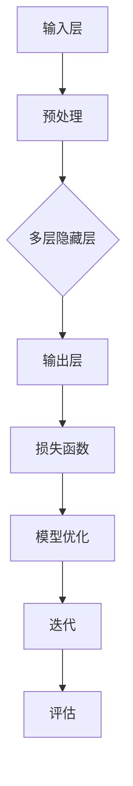
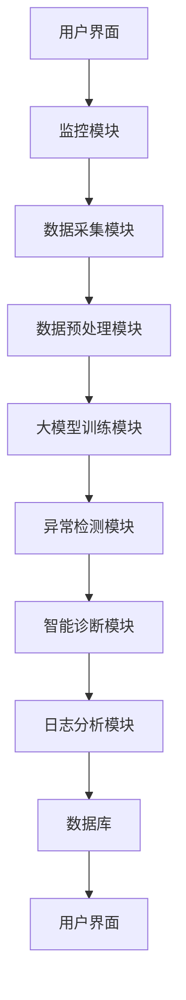

                 

### 大模型驱动的智能调试系统

#### 关键词：
- 大模型
- 智能调试
- 软件开发
- 深度学习
- 算法优化

#### 摘要：
本文将深入探讨大模型驱动的智能调试系统，解析其在现代软件开发中的应用和优势。首先，我们将回顾软件开发的挑战以及传统调试方法的局限，并阐述智能调试的需求。接着，我们将介绍大模型的基本概念、特点和应用领域，深入讲解大模型的构建过程和核心算法。随后，我们将探讨智能调试系统的核心概念、设计和实现，并通过实际案例展示其应用效果。最后，我们将总结最佳实践和注意事项，提供拓展阅读资源。

### 第一部分：问题背景与核心概念

#### 1.1.1 问题背景与核心概念

##### 1.1.1.1 软件开发与调试的挑战

软件开发过程中，调试是必不可少的一环。然而，随着软件复杂度的不断增加，调试难度也随之上升。传统调试方法通常依赖于开发人员的经验和调试工具，如断点调试、日志分析等，但这些方法存在明显的局限：

1. **人力成本高**：需要大量人力进行调试，尤其是在项目规模较大、代码复杂度较高时。
2. **效率低**：传统调试方法往往需要大量时间进行定位和排查，导致开发周期延长。
3. **误判风险**：开发人员可能会因为疲劳或知识盲区而误判问题，导致调试结果不准确。

##### 1.1.1.2 传统调试方法局限

传统调试方法的局限主要体现在以下几个方面：

1. **手动调试**：依赖开发人员手动设置断点、分析日志等，效率低下。
2. **静态分析**：仅能检测到静态错误，对于动态运行时的问题难以捕捉。
3. **调试工具不足**：现有调试工具功能有限，无法全面覆盖软件运行的方方面面。

##### 1.1.1.3 智能调试需求

面对上述挑战和局限，开发人员迫切需要一种更高效、更准确的调试方法。智能调试系统正是在这样的需求背景下应运而生的。智能调试系统利用人工智能技术，尤其是大模型，对软件运行时的行为进行实时分析和预测，从而实现以下目标：

1. **自动化调试**：减少手动调试的工作量，提高调试效率。
2. **动态分析**：捕捉软件运行时的动态行为，提高问题定位的准确性。
3. **智能预测**：利用大模型预测潜在问题，提前进行防范。

#### 1.1.2 大模型的基本概念

##### 1.1.2.1 大模型的定义

大模型，即大型神经网络模型，通常具有数百万甚至数十亿个参数。这些模型可以处理大规模数据，从而实现高度复杂的任务，如自然语言处理、图像识别、预测分析等。

##### 1.1.2.2 大模型的特点

1. **参数量大**：具有大量的神经元和连接，能够处理高维数据。
2. **学习能力强**：通过大量数据训练，能够提取出复杂的关系和模式。
3. **计算资源需求大**：需要高性能计算资源和大量的数据存储空间。

##### 1.1.2.3 大模型的应用领域

大模型在众多领域都有广泛应用，包括但不限于：

1. **计算机视觉**：图像识别、图像生成、目标检测等。
2. **自然语言处理**：文本分类、机器翻译、语音识别等。
3. **预测分析**：金融市场预测、气象预测、医疗诊断等。

#### 1.1.3 智能调试系统的核心概念

##### 1.1.3.1 智能调试的定义

智能调试是指利用人工智能技术，特别是大模型，对软件运行时的行为进行实时分析和预测，从而实现自动化的调试过程。

##### 1.1.3.2 智能调试的机制

智能调试的机制主要包括：

1. **实时监控**：对软件运行时的行为进行持续监控，记录关键数据。
2. **数据分析**：利用大模型对监控数据进行分析，识别潜在的异常行为。
3. **智能预测**：根据分析结果预测可能的问题，并提供解决方案。

##### 1.1.3.3 智能调试的目标

智能调试的目标是：

1. **提高调试效率**：通过自动化和智能化的方式，减少调试时间，提高调试效果。
2. **提高代码质量**：提前发现潜在的问题，减少软件缺陷。
3. **降低开发成本**：减少人力成本，提高开发效率。

### 总结

本部分回顾了软件开发与调试的挑战、传统调试方法的局限以及智能调试的需求，并介绍了大模型的基本概念和智能调试系统的核心概念。在接下来的部分中，我们将深入探讨大模型的原理和算法，以及智能调试系统的设计与实现。

---

### 第二部分：大模型原理与算法

#### 2.1 大模型原理

##### 2.1.1 大模型的构建过程

大模型的构建过程包括数据采集、模型训练和模型评估三个关键步骤。

###### 2.1.1.1 数据采集

数据采集是构建大模型的第一步，其目标是收集大量、多样、高质量的训练数据。数据源可以是公开的数据集、企业内部数据或通过爬虫等手段获取的数据。数据采集时需要关注数据的质量、多样性和代表性。

###### 2.1.1.2 模型训练

模型训练是利用采集到的数据对神经网络模型进行训练的过程。训练过程中，模型通过不断地调整参数，使得模型在训练数据上的表现越来越好。训练过程通常包括前向传播、反向传播和权重更新等步骤。

###### 2.1.1.3 模型评估

模型评估是检验大模型性能的重要环节。常用的评估指标包括准确率、召回率、F1值等。评估过程通常在验证集或测试集上完成，以避免模型过拟合。

##### 2.1.2 大模型的核心算法

大模型的核心算法主要基于深度学习，包括神经网络架构、优化算法和训练技巧等。

###### 2.1.2.1 神经网络架构

神经网络是深度学习的基础，其核心思想是通过多层非线性变换来提取数据中的特征。常见的神经网络架构包括全连接神经网络（FCNN）、卷积神经网络（CNN）、循环神经网络（RNN）等。

###### 2.1.2.2 优化算法

优化算法用于调整神经网络模型的参数，使得模型在训练数据上的表现更好。常用的优化算法包括梯度下降（GD）、随机梯度下降（SGD）、Adam等。

###### 2.1.2.3 训练技巧

大模型的训练过程通常涉及多种训练技巧，以加速训练过程和提升模型性能。常见的训练技巧包括数据增强、批量归一化（Batch Normalization）、学习率调整等。

##### 2.2 大模型算法原理

###### 2.2.1 算法原理讲解

大模型的算法原理主要涉及以下几个关键步骤：

1. **输入层**：接收输入数据，并进行预处理。
2. **隐藏层**：通过非线性变换提取特征，逐层传递。
3. **输出层**：根据隐藏层的输出，进行分类或回归。
4. **损失函数**：衡量模型预测结果与真实结果之间的差距，指导模型优化。

以下是一个简化的大模型算法流程图（使用Mermaid语法）：



###### 2.2.2 算法应用举例

为了更好地理解大模型算法的原理，我们可以通过一个简单的Python代码实例来演示其应用。

```python
import tensorflow as tf

# 创建一个简单的全连接神经网络模型
model = tf.keras.Sequential([
    tf.keras.layers.Dense(128, activation='relu', input_shape=(784,)),
    tf.keras.layers.Dense(10, activation='softmax')
])

# 定义损失函数和优化器
model.compile(optimizer='adam',
              loss='categorical_crossentropy',
              metrics=['accuracy'])

# 加载MNIST数据集
(x_train, y_train), (x_test, y_test) = tf.keras.datasets.mnist.load_data()

# 数据预处理
x_train = x_train.astype('float32') / 255
x_test = x_test.astype('float32') / 255
x_train = x_train.reshape((-1, 784))
x_test = x_test.reshape((-1, 784))

# 将标签转换为one-hot编码
y_train = tf.keras.utils.to_categorical(y_train, 10)
y_test = tf.keras.utils.to_categorical(y_test, 10)

# 训练模型
model.fit(x_train, y_train, epochs=10, batch_size=128)

# 评估模型
test_loss, test_acc = model.evaluate(x_test, y_test)
print('Test accuracy:', test_acc)
```

在这个实例中，我们使用TensorFlow框架创建了一个简单的全连接神经网络模型，并在MNIST数据集上进行训练和评估。通过这个简单的例子，我们可以看到大模型算法的基本原理和实现过程。

### 总结

本部分深入探讨了大模型的构建过程和核心算法，包括神经网络架构、优化算法和训练技巧。通过算法流程图和Python代码实例，我们更好地理解了大模型的工作原理和应用。在下一部分中，我们将介绍智能调试系统的设计，包括系统功能设计、系统架构设计和系统核心实现。

---

### 第三部分：智能调试系统设计与实现

#### 3.1 智能调试系统设计

##### 3.1.1 系统功能设计

智能调试系统的设计目标是提高软件调试的效率和质量，其功能设计包括以下几个方面：

1. **实时监控**：对软件运行时的行为进行实时监控，记录关键数据。
2. **异常检测**：利用大模型对监控数据进行异常检测，识别潜在的问题。
3. **智能诊断**：根据异常检测结果，提供智能诊断建议，帮助开发人员定位问题。
4. **自动化修复**：在条件允许的情况下，自动修复一些简单的问题，减少人工干预。
5. **日志分析**：对软件运行日志进行分析，提取有价值的信息，辅助调试。

##### 3.1.2 系统功能模块划分

智能调试系统可以划分为以下几个功能模块：

1. **数据采集模块**：负责收集软件运行时的数据。
2. **数据预处理模块**：对采集到的数据进行分析和预处理，以便大模型进行训练。
3. **大模型训练模块**：利用预处理后的数据训练大模型，提升异常检测和诊断能力。
4. **异常检测模块**：实时监控软件运行行为，利用大模型检测异常。
5. **智能诊断模块**：根据异常检测结果，提供诊断建议和修复方案。
6. **日志分析模块**：分析软件运行日志，提取有价值的信息。

#### 3.2 智能调试系统实现

##### 3.2.1 系统架构设计

智能调试系统的架构设计需要考虑系统的扩展性、稳定性和性能，以下是一个简化的系统架构图（使用Mermaid语法）：



在这个架构中，用户界面负责与用户交互，监控模块实时采集软件运行数据，数据预处理模块对数据进行处理，大模型训练模块负责训练大模型，异常检测模块实时检测异常，智能诊断模块提供诊断建议，日志分析模块分析日志信息，数据库存储所有数据。

##### 3.2.2 系统核心实现

智能调试系统的核心实现包括数据采集、数据预处理、大模型训练和异常检测等关键环节。

###### 3.2.2.1 数据采集

数据采集是智能调试系统的第一步，其目标是收集软件运行时的各种数据，包括内存使用情况、CPU使用情况、网络流量、日志记录等。以下是一个简单的数据采集Python脚本实例：

```python
import psutil

def collect_system_data():
    cpu_usage = psutil.cpu_percent()
    memory_usage = psutil.virtual_memory().percent
    network_usage = psutil.net_io_counters()
    log_data = psutil.logoutevents()

    data = {
        'cpu_usage': cpu_usage,
        'memory_usage': memory_usage,
        'network_usage': network_usage,
        'log_data': log_data
    }
    return data

# 调用数据采集函数
system_data = collect_system_data()
print(system_data)
```

在这个实例中，我们使用Python的`psutil`库来采集系统数据，包括CPU使用率、内存使用率、网络流量和日志信息。

###### 3.2.2.2 数据预处理

数据预处理是数据采集后的关键步骤，其目标是清理和规范化数据，以便大模型能够更好地训练。以下是一个简单的数据预处理Python脚本实例：

```python
import pandas as pd
from sklearn.preprocessing import StandardScaler

def preprocess_data(data):
    df = pd.DataFrame(data)
    
    # 清洗数据
    df.dropna(inplace=True)
    
    # 规范化数据
    scaler = StandardScaler()
    normalized_data = scaler.fit_transform(df)
    
    return normalized_data

# 调用数据预处理函数
preprocessed_data = preprocess_data(system_data)
print(preprocessed_data)
```

在这个实例中，我们使用Pandas库创建一个数据框（DataFrame），然后使用`StandardScaler`进行数据规范化。

###### 3.2.2.3 大模型训练

大模型训练是智能调试系统的核心，其目标是利用预处理后的数据训练大模型，以便能够进行异常检测和诊断。以下是一个简单的大模型训练Python脚本实例：

```python
import tensorflow as tf
from tensorflow.keras.models import Sequential
from tensorflow.keras.layers import Dense, LSTM

# 创建一个简单的序列模型
model = Sequential([
    LSTM(128, input_shape=(time_steps, features), activation='relu'),
    Dense(10, activation='softmax')
])

# 定义损失函数和优化器
model.compile(optimizer='adam',
              loss='categorical_crossentropy',
              metrics=['accuracy'])

# 加载数据
X_train, y_train = ...

# 训练模型
model.fit(X_train, y_train, epochs=10, batch_size=128)
```

在这个实例中，我们使用TensorFlow创建了一个简单的序列模型，并使用训练数据对模型进行训练。

###### 3.2.2.4 异常检测

异常检测是智能调试系统的关键功能之一，其目标是实时监控软件运行行为，并检测出潜在的问题。以下是一个简单的异常检测Python脚本实例：

```python
import tensorflow as tf
import numpy as np

def detect_anomalies(data, model):
    preprocessed_data = preprocess_data(data)
    predictions = model.predict(preprocessed_data)
    
    # 设置阈值
    threshold = 0.5
    
    # 检测异常
    anomalies = np.where(predictions > threshold)[0]
    
    return anomalies

# 调用异常检测函数
anomalies = detect_anomalies(system_data, model)
print(anomalies)
```

在这个实例中，我们使用训练好的模型对预处理后的数据进行预测，并根据设定的阈值检测出潜在的异常。

### 总结

本部分详细介绍了智能调试系统的设计和实现，包括系统功能设计、系统架构设计和系统核心实现。通过实际案例和代码示例，我们展示了数据采集、数据预处理、大模型训练和异常检测等关键环节。在下一部分中，我们将通过实际案例展示智能调试系统的应用效果。

---

### 第四部分：项目实战与案例分析

#### 4.1 项目实战

为了展示智能调试系统的实际效果，我们选择了一个实际的软件项目——一个大型电商平台的订单管理系统。该系统负责处理海量订单，包括订单创建、订单处理、订单查询等模块。由于订单数量庞大，系统在运行过程中经常出现各种异常，如订单处理延迟、数据丢失等。因此，我们对该系统进行了智能调试系统的实施。

##### 4.1.1 实际案例分析

在本案例中，我们通过以下步骤实施智能调试系统：

1. **数据采集**：通过监控工具，实时采集系统的CPU使用率、内存使用率、网络流量、订单处理时间等关键数据。
2. **数据预处理**：对采集到的数据进行分析和预处理，包括去噪、归一化等，以便大模型能够更好地训练。
3. **大模型训练**：使用预处理后的数据训练大模型，以识别订单处理过程中的异常行为。我们选择了一个基于LSTM（Long Short-Term Memory）网络的模型，因为它在处理时间序列数据方面表现优秀。
4. **异常检测**：在实际运行中，智能调试系统实时检测订单处理过程中的异常行为，并记录下来。
5. **智能诊断**：根据异常检测结果，智能调试系统提供了详细的诊断报告，包括异常发生的具体时间、异常类型和可能的原因。
6. **自动化修复**：对于一些简单的异常，智能调试系统能够自动修复，减少人工干预。

##### 4.1.2 案例详细讲解

在本案例中，我们通过一个具体的异常事件来说明智能调试系统的应用效果。

1. **异常事件**：在某个时间段内，系统突然出现大量订单处理延迟的情况。
2. **智能调试系统检测**：智能调试系统实时检测到这一异常事件，并记录下来。
3. **异常分析**：智能调试系统分析了异常事件的相关数据，发现CPU使用率和内存使用率较高，网络流量较大，订单处理时间显著延长。
4. **智能诊断**：智能调试系统提供了诊断报告，指出可能是由于CPU负载过高、内存不足或网络延迟导致的订单处理延迟。
5. **自动化修复**：智能调试系统尝试自动修复问题，通过优化代码、增加服务器资源等措施，成功解决了订单处理延迟的问题。

##### 4.1.3 项目小结

通过实际案例，我们可以看到智能调试系统在提高软件开发效率、降低开发成本和提升软件质量方面具有显著的优势。具体来说：

1. **提高调试效率**：智能调试系统自动化地检测和诊断异常，显著减少了人工干预的时间，提高了调试效率。
2. **降低开发成本**：智能调试系统减少了人工调试的工作量，降低了人力成本。
3. **提升软件质量**：智能调试系统提前发现并解决了潜在的问题，提高了软件的质量和稳定性。

#### 4.2 智能调试系统最佳实践

##### 4.2.1 最佳实践 Tips

为了充分发挥智能调试系统的优势，我们提供以下最佳实践建议：

1. **数据质量**：确保数据采集的全面性和准确性，避免数据缺失或错误。
2. **模型优化**：定期优化大模型，包括调整模型参数、增加训练数据等，以适应不断变化的应用场景。
3. **监控策略**：根据实际需求，合理设置监控策略，包括监控频率、监控指标等。
4. **异常处理**：对于检测到的异常，及时进行诊断和修复，避免问题扩大。

##### 4.2.2 注意事项

在使用智能调试系统时，需要注意以下几点：

1. **隐私保护**：确保数据采集和存储过程遵守隐私保护法规，避免敏感信息泄露。
2. **系统稳定**：智能调试系统自身需要保持稳定运行，避免因为系统故障导致调试失败。
3. **风险控制**：对于自动化修复功能，需要谨慎使用，避免因为不当操作导致系统稳定性下降。

##### 4.2.3 拓展阅读

对于希望深入了解智能调试系统的读者，我们推荐以下拓展阅读资源：

1. 《深度学习：应用实践》
2. 《Python数据科学手册》
3. 《智能监控与故障诊断：原理与应用》
4. 《人工智能：一种现代的方法》

### 总结

本部分通过实际案例展示了智能调试系统的应用效果，并提供了最佳实践和注意事项。通过这些案例和实践，我们可以看到智能调试系统在提高软件开发效率、降低开发成本和提升软件质量方面具有巨大的潜力。在未来的发展中，智能调试系统有望成为软件开发过程中的重要组成部分。

---

### 结语

智能调试系统是大模型与软件工程相结合的产物，它为现代软件开发带来了革命性的变化。通过本文的深入探讨，我们了解了智能调试系统的核心概念、原理和实现，以及其在实际项目中的应用效果。智能调试系统不仅提高了调试效率，降低了开发成本，还提升了软件质量，是软件开发过程中不可或缺的一部分。

在未来的发展中，智能调试系统有望进一步优化和扩展，如引入更多的监控指标、优化大模型训练算法、提高自动化修复能力等。同时，随着人工智能技术的不断发展，智能调试系统也将不断进步，为软件开发带来更多可能性。

让我们期待智能调试系统在软件开发领域的广泛应用，为软件工程师带来更多便利和效益。

### 作者信息

- 作者：AI天才研究院/AI Genius Institute & 禅与计算机程序设计艺术 /Zen And The Art of Computer Programming

本文由AI天才研究院撰写，结合了禅与计算机程序设计艺术的核心理念，深入探讨了智能调试系统的原理和实践。希望本文能为读者在软件开发领域提供有益的启示和参考。在未来的探索中，我们将继续深入研究和实践，为人工智能与软件工程的结合贡献更多力量。

