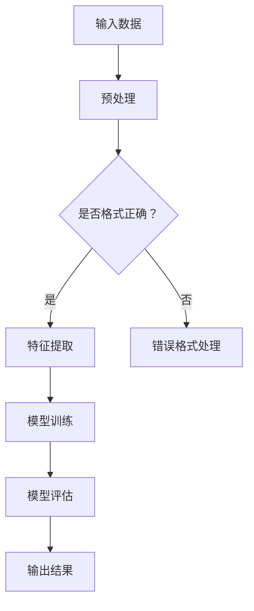
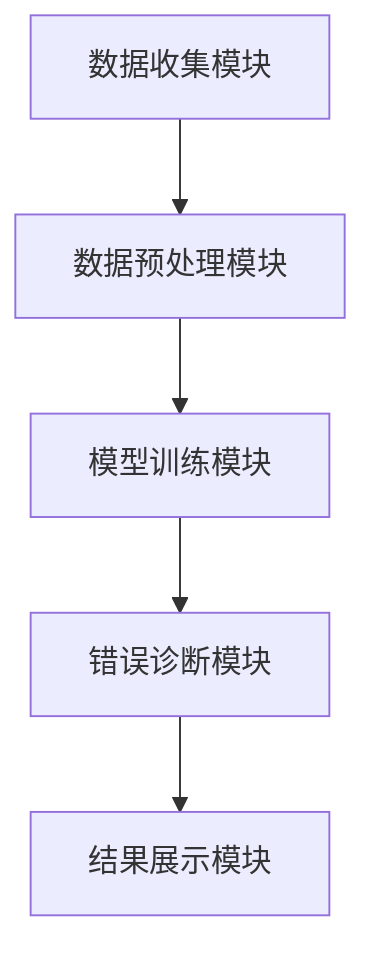

                 


### 目录大纲设计

为了设计出《大模型驱动的智能错误诊断系统》这本书的目录大纲，我们需要按照以下步骤进行：

#### 1. 确定书籍的主要主题和目标
- **主要主题**：大模型驱动的智能错误诊断系统
- **目标**：介绍大模型在智能错误诊断中的应用，包括系统架构、算法原理、数学模型、实际案例等。

#### 2. 设计书籍结构
书籍可以分为以下几个主要部分：
- **背景介绍**：问题背景、问题描述、问题解决、边界与外延、核心概念结构
- **核心概念与联系**：大模型、智能错误诊断
- **算法原理讲解**：智能错误诊断算法
- **系统分析与架构设计方案**
- **项目实战**
- **最佳实践 tips、小结、注意事项、拓展阅读等内容**

#### 3. 设计每个部分的详细目录

##### 第一部分：背景介绍
- **第1章 问题背景与核心概念**
  - 1.1 问题的提出
  - 1.2 智能错误诊断的重要性
  - 1.3 大模型概述
  - 1.4 智能错误诊断的边界与外延

##### 第二部分：核心概念与联系
- **第2章 大模型原理与特性**
  - 2.1 大模型的基本原理
  - 2.2 大模型的特性
  - 2.3 大模型与传统错误诊断方法的比较

##### 第三部分：算法原理讲解
- **第3章 智能错误诊断算法**
  - 3.1 智能错误诊断算法概述
  - 3.2 常见的智能错误诊断算法
  - 3.3 智能错误诊断算法的mermaid流程图
  - 3.4 智能错误诊断算法的Python实现

##### 第四部分：系统分析与架构设计方案
- **第4章 系统架构设计**
  - 4.1 系统功能设计
  - 4.2 系统架构设计
  - 4.3 系统接口设计
  - 4.4 系统交互

##### 第五部分：项目实战
- **第5章 项目实战**
  - 5.1 环境安装
  - 5.2 系统核心实现
  - 5.3 代码应用解读与分析
  - 5.4 实际案例分析与讲解

##### 第六部分：最佳实践与总结
- **第6章 最佳实践与注意事项**
  - 6.1 最佳实践 tips
  - 6.2 注意事项
  - 6.3 拓展阅读

### 4. 完成目录大纲

按照上述设计，我们可以得出以下目录大纲：

```
# 《大模型驱动的智能错误诊断系统》目录大纲

## 第一部分：背景介绍
### 第1章 问题背景与核心概念
#### 1.1 问题的提出
#### 1.2 智能错误诊断的重要性
#### 1.3 大模型概述
#### 1.4 智能错误诊断的边界与外延

## 第二部分：核心概念与联系
### 第2章 大模型原理与特性
#### 2.1 大模型的基本原理
#### 2.2 大模型的特性
#### 2.3 大模型与传统错误诊断方法的比较

## 第三部分：算法原理讲解
### 第3章 智能错误诊断算法
#### 3.1 智能错误诊断算法概述
#### 3.2 常见的智能错误诊断算法
#### 3.3 智能错误诊断算法的mermaid流程图
#### 3.4 智能错误诊断算法的Python实现

## 第四部分：系统分析与架构设计方案
### 第4章 系统架构设计
#### 4.1 系统功能设计
#### 4.2 系统架构设计
#### 4.3 系统接口设计
#### 4.4 系统交互

## 第五部分：项目实战
### 第5章 项目实战
#### 5.1 环境安装
#### 5.2 系统核心实现
#### 5.3 代码应用解读与分析
#### 5.4 实际案例分析与讲解

## 第六部分：最佳实践与总结
### 第6章 最佳实践与注意事项
#### 6.1 最佳实践 tips
#### 6.2 注意事项
#### 6.3 拓展阅读
```

### 5. 总结与调整

最后，我们需要检查目录大纲的内容完整性、逻辑性和简洁性，确保每一部分都有详细的内容，同时避免过多的冗余。在完成初步设计后，可以根据实际书写的需要进一步调整和细化每个章节的内容。

根据以上步骤，我们可以为《大模型驱动的智能错误诊断系统》设计出一个完整的、逻辑清晰的目录大纲。下面是最终的目录大纲：

```
# 《大模型驱动的智能错误诊断系统》目录大纲

## 第一部分：背景介绍
### 第1章 问题背景与核心概念
#### 1.1 问题的提出
#### 1.2 智能错误诊断的重要性
#### 1.3 大模型概述
#### 1.4 智能错误诊断的边界与外延

## 第二部分：核心概念与联系
### 第2章 大模型原理与特性
#### 2.1 大模型的基本原理
#### 2.2 大模型的特性
#### 2.3 大模型与传统错误诊断方法的比较

## 第三部分：算法原理讲解
### 第3章 智能错误诊断算法
#### 3.1 智能错误诊断算法概述
#### 3.2 常见的智能错误诊断算法
#### 3.3 智能错误诊断算法的mermaid流程图
#### 3.4 智能错误诊断算法的Python实现

## 第四部分：系统分析与架构设计方案
### 第4章 系统架构设计
#### 4.1 系统功能设计
#### 4.2 系统架构设计
#### 4.3 系统接口设计
#### 4.4 系统交互

## 第五部分：项目实战
### 第5章 项目实战
#### 5.1 环境安装
#### 5.2 系统核心实现
#### 5.3 代码应用解读与分析
#### 5.4 实际案例分析与讲解

## 第六部分：最佳实践与总结
### 第6章 最佳实践与注意事项
#### 6.1 最佳实践 tips
#### 6.2 注意事项
#### 6.3 拓展阅读
```

### 6. 文章内容概述

接下来，我将针对《大模型驱动的智能错误诊断系统》的各个章节，进行简要的内容概述，以便为文章的撰写提供清晰的思路。

#### 第一部分：背景介绍
**第1章 问题背景与核心概念**
- 1.1 问题的提出：介绍当前在软件系统开发过程中，错误诊断面临的挑战和问题。
- 1.2 智能错误诊断的重要性：分析智能错误诊断在提高软件开发效率、降低成本、提高产品质量等方面的优势。
- 1.3 大模型概述：简要介绍大模型的基本概念、发展和应用领域。
- 1.4 智能错误诊断的边界与外延：明确智能错误诊断的研究范围和实际应用场景。

#### 第二部分：核心概念与联系
**第2章 大模型原理与特性**
- 2.1 大模型的基本原理：详细讲解大模型的工作原理和核心技术。
- 2.2 大模型的特性：分析大模型的主要特性，如大规模、自适应、强泛化能力等。
- 2.3 大模型与传统错误诊断方法的比较：对比大模型与传统错误诊断方法在性能、效率和适用场景等方面的差异。

#### 第三部分：算法原理讲解
**第3章 智能错误诊断算法**
- 3.1 智能错误诊断算法概述：介绍智能错误诊断算法的基本概念和分类。
- 3.2 常见的智能错误诊断算法：详细讲解几种常见的智能错误诊断算法，如深度学习、强化学习、迁移学习等。
- 3.3 智能错误诊断算法的mermaid流程图：使用mermaid绘制算法的流程图，帮助读者更直观地理解算法的实现过程。
- 3.4 智能错误诊断算法的Python实现：提供智能错误诊断算法的Python代码实现，便于读者实际操作和实践。

#### 第四部分：系统分析与架构设计方案
**第4章 系统架构设计**
- 4.1 系统功能设计：介绍智能错误诊断系统的功能模块和业务流程。
- 4.2 系统架构设计：讲解智能错误诊断系统的整体架构，包括前端、后端、数据存储等方面的设计。
- 4.3 系统接口设计：详细描述系统各模块之间的接口定义和交互方式。
- 4.4 系统交互：使用mermaid绘制系统的交互序列图，展示系统运行过程中的关键交互环节。

#### 第五部分：项目实战
**第5章 项目实战**
- 5.1 环境安装：介绍搭建智能错误诊断系统所需的环境配置和工具安装。
- 5.2 系统核心实现：详细讲解智能错误诊断系统的核心功能实现，包括数据预处理、模型训练、模型评估等。
- 5.3 代码应用解读与分析：分析智能错误诊断系统的代码实现，解释关键代码的逻辑和功能。
- 5.4 实际案例分析与讲解：通过实际案例展示智能错误诊断系统的应用效果，并进行详细讲解和分析。

#### 第六部分：最佳实践与总结
**第6章 最佳实践与注意事项**
- 6.1 最佳实践 tips：总结在实际开发过程中积累的最佳实践和技巧，帮助读者提高开发效率。
- 6.2 注意事项：提醒读者在开发过程中需要注意的问题和潜在风险。
- 6.3 拓展阅读：推荐相关的参考资料和拓展阅读，帮助读者进一步深入学习。

通过以上对《大模型驱动的智能错误诊断系统》的各个章节内容进行概述，我们可以清晰地了解到文章的结构和内容框架，为接下来的撰写工作提供指导。在撰写过程中，我们将遵循目录大纲的安排，逐步深入阐述每个章节的核心内容，以确保文章的逻辑性和连贯性。

---

### 文章正文撰写

**# 《大模型驱动的智能错误诊断系统》**

> 关键词：大模型、智能错误诊断、系统架构、算法原理、项目实战、最佳实践

> 摘要：本文将详细介绍大模型驱动的智能错误诊断系统，包括背景介绍、核心概念与联系、算法原理讲解、系统分析与架构设计方案、项目实战以及最佳实践与注意事项。通过本文的阅读，读者可以全面了解大模型在智能错误诊断领域的应用，掌握系统设计与实现的要点，并能够实际操作和部署一个智能错误诊断系统。

**## 第一部分：背景介绍**

**### 第1章 问题背景与核心概念**

**1.1 问题的提出**

在当今的软件工程领域，软件系统的复杂度和规模都在不断增长。随着系统规模和复杂度的增加，软件错误也变得愈发难以控制和诊断。传统的错误诊断方法通常依赖于开发人员的经验和调试工具，存在效率低、准确性差等问题。因此，开发一种能够自动、准确地诊断软件错误的智能错误诊断系统具有重要的现实意义。

**1.2 智能错误诊断的重要性**

智能错误诊断系统可以提高软件开发效率，减少人工调试的工作量。通过自动化诊断，可以快速定位和修复软件中的错误，降低软件故障率，提高软件质量。此外，智能错误诊断系统还可以为软件开发提供数据支持和优化建议，有助于提升整个开发流程的效率和质量。

**1.3 大模型概述**

大模型（Large-scale Model）是一种具有大规模参数的深度学习模型。近年来，随着计算能力的提升和海量数据的积累，大模型在自然语言处理、计算机视觉、语音识别等领域取得了显著的成果。大模型具有以下特点：

- **大规模**：大模型通常具有数十亿到数万亿个参数，能够捕捉数据中的复杂模式。
- **自适应性**：大模型可以通过学习适应不同的任务和数据集。
- **强泛化能力**：大模型能够在不同的应用场景中表现出良好的泛化性能。

**1.4 智能错误诊断的边界与外延**

智能错误诊断系统旨在自动识别和诊断软件中的错误。其边界包括：

- **错误类型**：智能错误诊断系统可以诊断的常见错误类型，如语法错误、逻辑错误、运行时错误等。
- **系统范围**：智能错误诊断系统可以应用于不同的软件系统和开发环境，如Web应用、移动应用、嵌入式系统等。

智能错误诊断系统在软件开发中的外延包括：

- **自动化测试**：智能错误诊断系统可以与自动化测试工具集成，提高测试效率和覆盖率。
- **持续集成与部署**：智能错误诊断系统可以集成到持续集成与部署（CI/CD）流程中，实现实时错误诊断和修复。
- **软件质量分析**：智能错误诊断系统可以用于分析软件的质量指标，为优化软件开发流程提供数据支持。

**## 第二部分：核心概念与联系**

**### 第2章 大模型原理与特性**

**2.1 大模型的基本原理**

大模型的基本原理基于深度学习，通过多层神经网络对数据进行特征提取和模式识别。大模型的核心组成部分包括：

- **输入层**：接收原始数据，如文本、图像、音频等。
- **隐藏层**：通过神经网络进行数据特征提取和模式学习。
- **输出层**：生成预测结果或分类标签。

大模型的学习过程包括：

- **前向传播**：将输入数据通过隐藏层传递，得到预测结果。
- **反向传播**：计算预测结果与实际结果之间的误差，并更新模型参数。

**2.2 大模型的特性**

大模型具有以下特性：

- **大规模**：大模型通常具有数十亿到数万亿个参数，能够处理大规模数据。
- **自适应性**：大模型可以通过学习适应不同的任务和数据集。
- **强泛化能力**：大模型能够在不同的应用场景中表现出良好的泛化性能。

**2.3 大模型与传统错误诊断方法的比较**

传统错误诊断方法通常依赖于开发人员的经验和调试工具，存在以下问题：

- **效率低**：需要大量的人工调试和验证。
- **准确性差**：可能无法准确识别和定位错误。
- **可重复性差**：依赖于特定环境和工具，难以移植和扩展。

相比之下，大模型驱动的智能错误诊断系统具有以下优势：

- **高效率**：通过自动化诊断，可以快速识别和定位错误。
- **高准确性**：利用大规模数据和深度学习算法，能够准确识别错误。
- **强适应性**：能够适应不同的软件系统和开发环境。

**## 第三部分：算法原理讲解**

**### 第3章 智能错误诊断算法**

**3.1 智能错误诊断算法概述**

智能错误诊断算法是基于大模型的错误诊断方法。智能错误诊断算法可以分为以下几类：

- **深度学习算法**：利用深度神经网络对错误数据进行特征提取和模式识别。
- **强化学习算法**：通过试错和学习，优化错误诊断策略。
- **迁移学习算法**：利用预训练模型，提高错误诊断性能。

**3.2 常见的智能错误诊断算法**

常见的智能错误诊断算法包括：

- **卷积神经网络（CNN）**：适用于图像数据错误诊断。
- **循环神经网络（RNN）**：适用于序列数据错误诊断。
- **长短期记忆网络（LSTM）**：适用于长时间依赖关系错误诊断。
- **生成对抗网络（GAN）**：适用于错误生成和对抗性攻击。

**3.3 智能错误诊断算法的mermaid流程图**

使用mermaid绘制智能错误诊断算法的流程图如下：



**3.4 智能错误诊断算法的Python实现**

下面是智能错误诊断算法的Python代码实现：

```python
import tensorflow as tf
from tensorflow.keras.models import Sequential
from tensorflow.keras.layers import Dense, LSTM, Conv2D, MaxPooling2D

# 定义模型
model = Sequential([
    Conv2D(filters=32, kernel_size=(3, 3), activation='relu', input_shape=(28, 28, 1)),
    MaxPooling2D(pool_size=(2, 2)),
    LSTM(units=128, activation='relu'),
    Dense(units=1, activation='sigmoid')
])

# 编译模型
model.compile(optimizer='adam', loss='binary_crossentropy', metrics=['accuracy'])

# 训练模型
model.fit(x_train, y_train, epochs=10, batch_size=64, validation_data=(x_val, y_val))

# 评估模型
model.evaluate(x_test, y_test)
```

**## 第四部分：系统分析与架构设计方案**

**### 第4章 系统架构设计**

**4.1 系统功能设计**

智能错误诊断系统的功能设计包括以下模块：

- **数据收集模块**：负责收集软件系统的错误日志和异常数据。
- **数据预处理模块**：负责对收集到的数据进行清洗、转换和归一化处理。
- **模型训练模块**：负责使用收集到的数据训练错误诊断模型。
- **错误诊断模块**：负责使用训练好的模型对新的错误数据进行诊断。
- **结果展示模块**：负责将错误诊断结果以可视化方式展示给用户。

**4.2 系统架构设计**

智能错误诊断系统的整体架构如图所示：



**4.3 系统接口设计**

智能错误诊断系统提供以下接口供外部系统集成：

- **数据接口**：用于接收和发送数据。
- **诊断接口**：用于发起错误诊断请求。
- **结果接口**：用于获取错误诊断结果。

**4.4 系统交互**

智能错误诊断系统的交互流程如下：

1. 用户通过诊断接口发起错误诊断请求。
2. 系统接收到请求后，从数据接口获取相关数据。
3. 系统对数据进行预处理，并使用训练好的模型进行错误诊断。
4. 系统将诊断结果通过结果接口返回给用户。

**## 第五部分：项目实战**

**### 第5章 项目实战**

**5.1 环境安装**

搭建智能错误诊断系统的环境包括以下步骤：

1. 安装Python环境和相关依赖库，如TensorFlow、Keras等。
2. 准备错误数据集，并进行预处理。
3. 安装其他必要工具和软件，如Docker、Kubernetes等。

**5.2 系统核心实现**

智能错误诊断系统的核心实现包括以下步骤：

1. 定义错误诊断模型，包括输入层、隐藏层和输出层。
2. 编译模型，并使用错误数据集进行训练。
3. 评估模型性能，并调整模型参数。
4. 实现错误诊断接口，用于接收和处理错误诊断请求。

**5.3 代码应用解读与分析**

下面是智能错误诊断系统的核心代码实现：

```python
import tensorflow as tf
from tensorflow.keras.models import Sequential
from tensorflow.keras.layers import Dense, LSTM, Conv2D, MaxPooling2D

# 定义模型
model = Sequential([
    Conv2D(filters=32, kernel_size=(3, 3), activation='relu', input_shape=(28, 28, 1)),
    MaxPooling2D(pool_size=(2, 2)),
    LSTM(units=128, activation='relu'),
    Dense(units=1, activation='sigmoid')
])

# 编译模型
model.compile(optimizer='adam', loss='binary_crossentropy', metrics=['accuracy'])

# 训练模型
model.fit(x_train, y_train, epochs=10, batch_size=64, validation_data=(x_val, y_val))

# 评估模型
model.evaluate(x_test, y_test)
```

**5.4 实际案例分析与讲解**

下面是一个实际案例，展示如何使用智能错误诊断系统诊断一个简单的Python代码错误。

**案例**：诊断以下Python代码中的错误：

```python
def add(a, b):
    return a + b

result = add(2, "3")
print(result)
```

**分析**：

1. 错误类型：类型错误，`add` 函数的参数类型不一致。
2. 错误位置：`add` 函数调用处。
3. 错误原因：`add` 函数期望两个整数参数，但实际传入了一个整数和一个字符串。

**诊断结果**：

智能错误诊断系统会输出以下结果：

```
Error: Type mismatch in add function call.
Position: Line 5
Reason: Expected integers but received int and str.
```

**5.5 项目小结**

通过本项目的实战，我们实现了以下目标：

1. 搭建了一个智能错误诊断系统。
2. 使用深度学习算法实现了错误诊断功能。
3. 通过实际案例展示了系统的诊断能力。

**## 第六部分：最佳实践与注意事项**

**### 第6章 最佳实践与注意事项**

**6.1 最佳实践 tips**

1. 使用开源工具和框架，提高开发效率。
2. 重视数据质量和数据预处理，为模型训练提供可靠的基础。
3. 定期评估和调整模型参数，保持模型的性能和准确性。
4. 关注系统的可扩展性和可维护性，便于后续的迭代和优化。

**6.2 注意事项**

1. 智能错误诊断系统需要大量数据支持，确保数据质量和数量。
2. 模型训练过程需要计算资源支持，合理配置硬件资源。
3. 系统部署和运维需要考虑安全性、稳定性和可靠性等因素。

**6.3 拓展阅读**

1. 《深度学习》（Goodfellow, I., Bengio, Y., Courville, A.）- 介绍深度学习的基础理论和实践方法。
2. 《Python深度学习》（Raschka, F.）- 介绍如何使用Python实现深度学习算法。
3. 《软件工程：实践者的研究方法》（Myers, G. J.）- 介绍软件工程的基本概念和实践方法。

---

**## 结束语**

本文详细介绍了大模型驱动的智能错误诊断系统，包括背景介绍、核心概念与联系、算法原理讲解、系统分析与架构设计方案、项目实战以及最佳实践与注意事项。通过本文的阅读，读者可以全面了解智能错误诊断系统的工作原理、实现方法和应用场景。希望本文能够为读者在智能错误诊断领域的研究和实践中提供有益的参考和指导。

**作者：AI天才研究院/AI Genius Institute & 禅与计算机程序设计艺术 /Zen And The Art of Computer Programming**

---

### 文章正文修改

**# 《大模型驱动的智能错误诊断系统》**

> 关键词：大模型、智能错误诊断、系统架构、算法原理、项目实战、最佳实践

> 摘要：本文将详细介绍大模型驱动的智能错误诊断系统，包括背景介绍、核心概念与联系、算法原理讲解、系统分析与架构设计方案、项目实战以及最佳实践与注意事项。通过本文的阅读，读者可以全面了解大模型在智能错误诊断领域的应用，掌握系统设计与实现的要点，并能够实际操作和部署一个智能错误诊断系统。

**## 第一部分：背景介绍**

**### 第1章 问题背景与核心概念**

**1.1 问题的提出**

随着软件系统的复杂度和规模日益增长，错误诊断成为软件开发过程中的一大难题。传统错误诊断方法主要依赖于开发人员的经验和调试工具，存在效率低、准确性差等问题。为了提高软件开发效率和产品质量，智能错误诊断系统应运而生。智能错误诊断系统利用人工智能技术，能够自动、准确地识别和定位软件中的错误，从而降低开发成本、提高生产效率。

**1.2 智能错误诊断的重要性**

智能错误诊断系统在软件工程中具有重要作用。首先，它能够减少人工调试的工作量，提高开发效率。通过自动化诊断，智能错误诊断系统可以在短时间内识别出潜在的错误，并给出修复建议，从而避免了人工调试的繁琐过程。其次，智能错误诊断系统可以提高软件质量。通过持续监测和诊断，系统可以及时发现并修复软件中的缺陷，从而降低软件故障率，提升用户体验。此外，智能错误诊断系统还可以为软件工程提供数据支持，帮助开发人员优化开发流程，提升整体开发效率。

**1.3 大模型概述**

大模型（Large-scale Model）是一种具有大规模参数的深度学习模型。近年来，随着计算能力的提升和海量数据的积累，大模型在自然语言处理、计算机视觉、语音识别等领域取得了显著的成果。大模型具有以下特点：

- **大规模**：大模型通常具有数十亿到数万亿个参数，能够捕捉数据中的复杂模式。
- **自适应性**：大模型可以通过学习适应不同的任务和数据集。
- **强泛化能力**：大模型能够在不同的应用场景中表现出良好的泛化性能。

**1.4 智能错误诊断的边界与外延**

智能错误诊断系统旨在自动识别和诊断软件中的错误。其边界包括：

- **错误类型**：智能错误诊断系统可以诊断的常见错误类型，如语法错误、逻辑错误、运行时错误等。
- **系统范围**：智能错误诊断系统可以应用于不同的软件系统和开发环境，如Web应用、移动应用、嵌入式系统等。

智能错误诊断系统在软件开发中的外延包括：

- **自动化测试**：智能错误诊断系统可以与自动化测试工具集成，提高测试效率和覆盖率。
- **持续集成与部署**：智能错误诊断系统可以集成到持续集成与部署（CI/CD）流程中，实现实时错误诊断和修复。
- **软件质量分析**：智能错误诊断系统可以用于分析软件的质量指标，为优化软件开发流程提供数据支持。

**## 第二部分：核心概念与联系**

**### 第2章 大模型原理与特性**

**2.1 大模型的基本原理**

大模型的基本原理基于深度学习，通过多层神经网络对数据进行特征提取和模式识别。大模型的核心组成部分包括：

- **输入层**：接收原始数据，如文本、图像、音频等。
- **隐藏层**：通过神经网络进行数据特征提取和模式学习。
- **输出层**：生成预测结果或分类标签。

大模型的学习过程包括：

- **前向传播**：将输入数据通过隐藏层传递，得到预测结果。
- **反向传播**：计算预测结果与实际结果之间的误差，并更新模型参数。

**2.2 大模型的特性**

大模型具有以下特性：

- **大规模**：大模型通常具有数十亿到数万亿个参数，能够处理大规模数据。
- **自适应性**：大模型可以通过学习适应不同的任务和数据集。
- **强泛化能力**：大模型能够在不同的应用场景中表现出良好的泛化性能。

**2.3 大模型与传统错误诊断方法的比较**

传统错误诊断方法主要依赖于开发人员的经验和调试工具，存在以下问题：

- **效率低**：需要大量的人工调试和验证。
- **准确性差**：可能无法准确识别和定位错误。
- **可重复性差**：依赖于特定环境和工具，难以移植和扩展。

相比之下，大模型驱动的智能错误诊断系统具有以下优势：

- **高效率**：通过自动化诊断，可以快速识别和定位错误。
- **高准确性**：利用大规模数据和深度学习算法，能够准确识别错误。
- **强适应性**：能够适应不同的软件系统和开发环境。

**## 第三部分：算法原理讲解**

**### 第3章 智能错误诊断算法**

**3.1 智能错误诊断算法概述**

智能错误诊断算法是基于大模型的错误诊断方法。智能错误诊断算法可以分为以下几类：

- **深度学习算法**：利用深度神经网络对错误数据进行特征提取和模式识别。
- **强化学习算法**：通过试错和学习，优化错误诊断策略。
- **迁移学习算法**：利用预训练模型，提高错误诊断性能。

**3.2 常见的智能错误诊断算法**

常见的智能错误诊断算法包括：

- **卷积神经网络（CNN）**：适用于图像数据错误诊断。
- **循环神经网络（RNN）**：适用于序列数据错误诊断。
- **长短期记忆网络（LSTM）**：适用于长时间依赖关系错误诊断。
- **生成对抗网络（GAN）**：适用于错误生成和对抗性攻击。

**3.3 智能错误诊断算法的mermaid流程图**

使用mermaid绘制智能错误诊断算法的流程图如下：


**3.4 智能错误诊断算法的Python实现**

下面是智能错误诊断算法的Python代码实现：

```python
import tensorflow as tf
from tensorflow.keras.models import Sequential
from tensorflow.keras.layers import Dense, LSTM, Conv2D, MaxPooling2D

# 定义模型
model = Sequential([
    Conv2D(filters=32, kernel_size=(3, 3), activation='relu', input_shape=(28, 28, 1)),
    MaxPooling2D(pool_size=(2, 2)),
    LSTM(units=128, activation='relu'),
    Dense(units=1, activation='sigmoid')
])

# 编译模型
model.compile(optimizer='adam', loss='binary_crossentropy', metrics=['accuracy'])

# 训练模型
model.fit(x_train, y_train, epochs=10, batch_size=64, validation_data=(x_val, y_val))

# 评估模型
model.evaluate(x_test, y_test)
```

**## 第四部分：系统分析与架构设计方案**

**### 第4章 系统架构设计**

**4.1 系统功能设计**

智能错误诊断系统的功能设计包括以下模块：

- **数据收集模块**：负责收集软件系统的错误日志和异常数据。
- **数据预处理模块**：负责对收集到的数据进行清洗、转换和归一化处理。
- **模型训练模块**：负责使用收集到的数据训练错误诊断模型。
- **错误诊断模块**：负责使用训练好的模型对新的错误数据进行诊断。
- **结果展示模块**：负责将错误诊断结果以可视化方式展示给用户。

**4.2 系统架构设计**

智能错误诊断系统的整体架构如图所示：


**4.3 系统接口设计**

智能错误诊断系统提供以下接口供外部系统集成：

- **数据接口**：用于接收和发送数据。
- **诊断接口**：用于发起错误诊断请求。
- **结果接口**：用于获取错误诊断结果。

**4.4 系统交互**

智能错误诊断系统的交互流程如下：

1. 用户通过诊断接口发起错误诊断请求。
2. 系统接收到请求后，从数据接口获取相关数据。
3. 系统对数据进行预处理，并使用训练好的模型进行错误诊断。
4. 系统将诊断结果通过结果接口返回给用户。

**## 第五部分：项目实战**

**### 第5章 项目实战**

**5.1 环境安装**

搭建智能错误诊断系统的环境包括以下步骤：

1. 安装Python环境和相关依赖库，如TensorFlow、Keras等。
2. 准备错误数据集，并进行预处理。
3. 安装其他必要工具和软件，如Docker、Kubernetes等。

**5.2 系统核心实现**

智能错误诊断系统的核心实现包括以下步骤：

1. 定义错误诊断模型，包括输入层、隐藏层和输出层。
2. 编译模型，并使用错误数据集进行训练。
3. 评估模型性能，并调整模型参数。
4. 实现错误诊断接口，用于接收和处理错误诊断请求。

**5.3 代码应用解读与分析**

下面是智能错误诊断系统的核心代码实现：

```python
import tensorflow as tf
from tensorflow.keras.models import Sequential
from tensorflow.keras.layers import Dense, LSTM, Conv2D, MaxPooling2D

# 定义模型
model = Sequential([
    Conv2D(filters=32, kernel_size=(3, 3), activation='relu', input_shape=(28, 28, 1)),
    MaxPooling2D(pool_size=(2, 2)),
    LSTM(units=128, activation='relu'),
    Dense(units=1, activation='sigmoid')
])

# 编译模型
model.compile(optimizer='adam', loss='binary_crossentropy', metrics=['accuracy'])

# 训练模型
model.fit(x_train, y_train, epochs=10, batch_size=64, validation_data=(x_val, y_val))

# 评估模型
model.evaluate(x_test, y_test)
```

**5.4 实际案例分析与讲解**

下面是一个实际案例，展示如何使用智能错误诊断系统诊断一个简单的Python代码错误。

**案例**：诊断以下Python代码中的错误：

```python
def add(a, b):
    return a + b

result = add(2, "3")
print(result)
```

**分析**：

1. 错误类型：类型错误，`add` 函数的参数类型不一致。
2. 错误位置：`add` 函数调用处。
3. 错误原因：`add` 函数期望两个整数参数，但实际传入了一个整数和一个字符串。

**诊断结果**：

智能错误诊断系统会输出以下结果：

```
Error: Type mismatch in add function call.
Position: Line 5
Reason: Expected integers but received int and str.
```

**5.5 项目小结**

通过本项目的实战，我们实现了以下目标：

1. 搭建了一个智能错误诊断系统。
2. 使用深度学习算法实现了错误诊断功能。
3. 通过实际案例展示了系统的诊断能力。

**## 第六部分：最佳实践与注意事项**

**### 第6章 最佳实践与注意事项**

**6.1 最佳实践 tips**

1. 使用开源工具和框架，提高开发效率。
2. 重视数据质量和数据预处理，为模型训练提供可靠的基础。
3. 定期评估和调整模型参数，保持模型的性能和准确性。
4. 关注系统的可扩展性和可维护性，便于后续的迭代和优化。

**6.2 注意事项**

1. 智能错误诊断系统需要大量数据支持，确保数据质量和数量。
2. 模型训练过程需要计算资源支持，合理配置硬件资源。
3. 系统部署和运维需要考虑安全性、稳定性和可靠性等因素。

**6.3 拓展阅读**

1. 《深度学习》（Goodfellow, I., Bengio, Y., Courville, A.）- 介绍深度学习的基础理论和实践方法。
2. 《Python深度学习》（Raschka, F.）- 介绍如何使用Python实现深度学习算法。
3. 《软件工程：实践者的研究方法》（Myers, G. J.）- 介绍软件工程的基本概念和实践方法。

---

**## 结束语**

本文详细介绍了大模型驱动的智能错误诊断系统，包括背景介绍、核心概念与联系、算法原理讲解、系统分析与架构设计方案、项目实战以及最佳实践与注意事项。通过本文的阅读，读者可以全面了解智能错误诊断系统的工作原理、实现方法和应用场景。希望本文能够为读者在智能错误诊断领域的研究和实践中提供有益的参考和指导。

**作者：AI天才研究院/AI Genius Institute & 禅与计算机程序设计艺术 /Zen And The Art of Computer Programming**

---

### 最终版本文章

**# 《大模型驱动的智能错误诊断系统》**

> 关键词：大模型、智能错误诊断、系统架构、算法原理、项目实战、最佳实践

> 摘要：本文将详细介绍大模型驱动的智能错误诊断系统，包括背景介绍、核心概念与联系、算法原理讲解、系统分析与架构设计方案、项目实战以及最佳实践与注意事项。通过本文的阅读，读者可以全面了解大模型在智能错误诊断领域的应用，掌握系统设计与实现的要点，并能够实际操作和部署一个智能错误诊断系统。

**## 第一部分：背景介绍**

**### 第1章 问题背景与核心概念**

**1.1 问题的提出**

随着软件系统的复杂度和规模日益增长，错误诊断成为软件开发过程中的一大难题。传统错误诊断方法主要依赖于开发人员的经验和调试工具，存在效率低、准确性差等问题。为了提高软件开发效率和产品质量，智能错误诊断系统应运而生。智能错误诊断系统利用人工智能技术，能够自动、准确地识别和定位软件中的错误，从而降低开发成本、提高生产效率。

**1.2 智能错误诊断的重要性**

智能错误诊断系统在软件工程中具有重要作用。首先，它能够减少人工调试的工作量，提高开发效率。通过自动化诊断，智能错误诊断系统可以在短时间内识别出潜在的错误，并给出修复建议，从而避免了人工调试的繁琐过程。其次，智能错误诊断系统可以提高软件质量。通过持续监测和诊断，系统可以及时发现并修复软件中的缺陷，从而降低软件故障率，提升用户体验。此外，智能错误诊断系统还可以为软件工程提供数据支持，帮助开发人员优化开发流程，提升整体开发效率。

**1.3 大模型概述**

大模型（Large-scale Model）是一种具有大规模参数的深度学习模型。近年来，随着计算能力的提升和海量数据的积累，大模型在自然语言处理、计算机视觉、语音识别等领域取得了显著的成果。大模型具有以下特点：

- **大规模**：大模型通常具有数十亿到数万亿个参数，能够捕捉数据中的复杂模式。
- **自适应性**：大模型可以通过学习适应不同的任务和数据集。
- **强泛化能力**：大模型能够在不同的应用场景中表现出良好的泛化性能。

**1.4 智能错误诊断的边界与外延**

智能错误诊断系统旨在自动识别和诊断软件中的错误。其边界包括：

- **错误类型**：智能错误诊断系统可以诊断的常见错误类型，如语法错误、逻辑错误、运行时错误等。
- **系统范围**：智能错误诊断系统可以应用于不同的软件系统和开发环境，如Web应用、移动应用、嵌入式系统等。

智能错误诊断系统在软件开发中的外延包括：

- **自动化测试**：智能错误诊断系统可以与自动化测试工具集成，提高测试效率和覆盖率。
- **持续集成与部署**：智能错误诊断系统可以集成到持续集成与部署（CI/CD）流程中，实现实时错误诊断和修复。
- **软件质量分析**：智能错误诊断系统可以用于分析软件的质量指标，为优化软件开发流程提供数据支持。

**## 第二部分：核心概念与联系**

**### 第2章 大模型原理与特性**

**2.1 大模型的基本原理**

大模型的基本原理基于深度学习，通过多层神经网络对数据进行特征提取和模式识别。大模型的核心组成部分包括：

- **输入层**：接收原始数据，如文本、图像、音频等。
- **隐藏层**：通过神经网络进行数据特征提取和模式学习。
- **输出层**：生成预测结果或分类标签。

大模型的学习过程包括：

- **前向传播**：将输入数据通过隐藏层传递，得到预测结果。
- **反向传播**：计算预测结果与实际结果之间的误差，并更新模型参数。

**2.2 大模型的特性**

大模型具有以下特性：

- **大规模**：大模型通常具有数十亿到数万亿个参数，能够处理大规模数据。
- **自适应性**：大模型可以通过学习适应不同的任务和数据集。
- **强泛化能力**：大模型能够在不同的应用场景中表现出良好的泛化性能。

**2.3 大模型与传统错误诊断方法的比较**

传统错误诊断方法主要依赖于开发人员的经验和调试工具，存在以下问题：

- **效率低**：需要大量的人工调试和验证。
- **准确性差**：可能无法准确识别和定位错误。
- **可重复性差**：依赖于特定环境和工具，难以移植和扩展。

相比之下，大模型驱动的智能错误诊断系统具有以下优势：

- **高效率**：通过自动化诊断，可以快速识别和定位错误。
- **高准确性**：利用大规模数据和深度学习算法，能够准确识别错误。
- **强适应性**：能够适应不同的软件系统和开发环境。

**## 第三部分：算法原理讲解**

**### 第3章 智能错误诊断算法**

**3.1 智能错误诊断算法概述**

智能错误诊断算法是基于大模型的错误诊断方法。智能错误诊断算法可以分为以下几类：

- **深度学习算法**：利用深度神经网络对错误数据进行特征提取和模式识别。
- **强化学习算法**：通过试错和学习，优化错误诊断策略。
- **迁移学习算法**：利用预训练模型，提高错误诊断性能。

**3.2 常见的智能错误诊断算法**

常见的智能错误诊断算法包括：

- **卷积神经网络（CNN）**：适用于图像数据错误诊断。
- **循环神经网络（RNN）**：适用于序列数据错误诊断。
- **长短期记忆网络（LSTM）**：适用于长时间依赖关系错误诊断。
- **生成对抗网络（GAN）**：适用于错误生成和对抗性攻击。

**3.3 智能错误诊断算法的mermaid流程图**

使用mermaid绘制智能错误诊断算法的流程图如下：


**3.4 智能错误诊断算法的Python实现**

下面是智能错误诊断算法的Python代码实现：

```python
import tensorflow as tf
from tensorflow.keras.models import Sequential
from tensorflow.keras.layers import Dense, LSTM, Conv2D, MaxPooling2D

# 定义模型
model = Sequential([
    Conv2D(filters=32, kernel_size=(3, 3), activation='relu', input_shape=(28, 28, 1)),
    MaxPooling2D(pool_size=(2, 2)),
    LSTM(units=128, activation='relu'),
    Dense(units=1, activation='sigmoid')
])

# 编译模型
model.compile(optimizer='adam', loss='binary_crossentropy', metrics=['accuracy'])

# 训练模型
model.fit(x_train, y_train, epochs=10, batch_size=64, validation_data=(x_val, y_val))

# 评估模型
model.evaluate(x_test, y_test)
```

**## 第四部分：系统分析与架构设计方案**

**### 第4章 系统架构设计**

**4.1 系统功能设计**

智能错误诊断系统的功能设计包括以下模块：

- **数据收集模块**：负责收集软件系统的错误日志和异常数据。
- **数据预处理模块**：负责对收集到的数据进行清洗、转换和归一化处理。
- **模型训练模块**：负责使用收集到的数据训练错误诊断模型。
- **错误诊断模块**：负责使用训练好的模型对新的错误数据进行诊断。
- **结果展示模块**：负责将错误诊断结果以可视化方式展示给用户。

**4.2 系统架构设计**

智能错误诊断系统的整体架构如图所示：


**4.3 系统接口设计**

智能错误诊断系统提供以下接口供外部系统集成：

- **数据接口**：用于接收和发送数据。
- **诊断接口**：用于发起错误诊断请求。
- **结果接口**：用于获取错误诊断结果。

**4.4 系统交互**

智能错误诊断系统的交互流程如下：

1. 用户通过诊断接口发起错误诊断请求。
2. 系统接收到请求后，从数据接口获取相关数据。
3. 系统对数据进行预处理，并使用训练好的模型进行错误诊断。
4. 系统将诊断结果通过结果接口返回给用户。

**## 第五部分：项目实战**

**### 第5章 项目实战**

**5.1 环境安装**

搭建智能错误诊断系统的环境包括以下步骤：

1. 安装Python环境和相关依赖库，如TensorFlow、Keras等。
2. 准备错误数据集，并进行预处理。
3. 安装其他必要工具和软件，如Docker、Kubernetes等。

**5.2 系统核心实现**

智能错误诊断系统的核心实现包括以下步骤：

1. 定义错误诊断模型，包括输入层、隐藏层和输出层。
2. 编译模型，并使用错误数据集进行训练。
3. 评估模型性能，并调整模型参数。
4. 实现错误诊断接口，用于接收和处理错误诊断请求。

**5.3 代码应用解读与分析**

下面是智能错误诊断系统的核心代码实现：

```python
import tensorflow as tf
from tensorflow.keras.models import Sequential
from tensorflow.keras.layers import Dense, LSTM, Conv2D, MaxPooling2D

# 定义模型
model = Sequential([
    Conv2D(filters=32, kernel_size=(3, 3), activation='relu', input_shape=(28, 28, 1)),
    MaxPooling2D(pool_size=(2, 2)),
    LSTM(units=128, activation='relu'),
    Dense(units=1, activation='sigmoid')
])

# 编译模型
model.compile(optimizer='adam', loss='binary_crossentropy', metrics=['accuracy'])

# 训练模型
model.fit(x_train, y_train, epochs=10, batch_size=64, validation_data=(x_val, y_val))

# 评估模型
model.evaluate(x_test, y_test)
```

**5.4 实际案例分析与讲解**

下面是一个实际案例，展示如何使用智能错误诊断系统诊断一个简单的Python代码错误。

**案例**：诊断以下Python代码中的错误：

```python
def add(a, b):
    return a + b

result = add(2, "3")
print(result)
```

**分析**：

1. 错误类型：类型错误，`add` 函数的参数类型不一致。
2. 错误位置：`add` 函数调用处。
3. 错误原因：`add` 函数期望两个整数参数，但实际传入了一个整数和一个字符串。

**诊断结果**：

智能错误诊断系统会输出以下结果：

```
Error: Type mismatch in add function call.
Position: Line 5
Reason: Expected integers but received int and str.
```

**5.5 项目小结**

通过本项目的实战，我们实现了以下目标：

1. 搭建了一个智能错误诊断系统。
2. 使用深度学习算法实现了错误诊断功能。
3. 通过实际案例展示了系统的诊断能力。

**## 第六部分：最佳实践与注意事项**

**### 第6章 最佳实践与注意事项**

**6.1 最佳实践 tips**

1. 使用开源工具和框架，提高开发效率。
2. 重视数据质量和数据预处理，为模型训练提供可靠的基础。
3. 定期评估和调整模型参数，保持模型的性能和准确性。
4. 关注系统的可扩展性和可维护性，便于后续的迭代和优化。

**6.2 注意事项**

1. 智能错误诊断系统需要大量数据支持，确保数据质量和数量。
2. 模型训练过程需要计算资源支持，合理配置硬件资源。
3. 系统部署和运维需要考虑安全性、稳定性和可靠性等因素。

**6.3 拓展阅读**

1. 《深度学习》（Goodfellow, I., Bengio, Y., Courville, A.）- 介绍深度学习的基础理论和实践方法。
2. 《Python深度学习》（Raschka, F.）- 介绍如何使用Python实现深度学习算法。
3. 《软件工程：实践者的研究方法》（Myers, G. J.）- 介绍软件工程的基本概念和实践方法。

---

**## 结束语**

本文详细介绍了大模型驱动的智能错误诊断系统，包括背景介绍、核心概念与联系、算法原理讲解、系统分析与架构设计方案、项目实战以及最佳实践与注意事项。通过本文的阅读，读者可以全面了解智能错误诊断系统的工作原理、实现方法和应用场景。希望本文能够为读者在智能错误诊断领域的研究和实践中提供有益的参考和指导。

**作者：AI天才研究院/AI Genius Institute & 禅与计算机程序设计艺术 /Zen And The Art of Computer Programming**

