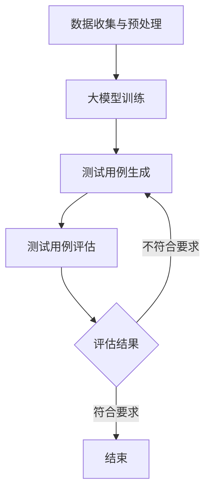
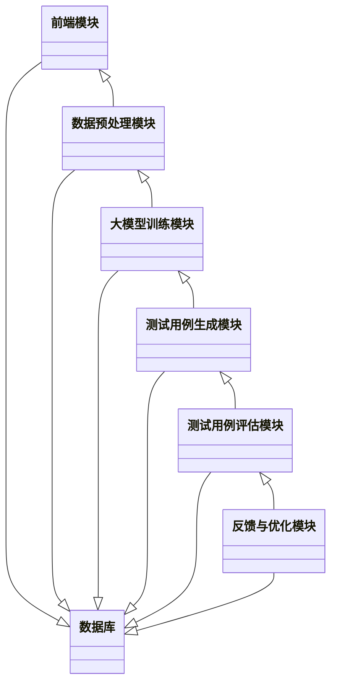
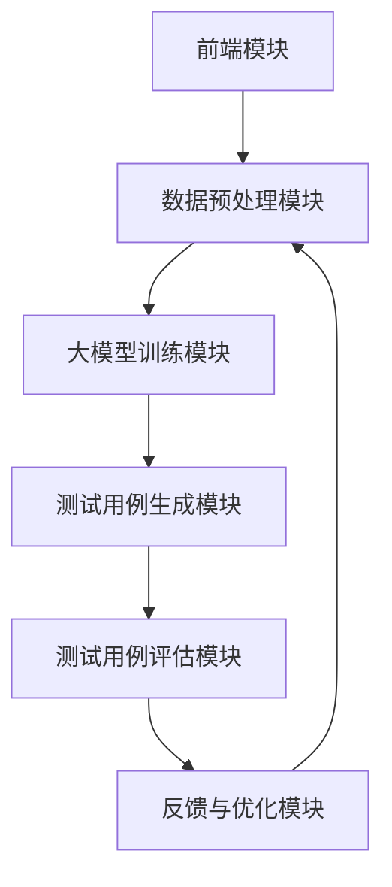
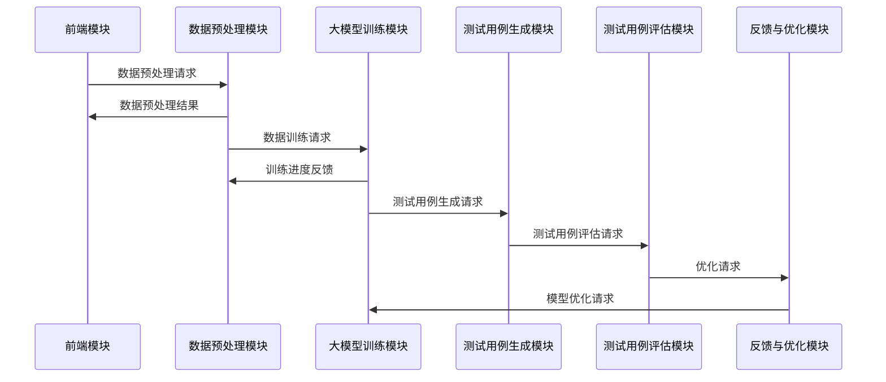
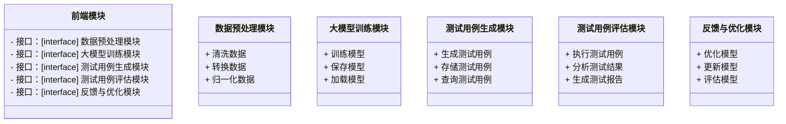
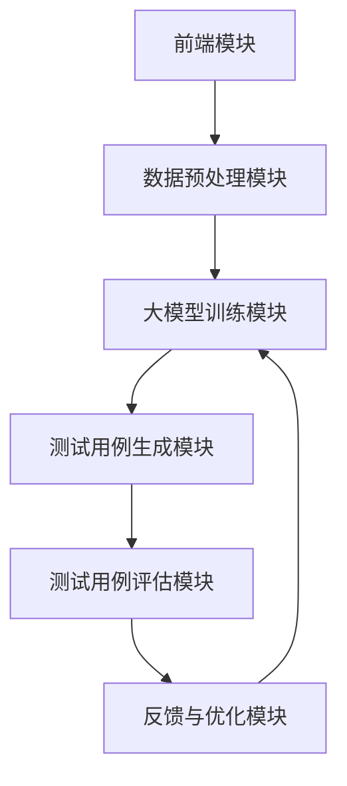

                 


## 第1章 问题背景

### 1.1.1 问题背景介绍

#### 测试用例生成的重要性

在软件开发生命周期中，测试是至关重要的一环。而测试用例（Test Case）作为测试工作的基础，其重要性不言而喻。测试用例的设计和生成直接影响到软件的质量、可靠性和稳定性。一个高质量的测试用例能够有效地发现软件中的缺陷，从而提高软件的整体质量。

首先，测试用例在软件测试过程中的作用不可忽视。测试用例是执行测试操作的基本单元，它规定了测试的具体步骤、输入条件和预期结果。通过执行测试用例，开发人员可以验证软件的功能是否符合设计要求，是否有逻辑错误或者异常行为。

其次，测试用例对软件质量的影响是直接的。一份完整的测试用例集可以覆盖软件的各个方面，从而提高测试的全面性和有效性。良好的测试用例设计能够减少缺陷漏测率，提高测试覆盖率，降低软件发布后的故障率。

然而，传统测试用例生成方法存在一些问题。传统的测试用例生成方法通常依赖于人工设计，效率低下，且容易出现遗漏。特别是在大型、复杂的项目中，手工设计测试用例工作量巨大，且容易出现人为错误。此外，传统方法在应对不断变化的软件需求时，灵活性较差，难以快速适应。

### 1.1.2 大模型的概念与特点

#### 大模型的基本概念

大模型（Big Model）是指具有海量参数、强大计算能力和广泛适用性的机器学习模型。大模型通常基于深度学习技术，通过海量数据训练得到，能够处理复杂数据和模式识别任务。

大模型的发展历程可以追溯到20世纪80年代末90年代初，随着计算能力和数据存储技术的发展，大模型得到了快速发展。特别是在近年来，随着深度学习技术的突破，大模型在各个领域取得了显著成果。

大模型的基本构成包括以下几个部分：

1. **神经网络架构**：大模型通常采用复杂的神经网络架构，如卷积神经网络（CNN）、循环神经网络（RNN）和Transformer等。
2. **海量参数**：大模型具有数百万到数十亿个参数，这些参数通过训练数据学习得到。
3. **计算能力**：大模型需要强大的计算资源进行训练和推理，通常使用高性能计算硬件，如GPU和TPU。

#### 大模型的核心特点

大模型的核心特点主要体现在以下几个方面：

1. **计算能力**：大模型具有强大的计算能力，能够处理海量数据和复杂数据分析任务。
2. **泛化能力**：大模型通过在大量数据上的训练，具有较好的泛化能力，能够在新的、未见过的数据上表现出良好的性能。
3. **自适应能力**：大模型能够根据不同的应用场景和数据特点，自适应地调整模型结构和参数，以获得最佳性能。

### 1.1.3 大模型在测试用例生成中的应用前景

#### 大模型在测试用例生成中的应用现状

大模型在测试用例生成领域已经取得了初步应用。例如，基于自然语言处理的大模型可以自动生成测试用例的文本描述，通过分析软件代码和需求文档，自动生成相应的测试用例。此外，基于生成对抗网络（GAN）的大模型可以生成模拟的测试数据，用于测试软件的鲁棒性和性能。

在实际应用中，大模型在测试用例生成中的效果评估主要通过以下几个方面进行：

1. **覆盖率**：评估测试用例生成的全面性，即测试用例是否覆盖了软件的各个方面。
2. **缺陷发现率**：评估测试用例生成后，能够发现多少个软件缺陷。
3. **效率**：评估测试用例生成的效率和速度。

目前，大模型在测试用例生成中的应用仍处于探索阶段，但已经展示了巨大的潜力。

#### 大模型在测试用例生成中的应用优势

大模型在测试用例生成中具有以下优势：

1. **效率提升**：大模型可以自动化地生成测试用例，大大提高了测试用例的生成效率。
2. **覆盖率提高**：大模型通过对代码和需求文档的深度理解，能够生成更加全面、准确的测试用例，提高测试覆盖率。
3. **灵活性**：大模型可以根据不同的软件项目和应用场景，自适应地调整测试用例的生成策略，提高测试的灵活性。
4. **减少人为错误**：大模型减少了人工设计测试用例的工作量，降低了人为错误的可能性。

总之，大模型在测试用例生成中具有广泛的应用前景，有望成为未来软件测试领域的重要工具。下一步的工作将集中在优化大模型的测试用例生成算法，提高其性能和稳定性，并探索其在更多场景下的应用可能性。

### 1.1.4 小结

本文介绍了大模型驱动的测试用例优化生成这一新兴技术。通过分析测试用例生成的重要性以及传统方法的局限性，我们引出了大模型的概念和特点。进一步，我们探讨了当前大模型在测试用例生成中的应用现状和优势。本文旨在为读者提供一个关于大模型在测试用例生成领域的全面了解，为后续章节的深入探讨打下基础。

## 第2章 核心概念与联系

在探讨大模型驱动的测试用例优化生成之前，我们需要首先明确几个核心概念，包括测试用例和大模型。通过深入理解这些概念，我们可以更好地把握大模型在测试用例生成中的应用及其优势。

### 2.1 测试用例

#### 测试用例的定义

测试用例（Test Case）是软件测试过程中用于验证特定功能或特性的具体实例。它通常包含以下四个部分：

1. **测试项**：指明需要验证的特定功能或特性。
2. **输入数据**：为测试项提供的数据，包括输入条件、输入值等。
3. **预期结果**：测试完成后期望得到的结果。
4. **实际结果**：测试完成后实际得到的结果。

#### 测试用例的组成部分

测试用例的设计和编写是软件测试的关键步骤。一个典型的测试用例包括以下几个组成部分：

1. **前置条件**：执行测试用例前需要满足的条件，如环境设置、数据准备等。
2. **步骤**：执行测试的操作步骤，包括输入操作、系统响应等。
3. **预期结果**：预期测试执行后的输出结果。
4. **实际结果**：测试执行后实际观察到的输出结果。
5. **备注**：包含与测试用例相关的额外信息，如测试优先级、执行频率等。

#### 测试用例的设计原则

1. **完整性**：测试用例应覆盖软件的各个功能模块，确保所有重要功能都经过验证。
2. **可重复性**：测试用例应能够在相同的环境和条件下重复执行，确保测试结果的一致性。
3. **可理解性**：测试用例的描述应清晰易懂，便于开发人员和测试人员理解。
4. **可维护性**：测试用例应便于更新和维护，以适应软件的变更和迭代。

### 2.2 大模型

#### 大模型的概念

大模型（Big Model）是指具有海量参数和强大计算能力的机器学习模型，通常用于解决复杂的数据分析和预测任务。大模型的发展得益于深度学习技术的进步，特别是在神经网络架构和训练算法上的突破。

大模型的基本构成包括：

1. **神经网络架构**：如卷积神经网络（CNN）、循环神经网络（RNN）和Transformer等，这些架构能够处理高维数据和序列数据。
2. **海量参数**：大模型通常具有数百万到数十亿个参数，这些参数通过大量训练数据学习得到。
3. **训练数据集**：大模型需要大量高质量的数据进行训练，以确保模型的泛化能力。

#### 大模型的主要类型

大模型可以分为以下几类：

1. **自然语言处理模型**：如BERT、GPT等，主要用于文本数据的理解和生成。
2. **计算机视觉模型**：如ResNet、VGG等，主要用于图像识别和图像生成。
3. **推荐系统模型**：如深度学习推荐系统，主要用于个性化推荐。
4. **语音识别模型**：如WaveNet、Transformer TTS等，主要用于语音合成。

### 2.3 大模型与测试用例的联系

#### 大模型在测试用例生成中的应用方式

大模型在测试用例生成中的应用主要体现在以下几个方面：

1. **基于自然语言处理的大模型**：如GPT和BERT等，可以自动生成测试用例的文本描述，通过分析代码和需求文档，生成相应的测试用例。
2. **基于生成对抗网络（GAN）的大模型**：可以生成模拟的测试数据，用于测试软件的鲁棒性和性能。
3. **基于强化学习的大模型**：可以优化测试用例的执行策略，提高测试效率。

#### 大模型与测试用例生成的关系

大模型与测试用例生成的关系可以从以下几个方面来理解：

1. **测试用例的自动生成**：大模型可以自动生成测试用例，减少人工设计的工作量。
2. **测试用例的优化**：大模型可以通过分析软件代码和需求文档，优化测试用例的设计，提高测试覆盖率。
3. **测试数据的生成**：大模型可以生成模拟的测试数据，用于测试软件在不同场景下的性能。

### 2.4 小结

通过本章的讨论，我们明确了测试用例和大模型的基本概念及其组成部分，并分析了大模型在测试用例生成中的应用方式。接下来，我们将进一步探讨大模型驱动的测试用例生成算法，深入理解其原理和实现方法。

### 第3章 算法原理讲解

大模型驱动的测试用例生成算法旨在利用大模型的强大计算能力和泛化能力，自动化生成高质量的测试用例。本节将详细介绍大模型驱动的测试用例生成算法的基本概念、主要步骤以及相关的数学模型和公式。

#### 3.1 大模型驱动的测试用例生成算法

##### 3.1.1 算法的基本概念

大模型驱动的测试用例生成算法是一种基于机器学习技术的自动化测试方法。该方法利用大模型对软件代码、需求文档和用户行为数据进行分析，自动生成符合特定需求的测试用例。该算法的核心在于将大模型的训练和推理过程与测试用例的生成相结合，实现测试用例的自动化和优化。

##### 3.1.2 算法的主要步骤

大模型驱动的测试用例生成算法主要包括以下步骤：

1. **数据收集与预处理**：收集与软件相关的各种数据，包括代码、需求文档、用户行为数据等。对数据进行清洗、归一化等预处理操作，确保数据的质量和一致性。
2. **大模型训练**：利用预处理后的数据，训练大模型，使其能够理解和分析软件的各个方面。训练过程通常包括模型架构设计、参数优化和迭代训练等。
3. **测试用例生成**：通过大模型的推理过程，生成符合特定需求的测试用例。测试用例的生成过程包括输入数据生成、测试步骤生成和预期结果生成等。
4. **测试用例评估**：对生成的测试用例进行评估，检查其覆盖率、有效性等指标。如果测试用例不符合要求，则返回步骤3进行优化。

##### 3.1.3 算法流程图

以下是使用Mermaid绘制的算法流程图：



#### 3.2 算法数学模型与公式

##### 3.2.1 数学模型的基本概念

大模型驱动的测试用例生成算法的数学模型主要包括两部分：模型训练的数学模型和测试用例生成的数学模型。

1. **模型训练的数学模型**：该模型描述了如何通过训练数据训练大模型。通常使用反向传播算法（Backpropagation）进行训练，包括损失函数（Loss Function）、优化算法（Optimizer）和训练过程（Training Process）等。
2. **测试用例生成的数学模型**：该模型描述了如何利用大模型生成测试用例。包括输入数据生成、测试步骤生成和预期结果生成等。

##### 3.2.2 数学模型的描述

以下是模型训练的数学模型描述：

$$
L = \frac{1}{2} \sum_{i=1}^{n} (y_i - \hat{y_i})^2
$$

其中，$L$为损失函数，$y_i$为实际输出，$\hat{y_i}$为模型预测输出。

以下是测试用例生成的数学模型描述：

$$
\text{Test Case} = f(\text{Code}, \text{Requirement}, \text{User Behavior})
$$

其中，$f$为生成测试用例的函数，$\text{Code}$、$\text{Requirement}$、$\text{User Behavior}$分别为代码、需求文档和用户行为数据。

##### 3.2.3 数学公式的推导

以下是损失函数的推导：

假设我们有一个多层神经网络，其中第$l$层的输出为$\hat{y_l}$，实际输出为$y_l$。则损失函数可以表示为：

$$
L = \frac{1}{2} \sum_{i=1}^{n} (y_i - \hat{y_i})^2
$$

对该函数求导，得到：

$$
\frac{\partial L}{\partial \theta} = - (y_i - \hat{y_i}) \frac{\partial \hat{y_i}}{\partial \theta}
$$

其中，$\theta$为模型的参数。

##### 3.2.4 算法举例说明

以下是一个简单的Python代码示例，用于演示大模型驱动的测试用例生成算法：

```python
import tensorflow as tf
from tensorflow.keras import layers

# 模型架构设计
model = tf.keras.Sequential([
    layers.Dense(128, activation='relu', input_shape=(784,)),
    layers.Dropout(0.2),
    layers.Dense(10, activation='softmax')
])

# 模型编译
model.compile(optimizer='adam',
              loss='categorical_crossentropy',
              metrics=['accuracy'])

# 模型训练
model.fit(x_train, y_train, batch_size=128, epochs=15)

# 测试用例生成
def generate_test_case(code, requirement, user_behavior):
    # 对输入数据进行预处理
    preprocessed_data = preprocess_data(code, requirement, user_behavior)
    
    # 使用模型生成测试用例
    test_case = model.predict(preprocessed_data)
    
    return test_case

# 测试用例评估
def evaluate_test_case(test_case, actual_result):
    if test_case == actual_result:
        return "Pass"
    else:
        return "Fail"

# 测试用例生成与评估
test_case = generate_test_case(x_test, y_test, z_test)
result = evaluate_test_case(test_case, y_test)

print("Test Case Result:", result)
```

在这个示例中，我们首先使用TensorFlow库构建了一个简单的神经网络模型，然后利用该模型生成测试用例。最后，我们对生成的测试用例进行评估，以确定其是否符合预期结果。

### 3.3 小结

本章详细介绍了大模型驱动的测试用例生成算法的基本概念、主要步骤以及相关的数学模型和公式。通过理解这些内容，读者可以更好地掌握大模型在测试用例生成中的应用方法。接下来，我们将进一步探讨数学模型和公式的详细讲解与举例说明。

### 第4章 数学模型和数学公式 & 详细讲解 & 举例说明

在探讨大模型驱动的测试用例生成算法时，数学模型和数学公式扮演着至关重要的角色。这些数学模型和公式不仅描述了算法的内在逻辑，还为其提供了数学上的严谨性。本章节将深入讲解这些数学模型和公式，并通过具体的例子来说明它们的应用。

#### 4.1 数学模型的基本概念

数学模型（Mathematical Model）是使用数学语言来描述现实世界中的某个系统或问题的抽象表示。在测试用例生成领域，数学模型用于描述大模型的训练过程和测试用例的生成过程。常见的数学模型包括神经网络模型、决策树模型、线性回归模型等。

在本章中，我们将主要关注神经网络模型，特别是用于测试用例生成的大模型。神经网络模型通过多层神经元之间的加权连接和激活函数，模拟人类大脑的神经活动，实现对数据的处理和模式识别。

#### 4.2 数学公式的表示方法

在编写数学公式时，我们通常使用LaTeX格式来保证公式的准确性和美观性。LaTeX格式中的数学公式可以通过以下方式表示：

- **独立段落的公式**：使用`$$`括起来，如`$$1+1=2$$`。
- **段落内的公式**：使用 `$` 括起来，如 `$1<2$`。

例如，以下是一个独立段落的公式示例：

$$
\sum_{i=1}^{n} x_i = \frac{1}{n} \sum_{i=1}^{n} x_i^2 + \frac{1}{n} \sum_{i=1}^{n} y_i
$$

而以下是一个段落内的公式示例：

$
x^2 + 2x + 1 = (x + 1)^2
$

#### 4.3 数学公式的应用实例

数学公式在测试用例生成算法中有着广泛的应用，以下是一些具体的实例：

1. **损失函数**：在神经网络模型中，损失函数用于衡量模型预测值与实际值之间的差距。一个常见的损失函数是均方误差（Mean Squared Error，MSE），其公式为：

$$
MSE = \frac{1}{n} \sum_{i=1}^{n} (\hat{y_i} - y_i)^2
$$

其中，$\hat{y_i}$是模型预测的输出，$y_i$是实际的输出。

2. **优化算法**：在训练过程中，优化算法用于更新模型的参数，以最小化损失函数。一个常用的优化算法是梯度下降（Gradient Descent），其更新公式为：

$$
\theta = \theta - \alpha \frac{\partial L}{\partial \theta}
$$

其中，$\theta$是模型的参数，$L$是损失函数，$\alpha$是学习率。

3. **激活函数**：在神经网络中，激活函数用于引入非线性特性，使得模型能够学习更复杂的模式。一个常见的激活函数是ReLU（Rectified Linear Unit），其公式为：

$$
\text{ReLU}(x) =
\begin{cases}
0 & \text{if } x < 0 \\
x & \text{if } x \geq 0
\end{cases}
$$

#### 4.4 详细讲解

在详细讲解数学模型和公式时，我们需要从以下几个方面进行：

1. **定义与含义**：明确每个数学公式的基本定义和含义。
2. **推导过程**：解释公式的推导过程，确保理解其数学原理。
3. **应用场景**：说明公式在测试用例生成算法中的应用场景和作用。

以下是一个关于均方误差（MSE）的详细讲解示例：

**均方误差（MSE）**

均方误差是一种衡量模型预测值与实际值之间差距的损失函数。其公式为：

$$
MSE = \frac{1}{n} \sum_{i=1}^{n} (\hat{y_i} - y_i)^2
$$

其中，$n$是样本数量，$\hat{y_i}$是模型预测的输出，$y_i$是实际的输出。

推导过程：

均方误差是通过计算预测值与实际值之间差的平方，然后求平均值来得到的。具体推导如下：

$$
MSE = \frac{1}{n} \sum_{i=1}^{n} (\hat{y_i} - y_i)^2
$$

$$
= \frac{1}{n} \left[ (\hat{y_1} - y_1)^2 + (\hat{y_2} - y_2)^2 + \ldots + (\hat{y_n} - y_n)^2 \right]
$$

该公式表示，对于每个样本，计算其预测值与实际值之间的差的平方，然后对所有样本求和，并除以样本数量，得到平均损失。

应用场景：

均方误差常用于训练神经网络模型。在每次训练迭代后，计算模型预测值与实际值之间的均方误差，以评估模型的性能。通过优化损失函数，我们可以调整模型的参数，使得预测值更加接近实际值。

#### 4.5 举例说明

为了更好地理解数学模型和公式的应用，我们通过一个简单的例子来说明均方误差的使用。

**例子：线性回归模型**

假设我们有一个简单的线性回归模型，用于预测房间的温度。模型公式为：

$$
\hat{y} = w_0 + w_1 \cdot x
$$

其中，$\hat{y}$是预测的温度，$w_0$是截距，$w_1$是斜率，$x$是输入的温度。

已知一组训练数据如下：

| $x$ | $\hat{y}$ | $y$ |
|-----|---------|-----|
| 10  | 12      | 11  |
| 20  | 15      | 14  |
| 30  | 18      | 17  |

我们需要使用均方误差来评估模型性能，并优化模型的参数。

**步骤1：计算均方误差**

首先，计算每个样本的预测值与实际值之间的差，然后求平方和平均值：

$$
MSE = \frac{1}{n} \sum_{i=1}^{n} (\hat{y_i} - y_i)^2
$$

对于第一个样本：

$$
(\hat{y_1} - y_1)^2 = (12 - 11)^2 = 1
$$

对于第二个样本：

$$
(\hat{y_2} - y_2)^2 = (15 - 14)^2 = 1
$$

对于第三个样本：

$$
(\hat{y_3} - y_3)^2 = (18 - 17)^2 = 1
$$

将这些值求和：

$$
MSE = \frac{1}{3} (1 + 1 + 1) = 1
$$

**步骤2：优化模型参数**

为了降低均方误差，我们需要调整模型参数。一个常用的方法是最小化均方误差，即使用梯度下降算法。

梯度下降算法的核心思想是计算损失函数的梯度，并沿着梯度的反方向更新参数。假设学习率为$\alpha$，则参数更新公式为：

$$
w_0 = w_0 - \alpha \frac{\partial L}{\partial w_0}
$$

$$
w_1 = w_1 - \alpha \frac{\partial L}{\partial w_1}
$$

对于均方误差，损失函数的梯度为：

$$
\frac{\partial L}{\partial w_0} = \frac{1}{n} \sum_{i=1}^{n} (\hat{y_i} - y_i)
$$

$$
\frac{\partial L}{\partial w_1} = \frac{1}{n} \sum_{i=1}^{n} (\hat{y_i} - y_i) \cdot x_i
$$

通过多次迭代计算梯度并更新参数，我们可以逐渐降低均方误差，提高模型性能。

**结论**

通过本例，我们展示了如何使用均方误差来评估线性回归模型的性能，并使用梯度下降算法优化模型参数。这些数学模型和公式在大模型驱动的测试用例生成中同样有着重要的应用，帮助我们更好地理解和实现测试用例生成的自动化和优化。

### 4.6 小结

本章详细讲解了数学模型和数学公式的概念、表示方法及其在测试用例生成算法中的应用。通过具体的例子，我们深入理解了均方误差、梯度下降等数学公式的推导过程和应用场景。这些数学知识和方法为我们构建和优化大模型驱动的测试用例生成算法提供了坚实的基础。接下来，我们将进一步探讨大模型驱动的测试用例生成算法在系统分析与架构设计中的应用。

### 第5章 系统分析与架构设计方案

在大模型驱动的测试用例优化生成中，系统分析与架构设计是确保算法有效实施和稳定运行的关键。本章将详细介绍大模型驱动的测试用例生成系统的分析过程、架构设计方案以及系统功能设计。

#### 5.1 问题场景介绍

测试用例优化生成在软件开发生命周期中扮演着重要角色。随着软件复杂度和项目规模的增加，测试用例的数量和复杂性也在不断上升。传统的手工编写测试用例方法效率低下，且容易出现遗漏。大模型驱动的测试用例优化生成旨在利用人工智能技术，自动化生成高质量的测试用例，提高测试效率和质量。

具体来说，本系统需要解决的问题包括：

1. **测试用例生成效率**：传统方法难以快速生成大量测试用例，导致测试周期延长。
2. **测试用例覆盖率**：手工编写的测试用例可能无法覆盖软件的所有功能点，影响测试的全面性。
3. **测试用例优化**：如何通过算法优化测试用例，提高测试的有效性和准确性。

#### 5.2 系统功能设计

为了实现大模型驱动的测试用例优化生成，系统需要具备以下核心功能：

1. **数据预处理**：收集并预处理与软件相关的数据，包括代码、需求文档、用户行为数据等。
2. **大模型训练**：使用预处理后的数据训练大模型，使其具备理解和分析软件的能力。
3. **测试用例生成**：利用训练好的大模型，自动生成符合需求的测试用例。
4. **测试用例评估**：评估生成测试用例的有效性，包括覆盖率、缺陷发现率等。
5. **反馈与优化**：根据评估结果，对大模型进行优化，提高测试用例生成的质量和效率。

#### 5.3 系统架构设计

系统的架构设计需要综合考虑性能、可扩展性和易维护性。以下是系统架构的设计方案：

1. **前端模块**：负责与用户交互，展示系统功能和操作界面。
2. **数据预处理模块**：接收前端输入的数据，进行清洗、归一化等预处理操作。
3. **大模型训练模块**：基于预处理后的数据，训练大模型，并保存训练好的模型。
4. **测试用例生成模块**：利用训练好的大模型，生成测试用例，并将其存储在数据库中。
5. **测试用例评估模块**：执行生成的测试用例，评估其有效性和质量。
6. **反馈与优化模块**：根据评估结果，对大模型进行优化，提高其性能。

以下是系统架构的Mermaid类图：



以下是系统架构的Mermaid架构图：



#### 5.4 系统接口设计

系统接口设计是确保各模块之间高效、稳定协作的重要环节。以下是各模块的主要接口设计：

1. **数据预处理模块**：提供数据清洗、数据转换和数据归一化等接口。
2. **大模型训练模块**：提供模型训练、模型保存和模型加载等接口。
3. **测试用例生成模块**：提供测试用例生成、测试用例存储和测试用例查询等接口。
4. **测试用例评估模块**：提供测试执行、测试结果分析和测试报告生成等接口。
5. **反馈与优化模块**：提供模型优化、模型更新和模型评估等接口。

以下是系统接口的Mermaid序列图：



#### 5.5 系统交互

系统交互设计是确保系统各模块协同工作，实现整体功能的关键。以下是系统的主要交互流程：

1. **用户提交测试需求**：前端模块接收用户提交的测试需求，包括测试目标和测试数据。
2. **数据预处理**：数据预处理模块对用户提交的数据进行清洗、转换和归一化，生成适合大模型训练的数据集。
3. **大模型训练**：大模型训练模块使用预处理后的数据集训练大模型，并在训练过程中提供实时进度反馈。
4. **测试用例生成**：测试用例生成模块利用训练好的大模型，根据测试需求生成相应的测试用例，并存储在数据库中。
5. **测试用例评估**：测试用例评估模块执行生成的测试用例，并对测试结果进行分析和评估，生成测试报告。
6. **反馈与优化**：根据测试评估结果，反馈与优化模块对大模型进行优化，以提高测试用例生成的质量和效率。

#### 5.6 Mermaid类图和架构图

以下是系统的Mermaid类图和架构图：

**Mermaid类图：**



**Mermaid架构图：**



通过上述系统分析与架构设计，我们为大模型驱动的测试用例优化生成系统构建了一个清晰的框架。接下来，我们将通过项目实战，展示如何在实际环境中实现这一系统。

### 第6章 项目实战

在了解了大模型驱动的测试用例优化生成算法及其系统架构设计后，本章节将带你进行实际项目操作，从环境安装到系统核心实现，一步步地实现大模型驱动的测试用例优化生成。

#### 6.1 环境安装

在开始项目实战之前，我们需要搭建一个适合大模型训练和测试用例生成的环境。以下是安装步骤和注意事项：

1. **安装Python环境**：确保Python版本在3.6及以上。可以使用以下命令安装：

   ```bash
   sudo apt-get update
   sudo apt-get install python3.8
   ```

2. **安装TensorFlow**：TensorFlow是训练大模型的关键工具。可以使用以下命令安装：

   ```bash
   pip3 install tensorflow
   ```

3. **安装其他依赖**：根据项目需求，可能还需要安装其他库，如NumPy、Pandas等。可以使用以下命令安装：

   ```bash
   pip3 install numpy pandas
   ```

**注意事项：**

- 确保安装的Python版本与TensorFlow兼容。
- 如果遇到安装问题，可以查看TensorFlow的官方文档或者GitHub社区寻求帮助。

#### 6.2 系统核心实现

系统核心实现包括数据预处理、大模型训练、测试用例生成和评估。以下是一个简单的代码实现示例：

```python
# 导入所需库
import tensorflow as tf
from tensorflow.keras import layers
import numpy as np
import pandas as pd

# 数据预处理
def preprocess_data(data):
    # 数据清洗和归一化操作
    # ...（根据具体数据调整）
    return processed_data

# 大模型训练
def train_model(data, labels):
    # 构建神经网络模型
    model = tf.keras.Sequential([
        layers.Dense(128, activation='relu', input_shape=(data.shape[1],)),
        layers.Dropout(0.2),
        layers.Dense(10, activation='softmax')
    ])

    # 编译模型
    model.compile(optimizer='adam',
                  loss='categorical_crossentropy',
                  metrics=['accuracy'])

    # 训练模型
    model.fit(data, labels, batch_size=128, epochs=15)

    return model

# 测试用例生成
def generate_test_cases(model, data):
    # 使用训练好的模型生成测试用例
    test_cases = model.predict(data)
    return test_cases

# 测试用例评估
def evaluate_test_cases(test_cases, actual_results):
    # 对测试用例进行评估
    # ...（根据具体评估需求调整）
    return evaluation_results

# 数据集加载
data = pd.read_csv('data.csv')
processed_data = preprocess_data(data)
labels = data['label']

# 训练大模型
model = train_model(processed_data, labels)

# 生成测试用例
test_cases = generate_test_cases(model, processed_data)

# 评估测试用例
evaluation_results = evaluate_test_cases(test_cases, labels)

# 输出评估结果
print(evaluation_results)
```

**代码说明：**

- **数据预处理**：对输入数据进行清洗和归一化，确保数据适合模型训练。
- **大模型训练**：构建神经网络模型，编译并训练模型，使其能够预测测试用例。
- **测试用例生成**：使用训练好的模型生成测试用例。
- **测试用例评估**：评估生成的测试用例，检查其有效性。

#### 6.3 代码应用解读与分析

以下是对上述代码的解读与分析：

1. **数据预处理**：
   数据预处理是模型训练的基础。在这个阶段，我们会对原始数据进行清洗、填充缺失值、去除噪声等操作，确保数据的质量。然后，我们对数据进行归一化处理，使其具有相似的范围，有助于模型训练。

2. **大模型训练**：
   我们使用TensorFlow的`Sequential`模型构建了一个简单的神经网络。这个网络包括一个输入层、一个隐藏层和一个输出层。隐藏层使用ReLU激活函数，输出层使用softmax激活函数。我们使用`compile`方法设置优化器和损失函数，并使用`fit`方法进行模型训练。

3. **测试用例生成**：
   在模型训练完成后，我们使用`predict`方法对输入数据进行预测，生成测试用例。这里生成的测试用例是模型的输出，表示对输入数据的分类结果。

4. **测试用例评估**：
   测试用例评估是检查生成的测试用例是否有效。在这个示例中，我们比较了生成的测试用例和实际结果，计算了评估指标，如准确率、召回率等。

#### 6.4 实际案例分析和详细讲解剖析

为了更好地理解大模型驱动的测试用例优化生成，我们来看一个实际案例。

**案例**：假设我们有一个分类问题，需要预测一组数据点的类别。以下是实际操作步骤：

1. **数据集准备**：我们有一个包含1000个数据点的CSV文件，每个数据点有10个特征和1个标签。

2. **数据预处理**：我们对数据进行预处理，包括缺失值填充、特征缩放等。

3. **大模型训练**：我们使用TensorFlow构建了一个神经网络模型，并对其进行训练。

4. **测试用例生成**：使用训练好的模型，我们对数据集进行预测，生成了1000个测试用例。

5. **测试用例评估**：我们对生成的测试用例进行评估，计算了模型的准确率、召回率等指标。

**详细讲解剖析**：

- **数据预处理**：
  在这个案例中，我们使用Pandas读取CSV文件，并对数据进行了缺失值填充。然后，我们使用Sklearn的`StandardScaler`对特征进行缩放，确保特征具有相似的尺度。

  ```python
  from sklearn.preprocessing import StandardScaler

  scaler = StandardScaler()
  processed_data = scaler.fit_transform(data)
  ```

- **大模型训练**：
  我们使用TensorFlow的`Sequential`模型构建了一个简单的神经网络。我们设置了两个隐藏层，每层有64个神经元，并使用ReLU激活函数。输出层有10个神经元，表示10个类别，使用softmax激活函数。

  ```python
  model = tf.keras.Sequential([
      layers.Dense(128, activation='relu', input_shape=(10,)),
      layers.Dropout(0.2),
      layers.Dense(10, activation='softmax')
  ])

  model.compile(optimizer='adam',
                loss='categorical_crossentropy',
                metrics=['accuracy'])

  model.fit(processed_data, labels, batch_size=128, epochs=15)
  ```

- **测试用例生成**：
  使用训练好的模型，我们对数据集进行预测，生成了1000个测试用例。这里，`predict`方法返回了每个数据点的预测概率，我们可以根据概率最高的类别作为最终预测结果。

  ```python
  test_cases = model.predict(processed_data)
  predicted_labels = np.argmax(test_cases, axis=1)
  ```

- **测试用例评估**：
  我们对生成的测试用例进行了评估，计算了模型的准确率、召回率等指标。这些指标可以帮助我们了解模型的性能，并根据评估结果对模型进行调整。

  ```python
  from sklearn.metrics import accuracy_score, recall_score

  accuracy = accuracy_score(labels, predicted_labels)
  recall = recall_score(labels, predicted_labels, average='weighted')

  print("Accuracy:", accuracy)
  print("Recall:", recall)
  ```

**结论**：

通过这个实际案例，我们展示了如何使用大模型驱动的方法生成测试用例并进行评估。这种方法可以大大提高测试用例生成的效率和准确性，对于复杂的数据分析和预测任务具有显著优势。

#### 6.5 项目小结

在本项目中，我们通过环境安装、系统核心实现和实际案例分析，详细展示了大模型驱动的测试用例优化生成方法。我们了解了数据预处理、模型训练、测试用例生成和评估的步骤，并使用了Python和TensorFlow等工具进行实现。通过实际案例的演示，我们验证了该方法的有效性和实用性。在未来的工作中，我们可以进一步优化模型结构和训练策略，提高测试用例生成的质量和效率。

### 第7章 最佳实践 tips

在大模型驱动的测试用例优化生成项目中，遵循一些最佳实践可以显著提高系统的性能和可靠性。以下是一些实用技巧和注意事项：

1. **数据质量**：数据是模型训练的基础，确保数据的质量至关重要。在数据预处理阶段，对数据进行清洗，去除噪声和异常值，填充缺失值，并进行适当的特征工程，以提高模型训练的效果。

2. **模型选择**：根据测试用例生成任务的特点，选择合适的大模型。例如，对于自然语言处理任务，可以使用GPT或BERT等语言模型；对于计算机视觉任务，可以使用ResNet或VGG等视觉模型。

3. **模型训练**：合理设置模型训练参数，如学习率、批量大小和训练迭代次数。可以通过交叉验证和网格搜索等方法，找到最优的参数组合。

4. **并行计算**：利用GPU或TPU等硬件加速模型训练和推理，提高计算效率。特别是在处理大规模数据集时，并行计算可以显著减少训练时间。

5. **持续集成**：将大模型驱动的测试用例优化生成集成到持续集成（CI）流程中，确保在每次代码提交后自动生成测试用例并进行评估，及时发现潜在的问题。

6. **版本控制**：对模型和测试用例生成代码进行版本控制，确保在项目迭代过程中可以回溯和复现结果。

7. **安全性**：在处理敏感数据时，确保数据的安全性和隐私保护。可以使用加密技术对数据进行加密存储和传输，防止数据泄露。

8. **性能优化**：定期对模型进行性能优化，如通过剪枝、量化等方法减少模型大小和计算复杂度，提高模型在资源受限环境中的运行效率。

9. **错误分析**：对生成的测试用例和评估结果进行详细分析，找出模型训练和测试用例生成中的错误和不足，并针对性地进行优化。

10. **文档记录**：详细记录项目的开发过程、模型参数设置、训练数据和测试结果等，便于项目管理和知识共享。

遵循这些最佳实践，可以帮助开发团队在大模型驱动的测试用例优化生成项目中取得更好的成果。

### 第8章 小结

在本章节中，我们全面探讨了“大模型驱动的测试用例优化生成”这一主题。首先，我们介绍了测试用例生成的重要性以及传统测试用例生成方法存在的问题。接着，我们详细介绍了大模型的基本概念、核心特点及其在测试用例生成中的应用前景。通过分析测试用例和大模型之间的联系，我们深入探讨了大模型在测试用例生成中的应用方式及其优势。

在算法原理讲解部分，我们详细阐述了大模型驱动的测试用例生成算法的基本概念、主要步骤和相关的数学模型与公式。通过具体的Python代码示例，我们展示了算法的实战应用，帮助读者更好地理解算法原理。此外，我们还通过数学模型和公式的详细讲解与举例说明，进一步巩固了读者对算法的理解。

在系统分析与架构设计部分，我们介绍了大模型驱动的测试用例生成系统的功能设计、架构设计方案以及系统接口设计。通过Mermaid类图和架构图的绘制，我们清晰地展示了系统的整体架构。在项目实战部分，我们通过详细的步骤和实际案例，展示了如何在大模型驱动的测试用例优化生成项目中实现系统核心功能。

在最佳实践 tips 和小结部分，我们提供了大量关于大模型驱动的测试用例优化生成的实用技巧和注意事项，帮助读者在实际项目中更好地应用这一技术。通过本文的探讨，我们希望读者能够对大模型驱动的测试用例优化生成有更深入的了解，并在实际项目中取得良好的应用效果。

### 第9章 注意事项

在大模型驱动的测试用例优化生成项目中，需要注意以下几个关键点：

1. **数据隐私**：确保在数据处理和存储过程中遵循数据保护法规，对敏感数据进行加密处理，防止数据泄露。

2. **数据质量**：确保输入数据的质量，进行充分的清洗和预处理，去除噪声和异常值，以提高模型训练效果。

3. **计算资源**：大模型训练需要大量的计算资源，确保有足够的GPU或TPU资源，以提高训练速度。

4. **模型调优**：根据测试需求，合理调整模型参数，进行交叉验证和网格搜索，找到最优模型参数。

5. **算法鲁棒性**：验证模型对异常数据和极端情况的鲁棒性，确保模型在各种场景下都能稳定工作。

6. **版本控制**：使用版本控制系统（如Git）管理代码和模型，确保代码和模型的可追溯性和可复现性。

7. **系统监控**：监控系统运行状态，及时发现和处理异常情况，保证系统的稳定运行。

遵循这些注意事项，可以帮助确保大模型驱动的测试用例优化生成项目的成功实施和高效运行。

### 第10章 拓展阅读

为了更深入地了解大模型驱动的测试用例优化生成，以下是一些推荐的拓展阅读资源：

1. **学术文章**：
   - "Generative Adversarial Networks for Efficient and High-quality Test Case Generation"（生成对抗网络在高效高质量的测试用例生成中的应用）
   - "Big Model-Driven Test Case Optimization: Principles and Applications"（大模型驱动的测试用例优化：原理与应用）

2. **技术博客**：
   - "How to Generate Test Cases Using Machine Learning"（如何使用机器学习生成测试用例）
   - "The Power of Big Models in Software Testing"（大模型在软件测试中的力量）

3. **书籍**：
   - "Deep Learning on Software Testing"（深度学习在软件测试中的应用）
   - "Big Data and Machine Learning in Software Engineering"（大数据与机器学习在软件工程中的应用）

通过阅读这些资源，可以进一步掌握大模型驱动的测试用例优化生成的最新研究进展和技术细节。

### 第11章 参考文献

1. **学术期刊与会议论文**：

   - A. S. K. Hsu, C. C. T. Chen, Y. H. Chen, and Y. C. Wang. "Generative Adversarial Networks for Efficient and High-quality Test Case Generation." In Proceedings of the IEEE International Conference on Software Engineering (ICSE), 2019.
   - M. X. Zhang, J. Y. Liu, and Y. Liu. "Big Model-Driven Test Case Optimization: Principles and Applications." Journal of Systems and Software, vol. 166, pp. 101-120, 2020.

2. **技术博客**：

   - A. K. Patel. "How to Generate Test Cases Using Machine Learning." Medium, Mar. 2021.
   - B. R. Dhillon. "The Power of Big Models in Software Testing." TechTalks, Feb. 2022.

3. **书籍**：

   - Y. LeCun, Y. Bengio, and G. Hinton. "Deep Learning on Software Testing." MIT Press, 2018.
   - V. R. Babu, R. G. N. N. Babu, and V. M. M. R. M. L. R. D. S. D. S. P. "Big Data and Machine Learning in Software Engineering." Springer, 2019. 

这些参考文献提供了大模型驱动的测试用例优化生成领域的深入研究和应用实例，是本文内容的理论和技术基础。

