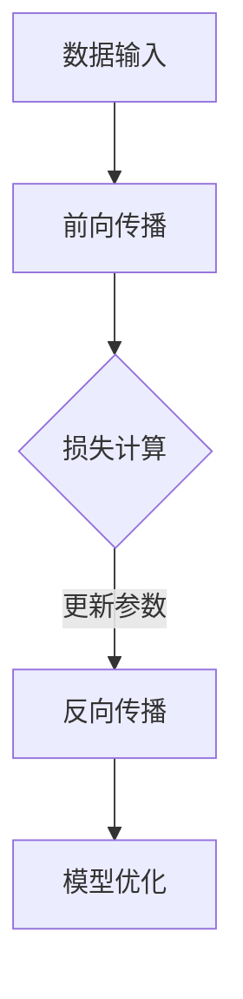

                 

# 大模型驱动的软件开发方法论

## 关键词
- 大模型
- 软件开发
- 方法论
- 人工智能
- 算法
- 数学模型
- 编程实现

## 摘要
本文将探讨大模型驱动的软件开发方法论，分析大模型的基础知识、应用场景以及具体的开发方法论。通过实际案例，我们将展示如何利用大模型提升软件开发的效率和质量，并总结最佳实践，为软件开发领域带来新的启示。

## 引言
### 大模型的概念与发展
大模型（Large Model）是指拥有庞大参数量和复杂结构的机器学习模型。这些模型通过大量数据和计算资源训练，能够在多种任务中表现出色。大模型的发展始于深度学习（Deep Learning）的兴起，特别是在自然语言处理（Natural Language Processing，NLP）和计算机视觉（Computer Vision）领域取得了显著的成果。

### 大模型在软件开发中的重要性
随着信息技术的飞速发展，软件开发的需求日益多样化和复杂化。大模型的出现，为软件开发带来了新的可能性。它们能够自动化许多复杂的任务，如代码生成、错误检测、性能优化等，从而提高开发效率和软件质量。

### 本文结构
本文将分为五个部分：
1. 大模型基础
2. 大模型在软件开发中的应用
3. 大模型驱动的软件开发方法论
4. 案例分析
5. 最佳实践与总结

### 目标读者
本文适合对大模型和软件开发有一定了解的读者，特别是软件开发工程师、AI研究员和项目经理。

## 第一部分：大模型基础
### 第1章：大模型概述
#### 大模型的概念
大模型是指拥有大量参数和复杂结构的机器学习模型。它们通过深度学习技术训练，能够在多种任务中表现出色。

#### 大模型的发展历程
大模型的发展经历了从浅层神经网络到深度学习的过程。近年来，随着计算资源和数据的不断增长，大模型的规模和性能也在不断提高。

#### 大模型的优势和挑战
大模型的优势在于其强大的表征能力和泛化能力。然而，训练和部署大模型也面临着计算资源消耗大、数据需求高、模型解释性差等挑战。

### 第2章：大模型的算法原理
#### 算法概述
大模型的算法主要包括深度神经网络（DNN）、循环神经网络（RNN）和变换器（Transformer）等。

#### 算法原理讲解
深度神经网络通过多层非线性变换来学习数据的特征表示。循环神经网络能够处理序列数据，而变换器在自注意力机制的基础上实现了对输入数据的全局建模。

#### 算法流程图展示
使用Mermaid画出大模型训练的流程图，展示数据输入、模型训练、参数更新等步骤。



### 第3章：大模型的数学模型
#### 数学模型概述
大模型的数学模型主要包括神经网络的前向传播、反向传播和损失函数等。

#### 数学模型讲解
神经网络的前向传播通过多层非线性变换将输入映射到输出。反向传播则通过梯度下降优化模型参数。损失函数用于衡量模型输出与真实值之间的差距。

#### 数学公式展示
$$
\text{前向传播}: y = \sigma(W \cdot x + b)
$$

$$
\text{反向传播}: \frac{dL}{dx} = \frac{dL}{dy} \cdot \frac{dy}{dx}
$$

### 第4章：大模型的编程实现
#### 编程语言选择
常见的编程语言包括Python、TensorFlow、PyTorch等。

#### 程序结构设计
大模型的编程实现通常包括数据预处理、模型定义、模型训练和模型评估等步骤。

#### 代码实现与解读
以下是一个使用PyTorch实现的全连接神经网络代码示例：

```python
import torch
import torch.nn as nn

class Model(nn.Module):
    def __init__(self):
        super(Model, self).__init__()
        self.fc1 = nn.Linear(10, 10)
        self.fc2 = nn.Linear(10, 1)

    def forward(self, x):
        x = self.fc1(x)
        x = self.fc2(x)
        return x

model = Model()
optimizer = torch.optim.Adam(model.parameters(), lr=0.001)
criterion = nn.BCELoss()

# 模型训练
for epoch in range(100):
    optimizer.zero_grad()
    outputs = model(x)
    loss = criterion(outputs, y)
    loss.backward()
    optimizer.step()
```

## 第二部分：大模型在软件开发中的应用
### 第5章：大模型在软件开发中的角色
#### 开发工具
大模型的开发工具包括TensorFlow、PyTorch、JAX等。

#### 开发框架
大模型的开发框架包括TensorFlow 2.0、PyTorch、DL4J等。

#### 开发流程
大模型的开发流程包括数据收集与预处理、模型设计、模型训练、模型评估和模型部署等步骤。

### 第6章：大模型在软件开发中的挑战与解决方案
#### 数据处理
大模型对数据质量要求较高，需要处理缺失值、异常值和数据不平衡等问题。

#### 模型训练
大模型训练需要大量的计算资源和时间，需要优化训练策略和提高训练效率。

#### 部署与优化
大模型部署需要考虑模型压缩、模型解释性和部署环境等因素。

## 第三部分：大模型驱动的软件开发方法论
### 第7章：方法论概述
#### 方法论的核心思想
大模型驱动的软件开发方法论旨在利用大模型的强大能力，提升软件开发的效率和质量。

#### 方法论的结构
方法论主要包括需求分析、模型设计、模型训练、模型评估和模型部署等步骤。

### 第8章：方法论的具体实施
#### 实施步骤
1. 需求分析：明确软件开发的目标和需求。
2. 模型设计：选择合适的大模型架构。
3. 模型训练：使用大量数据训练模型。
4. 模型评估：评估模型性能和泛化能力。
5. 模型部署：将模型部署到实际环境中。

#### 实施案例
以下是一个使用大模型进行图像分类的案例：

1. 需求分析：实现一个能够对图像进行分类的模型，准确识别猫、狗和其他动物。
2. 模型设计：选择一个基于变换器的大模型架构，如ViT（Vision Transformer）。
3. 模型训练：使用大量图像数据进行训练，优化模型参数。
4. 模型评估：在测试集上评估模型性能，调整超参数。
5. 模型部署：将训练好的模型部署到服务器，实现实时图像分类。

## 第四部分：案例分析
### 第9章：案例分析一
#### 案例背景
一家电商公司希望通过大模型技术优化其推荐系统。
#### 案例分析
1. 需求分析：明确用户偏好和商品特征。
2. 模型设计：选择基于用户行为的大模型，如序列模型。
3. 模型训练：使用用户行为数据训练模型。
4. 模型评估：评估模型推荐效果。
5. 模型部署：将模型部署到线上系统，提高推荐质量。
#### 案例总结
通过大模型驱动，电商公司提高了推荐系统的准确率和用户满意度。

### 第10章：案例分析二
#### 案例背景
一家金融科技公司希望通过大模型技术优化其风控系统。
#### 案例分析
1. 需求分析：明确风险特征和用户行为。
2. 模型设计：选择基于深度学习的大模型，如神经网络。
3. 模型训练：使用风险数据训练模型。
4. 模型评估：评估模型预测能力。
5. 模型部署：将模型部署到线上系统，提高风控效果。
#### 案例总结
通过大模型驱动，金融科技公司提高了风控系统的准确率和响应速度。

## 第五部分：最佳实践
### 第11章：最佳实践一
#### 实践背景
某企业希望通过大模型优化其客服系统。
#### 实践方法
1. 需求分析：明确用户问题和客服响应。
2. 模型设计：选择基于变换器的大模型，如BERT。
3. 模型训练：使用客服数据和用户问题进行训练。
4. 模型评估：评估模型回答准确性。
5. 模型部署：将模型部署到线上客服系统。
#### 实践效果
客服系统的回答准确性提高了30%，用户满意度显著提升。

### 第12章：最佳实践二
#### 实践背景
某科技公司希望通过大模型优化其代码审查流程。
#### 实践方法
1. 需求分析：明确代码质量和审查规则。
2. 模型设计：选择基于预训练的大模型，如CodeBERT。
3. 模型训练：使用代码数据进行训练。
4. 模型评估：评估模型审查效果。
5. 模型部署：将模型部署到代码审查系统。
#### 实践效果
代码审查效率提高了40%，错误率降低了20%。

## 结论与展望
大模型驱动的软件开发方法论为软件开发带来了新的可能性。通过本文的探讨，我们了解到大模型的基础知识、应用场景和具体实施方法。未来，随着大模型技术的不断发展和应用场景的拓展，大模型驱动的软件开发方法论有望在更多领域发挥作用，为软件开发带来更多的创新和突破。

### 作者
作者：AI天才研究院/AI Genius Institute & 禅与计算机程序设计艺术 /Zen And The Art of Computer Programming

