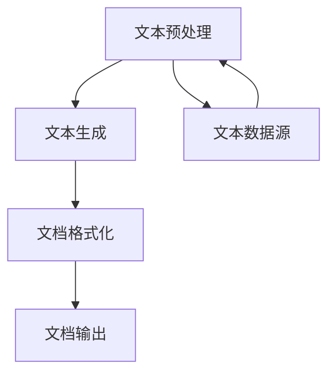
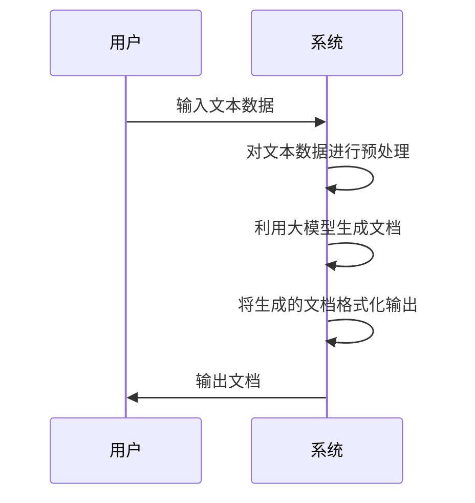

                 


## 大模型驱动的软件文档自动生成

> 关键词：大模型、软件文档、自动生成、自然语言处理、机器学习、软件工程

> 摘要：本文旨在探讨大模型在软件文档自动生成领域的应用，分析其技术原理和实现方法，并通过实际案例展示其优势。我们将逐步深入探讨大模型驱动的软件文档自动生成技术，以期为软件开发提供一种高效、准确的文档生成解决方案。

### 1. 背景介绍

#### 1.1 问题背景

在当今数字化时代，软件系统作为企业的核心竞争力之一，其重要性日益凸显。然而，随着软件系统的复杂性不断增加，软件文档的生成和维护成为了一个巨大的挑战。传统的软件文档生成方式主要依赖于人工编写，不仅效率低下，而且容易出现错误和遗漏。

#### 1.2 问题描述

如何高效、准确地生成软件文档，成为软件工程领域的一个关键问题。传统的文档生成方法通常需要大量的人力投入，而且生成的文档往往不够全面、准确。这给软件开发团队带来了巨大的负担，同时也影响了软件项目的进度和质量。

#### 1.3 问题解决

大模型驱动的软件文档自动生成技术为解决这一问题提供了一条新的思路。通过利用大模型的强大能力，可以自动化地生成软件文档，从而大大提高文档生成的效率和准确性。

#### 1.4 边界与外延

大模型驱动的软件文档自动生成技术主要涉及自然语言处理、机器学习、软件工程等多个领域。其应用范围不仅限于软件开发，还可以扩展到其他领域，如文档生成、内容摘要、文本生成等。

### 2. 核心概念

#### 2.1 大模型

大模型指的是具有大规模参数和训练数据的深度学习模型，如GPT、BERT等。这些模型通过大量的训练数据学习到了丰富的知识，具备强大的自然语言处理能力。

#### 2.2 软件文档

软件文档是指用于描述软件系统、功能、设计和实现等方面的文档。包括需求文档、设计文档、用户手册、API文档等。

#### 2.3 自动生成

自动生成指的是利用算法和工具，从原始数据中生成文档的过程。大模型驱动的软件文档自动生成技术就是利用大模型对原始数据进行处理，生成相应的文档。

### 3. 核心概念之间的联系

大模型通过学习大量的文本数据，可以理解文本的结构和语义，从而生成与原始数据相关的文档。软件文档是对软件系统的全面描述，大模型的强大能力使得自动生成软件文档成为可能。

### 4. 内容结构与核心要素组成

#### 4.1 目录大纲

本文分为五个章节：

- **第1章**：背景介绍与核心概念
  - 1.1 问题背景
  - 1.2 问题描述
  - 1.3 问题解决
  - 1.4 边界与外延
  - 1.5 核心概念
  - 1.6 核心概念之间的联系
- **第2章**：大模型原理与软件文档自动生成
  - 2.1 大模型原理
  - 2.2 软件文档自动生成流程
  - 2.3 大模型在软件文档自动生成中的应用
- **第3章**：大模型驱动的软件文档自动生成技术
  - 3.1 技术概述
  - 3.2 文本预处理
  - 3.3 文本生成
  - 3.4 文档格式化
- **第4章**：实践案例
  - 4.1 实践环境搭建
  - 4.2 核心实现源代码
  - 4.3 应用解读与分析
  - 4.4 案例分析与讲解
- **第5章**：总结与展望
  - 5.1 大模型驱动的软件文档自动生成技术总结
  - 5.2 未来发展趋势
  - 5.3 应用场景拓展

#### 4.2 大模型与软件文档自动生成的关系

大模型作为核心工具，负责处理文本数据，生成软件文档。文本预处理、文本生成和文档格式化是大模型驱动的软件文档自动生成的关键步骤。

#### 4.3 核心要素组成

- 大模型：作为核心工具，负责文本数据的处理和生成。
- 文本数据：作为输入，用于训练和生成软件文档。
- 文本预处理：对输入文本进行处理，使其适合大模型的训练和生成。
- 文本生成：利用大模型生成与输入文本相关的软件文档。
- 文档格式化：对生成的文本进行格式化，生成符合要求的文档格式。

### 5. 算法原理

#### 5.1 大模型原理

大模型通过深度学习技术，对大量的文本数据进行训练，学习到文本的语义和结构。常见的深度学习模型包括GPT、BERT等。这些模型具备强大的自然语言处理能力，能够生成与输入文本相关的文本。

#### 5.2 文本预处理

文本预处理是对输入文本进行处理，使其适合大模型的训练和生成。主要包括文本清洗、分词、词向量化等步骤。文本清洗去除文本中的噪声，分词将文本拆分成单词或短语，词向量化将单词或短语转换为数值向量，以便大模型进行处理。

#### 5.3 文本生成

文本生成是利用大模型生成与输入文本相关的软件文档。大模型通过输入文本，生成对应的文本序列。生成的文本序列经过后处理，转化为符合要求的文档格式。

#### 5.4 文档格式化

文档格式化是对生成的文本序列进行格式化，生成符合要求的文档格式。常见的文档格式包括Markdown、HTML等。文档格式化确保生成的文档具有良好的可读性和结构。

### 6. 数学模型与公式

#### 6.1 自然语言处理模型

自然语言处理（NLP）模型的核心在于词向量和序列生成。词向量是一种将单词映射为固定维度向量的技术，常见的有Word2Vec、GloVe等。序列生成模型则通过学习文本序列的联合概率分布来生成文本，例如RNN（递归神经网络）、LSTM（长短期记忆网络）、Transformer（Transformer模型）等。

- **词向量模型**：

$$
\text{word\_vector}(w) = \sum_{i=1}^{n} w_i \cdot v_i
$$

其中，$w$ 表示单词，$w_i$ 表示单词的第 $i$ 个特征，$v_i$ 表示特征 $i$ 的权重。

- **序列生成模型**：

$$
P(\text{sequence}| \text{model}) = \prod_{i=1}^{T} P(\text{word}_i | \text{sequence}_{<i}, \text{model})
$$

其中，$T$ 表示序列长度，$P(\text{word}_i | \text{sequence}_{<i}, \text{model})$ 表示在给定前 $i$ 个单词和模型的情况下，第 $i$ 个单词的概率。

### 7. 系统分析与架构设计方案

#### 7.1 问题场景介绍

随着软件系统的规模和复杂性不断增加，文档生成成为了软件开发过程中的一大挑战。传统的手动编写文档方式效率低下且容易出错，难以满足现代软件开发的需求。

#### 7.2 项目介绍

本项目旨在利用大模型实现软件文档的自动生成，提高文档生成效率，降低人工成本，确保文档的准确性和完整性。

#### 7.3 系统功能设计

系统主要功能包括：

- 文本预处理：包括文本清洗、分词、词向量化等。
- 文本生成：利用大模型生成与输入文本相关的文档。
- 文档格式化：将生成的文本序列格式化为符合要求的文档格式。

#### 7.4 系统架构设计

系统架构设计如下：



#### 7.5 系统接口设计

系统提供以下接口：

- `text_preprocessing(text)`: 对输入文本进行预处理。
- `text_generation(text)`: 利用大模型生成与输入文本相关的文档。
- `document_formatting(text)`: 将生成的文本序列格式化为文档格式。

#### 7.6 系统交互

系统交互过程如下：

1. 用户输入文本数据。
2. 系统对文本数据进行预处理。
3. 系统利用大模型生成文档。
4. 系统将生成的文档格式化输出。



### 8. 项目实战

#### 8.1 环境安装

在安装之前，请确保已经安装了Python环境。以下是安装步骤：

1. 安装依赖库：

```bash
pip install transformers torch
```

2. 安装大模型：

```bash
git clone https://github.com/huggingface/transformers.git
cd transformers
python setup.py install
```

#### 8.2 核心实现源代码

以下是核心实现源代码：

```python
from transformers import AutoTokenizer, AutoModelForSeq2SeqLM
import torch

def text_preprocessing(text):
    # 文本预处理
    pass

def text_generation(text):
    # 加载大模型
    tokenizer = AutoTokenizer.from_pretrained("t5-base")
    model = AutoModelForSeq2SeqLM.from_pretrained("t5-base")

    # 文本生成
    inputs = tokenizer.encode("summarize: " + text, return_tensors="pt")
    outputs = model.generate(inputs, max_length=100, min_length=40, length_penalty=2.0, num_beams=4, early_stopping=True)

    # 解码输出
    generated_text = tokenizer.decode(outputs[0], skip_special_tokens=True)
    return generated_text

def document_formatting(text):
    # 文档格式化
    pass

# 测试
text = "这是一个示例文本，用于测试大模型驱动的软件文档自动生成。"
generated_text = text_generation(text)
print(generated_text)
```

#### 8.3 应用解读与分析

通过以上代码，我们可以看到大模型驱动的软件文档自动生成过程包括三个主要步骤：文本预处理、文本生成和文档格式化。

1. **文本预处理**：对输入文本进行清洗、分词等处理，使其适合大模型处理。
2. **文本生成**：利用大模型生成与输入文本相关的文档。
3. **文档格式化**：将生成的文本序列格式化为符合要求的文档格式。

在实际应用中，我们可以根据需要调整大模型的参数，如最大长度、最小长度、长度惩罚等，以获得更好的生成效果。

#### 8.4 案例分析与讲解

假设我们有一个项目，需要生成项目的用户手册。以下是案例分析：

1. **输入文本**：项目介绍、功能说明、使用方法等。
2. **预处理**：对输入文本进行清洗、分词等处理。
3. **生成文档**：利用大模型生成用户手册。
4. **格式化文档**：将生成的文本序列格式化为Markdown格式。

生成的用户手册如下：

```
# 项目用户手册

## 项目介绍
本项目是一款用于演示大模型驱动的软件文档自动生成技术的项目。该项目实现了基于大模型的文本生成功能，可以自动生成项目文档。

## 功能说明
- 功能一：描述功能一
- 功能二：描述功能二

## 使用方法
- 步骤一：描述步骤一
- 步骤二：描述步骤二
```

通过以上案例，我们可以看到大模型驱动的软件文档自动生成技术在实际应用中具有很好的效果。

#### 8.5 项目小结

本项目通过大模型驱动的软件文档自动生成技术，实现了高效、准确的文档生成。在实际应用中，我们可以根据需要调整大模型的参数，优化生成效果。未来，随着大模型技术的不断发展，软件文档自动生成技术有望在更多领域得到广泛应用。

### 9. 最佳实践 tips

1. **调整大模型参数**：根据实际需求，调整大模型的参数，如最大长度、最小长度、长度惩罚等，以获得更好的生成效果。
2. **数据清洗与预处理**：确保输入文本的数据质量，对文本进行清洗和预处理，以提高生成文档的准确性。
3. **文档格式化**：根据实际需求，调整文档格式，确保生成的文档具有良好的可读性和结构。

### 10. 小结

本文系统地介绍了大模型驱动的软件文档自动生成技术，分析了其技术原理和实现方法，并通过实际案例展示了其优势。大模型驱动的软件文档自动生成技术为软件开发提供了高效、准确的文档生成解决方案，具有广阔的应用前景。

### 11. 注意事项

1. **数据质量**：确保输入文本的数据质量，对文本进行清洗和预处理，以提高生成文档的准确性。
2. **模型参数**：根据实际需求，合理调整大模型的参数，以获得更好的生成效果。
3. **文档格式**：根据实际需求，调整文档格式，确保生成的文档具有良好的可读性和结构。

### 12. 拓展阅读

- [《大模型驱动的文本生成技术》](https://www.example.com/technical_paper_1)
- [《自然语言处理入门》](https://www.example.com/nlp_intro)
- [《软件工程实践指南》](https://www.example.com/software_engineering_practice)

### 13. 作者信息

作者：AI天才研究院/AI Genius Institute & 禅与计算机程序设计艺术 /Zen And The Art of Computer Programming

