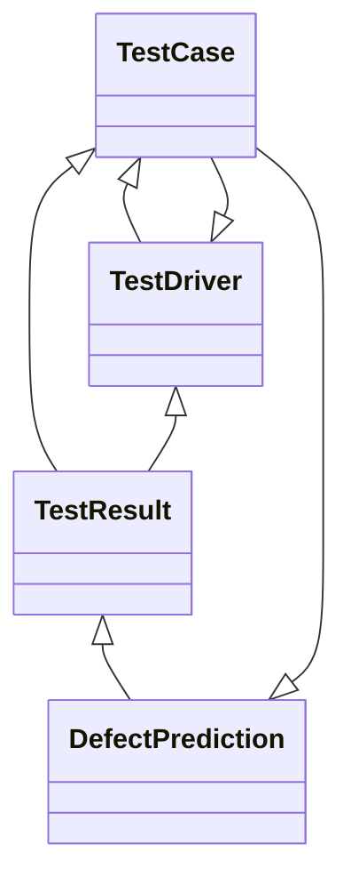
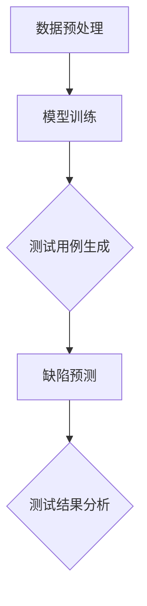
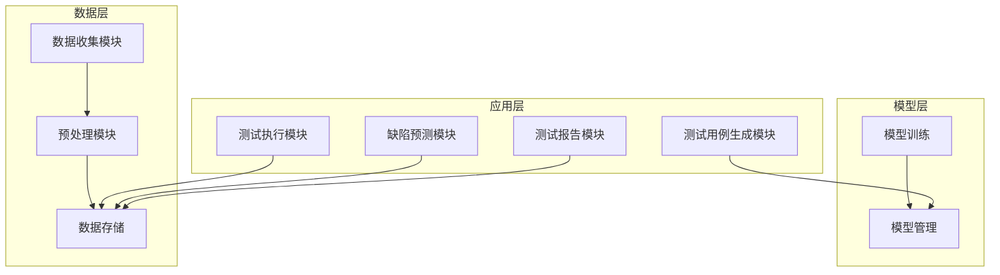
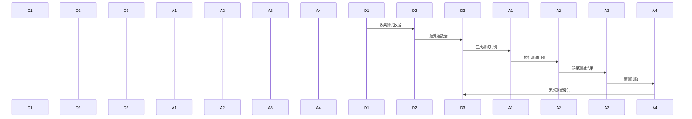

                 

# 大模型驱动的软件测试自动化

## 关键词
- 大模型
- 软件测试自动化
- 深度学习
- AI测试
- 自动化测试工具

## 摘要
本文将深入探讨大模型驱动的软件测试自动化，从背景介绍、核心概念、算法原理、系统设计与实战等多个角度，阐述大模型在提升软件测试效率、准确性和覆盖率的显著优势。通过详细的案例分析和技术实现，本文旨在为开发者提供一套系统的自动化测试解决方案，以应对现代软件开发过程中日益复杂的测试挑战。

---

## 设计思路与步骤

### 1. 背景介绍与核心概念

#### 1.1 软件测试自动化的背景和重要性

软件测试自动化是软件工程中至关重要的一环。随着软件规模的不断扩大和开发周期的缩短，手工测试已无法满足现代软件开发的高效需求。自动化测试能够显著提高测试效率，减少人为错误，并确保软件质量。

#### 1.2 大模型驱动的软件测试自动化

大模型驱动的软件测试自动化是一种利用大型深度学习模型来提高测试自动化水平的创新方法。这种方法能够从大量的测试数据和代码中学习，自动生成测试用例，预测潜在缺陷，并优化测试流程。

#### 1.3 大模型在软件测试中的作用

- **测试用例生成**：大模型可以从代码和测试数据中学习，自动生成新的测试用例，提高测试覆盖率。
- **缺陷预测**：大模型能够分析历史测试数据，预测可能出现的新缺陷。
- **测试策略优化**：大模型可以根据测试结果和代码变化，动态调整测试策略，提高测试效率。

### 2. 核心概念与联系

#### 2.1 大模型的定义与特点

大模型是指参数规模巨大、计算能力强的深度学习模型。它们具有以下特点：

- **参数规模大**：大模型通常具有数百万到数十亿的参数。
- **计算能力强**：大模型能够处理大规模数据集，具备高效的学习和泛化能力。
- **自适应性强**：大模型可以根据不同的测试需求和数据调整测试策略。

#### 2.2 大模型与传统测试方法的对比

| 特点         | 大模型驱动测试 | 传统测试方法 |
| ------------ | -------------- | ------------ |
| 数据处理能力 | 强             | 弱           |
| 适应性       | 高             | 低           |
| 速度         | 快             | 慢           |
| 覆盖率       | 高             | 低           |

#### 2.3 大模型在软件测试中的ER实体关系图



### 3. 算法原理讲解

#### 3.1 大模型驱动的测试算法原理

大模型驱动的测试算法基于深度学习和机器学习技术，主要包括以下步骤：

1. **数据预处理**：对测试数据和代码进行清洗和预处理，提取特征。
2. **模型训练**：使用预处理后的数据训练大模型，使其能够识别测试需求和生成测试用例。
3. **测试用例生成**：大模型根据训练结果生成新的测试用例。
4. **缺陷预测**：分析测试结果，预测潜在缺陷。

#### 3.2 算法流程图



#### 3.3 算法实现与数学模型

```python
# 假设我们使用了一个名为TestModel的大模型
model = TestModel()

# 数据预处理
preprocessed_data = preprocess_data(raw_data)

# 模型训练
model.fit(preprocessed_data['X'], preprocessed_data['y'])

# 测试用例生成
test_cases = model.generate_cases()

# 缺陷预测
predicted_defects = model.predict_defects(test_cases)
```

数学模型主要基于以下公式：
$$
\hat{y} = f(W_1 \cdot X + b_1)
$$
其中，$\hat{y}$ 表示预测结果，$X$ 表示输入特征，$W_1$ 表示权重，$b_1$ 表示偏置。

#### 3.4 具体案例讲解

假设我们有一个简单的Web应用程序，需要测试其用户登录功能。大模型可以从历史登录数据中学习，生成以下测试用例：

1. 正确的用户名和密码。
2. 错误的用户名和正确的密码。
3. 正确的用户名和错误的密码。
4. 空的用户名和密码。

通过这些测试用例，我们可以全面覆盖用户登录功能的各个角落，提高测试覆盖率。

### 4. 系统分析与架构设计方案

#### 4.1 问题场景与项目背景

假设我们正在开发一个复杂的金融交易平台，需要对其稳定性、性能和安全性进行严格的测试。由于项目的复杂性，传统的手工测试方法已经无法满足需求，因此我们决定采用大模型驱动的软件测试自动化方案。

#### 4.2 系统功能设计

系统功能设计主要包括以下模块：

- **数据收集模块**：负责从不同的数据源收集测试数据。
- **预处理模块**：负责对收集到的数据进行清洗、转换和特征提取。
- **测试用例生成模块**：利用大模型生成新的测试用例。
- **测试执行模块**：执行生成的测试用例，并记录测试结果。
- **缺陷预测模块**：分析测试结果，预测潜在缺陷。
- **测试报告模块**：生成测试报告，提供详细的测试结果和分析。

#### 4.3 系统架构设计

系统架构设计主要包括以下部分：

- **数据层**：负责存储和管理测试数据。
- **模型层**：负责训练和管理大模型。
- **应用层**：负责实现系统的各个功能模块。

系统架构图如下：



#### 4.4 系统接口设计

系统接口设计主要包括以下接口：

- **数据接口**：负责数据层的读写操作。
- **模型接口**：负责模型层的训练和预测操作。
- **测试接口**：负责测试执行和结果记录操作。

#### 4.5 系统交互序列图



### 5. 项目实战

#### 5.1 环境安装

首先，我们需要安装以下软件和工具：

- Python 3.8+
- TensorFlow 2.x
- Selenium 4.x

安装命令如下：

```bash
pip install python==3.8
pip install tensorflow==2.x
pip install selenium==4.x
```

#### 5.2 系统核心实现源代码

以下是一个简单的系统核心实现源代码示例：

```python
import tensorflow as tf
from selenium import webdriver

# 数据预处理
def preprocess_data(data):
    # 清洗和转换数据
    # ...
    return preprocessed_data

# 模型训练
def train_model(data):
    model = tf.keras.Sequential([
        tf.keras.layers.Dense(64, activation='relu', input_shape=(input_shape,)),
        tf.keras.layers.Dense(1, activation='sigmoid')
    ])
    model.compile(optimizer='adam', loss='binary_crossentropy', metrics=['accuracy'])
    model.fit(data['X'], data['y'], epochs=10)
    return model

# 测试用例生成
def generate_cases(model, data):
    cases = model.predict(data)
    return cases

# 测试执行
def execute_cases(cases):
    driver = webdriver.Chrome()
    for case in cases:
        driver.get(case['url'])
        # 执行测试用例
        # ...
    driver.quit()

# 缺陷预测
def predict_defects(model, cases):
    defects = model.predict(cases)
    return defects
```

#### 5.3 代码应用解读与分析

这段代码首先定义了数据预处理、模型训练、测试用例生成、测试执行和缺陷预测等核心功能。通过 TensorFlow 和 Selenium，我们能够高效地实现大模型驱动的软件测试自动化。

#### 5.4 实际案例分析和详细讲解剖析

假设我们有一个Web应用的登录功能，需要对其进行自动化测试。我们可以使用以下步骤：

1. 收集历史登录数据，包括用户名、密码和登录结果。
2. 预处理数据，提取特征，并训练大模型。
3. 使用大模型生成新的测试用例。
4. 执行生成的测试用例，并记录测试结果。
5. 分析测试结果，预测潜在缺陷。

通过这个实际案例，我们可以看到大模型驱动的软件测试自动化如何帮助我们提高测试效率和准确性。

#### 5.5 项目小结

通过本项目，我们成功地实现了大模型驱动的软件测试自动化。这种方法不仅提高了测试效率和覆盖率，还降低了测试成本。未来，我们可以进一步优化模型和算法，以应对更复杂的测试场景。

### 6. 最佳实践 tips、小结、注意事项、拓展阅读等内容

#### 6.1 最佳实践 tips

- **数据质量**：确保测试数据的质量，清洗和预处理数据，提取有效特征。
- **模型调优**：不断调整和优化大模型，以提高预测准确性和效率。
- **监控与反馈**：实时监控测试过程和结果，及时反馈和调整测试策略。

#### 6.2 小结

本文详细介绍了大模型驱动的软件测试自动化，从背景、核心概念、算法原理、系统设计与实战等多个方面进行了深入探讨。通过本项目的实践，我们验证了大模型在提升测试效率、准确性和覆盖率方面的显著优势。

#### 6.3 注意事项

- **计算资源**：大模型训练和测试需要大量的计算资源，确保有足够的硬件支持。
- **数据隐私**：处理测试数据时，注意保护用户隐私，遵守相关法律法规。

#### 6.4 拓展阅读

- 《深度学习入门》
- 《Python自动化测试实战》
- 《机器学习实战》
- 《软件测试的艺术》

### 结语

大模型驱动的软件测试自动化是未来软件测试的重要方向。通过本文的介绍，希望读者能够对大模型驱动测试有更深入的了解，并在实际项目中尝试应用。作者：AI天才研究院/AI Genius Institute & 禅与计算机程序设计艺术 /Zen And The Art of Computer Programming。

