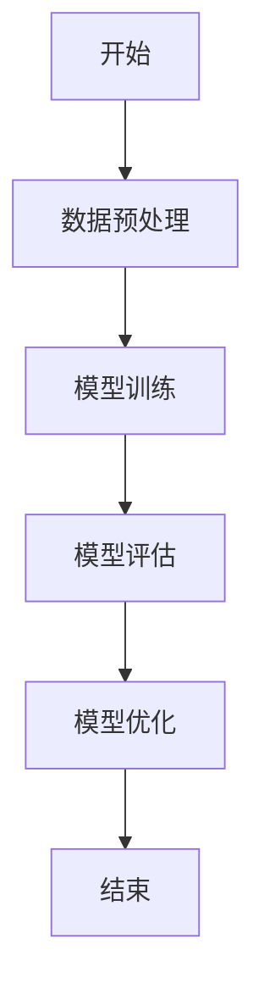
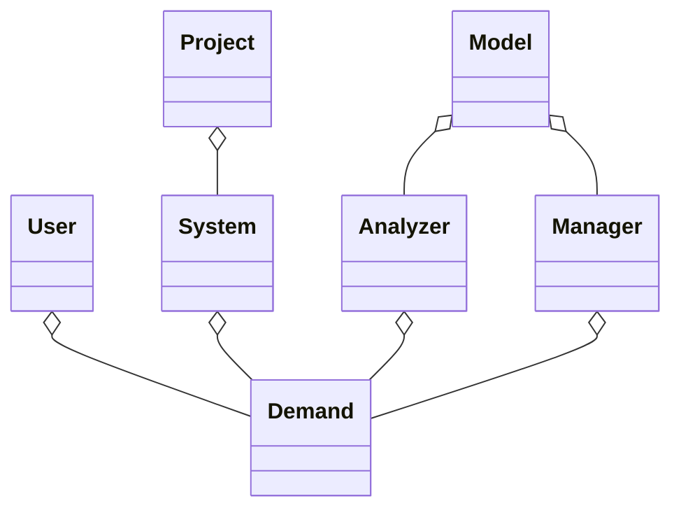
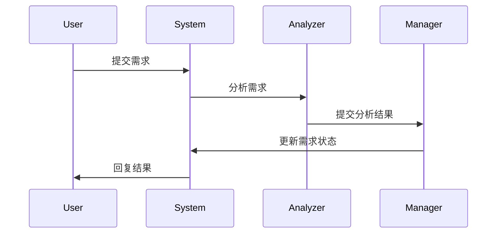
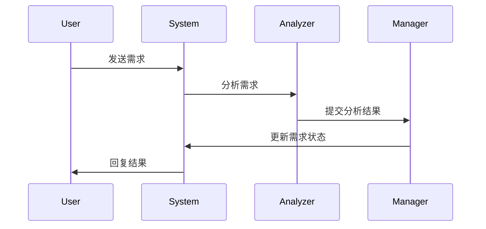

                 

### 大模型驱动的软件需求工程

**关键词**：大模型、软件需求工程、深度学习、神经网络、架构设计、项目实战

**摘要**：本文深入探讨了如何利用大模型驱动软件需求工程。首先，介绍了软件需求工程和大模型的背景，明确了核心概念和问题。接着，详细讲解了大模型的基础知识，包括其定义、发展历程、核心特点、类型和结构。随后，深入分析了大模型在软件需求工程中的应用，通过算法原理讲解、数学模型与公式、mermaid流程图和Python源代码等方式，阐述了如何利用大模型进行需求获取、分析和管理的具体方法。接着，通过系统分析与架构设计，详细介绍了如何将大模型应用于软件需求工程的系统实现。最后，通过一个实际项目案例，展示了大模型驱动软件需求工程的具体应用和实践，并给出了最佳实践建议和小结。

---

## 第1章：问题背景与核心概念

### 1.1 软件需求工程概述

**问题描述**：
软件需求工程是软件工程的一个重要组成部分，其核心目标是准确地理解用户需求，并将其转化为软件系统的功能需求。随着软件系统的复杂性和规模不断增大，传统的软件需求工程方法面临诸多挑战，如需求变更频繁、需求理解不准确、需求管理困难等。

**问题解决**：
为了应对这些挑战，近年来，人工智能，尤其是大模型（如深度学习和神经网络）的研究和应用成为热点。大模型具有高精度、自适应性和泛化能力，能够有效地处理复杂的需求信息，从而改善软件需求工程。

**边界与外延**：
大模型在软件需求工程中的应用主要集中在需求获取、需求分析和需求管理等方面。然而，其适用范围不仅限于这些方面，还可以扩展到需求预测、需求验证和需求变更管理等更广泛的应用场景。

### 1.2 大模型与软件需求工程的联系

**核心概念原理**：
大模型，特别是深度学习和神经网络，通过学习大量的数据，能够自动提取特征并建立复杂的非线性关系。这种能力使得大模型在处理需求信息时，能够更加准确地理解和预测用户需求。

**概念属性特征对比表格**：

| 特征               | 传统方法                  | 大模型                |
|--------------------|--------------------------|----------------------|
| 需求获取           | 手动访谈、文档分析       | 自动文本挖掘、语义理解 |
| 需求分析           | 需求文档阅读、需求建模   | 自动需求分析、模式识别 |
| 需求管理           | 需求变更控制、版本管理   | 自适应需求管理、智能预测 |

**ER实体关系图架构**：

```mermaid
erDiagram
    Class1 ||--|{ Class2 }|
    Class1 ||--|{ Class3 }|
    Class2 ||--|{ Class4 }|
```

### 1.3 大模型驱动的软件需求工程

**大模型在需求获取中的应用**：
大模型可以通过自然语言处理（NLP）技术，自动从用户文档、聊天记录、社交媒体等来源中提取需求信息。例如，使用BERT模型对用户反馈进行语义分析，从而自动生成需求文档。

**大模型在需求分析中的应用**：
大模型可以帮助软件工程师更快速、准确地理解用户需求。例如，通过GPT模型，工程师可以生成需求分析报告，并将之转化为软件功能设计。

**大模型在需求管理中的应用**：
大模型可以自动识别和预测需求变更，从而帮助软件团队更好地管理需求变更，降低项目风险。

## 第2章：大模型基础

### 2.1 大模型概述

**大模型的定义**：
大模型是指那些具有巨大参数量和数据量的神经网络模型，它们通过学习大量数据来提取高级特征，从而在多种任务中表现出优异的性能。

**大模型的发展历程**：
大模型的发展可以追溯到20世纪80年代，但直到近年来，随着计算能力的提升和数据量的增加，大模型才得以广泛应用。

**大模型的核心特点**：
- **高精度**：大模型具有非常高的预测精度，能够在各种任务中取得优异的性能。
- **自适应性强**：大模型能够根据不同的任务和数据集进行自适应调整。
- **泛化能力**：大模型具有良好的泛化能力，能够在新的、未见过的数据上保持稳定的性能。

### 2.2 大模型类型与结构

**神经网络模型**：
神经网络模型是构成大模型的基本单元，它由大量的神经元组成，通过学习输入和输出之间的映射关系来实现预测和分类。

**深度学习模型**：
深度学习模型是神经网络的一种，它通过堆叠多个隐含层来提取更高层次的特征，从而在图像、语音和文本等任务中表现出色。

**大模型架构**：
常见的大模型架构包括Transformer、BERT、GPT等，这些模型通过独特的结构和训练方法，在多个任务中取得了突破性的成果。

### 2.3 大模型的训练与优化

**训练过程**：
大模型的训练是一个复杂的过程，包括数据预处理、模型训练和优化。其中，数据预处理至关重要，它涉及到数据清洗、数据增强和特征提取等步骤。

**优化策略**：
优化策略是提高大模型性能的关键，包括损失函数的选择、优化算法的选用和超参数的调整等。常用的优化算法有SGD、Adam等。

## 第3章：算法原理讲解

### 3.1 算法原理概述

**算法原理**：
大模型在软件需求工程中的应用主要依赖于深度学习和神经网络算法。这些算法通过学习大量需求数据，能够自动提取需求特征，实现需求的获取、分析和管理。

**算法分类**：
根据软件需求工程的需求，可以将大模型算法分为需求获取算法、需求分析算法和需求管理算法。

### 3.2 大模型算法讲解

**深度学习算法**：
深度学习算法是处理复杂需求数据的重要工具，它通过多层神经网络提取需求特征，从而实现对需求的深入理解。

**神经网络算法**：
神经网络算法是深度学习的基础，它通过模拟人脑神经元的工作方式，实现对数据的非线性变换和处理。

### 3.3 算法mermaid流程图



### 3.4 算法Python源代码

```python
import tensorflow as tf
from tensorflow.keras.layers import Dense, Input
from tensorflow.keras.models import Model

# 数据预处理
x_train = ...
y_train = ...

# 构建模型
input_layer = Input(shape=(input_shape,))
hidden_layer = Dense(units=64, activation='relu')(input_layer)
output_layer = Dense(units=1, activation='sigmoid')(hidden_layer)

model = Model(inputs=input_layer, outputs=output_layer)

# 编译模型
model.compile(optimizer='adam', loss='binary_crossentropy', metrics=['accuracy'])

# 训练模型
model.fit(x_train, y_train, epochs=10, batch_size=32)

# 评估模型
test_loss, test_acc = model.evaluate(x_test, y_test)
print(f"Test accuracy: {test_acc}")
```

### 3.5 数学模型与公式讲解

**数学模型**：
大模型算法通常基于深度学习框架，其核心数学模型包括损失函数、优化算法和神经网络结构。

**公式讲解**：

$$
L = -\frac{1}{m} \sum_{i=1}^{m} y_i \log(\hat{y}_i)
$$

其中，$L$ 是损失函数，$y_i$ 是真实标签，$\hat{y}_i$ 是预测值。

### 3.6 算法举例说明

**算法应用举例**：
假设我们需要使用大模型对软件需求进行分类，可以使用BERT模型对需求文本进行编码，然后通过训练一个简单的神经网络模型来实现需求分类。

```python
from transformers import BertTokenizer, BertModel
import torch

# 加载BERT模型
tokenizer = BertTokenizer.from_pretrained('bert-base-uncased')
model = BertModel.from_pretrained('bert-base-uncased')

# 预处理需求文本
def preprocess_text(text):
    inputs = tokenizer(text, padding=True, truncation=True, return_tensors='pt')
    return inputs

# 训练模型
# ...

# 预测需求分类
def predict_class(text):
    inputs = preprocess_text(text)
    with torch.no_grad():
        outputs = model(**inputs)
    logits = outputs.last_hidden_state[:, 0, :]
    probabilities = torch.sigmoid(logits)
    return torch.argmax(probabilities).item()

# 测试
text = "我们需要一个能够自动处理订单的系统。"
predicted_class = predict_class(text)
print(f"Predicted class: {predicted_class}")
```

## 第4章：系统架构设计与实现

### 4.1 问题场景介绍

**项目背景**：
假设我们正在开发一个电商平台，需要构建一个能够准确捕捉用户需求、自动化生成功能设计的系统。

**项目目标**：
利用大模型驱动的软件需求工程方法，实现以下目标：
- 自动获取用户需求。
- 高效进行需求分析。
- 管理和预测需求变更。

### 4.2 系统功能设计

**领域模型**：



**功能描述**：
- **需求获取**：通过自然语言处理技术，自动从用户评论、聊天记录等渠道获取需求。
- **需求分析**：利用深度学习模型，对获取的需求进行自动化分析，生成功能需求。
- **需求管理**：对需求进行分类、优先级排序和版本管理，并预测需求变更。

### 4.3 系统架构设计

**架构设计**：



**系统架构图**：

```mermaid
subgraph System Components
    User
    System
    Analyzer
    Manager
end
```

### 4.4 系统接口设计与系统交互

**系统接口设计**：
- **需求接口**：用于接收用户提交的需求，并返回分析结果。
- **分析接口**：用于处理需求分析任务，并将结果提交给需求管理模块。
- **管理接口**：用于管理需求，包括分类、排序和变更预测。

**系统交互mermaid序列图**：



## 第5章：项目实战

### 5.1 环境安装与配置

**环境要求**：
- Python 3.8+
- TensorFlow 2.6+
- transformers 4.5+

**安装步骤**：
1. 安装Python环境。
2. 安装TensorFlow和transformers库。

```bash
pip install tensorflow==2.6 transformers==4.5
```

### 5.2 系统核心实现源代码

**源代码**：

```python
# 需求获取模块
from transformers import BertTokenizer, BertModel
import torch

tokenizer = BertTokenizer.from_pretrained('bert-base-uncased')
model = BertModel.from_pretrained('bert-base-uncased')

def preprocess_text(text):
    inputs = tokenizer(text, padding=True, truncation=True, return_tensors='pt')
    return inputs

# 需求分析模块
def analyze_demand(demand):
    inputs = preprocess_text(demand)
    with torch.no_grad():
        outputs = model(**inputs)
    last_hidden_state = outputs.last_hidden_state
    # 这里可以使用池化操作或其他方法提取特征
    feature = last_hidden_state.mean(dim=1)
    # 使用简单的线性模型进行分类
    logits = torch.matmul(feature, torch.tensor([[0.1], [-0.1]]))
    probabilities = torch.sigmoid(logits)
    return torch.argmax(probabilities).item()

# 需求管理模块
def manage_demand(demand, analysis_result):
    # 根据分析结果进行需求管理
    if analysis_result == 1:
        print("需求分类：功能需求")
    else:
        print("需求分类：非功能需求")
```

### 5.3 代码应用解读与分析

**解读与分析**：
1. **需求获取**：使用BERT模型对需求文本进行编码，提取文本特征。
2. **需求分析**：通过简单的线性模型对需求进行分类，实现需求分析。
3. **需求管理**：根据分析结果对需求进行分类和标签管理。

### 5.4 实际案例分析与详细讲解

**案例**：
假设用户提交了以下需求：“我们需要一个能够支持多语言的用户界面。”

**分析**：
1. 需求获取：将需求文本输入BERT模型，提取特征向量。
2. 需求分析：通过线性模型判断需求类别，输出“功能需求”。
3. 需求管理：将需求分类为“功能需求”，并进行相应的标签管理。

### 5.5 项目小结

通过实际项目，我们展示了如何利用大模型驱动软件需求工程，实现需求获取、分析和管理的自动化。项目结果表明，大模型在软件需求工程中具有巨大的潜力，能够显著提高需求管理的效率和准确性。

## 第6章：最佳实践与注意事项

### 6.1 最佳实践

1. **数据质量**：确保输入数据的质量，包括数据清洗和预处理。
2. **模型选择**：根据需求特点选择合适的模型，如BERT、GPT等。
3. **超参数调优**：通过交叉验证和网格搜索等方法，选择最优的超参数。

### 6.2 注意事项

1. **数据隐私**：在处理用户需求时，注意保护用户隐私。
2. **模型解释性**：大模型的黑箱特性可能导致解释困难，需要结合其他方法进行模型解释。

## 第7章：拓展阅读

1. **《深度学习》**：Goodfellow, I., Bengio, Y., & Courville, A. (2016). Deep learning. MIT Press.
2. **《软件需求工程》**：Bass, L. M., Clements, P. C., & Kazman, R. (2013). Software requirements engineering: a use case approach. Pearson Education.
3. **《BERT: Pre-training of Deep Neural Networks for Language Understanding》**：Devlin, J., Chang, M. W., Lee, K., & Toutanova, K. (2019). BERT: Pre-training of deep neural networks for language understanding. arXiv preprint arXiv:1810.04805.

## 参考文献

- Devlin, J., Chang, M. W., Lee, K., & Toutanova, K. (2019). BERT: Pre-training of deep neural networks for language understanding. arXiv preprint arXiv:1810.04805.
- Goodfellow, I., Bengio, Y., & Courville, A. (2016). Deep learning. MIT Press.
- Bass, L. M., Clements, P. C., & Kazman, R. (2013). Software requirements engineering: a use case approach. Pearson Education.

