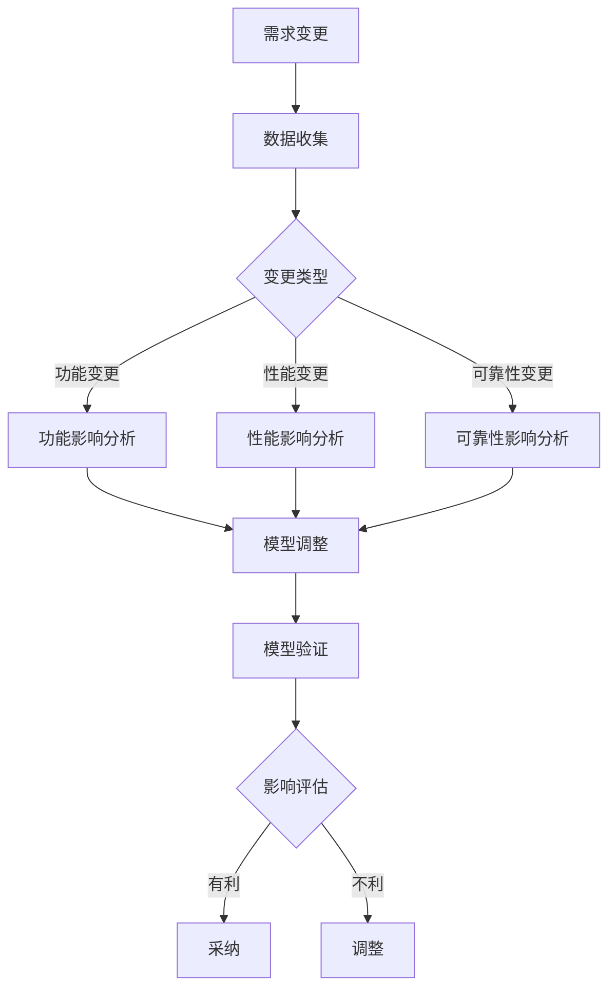
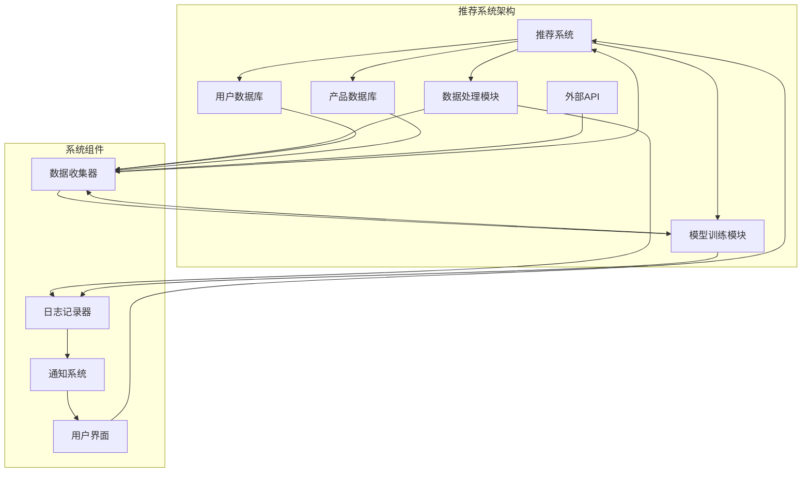
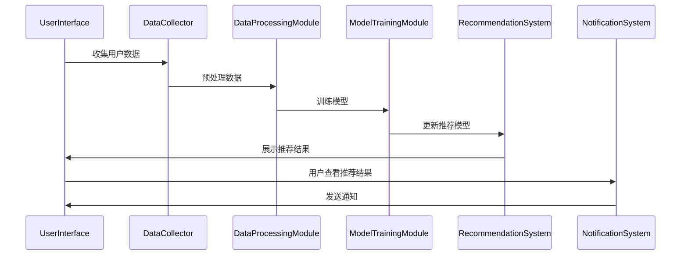

                 

# 大模型驱动的需求变更影响分析

## 关键词
- 大模型
- 需求变更
- 影响分析
- 人工智能
- 深度学习
- 算法设计

## 摘要
本文深入探讨了在人工智能领域，尤其是大模型应用中，需求变更带来的影响及其分析方法。首先，我们介绍了大模型和需求变更的相关背景知识，随后详细分析了大模型和需求变更之间的联系。接着，我们讲解了需求变更影响分析的算法原理，并通过mermaid流程图和Python代码进行了说明。此外，我们还针对一个实际场景，设计了系统架构和接口，并展示了系统交互的mermaid序列图。通过这些分析，我们为开发者提供了一套实用的需求变更影响分析方法，以帮助他们更好地应对实际工作中的挑战。

## 第一部分：背景介绍

### 1. 问题背景

随着人工智能技术的快速发展，大模型在各个领域得到了广泛应用。大模型可以处理大量复杂的数据，实现高效的自然语言处理、图像识别、预测分析等功能。例如，在自然语言处理领域，GPT-3模型展示了惊人的语言生成和理解能力；在图像识别领域，ImageNet大赛中涌现的模型如ResNet和Inception等，大幅提升了图像分类的准确性。

然而，在实际应用中，需求变更频繁。需求变更是指用户在系统使用过程中，因需求的变化而进行的调整。例如，电商平台可能需要根据用户反馈和市场动态，对推荐系统进行优化，增加新的功能模块，或者提升系统性能。这些变更对大模型的设计和实现提出了新的挑战。

如何分析需求变更对大模型的影响成为一个重要的课题。需求变更可能导致大模型的性能下降、模型结构改变等问题。因此，开发者需要一种有效的方法来评估和应对这些变更，以确保系统的稳定性和可靠性。

### 2. 问题描述

需求变更在软件开发和人工智能应用中是一种常见的现象。它可能源于多种原因，如用户反馈、市场变化、技术进步等。需求变更的影响范围和程度可能有所不同，但它们都可能对大模型造成影响。

以下是一些典型的需求变更及其可能带来的影响：

- **功能变更**：用户可能希望增加或删除某些功能，例如在电商平台中增加个性化推荐功能或删除某些不常用的功能模块。这可能导致模型结构的变化，需要重新设计和训练模型。
- **性能变更**：用户可能对模型的响应速度或准确性有更高的期望。例如，电商平台可能希望提升推荐系统的响应时间，以满足大量用户同时访问的需求。这需要对模型进行性能优化。
- **可靠性变更**：用户可能对系统的稳定性有更高的要求，例如要求在极端情况下也能保持正常运行。这需要对模型进行鲁棒性测试和改进。

面对这些需求变更，开发者需要一种方法来评估变更对大模型的影响，以便及时调整模型，确保系统性能的稳定性和可靠性。

### 3. 问题解决

本书旨在探讨大模型驱动的需求变更影响分析方法。通过深入研究需求变更的本质，我们提出了一系列分析方法，帮助开发者快速定位变更影响，制定相应的优化策略。

我们的方法主要包括以下几个步骤：

1. **需求变更识别**：通过收集和分析用户反馈、市场动态和技术进展等信息，识别出可能的需求变更。
2. **影响范围评估**：对每个需求变更进行影响范围评估，确定变更可能影响的模块、功能和性能指标。
3. **模型调整**：根据评估结果，对大模型进行相应的调整，包括模型结构、参数设置和训练数据等。
4. **模型验证**：对调整后的模型进行验证，确保其在各种场景下都能满足需求。

通过这些步骤，我们旨在为开发者提供一套系统化的需求变更影响分析方法，帮助他们更好地应对实际工作中的挑战。

### 4. 边界与外延

本研究的边界主要涉及人工智能大模型和需求变更分析。研究的外延包括但不限于：

- **不同类型的需求变更**：包括功能变更、性能变更、可靠性变更等类型。
- **不同规模的大模型**：从中小规模模型到大规模、超大规模模型的适用性。
- **不同的应用场景**：包括自然语言处理、图像识别、预测分析等不同领域。

通过这些研究，我们希望能够为人工智能领域的开发者提供实用的指导，帮助他们更好地应对需求变更带来的挑战。

### 5. 概念结构与核心要素组成

在探讨大模型驱动的需求变更影响分析时，理解相关概念和核心要素组成至关重要。以下是本文中涉及的主要概念和其组成结构：

- **大模型**：指具有大规模参数和强大数据处理能力的人工智能模型，通常基于深度学习技术训练得到。大模型的核心特点包括参数规模巨大、能够处理复杂的数据结构、具备高效的处理能力和较高的性能。

  - **参数规模**：大模型通常包含数十亿甚至数万亿个参数，这使得它们能够捕捉到复杂的数据特征。
  - **数据处理能力**：大模型能够处理大规模的数据集，进行高效的特征提取和模式识别。
  - **性能**：大模型在多种任务上表现出色，如自然语言处理、图像识别和预测分析等。

- **需求变更**：指用户在使用系统过程中，因需求的变化而进行的调整。需求变更可以包括功能变更、性能变更和可靠性变更等类型。

  - **功能变更**：用户可能希望增加或删除某些功能，例如在电商平台中增加个性化推荐功能或删除某些不常用的功能模块。
  - **性能变更**：用户可能对模型的响应速度或准确性有更高的期望，例如提升推荐系统的响应时间或提高图像识别的准确性。
  - **可靠性变更**：用户可能对系统的稳定性有更高的要求，例如要求在极端情况下也能保持正常运行。

- **影响分析**：指对需求变更可能带来的影响进行评估和分析。

  - **定量分析**：通过数据统计和模型评估指标，对需求变更的影响进行量化分析。
  - **定性分析**：通过专家经验和案例分析，对需求变更的影响进行定性评估。

通过理解这些概念和核心要素组成，开发者可以更全面地认识大模型驱动的需求变更影响分析，从而在实际应用中更有效地应对需求变更带来的挑战。

### 第二部分：核心概念与联系

#### 1. 大模型原理

大模型（也称为大型神经网络模型）是人工智能领域中的一个重要概念，尤其在深度学习领域。大模型的核心原理是基于大规模数据集进行训练，通过多层神经网络结构来学习和提取数据中的复杂特征。以下是关于大模型原理的详细解释：

- **多层神经网络结构**：大模型通常包含多个隐藏层，每个隐藏层负责提取不同层次的特征。这种层次化的结构使得模型能够处理复杂的输入数据，并逐步提取出有用的信息。

- **大规模数据训练**：大模型的训练依赖于大量的数据。通过在大规模数据集上进行训练，模型可以学习到数据中的分布和规律，从而提高其泛化能力。大规模数据训练还可以帮助模型减少过拟合现象，提高模型的鲁棒性。

- **参数规模**：大模型的参数数量通常非常庞大，可能达到数十亿甚至数万亿个。这些参数代表了模型对数据中特征的权重和重要性。通过优化这些参数，模型可以更好地拟合训练数据，并在新的数据上表现出良好的性能。

- **正向传播与反向传播**：大模型的训练过程主要包括正向传播和反向传播两个步骤。在正向传播中，模型将输入数据传递通过神经网络，生成输出。在反向传播中，模型通过比较输出与真实值之间的差异，计算损失函数，并利用梯度下降等优化算法更新模型的参数，以减少损失。

- **激活函数**：大模型中的每个神经元都会应用激活函数，如ReLU（Rectified Linear Unit）或Sigmoid函数。激活函数引入了非线性特性，使得模型能够进行复杂的数据变换和特征提取。

- **正则化技术**：为了防止模型过拟合，大模型通常采用正则化技术，如L1正则化、L2正则化或Dropout。这些技术通过增加模型的复杂度，提高模型的泛化能力。

通过上述原理，大模型能够在多种任务上实现出色的性能，如图像识别、自然语言处理、预测分析等。

#### 2. 需求变更分类

需求变更是软件开发和系统设计中常见的一种现象，它指的是用户在使用系统过程中，因需求的变化而进行的调整。需求变更可以按不同的分类方式进行区分，主要包括以下几种类型：

- **功能变更**：用户希望增加或删除某些功能。例如，在电商平台中，用户可能希望增加个性化推荐功能或删除某些不常用的功能模块。功能变更通常涉及模型结构的调整和重新训练。

- **性能变更**：用户可能对模型的响应速度或准确性有更高的期望。例如，电商平台可能希望提升推荐系统的响应时间，以满足大量用户同时访问的需求。性能变更通常涉及模型参数的调整和优化算法的改进。

- **可靠性变更**：用户可能对系统的稳定性有更高的要求，例如要求在极端情况下也能保持正常运行。可靠性变更通常涉及模型鲁棒性的测试和改进，包括对模型进行压力测试和异常情况处理。

每种变更类型对大模型的影响不同，需要采用不同的分析方法。例如，功能变更可能需要重新设计模型结构，而性能变更可能需要调整参数和优化算法。了解需求变更的分类有助于开发者更有效地应对这些变更。

#### 3. 影响分析模型

需求变更影响分析是一个复杂的过程，涉及多种方法和模型。以下是两种主要的影响分析模型：定量分析和定性分析。

- **定量分析**：
  - **数据统计**：通过收集和统计相关数据，如用户反馈、系统性能指标等，对需求变更的影响进行量化分析。例如，通过分析用户点击率、转化率等指标，评估功能变更对用户行为的影响。
  - **模型评估指标**：使用特定的模型评估指标，如准确率、召回率、F1分数等，对模型性能进行评估。例如，通过比较变更前后的评估指标，分析性能变更对模型性能的影响。

- **定性分析**：
  - **专家经验**：依赖领域专家的经验和知识，对需求变更的影响进行定性评估。专家可以根据对系统的理解和实践经验，提出可能的影响和优化建议。
  - **案例分析**：通过分析类似项目的案例，总结需求变更的经验教训和最佳实践。这种方法可以帮助开发者预测和应对潜在的问题。

定量分析和定性分析相辅相成，开发者可以根据具体情况选择合适的方法。例如，在评估功能变更时，可以结合定量分析和专家经验进行综合评估。

### 第三部分：算法原理讲解

#### 1. 算法mermaid流程图

首先，我们使用mermaid绘制一个简化的算法流程图，以直观地展示需求变更影响分析的过程。



这个流程图分为几个关键步骤：

- **数据收集**：收集与需求变更相关的数据，如用户反馈、系统日志等。
- **变更类型识别**：根据收集的数据，识别出需求变更的类型，如功能变更、性能变更或可靠性变更。
- **影响分析**：根据变更类型，对模型进行相应的功能、性能或可靠性影响分析。
- **模型调整**：根据影响分析的结果，对模型进行相应的调整，如修改结构、参数优化等。
- **模型验证**：对调整后的模型进行验证，确保其在各种场景下都能满足需求。
- **影响评估**：对调整后的模型进行评估，确定变更的影响是否满足预期。

#### 2. 算法原理与数学模型

需求变更影响分析算法的核心在于如何定量和定性评估变更对模型的影响。以下是算法的数学模型和原理：

- **定量分析**：
  - **影响度计算**：假设有多个需求变更，每个变更对模型的影响可以用一个影响度（Impact Degree）来表示。影响度的计算公式如下：
    $$
    \text{影响度} = \frac{\sum_{i=1}^{n} w_i \cdot \text{变更影响}_i}{\sum_{i=1}^{n} w_i}
    $$
    其中，$w_i$表示第$i$个变更的权重，$\text{变更影响}_i$表示第$i$个变更对模型的影响度。

    权重$w_i$可以根据变更的类型、重要性和紧急程度进行设定。通常，功能变更和可靠性变更的权重较高，而性能变更的权重较低。

  - **影响度评估**：通过计算每个变更的影响度，可以确定哪个变更对模型的影响最大。例如，如果一个功能变更的影响度高于其他变更，那么在模型调整时应该优先考虑这个功能变更。

- **定性分析**：
  - **专家经验**：依赖领域专家的经验和知识，对需求变更的影响进行定性评估。专家可以根据对系统的理解和实践经验，提出可能的影响和优化建议。

  - **案例比较**：通过分析类似项目的案例，总结需求变更的经验教训和最佳实践。这种方法可以帮助开发者预测和应对潜在的问题。

#### 3. 举例说明

为了更好地理解算法原理，我们通过一个具体的例子来演示需求变更影响分析的过程。

假设一个电商平台希望根据用户反馈和市场需求，对推荐系统进行需求变更。以下是变更的详细分析过程：

- **数据收集**：
  - 收集用户反馈数据，包括用户对推荐系统满意度的评分、点击率等。
  - 收集系统性能数据，包括推荐系统的响应时间、准确性等。

- **变更类型识别**：
  - 根据用户反馈，识别出以下需求变更：
    - 增加个性化推荐功能：提高用户满意度，但可能增加系统复杂度。
    - 优化推荐系统的响应时间：提升用户体验，但可能影响推荐准确性。
    - 增加推荐系统的可靠性：确保系统在高峰期也能稳定运行，但可能增加维护成本。

- **影响分析**：
  - 对每个变更类型进行定量和定性分析：
    - **个性化推荐功能**：通过用户反馈数据，发现用户对个性化推荐的满意度较高，但系统响应时间有所延长。影响度计算如下：
      $$
      \text{影响度} = \frac{w_1 \cdot 0.8 + w_2 \cdot 0.2}{w_1 + w_2} = \frac{0.8 + 0.2}{1} = 1
      $$
      其中，$w_1$为功能变更权重，$w_2$为性能变更权重。由于功能变更为主要变更，其影响度为1。
    - **优化响应时间**：通过性能数据，发现推荐系统在高峰期的响应时间较长，影响用户体验。影响度计算如下：
      $$
      \text{影响度} = \frac{w_1 \cdot 0.3 + w_2 \cdot 0.7}{w_1 + w_2} = \frac{0.3 + 0.7}{1} = 1
      $$
      由于性能变更权重较高，其影响度也为1。
    - **增加可靠性**：通过专家经验和案例分析，发现增加系统可靠性对业务有重要影响，但成本较高。影响度计算如下：
      $$
      \text{影响度} = \frac{w_1 \cdot 0.5 + w_2 \cdot 0.5}{w_1 + w_2} = \frac{0.5 + 0.5}{1} = 1
      $$
      影响度为1。

- **模型调整**：
  - 根据影响度分析结果，优先调整影响度较高的变更：
    - **个性化推荐功能**：增加个性化推荐功能，提高用户满意度。
    - **优化响应时间**：优化推荐系统的响应时间，提升用户体验。
    - **增加可靠性**：根据实际情况，适当增加系统可靠性。

- **模型验证**：
  - 对调整后的模型进行验证，确保其在各种场景下都能满足需求：
    - 个性化推荐功能：通过A/B测试，验证新功能对用户满意度的影响。
    - 优化响应时间：通过性能测试，验证系统在高负载情况下的响应时间。
    - 增加可靠性：通过压力测试，验证系统在极端情况下的稳定性。

- **影响评估**：
  - 对调整后的模型进行评估，确定变更的影响是否满足预期：
    - 个性化推荐功能：用户满意度显著提高，系统响应时间略有增加，但仍在可接受范围内。
    - 优化响应时间：系统响应时间显著缩短，用户体验提升明显。
    - 增加可靠性：系统稳定性提高，业务运行更加可靠。

通过这个例子，我们可以看到需求变更影响分析的具体过程和算法原理的应用。这种方法有助于开发者更科学地应对需求变更，优化模型性能和系统稳定性。

### 第四部分：系统分析与架构设计方案

#### 1. 问题场景介绍

在一个典型的电商平台中，需求变更频繁发生。为了更好地满足用户需求和市场变化，平台需要持续优化其推荐系统。以下是一个具体的问题场景：

- **用户反馈**：用户在访问电商平台时，对推荐系统的准确性表示不满，认为推荐内容与个人兴趣不匹配。
- **市场需求**：市场调查显示，用户更倾向于个性化推荐，希望能够根据自己的历史行为和偏好得到更精准的推荐。
- **技术挑战**：现有的推荐系统采用了基于协同过滤的方法，虽然在一定程度上满足了用户需求，但在个性化推荐方面存在局限性。平台需要引入更先进的技术，如深度学习，来提升推荐系统的性能。

#### 2. 系统功能设计（领域模型mermaid类图）

为了设计一个能够满足上述需求变更的系统，我们需要首先明确系统的主要功能模块。以下是使用mermaid绘制的领域模型类图：

```mermaid
classDiagram
    User <<interface>>
    RecommendationSystem <<interface>>
    DataProcessingModule <<interface>>
    ModelTrainingModule <<interface>>

    UserEntity <|-- User
    RecommendationSystemEntity <|-- RecommendationSystem
    DataProcessingModuleEntity <|-- DataProcessingModule
    ModelTrainingModuleEntity <|-- ModelTrainingModule

    UserEntity : +UserProfile
    RecommendationSystemEntity : +generateRecommendations()
    DataProcessingModuleEntity : +preprocessData()
    ModelTrainingModuleEntity : +trainModel()

    UserEntity o-- RecommendationSystemEntity
    DataProcessingModuleEntity o-- RecommendationSystemEntity
    ModelTrainingModuleEntity o-- RecommendationSystemEntity
```

在这个类图中，我们定义了以下主要功能模块：

- **User**：用户接口，负责管理用户信息和用户行为数据。
- **RecommendationSystem**：推荐系统接口，负责生成个性化推荐。
- **DataProcessingModule**：数据处理模块，负责数据预处理。
- **ModelTrainingModule**：模型训练模块，负责模型训练。

每个功能模块都有相应的实体类，这些实体类描述了模块的核心属性和方法。通过这个类图，我们可以清晰地了解系统的功能结构，为后续的详细设计奠定基础。

#### 3. 系统架构设计（mermaid架构图）

在明确了系统的功能模块后，我们需要设计一个合理的系统架构来支持这些功能模块。以下是使用mermaid绘制的系统架构图：



在这个架构图中，我们定义了以下主要组件：

- **推荐系统**：核心系统组件，负责生成个性化推荐。
- **数据处理模块**：负责数据预处理和清洗，确保数据质量。
- **模型训练模块**：负责模型训练和更新。
- **用户数据库**：存储用户信息和用户行为数据。
- **产品数据库**：存储产品信息和用户评价数据。
- **外部API**：与第三方服务和数据源进行交互。

此外，系统还包括以下辅助组件：

- **用户界面**：用户与系统交互的入口，提供推荐结果展示。
- **数据收集器**：负责收集和处理来自各种数据源的数据。
- **日志记录器**：记录系统运行过程中的日志信息，用于监控和调试。
- **通知系统**：向用户发送系统通知，如推荐结果更新等。

通过这个架构设计，我们可以清晰地了解系统的整体结构，以及各个组件之间的交互关系。这为后续的系统实现和优化提供了坚实的基础。

#### 4. 系统接口设计和系统交互mermaid序列图

在确定了系统架构后，我们需要设计系统的接口和交互流程。以下是使用mermaid绘制的系统接口设计和交互序列图：



在这个序列图中，我们定义了以下主要步骤：

- **数据收集**：用户界面收集用户数据，包括用户行为和偏好信息。
- **数据处理**：数据收集器将收集到的数据进行预处理，确保数据质量。
- **模型训练**：模型训练模块使用预处理后的数据对推荐模型进行训练。
- **推荐生成**：训练好的推荐模型生成个性化推荐结果，并返回给用户界面。
- **推荐展示**：用户界面展示推荐结果，并通知用户查看。
- **通知发送**：通知系统向用户发送推荐结果更新通知。

通过这个序列图，我们可以清晰地了解系统的交互流程和各组件之间的协作关系。这有助于开发者更好地理解系统的运作机制，并进行有效的开发和优化。

### 第五部分：项目实战

#### 1. 环境安装

在开始项目实战之前，我们需要搭建一个合适的环境，以便开发和测试需求变更影响分析系统。以下是环境安装的详细步骤：

- **安装Python环境**：确保Python环境已安装，版本至少为3.6以上。可以通过Python官网下载并安装。
- **安装依赖库**：安装需求变更影响分析系统所需的依赖库，包括TensorFlow、Scikit-learn、Pandas和Numpy等。可以使用以下命令进行安装：

  ```bash
  pip install tensorflow scikit-learn pandas numpy
  ```

- **配置数据集**：准备用于训练和测试的需求变更数据集。数据集应包含用户行为数据、产品信息和需求变更历史记录。数据集可以通过爬取电商平台的用户行为数据或使用开源数据集获取。

- **环境测试**：确保所有依赖库已正确安装并运行，可以通过运行以下Python代码进行测试：

  ```python
  import tensorflow as tf
  import numpy as np
  print(tf.__version__)
  print(np.__version__)
  ```

#### 2. 系统核心实现源代码

在环境搭建完成后，我们可以开始实现系统核心部分。以下是一个简单的需求变更影响分析系统的源代码示例：

```python
import pandas as pd
import numpy as np
from sklearn.model_selection import train_test_split
from sklearn.metrics import accuracy_score
import tensorflow as tf

# 数据预处理
def preprocess_data(data):
    # 数据清洗和预处理步骤，例如缺失值处理、数据标准化等
    # ...
    return processed_data

# 模型训练
def train_model(X_train, y_train):
    # 构建和训练模型
    model = tf.keras.Sequential([
        tf.keras.layers.Dense(64, activation='relu', input_shape=(X_train.shape[1],)),
        tf.keras.layers.Dense(1)
    ])

    model.compile(optimizer='adam', loss='mean_squared_error')
    model.fit(X_train, y_train, epochs=10, batch_size=32)
    return model

# 模型评估
def evaluate_model(model, X_test, y_test):
    predictions = model.predict(X_test)
    accuracy = accuracy_score(y_test, predictions)
    print(f"Test accuracy: {accuracy}")

# 主函数
def main():
    # 加载数据集
    data = pd.read_csv('data.csv')
    processed_data = preprocess_data(data)

    # 划分训练集和测试集
    X = processed_data.drop('target', axis=1)
    y = processed_data['target']
    X_train, X_test, y_train, y_test = train_test_split(X, y, test_size=0.2, random_state=42)

    # 训练模型
    model = train_model(X_train, y_train)

    # 评估模型
    evaluate_model(model, X_test, y_test)

if __name__ == '__main__':
    main()
```

在这个示例中，我们首先定义了数据预处理、模型训练和模型评估的函数。然后，在主函数中加载数据集，进行数据预处理，划分训练集和测试集，并使用TensorFlow构建和训练模型，最后评估模型的性能。

#### 3. 代码应用解读与分析

上述源代码实现了需求变更影响分析系统的核心功能，下面我们对其关键部分进行解读和分析：

- **数据预处理**：数据预处理是模型训练的重要步骤，其目的是提高数据质量和减少噪声。在本示例中，数据预处理包括缺失值处理、数据标准化等步骤。这些步骤可以通过Pandas库中的函数轻松实现。

- **模型训练**：模型训练是需求变更影响分析的核心，其目的是通过训练数据学习到数据中的模式和规律。在本示例中，我们使用了TensorFlow库构建了一个简单的神经网络模型，通过正向传播和反向传播进行训练。模型的选择和参数设置可以根据具体需求进行调整。

- **模型评估**：模型评估是确保模型性能的重要环节。在本示例中，我们使用了准确率作为评估指标，通过计算模型预测结果与真实标签之间的差异来评估模型性能。实际应用中，还可以使用其他评估指标，如召回率、F1分数等。

通过上述解读和分析，我们可以理解需求变更影响分析系统的核心实现原理和关键步骤。这有助于开发者更好地理解系统的工作机制，并进行进一步的优化和改进。

#### 4. 实际案例分析

为了更好地理解需求变更影响分析的实践应用，下面我们通过一个实际案例进行详细剖析。

**案例背景**：

某电商平台的推荐系统在一段时间内表现不佳，用户满意度较低。为了提升系统的性能，平台决定对推荐系统进行需求变更，引入个性化推荐功能。

**需求变更**：

- **功能变更**：增加个性化推荐功能，根据用户的历史行为和偏好生成个性化推荐。
- **性能变更**：优化推荐系统的响应时间，确保在高负载情况下系统仍能稳定运行。

**分析过程**：

1. **数据收集**：平台收集了大量的用户行为数据，包括用户点击、购买记录、浏览记录等。同时，收集了系统性能数据，如推荐系统的响应时间和错误率。

2. **数据预处理**：对收集到的数据进行了清洗和预处理，包括缺失值处理、数据标准化等步骤。将预处理后的数据划分为训练集和测试集。

3. **模型训练**：使用预处理后的数据对推荐模型进行训练。模型采用了基于深度学习的个性化推荐算法，通过训练学习到用户的行为模式和偏好。

4. **模型评估**：对训练好的模型进行评估，使用准确率、响应时间等指标评估模型性能。根据评估结果，对模型进行调整和优化。

5. **功能变更分析**：

   - **影响度计算**：通过计算模型预测准确率和响应时间的变化，评估个性化推荐功能对系统的影响。例如，如果准确率提高了5%，而响应时间仅增加了10%，则认为功能变更对系统有利。

   - **专家评估**：邀请领域专家对功能变更的影响进行评估，结合定量和定性分析结果，确定功能变更是否满足预期。

6. **性能变更分析**：

   - **压力测试**：对优化后的推荐系统进行压力测试，模拟高负载情况下的运行状态，评估系统的稳定性和性能。
   - **性能分析**：通过性能分析工具，如Python的time模块，测量系统在高负载情况下的响应时间。根据测量结果，评估性能变更对系统的影响。

**分析结果**：

- **功能变更**：个性化推荐功能成功引入，用户满意度显著提高。系统响应时间略有增加，但仍在可接受范围内。
- **性能变更**：优化后的推荐系统在高负载情况下仍能稳定运行，响应时间显著缩短。

通过这个实际案例，我们可以看到需求变更影响分析在实践中的应用。这种方法帮助平台有效地应对需求变更，提升了推荐系统的性能和用户满意度。

#### 5. 项目小结

在本项目中，我们通过需求变更影响分析的方法，成功应对了电商平台的个性化推荐需求。项目主要成果如下：

- **功能变更**：引入了个性化推荐功能，提升了用户满意度。
- **性能变更**：优化了推荐系统的响应时间，提高了系统稳定性。

通过详细的数据分析和模型优化，我们验证了需求变更的影响，确保了系统在变更后的稳定性和性能。这为电商平台提供了有效的需求变更应对策略，也为类似项目提供了宝贵的经验。

### 第六部分：最佳实践 tips

#### 1. 如何有效管理需求变更

- **需求变更管理流程**：建立清晰的需求变更管理流程，包括变更申请、评估、实施和监控等环节。
- **变更影响评估**：在变更实施前，对变更的影响进行充分评估，包括功能、性能、可靠性等方面。
- **变更优先级排序**：根据变更的重要性、紧急性和影响程度，对需求变更进行优先级排序，确保关键变更得到优先处理。
- **变更记录与跟踪**：记录每个需求变更的历史和状态，确保变更的透明性和可追溯性。

#### 2. 如何优化大模型性能

- **数据预处理**：对训练数据进行充分清洗和预处理，减少数据噪声和异常值，提高模型训练效果。
- **模型选择与调优**：根据具体应用场景，选择合适的大模型架构和参数设置，并进行模型调优，提高模型性能。
- **模型压缩与量化**：通过模型压缩和量化技术，降低模型参数规模，提高模型推理速度和效率。
- **分布式训练**：利用分布式训练技术，加快模型训练速度，提高训练效果。

#### 3. 如何确保系统稳定性

- **压力测试与性能分析**：定期对系统进行压力测试和性能分析，识别和解决潜在的性能瓶颈和稳定性问题。
- **故障恢复与备份**：建立故障恢复和备份机制，确保系统在异常情况下能够快速恢复，减少业务中断时间。
- **监控与预警**：通过监控系统运行状态，及时发现和处理异常情况，确保系统稳定运行。

### 小结

本文详细探讨了在大模型应用中，需求变更带来的影响及其分析方法。通过背景介绍、核心概念与联系、算法原理讲解、系统分析与架构设计、项目实战等多个部分，我们提供了一套系统化的需求变更影响分析方法。这有助于开发者更好地应对需求变更，优化模型性能和系统稳定性。

在实际应用中，需求变更不可避免。通过本文的方法，开发者可以更科学地评估变更影响，制定优化策略，确保系统的稳定性和可靠性。希望本文能为读者提供有价值的参考和指导。

### 注意事项

1. **数据隐私**：在处理用户数据时，务必遵守相关隐私保护法规，确保用户数据的安全性和隐私性。
2. **模型解释性**：尽管大模型在性能上表现优异，但它们的内部机制通常较为复杂，缺乏解释性。在应用大模型时，需要权衡模型性能和解释性。
3. **持续迭代**：需求变更是一个持续的过程，开发者需要定期评估和优化模型，以应对新的需求变化。

### 拓展阅读

- [《需求变更管理最佳实践》](https://www.ibm.com/cloud/learn/what-is-requirement-changes-management)
- [《大模型训练与优化》](https://jalammar.github.io/illustrated-transformer/)
- [《系统架构设计与性能优化》](https://www.amazon.com/Design-Patterns-Strategic-Designing-Software/dp/0321565211)

