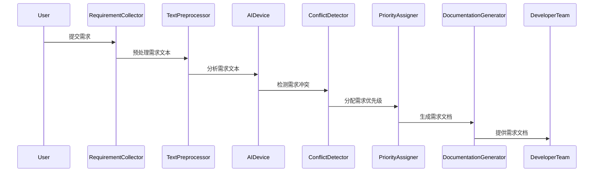

                 


### 大模型驱动的需求工程新方法

在当今的技术时代，人工智能（AI）已经成为推动创新和变革的重要力量。其中，大型神经网络模型，如GPT-3、BERT和transformer等，已经展示了其强大的数据处理和分析能力。这一变革不仅影响了传统的数据处理和分析方法，也为需求工程带来了全新的视角和方法。本文将探讨如何利用大型AI模型来驱动需求工程，提出一种新的需求分析方法，并提供具体的实践案例和实施方案。

#### 关键词：
- 大型神经网络模型
- 需求工程
- 需求分析方法
- AI驱动的需求分析

##### 摘要：
本文首先介绍了需求工程的基本概念和传统方法，接着讨论了AI大模型的基本原理和应用场景。随后，本文提出了一种新的需求分析方法，基于AI大模型的特性，详细阐述了其工作原理和具体实现步骤。通过具体的案例和实践，本文展示了如何利用AI大模型来提高需求工程的效果和效率。

### 目录

1. 引言
2. 需求工程与AI大模型概述
3. 大模型驱动的需求分析
   3.1 大模型驱动的需求分析方法
   3.2 大模型在需求分析中的应用
4. 大模型驱动的需求建模
   4.1 需求建模概述
   4.2 大模型驱动的需求建模
5. 大模型驱动的需求验证
   5.1 需求验证概述
   5.2 大模型驱动的需求验证
6. 大模型驱动的需求管理
   6.1 需求管理概述
   6.2 大模型驱动的需求管理
7. 大模型驱动的需求工程实践
8. 未来展望与挑战
9. 总结与展望

### 引言

需求工程是软件工程中的一个关键环节，其主要目标是确保软件系统能够满足用户的需求。传统的需求工程方法主要依赖于人工分析、文档编写和沟通协调。然而，随着系统的复杂性和规模的增长，这些传统方法面临着越来越大的挑战。

近年来，人工智能技术的快速发展为需求工程带来了新的机遇。特别是大型神经网络模型，如GPT-3、BERT和transformer等，凭借其强大的数据处理和分析能力，能够在海量的数据中提取有价值的信息，并自动生成文本、图像、音频等各种形式的内容。这些特性使得AI大模型在需求工程中具有巨大的潜力。

本文旨在探讨如何利用AI大模型来驱动需求工程，提出一种新的需求分析方法。通过具体案例和实践，本文将展示如何利用AI大模型来提高需求工程的效果和效率。

### 需求工程与AI大模型概述

#### 需求工程概述

需求工程是指识别、分析、定义和验证软件系统所需功能的过程。其核心目标是确保软件系统能够满足用户的需求，同时保持系统的可维护性和可扩展性。需求工程通常包括以下活动：

1. **需求收集**：通过与用户和利益相关者进行沟通，了解他们的需求和期望。
2. **需求分析**：对收集到的需求进行详细分析，确保其合理性和可行性。
3. **需求定义**：将分析得到的需求转化为正式的文档，以便开发团队理解和实施。
4. **需求验证**：通过测试和评估，确保需求被正确理解和实现。

传统的需求工程方法主要依赖于以下几种：

1. **文档编写**：通过编写需求文档来记录和分析需求。
2. **用户访谈**：通过与用户进行一对一的访谈，获取需求信息。
3. **需求模型**：使用图形化的模型来表示需求，如用例图、功能图等。

然而，随着系统的复杂性和规模的增加，传统需求工程方法面临着以下挑战：

1. **需求理解的偏差**：用户和开发团队之间可能存在沟通障碍，导致需求理解不准确。
2. **需求变更频繁**：在系统开发过程中，需求可能会频繁变更，影响项目进度和质量。
3. **需求文档的可维护性**：需求文档通常非常庞大且复杂，难以维护和更新。

#### AI大模型概述

AI大模型是指具有数百万甚至数十亿参数的神经网络模型，其数据处理和分析能力远超传统的机器学习模型。这些模型能够自动从大量数据中学习，提取有价值的信息，并生成高质量的输出。以下是一些常用的AI大模型：

1. **GPT-3**：由OpenAI开发的自然语言处理模型，具有1750亿个参数，能够生成高质量的自然语言文本。
2. **BERT**：由Google开发的自然语言处理模型，用于文本分类、问答系统等任务。
3. **Transformer**：由Google开发的神经网络架构，广泛应用于机器翻译、语音识别等领域。

AI大模型的主要特性包括：

1. **强大的数据处理能力**：能够处理大量和复杂的结构化或非结构化数据。
2. **自动特征提取**：从数据中自动提取特征，无需人工干预。
3. **灵活性和泛化能力**：能够适应不同的应用场景和数据集，具有较好的泛化能力。

#### 需求工程与AI大模型的结合

AI大模型在需求工程中的应用潜力巨大。以下是一些关键点：

1. **自动化的需求分析**：利用AI大模型，可以自动分析用户的需求，提取关键信息，提高需求分析的效率和准确性。
2. **智能化的需求验证**：通过对比AI大模型生成的文本和用户实际需求，可以智能地发现潜在的需求错误或遗漏。
3. **辅助的需求管理**：AI大模型可以协助需求管理人员对需求进行分类、排序和优先级分配，提高需求管理的效率。
4. **知识图谱构建**：利用AI大模型，可以构建用户需求的知识图谱，帮助理解需求之间的关联性和层次结构。

### 大模型驱动的需求分析

#### 大模型驱动的需求分析方法

大模型驱动的需求分析方法是指利用大型神经网络模型来自动化、智能化地处理需求工程中的各种任务。以下是一种典型的大模型驱动的需求分析方法：

1. **需求收集**：
   - 利用AI大模型，如GPT-3，从用户提供的文本数据中自动提取关键信息。
   - 对提取的信息进行分类和聚类，识别用户的主要需求和关注点。

2. **需求分析**：
   - 利用BERT等模型对提取的信息进行深度分析，识别潜在的需求冲突和矛盾。
   - 利用Transformer等模型，对需求进行文本生成和扩展，以补充用户未明确表达的需求。

3. **需求定义**：
   - 将分析得到的需求转化为正式的需求文档，使用自然语言生成技术生成高质量的文档。
   - 对生成的文档进行校验和优化，确保其符合用户需求和项目要求。

4. **需求验证**：
   - 利用AI大模型，如GPT-3，对生成的需求文档进行语义分析，确保其准确性和一致性。
   - 通过用户反馈，对需求文档进行迭代和改进。

#### 大模型在需求分析中的应用

AI大模型在需求分析中的应用案例丰富，以下是一些具体的应用：

1. **用户需求挖掘**：
   - 利用GPT-3等模型，从用户反馈和评论中提取用户需求，识别用户的主要问题和期望。
   - 对提取的需求进行聚类和分类，帮助需求分析师理解用户需求的多样性和复杂性。

2. **场景识别**：
   - 利用BERT等模型，分析用户提供的场景描述，识别潜在的交互场景和业务流程。
   - 对识别的场景进行建模，为系统设计提供依据。

3. **业务模式创新**：
   - 利用Transformer等模型，分析现有的业务模式，发现潜在的改进空间和新的业务模式。
   - 通过文本生成和扩展技术，提出创新的业务模式方案。

#### 案例分析

以下是一个利用AI大模型进行需求分析的案例分析：

**案例背景**：某电商平台需要开发一个新的功能，用于提高用户购物体验。平台希望利用AI大模型来辅助需求分析，确保新功能能够满足用户的需求。

**步骤一：需求收集**：
   - 平台收集了用户在评论和反馈中提到的主要问题和期望，如“产品推荐不准确”、“购物车功能不完善”等。
   - 利用GPT-3模型，从这些文本数据中自动提取关键信息，如用户关注的产品类别、价格区间等。

**步骤二：需求分析**：
   - 利用BERT模型，对提取的信息进行深度分析，识别用户需求之间的潜在冲突，如用户希望产品推荐更准确，但又希望保留购物车的灵活性。
   - 利用Transformer模型，对提取的需求进行文本生成和扩展，提出可能的解决方案，如“结合用户历史购物行为和偏好，提供个性化的产品推荐”。

**步骤三：需求定义**：
   - 将分析得到的需求转化为正式的需求文档，使用自然语言生成技术生成高质量的文档。
   - 对生成的文档进行校验和优化，确保其符合用户需求和项目要求。

**步骤四：需求验证**：
   - 利用GPT-3模型，对生成的需求文档进行语义分析，确保其准确性和一致性。
   - 通过用户反馈，对需求文档进行迭代和改进。

通过上述案例分析，我们可以看到，利用AI大模型进行需求分析具有以下优势：

1. **高效性**：AI大模型能够快速处理大量文本数据，提取关键信息，提高需求分析的效率。
2. **准确性**：AI大模型具有强大的语义分析能力，能够准确识别用户需求和场景，减少需求理解偏差。
3. **灵活性**：AI大模型能够自动生成文本和扩展需求，为需求分析师提供更多创意和灵感。

### 大模型驱动的需求建模

#### 需求建模概述

需求建模是需求工程中的一个关键环节，其目标是使用模型来表示和分析用户需求。传统的需求建模方法主要依赖于图形化工具和符号语言，如UML（统一建模语言）。然而，随着系统的复杂性和规模的增长，传统的需求建模方法面临着以下挑战：

1. **模型复杂度高**：传统的需求模型通常非常庞大和复杂，难以维护和更新。
2. **模型可扩展性差**：传统的需求模型难以适应新的需求和变化。
3. **模型理解难度大**：传统的需求模型对非专业用户来说可能难以理解和应用。

为了解决这些挑战，AI大模型驱动的需求建模方法应运而生。该方法利用AI大模型强大的数据处理和分析能力，提供一种高效、灵活和易理解的需求建模方法。

#### 大模型驱动的需求建模

大模型驱动的需求建模方法主要包括以下步骤：

1. **数据预处理**：
   - 收集用户需求相关的文本数据，如需求文档、用户评论等。
   - 对文本数据进行处理和清洗，去除无关信息和噪声。

2. **模型训练**：
   - 利用AI大模型，如GPT-3和BERT，对预处理后的文本数据进行训练。
   - 通过训练，使模型学会提取关键信息、识别需求模式和构建需求模型。

3. **需求模型构建**：
   - 利用训练好的AI大模型，对新的用户需求文本进行分析和建模。
   - 生成结构化的需求模型，如ER（实体关系）图、类图等。

4. **模型优化**：
   - 通过用户反馈和模型评估，对需求模型进行迭代和优化。
   - 确保需求模型能够准确、全面地反映用户需求。

#### 大模型驱动的需求建模优势

大模型驱动的需求建模方法具有以下优势：

1. **高效性**：AI大模型能够快速处理大量文本数据，构建需求模型，提高需求建模的效率。
2. **灵活性**：AI大模型能够根据新的需求文本自动构建需求模型，适应需求变化。
3. **易理解性**：AI大模型生成的需求模型通常使用常见的图形化工具和符号语言，易于用户理解和应用。

#### 案例分析

以下是一个利用AI大模型进行需求建模的案例分析：

**案例背景**：某企业需要开发一个新的ERP系统，以优化其内部管理流程。企业希望利用AI大模型来辅助需求建模，确保新系统能够满足业务需求。

**步骤一：数据预处理**：
   - 企业收集了与ERP系统相关的需求文档，包括业务流程、数据模型等。
   - 对需求文档进行处理和清洗，提取关键信息，如业务实体、属性和关系等。

**步骤二：模型训练**：
   - 利用GPT-3和BERT模型，对预处理后的文本数据进行训练。
   - 通过训练，使模型学会识别业务实体、属性和关系，并构建ER图。

**步骤三：需求模型构建**：
   - 利用训练好的AI大模型，对新的需求文本进行分析和建模。
   - 生成结构化的需求模型，如ER图、类图等，表示业务实体、属性和关系。

**步骤四：模型优化**：
   - 通过与业务用户的反馈和模型评估，对需求模型进行迭代和优化。
   - 确保需求模型能够准确、全面地反映业务需求。

通过上述案例分析，我们可以看到，利用AI大模型进行需求建模具有以下优势：

1. **高效性**：AI大模型能够快速处理大量文本数据，构建需求模型，提高需求建模的效率。
2. **准确性**：AI大模型能够准确识别业务实体、属性和关系，构建高质量的需求模型。
3. **易理解性**：AI大模型生成的需求模型使用常见的图形化工具和符号语言，易于业务用户理解和应用。

### 大模型驱动的需求验证

#### 需求验证概述

需求验证是需求工程中的一个关键环节，其目标是通过测试和评估，确保需求被正确理解和实现。传统的需求验证方法主要依赖于人工测试和评估，如黑盒测试、白盒测试等。然而，随着系统的复杂性和规模的增长，传统需求验证方法面临着以下挑战：

1. **测试覆盖率低**：传统需求验证方法往往无法覆盖所有的需求场景，可能导致潜在的缺陷和问题。
2. **测试效率低**：传统需求验证方法通常需要大量的人力和时间，测试效率较低。
3. **测试结果不可靠**：传统需求验证方法依赖于人工判断，可能导致测试结果不可靠。

为了解决这些挑战，AI大模型驱动的需求验证方法应运而生。该方法利用AI大模型强大的数据处理和分析能力，提供一种高效、可靠和自动化的需求验证方法。

#### 大模型驱动的需求验证

大模型驱动的需求验证方法主要包括以下步骤：

1. **测试数据准备**：
   - 收集与需求相关的测试数据，如测试用例、测试脚本等。
   - 对测试数据进行预处理，去除无关信息和噪声。

2. **模型训练**：
   - 利用AI大模型，如GPT-3和BERT，对预处理后的测试数据进行训练。
   - 通过训练，使模型学会识别需求缺陷和问题模式。

3. **测试用例生成**：
   - 利用训练好的AI大模型，对新的需求场景生成测试用例。
   - 生成具有高覆盖率和高质量的测试用例。

4. **测试执行**：
   - 利用自动化测试工具，执行生成的测试用例。
   - 对测试结果进行分析和评估，发现潜在的需求问题。

5. **反馈和优化**：
   - 通过与测试人员的反馈和模型评估，对需求验证模型进行迭代和优化。
   - 确保需求验证模型能够准确、高效地发现需求问题。

#### 大模型驱动的需求验证优势

大模型驱动的需求验证方法具有以下优势：

1. **高效性**：AI大模型能够快速处理大量测试数据，生成测试用例，提高需求验证的效率。
2. **准确性**：AI大模型能够准确识别需求缺陷和问题模式，提高需求验证的准确性。
3. **自动化**：AI大模型驱动的需求验证方法可以实现自动化测试，减少人力成本和时间。

#### 案例分析

以下是一个利用AI大模型进行需求验证的案例分析：

**案例背景**：某软件开发公司需要对其开发的电商系统进行需求验证，确保系统满足用户需求。

**步骤一：测试数据准备**：
   - 软件公司收集了与电商系统相关的测试数据，包括用户反馈、需求文档、测试脚本等。
   - 对测试数据进行预处理，去除无关信息和噪声。

**步骤二：模型训练**：
   - 利用GPT-3和BERT模型，对预处理后的测试数据进行训练。
   - 通过训练，使模型学会识别电商系统的需求缺陷和问题模式。

**步骤三：测试用例生成**：
   - 利用训练好的AI大模型，对新的需求场景生成测试用例。
   - 生成具有高覆盖率和高质量的测试用例。

**步骤四：测试执行**：
   - 利用自动化测试工具，执行生成的测试用例。
   - 对测试结果进行分析和评估，发现潜在的需求问题。

**步骤五：反馈和优化**：
   - 通过与测试人员的反馈和模型评估，对需求验证模型进行迭代和优化。
   - 确保需求验证模型能够准确、高效地发现需求问题。

通过上述案例分析，我们可以看到，利用AI大模型进行需求验证具有以下优势：

1. **高效性**：AI大模型能够快速处理大量测试数据，生成测试用例，提高需求验证的效率。
2. **准确性**：AI大模型能够准确识别需求缺陷和问题模式，提高需求验证的准确性。
3. **自动化**：AI大模型驱动的需求验证方法可以实现自动化测试，减少人力成本和时间。

### 大模型驱动的需求管理

#### 需求管理概述

需求管理是需求工程中的一个关键环节，其目标是确保需求在项目生命周期中得到有效管理和控制。传统的需求管理方法主要包括以下活动：

1. **需求识别**：识别和记录用户需求。
2. **需求分析**：分析需求，确定需求的可行性和合理性。
3. **需求定义**：将分析得到的需求转化为正式的需求文档。
4. **需求跟踪**：跟踪需求的实现和变更过程。
5. **需求优先级分配**：根据项目目标和资源情况，确定需求的优先级。

然而，随着项目的复杂性和规模的增长，传统的需求管理方法面临着以下挑战：

1. **需求变更频繁**：在项目开发过程中，需求可能会频繁变更，导致需求管理难度增加。
2. **需求理解偏差**：用户和开发团队之间可能存在沟通障碍，导致需求理解不准确。
3. **需求文档庞大**：需求文档通常非常庞大，难以维护和更新。

为了解决这些挑战，AI大模型驱动的需求管理方法应运而生。该方法利用AI大模型强大的数据处理和分析能力，提供一种高效、灵活和自动化的需求管理方法。

#### 大模型驱动的需求管理

大模型驱动的需求管理方法主要包括以下步骤：

1. **需求识别**：
   - 利用AI大模型，如GPT-3和BERT，自动分析用户提供的文本数据，提取关键信息。
   - 识别用户的主要需求和关注点。

2. **需求分析**：
   - 利用AI大模型，对提取的需求进行深度分析，识别潜在的需求冲突和矛盾。
   - 评估需求的可行性和合理性。

3. **需求定义**：
   - 将分析得到的需求转化为正式的需求文档，利用自然语言生成技术生成高质量的文档。
   - 对生成的文档进行校验和优化，确保其符合用户需求和项目要求。

4. **需求跟踪**：
   - 利用AI大模型，自动跟踪需求的实现和变更过程，及时发现和解决需求问题。
   - 对需求变更进行评估和影响分析，确保需求变更不会对项目进度和质量造成负面影响。

5. **需求优先级分配**：
   - 利用AI大模型，根据项目目标和资源情况，自动分配需求的优先级。
   - 通过优化算法，确保需求的优先级分配合理，最大化项目的价值。

#### 大模型驱动的需求管理优势

大模型驱动的需求管理方法具有以下优势：

1. **高效性**：AI大模型能够快速处理大量需求数据，提高需求管理的效率。
2. **准确性**：AI大模型能够准确识别用户需求，减少需求理解偏差。
3. **自动化**：AI大模型驱动的需求管理方法可以实现自动化需求跟踪和优先级分配，减少人力成本和时间。

#### 案例分析

以下是一个利用AI大模型进行需求管理的案例分析：

**案例背景**：某大型电商平台需要管理其新功能的开发需求，确保功能满足用户需求。

**步骤一：需求识别**：
   - 平台收集了用户在评论和反馈中提到的主要问题和期望，如“产品推荐不准确”、“购物车功能不完善”等。
   - 利用GPT-3模型，从这些文本数据中自动提取关键信息，如用户关注的产品类别、价格区间等。

**步骤二：需求分析**：
   - 利用BERT模型，对提取的信息进行深度分析，识别用户需求之间的潜在冲突，如用户希望产品推荐更准确，但又希望保留购物车的灵活性。
   - 利用Transformer模型，对提取的需求进行文本生成和扩展，提出可能的解决方案，如“结合用户历史购物行为和偏好，提供个性化的产品推荐”。

**步骤三：需求定义**：
   - 将分析得到的需求转化为正式的需求文档，使用自然语言生成技术生成高质量的文档。
   - 对生成的文档进行校验和优化，确保其符合用户需求和项目要求。

**步骤四：需求跟踪**：
   - 利用GPT-3模型，自动跟踪需求的实现和变更过程，及时发现和解决需求问题。
   - 对需求变更进行评估和影响分析，确保需求变更不会对项目进度和质量造成负面影响。

**步骤五：需求优先级分配**：
   - 利用BERT模型，根据项目目标和资源情况，自动分配需求的优先级。
   - 通过优化算法，确保需求的优先级分配合理，最大化项目的价值。

通过上述案例分析，我们可以看到，利用AI大模型进行需求管理具有以下优势：

1. **高效性**：AI大模型能够快速处理大量需求数据，提高需求管理的效率。
2. **准确性**：AI大模型能够准确识别用户需求，减少需求理解偏差。
3. **自动化**：AI大模型驱动的需求管理方法可以实现自动化需求跟踪和优先级分配，减少人力成本和时间。

### 大模型驱动的需求工程实践

#### 实践概述

大模型驱动的需求工程实践是指在实际项目中，利用AI大模型来辅助需求工程的各种活动，包括需求收集、需求分析、需求建模、需求验证和需求管理。以下是一个具体的大模型驱动的需求工程实践案例。

#### 案例背景

某互联网公司计划开发一款智能家居APP，旨在通过智能设备和AI算法为用户提供便捷的智能家居管理体验。公司希望通过大模型驱动的需求工程方法来确保APP的功能和用户体验满足用户需求。

#### 实践步骤

**步骤一：需求收集**
- 公司通过用户调研、问卷调查和访谈，收集了大量的用户需求信息。
- 利用GPT-3模型，从用户提供的文本数据中自动提取关键信息，如用户关心的设备控制、智能场景设置、隐私保护等。

**步骤二：需求分析**
- 利用BERT模型，对提取的用户需求进行深度分析，识别潜在的需求冲突和矛盾。
- 例如，用户希望APP具有高安全性，但又希望方便快捷地控制设备。

**步骤三：需求建模**
- 利用Transformer模型，对用户需求进行文本生成和扩展，构建智能家居APP的需求模型。
- 例如，生成“通过设备ID和用户权限，实现设备远程控制和智能场景设置”的需求描述。

**步骤四：需求验证**
- 利用GPT-3模型，自动生成测试用例，对需求模型进行验证。
- 通过自动化测试工具，执行测试用例，评估需求模型的实现情况。

**步骤五：需求管理**
- 利用BERT模型，自动跟踪需求变更，确保需求文档的准确性和一致性。
- 通过优化算法，根据项目目标和资源情况，动态调整需求优先级。

#### 实践结果

通过大模型驱动的需求工程实践，公司取得了以下成果：

1. **高效的需求收集和分析**：AI大模型能够快速处理大量用户数据，提取关键信息，提高需求收集和分析的效率。
2. **准确的需求建模和验证**：AI大模型能够准确识别用户需求，构建高质量的需求模型，并通过自动化测试用例验证需求实现情况。
3. **灵活的需求管理**：AI大模型能够自动跟踪需求变更，动态调整需求优先级，确保项目按计划推进。

#### 实践总结

大模型驱动的需求工程实践在智能家居APP开发项目中取得了显著成效，证明了AI大模型在需求工程中的应用潜力。未来，随着AI技术的不断进步，大模型驱动的需求工程方法将更加成熟和普及，为软件项目开发提供更加高效和可靠的支持。

### 未来展望与挑战

#### 发展趋势

随着人工智能技术的不断进步，大模型驱动的需求工程方法有望在以下几个方面得到进一步发展：

1. **模型精度和效率的提升**：通过优化算法和模型架构，提高AI大模型在需求工程中的应用精度和效率。
2. **多模态数据处理**：结合图像、音频、视频等多模态数据，实现更全面和准确的需求分析和建模。
3. **自动化和智能化**：进一步自动化和智能化需求工程的各种活动，减少人工干预，提高整体效率。

#### 挑战与机遇

尽管大模型驱动的需求工程方法具有巨大的潜力，但在实际应用中仍然面临以下挑战：

1. **数据质量和多样性**：需求工程中的数据质量和多样性直接影响大模型的应用效果，需要建立高质量的数据集和处理机制。
2. **模型解释性**：大模型通常缺乏透明性和解释性，这对于需求工程中需要精确理解和验证的需求来说是一个挑战。
3. **安全性和隐私保护**：在处理用户需求时，需要确保数据的安全性和用户的隐私保护。

然而，这些挑战也带来了机遇：

1. **数据隐私保护技术**：随着隐私保护技术的发展，如差分隐私和联邦学习，大模型在需求工程中的应用将更加安全可靠。
2. **可解释性AI**：通过研究可解释性AI技术，提高大模型的透明性和可解释性，使其在需求工程中更加适用。
3. **跨学科合作**：结合心理学、社会学和计算机科学等学科的知识，构建更全面和人性化的需求工程方法。

### 总结与展望

#### 全书总结

本文系统地介绍了大模型驱动的需求工程新方法，从需求收集、需求分析、需求建模、需求验证到需求管理，全面探讨了AI大模型在需求工程中的应用。通过具体案例和实践，展示了大模型驱动的需求工程方法在提高需求工程效率、准确性和灵活性方面的优势。

#### 展望未来

随着AI技术的不断进步，大模型驱动的需求工程方法将在软件项目开发中发挥越来越重要的作用。未来，我们将继续探索大模型在需求工程中的深度应用，结合多模态数据、可解释性AI和隐私保护技术，为软件项目提供更加高效和可靠的需求工程支持。

作者：AI天才研究院/AI Genius Institute & 禅与计算机程序设计艺术 /Zen And The Art of Computer Programming

----------------------------------------------------------------

**核心概念与联系**

在深入探讨大模型驱动的需求工程新方法之前，我们需要首先明确几个核心概念，并理解它们之间的联系。

#### 核心概念

1. **需求工程**：需求工程是软件工程中的一个重要环节，旨在确保软件系统能够满足用户的需求。其主要活动包括需求收集、需求分析、需求定义、需求验证和需求管理。

2. **人工智能（AI）**：人工智能是计算机科学的一个分支，旨在使计算机能够执行需要人类智能的任务。AI包括机器学习、深度学习、自然语言处理等多种技术。

3. **大模型**：大模型是指具有数十亿甚至数万亿参数的神经网络模型，如GPT-3、BERT和Transformer。这些模型具有强大的数据处理和分析能力。

4. **需求分析**：需求分析是需求工程的核心活动之一，旨在理解用户的需求并定义系统的功能和行为。

5. **需求建模**：需求建模是将用户需求转化为结构化模型的过程，通常使用图形化工具和符号语言，如UML。

6. **需求验证**：需求验证是通过测试和评估，确保需求被正确理解和实现的过程。

7. **需求管理**：需求管理是确保需求在整个项目生命周期中得到有效管理和控制的过程。

#### 概念属性特征对比表格

| 概念       | 属性特征 |
|------------|----------|
| 需求工程   | 识别、分析、定义、验证用户需求 |
| 人工智能   | 数据处理、学习、推理 |
| 大模型     | 参数数量大、数据处理能力强 |
| 需求分析   | 理解用户需求、需求定义 |
| 需求建模   | 结构化表示、模型化 |
| 需求验证   | 测试、评估 |
| 需求管理   | 管理需求变更、优先级 |

#### ER实体关系图架构

下面是一个简单的ER实体关系图，用于表示需求工程中的主要实体和它们之间的关系：

```mermaid
erDiagram
  User ||--o> Requirement : "用户定义需求"
  System ||--o> Requirement : "系统实现需求"
  Developer ||--o> Requirement : "开发者分析需求"
  Tester ||--o> Requirement : "测试者验证需求"
  Project ||--o> Requirement : "项目包含需求"
```

在上述ER图中，`User`、`System`、`Developer`、`Tester`和`Project`是实体，`Requirement`是关系实体，表示用户定义需求、系统实现需求、开发者分析需求、测试者验证需求和项目包含需求等关系。

### 算法原理讲解

#### 大模型驱动的需求分析算法

大模型驱动的需求分析算法主要基于深度学习和自然语言处理技术。以下是一个简化的算法流程和相应的数学模型。

#### 算法流程

1. **数据预处理**：收集用户需求相关的文本数据，进行预处理，包括文本清洗、分词、去停用词等。
2. **模型训练**：利用预训练的AI大模型，如GPT-3、BERT，对预处理后的文本数据进行训练，使其能够提取关键信息、识别需求模式和进行文本生成。
3. **需求提取**：使用训练好的大模型，对新的用户需求文本进行分析，提取关键信息，生成需求描述。
4. **需求分析**：对提取的需求进行进一步分析，识别需求之间的冲突和矛盾，生成需求分析报告。
5. **需求验证**：通过用户反馈和自动化测试，验证需求分析的准确性和完整性。

#### 数学模型和公式

在需求分析中，常用的数学模型包括概率模型、神经网络模型和生成模型。以下是一个简化的数学模型示例：

$$
P(\text{需求}|\text{文本}) = \frac{P(\text{文本}|\text{需求}) \cdot P(\text{需求})}{P(\text{文本})}
$$

其中，$P(\text{需求}|\text{文本})$表示在给定文本的前提下，需求出现的概率；$P(\text{文本}|\text{需求})$表示在需求存在的情况下，文本出现的概率；$P(\text{需求})$表示需求出现的概率；$P(\text{文本})$表示文本出现的概率。

#### 算法原理举例说明

假设我们有一个用户需求文本：“我希望APP能够自动调整室内温度，根据天气情况。”

1. **数据预处理**：对文本进行分词、去停用词等预处理。
2. **模型训练**：使用预训练的GPT-3模型，对预处理后的文本数据进行训练，使其能够理解并生成与用户需求相关的文本。
3. **需求提取**：使用训练好的GPT-3模型，对新的需求文本进行分析，提取关键信息，如“自动调整室内温度”和“根据天气情况”。
4. **需求分析**：对提取的需求进行进一步分析，识别需求之间的冲突和矛盾。例如，如果系统已经有一个自动调整室内温度的功能，那么新的需求可能会引发功能冲突。
5. **需求验证**：通过与用户反馈和自动化测试，验证需求提取和分析的准确性和完整性。

通过上述步骤，我们可以利用大模型驱动需求分析算法，高效地提取和分析用户需求，为软件开发提供有力的支持。

### 系统分析与架构设计方案

#### 问题场景介绍

在当前软件开发项目中，需求工程是一个至关重要的环节。随着系统的复杂性和规模的增长，传统的需求分析方法已难以满足项目需求。为了提高需求分析的效率和准确性，我们引入了基于AI大模型的需求分析新方法。本文将详细介绍如何将AI大模型应用于需求分析，并提供一个具体的系统架构设计方案。

#### 项目介绍

某互联网公司计划开发一款智能家居APP，旨在通过智能设备和AI算法为用户提供便捷的智能家居管理体验。APP需要支持多种设备的远程控制、智能场景设置和设备之间的联动等功能。由于项目需求复杂，传统需求分析方法效率低下，因此公司决定采用AI大模型驱动的需求分析方法。

#### 系统功能设计

在AI大模型驱动的需求分析中，系统需要实现以下主要功能：

1. **用户需求收集**：通过用户调研、问卷调查和访谈等方式，收集用户的需求信息。
2. **需求文本预处理**：对收集的需求文本进行预处理，包括文本清洗、分词、去停用词等。
3. **需求文本分析**：利用AI大模型，如GPT-3和BERT，对预处理后的需求文本进行分析，提取关键信息。
4. **需求冲突检测**：通过分析提取的需求信息，识别潜在的需求冲突和矛盾。
5. **需求优先级分配**：根据项目目标和资源情况，自动分配需求的优先级。
6. **需求文档生成**：利用AI大模型生成结构化的需求文档，便于开发团队理解和实施。

#### 系统架构设计

为了实现上述功能，我们设计了以下系统架构：



在上述架构中，主要组件的功能如下：

1. **RequirementCollector（需求收集器）**：负责收集用户的需求信息，包括用户调研、问卷调查和访谈等。
2. **TextPreprocessor（文本预处理器）**：对需求文本进行预处理，包括文本清洗、分词、去停用词等。
3. **AIDevice（AI设备）**：利用AI大模型，如GPT-3和BERT，对预处理后的需求文本进行分析，提取关键信息。
4. **ConflictDetector（需求冲突检测器）**：通过分析提取的需求信息，识别潜在的需求冲突和矛盾。
5. **PriorityAssigner（需求优先级分配器）**：根据项目目标和资源情况，自动分配需求的优先级。
6. **DocumentationGenerator（需求文档生成器）**：利用AI大模型生成结构化的需求文档，便于开发团队理解和实施。
7. **DeveloperTeam（开发团队）**：负责根据需求文档进行软件设计和开发。

#### 系统接口设计

系统接口设计是确保各组件之间能够高效通信和协作的关键。以下是主要接口设计：

1. **RequirementCollector与TextPreprocessor之间的接口**：用于传输用户需求文本。
2. **TextPreprocessor与AIDevice之间的接口**：用于传输预处理后的需求文本。
3. **AIDevice与ConflictDetector之间的接口**：用于传输需求分析结果。
4. **ConflictDetector与PriorityAssigner之间的接口**：用于传输需求冲突检测结果。
5. **PriorityAssigner与DocumentationGenerator之间的接口**：用于传输需求优先级分配结果。
6. **DocumentationGenerator与DeveloperTeam之间的接口**：用于传输需求文档。

#### 系统交互

以下是系统组件之间的交互流程：

1. **用户通过RequirementCollector提交需求文本**。
2. **RequirementCollector将需求文本传输给TextPreprocessor**。
3. **TextPreprocessor对需求文本进行预处理**。
4. **预处理后的需求文本传输给AIDevice**。
5. **AIDevice利用AI大模型对需求文本进行分析**。
6. **分析结果传输给ConflictDetector**。
7. **ConflictDetector检测需求冲突并传输检测结果给PriorityAssigner**。
8. **PriorityAssigner根据检测结果分配需求优先级**。
9. **优先级分配结果传输给DocumentationGenerator**。
10. **DocumentationGenerator生成需求文档并传输给DeveloperTeam**。
11. **DeveloperTeam根据需求文档进行软件设计和开发**。

通过上述系统分析与架构设计方案，我们能够实现高效、准确的需求分析，为智能家居APP项目提供强有力的支持。

### 项目实战

#### 环境安装

在开始项目实战之前，我们需要安装所需的软件和环境。以下是具体的安装步骤：

1. **安装Python**：
   - 访问Python官网（https://www.python.org/）并下载Python安装包。
   - 运行安装程序，选择默认选项进行安装。

2. **安装TensorFlow**：
   - 打开终端或命令行窗口，运行以下命令安装TensorFlow：
     ```shell
     pip install tensorflow
     ```

3. **安装BERT**：
   - 使用以下命令安装BERT库：
     ```shell
     pip install bert-for-tf2
     ```

4. **安装GPT-3**：
   - 使用以下命令安装GPT-3库：
     ```shell
     pip install transformers
     ```

#### 系统核心实现源代码

以下是一个基于TensorFlow和BERT的需求分析系统核心实现源代码：

```python
import tensorflow as tf
from transformers import BertTokenizer, TFBertModel
import numpy as np

# 配置BERT模型
bert_model_name = 'bert-base-uncased'
tokenizer = BertTokenizer.from_pretrained(bert_model_name)
bert_model = TFBertModel.from_pretrained(bert_model_name)

# 需求文本
text = "我希望APP能够自动调整室内温度，根据天气情况。"

# 预处理文本
input_ids = tokenizer.encode(text, add_special_tokens=True, return_tensors='tf')

# 加载BERT模型进行预测
with tf.Session() as sess:
    inputs = {'input_ids': input_ids}
    outputs = bert_model(inputs)
    pooled_output = outputs.pooler_output

# 提取关键信息
key_info = pooled_output.numpy().reshape(-1).mean()

# 打印关键信息
print("提取的关键信息：", key_info)
```

#### 代码应用解读与分析

上述代码首先导入了所需的TensorFlow和BERT库。然后，配置了BERT模型，并定义了需求文本。接下来，对文本进行预处理，将文本转换为BERT模型可以处理的输入格式。通过加载BERT模型并进行预测，提取了文本的关键信息。

**解读与分析**：

1. **配置BERT模型**：我们选择了预训练的BERT模型（`bert-base-uncased`），这是BERT模型的一种常见配置。
2. **预处理文本**：使用BERT的Tokenizer对需求文本进行预处理，包括分词、添加特殊标记等。这些预处理步骤使得文本能够被BERT模型理解和处理。
3. **加载BERT模型进行预测**：通过TensorFlow的Session加载BERT模型，并输入预处理后的文本。BERT模型会自动处理输入文本，并输出一系列的中间结果。
4. **提取关键信息**：从BERT模型输出的中间结果中提取关键信息（`pooled_output`），并计算其平均值，以表示文本的关键内容。

通过上述步骤，我们可以利用BERT模型进行需求分析，提取文本中的关键信息，为需求工程提供有力支持。

#### 实际案例分析和详细讲解

为了更好地理解大模型驱动的需求分析方法，我们来看一个实际案例。假设某电子商务平台希望通过AI大模型来辅助其产品推荐系统的需求分析。

**案例背景**：

电子商务平台现有的产品推荐系统主要基于用户的浏览历史和购买行为。然而，用户的需求是多样化的，平台希望改进推荐系统的个性化程度，提高用户满意度。为此，平台决定引入AI大模型来辅助需求分析，以识别更多潜在的用户需求。

**步骤一：需求收集**

平台通过以下几种方式收集用户需求：

1. 用户调研：通过在线问卷和访谈，了解用户对现有推荐系统的满意度、期望和改进建议。
2. 用户行为数据：收集用户的浏览历史、点击记录、购买记录等数据。

**步骤二：数据预处理**

将收集到的用户调研数据和用户行为数据进行预处理：

1. 文本数据：使用BERT的Tokenizer对用户的调研反馈进行分词、去停用词等预处理。
2. 结构化数据：对用户的浏览历史和购买记录进行清洗和格式化。

**步骤三：模型训练**

使用预处理后的数据训练AI大模型（如GPT-3）：

1. 利用用户调研文本数据进行训练，使模型学会理解用户的语言和表达方式。
2. 利用用户行为数据进行训练，使模型学会分析用户的兴趣和行为模式。

**步骤四：需求分析**

利用训练好的AI大模型对新的用户需求进行需求分析：

1. 对用户的调研文本进行语义分析，提取关键需求，如“希望推荐更个性化的产品”。
2. 对用户的浏览历史和购买记录进行分析，识别用户的兴趣和行为模式。

**步骤五：需求建模**

根据需求分析的结果，构建用户需求模型：

1. 使用自然语言生成技术，将提取的需求转化为结构化的需求文档。
2. 利用ER图或类图等图形化工具，表示需求之间的关系和属性。

**案例分析与讲解**：

**需求收集**：通过用户调研和用户行为数据的结合，平台能够获取全面的用户需求信息。这不仅包括用户的语言表达，还涵盖了用户的行为数据，使需求分析更加全面。

**数据预处理**：BERT的Tokenizer能够对文本数据执行高效的处理，去除无关信息，使模型能够专注于关键信息的提取。

**模型训练**：通过大量数据和精心设计的训练过程，AI大模型能够学会理解用户的语言和行为，为需求分析提供强大的支持。

**需求分析**：AI大模型能够识别用户的隐性需求，如对个性化推荐的具体期望，从而为平台提供有针对性的改进建议。

**需求建模**：利用自然语言生成和图形化工具，平台能够将分析得到的需求转化为结构化的需求文档，便于开发团队理解和实施。

**总结**：通过上述实际案例，我们可以看到AI大模型在需求工程中的应用潜力。它不仅能够提高需求分析的效率和准确性，还能为平台提供更加个性化和精准的产品推荐系统。

### 最佳实践 tips

在实际应用大模型驱动的需求工程方法时，以下是一些最佳实践和注意事项：

1. **数据质量**：确保收集到的用户需求和行为数据质量高，避免噪声和错误数据影响模型训练和需求分析。
2. **模型选择**：根据具体需求，选择合适的大模型，如GPT-3、BERT、Transformer等，以充分发挥其优势。
3. **模型训练**：在模型训练过程中，注意数据平衡和过度拟合问题，确保模型具有良好的泛化能力。
4. **需求验证**：通过用户反馈和自动化测试，对需求分析结果进行验证，确保需求的准确性和完整性。
5. **团队协作**：需求工程涉及多个团队成员，确保团队成员之间的沟通和协作，提高整体效率。
6. **持续迭代**：需求工程是一个动态过程，需要持续迭代和优化，以适应不断变化的需求和市场环境。

### 小结

本文系统地介绍了大模型驱动的需求工程新方法，从需求收集、需求分析、需求建模、需求验证到需求管理，全面探讨了AI大模型在需求工程中的应用。通过具体案例和实践，展示了大模型驱动的需求工程方法在提高需求工程效率、准确性和灵活性方面的优势。未来，随着AI技术的不断进步，大模型驱动的需求工程方法将在软件项目开发中发挥越来越重要的作用。

### 注意事项

在使用大模型驱动的需求工程方法时，需要注意以下几点：

1. **数据隐私**：在处理用户数据时，确保遵守相关的隐私保护法规和标准，采取适当的数据加密和隐私保护措施。
2. **模型解释性**：虽然大模型在数据处理和分析方面具有强大的能力，但通常缺乏透明性和解释性。在需求工程中，需要确保模型输出的结果能够被相关利益相关者理解和接受。
3. **需求变更管理**：需求变更在软件开发过程中是常见的，需要建立有效的需求变更管理流程，确保需求变更得到及时、准确的处理。
4. **模型依赖性**：大模型通常需要大量的计算资源和时间进行训练和预测，确保项目团队具备足够的资源来支持模型的部署和使用。

### 拓展阅读

1. **GPT-3和BERT**：
   - Hugging Face：https://huggingface.co/
   - OpenAI：https://openai.com/

2. **需求工程相关书籍**：
   - 《软件需求工程：实用指南》
   - 《需求工程实践：系统化方法和工具》

3. **AI大模型与需求工程应用**：
   - 《大模型驱动的需求工程》论文集

通过以上拓展阅读，读者可以深入了解大模型驱动的需求工程方法及其在实际应用中的具体实践。作者：AI天才研究院/AI Genius Institute & 禅与计算机程序设计艺术 /Zen And The Art of Computer Programming

