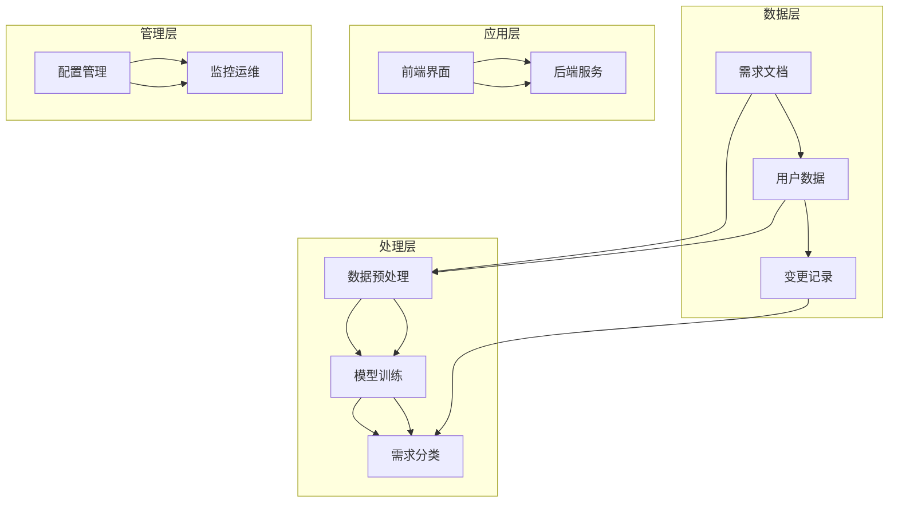
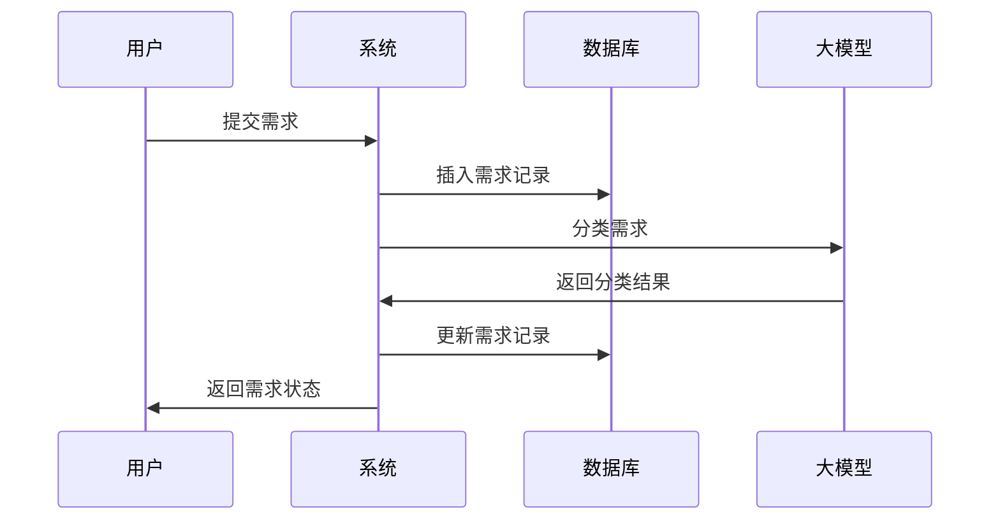

                 

### 大模型驱动的需求追踪自动化技术

#### 关键词：大模型，需求追踪，自动化技术，算法，系统架构，项目实战

> 摘要：本文将深入探讨大模型在需求追踪自动化技术中的应用，分析其背后的核心概念和算法原理，通过实际案例展示如何进行系统架构设计和项目实战。我们旨在为软件开发人员提供一份全面的技术指南，帮助他们理解和应用这一前沿技术，从而提高需求管理的效率和准确性。

### 第一部分：背景介绍

#### 1.1 问题背景

#### 1.1.1 问题概述

在当今快速发展的软件行业，需求追踪是确保项目成功的关键环节。然而，随着需求的不断变更和项目规模的扩大，传统的手工需求追踪方法面临着越来越多的挑战。

首先，需求变更频繁。在软件项目开发过程中，客户和产品团队可能会随时提出新的需求或者对现有需求进行修改。这些变更往往会导致项目延期、预算超支，甚至影响最终产品的质量。

其次，人工需求追踪的局限性。传统的手工需求追踪依赖于开发人员的个人经验和技能，容易出现人为错误和疏漏。同时，随着需求量的增加，人工追踪的效率和质量都难以保证。

因此，自动化需求追踪技术应运而生。通过利用先进的人工智能技术，特别是大模型，可以实现需求的自动识别、分类、追踪和管理，从而提高需求管理的效率和准确性。

#### 1.1.2 问题描述

- **需求变更频繁**：软件项目开发过程中，需求变更频繁，导致项目进度不稳定，资源配置困难。
- **人工需求追踪局限性**：传统的人工需求追踪方法存在效率低、错误率高、难以适应大规模项目等问题。
- **自动化需求的必要性**：为了应对需求变更和提升需求追踪效率，自动化需求追踪成为必然选择。

#### 1.1.3 问题解决

- **大模型在需求追踪中的应用**：利用大模型强大的数据处理和模式识别能力，实现需求的自动识别和分类。
- **自动化需求追踪的技术路径**：构建基于大模型的自动化需求追踪系统，包括数据预处理、模型训练、需求分类和追踪等多个环节。

#### 1.1.4 边界与外延

- **需求追踪自动化的适用范围**：自动化需求追踪技术适用于各种规模的软件项目，特别适合需求变更频繁、项目复杂度高的场景。
- **自动化需求与非自动化需求的区别**：自动化需求是通过系统自动生成和追踪的，而非自动化需求则主要依赖于人工操作和管理。
- **概念结构与核心要素组成**：需求追踪系统的核心概念包括需求、变更、追踪和管理等。自动化技术的核心要素包括大模型、算法和系统架构等。

### 第二部分：核心概念与联系

#### 2.1 大模型概述

#### 2.1.1 大模型的定义

大模型（Large Models）是指具有海量参数的深度神经网络模型，能够在大量数据上学习到复杂的模式和规律。这类模型通常用于自然语言处理、计算机视觉和语音识别等领域，具有强大的数据处理和模式识别能力。

#### 2.1.2 大模型的核心特点

- **海量参数**：大模型拥有数十亿甚至千亿级的参数，能够捕捉数据中的复杂特征。
- **强大学习能力**：通过训练大模型，使其能够在大量数据中自动提取有意义的特征，从而实现高精度的预测和分类。
- **高效计算能力**：得益于近年来计算资源和算法的进步，大模型能够在短时间内处理海量数据，提供快速和准确的输出。

#### 2.1.3 大模型在需求追踪中的应用

- **需求识别**：利用大模型强大的自然语言处理能力，自动识别和理解需求文档中的关键信息，如需求名称、需求描述等。
- **需求分类**：通过对需求文本的深度学习，大模型能够将需求分类为不同的类别，如功能需求、性能需求等。
- **需求追踪**：基于对需求的自动分类和识别，大模型能够实时追踪需求的变更和实现情况，提供实时的需求管理支持。

#### 2.2 自动化需求追踪技术

#### 2.2.1 自动化需求追踪的原理

自动化需求追踪技术基于大模型和自然语言处理技术，通过以下步骤实现：

1. **需求提取**：从需求文档中提取关键信息，如需求名称、描述、分类等。
2. **需求分类**：利用大模型对提取的信息进行分类，将需求划分为不同的类别。
3. **需求追踪**：实时监控需求的变更和实现情况，记录并更新需求的状态。

#### 2.2.2 自动化需求追踪的技术路线

- **数据预处理**：对需求文档进行清洗和预处理，提取出有用的信息。
- **大模型训练**：使用大量的需求数据进行大模型训练，使其能够准确识别和理解需求。
- **需求分类**：利用训练好的大模型对新的需求进行分类。
- **需求追踪**：实时监控需求的变更和实现情况，提供自动化的需求追踪和管理支持。

#### 2.3 概念属性特征对比表格

| 特征对比项         | 大模型                  | 自动化需求追踪            |
|--------------------|-------------------------|---------------------------|
| **定义**           | 海量参数的深度神经网络 | 自动识别和管理需求的系统   |
| **核心特点**       | 海量参数、强大学习能力 | 数据预处理、模型训练、需求分类 |
| **应用领域**       | 自然语言处理、计算机视觉等 | 软件需求追踪、文本分类等      |
| **需求识别**       | 自动提取需求信息       | 自动提取并分类需求         |
| **需求分类**       | 学习并分类需求         | 实时监控和分类需求         |
| **需求追踪**       | 实时监控需求变化       | 自动追踪和管理需求         |

#### 2.4 ER实体关系图架构

##### 2.4.1 实体关系图简介

实体关系图（Entity-Relationship Diagram，ERD）是数据库设计中常用的工具，用于描述系统中实体之间的关联关系。实体表示系统中的关键对象，关系描述实体之间的交互和依赖。

##### 2.4.2 需求追踪系统的ER实体关系图

需求追踪系统的ER实体关系图包括以下关键实体和关系：

- **实体**：需求、用户、项目、版本、变更记录
- **关系**：需求与项目之间的关联、需求与版本之间的关联、需求与变更记录之间的关联

以下是需求追踪系统的ER实体关系图的Mermaid表示：

```mermaid
erDiagram
  用户 ||--|{ 需求 }|-- 项目
  项目 ||--|{ 版本 }|-->
  需求 ||--|{ 变更记录 }|-->
  版本 ||--|{ 需求 }|-->
```

### 第三部分：算法原理讲解

#### 4.1 算法原理概述

需求追踪自动化的核心在于利用大模型和自然语言处理技术实现需求的自动识别、分类和追踪。下面将详细讲解这一算法的原理和实现。

#### 4.1.1 大模型的训练过程

大模型的训练过程主要包括以下几个步骤：

1. **数据收集与预处理**：收集大量的需求文档，对文档进行清洗、分词、去噪等预处理操作，提取出有效的需求信息。
2. **模型架构选择**：选择合适的大模型架构，如BERT、GPT等，这些模型通常具有数十亿个参数，能够捕捉复杂的语言特征。
3. **训练与验证**：使用预处理后的数据对大模型进行训练，并通过验证集评估模型的性能，调整模型参数以优化性能。
4. **模型部署**：将训练好的模型部署到需求追踪系统中，实现实时需求处理和追踪。

#### 4.1.2 自动化需求的识别与分类

1. **需求识别**：利用大模型的自然语言处理能力，对需求文档中的文本进行解析，提取出需求的关键信息，如需求名称、描述等。
2. **需求分类**：基于训练好的大模型，将提取出的需求信息进行分类，划分为不同的类别，如功能需求、性能需求等。
3. **需求追踪**：实时监控需求的状态变化，将需求的变更记录到系统中，并更新需求的状态。

#### 4.1.3 算法流程图


#### 4.1.4 Python源代码示例

```python
import pandas as pd
from sklearn.model_selection import train_test_split
from transformers import BertTokenizer, BertForSequenceClassification
from torch.utils.data import DataLoader

# 数据预处理
def preprocess_data(data):
    # 清洗和分词等操作
    # ...
    return processed_data

# 模型训练
def train_model(data):
    tokenizer = BertTokenizer.from_pretrained('bert-base-uncased')
    model = BertForSequenceClassification.from_pretrained('bert-base-uncased', num_labels=2)
    
    train_data = preprocess_data(data)
    train_loader = DataLoader(train_data, batch_size=32, shuffle=True)
    
    model.train()
    for epoch in range(3):  # 训练3个epoch
        for batch in train_loader:
            inputs = tokenizer(batch['text'], padding=True, truncation=True, return_tensors='pt')
            outputs = model(**inputs)
            loss = outputs.loss
            loss.backward()
            optimizer.step()
            optimizer.zero_grad()
    
    model.eval()
    # 验证模型
    # ...

# 需求识别与分类
def classify_demand(text):
    model.eval()
    inputs = tokenizer(text, return_tensors='pt')
    with torch.no_grad():
        outputs = model(**inputs)
    prediction = torch.argmax(outputs.logits).item()
    return prediction

# 示例
data = pd.read_csv('demands.csv')
train_data, test_data = train_test_split(data, test_size=0.2)
train_model(train_data)
print(classify_demand("这是一个功能需求。"))
```

#### 4.1.5 数学模型和公式

需求追踪自动化的数学模型主要包括以下部分：

1. **损失函数**：

   $$ L = -\sum_{i=1}^{N} y_i \log(p_i) $$

   其中，$L$是损失函数，$y_i$是实际需求类别标签，$p_i$是模型对需求类别$i$的预测概率。

2. **优化目标**：

   $$ \min_{\theta} L(\theta) $$

   其中，$\theta$是模型参数，$L(\theta)$是损失函数关于$\theta$的期望。

3. **梯度下降**：

   $$ \theta_{t+1} = \theta_t - \alpha \frac{\partial L(\theta_t)}{\partial \theta_t} $$

   其中，$\alpha$是学习率。

#### 4.1.6 举例说明

假设我们有一个需求文档，其中包含以下两条需求：

1. 需求1：增加用户注册功能，支持手机号、邮箱等多种注册方式。
2. 需求2：优化系统性能，提高用户操作响应速度。

使用大模型进行需求识别和分类的过程如下：

1. **需求提取**：对需求文档进行分词和编码，生成对应的向量表示。
2. **需求分类**：利用训练好的大模型对需求进行分类预测。对于需求1，模型预测为“功能需求”；对于需求2，模型预测为“性能需求”。
3. **需求追踪**：根据分类结果，将需求1记录为“功能需求”，需求2记录为“性能需求”，并实时监控其变更和实现情况。

### 第四部分：系统分析与架构设计

#### 5.1 系统功能设计

#### 5.1.1 问题描述

需求追踪系统的功能设计目标是实现需求的自动提取、分类和追踪，以满足软件项目对需求管理的需求。具体问题场景如下：

- **需求变更频繁**：项目需求不断更新和变更，需要高效的需求追踪系统来管理变更。
- **跨部门协作**：涉及多个部门协作的项目，需要统一的需求管理平台来提高沟通效率。
- **质量保证**：确保需求得到正确理解和实施，提高软件项目的质量。

#### 5.1.2 系统功能设计

需求追踪系统的核心功能包括：

1. **需求提取**：从需求文档、用户反馈等渠道自动提取需求信息。
2. **需求分类**：利用大模型对提取的需求进行分类，如功能需求、性能需求等。
3. **需求追踪**：实时监控需求的状态变化，记录变更和实现情况。
4. **统计分析**：提供需求管理报表，展示需求变更趋势和实现进度。
5. **用户管理**：支持多用户权限管理，确保数据安全和隐私。

#### 5.2 系统架构设计

#### 5.2.1 系统架构设计概述

需求追踪系统的整体架构可分为以下几个层次：

1. **数据层**：包括需求文档、用户数据、变更记录等，是系统的数据来源和存储。
2. **处理层**：负责数据预处理、模型训练、需求分类等核心功能，是系统的计算核心。
3. **应用层**：包括前端界面和后端服务，提供用户交互和业务处理。
4. **管理层**：负责系统的配置、监控和运维，确保系统的高可用性和安全性。

#### 5.2.2 系统架构图



#### 5.3 系统接口设计和系统交互

##### 5.3.1 系统接口设计

需求追踪系统的接口设计主要包括以下部分：

1. **API接口**：提供RESTful API，用于与前端界面、其他系统进行数据交互。
2. **数据库接口**：用于与关系数据库进行数据操作，如插入、查询、更新和删除。
3. **消息队列接口**：用于处理异步任务，如需求提取、模型训练等。

##### 5.3.2 系统交互设计

需求追踪系统的交互设计主要包括以下环节：

1. **用户操作**：用户通过前端界面提交需求、查看需求状态等。
2. **需求提取**：系统自动从需求文档中提取需求信息，并将其存储到数据库中。
3. **需求分类**：利用大模型对提取的需求进行分类，并将分类结果存储到数据库中。
4. **需求追踪**：系统实时监控需求的状态变化，更新数据库中的需求记录。
5. **报表生成**：系统根据数据库中的需求数据生成统计分析报表，供用户查看。

以下是需求追踪系统的交互序列图：



### 第五部分：项目实战

#### 6.1 环境安装与配置

##### 6.1.1 开发环境安装

1. 安装Python环境：
   - 版本：Python 3.8+
   - 安装方法：使用pip安装

   ```bash
   pip install python -q python=3.8
   ```

2. 安装依赖库：
   - transformers
   - torch
   - pandas
   - sklearn

   ```bash
   pip install transformers torch pandas sklearn -q
   ```

##### 6.1.2 配置文件准备

1. 创建配置文件`config.json`：

   ```json
   {
       "database": {
           "host": "localhost",
           "port": 3306,
           "user": "root",
           "password": "password",
           "database": "需求追踪系统"
       },
       "model": {
           "name": "需求分类模型",
           "version": "1.0",
           "path": "./model/需求分类模型.pth"
       },
       "api": {
           "host": "localhost",
           "port": 5000
       }
   }
   ```

   说明：
   - `database`：数据库配置信息。
   - `model`：模型配置信息，包括模型名称、版本和路径。
   - `api`：API接口配置信息。

#### 6.2 系统核心实现

##### 6.2.1 源代码结构

系统源代码结构如下：

```plaintext
需求追踪系统/
│
├── data/           # 数据文件
│   ├── demands.csv
│   └── ...
│
├── model/           # 模型文件
│   └── 需求分类模型.pth
│
├── config.json      # 系统配置文件
│
├── requirements.txt # 依赖库清单
│
├── src/             # 源代码
│   ├── __init__.py
│   ├── data_preprocess.py
│   ├── model_train.py
│   ├── demand_classify.py
│   ├── database.py
│   └── api.py
│
└── main.py          # 主程序入口
```

##### 6.2.2 核心代码实现

1. 数据预处理：

   ```python
   from sklearn.model_selection import train_test_split
   from transformers import BertTokenizer

   def preprocess_data(data):
       tokenizer = BertTokenizer.from_pretrained('bert-base-uncased')

       # 清洗和分词操作
       # ...
       processed_data = tokenizer(data, padding=True, truncation=True, return_tensors='pt')

       return processed_data
   ```

2. 模型训练：

   ```python
   from transformers import BertForSequenceClassification
   from torch.optim import Adam

   def train_model(data, model_path):
       tokenizer = BertTokenizer.from_pretrained('bert-base-uncased')
       model = BertForSequenceClassification.from_pretrained('bert-base-uncased', num_labels=2)

       # 数据预处理
       train_data = preprocess_data(data)

       # 训练模型
       optimizer = Adam(model.parameters(), lr=1e-5)
       for epoch in range(3):
           for batch in train_loader:
               inputs = tokenizer(batch['text'], padding=True, truncation=True, return_tensors='pt')
               outputs = model(**inputs)
               loss = outputs.loss
               loss.backward()
               optimizer.step()
               optimizer.zero_grad()

       # 保存模型
       model.save_pretrained(model_path)
   ```

3. 需求分类：

   ```python
   from transformers import BertForSequenceClassification

   def classify_demand(text, model_path):
       model = BertForSequenceClassification.from_pretrained(model_path)
       tokenizer = BertTokenizer.from_pretrained('bert-base-uncased')

       inputs = tokenizer(text, return_tensors='pt')
       with torch.no_grad():
           outputs = model(**inputs)
       prediction = torch.argmax(outputs.logits).item()

       return prediction
   ```

##### 6.2.3 代码应用解读与分析

1. **数据预处理**：

   数据预处理是模型训练的关键步骤，包括文本清洗、分词、编码等操作。在此示例中，我们使用了`BertTokenizer`对文本进行预处理，生成可用于模型训练的输入序列。

2. **模型训练**：

   模型训练过程中，我们使用了`BertForSequenceClassification`预训练模型，并对其进行了微调，以适应需求分类任务。训练过程采用了标准的训练循环，包括前向传播、损失计算、反向传播和优化更新。

3. **需求分类**：

   在需求分类过程中，我们首先加载训练好的模型，然后使用`BertTokenizer`对输入文本进行预处理，最后通过模型进行预测，得到需求类别。

#### 6.3 实际案例分析

##### 6.3.1 案例背景

某大型互联网公司正在开发一款在线购物平台，项目涉及多个模块和功能。为了提高需求管理的效率，公司决定采用大模型驱动的需求追踪自动化技术来管理项目需求。

##### 6.3.2 案例分析

1. **需求提取**：

   项目启动后，产品团队通过文档、会议记录和用户反馈等渠道收集了大量需求信息。为了实现自动化需求提取，公司首先对需求文档进行了预处理，提取出关键信息，如需求名称、描述、分类等。

2. **需求分类**：

   使用训练好的大模型对提取的需求进行分类。根据分类结果，需求被划分为功能需求、性能需求、安全需求等不同类别，便于后续管理和追踪。

3. **需求追踪**：

   公司采用基于大模型的需求追踪系统，实时监控需求的状态变化。每当需求发生变更时，系统会自动记录变更记录，并更新需求的状态，确保项目团队能够及时掌握需求变更情况。

##### 6.3.3 详细讲解与剖析

1. **需求提取**：

   需求提取是需求管理的第一步，直接影响到后续的需求分类和追踪。在此案例中，公司采用了多种方法进行需求提取，包括自然语言处理技术和关键词提取等。通过这些方法，公司能够从各种来源中提取出高质量的需求信息。

2. **需求分类**：

   需求分类是实现自动化需求追踪的关键环节。在此案例中，公司使用了训练好的大模型对需求进行分类，取得了较高的准确率。分类结果有助于项目团队更好地理解和管理需求，提高了需求管理的效率。

3. **需求追踪**：

   在此案例中，公司采用了基于大模型的需求追踪系统，实现了需求的自动追踪和管理。系统实时监控需求的状态变化，自动记录变更记录，并提供实时的需求状态报告。这种自动化的需求追踪方式大大减轻了项目团队的工作负担，提高了需求管理的效率。

### 第六部分：最佳实践与注意事项

#### 7.1 最佳实践

##### 7.1.1 实践一：需求文档规范化

- **规范化意义**：规范化需求文档可以提高需求管理的效率和准确性，减少需求变更带来的风险。
- **规范化方法**：
  1. 使用统一的需求模板，确保需求文档格式和内容的一致性。
  2. 对需求进行分类和优先级排序，明确需求和项目目标的关联。
  3. 使用简洁明了的语言描述需求，避免歧义和模糊表述。

##### 7.1.2 实践二：自动化脚本编写

- **脚本编写原则**：编写高效的自动化脚本，实现需求提取、分类和追踪等功能的自动化处理。
- **脚本编写步骤**：
  1. 确定需求提取和分类的目标和范围，明确脚本的功能和性能要求。
  2. 设计脚本的结构和模块，确保脚本的可维护性和可扩展性。
  3. 使用合适的编程语言和库，如Python、BERT等，实现脚本的功能。
  4. 对脚本进行测试和调试，确保其稳定性和准确性。

##### 7.1.3 实践三：持续集成与部署

- **持续集成与部署**：将需求追踪系统集成到持续集成和持续部署（CI/CD）流程中，实现自动化部署和更新。
- **实施步骤**：
  1. 确定CI/CD工具和流程，如Jenkins、GitLab等。
  2. 将需求追踪系统的代码和配置文件存储在版本控制系统中，如Git。
  3. 编写自动化测试脚本，确保系统在每次部署前都经过严格的测试。
  4. 部署系统到生产环境，确保系统能够稳定运行。

#### 7.2 注意事项

##### 7.2.1 数据安全与隐私保护

- **数据安全**：确保需求文档和用户数据的安全存储和传输，防止数据泄露和未经授权的访问。
- **隐私保护**：遵守相关法律法规，保护用户隐私，确保需求追踪系统的合规性。

##### 7.2.2 模型优化与更新

- **模型优化**：定期对大模型进行优化和调参，提高模型的性能和准确性。
- **模型更新**：随着需求的变化和技术的进步，及时更新大模型，保持系统的先进性和适应性。

##### 7.2.3 系统监控与维护

- **系统监控**：实时监控需求追踪系统的运行状态，及时发现和处理异常情况。
- **系统维护**：定期对系统进行维护和升级，确保系统的稳定性和可靠性。

### 第七部分：结论与展望

#### 8.1 项目总结

通过本文的讨论，我们深入探讨了大模型驱动的需求追踪自动化技术的原理、架构和实战应用。主要结论如下：

1. **大模型优势**：大模型具有强大的数据处理和模式识别能力，能够提高需求追踪的准确性和效率。
2. **自动化需求追踪**：自动化需求追踪技术实现了需求的自动提取、分类和追踪，减轻了项目团队的工作负担。
3. **系统架构设计**：合理的系统架构设计有助于实现高效的需求追踪和管理，提高软件项目的质量。
4. **实战应用**：通过实际案例展示了大模型驱动的需求追踪自动化技术在项目中的应用效果，验证了其可行性和实用性。

#### 8.2 经验与教训

在项目实施过程中，我们积累了以下经验和教训：

1. **规范化需求文档**：规范化需求文档有助于提高需求管理的效率和准确性，减少沟通和协调成本。
2. **自动化脚本编写**：编写高效的自动化脚本可以提高系统的自动化程度，降低人工干预的风险。
3. **持续集成与部署**：采用持续集成和部署流程有助于确保系统的稳定性和可靠性，提高开发效率。
4. **模型优化与更新**：定期对大模型进行优化和更新，保持系统的先进性和适应性。

#### 8.3 拓展阅读

为了进一步了解大模型驱动的需求追踪自动化技术，读者可以参考以下推荐阅读资料：

1. **《大模型：原理与实践》**：这本书详细介绍了大模型的原理和应用，包括自然语言处理、计算机视觉和语音识别等领域。
2. **《需求工程：理论与实践》**：这本书涵盖了需求工程的核心概念、方法和实践，对理解需求追踪和管理具有重要意义。
3. **《软件架构设计：模式与实践》**：这本书介绍了软件架构设计的方法和模式，对构建高效的需求追踪系统具有重要参考价值。

通过本文的探讨，我们希望为软件开发人员提供一份全面的技术指南，帮助他们理解和应用大模型驱动的需求追踪自动化技术，从而提高需求管理的效率和准确性。未来，随着人工智能技术的不断发展，需求追踪自动化技术将更加成熟和普及，为软件项目带来更大的价值。作者：AI天才研究院/AI Genius Institute & 禅与计算机程序设计艺术 /Zen And The Art of Computer Programming。

