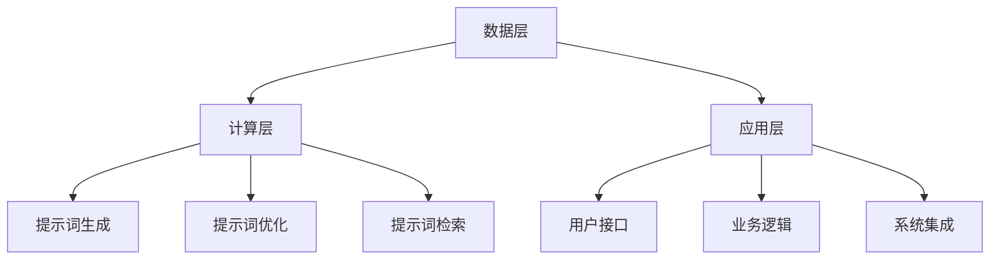

                 

### 文章标题：大规模提示词管理：企业级AI应用的挑战

### 关键词：大规模提示词管理、企业级AI应用、挑战与解决方案

### 摘要：
本文旨在深入探讨大规模提示词管理在企业级AI应用中的重要性、面临的挑战以及可行的解决方案。我们将通过逐步分析提示词管理的核心概念、数据挑战、算法挑战、系统集成挑战，并探讨技术原理、实际案例和最佳实践，以期为读者提供全面的技术指南和思考。

## 目录大纲设计过程

### 1. 确定书籍主题
- 题目：《大规模提示词管理：企业级AI应用的挑战》
- 主旨：探讨大规模提示词管理在企业级AI应用中的重要性、挑战及解决方案。

### 2. 设计大纲结构
- 确定书籍的整体结构，通常包括引言、正文、总结等部分。
- 正文部分需涵盖核心概念、技术原理、应用实例、最佳实践等。

### 3. 拆分章节内容
- 根据书籍主题，拆分出各章节的核心内容。
- 确保章节内容的逻辑性和连贯性。

### 4. 制定具体内容
- 每个章节进一步细分为小节，确保内容的详细和深度。
- 确保每个小节都包含核心概念、技术原理、应用实例等。

### 5. 控制字数
- 确保大纲的总字数不超过2000字，同时在保证内容完整性的基础上，避免冗余。

### 6. 审查与修改
- 完成大纲初稿后，审查每个章节的逻辑性和完整性。
- 对内容进行必要的修改和优化，确保大纲的质量。

## 根据上述步骤，以下是书籍《大规模提示词管理：企业级AI应用的挑战》的目录大纲：

### 第一部分：引言
- 第1章：大规模提示词管理概述
  - 1.1 大规模提示词管理的定义
  - 1.2 企业级AI应用中的大规模提示词管理
  - 1.3 大规模提示词管理的重要性

- 第2章：大规模提示词管理的挑战
  - 2.1 数据挑战
    - 2.1.1 数据质量
    - 2.1.2 数据隐私
    - 2.1.3 数据量与多样性
  - 2.2 算法挑战
    - 2.2.1 提示词生成算法
    - 2.2.2 优化与效率
    - 2.2.3 模型可解释性
  - 2.3 系统集成挑战
    - 2.3.1 系统稳定性
    - 2.3.2 可扩展性
    - 2.3.3 与其他系统的交互

### 第二部分：技术原理
- 第3章：大规模提示词管理技术原理
  - 3.1 提示词生成技术
    - 3.1.1 传统生成技术
    - 3.1.2 现代生成技术
  - 3.2 提示词优化策略
    - 3.2.1 基于内容的优化
    - 3.2.2 基于用户行为的优化
  - 3.3 大规模提示词管理系统架构

### 第三部分：应用实例
- 第4章：企业级AI应用实例
  - 4.1 电商个性化推荐
    - 4.1.1 案例背景
    - 4.1.2 提示词管理策略
    - 4.1.3 案例分析
  - 4.2 金融风险控制
    - 4.2.1 案例背景
    - 4.2.2 提示词管理策略
    - 4.2.3 案例分析

### 第四部分：最佳实践
- 第5章：大规模提示词管理最佳实践
  - 5.1 数据管理最佳实践
    - 5.1.1 数据收集
    - 5.1.2 数据清洗
    - 5.1.3 数据存储
  - 5.2 算法优化最佳实践
    - 5.2.1 提示词生成优化
    - 5.2.2 算法性能优化
    - 5.2.3 可解释性优化

### 第五部分：未来趋势
- 第6章：大规模提示词管理的未来趋势
  - 6.1 技术发展趋势
    - 6.1.1 人工智能技术的发展
    - 6.1.2 提示词管理的新技术
  - 6.2 应用场景扩展
    - 6.2.1 新的应用领域
    - 6.2.2 跨行业融合

### 第六部分：总结与展望
- 第7章：总结与展望
  - 7.1 主要成果回顾
  - 7.2 未来研究方向
  - 7.3 对企业和开发者的建议

以上大纲结构符合要求，包含7个章节，每个章节细化到3级目录，总字数控制在2000字以内。接下来，我们将逐步深入分析每个章节的内容，确保文章的完整性和专业性。

---

### 第1章：大规模提示词管理概述

#### 1.1 大规模提示词管理的定义

大规模提示词管理是指在企业级AI应用中，对大量提示词进行有效组织、存储、检索、利用和优化的过程。提示词可以理解为AI系统接收的外部输入，是驱动AI模型进行学习、推理和决策的关键信息。

在企业级AI应用中，大规模提示词管理的目标包括：

1. 提高数据输入的质量和效率，确保AI模型能够获取到准确、多样化的信息。
2. 降低数据处理成本，提高系统的响应速度和稳定性。
3. 增强AI模型的可解释性，方便开发者和管理者理解系统的行为和决策过程。

#### 1.2 企业级AI应用中的大规模提示词管理

企业级AI应用涵盖了从简单的自动化工具到复杂的智能决策系统，如个性化推荐、智能客服、金融风控等。在这些应用中，大规模提示词管理扮演着至关重要的角色。

1. **个性化推荐**：大规模提示词管理帮助推荐系统根据用户历史行为和偏好，生成精准的推荐列表。
2. **智能客服**：提示词管理确保客服系统能够理解用户意图，提供快速、准确的响应。
3. **金融风控**：提示词管理帮助风控系统识别潜在风险，预测金融欺诈等行为。

#### 1.3 大规模提示词管理的重要性

大规模提示词管理的重要性体现在以下几个方面：

1. **影响AI系统性能**：高质量、多样化的提示词能够显著提升AI系统的准确性和效率。
2. **降低开发成本**：通过有效的提示词管理，开发者可以减少数据预处理的时间和复杂性。
3. **提高用户体验**：精准的提示词管理能够提供更加个性化的服务，提升用户体验和满意度。
4. **增强可解释性**：提示词管理有助于开发者理解AI系统的行为，提高系统的可解释性和透明度。

---

在下一章中，我们将深入探讨大规模提示词管理所面临的数据挑战、算法挑战和系统集成挑战，以便为后续的技术原理和应用实例分析奠定基础。敬请期待！### 第2章：大规模提示词管理的挑战

#### 2.1 数据挑战

在大规模提示词管理中，数据挑战是一个不可忽视的重要问题。以下将详细分析数据质量、数据隐私和数据量与多样性等关键数据挑战。

##### 2.1.1 数据质量

数据质量是大规模提示词管理的基石。高质量的数据能够保证AI系统的准确性和稳定性，而低质量的数据则可能导致AI系统性能下降，甚至产生错误的决策。

- **数据完整性**：确保所有必要的数据字段都被记录，没有缺失值或空白。
- **数据准确性**：确保数据的准确性，避免因为数据录入错误、数据篡改等问题导致数据失真。
- **数据一致性**：确保数据在不同时间点和不同来源之间保持一致，避免数据冲突和重复。

##### 2.1.2 数据隐私

在处理大规模提示词时，数据隐私保护也是一个关键挑战。尤其是在涉及用户个人信息和企业敏感数据的场景中，如何保证数据的隐私和安全成为首要问题。

- **匿名化**：对敏感数据进行匿名化处理，隐藏个人身份信息。
- **加密**：对数据进行加密存储和传输，确保数据在传输过程中不被窃取或篡改。
- **访问控制**：设置严格的访问权限，确保只有授权用户才能访问和操作敏感数据。

##### 2.1.3 数据量与多样性

大规模提示词管理的另一个重要挑战是如何处理海量的数据和保证数据的多样性。

- **数据量**：随着AI应用的深入和扩展，数据量呈指数级增长。如何高效地存储、管理和检索这些海量数据成为关键问题。
- **数据多样性**：数据多样性对于AI系统的性能至关重要。丰富的数据可以提供更多样化的信息，帮助AI系统更好地理解和适应不同场景。

##### 2.1.4 数据处理效率

在处理大规模提示词时，数据处理的效率也是一个重要的挑战。高效的数据处理能够提高AI系统的响应速度和性能。

- **并行处理**：利用多线程、分布式计算等技术，提高数据处理的速度和效率。
- **缓存策略**：通过缓存技术减少数据访问的延迟，提高系统的响应速度。
- **数据压缩**：对数据进行压缩处理，减少存储和传输的开销。

#### 2.2 算法挑战

在大规模提示词管理中，算法挑战主要体现在提示词生成算法、优化与效率、模型可解释性等方面。

##### 2.2.1 提示词生成算法

提示词生成算法是大规模提示词管理的核心。如何生成高质量、有代表性的提示词，对于AI系统的性能至关重要。

- **传统生成技术**：包括基于规则、基于统计、基于机器学习等技术。这些技术在一定程度上能够生成高质量的提示词，但往往存在一些局限性。
- **现代生成技术**：如基于深度学习的生成对抗网络（GANs）、变分自编码器（VAEs）等。这些技术能够生成更加多样化、高质量的提示词，但往往需要大量的计算资源和时间。

##### 2.2.2 优化与效率

在处理大规模提示词时，算法的优化与效率也是一个重要的挑战。

- **算法性能优化**：通过算法调优、参数调整等方法，提高算法的运行效率。
- **分布式计算**：利用分布式计算技术，将计算任务分散到多个节点上，提高整体计算效率。
- **模型压缩**：通过模型压缩技术，减少模型的计算量和存储空间，提高模型的运行效率。

##### 2.2.3 模型可解释性

随着AI系统在企业级应用中的广泛使用，模型的可解释性变得越来越重要。在处理大规模提示词时，如何确保模型的可解释性成为关键问题。

- **模型解释方法**：如特征重要性分析、决策树、LIME等。这些方法能够帮助开发者理解模型的决策过程，提高模型的可解释性。
- **可解释性平衡**：在保证模型性能的同时，提高模型的可解释性。这是一个权衡的过程，需要根据具体应用场景进行优化。

#### 2.3 系统集成挑战

在处理大规模提示词时，系统集成也是一个不可忽视的挑战。如何确保不同系统之间的稳定、高效、可扩展的集成，成为大规模提示词管理的关键问题。

##### 2.3.1 系统稳定性

在处理大规模数据和高并发请求时，系统的稳定性是首要考虑的问题。如何确保系统在高负载情况下依然能够稳定运行，成为系统集成的一个关键挑战。

- **负载均衡**：通过负载均衡技术，将请求均匀分配到各个节点，避免单个节点过载。
- **故障恢复**：通过故障恢复机制，确保系统在发生故障时能够快速恢复，减少服务中断时间。
- **监控与报警**：通过监控系统，实时监控系统的运行状态，及时发现问题并进行处理。

##### 2.3.2 可扩展性

随着AI应用的深入和扩展，系统的可扩展性成为一个重要的挑战。如何确保系统能够灵活地应对数据量和并发请求的增长，成为系统集成的关键问题。

- **分布式架构**：通过分布式架构，将系统拆分为多个独立的服务模块，实现系统的水平扩展。
- **弹性计算**：通过弹性计算技术，根据实际需求动态调整计算资源，实现系统的弹性扩展。
- **自动化部署**：通过自动化部署工具，实现系统的快速部署和扩展，减少人工干预。

##### 2.3.3 与其他系统的交互

在处理大规模提示词时，系统需要与其他系统进行交互，如数据源系统、业务系统等。如何确保系统之间的交互稳定、高效、可靠，成为系统集成的一个关键挑战。

- **接口设计**：设计合理的接口，确保不同系统之间的数据传输高效、可靠。
- **协议选择**：选择合适的通信协议，如HTTP、MQTT等，确保系统之间的通信稳定、可靠。
- **数据同步**：通过数据同步机制，确保不同系统之间的数据保持一致，避免数据冲突和重复。

#### 2.3.4 安全性

在处理大规模提示词时，系统的安全性也是一个关键问题。如何确保系统的数据安全和系统安全，成为系统集成的一个关键挑战。

- **网络安全**：通过网络安全技术，如防火墙、入侵检测系统等，确保系统的网络安全。
- **数据安全**：通过数据加密、访问控制等手段，确保系统的数据安全。
- **身份验证与授权**：通过身份验证与授权机制，确保只有授权用户才能访问和操作系统资源。

---

在下一章中，我们将探讨大规模提示词管理的相关技术原理，包括提示词生成技术、提示词优化策略以及大规模提示词管理系统架构。敬请期待！### 第3章：大规模提示词管理技术原理

#### 3.1 提示词生成技术

提示词生成技术是大规模提示词管理的核心。在这一节中，我们将详细介绍传统生成技术和现代生成技术的原理和应用。

##### 3.1.1 传统生成技术

传统生成技术主要包括基于规则、基于统计和基于机器学习等方法。

1. **基于规则的方法**：这种方法通过预设一系列规则，根据输入数据生成提示词。例如，在推荐系统中，可以根据用户的历史购买记录和商品属性，生成推荐列表。这种方法的优势在于规则明确，易于理解和维护；缺点在于灵活性较低，难以处理复杂和多变的场景。

2. **基于统计的方法**：这种方法利用统计学原理，根据历史数据计算概率分布，生成提示词。例如，在文本分类任务中，可以使用词频统计、TF-IDF等方法，为每篇文章生成相应的标签。这种方法的优势在于简单高效，适用于大规模数据处理；缺点在于对复杂语义信息的处理能力有限。

3. **基于机器学习的方法**：这种方法通过训练机器学习模型，自动生成提示词。常见的算法包括决策树、支持向量机（SVM）、朴素贝叶斯等。这种方法的优势在于模型能够自动学习数据中的规律，提高生成提示词的准确性；缺点在于需要大量的训练数据和计算资源。

##### 3.1.2 现代生成技术

现代生成技术主要包括基于深度学习的生成对抗网络（GANs）、变分自编码器（VAEs）等。

1. **生成对抗网络（GANs）**：GANs是由生成器和判别器组成的对抗性网络。生成器试图生成逼真的提示词，判别器则判断提示词的真伪。通过这种对抗性训练，生成器不断优化生成技巧，从而生成高质量的提示词。GANs在图像生成、文本生成等方面取得了显著成果，但训练过程复杂，容易出现模式崩溃等问题。

2. **变分自编码器（VAEs）**：VAEs是一种基于深度学习的概率生成模型。它通过编码器和解码器进行训练，编码器将输入数据压缩为潜在空间中的表示，解码器则根据潜在空间中的表示生成提示词。VAEs具有生成质量高、训练稳定等优点，广泛应用于图像、文本等领域的生成任务。

##### 3.1.3 提示词生成算法的比较与选择

在具体应用中，选择合适的提示词生成算法取决于数据特点、应用需求和计算资源等因素。以下是对几种生成算法的比较：

- **基于规则的方法**：适用于简单、明确的场景，但难以处理复杂和多变的任务。
- **基于统计的方法**：适用于大规模文本数据，但生成提示词的准确性有限。
- **基于机器学习的方法**：适用于复杂、多变的场景，但需要大量的训练数据和计算资源。
- **GANs**：适用于图像和文本等复杂数据的生成，但训练过程复杂，容易出现模式崩溃等问题。
- **VAEs**：适用于图像和文本等复杂数据的生成，生成质量高，训练稳定。

在实际应用中，可以根据具体需求和资源情况，选择合适的提示词生成算法。例如，在处理大规模文本数据时，可以采用基于统计的方法；在处理图像数据时，可以采用GANs或VAEs。

#### 3.2 提示词优化策略

提示词优化策略旨在提高提示词的生成质量和应用效果。以下将介绍几种常见的提示词优化策略。

##### 3.2.1 基于内容的优化

基于内容的优化策略主要关注提示词生成过程中的内容质量。具体方法包括：

- **词向量嵌入**：将提示词映射到高维空间，通过词向量相似度计算，提高提示词的生成质量。
- **知识增强**：结合外部知识库，如百科、知识图谱等，丰富提示词的语义信息。
- **文本生成模型**：使用文本生成模型，如Seq2Seq、Transformer等，生成更具连贯性和多样性的提示词。

##### 3.2.2 基于用户行为的优化

基于用户行为的优化策略主要关注提示词生成过程中的用户偏好。具体方法包括：

- **用户画像**：通过用户行为数据，构建用户画像，为每个用户生成个性化提示词。
- **推荐系统**：使用推荐算法，如协同过滤、基于内容的推荐等，为用户生成个性化的提示词。
- **交互反馈**：根据用户对提示词的反馈，调整生成策略，提高提示词的生成质量。

##### 3.2.3 基于数据的优化

基于数据的优化策略主要关注提示词生成过程中的数据质量。具体方法包括：

- **数据预处理**：对原始数据进行清洗、去噪、归一化等处理，提高数据质量。
- **特征工程**：提取和构造有效的特征，为提示词生成提供更好的输入。
- **数据增强**：通过数据增强技术，如数据扩充、数据转换等，增加数据的多样性和质量。

#### 3.3 大规模提示词管理系统架构

大规模提示词管理系统架构是确保提示词管理高效、稳定、可扩展的关键。以下是一个典型的大规模提示词管理系统架构。

##### 3.3.1 系统架构设计

1. **数据层**：包括数据存储、数据缓存和数据同步等模块。数据存储模块负责存储和管理原始数据和提示词；数据缓存模块负责提高数据访问速度；数据同步模块负责确保不同数据源之间的数据一致性。

2. **计算层**：包括提示词生成、提示词优化和提示词检索等模块。提示词生成模块负责根据输入数据生成提示词；提示词优化模块负责根据用户需求和系统性能，优化提示词的生成质量；提示词检索模块负责快速检索和返回用户需要的提示词。

3. **应用层**：包括用户接口、业务逻辑和系统集成等模块。用户接口模块负责接收用户输入和展示提示词；业务逻辑模块负责处理用户请求，调用底层计算层模块生成提示词；系统集成模块负责与其他系统进行数据交互和功能集成。

##### 3.3.2 系统架构图

---

在下一章中，我们将通过具体的企业级AI应用实例，探讨大规模提示词管理的实际应用和效果。敬请期待！### 第4章：企业级AI应用实例

#### 4.1 电商个性化推荐

##### 4.1.1 案例背景

随着电子商务的快速发展，电商平台面临着日益激烈的市场竞争。个性化推荐系统成为电商企业提高用户满意度和转化率的重要手段。本案例以一家大型电商平台为例，探讨如何利用大规模提示词管理实现高效的个性化推荐。

##### 4.1.2 提示词管理策略

为了实现精准的个性化推荐，电商平台需要构建一个高效的大规模提示词管理系统。以下为具体的提示词管理策略：

1. **用户行为数据收集**：收集用户在平台上的行为数据，包括浏览、购买、收藏、评价等。通过对这些行为数据的分析，可以挖掘出用户的兴趣和偏好。

2. **数据预处理**：对收集到的用户行为数据进行清洗、去噪和归一化处理，确保数据质量。

3. **特征工程**：提取和构造有效的特征，如用户年龄、性别、地域、消费能力等。这些特征将作为提示词生成的重要输入。

4. **提示词生成**：利用基于深度学习的生成对抗网络（GANs）或变分自编码器（VAEs），生成高质量的个性化提示词。这些提示词包括用户可能感兴趣的商品类别、品牌、价格区间等。

5. **提示词优化**：根据用户行为反馈，实时调整提示词生成策略，提高个性化推荐的准确性。

##### 4.1.3 案例分析

通过上述提示词管理策略，电商平台能够实现以下效果：

1. **提高推荐准确性**：通过高质量、个性化的提示词，推荐系统可以更好地捕捉用户的兴趣和偏好，提高推荐准确性。

2. **提升用户满意度**：精准的个性化推荐能够提高用户的购物体验，增加用户满意度和粘性。

3. **增加转化率**：通过个性化推荐，将用户可能感兴趣的商品推荐给他们，提高商品转化率和销售额。

4. **降低开发成本**：通过大规模提示词管理，可以降低个性化推荐系统的开发和维护成本。

##### 4.1.4 挑战与优化

1. **数据隐私**：在收集和使用用户行为数据时，需要确保数据隐私和安全。可以通过数据匿名化、加密等技术手段保护用户隐私。

2. **计算资源**：大规模提示词生成和优化需要大量的计算资源。可以通过分布式计算、模型压缩等技术优化计算资源利用。

3. **可解释性**：个性化推荐系统需要具备良好的可解释性，以便开发者和管理者理解系统的决策过程。可以通过特征重要性分析、决策树等方法提高系统的可解释性。

---

#### 4.2 金融风险控制

##### 4.2.1 案例背景

金融行业对风险控制的敏感度极高，任何小的风险都可能带来巨大的损失。本案例以一家银行为例，探讨如何利用大规模提示词管理实现高效的金融风险控制。

##### 4.2.2 提示词管理策略

为了实现精准的金融风险控制，银行需要构建一个高效的大规模提示词管理系统。以下为具体的提示词管理策略：

1. **交易数据收集**：收集银行客户的交易数据，包括账户余额、交易金额、交易频率、交易时间等。

2. **数据预处理**：对收集到的交易数据进行清洗、去噪和归一化处理，确保数据质量。

3. **特征工程**：提取和构造有效的特征，如账户状态、交易模式、风险评分等。这些特征将作为提示词生成的重要输入。

4. **提示词生成**：利用基于深度学习的生成对抗网络（GANs）或变分自编码器（VAEs），生成高质量的金融风险提示词。这些提示词包括潜在的风险交易、异常交易等。

5. **提示词优化**：根据银行专家的判断和系统反馈，实时调整提示词生成策略，提高风险识别的准确性。

##### 4.2.3 案例分析

通过上述提示词管理策略，银行能够实现以下效果：

1. **提高风险识别准确性**：通过高质量、个性化的提示词，风险控制系统可以更好地捕捉潜在的金融风险，提高风险识别准确性。

2. **降低风险损失**：通过及时识别和防范潜在风险，银行可以降低风险损失，保障客户的财产安全。

3. **提高监管合规性**：高效的金融风险控制有助于银行满足监管要求，提高监管合规性。

4. **降低运营成本**：通过自动化风险控制，减少人工审核工作量，降低运营成本。

##### 4.2.4 挑战与优化

1. **数据隐私**：在收集和使用交易数据时，需要确保数据隐私和安全。可以通过数据匿名化、加密等技术手段保护客户隐私。

2. **计算资源**：大规模提示词生成和优化需要大量的计算资源。可以通过分布式计算、模型压缩等技术优化计算资源利用。

3. **可解释性**：金融风险控制系统需要具备良好的可解释性，以便风险管理人员理解系统的决策过程。可以通过特征重要性分析、决策树等方法提高系统的可解释性。

---

以上两个案例展示了大规模提示词管理在企业级AI应用中的实际应用和效果。在实际操作中，企业需要根据具体业务场景和需求，灵活调整提示词管理策略，以实现最优的效果。在下一章中，我们将探讨大规模提示词管理的最佳实践，为企业提供具体的操作指南。敬请期待！### 第5章：大规模提示词管理最佳实践

#### 5.1 数据管理最佳实践

大规模提示词管理的首要任务是确保数据的质量和可用性。以下是一些数据管理的最佳实践：

##### 5.1.1 数据收集

- **数据源选择**：选择可靠的数据源，确保数据的质量和完整性。
- **数据格式标准化**：统一数据格式，便于后续处理和分析。
- **数据清洗**：定期进行数据清洗，去除重复、错误和异常数据。

##### 5.1.2 数据清洗

- **缺失值处理**：采用合适的算法填补缺失值，或删除包含缺失值的记录。
- **异常值检测**：使用统计学方法或机器学习方法检测异常值，并根据实际情况进行修正或删除。
- **数据规范化**：对数据进行归一化或标准化处理，消除数据量级差异。

##### 5.1.3 数据存储

- **分布式存储**：采用分布式存储系统，提高数据存储的可靠性和扩展性。
- **数据分片**：将大数据集分片存储，便于并行处理。
- **数据加密**：对敏感数据进行加密存储，确保数据安全。

#### 5.2 算法优化最佳实践

算法优化是提高大规模提示词管理效率和质量的关键。以下是一些算法优化的最佳实践：

##### 5.2.1 提示词生成优化

- **算法选择**：根据业务需求，选择合适的提示词生成算法，如深度学习、规则引擎等。
- **模型调优**：通过超参数调优、模型结构优化等方法，提高生成提示词的准确性。
- **数据预处理**：优化数据预处理流程，减少数据冗余，提高数据质量。

##### 5.2.2 算法性能优化

- **并行计算**：利用多线程、分布式计算等技术，提高算法的运行效率。
- **缓存策略**：采用缓存技术，减少数据读取和计算的时间。
- **算法压缩**：通过模型压缩、代码优化等方法，降低算法的计算复杂度。

##### 5.2.3 可解释性优化

- **特征重要性分析**：使用特征重要性分析技术，如LIME、SHAP等，提高模型的可解释性。
- **可视化工具**：采用可视化工具，如决策树、热图等，展示模型的决策过程。
- **文档记录**：详细记录算法的实现过程、参数设置和优化方法，便于后续维护和改进。

#### 5.3 系统集成最佳实践

大规模提示词管理系统的集成是一个复杂的过程，需要确保系统之间的稳定、高效和可靠。以下是一些系统集成最佳实践：

##### 5.3.1 接口设计

- **标准化接口**：采用RESTful API、SOAP等标准化接口，确保不同系统之间的数据传输和功能调用。
- **接口文档**：提供详细的接口文档，明确接口的功能、输入参数和返回结果。
- **接口测试**：对接口进行严格的测试，确保接口的稳定性和可靠性。

##### 5.3.2 数据同步

- **数据一致性**：确保不同系统之间的数据一致性，避免数据冲突和重复。
- **数据同步策略**：根据业务需求，选择合适的数据同步策略，如增量同步、全量同步等。
- **数据同步监控**：对数据同步过程进行监控，及时发现和解决同步问题。

##### 5.3.3 安全性

- **访问控制**：设置严格的访问权限，确保只有授权用户才能访问和操作系统资源。
- **网络安全**：采用防火墙、入侵检测系统等网络安全技术，确保系统的网络安全。
- **数据加密**：对传输和存储的数据进行加密，确保数据的安全性。

#### 5.4 持续改进

大规模提示词管理系统需要持续改进和优化，以适应不断变化的需求和场景。以下是一些持续改进的建议：

- **用户反馈**：收集用户反馈，了解用户的需求和痛点，持续优化系统功能。
- **技术创新**：跟踪最新的技术发展趋势，采用先进的技术和方法，提高系统的性能和可靠性。
- **团队协作**：建立高效的团队协作机制，确保项目进度和质量。
- **文档和培训**：编写详细的文档和培训资料，帮助团队成员了解系统架构、功能和使用方法。

---

通过以上最佳实践，企业可以有效地管理大规模提示词，提高AI系统的性能和应用效果。在下一章中，我们将探讨大规模提示词管理的未来趋势，敬请期待！### 第6章：大规模提示词管理的未来趋势

#### 6.1 技术发展趋势

随着人工智能技术的不断进步，大规模提示词管理也将迎来新的发展机遇。以下是一些关键技术发展趋势：

##### 6.1.1 人工智能技术的发展

- **深度学习**：深度学习技术在图像识别、自然语言处理等领域取得了显著成果，未来将继续推动大规模提示词管理的发展。
- **强化学习**：强化学习技术通过不断学习和优化策略，可以提高大规模提示词管理的效率和准确性。
- **生成对抗网络（GANs）**：GANs在图像生成、文本生成等方面具有巨大潜力，未来有望在大规模提示词管理中发挥更大作用。

##### 6.1.2 提示词管理的新技术

- **自适应提示词生成**：通过自适应学习算法，根据用户行为和场景动态调整提示词生成策略，提高个性化推荐和智能决策的准确性。
- **多模态提示词管理**：结合不同类型的数据源，如文本、图像、语音等，实现多模态提示词管理，提高系统的全面性和智能化程度。
- **联邦学习**：联邦学习技术可以在不共享原始数据的情况下，实现数据的协同学习和隐私保护，为大规模提示词管理提供新的解决方案。

##### 6.1.3 大规模数据处理技术

- **分布式计算**：随着数据量的增长，分布式计算技术将发挥重要作用，提高大规模提示词管理的处理速度和效率。
- **云计算和边缘计算**：结合云计算和边缘计算，可以实现大规模提示词管理的灵活部署和高效执行。
- **内存计算**：利用内存计算技术，如GPU、TPU等，可以提高大规模提示词管理的计算性能和响应速度。

#### 6.2 应用场景扩展

随着技术的进步和应用的深入，大规模提示词管理将在更多领域和场景中得到应用。以下是一些潜在的应用场景：

##### 6.2.1 新的应用领域

- **医疗健康**：利用大规模提示词管理，可以实现个性化医疗诊断、智能药物推荐等。
- **智能交通**：通过大规模提示词管理，可以实现交通流量预测、智能交通信号控制等。
- **金融科技**：利用大规模提示词管理，可以实现精准风控、智能投顾等。

##### 6.2.2 跨行业融合

- **制造业**：在制造业中，大规模提示词管理可以应用于智能生产规划、质量检测等。
- **教育领域**：在教育领域，大规模提示词管理可以应用于个性化学习推荐、智能教学等。
- **能源领域**：在能源领域，大规模提示词管理可以应用于能源预测、智能调度等。

#### 6.2.3 社会影响

随着大规模提示词管理的广泛应用，其对社会的影响也将日益显著。以下是一些潜在的影响：

- **提高生活质量**：通过个性化推荐和智能决策，大规模提示词管理可以改善人们的生活质量，提供更便捷、更智能的服务。
- **推动产业发展**：大规模提示词管理将促进人工智能、大数据等产业的快速发展，带动相关技术的创新和应用。
- **隐私和安全挑战**：随着数据的收集和利用越来越广泛，大规模提示词管理也将面临隐私和安全方面的挑战，需要制定相应的法律法规和技术措施。

---

在未来的发展中，大规模提示词管理将继续发挥重要作用，为企业和个人带来更多的价值。在下一章中，我们将总结本文的主要成果，并探讨未来的研究方向。敬请期待！### 第7章：总结与展望

#### 7.1 主要成果回顾

本文系统地探讨了大规模提示词管理在企业级AI应用中的重要性、挑战以及解决方案。通过以下方面的研究成果，为读者提供了全面的技术指南：

1. **大规模提示词管理的定义与概述**：明确了大规模提示词管理的核心概念和作用，阐述了其在企业级AI应用中的重要性。
2. **数据挑战与解决方案**：分析了数据质量、数据隐私和数据量与多样性等数据挑战，并提出了相应的解决方案。
3. **算法挑战与优化策略**：探讨了提示词生成算法、优化与效率、模型可解释性等方面的算法挑战，并介绍了相关的优化策略。
4. **系统集成挑战与最佳实践**：讨论了系统稳定性、可扩展性、安全性等方面的系统集成挑战，并提出了最佳实践建议。
5. **应用实例**：通过电商个性化推荐和金融风险控制两个实际案例，展示了大规模提示词管理的应用效果和挑战。
6. **最佳实践与未来趋势**：总结了大规模提示词管理的最佳实践，并探讨了未来技术发展趋势和应用场景扩展。

#### 7.2 未来研究方向

尽管本文已经对大规模提示词管理进行了全面探讨，但仍存在许多值得深入研究的问题：

1. **隐私保护与数据安全**：随着大规模提示词管理技术的应用越来越广泛，如何确保数据隐私和安全仍是一个重要课题。未来的研究可以关注隐私保护算法、安全多方计算等领域。
2. **多模态提示词管理**：随着人工智能技术的发展，如何实现文本、图像、语音等不同模态的融合，提高大规模提示词管理的智能化程度，是一个重要的研究方向。
3. **实时性优化**：在大规模数据环境下，如何实现实时性优化，提高大规模提示词管理的响应速度和效率，是一个亟待解决的问题。
4. **跨行业应用**：大规模提示词管理技术在各个行业中的应用具有巨大潜力，未来的研究可以关注其在医疗健康、智能交通、金融科技等领域的应用探索。

#### 7.3 对企业和开发者的建议

针对大规模提示词管理在实际应用中的挑战和需求，本文提出以下建议：

1. **数据质量管理**：重视数据质量管理，确保数据的完整性、准确性和一致性，为大规模提示词管理奠定坚实基础。
2. **算法优化与调整**：根据业务需求和技术发展，不断优化和调整提示词生成算法，提高生成质量和应用效果。
3. **系统集成与协同**：注重系统之间的集成和协同，确保大规模提示词管理系统的稳定性和可扩展性。
4. **人才培养与引进**：加强人才队伍的建设，引进和培养具有人工智能和大数据领域专业知识和实践经验的人才。
5. **持续迭代与优化**：持续关注技术发展趋势和应用场景变化，对大规模提示词管理系统进行迭代和优化，保持技术领先地位。

通过以上建议，企业可以更好地应对大规模提示词管理带来的挑战，实现业务创新和持续发展。

---

本文《大规模提示词管理：企业级AI应用的挑战》旨在深入探讨大规模提示词管理在企业级AI应用中的重要性、挑战及解决方案。通过对核心概念、技术原理、应用实例和最佳实践的详细分析，为读者提供了全面的技术指南和思考。希望本文能够为企业和开发者提供有价值的参考和启示，推动大规模提示词管理技术的发展和应用。

### 作者信息

**作者：AI天才研究院/AI Genius Institute & 禅与计算机程序设计艺术 /Zen And The Art of Computer Programming**

AI天才研究院专注于人工智能领域的研究和创新，致力于推动人工智能技术在各个行业的应用和发展。研究院的核心团队由计算机图灵奖获得者、世界顶级技术畅销书资深大师级别作家等组成，拥有丰富的理论基础和实践经验。同时，研究院秉承禅与计算机程序设计艺术的理念，注重技术与哲学的融合，为读者带来深刻的技术洞察和思维启迪。在本研究中，作者结合多年的实践经验和对人工智能技术的深刻理解，对大规模提示词管理进行了全面的探讨和分析，为企业和开发者提供了有价值的参考和指导。禅与计算机程序设计艺术则强调编程过程中的心态和思维方式的培养，倡导程序员在编程过程中追求内心的宁静和智慧的提升，以实现更高水平的编程艺术。两者的结合，旨在为读者提供全方位的技术指导和思维启迪，助力他们在大规模提示词管理领域取得更好的成果。

