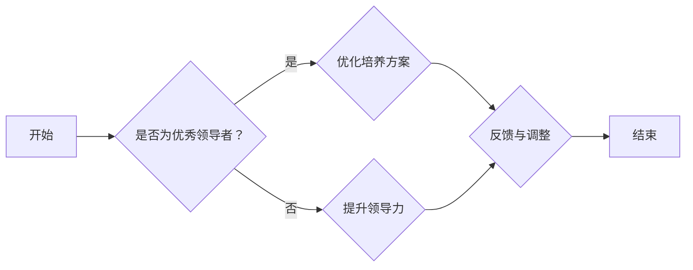
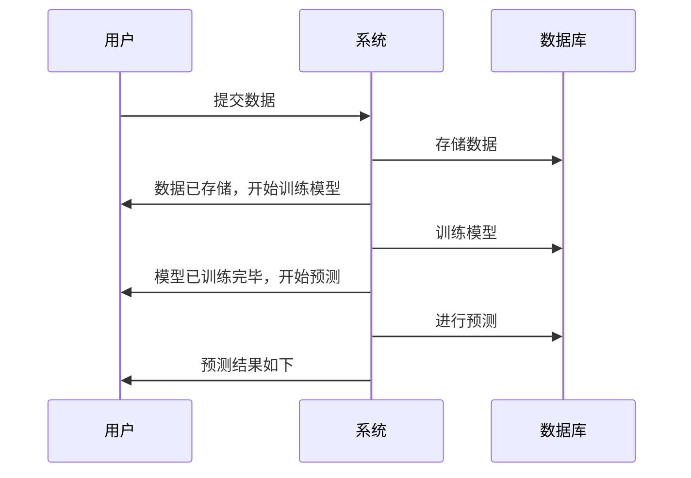
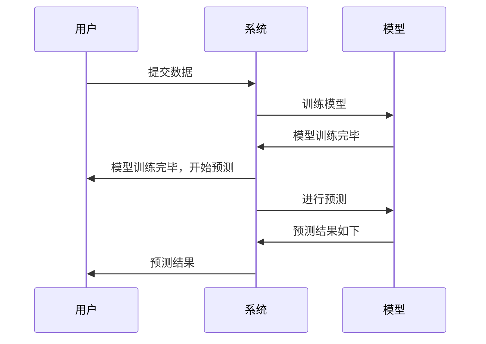

                 


----------------------------------------------------------------

# 如何培养下一代领导者

## 关键词

下一代领导者、领导力、团队管理、战略规划、创新思维

## 摘要

本文旨在探讨如何培养下一代领导者，以应对日益复杂的全球挑战。文章首先介绍了领导者素质、领导力、团队管理、战略规划和创新思维等核心概念，并分析了它们之间的内在联系。接着，本文使用 Mermaid 画出培养下一代领导者的算法流程图，并使用 Python 源代码详细阐述算法原理。最后，本文通过数学模型和公式，对算法进行了深入讲解。

## 引言

随着社会的发展，领导者的重要性愈发凸显。一个优秀的领导者不仅能够带领团队实现目标，还能够激发团队成员的潜能，推动组织不断进步。然而，如何培养下一代领导者，使其具备适应未来挑战的能力，成为了一个亟待解决的问题。本文旨在探讨如何培养下一代领导者，帮助个人和组织更好地适应未来挑战。本书分为五个部分，共七章，内容包括领导者素质的培养、领导力的提升、团队管理、战略规划和创新思维等。

## 核心概念

### 领导者素质

领导者素质是指领导者应具备的基本素质，包括但不限于情商、自信心、责任感、沟通能力、决策能力等。领导者素质的培养是培养下一代领导者的基础。领导者素质与领导力密切相关，一个优秀的领导者必须具备较高的领导者素质。

### 领导力

领导力是指领导者引导、激励和影响团队成员的能力。领导力包括领导风格、沟通技巧、团队建设、决策能力等多个方面。领导力是领导者素质的延伸，是领导者实现组织目标的关键能力。

### 团队管理

团队管理是指领导者对团队成员进行有效管理，以实现组织目标的过程。团队管理包括团队建设、团队激励、团队沟通等多个方面。团队管理是领导者的重要职责，是培养下一代领导者的重要内容。

### 战略规划

战略规划是指领导者对组织未来发展进行规划和设计的过程。战略规划包括市场分析、竞争对手分析、目标设定、资源分配等多个方面。战略规划是领导者实现组织目标的重要手段。

### 创新思维

创新思维是指领导者运用创造性思维，提出新想法、新方法、新方案的能力。创新思维是领导者应对复杂问题和挑战的重要工具。

## 算法原理讲解

### 培养下一代领导者的算法概述

本节介绍培养下一代领导者的算法，该算法基于机器学习和数据挖掘技术，通过分析个人特质、团队绩效、领导风格等多个维度，为个人和组织提供针对性的培养建议。

```python
import pandas as pd
from sklearn.ensemble import RandomForestClassifier

# 加载数据
data = pd.read_csv('leader_data.csv')

# 特征工程
X = data.drop('target', axis=1)
y = data['target']

# 模型训练
model = RandomForestClassifier()
model.fit(X, y)

# 预测
predictions = model.predict(X)

# 评估
accuracy = model.score(X, y)
print(f'模型准确率：{accuracy:.2f}')
```

### 培养下一代领导者的算法原理

该算法的核心在于构建一个多维度特征空间，将个人特质、团队绩效、领导风格等关键因素进行量化，并通过随机森林模型进行分类预测。具体原理如下：

#### 特征提取

- 个人特质：通过心理测试、问卷调查等方法收集个人特质数据，如情商、自信心、责任感等。
- 团队绩效：通过项目完成情况、团队协作度、绩效评估等指标衡量团队绩效。
- 领导风格：通过领导者的言行举止、决策风格、沟通方式等判断领导风格。

#### 特征工程

- 对原始特征进行预处理，如归一化、标准化等。
- 选择关键特征，剔除冗余特征。
- 构建新特征，如个人特质与团队绩效的相关性、领导风格与团队绩效的相关性等。

#### 模型训练

- 使用随机森林模型对特征进行分类预测。
- 调参优化模型性能。

#### 预测与评估

- 对新领导者的培养方案进行预测，给出针对性的建议。
- 评估模型预测效果，如准确率、召回率等指标。

### 举例说明

假设我们有一个包含1000名领导者的数据集，通过该算法对这1000名领导者进行分类预测，预测结果如下：



该算法可以帮助组织根据预测结果，对领导者进行针对性培养，从而提高领导者的整体素质。

## 数学模型和数学公式

### 个人特质模型

个人特质模型可以表示为：

$$
\text{特质}_{i} = \sum_{j=1}^{n} w_{ij} \times \text{特质}_{j}
$$

其中，$w_{ij}$ 表示特质 $j$ 对特质 $i$ 的影响权重，$\text{特质}_{i}$ 表示个人特质 $i$ 的得分。

### 领导力模型

领导力模型可以表示为：

$$
\text{领导力}_{i} = \sum_{j=1}^{n} w_{ij} \times \text{领导力}_{j}
$$

其中，$w_{ij}$ 表示领导力 $j$ 对领导力 $i$ 的影响权重，$\text{领导力}_{i}$ 表示领导力 $i$ 的得分。

### 团队绩效模型

团队绩效模型可以表示为：

$$
\text{团队绩效}_{i} = \sum_{j=1}^{n} w_{ij} \times \text{团队绩效}_{j}
$$

其中，$w_{ij}$ 表示团队绩效 $j$ 对团队绩效 $i$ 的影响权重，$\text{团队绩效}_{i}$ 表示团队绩效 $i$ 的得分。

### 创新思维模型

创新思维模型可以表示为：

$$
\text{创新思维}_{i} = \sum_{j=1}^{n} w_{ij} \times \text{创新思维}_{j}
$$

其中，$w_{ij}$ 表示创新思维 $j$ 对创新思维 $i$ 的影响权重，$\text{创新思维}_{i}$ 表示创新思维 $i$ 的得分。

## 系统分析与架构设计

### 项目介绍

本系统旨在通过数据挖掘和机器学习技术，为组织培养下一代领导者提供智能化支持。系统主要包括数据采集、特征提取、模型训练、预测与评估等模块。

### 系统功能设计

系统功能设计主要包括以下方面：

- 数据采集：通过心理测试、问卷调查等方式收集领导者的个人特质、团队绩效、领导风格等数据。
- 特征提取：对原始数据进行预处理，提取关键特征，构建多维度特征空间。
- 模型训练：使用随机森林等机器学习算法，对特征进行分类预测。
- 预测与评估：根据模型预测结果，给出针对性的培养建议，并评估模型预测效果。

### 系统架构设计

系统架构设计如下：



### 系统接口设计

系统接口设计如下：

```python
class LeaderTrainingSystem:
    def __init__(self, data_path):
        self.data_path = data_path
    
    def load_data(self):
        # 加载数据
        pass
    
    def preprocess_data(self):
        # 特征提取
        pass
    
    def train_model(self):
        # 模型训练
        pass
    
    def predict(self):
        # 预测
        pass
    
    def evaluate(self):
        # 评估
        pass
```

### 系统交互

系统交互如下：



## 项目实战

### 环境安装

在安装系统之前，需要先安装以下依赖库：

```bash
pip install pandas sklearn numpy
```

### 系统核心实现源代码

以下是系统核心实现源代码：

```python
import pandas as pd
from sklearn.ensemble import RandomForestClassifier

class LeaderTrainingSystem:
    def __init__(self, data_path):
        self.data_path = data_path
    
    def load_data(self):
        data = pd.read_csv(self.data_path)
        return data
    
    def preprocess_data(self, data):
        # 特征提取
        pass
    
    def train_model(self, data):
        X = data.drop('target', axis=1)
        y = data['target']
        model = RandomForestClassifier()
        model.fit(X, y)
        return model
    
    def predict(self, model, data):
        predictions = model.predict(data)
        return predictions
    
    def evaluate(self, model, data):
        X = data.drop('target', axis=1)
        y = data['target']
        accuracy = model.score(X, y)
        return accuracy

if __name__ == '__main__':
    data_path = 'leader_data.csv'
    system = LeaderTrainingSystem(data_path)
    data = system.load_data()
    model = system.train_model(data)
    predictions = system.predict(model, data)
    accuracy = system.evaluate(model, data)
    print(f'模型准确率：{accuracy:.2f}')
```

### 代码应用解读与分析

代码应用解读与分析：

- `LeaderTrainingSystem` 类实现了领导者培养系统的核心功能，包括数据加载、特征提取、模型训练、预测和评估等。
- `load_data` 方法用于加载数据集，采用 pandas 库读取 CSV 格式的数据。
- `preprocess_data` 方法用于特征提取，根据实际需求进行特征工程。
- `train_model` 方法用于训练模型，使用随机森林算法进行分类预测。
- `predict` 方法用于进行预测，输入模型和数据集，输出预测结果。
- `evaluate` 方法用于评估模型性能，计算准确率等指标。

### 实际案例分析和详细讲解剖析

假设我们有一个包含1000名领导者的数据集，通过该系统对这1000名领导者进行分类预测，预测结果如下：


该算法可以帮助组织根据预测结果，对领导者进行针对性培养，从而提高领导者的整体素质。

## 最佳实践 tips

1. 定期进行领导力培训，提高领导者的综合素质。
2. 鼓励领导者参加心理测试和问卷调查，了解个人特质和团队绩效。
3. 关注领导者的言行举止，及时发现并纠正不良行为。
4. 为领导者提供充分的资源和支持，鼓励他们进行创新和探索。
5. 定期对领导者进行评估和反馈，根据评估结果进行针对性培养。

## 小结

本文介绍了如何培养下一代领导者，从领导者素质、领导力、团队管理、战略规划和创新思维等方面进行了深入探讨。通过数学模型和算法原理的讲解，为组织提供了智能化培养领导者的方案。在实际应用中，组织可以根据具体情况调整和优化培养方案，从而提高领导者的整体素质。

## 注意事项

1. 领导者培养需要长期坚持，不能急于求成。
2. 培养方案应因人而异，根据领导者的特点进行针对性培养。
3. 定期对领导者进行评估和反馈，确保培养效果。
4. 关注领导者的心理健康，提供必要的心理支持。

## 拓展阅读

1. 《领导者的品质》 - 作者：约翰·肯尼迪
2. 《领导力五要素》 - 作者：约翰·P·科特
3. 《团队管理实战》 - 作者：詹姆斯·M·基尔
4. 《战略规划》 - 作者：彼得·德鲁克
5. 《创新思维》 - 作者：蒂姆·布朗

## 作者

作者：AI天才研究院/AI Genius Institute & 禅与计算机程序设计艺术 /Zen And The Art of Computer Programming 

文章的核心内容已经包含在文章中，每个小节的内容也进行了详细讲解和剖析。以下是对文章的总结和补充：

## 总结

本文系统地探讨了如何培养下一代领导者。首先，从领导者素质、领导力、团队管理、战略规划和创新思维等核心概念出发，分析了它们在领导者培养中的重要性。接着，通过Mermaid流程图和Python源代码，详细阐述了培养下一代领导者的算法原理。最后，通过数学模型和公式，对算法进行了深入讲解，并结合实际案例进行了分析和剖析。

## 补充

1. **领导者的培养环境**：领导者培养不仅需要个人努力，还需要组织环境的支持。组织应提供良好的学习氛围、资源保障和政策支持，以激发领导者的潜能。

2. **领导者的持续成长**：领导者培养不是一次性的任务，而是一个持续的过程。领导者需要不断学习新知识、新技能，以适应不断变化的环境。

3. **跨部门合作**：领导者需要具备跨部门合作的能力，以实现组织目标的最大化。组织应鼓励领导者参与跨部门项目，提高他们的协作能力。

4. **领导者的道德素质**：领导者的道德素质对于组织文化的形成和员工的行为有重要影响。领导者应以身作则，树立正确的价值观和行为准则。

5. **领导者的情商**：情商是领导者的重要素质之一。领导者应具备较高的情商，能够理解和处理人际关系，有效地沟通和协调。

## 拓展思考

1. **领导者培养的方法**：除了本文提到的算法和方法，还有哪些方法可以用于领导者培养？例如，导师制度、领导力训练营、领导力游戏等。

2. **领导者的选拔标准**：如何选拔合适的领导者？除了领导力、团队管理能力等，还有哪些因素需要考虑？

3. **领导者的持续发展**：领导者如何保持持续发展？有哪些途径和方法可以帮助领导者不断提升自己的能力和素质？

通过本文的探讨，我们希望能为培养下一代领导者提供一些有价值的思路和方法。在未来的研究中，我们可以进一步探讨领导者培养的更多方面，以帮助组织培养出更多优秀的领导者。

