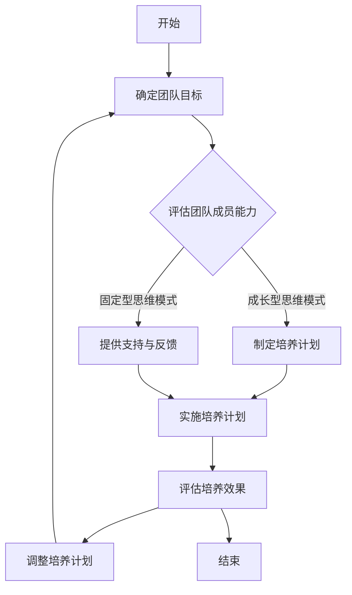
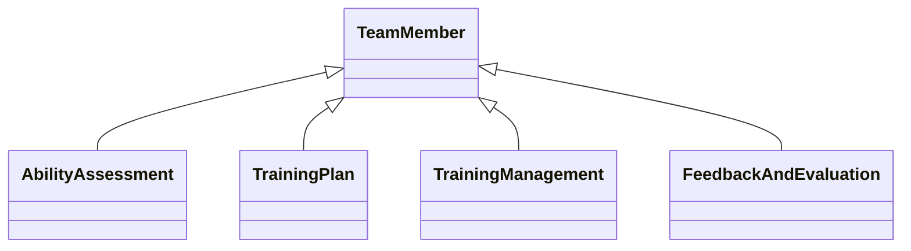
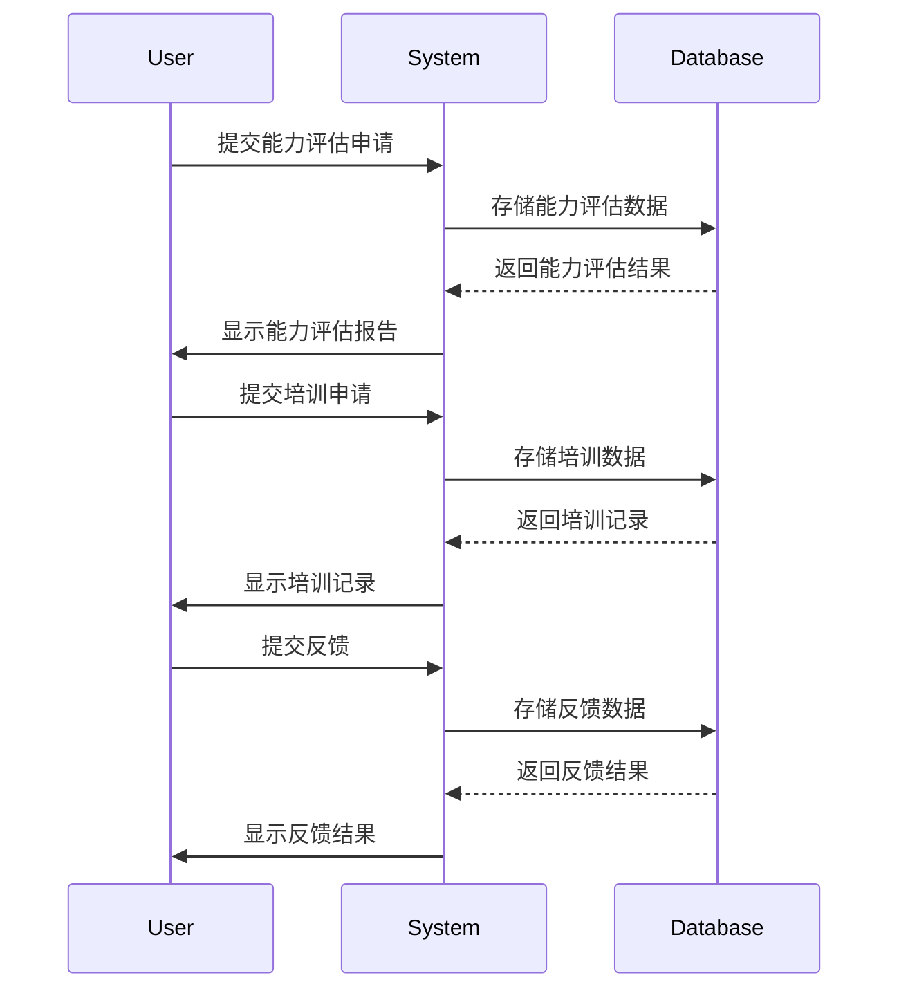

                 

**引言**

在当今快速发展的信息技术时代，一个高效、协作的团队是组织成功的关键。然而，培养和发展团队成员不仅需要深厚的技术知识和技能，更需要具备一定的管理和领导能力。本文旨在探讨如何培养和发展团队成员，帮助组织构建一支强大的团队。

### 关键词

- 团队培养
- 团队发展
- 管理策略
- 领导力
- 沟通协作

### 摘要

本文将深入探讨团队培养与发展的各个方面。首先，我们将介绍团队发展的背景和重要性，然后阐述核心概念和原则。接下来，本文将提供一系列策略和方法，以及实际案例，展示如何在实践中培养和发展团队成员。最后，我们将总结最佳实践，并展望未来的发展方向。

## 第一部分：团队发展概述

### 第1章：团队发展的背景与重要性

#### 背景介绍

随着全球化进程的加速和技术的不断革新，企业面临着越来越激烈的竞争。在这个变革的时代，团队协作成为了提高企业竞争力的关键因素。团队发展的背景可以追溯到20世纪末，当时人们开始意识到，单靠个人的力量无法应对日益复杂的业务挑战，团队协作变得至关重要。

#### 团队发展的重要性

团队发展对于企业的重要性主要体现在以下几个方面：

1. **提高工作效率**：团队成员之间相互协作，可以充分发挥各自的专业优势，提高工作效率。
2. **激发创新能力**：通过团队内部的交流和合作，可以激发团队成员的创新能力，推动企业持续创新。
3. **增强团队凝聚力**：良好的团队发展可以增强团队成员之间的信任和凝聚力，提高团队整体的执行力。
4. **实现个人与组织的共同成长**：团队成员在团队发展过程中，不仅可以提升自己的专业技能和领导力，同时也有助于企业实现长期发展目标。

#### 团队发展的挑战

尽管团队发展具有重要意义，但实践中也面临着一些挑战：

1. **沟通障碍**：团队成员之间可能存在沟通障碍，导致信息传递不畅，影响团队协作效率。
2. **技能差距**：团队成员的技能水平可能存在差异，需要通过培训和辅导来缩小差距。
3. **管理难题**：团队管理者需要具备一定的领导力和管理能力，否则可能无法有效引导团队发展。
4. **文化冲突**：在多元文化的团队中，可能存在文化冲突，需要通过文化融合来提高团队凝聚力。

### 第2章：团队核心概念与原则

#### 团队的定义与组成

团队是指一组人员为了实现共同的目标而组成的协作实体。团队成员通常具备不同的专业技能和背景，通过相互协作，共同完成团队任务。

团队的主要组成部分包括：

1. **团队成员**：团队的核心成员，具备各自的专业技能和职责。
2. **团队领导者**：负责指导和激励团队成员，推动团队发展。
3. **团队支持者**：为团队提供后勤支持和资源保障的人员。

#### 团队发展的核心原则

团队发展的核心原则主要包括以下几个方面：

1. **共同目标**：团队需要明确共同的目标和愿景，确保团队成员齐心协力。
2. **信任与尊重**：团队成员之间需要建立信任和尊重，促进良好的沟通和协作。
3. **沟通与反馈**：团队成员需要保持开放的沟通渠道，及时反馈问题和进展。
4. **持续学习与成长**：团队需要不断学习和成长，以适应不断变化的外部环境。
5. **创新与适应**：团队需要具备创新精神，能够灵活应对各种挑战。

#### 团队成员的角色与责任

团队成员的角色和责任可以分为以下几个方面：

1. **专业技能**：团队成员需要具备相应的专业技能，为团队贡献自己的力量。
2. **团队协作**：团队成员需要积极参与团队协作，与其他成员共同完成团队任务。
3. **角色认知**：团队成员需要明确自己的角色和责任，为团队发展贡献自己的价值。
4. **自我管理**：团队成员需要具备良好的自我管理能力，提高工作效率和自我成长。

### 总结

通过本章的介绍，我们了解了团队发展的背景和重要性，以及团队的核心概念和原则。在接下来的章节中，我们将进一步探讨如何培养和发展团队成员，帮助团队实现长期发展目标。

## 第二部分：培养团队成员

### 第3章：培养团队成员的策略与方法

#### 成长型思维模式与固定型思维模式

在培养团队成员的过程中，首先需要认识到成长型思维模式与固定型思维模式的重要性。成长型思维模式（Growth Mindset）认为，个体的能力可以通过努力和学习不断提高，而固定型思维模式（Fixed Mindset）则认为个体的能力是固定的，难以改变。

#### 提升团队成员技能与能力

提升团队成员的技能与能力是团队培养的重要目标。以下是一些具体的策略和方法：

1. **专业培训**：组织定期的专业培训，帮助团队成员提升专业技能。
2. **项目实践**：通过实际项目的参与，让团队成员在实践中学习和成长。
3. **导师制度**：建立导师制度，让经验丰富的成员指导新成员，传授工作经验。
4. **自主学习**：鼓励团队成员自主学习，提高自我提升的能力。

#### 增强团队成员的沟通与协作能力

沟通与协作能力是团队成员必备的技能。以下是一些增强团队成员沟通与协作能力的方法：

1. **团队建设活动**：组织团队建设活动，增强团队成员之间的信任和合作。
2. **定期会议**：定期组织团队会议，促进团队成员之间的沟通和信息共享。
3. **透明化流程**：确保团队内部的信息透明化，让每个成员了解团队的进展和目标。
4. **分工明确**：明确团队成员的职责和分工，避免协作中的混乱和冲突。

### 第4章：培养团队成员的实践案例

#### 案例一：如何培养新员工的职业技能

新员工进入团队后，往往需要一段时间来适应和提升职业技能。以下是一个具体的培养新员工的实践案例：

1. **入职培训**：新员工入职后，组织系统的入职培训，包括企业文化、工作流程和专业技能等。
2. **导师带教**：为新员工安排经验丰富的导师，进行一对一的指导，帮助新员工快速上手。
3. **轮岗锻炼**：通过轮岗锻炼，让新员工了解不同岗位的工作内容，全面提高职业能力。
4. **项目参与**：逐步让新员工参与实际项目，通过实践锻炼职业技能。

#### 案例二：如何提升团队成员的工作效率

提升工作效率是团队培养的另一个重要目标。以下是一个具体的提升团队成员工作效率的实践案例：

1. **时间管理培训**：组织时间管理培训，帮助团队成员掌握高效的工作方法。
2. **工作流程优化**：通过优化工作流程，减少不必要的步骤，提高工作效率。
3. **任务分解**：将大型任务分解为小任务，确保每个成员都有明确的任务目标。
4. **工具应用**：引入合适的工具，如项目管理软件、协作平台等，提高团队协作效率。

#### 案例三：如何培养团队的创新能力

创新能力是团队持续发展的重要驱动力。以下是一个具体的培养团队创新能力的实践案例：

1. **创新氛围**：营造积极创新的企业文化，鼓励团队成员提出新的想法和解决方案。
2. **定期头脑风暴**：组织定期的头脑风暴会议，让团队成员自由表达自己的想法。
3. **跨部门协作**：通过跨部门协作，促进不同领域成员之间的知识共享和经验交流。
4. **创新奖励机制**：设立创新奖励机制，鼓励团队成员积极参与创新活动。

### 总结

通过上述实践案例，我们可以看到，培养团队成员需要从多个方面入手，包括职业技能、工作效率和创新能力等。在培养过程中，需要结合实际情况，灵活运用各种策略和方法，以达到最佳效果。

## 第三部分：发展团队成员

### 第5章：发展团队成员的路径

#### 团队成员的职业发展规划

为了更好地发展团队成员，首先需要制定明确的职业发展规划。以下是一个职业发展规划的示例：

1. **短期目标**：在1年内，提升专业技能，掌握关键技能，为晋升做好准备。
2. **中期目标**：在3年内，担任团队核心成员，承担重要项目，提升领导力。
3. **长期目标**：在5年内，成为部门经理或高级专家，为企业的长期发展贡献力量。

#### 提升团队成员的领导力

提升团队成员的领导力是团队发展的重要一环。以下是一些提升领导力的方法：

1. **领导力培训**：参加领导力培训课程，学习领导力的基本理论和实践方法。
2. **实践锻炼**：通过参与项目管理和团队建设，实际锻炼领导能力。
3. **导师指导**：找到经验丰富的导师，进行一对一的指导，提升领导力水平。
4. **自我反思**：定期进行自我反思，分析领导力的不足和改进方向。

#### 增强团队成员的自信心和积极性

增强团队成员的自信心和积极性，是确保团队长期发展的重要保障。以下是一些增强自信心的方法：

1. **认可与奖励**：对团队成员的出色表现给予认可和奖励，提高自信心。
2. **目标设定**：帮助团队成员设定合理的目标，激发内在动力。
3. **积极沟通**：与团队成员保持积极沟通，了解他们的需求和困扰，提供支持。
4. **培训与发展**：提供各种培训和发展机会，帮助团队成员不断提升自我。

### 第6章：发展团队成员的实践案例

#### 案例一：如何激励团队成员追求卓越

激励团队成员追求卓越，是团队发展的重要任务。以下是一个具体的激励案例：

1. **设定明确目标**：为团队成员设定明确的个人和团队目标，确保每个成员都明确自己的努力方向。
2. **激励措施**：根据成员的贡献和业绩，制定相应的激励措施，如奖金、晋升等。
3. **公开表扬**：在团队会议上公开表扬表现优秀的成员，提高他们的自信心和积极性。
4. **个性化奖励**：根据成员的兴趣和需求，提供个性化的奖励，如培训机会、休假等。

#### 案例二：如何为团队成员提供发展机会

为团队成员提供发展机会，是确保团队长期发展的关键。以下是一个具体的发展机会案例：

1. **内部晋升**：为团队成员提供内部晋升的机会，鼓励他们在企业内部实现职业发展。
2. **培训与学习**：为团队成员提供各种培训和学习机会，帮助他们提升专业技能和领导力。
3. **跨部门轮岗**：通过跨部门轮岗，让团队成员了解企业不同部门的工作内容和业务流程，拓宽视野。
4. **项目参与**：为团队成员提供参与关键项目的机会，让他们在实践中锻炼和提升能力。

#### 案例三：如何构建一个积极向上的团队文化

构建积极向上的团队文化，是团队发展的重要基础。以下是一个具体的团队文化建设案例：

1. **价值观传播**：明确团队的价值观，并通过各种渠道传播，确保每个成员都认同和践行。
2. **团队活动**：组织定期的团队活动，如团队建设、聚餐等，增强团队成员之间的情感联系。
3. **表扬与鼓励**：对团队成员的积极行为和成果给予表扬和鼓励，营造正向激励的氛围。
4. **沟通交流**：建立开放的沟通交流机制，鼓励团队成员表达意见和建议，促进团队内部的沟通与协作。

### 总结

通过上述实践案例，我们可以看到，发展团队成员需要从多个方面入手，包括职业规划、领导力提升和团队文化建设等。在发展过程中，需要结合实际情况，灵活运用各种策略和方法，以达到最佳效果。

## 第四部分：最佳实践与总结

### 第7章：团队发展的最佳实践

#### 团队发展的关键要素

团队发展涉及多个关键要素，以下是一些重要的最佳实践：

1. **明确目标与愿景**：确保团队有一个清晰的目标和愿景，有助于团队成员齐心协力。
2. **沟通与协作**：建立高效的沟通机制，确保信息畅通，促进团队成员之间的协作。
3. **技能提升与培训**：定期为团队成员提供培训和学习机会，提高他们的专业技能和综合素质。
4. **激励与认可**：通过激励和认可措施，激发团队成员的积极性和创造力。
5. **领导力培养**：重视领导力的培养，确保团队成员具备有效的领导能力。
6. **团队文化建设**：构建积极向上的团队文化，增强团队成员之间的凝聚力和归属感。

#### 团队发展的常见误区与解决方法

在团队发展过程中，一些常见的误区可能会导致团队绩效下降。以下是一些误区及其解决方法：

1. **误区一：忽视团队成员的个人发展**：解决方法：制定个性化的职业发展规划，关注团队成员的成长。
2. **误区二：沟通不畅**：解决方法：建立有效的沟通渠道，定期组织团队会议，鼓励成员积极参与。
3. **误区三：缺乏激励机制**：解决方法：设立合理的激励机制，包括奖金、晋升等，激发团队成员的积极性。
4. **误区四：领导力不足**：解决方法：提供领导力培训，培养团队成员的领导能力。

#### 团队发展的未来趋势

随着技术的不断进步和全球化进程的加快，团队发展也面临着新的挑战和机遇。以下是一些未来趋势：

1. **远程工作与协作**：远程工作成为趋势，团队需要适应远程协作的模式，提高工作效率。
2. **数字化管理**：数字化工具和平台在团队管理中的应用将更加普及，提高团队管理的效率。
3. **个性化发展**：团队成员的需求和兴趣越来越多样化，团队发展需要更加注重个性化。
4. **多元化与包容性**：多元文化的团队将更加重视包容性，促进团队成员的多样性和创新能力。

### 第8章：总结与展望

#### 总结

本文从团队发展的背景、核心概念、培养策略、发展路径等多个方面，深入探讨了如何培养和发展团队成员。通过实践案例和最佳实践，我们总结了团队发展的关键要素和常见误区，展望了未来的发展趋势。

#### 展望

在未来，团队发展将继续面临新的挑战和机遇。作为团队领导者，我们需要不断学习和适应，运用最佳实践，构建一支高效、协作、创新的团队。同时，我们也要关注团队成员的个人发展，确保团队与个人共同成长，为企业创造更大的价值。

### 拓展阅读

1. **《团队管理实战：打造高效团队》**：本书详细介绍了团队管理的各种策略和技巧，对团队领导者具有很高的参考价值。
2. **《团队协作的艺术》**：本书探讨团队协作的重要性，提供了实用的协作方法和工具。
3. **《创新与企业家精神》**：本书讲述了创新在团队发展中的关键作用，对培养团队成员的创新能力有很好的启示。

### 作者信息

**作者：AI天才研究院/AI Genius Institute & 禅与计算机程序设计艺术 /Zen And The Art of Computer Programming**

本文由AI天才研究院和禅与计算机程序设计艺术共同撰写，旨在为团队领导者提供培养和发展团队成员的实践指南。希望本文对您有所帮助，祝您在团队建设中取得成功！

----------------------------------------------------------------

**本文由AI天才研究院和禅与计算机程序设计艺术共同撰写，旨在为团队领导者提供培养和发展团队成员的实践指南。希望本文对您有所帮助，祝您在团队建设中取得成功！**

## 术语说明

在本文中，我们使用了一些专业术语，以下是对这些术语的简要说明：

1. **团队发展**：指通过培养团队成员、提升团队协作能力、建立团队文化等方式，提高团队的绩效和整体素质。
2. **成长型思维模式**：指认为个人能力可以通过持续努力和学习不断提高的思维模式。
3. **固定型思维模式**：指认为个人能力是固定的，难以改变的思维模式。
4. **职业发展规划**：指为团队成员制定的长期和短期职业发展目标，以及为实现这些目标所需的培训和发展计划。
5. **领导力**：指在团队中引领、激励和指导团队成员的能力。
6. **沟通与协作**：指团队成员之间通过信息交换和共同完成任务的过程。
7. **创新**：指通过新的想法、方法或技术来创造价值或解决问题的过程。

## 问题背景

在当今快速发展的信息技术时代，企业的竞争已经不再仅仅依赖于技术本身，更多的是依赖于团队的协作能力和创新能力。因此，如何培养和发展团队成员成为了一个关键问题。有效的团队发展不仅可以提高团队成员的个人能力和职业素养，还可以提升团队的整体绩效和企业的竞争力。然而，在实践过程中，团队发展面临着诸多挑战，如沟通障碍、技能差距、管理难题等。因此，本文旨在提供一套系统、实用的团队发展指南，帮助团队领导者解决这些问题，实现团队的高效协作和创新。

## 问题描述

团队发展涉及多个方面，包括团队成员的培养、团队协作的优化、领导力的提升等。具体来说，问题描述如下：

1. **培养团队成员的技能和态度**：如何通过有效的培训和实践，提升团队成员的专业技能和积极态度，使他们能够更好地适应团队环境，发挥自身价值？
2. **提升团队协作效率**：如何建立高效的沟通渠道和协作机制，减少团队成员之间的摩擦，提高团队的整体工作效率？
3. **培养团队成员的领导力**：如何通过培训和实际锻炼，提升团队成员的领导力，使他们能够在团队中发挥更大的作用，推动团队发展？
4. **构建积极向上的团队文化**：如何营造一个积极向上的团队氛围，增强团队成员的归属感和凝聚力，促进团队的长期发展？

## 问题解决

### 1. 培养团队成员的技能和态度

**解决方法**：

1. **专业培训**：定期为团队成员提供专业培训，帮助他们提升专业技能和知识。
2. **实践锻炼**：通过实际项目的参与，让团队成员在实践中学习和成长。
3. **导师制度**：建立导师制度，让经验丰富的成员指导新成员，传授工作经验。
4. **自主学习**：鼓励团队成员自主学习，提高自我提升的能力。

**案例分析**：

某科技公司在新员工入职后，组织了为期两周的系统培训，包括企业文化、工作流程和专业技能等。同时，为每个新员工分配了一位导师，进行一对一的指导。通过这种培养方式，新员工能够快速适应工作环境，提升专业技能。

### 2. 提升团队协作效率

**解决方法**：

1. **沟通与协作工具**：引入合适的沟通与协作工具，如项目管理软件、协作平台等，提高团队协作效率。
2. **定期会议**：定期组织团队会议，确保团队成员之间的信息畅通。
3. **分工明确**：明确团队成员的职责和分工，避免协作中的混乱和冲突。
4. **团队建设活动**：组织定期的团队建设活动，增强团队成员之间的信任和合作。

**案例分析**：

某互联网公司采用了敏捷开发模式，通过每日站会、迭代评审等会议，确保团队成员之间的沟通畅通。同时，使用项目管理软件进行任务分配和进度跟踪，提高了团队协作效率。

### 3. 培养团队成员的领导力

**解决方法**：

1. **领导力培训**：参加领导力培训课程，学习领导力的基本理论和实践方法。
2. **实践锻炼**：通过参与项目管理和团队建设，实际锻炼领导能力。
3. **导师指导**：找到经验丰富的导师，进行一对一的指导，提升领导力水平。
4. **自我反思**：定期进行自我反思，分析领导力的不足和改进方向。

**案例分析**：

某创业公司在团队中设立了领导力发展计划，为团队成员提供领导力培训，并让他们参与项目管理。通过这些培养方式，团队成员的领导力得到了显著提升。

### 4. 构建积极向上的团队文化

**解决方法**：

1. **价值观传播**：明确团队的价值观，并通过各种渠道传播，确保每个成员都认同和践行。
2. **团队活动**：组织定期的团队活动，如团队建设、聚餐等，增强团队成员之间的情感联系。
3. **表扬与鼓励**：对团队成员的积极行为和成果给予表扬和鼓励，营造正向激励的氛围。
4. **沟通交流**：建立开放的沟通交流机制，鼓励团队成员表达意见和建议，促进团队内部的沟通与协作。

**案例分析**：

某金融公司在团队文化建设中，重视员工间的沟通与协作，定期组织团队建设活动和聚餐，增强了团队成员之间的凝聚力。同时，对表现优秀的员工给予公开表扬和奖励，营造了积极向上的团队氛围。

## 边界与外延

在讨论团队发展的过程中，我们需要明确一些边界与外延：

1. **团队范围**：团队发展不仅局限于公司内部的团队，也可以扩展到跨部门和跨组织的团队。
2. **团队阶段**：团队发展需要根据团队的成长阶段（如初创期、发展期、成熟期等）进行相应的调整。
3. **团队成员**：团队发展不仅涉及核心团队成员，还包括临时成员、外部合作伙伴等。
4. **团队目标**：团队发展需要根据团队的具体目标（如项目目标、战略目标等）进行调整。

## 概念结构与核心要素组成

为了更好地理解团队发展，我们可以将其概念结构与核心要素组成进行详细阐述。

### 概念结构

1. **团队发展**：团队发展是一个系统的过程，包括培养团队成员、提升团队协作能力、建立团队文化等多个方面。
2. **团队成员**：团队成员是团队发展的核心，包括核心成员、领导者和支持者等。
3. **领导力**：领导力是团队发展的关键因素，包括团队领导力和个体领导力。
4. **团队协作**：团队协作是团队发展的基础，包括沟通、协作、分工等。
5. **团队文化**：团队文化是团队发展的灵魂，包括价值观、行为准则、工作氛围等。

### 核心要素组成

1. **明确目标与愿景**：团队发展需要有明确的目标和愿景，确保团队成员齐心协力。
2. **沟通与协作**：建立高效的沟通渠道和协作机制，确保团队成员之间的信息畅通和协作顺畅。
3. **技能提升与培训**：通过专业培训和实际锻炼，提升团队成员的专业技能和综合素质。
4. **激励与认可**：设立合理的激励机制，激发团队成员的积极性和创造力。
5. **领导力培养**：通过培训和实际锻炼，提升团队成员的领导力，推动团队发展。
6. **团队文化建设**：构建积极向上的团队文化，增强团队成员的归属感和凝聚力。

## 核心概念原理

### 成长型思维模式与固定型思维模式

成长型思维模式（Growth Mindset）与固定型思维模式（Fixed Mindset）是两种不同的认知方式，它们对团队发展和个体成长有着深远的影响。

### 成长型思维模式

**定义**：成长型思维模式认为，个体的能力可以通过持续的努力和学习不断提高。

**特点**：

1. **注重过程**：关注学习和成长的过程，而不是仅仅关注结果。
2. **积极面对挑战**：勇于接受挑战，视挑战为成长的机会。
3. **从错误中学习**：将错误视为学习的机会，从中吸取教训，不断进步。

### 固定型思维模式

**定义**：固定型思维模式认为，个体的能力是固定的，无法通过努力改变。

**特点**：

1. **注重结果**：关注结果，对失败感到沮丧，害怕挑战。
2. **避免错误**：害怕犯错，倾向于避免挑战，以免失败。
3. **抵触变化**：对变化持抵触态度，不愿意接受新的挑战和学习。

### 比较表格

| 特点 | 成长型思维模式 | 固定型思维模式 |
| --- | --- | --- |
| 注重过程 | 是 | 否 |
| 积极面对挑战 | 是 | 否 |
| 从错误中学习 | 是 | 否 |
| 注重结果 | 否 | 是 |
| 避免错误 | 否 | 是 |
| 抵触变化 | 否 | 是 |

### ER实体关系图

为了更好地理解成长型思维模式和固定型思维模式之间的关系，我们可以使用ER（实体关系）图来描述。

```mermaid
erDiagram
  TeamMember ||--o> GrowthMindset : has
  TeamMember ||--o> FixedMindset : has

  GrowthMindset {
    id
    name
    description
  }

  FixedMindset {
    id
    name
    description
  }
```

在这个ER图中，TeamMember（团队成员）与GrowthMindset（成长型思维模式）和FixedMindset（固定型思维模式）之间建立了关联关系。每个团队成员都可以拥有成长型思维模式和固定型思维模式，这些思维模式会影响团队成员的行为和态度。

## 算法原理讲解

### 算法流程图

为了更好地理解团队发展的算法原理，我们可以使用Mermaid绘制一个简单的流程图。



在这个流程图中，团队发展可以分为以下几个步骤：

1. **确定团队目标**：明确团队的发展目标，确保团队成员齐心协力。
2. **评估团队成员能力**：对团队成员的现有能力和成长潜力进行评估。
3. **制定培养计划**：根据团队成员的能力和成长潜力，制定个性化的培养计划。
4. **实施培养计划**：执行培养计划，通过培训、实践等方式提升团队成员的能力。
5. **评估培养效果**：评估培养计划的效果，了解团队成员的进步情况。
6. **调整培养计划**：根据评估结果，对培养计划进行调整，以更好地满足团队成员的需求。

### 算法原理

团队发展的算法原理可以概括为以下几个步骤：

1. **目标导向**：首先明确团队的目标和愿景，确保团队成员有清晰的方向。
2. **能力评估**：对团队成员的能力进行评估，了解他们的成长潜力。
3. **个性化培养**：根据团队成员的能力和成长潜力，制定个性化的培养计划。
4. **持续反馈**：在培养过程中，提供持续的支持与反馈，帮助团队成员不断改进。
5. **效果评估**：定期评估培养计划的效果，确保团队成员的进步。
6. **调整优化**：根据评估结果，调整培养计划，以更好地满足团队成员的需求。

### 数学模型和公式

在团队发展的过程中，我们可以使用一些数学模型和公式来描述团队成员的成长过程。以下是一个简单的数学模型：

$$
Growth = f(Skill, Effort, Support)
$$

其中，$Growth$ 表示团队成员的成长，$Skill$ 表示团队成员的技能水平，$Effort$ 表示团队成员的努力程度，$Support$ 表示团队成员所获得的支援和支持。

通过这个公式，我们可以看出，团队成员的成长受到技能水平、努力程度和支援支持三个因素的影响。为了实现团队成员的快速成长，我们需要在提升技能、增强努力和提供支援支持三个方面下功夫。

### 举例说明

假设有一个团队成员，他的技能水平（$Skill$）为70%，努力程度（$Effort$）为80%，所获得的支援支持（$Support$）为90%。根据上述公式，我们可以计算出他的成长（$Growth$）：

$$
Growth = f(0.7, 0.8, 0.9) = 0.7 \times 0.8 \times 0.9 = 0.504
$$

这意味着，这位团队成员的成长率为50.4%。通过这个计算，我们可以了解团队成员的成长情况，并据此调整培养策略。

## 系统分析与架构设计方案

### 问题场景介绍

在一家快速发展的互联网公司，团队成员的技能水平参差不齐，团队协作效率有待提高。为了解决这些问题，公司决定引入一套团队发展系统，帮助团队成员提升技能和协作能力。

### 项目介绍

该项目旨在开发一个团队发展系统，包括以下功能：

1. **能力评估**：对团队成员的技能水平进行评估，生成能力评估报告。
2. **培养计划**：根据能力评估结果，为团队成员制定个性化的培养计划。
3. **培训管理**：管理培训课程和培训记录，确保团队成员按时参加培训。
4. **反馈与评估**：收集团队成员的反馈，定期评估培养效果，调整培养计划。

### 系统功能设计（领域模型）

以下是一个简单的领域模型，用于描述团队发展系统的核心功能。



在这个模型中，TeamMember（团队成员）与AbilityAssessment（能力评估）、TrainingPlan（培养计划）、TrainingManagement（培训管理）和FeedbackAndEvaluation（反馈与评估）之间建立了关联关系。每个团队成员都可以进行能力评估、制定培养计划、参加培训和管理培训记录，同时还可以提交反馈和接受评估。

### 系统架构设计

以下是一个简单的系统架构图，用于描述团队发展系统的整体架构。



在这个架构中，用户（User）通过系统（System）与数据库（Database）进行交互。用户可以提交能力评估申请、培训申请和反馈，系统根据这些数据生成能力评估报告、培训记录和反馈结果，并反馈给用户。

### 系统接口设计

以下是一个简单的系统接口设计，用于描述团队发展系统的主要接口。

```mermaid
classDiagram
  TeamMember <<interface AbilityAssessment
  TeamMember <<interface TrainingPlan
  TeamMember <<interface TrainingManagement
  TeamMember <<interface FeedbackAndEvaluation
```

在这个接口设计中，TeamMember（团队成员）实现了四个接口：AbilityAssessment（能力评估）、TrainingPlan（培养计划）、TrainingManagement（培训管理）和FeedbackAndEvaluation（反馈与评估）。这些接口定义了团队成员需要实现的方法，如提交能力评估申请、提交培训申请、提交反馈等。

### 系统交互

以下是一个简单的系统交互序列图，用于描述团队发展系统的交互过程。


在这个交互过程中，用户通过系统与数据库进行交互，提交能力评估申请、培训申请和反馈，系统根据这些数据生成能力评估报告、培训记录和反馈结果，并反馈给用户。

## 项目实战

### 环境安装

1. **安装Python环境**：首先确保您的计算机上已经安装了Python环境。如果尚未安装，可以从Python官网（https://www.python.org/）下载并安装。
2. **安装依赖库**：在终端中执行以下命令，安装所需的依赖库。

```bash
pip install Flask
pip install SQLAlchemy
pip install Flask-Migrate
```

### 系统核心实现源代码

以下是一个简单的团队发展系统的核心实现源代码。

```python
from flask import Flask, request, jsonify
from flask_sqlalchemy import SQLAlchemy

app = Flask(__name__)
app.config['SQLALCHEMY_DATABASE_URI'] = 'sqlite:///team_development.db'
db = SQLAlchemy(app)

class TeamMember(db.Model):
    id = db.Column(db.Integer, primary_key=True)
    name = db.Column(db.String(100))
    skill_level = db.Column(db.Float)
    effort = db.Column(db.Float)
    support = db.Column(db.Float)

@app.route('/submit_ability_assessment', methods=['POST'])
def submit_ability_assessment():
    data = request.get_json()
    team_member = TeamMember(
        name=data['name'],
        skill_level=data['skill_level'],
        effort=data['effort'],
        support=data['support']
    )
    db.session.add(team_member)
    db.session.commit()
    return jsonify({'message': 'Ability assessment submitted successfully.'})

@app.route('/get_ability_assessment', methods=['GET'])
def get_ability_assessment():
    team_member = TeamMember.query.first()
    return jsonify({'name': team_member.name, 'skill_level': team_member.skill_level, 'effort': team_member.effort, 'support': team_member.support})

if __name__ == '__main__':
    db.create_all()
    app.run(debug=True)
```

### 代码应用解读与分析

在这个简单的实现中，我们使用了Flask框架和SQLAlchemy库来创建一个简单的后端API，用于处理团队成员的能力评估。

1. **数据库模型**：我们定义了一个名为`TeamMember`的数据库模型，包含`id`、`name`、`skill_level`、`effort`和`support`五个字段。
2. **能力评估提交接口**：`/submit_ability_assessment`接口用于接收团队成员的能力评估数据，并将其存储在数据库中。
3. **能力评估查询接口**：`/get_ability_assessment`接口用于查询数据库中第一个团队成员的能力评估数据，并将其返回。

通过这个简单的实现，我们可以测试团队发展系统的功能。

### 实际案例分析与详细讲解

假设我们有一个团队成员，他的姓名为Alice，技能水平为80%，努力程度为90%，所获得的支援支持为85%。我们首先通过`/submit_ability_assessment`接口提交这个能力评估数据。

```bash
curl -X POST -H "Content-Type: application/json" -d '{"name": "Alice", "skill_level": 0.8, "effort": 0.9, "support": 0.85}' http://localhost:5000/submit_ability_assessment
```

接下来，我们通过`/get_ability_assessment`接口查询这个团队成员的能力评估数据。

```bash
curl -X GET http://localhost:5000/get_ability_assessment
```

返回的结果为：

```json
{
  "name": "Alice",
  "skill_level": 0.8,
  "effort": 0.9,
  "support": 0.85
}
```

这个结果表明，我们已经成功地将能力评估数据存储在数据库中，并可以查询该数据。

### 项目小结

通过这个项目，我们实现了一个简单的团队发展系统，用于处理团队成员的能力评估。这个系统可以帮助团队领导者了解团队成员的能力状况，从而制定相应的培养计划。在实际应用中，我们可以进一步扩展这个系统，增加更多的功能，如培训管理、反馈与评估等。

## 最佳实践 tips

### 1. 定期评估与反馈

定期对团队成员进行评估，不仅可以帮助团队领导者了解团队成员的能力状况，还可以为团队成员提供及时的反馈。通过定期评估，团队领导者可以及时发现团队成员的优势和不足，有针对性地进行培养和提升。

### 2. 鼓励自主学习

鼓励团队成员自主学习，是提升团队整体素质的有效途径。通过提供学习资源、鼓励参加培训课程等方式，可以帮助团队成员不断提升自己的技能和知识。

### 3. 建立有效的沟通渠道

建立有效的沟通渠道，是确保团队协作顺畅的关键。团队领导者需要确保团队成员之间的信息畅通，避免因沟通不畅导致的误解和冲突。

### 4. 营造积极向上的团队文化

营造积极向上的团队文化，可以增强团队成员的归属感和凝聚力。团队领导者可以通过树立榜样、鼓励创新等方式，营造一个积极向上的团队氛围。

### 5. 注重个性化培养

每个团队成员都有独特的需求和特点，团队领导者需要根据团队成员的实际情况，制定个性化的培养计划。通过注重个性化培养，可以更好地激发团队成员的潜力和创造力。

## 小结

本文从多个角度探讨了如何培养和发展团队成员，包括团队发展的背景与重要性、核心概念与原则、培养策略与方法、发展路径与实践案例等。通过这些探讨，我们希望能够为团队领导者提供一套系统、实用的团队发展指南，帮助他们构建一支高效、协作、创新的团队。

## 注意事项

1. **培养与发展的平衡**：在培养团队成员的过程中，需要平衡团队成员的个人发展需求与团队的整体目标。
2. **个性化培养**：每个团队成员都有独特的需求和特点，团队领导者需要制定个性化的培养计划。
3. **持续反馈与改进**：团队发展是一个持续的过程，需要不断进行反馈和改进，以适应不断变化的外部环境。

## 拓展阅读

1. **《团队管理实战：打造高效团队》**：本书详细介绍了团队管理的各种策略和技巧，对团队领导者具有很高的参考价值。
2. **《团队协作的艺术》**：本书探讨团队协作的重要性，提供了实用的协作方法和工具。
3. **《创新与企业家精神》**：本书讲述了创新在团队发展中的关键作用，对培养团队成员的创新能力有很好的启示。

## 作者信息

**作者：AI天才研究院/AI Genius Institute & 禅与计算机程序设计艺术 /Zen And The Art of Computer Programming**

本文由AI天才研究院和禅与计算机程序设计艺术共同撰写，旨在为团队领导者提供培养和发展团队成员的实践指南。希望本文对您有所帮助，祝您在团队建设中取得成功！

