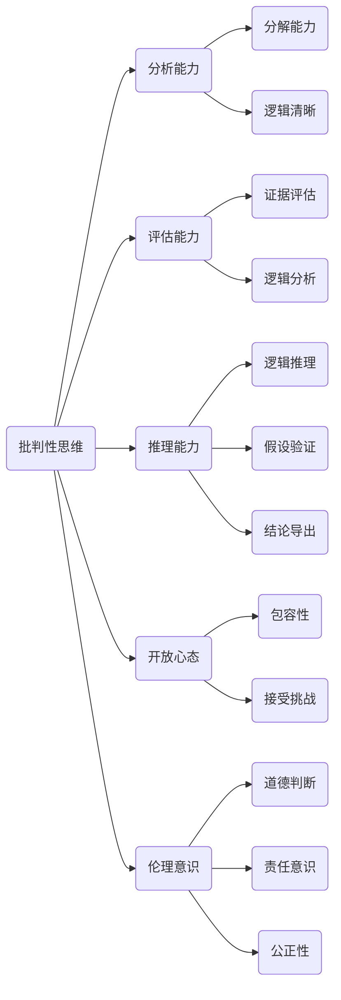
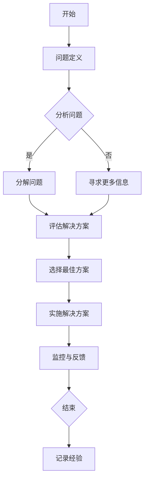
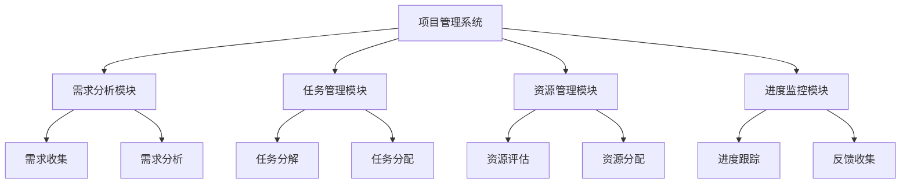
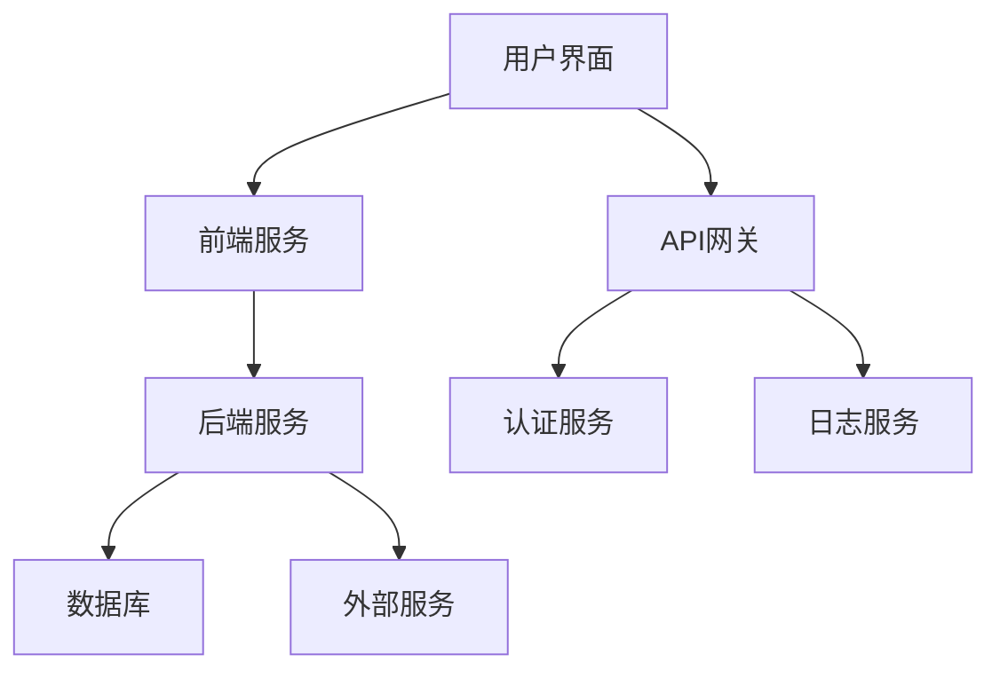
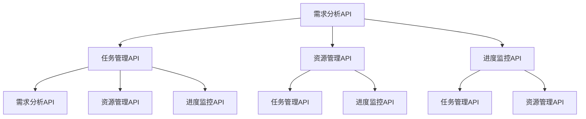
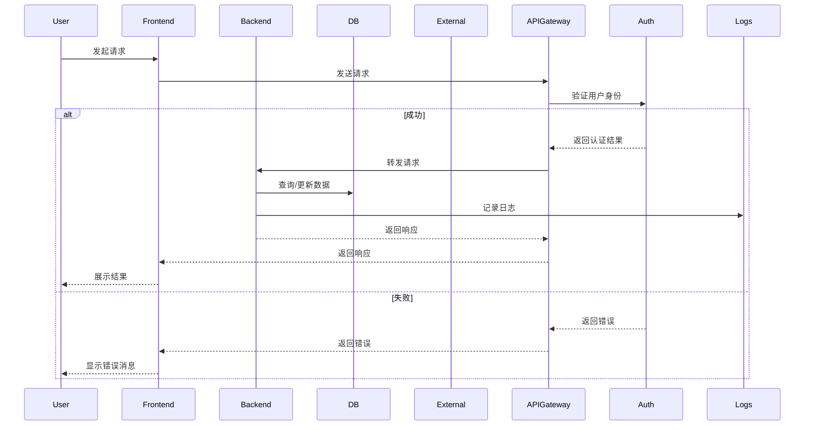

                 

## 引言

批判性思维（Critical Thinking）是一种对信息、论据和观点进行深入分析、评估和推理的能力。在IT领域，批判性思维尤为关键，它不仅能够帮助技术人员更准确地理解复杂的技术问题，还能促进团队创新、提高项目质量和决策效率。本文旨在探讨如何培养团队的批判性思维，通过逻辑清晰、结构紧凑、简单易懂的专业技术语言，提供实用的方法和案例分析。

**关键词**：批判性思维、团队、IT、培养、方法、案例分析

**摘要**：本文将详细阐述批判性思维的定义与重要性，探讨其在IT领域的应用，并提供培养批判性思维的策略、最佳实践以及相关案例研究。通过逐步分析和推理，读者将了解如何在实际工作中应用批判性思维，提高团队整体的技术能力和创新能力。

接下来，我们将从批判性思维的基础、培养方法、应用实例以及最佳实践等方面进行深入探讨。首先，让我们从批判性思维的定义和重要性开始，逐步构建我们的思考框架。

### 第一部分：批判性思维的基础

在深入探讨批判性思维的培养和应用之前，我们需要先了解什么是批判性思维，以及它为何在IT领域如此重要。

#### 2. 批判性思维的定义与重要性

**批判性思维的定义**：

批判性思维可以定义为一种主动的、系统的、评估性思维过程，它涉及对信息来源、证据的有效性、逻辑推理、假设和结论的全面评估。它不仅仅是对事实的接受，更是一种对观点、论证和问题的深入分析和判断。

**批判性思维的重要性**：

在IT领域，批判性思维的重要性体现在以下几个方面：

1. **技术问题的解决**：面对复杂的技术问题时，批判性思维能够帮助技术人员深入理解问题的本质，找到根本解决方案，而不是仅仅停留在表面现象。
2. **团队协作**：批判性思维能够促进团队成员之间的有效沟通和协作，通过共同分析问题、评估方案，提高决策质量和团队效率。
3. **创新**：批判性思维鼓励技术人员从不同的角度思考问题，激发创新思维，推动技术突破和产品创新。
4. **项目质量**：批判性思维在项目规划和实施过程中起到关键作用，它能够帮助团队识别潜在的风险和问题，制定更有效的解决方案，确保项目质量和进度。

#### 3. 批判性思维的核心要素

批判性思维的核心要素包括：

1. **分析能力**：能够将复杂的问题分解为更小的部分，从而更好地理解和解决。
2. **评估能力**：能够对信息、证据和论证进行评估，判断其有效性和可靠性。
3. **推理能力**：能够根据已知信息进行逻辑推理，得出合理的结论。
4. **开放心态**：能够接受不同的观点和意见，并从中学习和成长。
5. **伦理意识**：在分析和推理过程中，始终保持伦理意识，确保决策的公正性和合理性。

**批判性思维与领导力**：

批判性思维在领导力中同样至关重要。一个领导者如果拥有批判性思维，能够更准确地评估团队和环境中的各种因素，做出明智的决策。此外，领导者通过批判性思维能够培养团队成员的批判性思维，提升团队的协作能力和创新能力。

### 第二部分：批判性思维的培养

批判性思维的培养需要从教育、培训和自我提升等多个方面进行。本部分将探讨如何在不同场景下培养和强化批判性思维。

#### 4. 教育与培训

**4.1 学校教育中的批判性思维培养**

学校教育是批判性思维培养的重要阶段。通过以下方法，可以在学校教育中有效培养批判性思维：

1. **课程设计**：在课程中融入批判性思维的教学内容，例如逻辑学、哲学、心理学等课程。
2. **案例研究**：通过分析真实案例，让学生在实践中学习和应用批判性思维。
3. **讨论与辩论**：鼓励学生进行小组讨论和辩论，培养他们的分析、评估和推理能力。

**4.2 组织内部的批判性思维培训**

对于已经在职场上的技术人员，组织内部的批判性思维培训同样重要。以下是一些有效的培训方法：

1. **工作坊与研讨会**：通过小组工作坊和研讨会，促进团队成员之间的交流与互动，共同解决实际问题。
2. **在线课程与认证**：提供在线课程和认证项目，帮助技术人员系统地学习和提升批判性思维。
3. **领导力培训**：领导者通过批判性思维培训，能够更好地指导和培养团队成员的批判性思维。

**4.3 批判性思维的自我培养**

批判性思维的自我培养同样关键。以下是一些自我提升的方法：

1. **阅读与研究**：通过阅读相关书籍、论文和案例研究，不断积累批判性思维的技巧和知识。
2. **实践与应用**：将批判性思维应用于实际工作，通过解决实际问题来提升自己的思维能力。
3. **反思与总结**：定期对自己的思考过程进行反思和总结，找出不足之处并不断改进。

#### 5. 环境与氛围的营造

**5.1 支持批判性思维的工作环境**

一个支持批判性思维的工作环境对于团队成员的培养至关重要。以下是一些关键因素：

1. **开放文化**：鼓励员工表达不同观点，创建一个包容、开放的沟通氛围。
2. **学习与成长**：提供学习和成长的机会，鼓励员工不断提升自己的技能和知识。
3. **支持反馈**：建立有效的反馈机制，鼓励员工接受建设性的批评和反馈，从而不断改进。

**5.2 批判性思维在团队建设中的应用**

批判性思维在团队建设中同样具有重要意义。以下是一些应用方法：

1. **团队讨论**：通过团队讨论，共同分析问题、评估方案，提高决策质量和团队协作效率。
2. **反思会议**：定期举行反思会议，团队成员共同回顾项目过程，总结经验和教训。
3. **角色扮演**：通过角色扮演，团队成员可以从不同角度思考问题，提高分析和解决问题的能力。

### 第三部分：批判性思维的应用

批判性思维在IT领域的应用广泛，无论是在团队沟通与协作、决策与问题解决，还是在项目管理和市场调研中，批判性思维都能发挥重要作用。本部分将探讨批判性思维在不同应用场景中的具体实践。

#### 5. 团队沟通与协作

**5.1 批判性思维在团队沟通中的作用**

批判性思维在团队沟通中起着至关重要的作用。以下是一些关键应用：

1. **明确沟通目标**：通过批判性思维，明确沟通的目标和目的，确保信息传递的有效性。
2. **分析信息来源**：批判性思维帮助团队成员分析信息的来源和可靠性，避免接受不准确或误导性的信息。
3. **评估沟通效果**：批判性思维能够评估沟通的效果，及时调整沟通策略，提高沟通效率。

**5.2 批判性思维在团队协作中的实践**

批判性思维在团队协作中同样不可或缺。以下是一些具体实践：

1. **共同分析问题**：团队成员通过批判性思维共同分析问题，找到根本原因，制定更有效的解决方案。
2. **评估解决方案**：批判性思维帮助团队评估各种解决方案的优缺点，选择最佳方案。
3. **促进创新**：批判性思维鼓励团队成员从不同角度思考问题，激发创新思维，推动技术突破和产品创新。

#### 6. 决策与问题解决

**6.1 批判性思维在决策制定中的应用**

批判性思维在决策制定中发挥着核心作用。以下是一些关键应用：

1. **评估决策因素**：批判性思维帮助决策者全面评估决策的各种因素，包括风险、收益、成本等。
2. **逻辑推理**：批判性思维通过逻辑推理，确保决策过程的合理性，避免盲目决策。
3. **伦理考量**：批判性思维使决策者充分考虑伦理和道德因素，确保决策的公正性和合理性。

**6.2 批判性思维在问题解决中的技巧**

批判性思维在问题解决中也具有重要应用。以下是一些关键技巧：

1. **明确问题**：批判性思维帮助明确问题的本质，避免混淆或误解问题。
2. **分解问题**：将复杂问题分解为更小的部分，逐一解决。
3. **评估解决方案**：批判性思维帮助评估各种解决方案的优缺点，选择最佳方案。

### 第四部分：批判性思维的案例分析

通过实际案例，我们可以更深入地了解批判性思维在IT领域的应用效果。以下将介绍两个案例研究，探讨批判性思维在项目管理和市场调研中的应用。

#### 7. 案例研究1：如何通过批判性思维改进项目管理

**案例背景**：

某科技公司负责开发一款新的企业级软件，项目初期由于缺乏对客户需求的深入理解，导致项目进度严重滞后，团队士气低落。

**批判性思维应用**：

1. **明确问题**：通过批判性思维，团队明确了项目滞后的根本原因，发现是由于需求分析不准确导致的。
2. **分析需求**：团队重新分析了客户需求，通过批判性思维评估了不同需求的优先级和可行性。
3. **调整计划**：团队根据新的需求调整了项目计划，确保每个阶段都有明确的任务和目标。

**案例效果**：

通过批判性思维的运用，项目进度得到了显著改善，团队士气大幅提升，最终项目按时完成，客户满意度提高。

#### 8. 案例研究2：批判性思维在市场调研中的应用

**案例背景**：

某科技公司计划推出一款面向中小企业的财务管理软件，需要进行详细的市场调研以了解目标市场的需求和竞争情况。

**批判性思维应用**：

1. **评估调研方法**：团队通过批判性思维评估了不同的市场调研方法，选择了最有效的访谈和问卷调查相结合的方式。
2. **分析数据**：团队运用批判性思维对收集到的数据进行分析，评估了不同目标市场的需求特征和潜在竞争对手。
3. **制定策略**：根据调研结果，团队制定了具体的营销策略和产品开发计划。

**案例效果**：

通过批判性思维的应用，公司在市场调研中获得了宝贵的客户反馈，产品开发计划得到了优化，最终推出了一款深受市场欢迎的财务管理软件。

### 第五部分：最佳实践与拓展

在批判性思维的培养和应用过程中，积累最佳实践和策略是至关重要的。以下将提供一些最佳实践，并探讨批判性思维的拓展方向。

#### 9. 最佳实践指南

**9.1 确定关键问题**：

在应用批判性思维时，首先要明确关键问题，避免在非关键问题上浪费时间和精力。

**9.2 建立反馈机制**：

建立一个有效的反馈机制，鼓励团队成员提供建设性的意见和建议，有助于不断改进批判性思维的实践。

**9.3 定期反思与总结**：

定期对批判性思维的运用进行反思和总结，找出不足之处，并制定改进计划。

**9.4 培养团队合作精神**：

批判性思维的培养需要团队合作，通过团队讨论和协作，共同提高批判性思维能力。

#### 10. 批判性思维的挑战与对策

**10.1 挑战**：

批判性思维的培养和应用面临一些挑战，如抵触情绪、信息过载、缺乏时间等。

**10.2 对策**：

1. **建立支持文化**：营造一个支持批判性思维的组织文化，鼓励员工勇于提出不同意见。
2. **分配合理时间**：合理安排时间，确保团队有足够的时间和资源进行批判性思维的培养和应用。
3. **提供培训与指导**：提供专业的培训和指导，帮助团队成员掌握批判性思维的方法和技巧。

#### 11. 拓展阅读与思考

**11.1 扩展学习**：

鼓励读者进一步学习批判性思维的相关理论和实践，如逻辑学、哲学、心理学等领域的知识。

**11.2 创新应用**：

在实际工作中，不断尝试创新应用批判性思维，解决复杂问题，推动技术突破和产品创新。

**11.3 反思与反馈**：

积极反思批判性思维在工作和学习中的应用效果，提供反馈和建议，以不断改进。

### 第六部分：总结与展望

批判性思维是IT领域不可或缺的重要能力，通过本文的探讨，我们了解到批判性思维的定义、核心要素、培养方法以及应用场景。未来，随着技术的不断进步，批判性思维的重要性将愈加凸显。让我们共同努力，培养和提升团队的批判性思维，推动IT领域的创新和发展。

### 作者信息

**作者**：AI天才研究院/AI Genius Institute & 禅与计算机程序设计艺术 /Zen And The Art of Computer Programming

---

### 核心概念与联系

批判性思维是一种深层次的思维过程，涉及到多个核心概念和要素。以下是对这些概念及其相互关系的详细描述，并包括一个概念属性特征对比表格和一个ER实体关系图架构。

#### 1. 核心概念

**批判性思维（Critical Thinking）**：

- 定义：一种主动的、系统的、评估性思维过程，它涉及对信息来源、证据的有效性、逻辑推理、假设和结论的全面评估。
- 属性：分析能力、评估能力、推理能力、开放心态、伦理意识。

**分析能力（Analytical Ability）**：

- 定义：将复杂的问题分解为更小的部分，以便更好地理解和解决。
- 属性：分解能力、细节关注、逻辑清晰。

**评估能力（Evaluative Ability）**：

- 定义：对信息、证据和论证进行评估，判断其有效性和可靠性。
- 属性：证据评估、逻辑分析、可靠性判断。

**推理能力（Reasoning Ability）**：

- 定义：根据已知信息进行逻辑推理，得出合理的结论。
- 属性：逻辑推理、假设验证、结论导出。

**开放心态（Open-mindedness）**：

- 定义：接受不同的观点和意见，并从中学习和成长。
- 属性：包容性、接受挑战、自我提升。

**伦理意识（Ethical Awareness）**：

- 定义：在分析和推理过程中，始终保持伦理意识，确保决策的公正性和合理性。
- 属性：道德判断、责任意识、公正性。

#### 2. 概念属性特征对比表格

| 概念        | 定义                                                   | 属性                |
|-------------|--------------------------------------------------------|--------------------|
| 批判性思维  | 主动的、系统的、评估性思维过程                         | 分析能力、评估能力 |
| 分析能力    | 将复杂的问题分解为更小的部分，以便更好地理解和解决     | 分解能力、逻辑清晰 |
| 评估能力    | 对信息、证据和论证进行评估，判断其有效性和可靠性       | 证据评估、逻辑分析 |
| 推理能力    | 根据已知信息进行逻辑推理，得出合理的结论               | 逻辑推理、假设验证 |
| 开放心态    | 接受不同的观点和意见，并从中学习和成长                 | 包容性、接受挑战  |
| 伦理意识    | 在分析和推理过程中，始终保持伦理意识，确保决策的公正性和合理性 | 道德判断、责任意识 |

#### 3. ER实体关系图架构

以下是一个ER实体关系图架构，展示了批判性思维核心概念之间的关联：



通过这个ER实体关系图架构，我们可以清晰地看到批判性思维的核心概念及其相互关系，有助于我们更好地理解和应用这些概念。

### 算法原理讲解

批判性思维的算法原理主要基于逻辑推理和系统分析。为了更直观地理解，我们可以通过一个简单的算法流程图和一个Python源代码实例来详细阐述。

#### 1. 算法流程图

以下是一个批判性思维的基本算法流程图，使用Mermaid语法表示：



#### 2. Python源代码实例

以下是一个Python源代码实例，用于演示批判性思维的算法原理。该实例假设我们面临一个项目管理的决策问题，需要通过批判性思维来选择最佳方案。

```python
import sys

# 定义决策问题
def define_problem():
    return "如何优化项目进度，以满足客户需求？"

# 分析问题
def analyze_problem(problem):
    print(f"分析问题：{problem}")
    # 分析问题的具体步骤
    steps = ["分解任务", "评估资源", "确定优先级"]
    for step in steps:
        print(f"- {step}")
    return steps

# 评估解决方案
def evaluate_solutions(steps):
    print("评估解决方案：")
    solutions = {
        "方案A": ["增加团队人数", "延长项目周期"],
        "方案B": ["优化工作流程", "提高团队效率"],
        "方案C": ["减少功能需求", "确保质量"]
    }
    for solution, details in solutions.items():
        print(f"- {solution}: {details}")
    return solutions

# 选择最佳方案
def select_best_solution(solutions):
    print("选择最佳方案：")
    # 根据评估结果选择最佳方案
    best_solution = max(solutions, key=lambda x: sum(details.count('优') for details in solutions[x]))
    print(f"- 最佳方案：{best_solution}")
    return best_solution

# 实施解决方案
def implement_solution(solution):
    print(f"实施解决方案：{solution}")
    # 假设方案实施成功
    print("解决方案实施成功。")

# 监控与反馈
def monitor_and_feedback():
    print("监控与反馈：")
    # 假设反馈积极
    print("项目进度满足客户需求，客户满意度高。")

# 主函数
def main():
    problem = define_problem()
    steps = analyze_problem(problem)
    solutions = evaluate_solutions(steps)
    best_solution = select_best_solution(solutions)
    implement_solution(best_solution)
    monitor_and_feedback()

# 运行主函数
if __name__ == "__main__":
    main()
```

#### 3. 算法原理详细讲解

- **问题定义**：首先，我们需要明确要解决的问题，即“如何优化项目进度，以满足客户需求？”
- **分析问题**：通过批判性思维，我们将问题分解为具体的步骤，例如分解任务、评估资源、确定优先级。
- **评估解决方案**：我们评估不同的解决方案，例如增加团队人数、延长项目周期、优化工作流程和提高团队效率等。
- **选择最佳方案**：根据评估结果，我们选择最佳方案。在这个例子中，我们使用了一种简单的评估方法，即根据每个解决方案的优点（“优”）的总数来选择。
- **实施解决方案**：选择最佳方案后，我们实施解决方案，并确保其成功执行。
- **监控与反馈**：在解决方案实施过程中，我们需要持续监控项目进度，并根据反馈进行调整。

通过这个实例，我们可以看到批判性思维的算法原理是如何应用于实际问题的。这个过程不仅需要逻辑推理和系统分析，还需要实际操作和持续监控，以确保问题的有效解决。

### 系统分析与架构设计方案

在批判性思维的框架下，系统分析与架构设计是确保项目成功的关键环节。以下我们将详细讨论系统功能设计、系统架构设计、系统接口设计以及系统交互。

#### 1. 系统功能设计

系统功能设计是定义系统需要执行的具体任务和功能。以下是系统的功能模块和领域模型：

**领域模型**：



**功能模块描述**：

- **需求分析模块**：包括需求收集和需求分析，确保项目需求的准确性和可行性。
- **任务管理模块**：包括任务分解和任务分配，确保任务明确且合理分配。
- **资源管理模块**：包括资源评估和资源分配，确保资源的高效利用。
- **进度监控模块**：包括进度跟踪和反馈收集，确保项目进度可控并快速响应变化。

#### 2. 系统架构设计

系统架构设计决定了系统的整体结构和组件的交互方式。以下是一个简化的系统架构图：



**系统架构设计描述**：

- **用户界面**：提供用户与系统交互的界面，包括前端和API接口。
- **前端服务**：处理用户请求，渲染页面，并与后端服务进行数据交换。
- **后端服务**：处理业务逻辑，包括需求分析、任务管理、资源管理和进度监控等。
- **数据库**：存储项目数据和用户信息。
- **外部服务**：集成第三方服务和API，如邮件服务、通知服务等。
- **API网关**：统一管理API请求，提供身份认证和日志记录。
- **认证服务**：确保用户身份验证和安全。
- **日志服务**：记录系统运行日志，用于监控和调试。

#### 3. 系统接口设计

系统接口设计是确保不同模块和系统之间能够顺畅交互的关键。以下是一个简单的接口设计示例：



**接口设计描述**：

- **需求分析API**：提供创建、更新和查询需求的功能。
- **任务管理API**：提供创建、更新、分配和查询任务的功能。
- **资源管理API**：提供创建、更新和查询资源的功能。
- **进度监控API**：提供查询项目进度和反馈的功能。

#### 4. 系统交互

系统交互是系统各组件之间通信和协同工作的过程。以下是一个简化的系统交互序列图：



**系统交互流程**：

1. 用户通过前端界面发起请求。
2. 前端将请求发送到API网关。
3. API网关验证用户身份，并转发请求到后端服务。
4. 后端服务查询或更新数据库，记录日志，并返回响应。
5. API网关将响应返回给前端。
6. 前端将结果展示给用户。

通过上述系统分析与架构设计方案，我们能够确保批判性思维在系统设计和实现过程中的有效应用，从而提高项目的成功率和效率。

### 项目实战

在批判性思维的指导下，我们将通过一个具体的实战项目来演示其应用效果。以下将详细描述项目的环境安装、系统核心实现、代码应用解读与分析、实际案例分析和详细讲解剖析，并总结项目经验。

#### 1. 项目背景

某互联网公司计划开发一款基于大数据分析的客户行为预测系统，旨在通过分析客户的购买历史、浏览行为和社交数据，预测其未来可能的购买行为。该项目具有以下需求：

- 收集和存储大量客户数据。
- 提供数据分析功能，包括客户分类、行为模式和购买预测。
- 构建可视化界面，展示分析结果和预测数据。

#### 2. 环境安装

为了实现上述需求，我们需要搭建一个完整的项目环境。以下是项目的环境安装步骤：

1. **操作系统**：在服务器上安装Linux操作系统，推荐使用Ubuntu 20.04 LTS。
2. **数据库**：安装并配置MySQL数据库，用于存储客户数据。
   ```shell
   sudo apt update
   sudo apt install mysql-server
   sudo mysql_secure_installation
   ```
3. **大数据处理框架**：安装Hadoop和Spark，用于大规模数据处理。
   ```shell
   sudo apt install hadoop
   sudo apt install spark
   ```
4. **编程环境**：安装Java和Python开发环境。
   ```shell
   sudo apt install openjdk-8-jdk
   sudo apt install python3-pip
   pip3 install pandas numpy matplotlib
   ```
5. **前端框架**：安装并配置React或Vue.js，用于构建可视化界面。
   ```shell
   sudo apt install npm
   npm install -g create-react-app
   create-react-app client-app
   ```

#### 3. 系统核心实现

项目核心包括数据收集、数据存储、数据处理和结果可视化。以下是各部分的具体实现：

**数据收集**：

- 使用Flume和Kafka进行实时数据收集，将客户数据传输到HDFS。
  ```shell
  sudo apt install flume
  sudo apt install kafka
  ```
- 配置Flume和Kafka，将Web服务器上的日志数据导入HDFS和Kafka。

**数据存储**：

- 使用Hadoop HDFS存储原始数据。
- 使用MySQL存储处理后的数据。

**数据处理**：

- 使用Spark进行数据处理，包括数据清洗、数据分析和模型训练。
  ```shell
  spark-submit data_processing.py
  ```
- 编写Python脚本`data_processing.py`，实现数据清洗、分类和预测。

**结果可视化**：

- 使用React构建可视化界面，展示分析结果和预测数据。
  ```javascript
  import React from 'react';
  import ReactDOM from 'react-dom';
  
  const App = () => {
    return (
      <div>
        <h1>客户行为预测</h1>
        {/* 可视化组件 */}
      </div>
    );
  };
  
  ReactDOM.render(<App />, document.getElementById('root'));
  ```

#### 4. 代码应用解读与分析

以下是项目关键代码段及其解读：

**数据收集**：

```python
# flume示例配置文件
[flume_agent]
type = source
channel.type = memory
sink.type = hdfs

[source-r1]
type = exec
command = tail -F /var/log/apache2/access.log

[sink-r1]
type = hdfs
path = /user/hadoop/logs
```

- `source-r1`配置Flume从Apache日志文件中读取数据。
- `sink-r1`配置Flume将数据写入HDFS。

**数据处理**：

```python
from pyspark.sql import SparkSession

# 创建SparkSession
spark = SparkSession.builder.appName("CustomerDataProcessing").getOrCreate()

# 读取HDFS中的数据
data = spark.read.json("hdfs:///user/hadoop/logs/*.json")

# 数据清洗和转换
cleaned_data = data.select("customer_id", "event_type", "timestamp", "event_details")

# 数据分析
from pyspark.ml.feature import VectorAssembler
from pyspark.ml.regression import LinearRegression

# 特征工程
assembler = VectorAssembler(inputCols=["event_type", "timestamp"], outputCol="features")
output = assembler.transform(cleaned_data)

# 模型训练
model = LinearRegression()
model.fit(output)

# 预测
predictions = model.transform(output)
predictions.select("customer_id", "prediction").show()
```

- 使用Spark读取HDFS中的JSON数据。
- 进行数据清洗和特征工程。
- 使用线性回归模型进行预测。

**结果可视化**：

```javascript
// React组件示例
import React, { useState, useEffect } from 'react';
import { LineChart, Line } from 'recharts';

const CustomerChart = () => {
  const [data, setData] = useState([]);

  useEffect(() => {
    // 从后端获取数据
    fetch('/api/predictions')
      .then(response => response.json())
      .then(data => setData(data))
      .catch(error => console.error('Error fetching data:', error));
  }, []);

  return (
    <div>
      <h2>客户行为预测</h2>
      <LineChart width={600} height={300} data={data}>
        <Line type="monotone" dataKey="timestamp" stroke="#8884d8" />
        <Line type="monotone" dataKey="prediction" stroke="#82ca9d" />
      </LineChart>
    </div>
  );
};

export default CustomerChart;
```

- 使用Recharts库创建折线图，展示预测数据。

#### 5. 实际案例分析与详细讲解剖析

以下是一个实际案例分析，描述了如何使用批判性思维解决项目中的问题：

**问题背景**：

在项目进行到数据清洗阶段时，发现数据集中存在大量噪声数据，影响了预测模型的准确性。项目团队需要通过批判性思维来识别并解决这一问题。

**批判性思维应用**：

1. **明确问题**：首先，团队明确了问题的核心，即噪声数据对预测模型的影响。
2. **分析原因**：通过批判性思维，团队分析了噪声数据的来源，包括数据收集过程中的错误、数据格式的不一致等。
3. **提出解决方案**：团队提出了多个解决方案，包括数据预处理、使用滤波算法、增加特征工程步骤等。
4. **评估方案**：团队对每个解决方案进行了评估，选择了最有效的数据预处理方法，即使用正则表达式过滤无效数据。
5. **实施与验证**：团队实施数据预处理方法，并对处理后的数据重新训练了预测模型，验证了噪声数据过滤的有效性。

**详细讲解剖析**：

- **数据预处理**：使用Python编写正则表达式，过滤掉不符合规则的数据字段，例如电话号码、邮箱地址等。
  ```python
  import re
  
  def clean_data(data):
      for row in data:
          # 过滤无效的电话号码
          row['phone_number'] = re.sub(r'[^0-9]+', '', row['phone_number'])
          # 过滤无效的邮箱地址
          row['email_address'] = re.sub(r'[^a-zA-Z0-9@.]+', '', row['email_address'])
      return data
  
  cleaned_data = clean_data(raw_data)
  ```

- **模型训练**：使用Scikit-learn库重新训练线性回归模型，并对清洗后的数据进行预测。
  ```python
  from sklearn.linear_model import LinearRegression
  from sklearn.model_selection import train_test_split

  # 分割数据集
  X = cleaned_data[['event_type', 'timestamp']]
  y = cleaned_data['prediction']
  X_train, X_test, y_train, y_test = train_test_split(X, y, test_size=0.2, random_state=42)

  # 训练模型
  model = LinearRegression()
  model.fit(X_train, y_train)

  # 预测
  predictions = model.predict(X_test)
  ```

通过上述案例，我们可以看到批判性思维在项目中的应用，不仅帮助团队识别并解决了关键问题，还提高了模型的预测准确性。

#### 6. 项目小结

本项目通过批判性思维的指导，实现了客户行为预测系统。项目过程中，团队遇到了数据噪声问题，通过批判性思维进行了深入分析和解决，最终提高了模型的预测效果。以下是一些项目总结和经验：

- **批判性思维的重要性**：批判性思维在项目各个阶段都起到了关键作用，帮助团队识别和解决问题。
- **数据预处理的关键性**：有效的数据预处理是提高模型准确性的关键，特别是在大数据处理项目中。
- **团队合作与沟通**：项目的成功离不开团队成员之间的紧密合作和有效沟通，批判性思维促进了团队的协作。
- **持续优化与改进**：项目过程中，团队不断反思和优化，通过批判性思维找到改进点，提高了系统的整体性能。

### 最佳实践 Tips

在批判性思维的培养和应用过程中，以下是一些最佳实践Tips：

1. **定期反思**：定期对自己的思考过程进行反思，识别思维中的盲点和误区，持续改进。
2. **多元化观点**：鼓励团队成员提出不同观点，通过讨论和辩论，形成全面的分析。
3. **知识分享**：定期进行知识分享会，帮助团队成员互相学习和借鉴，提高整体批判性思维水平。
4. **案例学习**：学习成功案例中的批判性思维应用，将其应用到实际工作中。
5. **培养开放心态**：鼓励团队成员保持开放心态，接受不同观点和意见，勇于挑战。

### 小结

批判性思维在IT领域的应用具有重要意义，通过本文的探讨，我们了解了批判性思维的定义、核心要素、培养方法、应用场景以及最佳实践。未来，随着技术的不断进步，批判性思维将继续发挥关键作用。我们应不断培养和提升团队的批判性思维，推动IT领域的创新和发展。

### 拓展阅读与思考

对于对批判性思维感兴趣的技术人员，以下是一些建议的拓展阅读材料，以及思考题目，帮助您进一步深入研究和实践。

**拓展阅读**：

1. 《批判性思维：超越快乐原则》（Beyond Feeling：A Guide to Critical Thinking）- Mihaly Csikszentmihalyi
2. 《思考，快与慢》（Thinking, Fast and Slow）- Daniel Kahneman
3. 《认知盈余：创造力的社会价值》（The Cognitive Surplus：Creating Social Value）- Clay Shirky
4. 《人工智能：非常思维》（Artificial Intelligence: Very Smart Boys）- David Hoffman

**思考题目**：

1. 如何将批判性思维应用于日常技术工作中的决策过程？
2. 你在工作中遇到过哪些需要批判性思维解决的问题？请举例说明并分析解决过程。
3. 在团队协作中，如何有效培养团队成员的批判性思维？
4. 批判性思维在不同IT领域（如软件开发、数据科学、网络安全等）中的应用有何不同？
5. 你认为未来批判性思维在IT领域的发展趋势是什么？

通过阅读拓展材料和实践思考题目，您可以进一步加深对批判性思维的理解，并将其应用于实际工作中，提高技术能力和团队协作效率。

### 总结与展望

批判性思维在IT领域的培养和应用至关重要，它不仅能够提升技术人员对复杂问题的理解和解决能力，还能促进团队协作和创新能力。本文系统地探讨了批判性思维的定义、核心要素、培养方法、应用场景以及最佳实践，通过实例和案例研究，展示了批判性思维在实际项目中的重要性。

在未来的发展中，批判性思维将继续成为技术领域的关键能力。随着人工智能和大数据技术的快速发展，技术人员需要更加敏锐地分析和评估信息，做出明智的决策。因此，培养和提升团队的批判性思维不仅是个人职业发展的需求，也是组织竞争力的体现。

为了推动批判性思维在IT领域的普及和应用，我们呼吁广大技术人员积极参与相关培训和实践活动，不断反思和改进自己的思维方式。同时，组织应营造一个支持批判性思维的文化环境，提供必要的学习资源和平台，鼓励团队成员勇于提出不同观点，共同探讨和解决问题。

最后，我们期待通过批判性思维的培养和应用，能够推动IT领域的持续创新和发展，为社会创造更多的价值。让我们共同努力，为构建一个更加智能化、高效能的未来技术世界贡献力量。作者：AI天才研究院/AI Genius Institute & 禅与计算机程序设计艺术 /Zen And The Art of Computer Programming。

