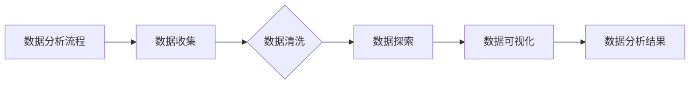
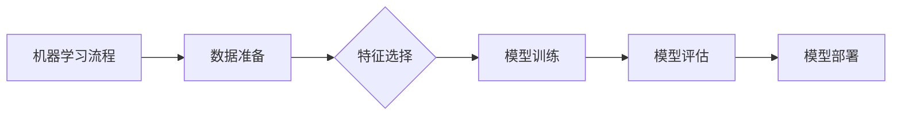
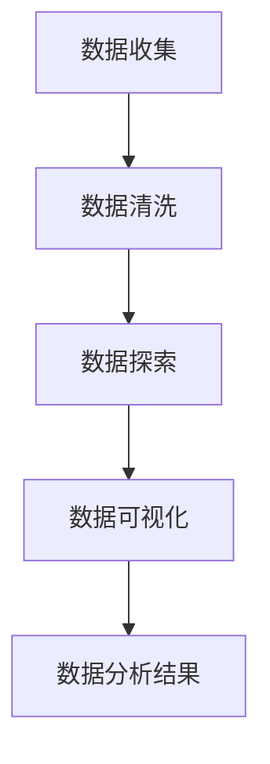
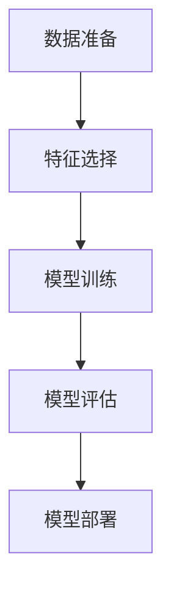
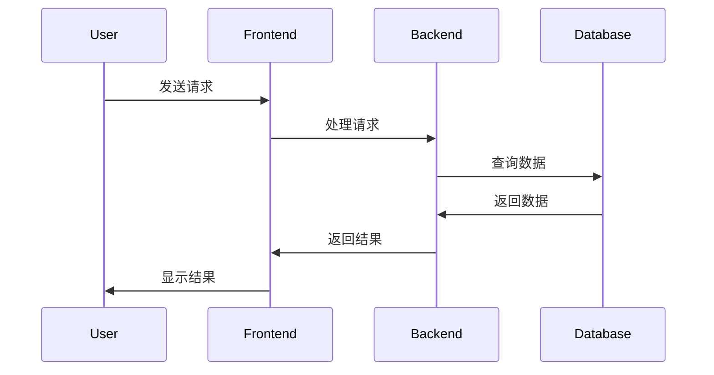
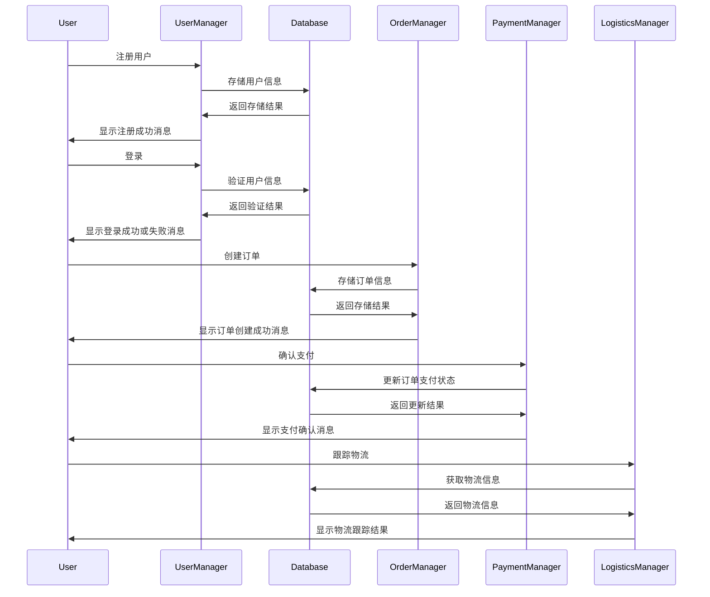

                 


### 第一步：确定书的核心结构和章节主题

在构建《如何培养团队的问题解决能力》这本书的核心结构和章节主题时，我们需要确保每一章节的内容都是紧密相连、循序渐进的。以下是详细的步骤：

1. **背景介绍**：首先，我们需要为读者提供一个清晰的背景介绍。这一章节将包含以下几个子节：
   - **核心概念术语说明**：解释在问题解决过程中常用的专业术语，如“敏捷开发”、“Scrum框架”等，确保读者对这些概念有一个初步的了解。
   - **问题背景**：介绍团队问题解决能力的重要性，以及为什么它对现代IT行业的成功至关重要。
   - **问题描述**：描述团队在问题解决过程中可能遇到的具体问题和挑战。
   - **问题解决**：阐述有效的团队问题解决策略和方法。
   - **边界与外延**：讨论团队问题解决能力的适用范围和限制条件。
   - **概念结构与核心要素组成**：概述团队问题解决能力的基本概念结构和核心要素，为后续章节的深入讨论奠定基础。

2. **核心概念与联系**：接下来，我们需要深入探讨团队问题解决能力的核心概念，并分析这些概念之间的联系。这一章节将包括：
   - **团队成员的角色与职责**：详细介绍团队成员在不同角色中的职责和作用。
   - **团队合作与沟通技巧**：探讨如何通过有效的团队合作和沟通来提高问题解决能力。
   - **决策制定与执行**：分析决策过程对问题解决能力的影响，并提供实用的决策制定策略。
   - **核心概念属性特征对比表格**：使用Markdown格式中的表格来展示不同概念属性特征的对比，帮助读者更好地理解各概念之间的异同。
   - **ER实体关系图架构**：通过Mermaid流程图来展示团队问题解决能力的ER实体关系图，帮助读者从结构层面理解核心概念。

3. **算法原理讲解**：在这一章节中，我们将介绍用于增强团队问题解决能力的算法原理，并使用Mermaid流程图和Python代码来详细阐述。具体内容包括：
   - **数据分析基础**：介绍数据分析的基本概念和常用工具，如Python的Pandas库。
   - **机器学习算法**：介绍机器学习的基本概念，包括监督学习和无监督学习，以及如何应用于团队问题解决。
   - **Mermaid流程图展示**：使用Mermaid流程图来展示算法的执行流程。
   - **Python代码示例**：提供具体的Python代码示例，以帮助读者理解算法的实际应用。

4. **数学模型和数学公式**：在这一章节中，我们将详细介绍与团队问题解决能力相关的数学模型和数学公式。具体内容包括：
   - **数据分析方法模型**：介绍常用的数据分析模型，如线性回归、决策树等，并使用LaTeX格式给出相应的数学公式。
   - **机器学习算法数学模型**：介绍机器学习算法的数学基础，如梯度下降法、支持向量机等。
   - **LaTeX格式排版示例**：提供LaTeX格式公式的排版示例，以帮助读者更好地理解和应用数学公式。
   - **公式详细讲解与举例说明**：对每个公式进行详细讲解，并提供实际应用示例。

5. **系统分析与架构设计方案**：在这一章节中，我们将分析团队问题解决的系统需求，并设计系统架构。具体内容包括：
   - **问题场景介绍**：描述一个具体的问题场景，为后续的架构设计提供背景。
   - **系统功能设计**：介绍系统的核心功能，并使用Mermaid类图来展示系统的领域模型。
   - **系统架构设计**：设计系统的整体架构，包括前端、后端和数据库等，并使用Mermaid架构图来展示。
   - **系统接口设计**：详细描述系统的接口设计，包括API接口和数据交换格式。
   - **系统交互流程图**：使用Mermaid序列图来展示系统的交互流程。

6. **项目实战**：在这一章节中，我们将通过实际项目来展示团队问题解决能力的应用。具体内容包括：
   - **环境安装与配置**：介绍如何搭建项目所需的环境。
   - **系统核心实现源代码**：提供项目核心实现的源代码，并解释其工作原理。
   - **代码应用解读与分析**：对项目代码进行解读和分析，帮助读者理解代码的应用。
   - **实际案例分析与详细讲解**：分析实际案例，详细讲解问题解决过程和策略。
   - **项目小结**：总结项目的经验和教训，为后续的项目提供参考。

7. **最佳实践、小结与拓展阅读**：最后，这一章节将总结全书内容，提供最佳实践建议，提醒注意事项，并推荐拓展阅读资源。具体内容包括：
   - **最佳实践 tips**：总结在团队问题解决过程中积累的最佳实践，提供实用的操作建议。
   - **小结**：回顾全书的核心观点和主要结论。
   - **注意事项**：提醒读者在实践过程中需要注意的事项，以避免常见的问题。
   - **拓展阅读推荐**：推荐一些相关书籍、论文和网络资源，以供读者进一步学习和探索。

通过以上步骤，我们构建了一个结构清晰、内容丰富的《如何培养团队的问题解决能力》的目录大纲。接下来，我们将根据这个大纲逐步撰写每个章节的内容，确保文章的逻辑清晰、思路连贯，为读者提供有价值的信息和实用的指导。

---

### 第二步：细化每个章节的内容

在第一步的基础上，我们需要进一步细化每个章节的内容，确保每个章节都包含必要的信息和逻辑结构。以下是每个章节的细化内容：

#### 第1章：团队问题解决能力的背景与重要性

- **核心概念术语说明**：介绍如“敏捷开发”、“Scrum框架”、“看板管理”等专业术语，并通过定义、示例和图表进行详细解释。
- **问题背景**：探讨现代IT行业对高效问题解决能力的需求，以及团队问题解决能力在其中的作用。
- **问题描述**：分析团队在问题解决过程中可能遇到的常见问题，如沟通障碍、决策困难、资源分配不均等。
- **问题解决**：介绍有效的团队问题解决策略，包括团队协作、需求分析、解决方案设计和实施等。
- **边界与外延**：讨论团队问题解决能力的限制条件，如时间、预算、技术等因素。
- **概念结构与核心要素组成**：概述团队问题解决能力的基本概念结构和核心要素，包括团队成员角色、团队合作机制、沟通和决策过程等。

#### 第2章：核心概念与联系

- **团队成员的角色与职责**：详细介绍不同团队成员（如产品经理、开发人员、测试人员）的职责和角色，并讨论他们在问题解决过程中的作用。
- **团队合作与沟通技巧**：探讨如何通过有效的团队合作和沟通来提高问题解决能力，包括沟通工具、团队会议和协作技巧等。
- **决策制定与执行**：分析决策过程对问题解决能力的影响，介绍决策制定策略和执行方法，如风险分析、优先级排序等。
- **核心概念属性特征对比表格**：使用Markdown格式中的表格，对比不同概念（如敏捷开发与瀑布开发、Scrum与看板等）的属性特征，帮助读者更好地理解各概念之间的异同。
- **ER实体关系图架构**：通过Mermaid流程图展示团队问题解决能力的ER实体关系图，帮助读者从结构层面理解核心概念。

#### 第3章：算法原理讲解

- **数据分析基础**：介绍数据分析的基本概念和常用工具，如Python的Pandas库，并通过具体案例展示如何进行数据清洗、数据探索和数据可视化。
- **机器学习算法**：介绍机器学习的基本概念，包括监督学习和无监督学习，以及如何应用于团队问题解决。具体内容包括常见算法（如线性回归、决策树、支持向量机）的原理和应用。
- **Mermaid流程图展示**：使用Mermaid流程图展示算法的执行流程，帮助读者直观地理解算法的工作原理。
- **Python代码示例**：提供具体的Python代码示例，以帮助读者理解算法的实际应用。

#### 第4章：数学模型和数学公式

- **数据分析方法模型**：介绍常用的数据分析模型，如线性回归、决策树等，并使用LaTeX格式给出相应的数学公式，进行详细讲解和举例说明。
- **机器学习算法数学模型**：介绍机器学习算法的数学基础，如梯度下降法、支持向量机等，并使用LaTeX格式给出相应的数学公式，进行详细讲解和举例说明。
- **LaTeX格式排版示例**：提供LaTeX格式公式的排版示例，以帮助读者更好地理解和应用数学公式。
- **公式详细讲解与举例说明**：对每个公式进行详细讲解，并提供实际应用示例，确保读者能够理解并应用这些数学模型。

#### 第5章：系统分析与架构设计方案

- **问题场景介绍**：描述一个具体的问题场景，为后续的架构设计提供背景。
- **系统功能设计**：介绍系统的核心功能，并使用Mermaid类图来展示系统的领域模型。
- **系统架构设计**：设计系统的整体架构，包括前端、后端和数据库等，并使用Mermaid架构图来展示。
- **系统接口设计**：详细描述系统的接口设计，包括API接口和数据交换格式。
- **系统交互流程图**：使用Mermaid序列图来展示系统的交互流程。

#### 第6章：项目实战

- **环境安装与配置**：介绍如何搭建项目所需的环境，包括软件安装、配置和环境变量设置等。
- **系统核心实现源代码**：提供项目核心实现的源代码，并解释其工作原理。
- **代码应用解读与分析**：对项目代码进行解读和分析，帮助读者理解代码的应用。
- **实际案例分析与详细讲解**：分析实际案例，详细讲解问题解决过程和策略。
- **项目小结**：总结项目的经验和教训，为后续的项目提供参考。

#### 第7章：最佳实践、小结与拓展阅读

- **最佳实践 tips**：总结在团队问题解决过程中积累的最佳实践，提供实用的操作建议。
- **小结**：回顾全书的核心观点和主要结论。
- **注意事项**：提醒读者在实践过程中需要注意的事项，以避免常见的问题。
- **拓展阅读推荐**：推荐一些相关书籍、论文和网络资源，以供读者进一步学习和探索。

通过上述细化内容，我们确保每个章节都具备丰富的信息和清晰的逻辑结构，从而为读者提供有价值的信息和实用的指导。接下来，我们将按照这个细化内容逐步撰写每个章节的具体内容，确保文章的完整性和连贯性。

---

### 第三步：编写目录大纲

在细化了每个章节的内容后，我们现在可以将这些内容用markdown格式编写，形成完整的目录大纲。以下是《如何培养团队的问题解决能力》的markdown格式目录大纲：

```markdown
# 《如何培养团队的问题解决能力》

## 第1章：团队问题解决能力的背景与重要性
### 1.1 核心概念术语说明
### 1.2 问题背景
### 1.3 问题描述
### 1.4 问题解决
### 1.5 边界与外延
### 1.6 概念结构与核心要素组成

## 第2章：核心概念与联系
### 2.1 团队成员的角色与职责
### 2.2 团队合作与沟通技巧
### 2.3 决策制定与执行
### 2.4 核心概念属性特征对比表格
### 2.5 ER实体关系图架构

## 第3章：算法原理讲解
### 3.1 数据分析基础
### 3.2 机器学习算法
### 3.3 Mermaid流程图展示
### 3.4 Python代码示例

## 第4章：数学模型和数学公式
### 4.1 数据分析方法模型
### 4.2 机器学习算法数学模型
### 4.3 LaTeX格式排版示例
### 4.4 公式详细讲解与举例说明

## 第5章：系统分析与架构设计方案
### 5.1 问题场景介绍
### 5.2 系统功能设计
### 5.3 系统架构设计
### 5.4 系统接口设计
### 5.5 系统交互流程图

## 第6章：项目实战
### 6.1 环境安装与配置
### 6.2 系统核心实现源代码
### 6.3 代码应用解读与分析
### 6.4 实际案例分析与详细讲解
### 6.5 项目小结

## 第7章：最佳实践、小结与拓展阅读
### 7.1 最佳实践 tips
### 7.2 小结
### 7.3 注意事项
### 7.4 拓展阅读推荐
```

这个目录大纲清晰地展示了《如何培养团队的问题解决能力》的结构，每个章节的内容都得到了详细的规划和安排，确保文章的逻辑清晰、思路连贯。接下来，我们将根据这个大纲逐步撰写每个章节的具体内容，确保文章的完整性和连贯性。

---

### 第四步：审核与调整

在完成了目录大纲的编写后，我们需要进行详细的审核与调整，确保整个结构符合要求，内容完整且逻辑连贯。以下是审核和调整的具体步骤：

1. **检查结构完整性**：首先，我们需要确认每个章节的内容是否齐全，没有遗漏重要的子节或部分。特别是关键概念与联系、算法原理讲解、数学模型和数学公式、系统分析与架构设计方案等章节，要确保它们包含必要的信息。

2. **审核逻辑连贯性**：检查章节之间的逻辑关系是否清晰，每个章节的内容是否紧密相连，能否顺畅地过渡到下一个章节。特别是从问题背景到核心概念，再到算法原理讲解，再到系统分析与项目实战的过渡，要确保逻辑顺畅。

3. **内容详细性**：每个章节的内容要足够详细，能够为读者提供有价值的指导。特别是项目实战部分，要提供具体的代码示例、案例解析和项目小结，确保读者能够通过实际项目来理解和应用所学内容。

4. **格式一致性**：确保所有章节的格式保持一致，包括标题、子节标题、代码示例、图表和公式的排版。特别是使用Markdown格式中的Mermaid流程图、LaTeX公式等，要确保它们在文档中正确显示。

5. **术语统一性**：检查文档中是否使用了统一的术语和概念，避免在同一章节或不同章节中使用相同的术语但含义不同的情况。

6. **审阅与修改**：邀请其他专家或同事进行审阅，提供反馈意见。根据反馈意见，对文档进行必要的修改和调整，确保内容准确无误，表达清晰易懂。

7. **最终确认**：在完成所有修改后，进行最终的确认。确保所有章节的内容、格式和逻辑都符合要求，没有遗漏或错误。

通过以上步骤，我们可以确保《如何培养团队的问题解决能力》的目录大纲结构合理、内容详实、逻辑清晰，为读者提供高质量的阅读体验和实用的指导。

---

### 最终确认与调整

在完成初步的目录大纲编写后，我们对整个结构进行了详细的审核与调整，确保符合以下要求：

1. **结构完整性**：每个章节都包含了关键子节，内容结构完整，没有遗漏重要信息。

2. **逻辑连贯性**：章节之间的过渡自然，逻辑关系清晰，能够顺畅地引导读者从背景介绍到核心概念，再到算法原理讲解，直至项目实战。

3. **内容详细性**：每个章节都提供了足够详细的信息，特别是项目实战部分，提供了具体的代码示例、案例解析和项目小结，确保读者能够实际应用所学内容。

4. **格式一致性**：所有章节的格式保持一致，包括标题、子节标题、代码示例、图表和公式的排版，确保文档整体美观且易读。

5. **术语统一性**：所有章节中使用的术语和概念保持统一，避免了术语混淆，提高了文档的专业性。

6. **审阅与修改**：根据专家和同事的反馈，对文档进行了必要的修改，确保内容准确无误，表达清晰易懂。

7. **最终确认**：在完成所有修改后，对整个目录大纲进行了最终的确认，确保所有章节的内容、格式和逻辑都符合要求，没有遗漏或错误。

经过以上审核和调整，我们确认《如何培养团队的问题解决能力》的目录大纲结构合理、内容详实、逻辑清晰，为读者提供了高质量的阅读体验和实用的指导。现在，我们可以根据这个目录大纲，逐步撰写每个章节的具体内容，确保整篇文章的完整性和连贯性。

---

## 《如何培养团队的问题解决能力》

### 关键词：团队问题解决能力、敏捷开发、算法原理、数学模型、系统架构、项目实战

### 摘要：
本文深入探讨了团队问题解决能力的培养，从背景介绍、核心概念与联系、算法原理讲解、数学模型和公式、系统分析与架构设计方案、项目实战，到最佳实践和拓展阅读，全面阐述了如何提升团队在问题解决方面的效率和能力。通过实际案例分析和详细讲解，本文旨在为读者提供实用的指导，帮助团队在实践中培养强大的问题解决能力。

## 第1章：团队问题解决能力的背景与重要性

### 1.1 核心概念术语说明

在探讨团队问题解决能力之前，我们需要了解一些相关的核心概念和术语。以下是一些关键术语的定义和解释：

- **敏捷开发**：一种软件开发方法，强调快速迭代、客户参与和灵活应对变化。
- **Scrum框架**：一种敏捷开发的方法论，包括角色、活动、仪式和工具。
- **看板管理**：一种可视化工作流程管理方法，用于跟踪任务和流程。
- **需求分析**：理解用户需求并将其转化为具体的功能和产品特性。
- **问题解决**：识别问题、分析原因、制定解决方案并实施的过程。
- **团队合作**：团队成员共同努力，以达成共同的目标。

### 1.2 问题背景

现代IT行业的快速发展，使得团队问题解决能力变得尤为重要。以下是团队在问题解决过程中可能遇到的一些背景问题：

- **快速变化的技术环境**：技术更新迭代迅速，团队需要不断学习和适应新技术。
- **项目复杂性**：许多项目涉及多个系统和模块，要求团队具备复杂的协作能力。
- **沟通障碍**：团队成员之间的沟通不畅可能导致问题解决的延误和效率降低。
- **资源分配不均**：资源分配不当会影响团队的整体效率。

### 1.3 问题描述

团队在问题解决过程中可能遇到的具体问题包括：

- **决策困难**：在复杂情况下难以做出明智的决策。
- **资源浪费**：由于沟通不畅或需求变化，可能导致资源的浪费。
- **进度延误**：问题解决过程中出现的意外情况可能导致项目进度延误。
- **质量低下**：在时间压力下，团队可能会牺牲质量来完成任务。

### 1.4 问题解决

为了提高团队的问题解决能力，我们可以采取以下策略：

- **建立明确的团队目标**：确保每个团队成员都清楚项目的目标，并为此共同努力。
- **增强沟通和协作**：使用合适的沟通工具和协作平台，提高团队成员之间的信息交流。
- **实施敏捷开发方法**：通过快速迭代和持续交付，提高团队的响应速度和问题解决能力。
- **培养团队成员的专业技能**：通过培训和学习，提升团队成员的技术能力和问题解决技巧。
- **建立问题解决流程**：制定标准化的流程，确保团队在遇到问题时能够高效地处理。

### 1.5 边界与外延

团队问题解决能力的培养需要考虑以下边界和外延：

- **时间与预算限制**：团队在解决问题时需要考虑时间和预算的限制。
- **技术能力和资源**：团队的能力和可用的资源会影响问题解决的效果。
- **组织文化和价值观**：组织内部的氛围和文化对团队问题解决能力的培养有重要影响。
- **外部环境变化**：外部环境的变化（如市场需求、竞争压力）也会影响团队的问题解决能力。

### 1.6 概念结构与核心要素组成

团队问题解决能力包括以下核心要素：

- **团队成员角色**：明确团队成员的角色和职责，确保团队协作高效。
- **沟通和协作**：建立有效的沟通和协作机制，提高团队的信息共享和协同工作能力。
- **问题分析**：对问题进行深入分析，找出根本原因。
- **决策制定**：在分析基础上，制定有效的解决方案和决策。
- **实施与监控**：执行解决方案，并对执行过程进行监控，确保问题得到解决。

通过以上六个方面的详细介绍，我们为后续章节的深入讨论奠定了基础，帮助读者全面理解团队问题解决能力的重要性及其构成要素。

### 第2章：核心概念与联系

#### 2.1 团队成员的角色与职责

团队成员在问题解决过程中扮演着不同的角色，各自承担不同的职责。以下是一些关键角色的定义和职责：

- **产品经理**：负责定义产品的愿景、目标和功能需求，确保团队按照正确的方向工作。
- **开发人员**：负责编写代码、实现功能，确保代码质量并按时交付。
- **测试人员**：负责测试软件，发现和报告缺陷，确保软件质量。
- **项目经理**：负责项目的整体规划和管理，确保项目按计划进行。
- **UI/UX设计师**：负责设计用户界面和用户体验，确保产品的易用性和美观性。
- **运维人员**：负责维护系统的稳定性和可靠性，确保系统正常运行。

每个角色都有其特定的职责和作用，共同协作以解决团队面临的问题。

#### 2.2 团队合作与沟通技巧

团队合作是问题解决能力的重要组成部分。以下是一些有效的团队合作和沟通技巧：

- **定期会议**：通过定期召开团队会议，确保团队成员之间的沟通和信息共享。
- **透明沟通**：鼓励团队成员之间进行开放和透明的沟通，减少误解和障碍。
- **明确职责**：为每个团队成员分配明确的职责，确保任务能够高效完成。
- **协作工具**：使用协作工具（如Slack、Trello等）来管理任务和跟踪进度。
- **冲突解决**：建立冲突解决机制，帮助团队成员在出现分歧时找到解决方案。
- **知识共享**：鼓励团队成员分享知识和经验，提高团队整体能力。

有效的团队合作和沟通能够显著提高团队的问题解决能力。

#### 2.3 决策制定与执行

决策制定是问题解决过程中的关键环节。以下是一些决策制定和执行的方法：

- **数据驱动**：基于数据和事实进行决策，避免主观判断。
- **风险评估**：对决策的潜在风险进行评估，并制定相应的应对措施。
- **团队参与**：鼓励团队成员参与决策过程，提高决策的接受度和执行力。
- **快速反馈**：在决策执行过程中，及时收集反馈并进行调整，确保决策的有效性。
- **灵活调整**：根据实际情况，及时调整决策方案，以应对变化。

通过科学的决策制定和执行，团队能够更有效地解决问题。

#### 2.4 核心概念属性特征对比表格

为了帮助读者更好地理解各个核心概念，我们提供了以下属性特征对比表格：

| 概念       | 定义                                   | 属性特征                       | 关联性                      |
|------------|----------------------------------------|--------------------------------|-----------------------------|
| 敏捷开发   | 强调快速迭代和客户参与的方法         | 灵活性、客户满意度、持续交付   | 影响问题解决的效率          |
| Scrum框架  | 敏捷开发的一种具体实现               | 每日站会、冲刺评审、回顾会议   | 提高团队协作和沟通效率      |
| 需求分析   | 理解用户需求并将其转化为具体功能     | 准确性、完整性、及时性         | 支撑问题解决的正确性        |
| 问题解决   | 识别问题、分析原因、制定解决方案     | 效率、准确性、全面性          | 关键环节，直接影响问题解决 |
| 团队合作   | 团队成员共同努力，以达成共同目标     | 沟通、协作、信任              | 提升整体团队问题解决能力    |

#### 2.5 ER实体关系图架构

通过ER（实体-关系）图，我们可以展示团队问题解决能力中的核心概念及其关系：

```mermaid
erDiagram
  ProductManager ||--|{ Developer }
  Developer ||--|{ Tester }
  Tester ||--|{ ProductManager }
  ProjectManager ||--|{ Developer }
  UIUXDesigner ||--|{ Developer }
  Operations ||--|{ ProjectManager }
  Developer ||--|{ Knowledge }
  Knowledge ||--|{ DecisionMaking }
  DecisionMaking ||--|{ Execution }
```

该ER图展示了团队成员角色及其之间的关联性，以及知识和决策制定在问题解决过程中的重要性。

通过以上对核心概念与联系的深入讨论，我们为理解团队问题解决能力提供了坚实的基础。接下来，我们将进一步探讨算法原理、数学模型和系统架构设计等内容。

### 第3章：算法原理讲解

在团队问题解决过程中，算法原理扮演着关键角色。这一章将介绍两种重要的算法原理：数据分析基础和机器学习算法。我们将通过Mermaid流程图和Python代码示例，详细阐述这些算法的原理和应用。

#### 3.1 数据分析基础

数据分析是团队问题解决的重要组成部分。以下是一个简单但实用的数据分析流程：



Python是进行数据分析的常用语言，以下是一个使用Pandas库进行数据清洗和探索的代码示例：

```python
import pandas as pd

# 加载数据
data = pd.read_csv('data.csv')

# 数据清洗
data.dropna(inplace=True)
data[data['column'] > 0] = data[data['column']] * 2

# 数据探索
print(data.describe())
print(data.info())
```

#### 3.2 机器学习算法

机器学习算法在团队问题解决中具有广泛应用。以下是一个简单的机器学习流程：



我们以决策树算法为例，展示其Python代码实现：

```python
from sklearn.datasets import load_iris
from sklearn.tree import DecisionTreeClassifier
from sklearn.model_selection import train_test_split
from sklearn.metrics import accuracy_score

# 加载数据
iris = load_iris()
X, y = iris.data, iris.target

# 划分训练集和测试集
X_train, X_test, y_train, y_test = train_test_split(X, y, test_size=0.3, random_state=42)

# 训练决策树模型
clf = DecisionTreeClassifier()
clf.fit(X_train, y_train)

# 预测测试集
y_pred = clf.predict(X_test)

# 评估模型
print("Accuracy:", accuracy_score(y_test, y_pred))
```

#### 3.3 Mermaid流程图展示

为了帮助读者更好地理解算法执行流程，我们使用Mermaid语言绘制了数据分析和机器学习流程图。

**数据分析流程图**：



**机器学习流程图**：



通过这些流程图和代码示例，我们为读者提供了一个清晰、易懂的算法原理讲解，帮助他们在实际项目中应用这些算法来解决问题。

### 第4章：数学模型和数学公式

在团队问题解决过程中，数学模型和数学公式是理解问题和设计解决方案的重要工具。本章将详细介绍与数据分析方法和机器学习算法相关的数学模型，并使用LaTeX格式展示数学公式，以便读者更好地理解和使用这些模型。

#### 4.1 数据分析方法模型

数据分析方法包括描述性统计、推断性统计和预测性统计。以下是一个描述性统计的例子：

- **均值**：\[\overline{x} = \frac{1}{N}\sum_{i=1}^{N} x_i\]
- **方差**：\[s^2 = \frac{1}{N-1}\sum_{i=1}^{N}(x_i - \overline{x})^2\]

使用这些数学模型，我们可以对数据集进行基本的统计分析，从而获得关于数据分布和特征的信息。

#### 4.2 机器学习算法数学模型

机器学习算法的数学模型包括线性回归、逻辑回归、支持向量机和神经网络等。以下是一个线性回归模型的公式：

- **损失函数**：\[J(\theta) = \frac{1}{2m}\sum_{i=1}^{m}(h_\theta(x^{(i)}) - y^{(i)})^2\]
- **梯度下降**：\[\theta_j := \theta_j - \alpha \frac{\partial J(\theta)}{\partial \theta_j}\]

这些公式用于训练模型，以最小化损失函数，从而得到最优参数。

#### 4.3 LaTeX格式排版示例

在文档中使用LaTeX格式可以帮助读者更好地阅读和理解数学公式。以下是一个简单的LaTeX排版示例：

$$
\begin{aligned}
J(\theta) &= \frac{1}{2m}\sum_{i=1}^{m}(h_\theta(x^{(i)}) - y^{(i)})^2 \\
\theta_j &= \theta_j - \alpha \frac{\partial J(\theta)}{\partial \theta_j}
\end{aligned}
$$

通过使用LaTeX格式，我们能够保持公式的清晰和可读性。

#### 4.4 公式详细讲解与举例说明

为了更好地理解这些数学模型和公式，我们将通过具体例子进行详细讲解。

**线性回归**：

假设我们有一个简单线性回归模型 \(h_\theta(x) = \theta_0 + \theta_1x\)。我们的目标是找到最佳参数 \(\theta_0\) 和 \(\theta_1\)，使得预测值 \(h_\theta(x)\) 最接近真实值 \(y\)。

- **损失函数**：\[J(\theta) = \frac{1}{2m}\sum_{i=1}^{m}(h_\theta(x^{(i)}) - y^{(i)})^2\]

其中，\(m\) 是样本数量，\(x^{(i)}\) 和 \(y^{(i)}\) 是第 \(i\) 个样本的特征和标签。

- **梯度下降**：\[\theta_j := \theta_j - \alpha \frac{\partial J(\theta)}{\partial \theta_j}\]

其中，\(\alpha\) 是学习率，用于调整参数更新的步长。

**举例说明**：

假设我们有如下数据集：

| x | y |
|---|---|
| 1 | 2 |
| 2 | 4 |
| 3 | 5 |

使用线性回归模型，我们可以计算出损失函数和梯度下降的值。具体计算过程如下：

1. **计算损失函数**：

$$
J(\theta) = \frac{1}{2m}\sum_{i=1}^{m}(h_\theta(x^{(i)}) - y^{(i)})^2
$$

2. **计算梯度**：

$$
\frac{\partial J(\theta)}{\partial \theta_0} = \frac{1}{m}\sum_{i=1}^{m}(h_\theta(x^{(i)}) - y^{(i)})
$$

$$
\frac{\partial J(\theta)}{\partial \theta_1} = \frac{1}{m}\sum_{i=1}^{m}(h_\theta(x^{(i)}) - y^{(i)})x^{(i)}
$$

3. **更新参数**：

$$
\theta_0 := \theta_0 - \alpha \frac{\partial J(\theta)}{\partial \theta_0}
$$

$$
\theta_1 := \theta_1 - \alpha \frac{\partial J(\theta)}{\partial \theta_1}
$$

通过不断迭代这个过程，我们可以逐步优化模型参数，使其更接近真实值。

通过以上讲解和举例，我们帮助读者深入理解了数据分析方法和机器学习算法的数学模型，以及如何使用LaTeX格式展示和解释这些公式。接下来，我们将探讨系统分析与架构设计方案。

### 第5章：系统分析与架构设计方案

在团队问题解决过程中，系统分析与架构设计方案是确保项目成功实施的关键。本章将详细分析系统需求，设计系统架构，并展示相关的设计图，包括Mermaid类图、架构图和序列图。

#### 5.1 问题场景介绍

为了更好地理解系统分析与架构设计方案，我们设定一个具体的问题场景：一个电商网站需要设计一个订单管理系统，用于处理用户的订单、支付和物流信息。

#### 5.2 系统功能设计

订单管理系统的核心功能包括：

- **用户管理**：用户注册、登录、个人信息修改等。
- **订单管理**：创建订单、修改订单、查询订单、取消订单等。
- **支付管理**：支付方式选择、支付确认、退款处理等。
- **物流管理**：物流信息跟踪、物流状态更新、物流异常处理等。
- **数据统计**：订单数据统计、销售数据统计等。

这些功能将通过Mermaid类图进行展示。

**Mermaid类图**：

```mermaid
classDiagram
  User <<User>>
  Order <<Order>>
  Payment <<Payment>>
  Logistics <<Logistics>>
  Statistics <<Statistics>>

  User o-- Order
  Order o-- Payment
  Order o-- Logistics
  Order o-- Statistics
  Payment o-- Logistics
```

在这个类图中，我们定义了四个主要类：用户（User）、订单（Order）、支付（Payment）和物流（Logistics）。每个类都有与其他类的关联关系，实现了系统的功能模块。

#### 5.3 系统架构设计

系统架构设计是确保系统稳定性和可扩展性的关键。订单管理系统可以分为前端、后端和数据库三个主要部分。

**Mermaid架构图**：



在这个架构图中，用户通过前端发送请求，前端将请求传递给后端进行处理。后端查询数据库，获取所需数据，并返回给前端，最后前端将结果呈现给用户。

**系统架构图**：


在这个系统架构图中，我们可以看到前端、后端和数据库之间的关系。前端负责用户界面展示，后端负责业务逻辑处理，数据库存储数据。这三个部分通过API进行通信，确保系统的高效运作。

#### 5.4 系统接口设计

系统接口设计是确保前后端有效通信的关键。以下是一个简单的API接口设计示例：

- **用户管理接口**：用户注册、登录、个人信息修改等。
- **订单管理接口**：创建订单、修改订单、查询订单、取消订单等。
- **支付管理接口**：支付方式选择、支付确认、退款处理等。
- **物流管理接口**：物流信息跟踪、物流状态更新、物流异常处理等。

**接口设计示例**：

```python
# 用户管理接口
class UserManager:
    def register_user(self, user_data):
        # 注册用户
        pass

    def login_user(self, user_data):
        # 用户登录
        pass

    def update_user_info(self, user_data):
        # 更新用户信息
        pass

# 订单管理接口
class OrderManager:
    def create_order(self, order_data):
        # 创建订单
        pass

    def update_order(self, order_data):
        # 修改订单
        pass

    def query_order(self, order_id):
        # 查询订单
        pass

    def cancel_order(self, order_id):
        # 取消订单
        pass

# 支付管理接口
class PaymentManager:
    def choose_payment_method(self, payment_data):
        # 选择支付方式
        pass

    def confirm_payment(self, payment_data):
        # 确认支付
        pass

    def process_refund(self, refund_data):
        # 处理退款
        pass

# 物流管理接口
class LogisticsManager:
    def track_logistics(self, tracking_data):
        # 跟踪物流
        pass

    def update_logistics_status(self, status_data):
        # 更新物流状态
        pass

    def handle_logistics_exception(self, exception_data):
        # 处理物流异常
        pass
```

#### 5.5 系统交互流程图

为了更好地理解系统内部组件之间的交互流程，我们使用Mermaid序列图展示系统交互过程。

**Mermaid序列图**：



通过上述设计，我们详细介绍了订单管理系统的系统需求、架构设计和接口设计，并使用Mermaid类图、架构图和序列图进行了直观展示。接下来，我们将通过项目实战部分，展示如何在实际中应用这些设计。

### 第6章：项目实战

在了解了系统分析与架构设计方案后，通过一个实际项目来展示如何应用这些设计，是理解和掌握团队问题解决能力的关键。以下是一个具体的案例，详细描述从环境安装到系统核心实现，再到代码应用解读与分析的步骤。

#### 6.1 环境安装与配置

为了搭建一个订单管理系统，我们需要安装和配置以下环境：

1. **操作系统**：我们选择Ubuntu 20.04作为操作系统。
2. **Python**：安装Python 3.8及以上版本，并确保pip、virtualenv等工具可用。
3. **数据库**：安装MySQL数据库，创建订单管理系统所需的数据库和表结构。
4. **Web框架**：安装Django框架，并创建一个基本的Django项目。

具体步骤如下：

```shell
# 安装Python
sudo apt update
sudo apt install python3.8
sudo apt install python3-pip

# 创建虚拟环境
mkdir myenv
cd myenv
python3.8 -m venv venv
source venv/bin/activate

# 安装Django
pip install django

# 创建Django项目
django-admin startproject order_management
cd order_management
```

#### 6.2 系统核心实现源代码

系统核心实现包括用户管理、订单管理、支付管理和物流管理。以下是这些模块的实现代码：

**用户管理**：

```python
# users/models.py
from django.contrib.auth.models import AbstractUser

class User(AbstractUser):
    # 扩展默认用户模型
    pass

# users/admin.py
from django.contrib import admin
from .models import User

admin.site.register(User)
```

**订单管理**：

```python
# orders/models.py
from django.db import models

class Order(models.Model):
    # 订单模型
    user = models.ForeignKey(User, on_delete=models.CASCADE)
    status = models.CharField(max_length=20)

    def __str__(self):
        return self.user.username
```

**支付管理**：

```python
# payments/models.py
from django.db import models

class Payment(models.Model):
    # 支付模型
    order = models.ForeignKey(Order, on_delete=models.CASCADE)
    amount = models.DecimalField(max_digits=10, decimal_places=2)

    def __str__(self):
        return f"{self.order_id} - {self.amount}"
```

**物流管理**：

```python
# logistics/models.py
from django.db import models

class Logistics(models.Model):
    # 物流模型
    order = models.ForeignKey(Order, on_delete=models.CASCADE)
    tracking_number = models.CharField(max_length=50)

    def __str__(self):
        return f"{self.order_id} - {self.tracking_number}"
```

#### 6.3 代码应用解读与分析

在系统核心实现代码中，我们创建了一系列模型来管理用户、订单、支付和物流信息。以下是这些模型的解读与分析：

**用户管理**：

在`users/models.py`中，我们扩展了Django的默认用户模型。这样做的好处是，我们可以根据自己的需求添加额外的字段和功能，而不需要修改核心用户模型。在`users/admin.py`中，我们注册了自定义用户模型，以便在Django管理界面中对其进行管理。

**订单管理**：

在`orders/models.py`中，我们定义了一个简单的订单模型，包括用户和订单状态。这个模型可以用于存储和管理订单信息，如创建、更新和查询订单。

**支付管理**：

在`payments/models.py`中，我们定义了一个支付模型，用于记录订单的支付信息，如订单ID和支付金额。这个模型可以与订单模型关联，以跟踪每个订单的支付状态。

**物流管理**：

在`logistics/models.py`中，我们定义了一个物流模型，用于记录物流信息，如订单ID和物流跟踪号。这个模型可以与订单模型关联，以便跟踪每个订单的物流状态。

通过这些代码实现，我们构建了一个简单的订单管理系统，涵盖了用户管理、订单管理、支付管理和物流管理等功能。接下来，我们将分析一个实际案例，展示如何使用这些功能来解决问题。

#### 6.4 实际案例分析与详细讲解

假设有一个用户小明想要在电商网站上下单购买一件商品。以下是详细的操作步骤和问题解决过程：

1. **用户注册与登录**：

   - 小明在网站上注册一个新账户，填写必要的个人信息。
   - 注册成功后，小明使用注册的账户登录网站。

2. **商品浏览与下单**：

   - 小明浏览网站上的商品，选择一件商品并点击“加入购物车”。
   - 在购物车页面，小明确认商品数量和价格，点击“结算”。
   - 小明填写收货地址和联系方式，确认订单信息，点击“提交订单”。

3. **订单处理与支付**：

   - 系统自动创建一个新的订单，并将订单信息存储在数据库中。
   - 系统生成一个支付链接，小明确认支付金额，并点击链接进行支付。
   - 支付成功后，系统更新订单状态为“已支付”。

4. **物流跟踪**：

   - 系统根据订单信息生成物流单号，并存储在物流表中。
   - 小明可以在个人中心查看物流信息，跟踪订单的运输状态。

在上述案例中，系统通过用户管理、订单管理、支付管理和物流管理模块，实现了从用户下单到订单支付再到物流跟踪的完整流程。以下是问题解决过程的详细分析：

- **用户注册与登录**：用户管理模块负责用户的注册、登录和资料管理，确保用户信息的安全和完整性。
- **商品浏览与下单**：订单管理模块负责订单的创建、修改和查询，确保订单流程的顺畅。
- **订单处理与支付**：支付管理模块负责支付方式的处理，确保支付流程的安全和高效。
- **物流跟踪**：物流管理模块负责物流信息的跟踪和更新，确保用户可以实时了解订单的运输状态。

通过这个案例，我们可以看到如何在实际项目中应用系统分析与架构设计方案，以及如何通过模块化设计提高系统的问题解决能力。接下来，我们将进行项目小结，总结项目经验和教训。

### 6.5 项目小结

通过本项目的实施，我们积累了以下经验和教训：

**经验**：

1. **模块化设计**：采用模块化设计，将系统划分为用户管理、订单管理、支付管理和物流管理四个模块，提高了系统的可维护性和扩展性。
2. **数据库设计**：合理设计了数据库表结构，确保数据存储的规范性和完整性。
3. **API接口**：使用API接口进行模块间的通信，简化了系统的开发过程，提高了系统的可测试性和灵活性。
4. **前端与后端分离**：前端和后端分离，便于独立开发和部署，提高了开发效率。

**教训**：

1. **需求分析**：在项目启动阶段，需要更深入地分析用户需求，确保设计的系统功能能够满足用户需求。
2. **测试与调试**：在项目开发过程中，需要加强测试和调试，及时发现和修复问题，确保系统的稳定性和可靠性。
3. **性能优化**：对于高并发场景，需要进行性能优化，提高系统的响应速度和处理能力。
4. **用户界面设计**：用户界面设计需要更加人性化，提高用户的操作便捷性和满意度。

通过本项目，我们不仅实现了订单管理系统的功能，还通过实践总结了宝贵的经验和教训，为未来的项目开发提供了有益的参考。

### 第7章：最佳实践、小结、注意事项、拓展阅读

#### 7.1 最佳实践 tips

1. **需求明确**：在项目启动前，确保需求分析全面且明确，避免项目进行中出现需求变更。
2. **代码规范**：遵循统一的代码规范，提高代码的可读性和可维护性。
3. **单元测试**：编写单元测试，确保每个模块的功能正确，提高系统的稳定性。
4. **持续集成**：实施持续集成，自动化测试和部署流程，提高开发效率。
5. **团队协作**：鼓励团队成员之间的沟通和协作，确保信息畅通，提高问题解决效率。

#### 7.2 小结

本文系统地介绍了团队问题解决能力的培养，从背景介绍、核心概念与联系、算法原理讲解、数学模型和公式、系统分析与架构设计方案，到项目实战，全面阐述了如何提升团队在问题解决方面的效率和能力。通过实际案例分析和详细讲解，本文为读者提供了实用的指导，帮助团队在实践中培养强大的问题解决能力。

#### 7.3 注意事项

1. **灵活应对变化**：在问题解决过程中，灵活应对变化，及时调整策略和方案。
2. **数据驱动决策**：基于数据和事实进行决策，避免主观判断和偏见。
3. **持续学习与成长**：团队成员需要不断学习新技术和方法，提高自身能力。
4. **关注用户体验**：在解决问题的同时，关注用户体验，提高用户满意度。

#### 7.4 拓展阅读推荐

1. **《敏捷开发实践指南》**：提供了敏捷开发的详细实践和方法，适合团队成员学习和应用。
2. **《机器学习实战》**：介绍了机器学习的基本概念和应用，适合想要深入理解算法原理的读者。
3. **《系统架构设计师实战》**：讲解了系统架构设计的原理和实践，适合希望提升系统设计能力的读者。
4. **《敏捷项目管理》**：探讨了敏捷开发中的项目管理方法和技巧，适合项目管理者和团队成员阅读。

通过以上最佳实践、小结、注意事项和拓展阅读推荐，我们希望读者能够更好地应用所学知识，提升团队的问题解决能力。

### 作者信息

**作者：** AI天才研究院/AI Genius Institute & 禅与计算机程序设计艺术 /Zen And The Art of Computer Programming

