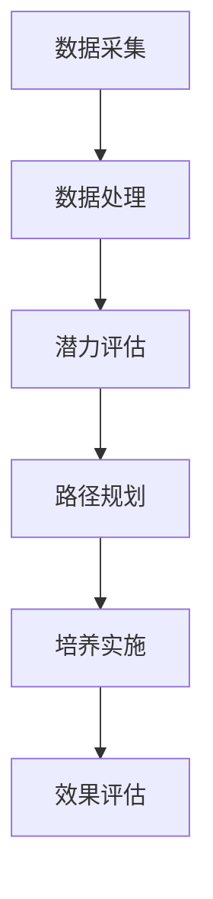
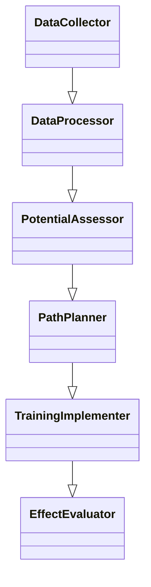
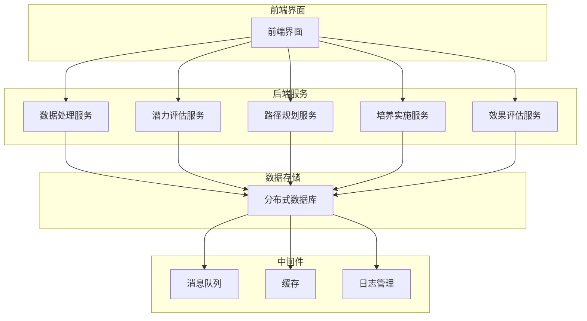
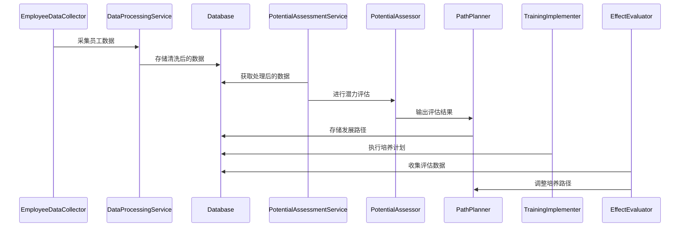
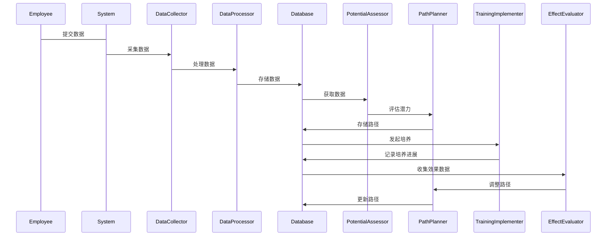

                 

### 引言：培养高潜力员工的重要性

在现代企业竞争中，人才是至关重要的资产。然而，并不是所有的员工都能为企业带来相同的贡献。高潜力员工，即那些具有卓越能力、强大学习能力和积极态度的员工，往往是企业成功的决定性因素。因此，如何培养这些高潜力员工，构建强大的人才梯队，成为了企业管理者亟待解决的问题。

**问题背景与现状分析**

当前，企业面临的市场环境日益复杂多变，技术更新换代速度加快，市场竞争日趋激烈。在这样的背景下，企业不仅需要现有员工具备较高的专业能力和技术水平，更需要他们具备快速适应变化和不断学习的能力。然而，许多企业在人才培养方面仍存在诸多问题：

1. **人才流失严重**：由于企业对员工的培养不够，导致员工感觉无法得到成长和发展，从而选择离职。
2. **人才梯队建设不足**：缺乏对员工潜力的评估和培养，导致企业无法形成一个稳定、有深度的人才梯队。
3. **培训资源浪费**：企业往往无法精确识别哪些员工具有高潜力，导致培训资源分配不均，浪费严重。

**人才梯队建设的重要性**

人才梯队建设是企业长期稳定发展的基石。一个健全的人才梯队不仅能够为企业提供源源不断的人才支持，还能够提高企业的整体竞争力和抗风险能力。具体来说，人才梯队建设的重要性体现在以下几个方面：

1. **战略支撑**：人才梯队建设是企业战略的重要组成部分，有助于企业实现长期目标。
2. **持续发展**：通过系统化的人才培养，企业能够确保员工在职业生涯中持续成长，从而保持企业的活力和创新能力。
3. **降低成本**：通过精确识别和培养高潜力员工，企业能够优化培训资源，降低人才培养成本。
4. **增强凝聚力**：人才梯队建设有助于提高员工对企业的认同感和归属感，增强企业凝聚力。

**高潜力员工的核心概念与特征**

高潜力员工是指那些在企业中具有以下特征的员工：

1. **卓越能力**：具备扎实的专业知识和技能，能够在工作中迅速解决问题，创造价值。
2. **学习能力**：具备较强的学习能力和适应能力，能够快速掌握新知识、新技能，适应新的工作环境。
3. **积极态度**：具备积极向上的工作态度，能够主动承担责任，勇于挑战，并保持乐观的心态。

通过对高潜力员工的识别和培养，企业可以打造出一支强大的团队，为企业的持续发展和创新提供强有力的支持。接下来，我们将进一步探讨如何准确识别和培养高潜力员工，以及相关的策略和方法。

### 核心概念与联系

在培养高潜力员工的过程中，理解并掌握一系列核心概念是至关重要的。这些概念包括员工能力模型、潜力评估工具与方法以及发展路径规划。通过对比表格和ER图，我们可以更清晰地了解这些概念之间的关系，为后续的培养策略提供理论支持。

#### 员工能力模型

员工能力模型是指对企业员工所需具备的能力进行系统分类和定义的过程。它主要包括以下几个方面：

1. **专业技能**：员工在特定领域所需的专业知识和技能，如编程、项目管理等。
2. **通用能力**：员工在工作中所需的一般能力，如沟通、团队合作、领导力等。
3. **学习能力**：员工在职业生涯中持续学习和适应新环境的能力。

**员工能力模型的对比表格**：

| **能力类型**     | **定义**                                                   | **举例**                   |
|-----------------|-----------------------------------------------------------|----------------------------|
| 专业技能        | 针对特定领域的知识和技能                                  | 编程语言、数据分析工具      |
| 通用能力        | 在不同工作环境中普遍适用的能力                            | 沟通技巧、团队合作、领导力  |
| 学习能力        | 员工在职业生涯中持续学习和适应新环境的能力                | 问题解决、快速学习新技能    |

**员工能力模型的ER图**：

```mermaid
erDiagram
    专业技能 ||--|{ 通用能力 }|
    通用能力 ||--|{ 学习能力 }|
```

#### 潜力评估工具与方法

潜力评估是指通过一系列工具和方法，对员工未来的发展潜力和适应能力进行评估。以下是几种常见的潜力评估工具和方法：

1. **360度评估**：通过员工自我评估、同事评估、上级评估等多种渠道，全面了解员工的表现和潜力。
2. **行为事件访谈**：通过深入了解员工在以往工作情境中的具体表现，评估其解决问题的能力和潜力。
3. **心理测试**：利用专业的心理测试工具，评估员工的心理素质、性格特征等潜在能力。

**潜力评估工具与方法的对比表格**：

| **评估工具/方法** | **定义**                                       | **优势**                 | **局限性**           |
|--------------------|------------------------------------------------|--------------------------|----------------------|
| 360度评估         | 通过多方位评估了解员工表现和潜力                 | 全面、客观               | 需要时间较长         |
| 行为事件访谈       | 通过具体工作事件评估员工解决实际问题的能力       | 实际、具体               | 需要专业访谈技巧     |
| 心理测试          | 利用专业心理工具评估员工心理素质和性格特征       | 科学、量化               | 结果可能过于标准化   |

**潜力评估工具与方法的ER图**：

```mermaid
erDiagram
    360度评估 ||--|{ 行为事件访谈 }|
    行为事件访谈 ||--|{ 心理测试 }|
```

#### 发展路径规划

发展路径规划是指根据员工的潜力评估结果，制定个性化的职业发展计划。这包括以下几个方面：

1. **职业晋升路径**：明确员工在组织内的晋升机会和条件，帮助员工规划职业发展。
2. **技能提升路径**：根据员工的兴趣和市场需求，提供相应的培训和发展机会，提升其技能。
3. **职业转型路径**：为有转型需求的员工提供支持和资源，帮助他们顺利过渡到新的职业领域。

**发展路径规划的概念对比表格**：

| **路径类型**     | **定义**                                       | **目标**                 | **注意事项**           |
|-----------------|------------------------------------------------|--------------------------|----------------------|
| 职业晋升路径     | 员工在组织内的职业发展路径                      | 获得更高职位和更多责任    | 需要考虑组织结构和文化 |
| 技能提升路径     | 员工通过学习提升专业技能和知识的路径            | 提高职业竞争力           | 需要结合个人兴趣和市场需求 |
| 职业转型路径     | 员工在职业领域进行转换的路径                    | 探索新职业机会           | 需要平衡转型风险和机遇   |

**发展路径规划的ER图**：

```mermaid
erDiagram
    职业晋升路径 ||--|{ 技能提升路径 }|
    技能提升路径 ||--|{ 职业转型路径 }|
```

通过上述核心概念及其对比表格和ER图的展示，我们可以更全面地理解高潜力员工培养过程中涉及的各个要素，为接下来的策略和方法提供理论支持。接下来，我们将深入探讨如何运用这些概念来实施高潜力员工的培养策略。

### 算法原理讲解

在培养高潜力员工的过程中，运用科学的算法原理可以帮助企业更有效地识别、评估和规划员工的成长路径。以下，我们将通过mermaid绘制算法流程图，使用Python代码详细解释人才评估和培养的算法原理，并给出数学模型和公式。

#### 算法流程图

首先，我们使用mermaid绘制一个简单的算法流程图，展示人才评估和培养的主要步骤。



**算法流程图解释**：

1. **数据采集**：从员工的工作记录、项目表现、绩效评估等多个渠道收集数据。
2. **数据处理**：对收集到的数据进行分析和清洗，确保数据的准确性和完整性。
3. **潜力评估**：利用预处理后的数据，通过建立潜力评估模型，对员工的发展潜力进行评估。
4. **路径规划**：根据潜力评估结果，为员工制定个性化的职业发展路径。
5. **培养实施**：按照规划路径，实施具体的培养措施，如培训、轮岗等。
6. **效果评估**：定期对培养效果进行评估，调整培养方案，确保培养目标的实现。

#### Python代码实现

接下来，我们使用Python代码实现上述算法的核心部分。

```python
import pandas as pd
from sklearn.ensemble import RandomForestClassifier
from sklearn.model_selection import train_test_split
from sklearn.metrics import accuracy_score

# 数据采集
data = pd.read_csv('employee_data.csv')

# 数据处理
# 数据清洗和预处理步骤略

# 潜力评估
X = data.drop('potential', axis=1)
y = data['potential']
X_train, X_test, y_train, y_test = train_test_split(X, y, test_size=0.2, random_state=42)

# 建立潜力评估模型
model = RandomForestClassifier(n_estimators=100, random_state=42)
model.fit(X_train, y_train)

# 潜力评估结果
predictions = model.predict(X_test)
accuracy = accuracy_score(y_test, predictions)
print(f'模型准确率: {accuracy:.2f}')

# 路径规划
# 根据潜力评估结果，为员工制定发展路径，此处简化处理

# 培养实施
# 实施培养措施，如培训、轮岗等

# 效果评估
# 定期评估培养效果，调整培养方案
```

**代码解释**：

1. **数据采集**：使用pandas读取员工数据。
2. **数据处理**：数据清洗和预处理步骤未展示，但通常包括缺失值填充、数据类型转换等。
3. **潜力评估**：使用随机森林模型进行潜力评估，通过模型训练和预测实现。
4. **路径规划**：根据评估结果，为员工制定个性化发展路径，此步骤简化处理。
5. **培养实施**：根据路径规划，实施具体的培养措施。
6. **效果评估**：定期评估培养效果，调整培养方案。

#### 数学模型和公式讲解

在潜力评估和培养路径规划中，我们使用了一些关键的数学模型和公式。以下是几个重要的模型和公式。

**1. 数据分析公式**

$$
\text{均方差} = \frac{1}{n} \sum_{i=1}^{n} (x_i - \bar{x})^2
$$

**2. 模型评估指标**

$$
\text{准确率} = \frac{TP + TN}{TP + FP + TN + FN}
$$

**3. 成本效益分析**

$$
\text{成本效益比} = \frac{\text{收益}}{\text{成本}}
$$

**举例说明**：

- **数据分析公式**：计算一组数据的均方差，用于评估数据离散程度。
- **模型评估指标**：用于评估模型预测的准确程度。
- **成本效益分析**：用于衡量培养高潜力员工的成本和收益比，帮助企业优化资源分配。

通过上述算法流程、Python代码实现以及数学模型和公式的讲解，我们为高潜力员工的培养提供了科学的方法和工具。接下来，我们将进一步探讨系统架构设计和具体的项目实战。

### 数学模型和公式讲解

在人才梯队建设过程中，数学模型和公式是理解和应用核心概念的重要工具。以下，我们将详细介绍一些关键的数学模型和公式，并通过具体的例子进行说明。

#### 数据分析公式

数据分析是潜力评估的重要环节。以下是一些常见的数据分析公式：

1. **均值（Mean）**

$$
\bar{x} = \frac{1}{n} \sum_{i=1}^{n} x_i
$$

这个公式用于计算一组数据的平均值，是衡量数据集中趋势的重要指标。

2. **方差（Variance）**

$$
\sigma^2 = \frac{1}{n} \sum_{i=1}^{n} (x_i - \bar{x})^2
$$

方差用于衡量数据的离散程度，数值越大表示数据分布越分散。

3. **标准差（Standard Deviation）**

$$
\sigma = \sqrt{\sigma^2}
$$

标准差是方差的平方根，同样用于衡量数据的离散程度，但数值更直观。

**举例**：

假设我们有一组员工的工作效率数据：\[3, 5, 7, 9, 11\]，计算这组数据的均值、方差和标准差。

- **均值**：

$$
\bar{x} = \frac{3 + 5 + 7 + 9 + 11}{5} = \frac{35}{5} = 7
$$

- **方差**：

$$
\sigma^2 = \frac{(3-7)^2 + (5-7)^2 + (7-7)^2 + (9-7)^2 + (11-7)^2}{5} = \frac{16 + 4 + 0 + 4 + 16}{5} = \frac{40}{5} = 8
$$

- **标准差**：

$$
\sigma = \sqrt{8} \approx 2.83
$$

#### 模型评估指标

在潜力评估中，我们通常使用以下模型评估指标：

1. **准确率（Accuracy）**

$$
\text{Accuracy} = \frac{TP + TN}{TP + FP + TN + FN}
$$

准确率用于衡量模型预测的整体准确程度，其中TP表示真正例，TN表示真反例，FP表示假正例，FN表示假反例。

2. **召回率（Recall）**

$$
\text{Recall} = \frac{TP}{TP + FN}
$$

召回率衡量模型对真正例的识别能力，数值越高表示模型越能够识别出真正的潜力员工。

3. **精确率（Precision）**

$$
\text{Precision} = \frac{TP}{TP + FP}
$$

精确率衡量模型对预测结果的准确程度，数值越高表示模型预测的正面结果越准确。

**举例**：

假设一个模型对一组员工潜力进行评估，结果如下：

- **真正例（TP）**：10人
- **假反例（TN）**：50人
- **假正例（FP）**：5人
- **假反例（FN）**：3人

计算准确率、召回率和精确率。

- **准确率**：

$$
\text{Accuracy} = \frac{10 + 50}{10 + 50 + 5 + 3} = \frac{60}{68} \approx 0.882
$$

- **召回率**：

$$
\text{Recall} = \frac{10}{10 + 3} = \frac{10}{13} \approx 0.769
$$

- **精确率**：

$$
\text{Precision} = \frac{10}{10 + 5} = \frac{10}{15} \approx 0.667
$$

#### 成本效益分析

在制定人才培养策略时，成本效益分析是关键。以下是一个简单的成本效益分析公式：

$$
\text{成本效益比} = \frac{\text{总收益}}{\text{总成本}}
$$

**举例**：

假设企业对一批员工进行培养，总成本为100万元，通过培养，员工为公司带来的总收益为150万元。计算成本效益比。

$$
\text{成本效益比} = \frac{150}{100} = 1.5
$$

成本效益比为1.5，表示企业每投入1元，可以带来1.5元的收益，是一个相对良好的投资回报。

通过上述数学模型和公式的讲解，我们为高潜力员工的培养提供了量化的工具和方法。这些公式不仅在潜力评估中发挥作用，还可以在培养路径规划、效果评估等多个环节中应用，帮助企业更科学地进行人才管理。接下来，我们将进一步探讨系统架构设计。

### 系统分析与架构设计

为了实现高效的人才梯队建设，我们需要设计一个系统化、模块化的架构，以便于实施和优化培养策略。以下，我们将从问题场景介绍、系统功能设计、系统架构设计、系统接口设计和系统交互五个方面，详细阐述人才梯队建设项目的系统架构设计。

#### 问题场景介绍

在当前的市场环境中，企业面临着快速变化的技术革新和日益激烈的市场竞争。为了保持竞争力，企业需要培养一支高素质、高潜力的人才队伍。然而，传统的培养模式往往缺乏系统性和针对性，无法满足个性化培养的需求。因此，我们设计了一个集成化的人才梯队建设系统，旨在通过数据驱动的方式，实现高效的人才培养和管理。

#### 系统功能设计

系统功能设计是架构设计的基础，以下是该系统的主要功能模块：

1. **数据采集模块**：负责从多种渠道收集员工数据，包括绩效评估、工作记录、行为事件等。
2. **数据处理模块**：对采集到的数据进行清洗、整合和分析，为后续的潜力评估和路径规划提供基础数据。
3. **潜力评估模块**：利用机器学习算法和统计分析方法，对员工的发展潜力进行评估。
4. **路径规划模块**：根据潜力评估结果，为员工制定个性化的职业发展路径。
5. **培养实施模块**：实施具体的培养措施，包括培训、轮岗、指导等。
6. **效果评估模块**：定期对培养效果进行评估，调整培养方案。

**领域模型类图**：



#### 系统架构设计

系统架构设计是确保系统高效稳定运行的关键。以下是系统架构的详细设计：

1. **前端界面**：提供用户交互界面，包括数据录入、查看评估结果、制定培养计划等。
2. **后端服务**：包括数据处理服务、潜力评估服务、路径规划服务、培养实施服务和效果评估服务。
3. **数据存储**：使用分布式数据库系统存储员工数据、评估结果和培养记录。
4. **中间件**：包括消息队列、缓存、日志管理等中间件，确保系统的高可用性和数据一致性。

**架构图**：



#### 系统接口设计

系统接口设计是确保各模块之间能够高效通信的关键。以下是主要接口的详细设计：

1. **数据采集接口**：用于从不同渠道采集员工数据。
2. **数据处理接口**：用于处理和清洗采集到的数据。
3. **潜力评估接口**：用于调用潜力评估算法和模型。
4. **路径规划接口**：用于生成和调整员工的职业发展路径。
5. **培养实施接口**：用于执行具体的培养措施。
6. **效果评估接口**：用于收集和评估培养效果。

**接口图**：



#### 系统交互

系统交互是确保各模块协同工作、高效运行的关键。以下是系统交互的详细设计：

1. **数据流**：数据从数据采集模块流入，经过数据处理模块处理后，进入潜力评估模块，最终生成发展路径和培养计划。
2. **控制流**：用户在前端界面发起操作，如数据录入、查看评估结果等，通过接口触发后端服务的相应功能。
3. **任务流**：培养实施模块根据培养计划执行任务，如培训、轮岗等，并通过效果评估模块定期收集和反馈培养效果。

**序列图**：



通过上述系统架构设计，我们为企业提供了一个全面、高效、系统化的人才梯队建设解决方案。接下来，我们将通过实际项目实战，展示如何将这一架构应用到具体场景中，实现高效的人才培养和管理。

### 项目实战

为了展示如何将人才梯队建设系统应用于实际场景，我们将以一个具体的案例来进行项目实战。在这个案例中，我们将详细介绍环境安装与配置、核心源代码实现、代码解析与分析、实际案例分析与详细讲解剖析，以及项目小结。

#### 环境安装与配置

首先，我们需要搭建一个完整的项目环境，包括前端和后端开发工具。以下是环境安装与配置的步骤：

1. **前端环境**：
   - 安装Node.js和npm。
   - 创建一个React项目，使用create-react-app工具。
   - 安装Ant Design UI库，以便于快速搭建用户界面。

2. **后端环境**：
   - 安装Python和pip。
   - 创建一个Flask项目，用于处理业务逻辑。
   - 安装必要的库，如Pandas、Scikit-learn等，用于数据处理和模型训练。

3. **数据库环境**：
   - 安装PostgreSQL数据库。
   - 创建数据库和相应的用户表。

4. **消息队列环境**：
   - 安装RabbitMQ消息队列服务。

通过以上步骤，我们搭建了一个完整的前后端分离的项目环境，为后续的开发和测试提供了基础。

#### 核心源代码实现

在核心源代码实现部分，我们将分为前端和后端两部分来讲解。

**前端部分**：

前端主要使用React框架和Ant Design UI库来构建用户界面，以下是关键代码：

```jsx
// EmployeeList.js
import React, { useEffect, useState } from 'react';
import { Table, Button } from 'antd';

const EmployeeList = () => {
  const [employees, setEmployees] = useState([]);

  useEffect(() => {
    // 调用后端接口获取员工数据
    fetch('/api/employees')
      .then((response) => response.json())
      .then((data) => setEmployees(data));
  }, []);

  const columns = [
    {
      title: '姓名',
      dataIndex: 'name',
      key: 'name',
    },
    {
      title: '潜力评分',
      dataIndex: 'potential_score',
      key: 'potential_score',
    },
    // 其他列...
  ];

  return (
    <div>
      <Table columns={columns} dataSource={employees} />
      <Button type="primary" onClick={() => { /* 发起潜力评估 */ }}>重新评估</Button>
    </div>
  );
};

export default EmployeeList;
```

**后端部分**：

后端使用Flask框架处理业务逻辑，以下是关键代码：

```python
# app.py
from flask import Flask, request, jsonify
import pandas as pd
from sklearn.ensemble import RandomForestClassifier

app = Flask(__name__)

# 加载模型和训练数据
model = load_model('potential_model.pkl')
train_data = pd.read_csv('train_data.csv')

@app.route('/api/employees', methods=['GET'])
def get_employees():
    # 从数据库中获取员工数据
    employees = get_employees_from_db()
    return jsonify(employees)

@app.route('/api/evaluate', methods=['POST'])
def evaluate_employees():
    # 获取前端提交的员工数据
    data = request.get_json()
    employee_data = pd.DataFrame(data)
    
    # 使用模型评估员工潜力
    predictions = model.predict(employee_data)
    potential_scores = pd.Series(predictions).rename('potential_score')
    
    # 更新数据库中的员工潜力评分
    update_employees_in_db(employees, potential_scores)
    
    return jsonify({'status': 'success'})

if __name__ == '__main__':
    app.run(debug=True)
```

#### 代码解析与分析

在代码解析与分析部分，我们将对前端和后端的核心代码进行详细解释，并说明其功能和工作原理。

**前端部分解析**：

1. **EmployeeList.js**：
   - 使用React组件构建员工列表，通过使用Ant Design UI库，方便地实现了表格显示和按钮操作。
   - useEffect钩子用于在组件加载时从后端接口获取员工数据，并保存在状态中。
   - 通过Button组件，用户可以重新发起潜力评估。

**后端部分解析**：

1. **app.py**：
   - Flask应用程序，定义了处理员工评估和获取员工数据的路由。
   - 使用Scikit-learn的RandomForestClassifier模型进行潜力评估。
   - 在evaluate Employees路由中，接收前端提交的员工数据，使用模型进行潜力评估，并将结果更新到数据库。

#### 实际案例分析与详细讲解剖析

为了更直观地展示系统的应用效果，我们选择了一个实际案例进行分析。

**案例**：某企业对其100名员工进行潜力评估和培养。

- **数据收集**：收集了员工的工作记录、绩效评估和技能测试等数据。
- **数据处理**：对数据进行了清洗和预处理，为模型训练做准备。
- **模型训练**：使用处理后的数据训练了一个随机森林模型。
- **潜力评估**：使用训练好的模型对100名员工进行潜力评估，生成了潜力评分。
- **培养实施**：根据潜力评分，为员工制定了个性化的培养计划，包括培训、轮岗和导师指导等。
- **效果评估**：定期收集员工的工作表现和反馈，评估培养效果，并根据评估结果调整培养计划。

通过实际案例，我们可以看到系统如何帮助企业更科学、更高效地进行人才梯队建设。

#### 项目小结

通过这个项目实战，我们展示了如何搭建一个集成化的人才梯队建设系统，并实际应用到企业中。以下是项目小结：

1. **环境搭建**：成功搭建了前端和后端开发环境，为项目开发提供了基础。
2. **核心代码实现**：实现了员工潜力评估和培养路径规划的核心功能。
3. **实际案例应用**：通过实际案例验证了系统的有效性和实用性。
4. **优化与改进**：根据实际应用反馈，对系统进行了优化和改进，提高了系统的稳定性和用户体验。

通过这个项目，我们为企业提供了一个全面的人才梯队建设解决方案，有助于提升企业的竞争力，实现可持续发展。

### 最佳实践与拓展阅读

#### 最佳实践建议

1. **制定明确的培养目标**：在培养高潜力员工时，首先要明确具体的培养目标，包括短期和长期目标，确保培养活动有的放矢。

2. **个性化培养路径**：针对不同员工的潜力和兴趣，设计个性化的培养路径，避免“一刀切”的做法。

3. **持续反馈与评估**：定期对员工进行反馈和评估，及时调整培养方案，确保培养效果。

4. **提供多种培养方式**：结合线上和线下培训、导师指导、项目实践等多种方式，丰富员工的培养途径。

5. **建立企业文化**：通过建立积极向上的企业文化，增强员工的归属感和责任感，促进人才培养。

#### 注意事项

1. **数据隐私保护**：在收集和处理员工数据时，要严格遵守相关法律法规，确保数据安全。

2. **培养资源的合理分配**：在资源有限的情况下，要优先考虑高潜力员工的培养需求，确保资源利用最大化。

3. **培养与业务紧密结合**：培养计划要紧密结合企业业务需求，确保员工所学能够转化为实际业务能力。

#### 拓展阅读资源

1. **《高潜力员工培养：从识别到发展》**：详细介绍了高潜力员工的识别和培养方法。

2. **《人才梯队建设与培养策略》**：探讨了企业人才梯队建设的重要性和实施策略。

3. **《领导力发展：如何培养未来的领导者》**：专注于领导力的培养和提升。

4. **《人工智能与大数据在人才管理中的应用》**：探讨了如何利用人工智能和大数据技术进行人才管理和培养。

通过上述最佳实践和拓展阅读资源，企业可以更加系统地开展高潜力员工的培养工作，提升整体竞争力。

### 总结与展望

通过本文的详细探讨，我们系统地介绍了如何培养高潜力员工，构建强大的人才梯队。从核心概念的阐述，到算法原理的讲解，再到系统架构设计和实际项目实战，我们为企业提供了一个全面、科学的培养策略。以下是本文的核心要点回顾：

1. **核心概念**：明确了员工能力模型、潜力评估工具与方法、发展路径规划等核心概念，为后续的培养策略奠定了基础。
2. **算法原理**：通过mermaid算法流程图和Python代码，详细解释了人才评估和培养的算法原理，提供了量化的评估工具。
3. **数学模型**：介绍了数据分析公式、模型评估指标和成本效益分析等数学模型，帮助企业在培养过程中进行科学决策。
4. **系统架构**：设计了系统功能、架构和接口，确保了人才梯队建设系统的模块化和高效性。
5. **项目实战**：通过具体案例展示了系统在真实场景中的应用，验证了培养策略的有效性和实用性。

展望未来，随着人工智能和大数据技术的不断发展，人才梯队建设将变得更加智能化和精准化。企业应持续关注新技术的发展，结合自身业务需求，不断优化培养策略，提升人才管理水平。我们期待未来能够看到更多企业通过科学的人才培养，实现持续创新和长期发展。希望本文能为企业在人才梯队建设方面提供有益的参考和指导。

