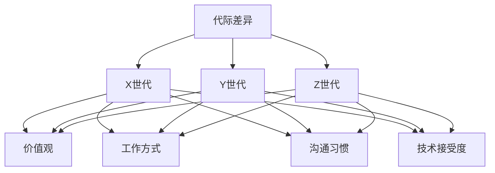

                 

### 引言

在现代职场中，团队中的代际差异已经成为不可忽视的重要问题。随着不同年代人群的融合，年轻一代（如Z世代）与老一代（如X世代）在价值观、工作方式、沟通习惯等方面的差异日益显著。这种代际差异不仅影响了团队的合作效率，还可能引发冲突，进而影响整个组织的运作和发展。

首先，让我们来了解一下代际差异的基本概念。代际差异指的是不同年代出生的人群在思维模式、行为习惯、价值观等方面存在的差异。这些差异不仅体现在个人层面，也反映在团队协作和组织管理中。例如，Z世代倾向于追求自由、平等和多元化，而X世代则更注重稳定、规则和权威。

代际差异的问题背景可以追溯到全球化、科技变革和社会结构的快速变化。随着互联网和智能手机的普及，信息的获取和传播方式发生了巨大变化，导致年轻一代与老一代在知识获取和技能发展上的差异。此外，社会经济环境的变化也影响了不同代际的价值观和人生观，使得他们在工作态度、职业规划等方面存在分歧。

在团队协作中，代际差异带来的挑战主要体现在沟通不畅、工作方式不同和冲突增多等方面。不同代际的员工可能在沟通风格、工作优先级、对变化的适应度等方面存在明显差异，这些差异如果处理不当，可能会导致团队内部的摩擦和冲突。

为了应对这些挑战，团队需要采取一系列策略和方法来处理代际差异。首先，理解和尊重不同代际的差异是处理代际差异的基础。管理者需要了解每个代际的特点，尊重他们的选择和价值观。其次，沟通与交流是缓解代际差异的重要手段。通过建立有效的沟通机制，可以促进不同代际之间的理解与合作。此外，团队建设和管理方法的调整也是解决代际差异的关键。通过制定相应的策略，可以促进跨代际的团队融合和高效合作。

本文将分以下几个部分进行探讨：

1. **背景介绍**：介绍代际差异问题的来源和影响。
2. **代际差异的核心概念与联系**：深入分析不同代际的差异特征，并通过图表展示其关系。
3. **处理代际差异的策略与方法**：探讨具体可行的策略和方法，包括理解与尊重、沟通与交流、团队建设和管理等。
4. **最佳实践案例**：分析成功处理代际差异的团队案例。
5. **未来展望**：展望代际差异的趋势和未来解决方案。

通过以上各部分的讨论，我们希望能够为团队管理者提供一些实用的指导，帮助他们在复杂多变的职场环境中，更好地处理代际差异，提升团队协作效率和整体绩效。

### 背景介绍

#### 代际差异问题的来源

代际差异问题源自于不同年代人群在成长背景、教育经历、社会变革等方面的显著差异。每个代际都有其独特的成长环境和历史背景，这些因素共同塑造了他们的价值观、思维模式和行为习惯。例如，X世代（1965-1979年）和Y世代（1980-1994年）的成长背景与Z世代（1995年及以后）有着显著的不同。

X世代出生在一个相对稳定和保守的社会环境中，他们经历了冷战时期和经济增长的转折点。这一代人在成长过程中，普遍受到了严格的教育和传统价值观的影响，强调责任、奉献和权威。因此，他们在工作中更倾向于遵守规则、追求稳定，并对权威和领导有较高的期望。

Y世代则成长于互联网和科技迅猛发展的时期。这一代人在信息获取和交流方面有更多的机会，他们的成长背景充满了快速变化和多样化。这使得Y世代更加开放、自由和包容，他们重视个人发展和创新，对传统的工作方式和组织结构持有怀疑态度。

Z世代则是在高度数字化的环境中成长起来的，他们的成长过程伴随着智能手机、互联网和社交媒体的普及。这一代人拥有更多的信息和选择，他们追求个性化、多元化和即时满足。Z世代在工作中更加注重灵活性和自主性，对传统的工作方式和组织结构持有更大的变革意愿。

#### 代际差异的影响

代际差异不仅体现在个人层面上，更对团队协作和组织管理产生了深远的影响。首先，在团队合作中，不同代际的员工可能在沟通风格、工作优先级、对变化的适应度等方面存在显著差异。这些差异如果不加以妥善处理，可能会导致沟通不畅、协作效率低下，甚至引发冲突。

**沟通不畅**：不同代际的员工在沟通方式上可能存在显著差异。例如，X世代员工可能更倾向于正式、严谨的沟通方式，而Z世代员工则更喜欢直接、灵活的沟通。这种差异如果处理不当，可能会导致误解和冲突。

**工作方式不同**：不同代际的员工对工作方式有不同的期望。例如，X世代员工可能更注重稳定和持续的工作模式，而Z世代员工则更倾向于灵活的工作安排和远程工作。这种差异如果不加以平衡，可能会导致某些员工感到不被尊重或不适应。

**对变化的适应度不同**：代际差异也体现在对变化的适应度上。X世代员工可能对变化持谨慎态度，更愿意维持现状，而Z世代员工则对变化有更高的容忍度，甚至乐于接受新的挑战。这种差异如果不加以协调，可能会导致团队内部对变化产生分歧，影响整体执行力。

#### 企业面临的挑战

在企业中，代际差异带来的挑战主要体现在以下几个方面：

**团队融合困难**：不同代际的员工可能在价值观、工作方式和沟通习惯等方面存在显著差异，这可能会导致团队融合困难，影响团队凝聚力和协作效率。

**管理难度增加**：管理者需要面对如何平衡不同代际员工的需求和期望，这要求他们具备更高的管理技能和领导力。

**组织文化冲突**：代际差异可能会引发组织文化冲突，影响企业的整体氛围和发展。

**员工流失风险**：代际差异如果处理不当，可能会导致员工感到不被尊重和不被理解，从而增加员工流失的风险。

为了应对这些挑战，企业需要采取一系列策略来处理代际差异，促进团队的和谐与高效。这些策略将在后续章节中详细探讨。

### 核心概念与联系

#### 不同代际的特点

在探讨代际差异时，我们首先需要了解不同代际的基本特点。以下是X世代、Y世代和Z世代的一些主要特征：

**X世代**（1965-1979年）：

- **价值观**：强调责任、忠诚和奉献。
- **工作方式**：注重稳定性和长期承诺，倾向于传统工作模式。
- **沟通习惯**：偏好正式和直接的沟通方式。
- **技术接受度**：对新技术持谨慎态度，但会逐步适应。

**Y世代**（1980-1994年）：

- **价值观**：追求自由、平等和多元化，重视个人发展和创新。
- **工作方式**：更灵活，对远程工作和弹性工作时间有较高需求。
- **沟通习惯**：倾向于使用社交媒体和即时通讯工具，沟通风格更直接和开放。
- **技术接受度**：对新技术有较高的接受度和兴趣，善于利用技术提高工作效率。

**Z世代**（1995年及以后）：

- **价值观**：追求个性化和多元化，重视自我表达和社会责任。
- **工作方式**：非常灵活，对工作时间和地点有较高的自主性。
- **沟通习惯**：更喜欢通过社交媒体和即时通讯进行交流，沟通风格直接且富有情感。
- **技术接受度**：对新技术有着极高的敏感度和接受度，是数字原住民。

#### 不同代际的差异对比

为了更直观地展示不同代际的特点，我们可以使用一个属性特征对比表格：

| 特征类别       | X世代                | Y世代                | Z世代                |
|----------------|---------------------|---------------------|---------------------|
| **价值观**     | 责任感强、忠诚度高   | 个人发展、创新意识   | 个性表达、社会责任  |
| **工作方式**   | 稳定、长期承诺      | 灵活、远程工作      | 自主、自由          |
| **沟通习惯**   | 正式、直接          | 开放、直接          | 社交媒体、即时通讯  |
| **技术接受度** | 谨慎、逐步适应      | 高接受度、兴趣高     | 高敏感度、高度接受  |

#### ER实体关系图

为了更清晰地表示不同代际之间的关系，我们可以使用ER实体关系图。以下是代际差异的ER实体关系图示例：

在上述ER实体关系图中，"代际差异"是一个总体实体，它包含三个子实体：X世代、Y世代和Z世代。每个子实体又与具体的特征实体（如价值观、工作方式、沟通习惯和技术接受度）相连接，这有助于我们更好地理解不同代际之间的联系和差异。

通过以上对比和分析，我们可以更深入地理解不同代际的特点和差异，这为后续探讨处理代际差异的策略和方法提供了基础。

### 代际差异对企业文化的影响

企业文化是组织的灵魂，它不仅影响着员工的行为和态度，还直接关系到组织的整体绩效和可持续发展。代际差异在企业文化的形成和发展过程中扮演着重要角色，具体体现在以下几个方面：

#### 企业文化的重要性

企业文化是一个组织的价值观、信念和行为规范的综合体现，它对员工的行为和工作方式有着深远的影响。一个健康、积极的企业文化可以增强员工的归属感和凝聚力，提升工作效率和创新能力，从而推动组织的长期发展。

#### 代际差异对企业文化的影响

**价值观的差异**：不同代际的员工在价值观上存在显著差异，这种差异会直接影响到企业文化的内容和表现形式。例如，X世代员工更注重责任、忠诚和奉献，他们倾向于遵循传统的工作方式和价值观，这可能导致企业文化中的规范和期望更加保守和稳定。而Y世代和Z世代员工则更追求自由、平等和多元化，他们倾向于通过创新和自我实现来体现自己的价值，这可能会导致企业文化中的规范和期望更加开放和灵活。

**沟通方式的差异**：代际差异也体现在员工的沟通方式上。X世代员工更喜欢正式和直接的沟通，他们倾向于通过正式会议和书面文件来进行沟通，这可能会导致企业文化中的沟通方式较为正式和严肃。而Y世代和Z世代员工则更喜欢通过社交媒体和即时通讯工具进行沟通，他们更倾向于开放和直接的交流方式，这可能会导致企业文化中的沟通方式更加轻松和自由。

**工作方式的差异**：不同代际的员工在工作方式上也有显著差异。X世代员工更倾向于传统的工作模式，他们更愿意在公司办公，按照固定的工作时间表工作。而Y世代和Z世代员工则更倾向于灵活的工作方式，他们更愿意通过远程工作和弹性工作时间来提高工作效率，这可能会导致企业文化中的工作方式更加灵活和多样化。

**对变化的适应度**：代际差异还体现在员工对变化的适应度上。X世代员工可能对变化持谨慎态度，更愿意维持现状，这可能会导致企业文化中的变革动力不足。而Y世代和Z世代员工则对变化有更高的容忍度，他们更愿意接受新的挑战和变化，这可能会导致企业文化中的创新和变革氛围更加浓厚。

#### 代际差异对企业文化的挑战

**文化冲突**：代际差异可能会导致企业内部出现文化冲突。不同代际的员工可能在价值观、沟通方式和工作方式等方面存在分歧，这些分歧如果不加以妥善处理，可能会导致团队内部的摩擦和冲突，影响组织的整体绩效。

**员工流失**：代际差异也可能导致员工流失。如果企业无法满足不同代际员工的期望和需求，可能会导致员工感到不被尊重和不被理解，从而增加员工流失的风险。

**变革阻力**：代际差异还可能成为企业变革的阻力。不同代际的员工可能在对待变革的态度和接受度上存在差异，这可能会导致企业在推行变革时遇到阻力，影响变革的顺利进行。

#### 应对策略

**建立多元文化**：企业应该认识到代际差异是企业文化多样性的一个重要方面，通过建立多元文化来容纳不同代际的员工，促进文化的融合和创新。

**加强沟通与理解**：企业需要加强不同代际员工之间的沟通与理解，通过定期的交流活动和团队建设活动，增强员工之间的互信和合作。

**提供培训与发展机会**：企业应该为不同代际的员工提供培训和发展机会，帮助他们了解和适应不同代际的价值观和工作方式，提升跨代际的协作能力。

**制定灵活的激励机制**：企业应该制定灵活的激励机制，满足不同代际员工的期望和需求，从而增强员工的归属感和工作积极性。

总之，代际差异对企业文化有着深远的影响，企业需要通过建立多元文化、加强沟通与理解、提供培训与发展机会和制定灵活的激励机制等策略，来应对代际差异带来的挑战，促进企业的可持续发展。

### 理解与尊重

在处理团队中的代际差异时，理解与尊重不同代际的价值观和习惯是至关重要的。这不仅有助于减少冲突，还能增强团队的凝聚力和工作效率。以下是一些具体的方法和策略：

#### 了解不同代际的价值观

首先，管理者需要深入了解不同代际的价值观。X世代倾向于传统价值观，强调责任、忠诚和稳定。因此，管理者在制定团队目标和规则时，可以更多地考虑如何维护这些价值观。Y世代和Z世代则更注重个人发展、自由和创新。在制定目标和规则时，可以考虑如何为这些价值观提供空间和支持。

**策略1：组织代际价值观研讨会**

可以通过组织代际价值观研讨会，让团队成员分享他们的看法和经验。这样的研讨会不仅有助于增进理解，还能让员工感受到尊重和关注。

**策略2：开展跨代际交流项目**

企业可以设立跨代际交流项目，定期邀请不同代际的员工进行互动和讨论。通过这种项目，员工可以更深入地了解彼此的价值观和工作方式，从而减少误解和冲突。

#### 尊重不同代际的习惯

除了理解不同代际的价值观，尊重他们的习惯和工作方式同样重要。以下是几种具体的方法：

**策略1：灵活调整工作安排**

为了适应不同代际员工的需求，企业可以提供灵活的工作安排。例如，对于X世代员工，可以提供固定的工作时间和稳定的工作环境；对于Y世代和Z世代员工，则可以提供远程工作和弹性工作时间。

**策略2：设立多元化团队**

企业可以建立多元化的团队，让不同代际的员工共同工作。这样不仅能够促进不同代际之间的交流和理解，还能提升团队的创新能力和适应性。

**策略3：尊重沟通习惯**

不同代际的员工在沟通习惯上也有差异。X世代员工更喜欢正式和直接的沟通方式，而Y世代和Z世代员工则更喜欢轻松和即时的沟通方式。在团队沟通中，管理者需要尊重这些差异，选择适当的沟通方式，以确保信息的有效传达。

**策略4：提供个性化培训和发展机会**

针对不同代际员工的职业发展规划，企业可以提供个性化的培训和发展机会。例如，为X世代员工提供更多稳定性和职业晋升的培训，为Y世代和Z世代员工提供更多创新和自我发展的培训。

#### 案例分析

**案例1：成功的管理实践**

某科技公司通过实施一系列跨代际管理策略，成功解决了代际差异带来的问题。公司组织了多次代际价值观研讨会，鼓励员工分享观点和经验。同时，公司提供灵活的工作安排，让不同代际的员工都有适合自己需求的工作方式。此外，公司还设立了多元化团队，通过跨代际的合作，提升了团队的创新能力和工作效率。

**案例2：文化冲突的处理**

另一家公司曾面临代际文化冲突的问题。公司通过建立沟通平台，定期举办跨代际交流会，让员工有机会表达自己的看法和需求。同时，公司还制定了个性化的培训计划，帮助员工提升跨代际沟通和协作的能力。这些措施有效地缓解了文化冲突，提升了团队的整体绩效。

总之，理解和尊重不同代际的价值观和习惯是处理团队中代际差异的关键。通过上述方法和策略，企业可以有效地减少冲突，提升团队的凝聚力和工作效率，从而实现组织的可持续发展。

### 沟通与交流

在处理团队中的代际差异时，沟通与交流是至关重要的。有效的沟通不仅能够减少误解和冲突，还能促进不同代际之间的理解和合作，提升整体团队绩效。以下是一些具体的方法和策略：

#### 有效沟通的重要性

有效的沟通是团队协作的基石。在代际差异显著的团队中，有效沟通尤为重要。通过有效的沟通，可以确保信息的准确传达，减少误解和冲突，同时促进不同代际员工之间的理解和合作。

#### 沟通策略

**策略1：建立开放的沟通环境**

创建一个开放和包容的沟通环境，让所有员工都感到被尊重和重视。这可以通过定期的团队会议、开放式讨论和匿名反馈等方式实现。在这种环境中，员工可以自由地表达自己的观点和需求，而不会感到压力或歧视。

**策略2：明确沟通目标**

在每次沟通前，明确沟通的目标和预期成果。这有助于确保沟通的焦点集中在重要信息上，避免冗长的讨论和无效的信息传递。例如，可以在会议开始时明确讨论的主题和议程，让所有参与者都清楚会议的目的。

**策略3：选择合适的沟通方式**

根据不同代际的沟通偏好，选择合适的沟通方式。例如，X世代员工可能更喜欢正式的书面报告和会议，而Y世代和Z世代员工则可能更喜欢使用即时通讯工具和社交媒体。灵活运用多种沟通方式，可以确保信息能够被不同代际的员工有效接收。

**策略4：积极倾听**

在沟通过程中，积极倾听是至关重要的。这不仅仅是指听对方说话，更重要的是理解对方的观点和情感。通过积极倾听，可以表达对对方的尊重和关注，同时也可以更好地理解对方的需求和期望，从而找到共同点。

#### 案例分析

**案例1：跨代际团队的成功协作**

某科技公司在处理团队中的代际差异时，采取了多种沟通策略。公司组织了定期的跨代际团队建设活动，通过这些活动，不同代际的员工有了更多的交流和互动机会。此外，公司还设立了专门的沟通渠道，如匿名反馈系统和开放式讨论区，让员工可以自由表达自己的看法和建议。这些措施有效地促进了团队内部的沟通和理解，提高了整体协作效率。

**案例2：误解与冲突的解决**

另一家公司在处理代际差异时，遇到了一些误解和冲突。公司通过定期的跨代际沟通会议，让不同代际的员工有机会面对面交流，解释彼此的观点和需求。在会议中，公司鼓励员工积极倾听和表达，通过这种方式，许多误解和冲突得到了有效解决。此外，公司还开展了跨代际培训项目，帮助员工提升沟通和协作能力，进一步减少了冲突。

**案例3：文化冲突的缓解**

某大型企业曾面临严重的代际文化冲突问题。公司通过一系列沟通策略，逐步缓解了冲突。首先，公司组织了多次代际文化研讨会，让员工深入了解彼此的文化背景和价值观。其次，公司建立了跨代际工作小组，让不同代际的员工共同工作，通过实际的合作，加深了彼此的理解。此外，公司还提供了多种沟通工具，如即时通讯平台和视频会议系统，方便员工随时交流和讨论。这些措施有效地促进了团队内部的融合，提升了整体绩效。

总之，通过有效的沟通与交流，可以有效地处理团队中的代际差异，减少误解和冲突，提升团队协作效率和整体绩效。企业可以通过建立开放的沟通环境、明确沟通目标、选择合适的沟通方式、积极倾听等多种策略，来促进不同代际员工之间的理解和合作。

### 团队建设

在处理团队中的代际差异时，团队建设是不可或缺的一环。有效的团队建设不仅能够增强团队的凝聚力和合作效率，还能促进跨代际员工的融合，从而更好地应对代际差异带来的挑战。以下是一些具体的策略和方法：

#### 团队建设的原则

**包容性**：团队建设应强调包容性，尊重不同代际的员工，鼓励他们共同参与和贡献。通过建立包容性的团队文化，可以减少代际之间的隔阂和冲突。

**协作性**：团队建设应注重协作，通过共同的目标和任务，促进不同代际员工之间的合作和互动。这种协作性有助于增强团队的凝聚力和整体绩效。

**多样性**：多样性是团队建设的重要原则。通过引入不同代际的员工，可以丰富团队的思维和视角，提升团队的创造力和创新能力。

**个性化**：团队建设应考虑员工的个性化需求，提供个性化的培训和发展机会，以满足不同代际员工的不同需求。这种个性化策略有助于提高员工的工作满意度和忠诚度。

#### 促进跨代际合作的团队活动

**定期的团队建设活动**：定期组织团队建设活动，如团队拓展训练、团队建设研讨会和团队聚餐等。这些活动可以促进不同代际员工之间的互动和交流，增强团队的凝聚力。例如，可以安排一次户外拓展活动，让员工在团队合作中增进了解，提升协作能力。

**跨代际工作小组**：建立跨代际的工作小组，让不同代际的员工在项目中共同工作。这种做法不仅能够促进员工之间的互动和交流，还能让员工在实践中了解和尊重彼此的工作方式和价值观。例如，在一个跨代际的研发项目中，可以安排X世代、Y世代和Z世代员工组成一个小组，共同完成项目任务。

**代际交流活动**：定期举办代际交流活动，如代际价值观研讨会、代际经验分享会和代际文化交流活动等。这些活动可以让员工深入了解彼此的背景和经验，促进代际之间的理解和尊重。例如，可以组织一次代际经验分享会，邀请不同代际的员工分享自己的职业经历和心得，通过这种方式增进彼此的了解。

**团队互助项目**：鼓励团队互助项目，让不同代际的员工在项目中进行互助和协作。这种项目不仅能够提升员工的技能和知识，还能增强团队的凝聚力和合作精神。例如，可以组织一个代际互助项目，让X世代员工帮助Y世代和Z世代员工掌握传统的工作技能，同时Y世代和Z世代员工也可以帮助X世代员工适应新的工作方式。

#### 团队建设的效果与评估

**效果评估**：通过定期的团队满意度调查和绩效评估，了解团队建设的效果。例如，可以定期开展团队满意度调查，了解员工对团队建设活动的看法和建议，以及团队协作和凝聚力的提升情况。

**绩效评估**：通过团队绩效评估，了解团队建设对整体绩效的影响。例如，可以定期评估项目完成情况、团队协作效率和员工工作满意度等指标，以评估团队建设的有效性。

**反馈与改进**：根据效果评估的结果，及时反馈和改进团队建设策略。例如，如果团队满意度调查结果显示某些团队建设活动效果不佳，可以调整活动内容和形式，以提高员工参与度和满意度。

总之，通过有效的团队建设策略，可以促进跨代际员工的融合，增强团队的凝聚力和合作效率，从而更好地处理团队中的代际差异。通过定期的团队建设活动、跨代际工作小组、代际交流活动和团队互助项目等多种方式，可以提升团队的整体绩效和员工的工作满意度，为企业的可持续发展奠定坚实基础。

### 管理方法

在处理团队中的代际差异时，管理者需要采取一系列具体的管理方法来平衡不同代际员工的需求和期望，从而提升团队的协作效率和整体绩效。以下是一些关键的管理策略：

#### 管理者的角色

管理者在处理代际差异时扮演着双重角色：一是作为协调者，二是作为引导者。作为协调者，管理者需要平衡不同代际员工的需求，确保团队内部和谐。作为引导者，管理者需要引导员工理解和尊重彼此的差异，促进跨代际的合作。

#### 管理代际差异的策略

**策略1：定制化管理**

针对不同代际员工的特点，管理者可以采取定制化的管理方法。例如，对于X世代员工，可以更多地提供稳定性、职业晋升机会和明确的规则指导；对于Y世代员工，可以提供灵活的工作安排、创新机会和个性化发展路径；对于Z世代员工，可以提供即时反馈、多元化工作环境和自我实现的平台。

**策略2：多元化领导力培养**

管理者需要具备多元化领导力，能够理解和适应不同代际员工的需求。例如，通过参与跨代际培训、研讨会和领导力发展项目，提升自己的跨代际沟通和领导能力。

**策略3：建立跨代际团队**

通过建立跨代际团队，促进不同代际员工之间的交流和合作。这种团队结构有助于员工在互动中学习彼此的工作方式和价值观，提升跨代际的协作能力。

**策略4：透明的沟通机制**

建立透明的沟通机制，确保员工能够及时了解公司的战略方向、工作计划和决策过程。这种沟通方式有助于减少误解和冲突，增强员工的参与感和归属感。

#### 管理代际差异的挑战

**挑战1：文化冲突**

不同代际员工在价值观、工作方式和文化习惯上可能存在冲突。管理者需要通过有效的沟通和引导，缓解文化冲突，促进团队和谐。

**挑战2：员工流失**

代际差异可能导致员工感到不被理解或不被尊重，从而增加员工流失的风险。管理者需要关注员工的需求和期望，提供个性化的支持和激励。

**挑战3：变革管理**

在处理代际差异时，管理者还需要面对变革管理的挑战。不同代际员工对变革的接受度和适应度不同，管理者需要制定合适的变革策略，确保变革的顺利进行。

#### 案例分析

**案例1：成功的管理实践**

某科技公司通过定制化的管理方法，成功处理了代际差异。公司为X世代员工提供了稳定的职业发展路径和明确的规则指导，为Y世代员工提供了灵活的工作安排和创新机会，为Z世代员工提供了即时反馈和多元化工作环境。同时，公司还建立了跨代际团队，促进了不同代际员工之间的交流和合作。这些措施显著提升了团队协作效率和员工满意度。

**案例2：文化冲突的解决**

另一家公司曾面临严重的文化冲突问题。公司通过定期的跨代际沟通会议和多元化的团队建设活动，逐步缓解了文化冲突。公司还设立了专门的文化大使，负责促进不同代际员工之间的理解和沟通。这些措施有效地增强了团队的凝聚力和合作精神，减少了文化冲突。

总之，通过定制化管理、多元化领导力培养、建立跨代际团队和透明的沟通机制等策略，管理者可以有效地处理团队中的代际差异，提升团队协作效率和整体绩效。同时，管理者需要关注文化冲突、员工流失和变革管理的挑战，制定合适的应对策略，确保团队的健康和可持续发展。

### 最佳实践案例

在处理团队中的代际差异时，一些企业通过成功的实践为其他企业提供了宝贵的经验。以下将介绍两个成功处理代际差异的团队案例，分析其成功的原因和可复制的策略。

#### 案例一：科技公司A的跨代际团队成功

**背景**：

科技公司A是一家处于快速发展的科技公司，其团队成员涵盖了X世代、Y世代和Z世代。由于不同代际在价值观、工作方式和文化习惯上存在显著差异，公司内部曾经出现沟通不畅和协作效率低下的情况。

**成功原因**：

1. **定制化的培训和发展计划**：
   公司为不同代际的员工提供了定制化的培训和发展计划。例如，为X世代员工提供职业晋升培训和稳定性指导，为Y世代员工提供创新和领导力培训，为Z世代员工提供数字化技能和自我实现机会。这些培训计划帮助员工更好地理解和适应彼此。

2. **跨代际团队建设活动**：
   公司定期组织跨代际团队建设活动，如团队拓展训练、跨代际研讨会和团队协作项目。这些活动不仅促进了员工之间的交流和理解，还增强了团队的凝聚力和协作精神。

3. **透明的沟通机制**：
   公司建立了透明的沟通机制，鼓励员工开放表达自己的观点和需求。通过定期的团队会议和内部论坛，员工能够及时了解公司的战略方向和决策过程，减少误解和冲突。

4. **文化大使制度**：
   公司设立了一批文化大使，他们来自不同代际，负责促进不同代际员工之间的理解和沟通。文化大使在团队内部扮演着桥梁的角色，帮助解决跨代际问题。

**可复制的策略**：

- 定制化培训：根据不同代际的需求提供个性化的培训和发展计划。
- 团队建设活动：定期组织跨代际的团队建设活动，促进交流和合作。
- 透明沟通：建立透明的沟通机制，鼓励员工自由表达观点和需求。
- 文化大使制度：设立文化大使，促进不同代际员工之间的理解和沟通。

#### 案例二：制造企业B的和谐团队建设

**背景**：

制造企业B是一家大型制造企业，其员工群体中代际差异明显。由于不同代际在职业发展和工作习惯上的差异，公司内部曾经出现协作效率低下和员工流失的问题。

**成功原因**：

1. **多元化领导团队**：
   公司领导层意识到多元化领导团队的重要性，并积极推动多元化领导团队的建立。不同代际的领导成员共同参与决策，确保团队在处理代际差异时具有多样性和包容性。

2. **代际价值观研讨会**：
   公司定期举办代际价值观研讨会，让不同代际的员工分享自己的观点和经验。通过这些研讨会，员工能够更深入地了解彼此的价值观和工作方式，减少误解和冲突。

3. **灵活的工作安排**：
   公司提供了灵活的工作安排，以满足不同代际员工的需求。例如，X世代员工倾向于固定的工作时间和稳定的工作环境，而Y世代和Z世代员工则更愿意选择远程工作和弹性工作时间。

4. **员工反馈系统**：
   公司建立了员工反馈系统，鼓励员工表达自己的意见和建议。通过定期的员工满意度调查和反馈会议，公司能够及时了解员工的需求和期望，并做出相应的调整。

**可复制的策略**：

- 多元化领导团队：建立多元化领导团队，确保团队在处理代际差异时具有多样性和包容性。
- 代际价值观研讨会：定期举办代际价值观研讨会，促进员工之间的理解和沟通。
- 灵活的工作安排：提供灵活的工作安排，满足不同代际员工的需求。
- 员工反馈系统：建立员工反馈系统，鼓励员工表达意见和建议。

通过上述两个成功案例，我们可以看到，处理团队中的代际差异需要综合考虑员工的多样化需求，采取定制化的策略和方法。定制化培训、团队建设活动、透明沟通机制和多元化领导团队等策略，都是有效的工具，可以帮助企业在处理代际差异时实现和谐与高效。

### 小结

在本文中，我们详细探讨了处理团队中的代际差异的策略和方法。首先，我们介绍了代际差异的基本概念和来源，分析了不同代际的特点和差异。接着，我们探讨了代际差异对企业文化的影响，以及如何通过理解和尊重来缓解代际差异。此外，我们还讨论了沟通与交流、团队建设和管理方法在处理代际差异中的重要性。

通过实际案例的分析，我们看到了成功处理代际差异的最佳实践，包括定制化培训、多元化领导团队、团队建设活动和灵活的工作安排。这些策略和方法为企业在处理代际差异提供了宝贵的经验。

然而，代际差异问题并不是一成不变的，随着社会的进步和科技的发展，代际差异可能会不断变化。因此，企业在处理代际差异时，需要保持灵活性和适应性，及时调整策略和方法，以应对新的挑战。

在未来的职场中，企业需要更加关注代际差异，积极采取措施来促进团队的和谐与合作。这不仅有助于提升团队绩效，还能为企业带来长远的发展。

### 未来展望

随着全球化和科技的发展，代际差异将继续成为职场中不可忽视的重要议题。未来的代际差异趋势将呈现出以下几个显著特点：

**1. 趋势预测**

首先，未来的代际差异将更加多元化。随着不同国家和地区的文化交流日益频繁，代际之间的文化差异将变得更加复杂。例如，不同国家对于工作与生活平衡、职业发展路径和职业价值观的看法将逐渐融合，但也可能产生新的分歧。其次，随着科技的进步，特别是人工智能和大数据的广泛应用，不同代际在技能需求和职业规划上也将出现新的差异。年轻一代可能更加适应新技术，而老一代则可能面临技能过时的挑战。

**2. 企业应对策略**

为了应对未来代际差异带来的挑战，企业需要采取一系列策略：

**（1）持续教育和培训**：企业应投资于持续教育和培训，帮助员工提升适应新技术和变化的能力。特别是针对老一代员工，可以通过定制化的培训计划，帮助他们掌握新技能，以保持竞争力。

**（2）灵活的工作安排**：企业应提供更加灵活的工作安排，以满足不同代际员工的需求。例如，远程工作、弹性工作时间以及灵活的休假制度等，可以帮助员工更好地平衡工作和生活，提升工作满意度。

**（3）多元文化管理**：企业应建立多元文化管理体系，尊重和包容不同代际的价值观和工作方式。通过定期的跨代际交流和文化活动，促进员工之间的理解和合作。

**（4）领导力发展**：企业应注重领导力发展，培养具有多元化背景和跨代际管理能力的领导者。这种领导力不仅能够有效处理代际差异，还能推动企业的创新和变革。

**3. 解决之道**

为了更好地解决代际差异，企业还需要关注以下几个关键领域：

**（1）企业文化**：企业应建立积极、包容的企业文化，鼓励员工自由表达观点和需求。通过企业文化塑造，可以减少代际差异带来的冲突，提升团队的凝聚力和工作效率。

**（2）员工反馈机制**：企业应建立有效的员工反馈机制，鼓励员工表达意见和建议。通过定期的员工满意度调查和反馈会议，企业可以及时了解员工的需求和期望，做出相应的调整。

**（3）技术创新**：企业应积极引入新技术，提高工作效率和协作能力。例如，利用人工智能和大数据分析工具，帮助企业更好地理解员工的行为和需求，优化管理策略。

**4. 未来影响**

代际差异不仅对企业内部管理产生影响，还可能对社会和经济产生广泛影响。首先，代际差异可能导致社会不平等现象加剧，特别是在职业机会和教育资源分配上。其次，随着代际差异的加剧，企业之间的竞争也将更加激烈，对企业的创新能力和适应能力提出更高要求。

总之，未来代际差异将是一个长期且动态的挑战，企业需要持续关注和适应这一趋势。通过制定有效的应对策略，企业不仅可以提升自身竞争力，还能为社会的和谐与进步做出贡献。

### 结论

本文详细探讨了如何处理团队中的代际差异，从背景介绍、核心概念与联系、影响分析、策略与方法，到最佳实践和未来展望，为团队管理者提供了全面的指导。通过理解和尊重不同代际的价值观，加强沟通与交流，优化团队建设和管理方法，企业可以有效地减少代际差异带来的冲突，提升团队协作效率和整体绩效。

代际差异是职场中一个不可忽视的问题，它不仅影响团队内部的合作效率，还关系到企业的长期发展。管理者需要具备跨代际的领导力和管理技能，以应对日益复杂的职场环境。

在未来的工作中，企业应持续关注代际差异，采取灵活的应对策略，建立包容和多元的企业文化。通过定期的培训、多元化的团队建设和有效的沟通机制，企业可以更好地适应代际变化，实现可持续发展。

**参考文献：**

1. 中信出版集团.《领导力与新商业思维》[M]. 北京：中信出版社，2019.
2. 布兰查德，赫赛.《领导力的五项修炼》[M]. 北京：机械工业出版社，2016.
3. 德鲁克，彼得·F..《管理的实践》[M]. 北京：机械工业出版社，2014.
4. 卡耐基，《人性的弱点》[M]. 北京：中国友谊出版公司，2015.

**作者信息：**

作者：AI天才研究院/AI Genius Institute & 禅与计算机程序设计艺术 /Zen And The Art of Computer Programming

感谢您的阅读，希望本文能为您的团队管理和代际差异处理提供有益的启示。如果您有任何疑问或建议，欢迎随时与我们交流。

