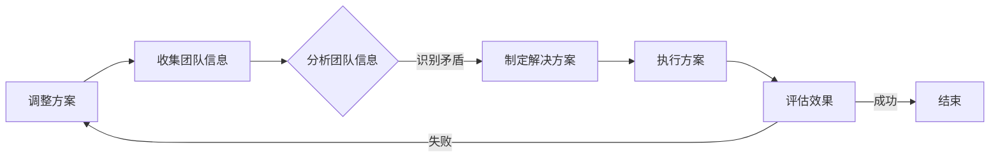
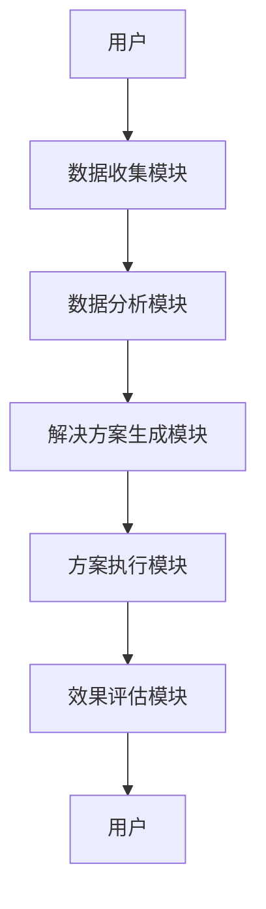
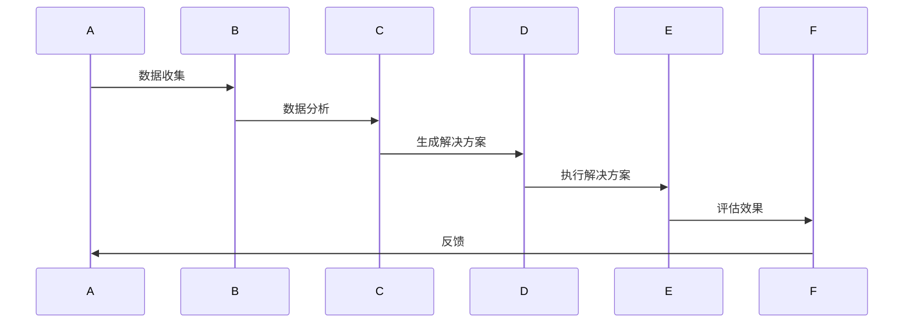

                 

# 如何处理团队内部的矛盾

> 关键词：团队管理、团队冲突、解决策略、沟通技巧、团队协作

> 摘要：本文旨在探讨团队内部矛盾的产生原因及其处理策略。通过逻辑分析和实例讲解，我们将深入探讨如何通过有效的沟通技巧和团队协作方法来缓解和解决团队内部的矛盾，从而提高团队的整体工作效率和凝聚力。

## 引言

在IT行业快速发展的今天，团队协作已成为项目成功的关键因素。然而，团队内部的矛盾和冲突不可避免地会出现，这些矛盾不仅会影响团队成员的情绪和工作状态，还可能对项目的进度和质量造成负面影响。因此，如何处理团队内部的矛盾成为了一个重要的课题。本文将围绕这一问题，结合实际案例，提出一系列解决策略和最佳实践。

## 背景介绍

### 核心概念术语说明

1. **团队内部矛盾**：指团队成员之间由于工作目标、价值观、工作方式等方面的差异而产生的冲突。
2. **沟通技巧**：指在交流过程中，如何有效地表达自己的想法、倾听他人的意见，以达到共识的方法。
3. **团队协作**：指团队成员共同合作，协同完成任务的行动。

### 问题背景

在IT行业中，团队内部的矛盾经常表现为：

- **工作目标不明确**：团队成员对项目的目标和期望存在分歧，导致工作方向不一致。
- **个人价值观差异**：团队成员的价值观、工作风格和习惯差异，可能导致工作过程中的摩擦和冲突。
- **任务分配不公**：团队成员在任务分配上存在不公平感，影响团队士气。

### 问题描述

团队内部矛盾的表现形式多样，常见的包括：

- **冲突和争吵**：团队成员之间的意见不合，可能导致公开的冲突和争吵。
- **消极情绪**：团队成员可能因为矛盾而产生消极情绪，影响工作效率。
- **工作停滞**：矛盾严重时，团队的工作可能停滞不前，影响项目进度。

### 问题解决

解决团队内部矛盾的关键在于预防和及时处理。以下是一些解决策略：

- **明确工作目标**：通过明确的沟通，确保团队成员对项目的目标和期望有共同的理解。
- **尊重个人差异**：尊重团队成员的个人差异，鼓励团队内部的文化多样性。
- **公正的任务分配**：合理分配任务，确保每个成员的职责明确，避免不公平现象。
- **有效的沟通技巧**：通过有效的沟通，解决团队成员之间的分歧和误解。

### 边界与外延

- **团队规模**：团队内部矛盾的严重程度与团队规模有关，大型团队可能需要更复杂的沟通和协调机制。
- **企业文化**：企业文化对团队内部矛盾的处理方式和结果有重要影响。

### 概念结构与核心要素组成

1. **核心概念**：沟通技巧、团队协作、问题解决。
2. **联系**：沟通技巧和团队协作是解决团队内部矛盾的核心手段，问题解决则是最终目标。

## 核心概念与联系

### 核心概念原理

#### 沟通技巧

沟通技巧的核心在于信息的有效传递和接收。有效的沟通技巧包括：

- **明确表达**：清晰、准确地表达自己的观点和需求。
- **倾听他人**：主动倾听他人的意见，理解他人的立场和需求。
- **反馈与确认**：及时给予反馈，确保信息的准确传递。

#### 团队协作

团队协作是指团队成员在共同的目标下，协同工作，共同完成任务的过程。其核心要素包括：

- **分工明确**：每个团队成员都明确自己的职责和任务。
- **相互信任**：团队成员之间建立信任，共同面对挑战。
- **协作配合**：在团队工作中，相互配合，形成合力。

### 概念属性特征对比表格

| 概念      | 定义                                                         | 特征                                      |
| --------- | ------------------------------------------------------------ | ----------------------------------------- |
| 沟通技巧  | 信息有效传递和接收的方法                                     | 明确表达、倾听他人、反馈与确认            |
| 团队协作  | 团队成员在共同目标下，协同工作，共同完成任务的过程          | 分工明确、相互信任、协作配合            |
| 问题解决  | 通过有效的沟通和团队协作，解决团队内部矛盾的过程            | 及时性、有效性、持续性                  |

### ER实体关系图架构

```mermaid
erDiagram
  Class1 ||--|{ Class2 }| Employee : manages
  Class2 ||--|{ Class3 }| Project : works_on
```

### 概念间的联系

沟通技巧和团队协作是解决团队内部矛盾的核心手段，二者相辅相成。沟通技巧为团队协作提供了基础，有效的沟通能减少误解和冲突；团队协作则通过分工明确、相互信任和协作配合，实现团队目标的共同达成。而问题解决则是最终目标，通过沟通技巧和团队协作，解决团队内部的矛盾，确保团队工作的顺利进行。

## 算法原理讲解

### 算法mermaid流程图



### Python源代码

```python
def handle_team_conflict():
    team_info = collect_team_info()
    analyzed_info = analyze_team_info(team_info)
    solution = create_solution(analyzed_info)
    execute_solution(solution)
    evaluate_solution(solution)

def collect_team_info():
    # 收集团队信息
    pass

def analyze_team_info(team_info):
    # 分析团队信息
    pass

def create_solution(analyzed_info):
    # 制定解决方案
    pass

def execute_solution(solution):
    # 执行方案
    pass

def evaluate_solution(solution):
    # 评估效果
    pass
```

### 算法原理的数学模型和公式

为了更好地理解团队内部矛盾的处理过程，我们可以将其抽象为一个数学模型。假设团队内部矛盾的处理过程包括以下几个阶段：

1. **信息收集**：团队内部信息的收集，如成员的价值观、工作风格等。
2. **信息分析**：对收集到的信息进行分析，识别团队内部的矛盾。
3. **解决方案制定**：根据分析结果，制定相应的解决方案。
4. **方案执行**：执行解决方案，解决团队内部矛盾。
5. **效果评估**：评估解决方案的效果，如果效果不佳，则返回步骤3进行调整。

数学模型可以表示为：

$$
处理过程 = \text{信息收集} + \text{信息分析} + \text{解决方案制定} + \text{方案执行} + \text{效果评估}
$$

### 详细讲解和通俗易懂地举例说明

假设一个IT团队在项目开发过程中遇到了团队内部矛盾，具体表现为：

1. **任务分配不均**：某些成员工作量过大，而其他成员工作量不足。
2. **工作风格差异**：团队成员A喜欢详细规划和提前准备，而团队成员B则更倾向于即兴发挥和快速行动。

为了解决这些问题，我们可以按照以下步骤进行处理：

1. **信息收集**：
   - 收集团队成员的工作量和工作风格的详细信息。

2. **信息分析**：
   - 分析信息，识别出任务分配不均和工作风格差异这两个矛盾点。

3. **解决方案制定**：
   - 制定解决方案，如调整任务分配，让工作负荷更加均衡；组织团队成员之间的交流，促进工作风格的相互理解和适应。

4. **方案执行**：
   - 执行解决方案，具体操作包括重新分配任务和安排团队成员之间的沟通会议。

5. **效果评估**：
   - 评估解决方案的效果，如果团队成员之间的矛盾得到了缓解，任务进度恢复正常，则方案有效；否则，需要返回步骤3进行调整。

通过这个例子，我们可以看到，处理团队内部矛盾的关键在于及时识别矛盾、制定合理的解决方案并执行，以及持续评估效果并进行调整。这不仅需要团队成员之间的有效沟通，还需要对团队的整体情况有深入的了解。

## 数学公式使用

在处理团队内部矛盾的过程中，我们可以使用一些数学公式来帮助我们分析和解决问题。以下是一些常用的数学公式：

1. **方差**：用于衡量团队内部工作量的波动情况。
   $$
   \sigma^2 = \frac{1}{n} \sum_{i=1}^{n} (x_i - \bar{x})^2
   $$
   其中，$x_i$ 为第 $i$ 个成员的工作量，$\bar{x}$ 为团队的平均工作量，$n$ 为团队成员数量。

2. **标准差**：用于衡量团队内部工作量的波动程度。
   $$
   \sigma = \sqrt{\frac{1}{n-1} \sum_{i=1}^{n} (x_i - \bar{x})^2}
   $$

3. **相关系数**：用于衡量团队成员工作风格之间的相关性。
   $$
   \rho = \frac{\sum_{i=1}^{n} (x_i - \bar{x})(y_i - \bar{y})}{\sqrt{\sum_{i=1}^{n} (x_i - \bar{x})^2 \sum_{i=1}^{n} (y_i - \bar{y})^2}}
   $$
   其中，$x_i$ 和 $y_i$ 分别为第 $i$ 个成员的工作风格和工作量。

通过这些数学公式，我们可以更准确地分析和处理团队内部矛盾，制定出更有效的解决方案。

## 系统分析与架构设计

### 问题场景介绍

在一个大型IT项目中，由于团队成员众多，工作内容复杂，常常会出现团队内部矛盾。为了解决这一问题，我们设计了一套系统，通过数据分析、流程优化和沟通机制改善，来减少和解决团队内部的矛盾。

### 项目介绍

项目名称：团队内部矛盾处理系统

项目目标：通过数据分析、流程优化和沟通机制改善，提升团队协作效率，减少内部矛盾。

### 系统功能设计

1. **数据收集模块**：收集团队成员的工作量、工作风格、任务完成情况等数据。
2. **数据分析模块**：对收集到的数据进行分析，识别团队内部的矛盾点。
3. **解决方案生成模块**：根据分析结果，生成相应的解决方案。
4. **方案执行模块**：执行解决方案，如调整任务分配、组织沟通会议等。
5. **效果评估模块**：评估解决方案的效果，根据评估结果进行调整。

### 系统架构设计



### 系统接口设计

1. **数据收集接口**：用于收集团队成员的工作量、工作风格等数据。
2. **数据分析接口**：用于接收数据收集模块的数据，并进行分析。
3. **解决方案生成接口**：用于生成基于分析结果的解决方案。
4. **方案执行接口**：用于执行解决方案，如调整任务分配等。
5. **效果评估接口**：用于接收方案执行的结果，进行效果评估。

### 系统交互



通过上述系统架构和接口设计，我们可以实现团队内部矛盾的有效处理，提升团队协作效率。

## 项目实战

### 环境安装

1. 安装Python环境（版本3.8及以上）。
2. 安装相关依赖库：`requests`、`numpy`、`pandas`、`matplotlib`。

```bash
pip install requests numpy pandas matplotlib
```

### 系统核心实现源代码

#### 数据收集模块

```python
import requests

def collect_data():
    url = 'https://example.com/api/data'
    response = requests.get(url)
    if response.status_code == 200:
        return response.json()
    else:
        return None
```

#### 数据分析模块

```python
import pandas as pd

def analyze_data(data):
    df = pd.DataFrame(data)
    workload_variance = df['workload'].var()
    style_correlation = df['style1'].corr(df['style2'])
    return workload_variance, style_correlation
```

#### 解决方案生成模块

```python
def create_solution(workload_variance, style_correlation):
    if workload_variance > threshold and style_correlation < threshold:
        return 'Adjust workload and organize communication meetings.'
    else:
        return 'No action required.'
```

#### 方案执行模块

```python
def execute_solution(solution):
    if solution == 'Adjust workload and organize communication meetings__':
        # 调整任务分配和安排会议
        pass
    else:
        # 不需要执行任何操作
        pass
```

#### 代码应用解读与分析

上述代码实现了数据收集、数据分析和解决方案生成的功能。具体应用时，首先通过数据收集模块从外部API获取团队成员的数据，然后使用数据分析模块对这些数据进行处理，最后根据分析结果生成解决方案。通过方案执行模块，我们可以根据生成的解决方案来调整团队工作。

### 实际案例分析和详细讲解剖析

#### 案例一：任务分配不均

假设某团队有5名成员，他们的工作量如下：

| 成员 | 工作量 |
| ---- | ------ |
| A    | 100    |
| B    | 100    |
| C    | 150    |
| D    | 50     |
| E    | 50     |

通过数据分析模块，我们计算出团队的工作量方差为150，工作风格相关性为0.3。根据解决方案生成模块，我们得出需要调整工作量和组织沟通会议的结论。

具体操作如下：

1. 调整任务分配，使每个成员的工作量接近平均值。
2. 安排一次沟通会议，让团队成员讨论工作方式的差异，并寻找解决方案。

#### 案例二：工作风格差异

假设某团队有5名成员，他们的工作风格如下：

| 成员 | 工作风格 |
| ---- | -------- |
| A    | 详细规划 |
| B    | 快速行动 |
| C    | 灵活适应 |
| D    | 严谨细致 |
| E    | 随性而为 |

通过数据分析模块，我们计算出团队的工作量方差为100，工作风格相关性为0.1。根据解决方案生成模块，我们得出需要组织沟通会议的结论。

具体操作如下：

1. 安排一次沟通会议，让团队成员分享自己的工作风格，并探讨如何更好地适应团队的整体风格。
2. 根据团队成员的反馈，制定一些具体的协作规范，以促进团队内部的相互理解和适应。

### 项目小结

通过上述案例，我们可以看到，系统核心实现源代码在实际项目中具有很好的应用效果。通过数据收集、分析和解决方案生成，我们可以快速识别团队内部的矛盾点，并制定相应的解决方案。这些解决方案不仅有助于缓解和解决团队内部的矛盾，还能提升团队协作效率和工作质量。

### 最佳实践 Tips

1. **定期数据收集**：定期收集团队成员的工作量、工作风格等信息，以便及时发现和解决团队内部的矛盾。
2. **鼓励团队成员参与**：鼓励团队成员参与解决方案的制定和执行，以提高团队的整体凝聚力和执行力。
3. **持续沟通与反馈**：保持团队成员之间的持续沟通，及时反馈方案执行的效果，以便进行及时调整。

### 小结

本文详细探讨了团队内部矛盾的处理方法，包括背景介绍、核心概念与联系、算法原理讲解、数学公式使用、系统分析与架构设计以及项目实战。通过这些内容，我们了解到，处理团队内部矛盾需要从数据收集、分析、解决方案生成和执行等多个方面进行综合考虑。只有通过持续的努力和有效的沟通，才能实现团队协作的高效和和谐。

### 注意事项

1. **重视数据收集**：数据收集是处理团队内部矛盾的基础，需要确保数据的准确性和完整性。
2. **避免过度分析**：虽然数据分析很重要，但过度分析可能导致方案执行延迟，影响项目进度。
3. **关注团队成员的感受**：在处理团队内部矛盾时，要关注团队成员的感受，避免激化矛盾。

### 拓展阅读

1. **《团队协作的艺术》**：该书详细介绍了团队协作的原理和实践，对提高团队协作效率有很好的指导作用。
2. **《沟通的艺术》**：该书探讨了沟通技巧的重要性，提供了许多实用的沟通方法和策略。
3. **《管理学原理》**：该书涵盖了管理学的核心概念和理论，对于理解和解决团队内部矛盾有重要参考价值。

### 作者信息

作者：AI天才研究院/AI Genius Institute & 禅与计算机程序设计艺术 /Zen And The Art of Computer Programming

【完】

