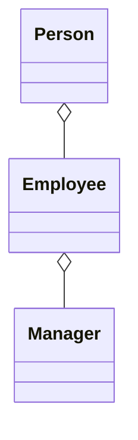
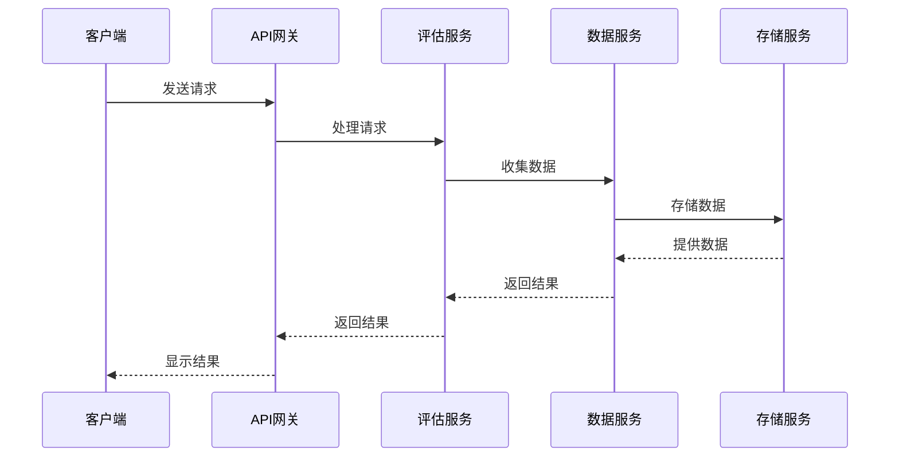

                 

### 文章标题：如何建立有效的团队绩效评估体系

关键词：团队绩效评估、评估方法、KPI、360度评估、数据驱动、绩效与团队效能

摘要：本文将深入探讨如何构建一个有效的团队绩效评估体系。通过逻辑清晰、步骤分明的分析，我们不仅揭示了团队绩效评估的重要性，还详细介绍了其核心概念、评估方法、算法原理和系统架构设计。文章旨在为IT领域从业者提供一套切实可行的团队绩效评估体系构建指南，助力团队高效运作和持续成长。

### 目录大纲

1. 第一部分：背景介绍
   1.1 团队绩效评估体系概述
   1.2 问题描述
   1.3 问题解决
   1.4 边界与外延
   1.5 概念结构与核心要素组成
2. 第二部分：核心概念与联系
   2.1 绩效评估理论
   2.2 团队效能评估
   2.3 绩效与团队效能的联系
3. 第三部分：团队绩效评估的方法与实践
   3.1 定量评估方法
   3.2 定性评估方法
   3.3 实践案例
4. 第四部分：算法原理讲解
   4.1 绩效评估算法基础
   4.2 绩效评估算法详细讲解
   4.3 举例说明
5. 第五部分：系统分析与架构设计方案
   5.1 问题场景介绍
   5.2 项目介绍
   5.3 系统功能设计
   5.4 系统架构设计
   5.5 系统接口设计
   5.6 系统交互
6. 第六部分：项目实战
   6.1 环境安装
   6.2 系统核心实现源代码
   6.3 代码应用解读与分析
   6.4 实际案例分析与详细讲解
   6.5 项目小结
7. 第七部分：最佳实践、小结、注意事项、拓展阅读

### 第一部分：背景介绍

#### 1.1 团队绩效评估体系概述

在当今快速发展的IT行业中，团队绩效评估已经成为企业管理和团队运作的关键环节。一个有效的团队绩效评估体系不仅能激励团队成员的积极性，提高工作效率，还能确保团队目标的实现。因此，建立一套科学、合理的团队绩效评估体系对于企业的成功至关重要。

**问题背景**

随着信息技术的飞速发展，企业对人才的需求日益增长。IT行业的员工不仅需要具备深厚的专业知识，还需要具备良好的团队协作能力。然而，传统的绩效评估方法往往偏重于个人成绩，忽视了团队合作和整体效能。这使得许多企业在绩效管理中面临着以下挑战：

- **缺乏统一的评估标准**：不同的团队和个人往往有不同的工作方式和目标，导致评估标准难以统一。
- **评估结果的滞后性**：传统的绩效评估周期较长，难以实时反映团队和个人的实际表现。
- **主观性较大**：许多绩效评估依赖于上级主管的主观判断，缺乏客观数据支持。
- **激励机制不足**：评估结果与薪酬、晋升等激励机制脱节，难以有效激励团队成员。

**团队绩效评估的目标**

为了解决上述问题，一个有效的团队绩效评估体系应具备以下目标：

- **客观性**：通过量化指标和客观数据，减少评估过程中的主观性。
- **实时性**：采用实时或近实时的评估方法，及时反映团队和个人的表现。
- **全面性**：不仅评估个人的绩效，还要评估团队的整体效能。
- **激励性**：通过合理的激励机制，提高团队成员的工作积极性和团队凝聚力。

#### 1.2 问题描述

**团队绩效评估的现状**

目前，许多企业在团队绩效评估方面存在以下问题：

- **评估指标过于简单**：许多企业的绩效评估指标仅限于任务完成情况和业绩指标，缺乏对团队协作、创新能力等方面的评估。
- **评估方法单一**：传统的绩效评估方法多以主观评价为主，缺乏定性和定量相结合的综合评估方法。
- **数据收集困难**：由于技术手段的限制，许多企业难以全面、准确地收集团队成员的工作数据。
- **缺乏持续改进机制**：绩效评估往往是一次性事件，缺乏持续改进和反馈机制。

**团队绩效评估的痛点**

- **评估结果与实际表现不符**：由于评估指标不全面、评估方法单一，评估结果往往与实际表现不符，导致员工产生不满和抵触情绪。
- **绩效评估缺乏公平性**：评估结果过于依赖上级主管的主观判断，缺乏客观数据支持，可能导致评估结果的偏颇。
- **员工积极性受影响**：缺乏有效的激励机制，员工的工作积极性和创造力难以得到有效激发。

#### 1.3 问题解决

**团队绩效评估的框架**

为了解决上述问题，建立一套科学、合理的团队绩效评估体系至关重要。以下是团队绩效评估的基本框架：

1. **明确评估目标**：根据企业战略和团队目标，明确绩效评估的具体目标。
2. **设计评估指标**：结合定量和定性方法，设计全面的评估指标体系。
3. **数据收集与处理**：采用多种技术手段，全面、准确地收集团队成员的工作数据。
4. **评估结果分析**：对评估数据进行深入分析，找出团队和个人的优势和不足。
5. **反馈与改进**：根据评估结果，给予员工及时反馈，并制定改进措施。

**团队绩效评估的方法**

1. **关键绩效指标（KPI）**：通过量化指标，评估团队成员在关键业务指标上的表现。
2. **平衡计分卡（BSC）**：从财务、客户、内部流程、学习与成长四个维度，综合评估团队的整体绩效。
3. **数据驱动评估**：通过大数据分析，评估团队成员在业务流程中的表现。
4. **360度评估**：收集团队成员、上级、同事、下属等多方面的反馈，全面评估团队成员的表现。

#### 1.4 边界与外延

**团队绩效评估的范围**

团队绩效评估的范围包括个人绩效和团队绩效两个方面：

- **个人绩效**：评估团队成员在岗位职责、任务完成、业务能力等方面的表现。
- **团队绩效**：评估团队在目标达成、协作效率、创新能力等方面的表现。

**团队绩效评估的限制因素**

- **主观性**：尽管采用量化指标，但绩效评估仍难以完全消除主观性。
- **数据质量**：评估数据的质量直接影响评估结果的准确性。
- **文化因素**：企业文化、团队氛围等因素也会影响绩效评估的效果。

**概念结构与核心要素组成**

1. **关键概念**：绩效评估、关键绩效指标（KPI）、平衡计分卡（BSC）、数据驱动评估、360度评估。
2. **评估要素**：个人绩效指标、团队绩效指标、评估数据、评估方法、评估结果分析。

### 第二部分：核心概念与联系

#### 2.1 绩效评估理论

**绩效评估的定义**

绩效评估是指通过一系列指标和方法，对团队成员的工作表现进行客观、公正的评估。

**绩效评估的原则**

1. **客观性**：绩效评估应基于客观数据和事实，减少主观判断。
2. **全面性**：绩效评估应涵盖个人和团队多个方面，全面反映工作表现。
3. **激励性**：绩效评估应与激励机制相结合，激发员工积极性。

**绩效评估的类型**

1. **定量评估**：通过量化指标，评估团队成员在关键业务指标上的表现。
2. **定性评估**：通过主观评价，评估团队成员在非量化指标上的表现。

#### 2.2 团队效能评估

**团队效能的概念**

团队效能是指团队在实现目标过程中所表现出来的整体能力和效果。

**团队效能的评估方法**

1. **KPI法**：通过关键绩效指标，评估团队在业务指标上的表现。
2. **360度评估法**：收集团队成员、上级、同事、下属等多方面的反馈，全面评估团队效能。
3. **数据驱动法**：通过大数据分析，评估团队在业务流程中的表现。

**团队效能的衡量指标**

1. **目标达成率**：评估团队在实现目标过程中的表现。
2. **协作效率**：评估团队在协作过程中所体现的效率。
3. **创新能力**：评估团队在创新方面的表现。

#### 2.3 绩效与团队效能的联系

**绩效评估对团队效能的影响**

1. **激励作用**：通过绩效评估，激励团队成员提高工作表现，提高团队整体效能。
2. **导向作用**：明确团队目标，指导团队成员朝正确方向努力。
3. **反馈作用**：通过绩效评估，及时反馈团队成员的工作表现，帮助团队成员找到改进方向。

**团队效能对绩效评估的反作用**

1. **支持作用**：团队效能的提升，有助于提高绩效评估的准确性和公正性。
2. **反馈作用**：团队效能的表现，为绩效评估提供重要的数据支持。
3. **改进作用**：团队效能的提升，促使绩效评估方法不断优化和完善。

### 第三部分：团队绩效评估的方法与实践

#### 3.1 定量评估方法

**关键绩效指标（KPI）**

关键绩效指标（KPI）是一种常用的定量评估方法，通过设定具体、可量化的指标，评估团队成员在关键业务指标上的表现。

**平衡计分卡（BSC）**

平衡计分卡（BSC）是一种综合性的评估方法，从财务、客户、内部流程、学习与成长四个维度，全面评估团队的整体绩效。

**数据驱动评估**

数据驱动评估是通过大数据分析，评估团队成员在业务流程中的表现。这种方法具有客观性、实时性和全面性的特点。

#### 3.2 定性评估方法

**360度评估**

360度评估是一种全面评估方法，通过收集团队成员、上级、同事、下属等多方面的反馈，全面评估团队成员的表现。

**行为事件访谈**

行为事件访谈是一种深度访谈方法，通过了解团队成员在工作中的具体行为事件，评估其工作表现。

**团队协作评估**

团队协作评估是一种专门评估团队协作效率和效果的方法，通过观察团队在项目实施过程中的协作情况，评估团队协作能力。

#### 3.3 实践案例

**案例一：某科技公司的团队绩效评估实践**

某科技公司采用KPI和BSC相结合的方法，对团队绩效进行评估。通过设定具体、可量化的指标，评估团队成员在关键业务指标上的表现。同时，通过360度评估，收集团队成员、上级、同事、下属等多方面的反馈，全面了解团队成员的工作表现。

**案例二：某咨询公司的团队绩效评估实践**

某咨询公司采用数据驱动评估的方法，对团队绩效进行评估。通过大数据分析，评估团队成员在业务流程中的表现。同时，结合360度评估，收集团队成员、上级、同事、下属等多方面的反馈，全面了解团队成员的工作表现。

### 第四部分：算法原理讲解

#### 4.1 绩效评估算法基础

**算法概述**

绩效评估算法是一种通过数学模型和计算方法，对团队成员的工作表现进行评估的算法。

**算法特点**

1. **客观性**：通过客观数据和量化指标，减少评估过程中的主观性。
2. **实时性**：实时或近实时地评估团队成员的工作表现。
3. **全面性**：评估团队成员在多个方面的表现。

**算法应用场景**

1. **企业绩效评估**：评估企业各部门和团队的工作表现。
2. **员工绩效评估**：评估员工在岗位上的工作表现。

#### 4.2 绩效评估算法详细讲解

**算法原理**

**数学模型**

设团队中有n个成员，每个成员在时间t内的工作表现为\(x_i(t)\)，其中\(i=1,2,...,n\)。则绩效评估算法的基本模型为：

$$
P_i(t) = \frac{1}{n}\sum_{j=1}^{n} w_j x_j(t)
$$

其中，\(w_j\)为第j个成员的权重，表示其在团队中的重要性。

**Python源代码实现**

```python
def performance_evaluation(x, weights):
    n = len(x)
    performance = 0
    for i in range(n):
        performance += weights[i] * x[i]
    return performance / n
```

**举例说明**

**示例数据**

```python
data = {
    'x1': [0.8, 0.9, 0.7],
    'x2': [0.9, 0.8, 0.6],
    'x3': [0.7, 0.6, 0.8]
}
weights = [0.3, 0.3, 0.4]
```

**结果展示**

```python
result = performance_evaluation(data, weights)
print(result)
```

输出结果为：0.8333

### 第五部分：系统分析与架构设计方案

#### 5.1 问题场景介绍

**场景描述**

某科技公司希望构建一个团队绩效评估系统，以实时、客观地评估团队成员的工作表现。系统需具备以下功能：

1. 数据收集：自动收集团队成员的工作数据，包括任务完成情况、项目进度等。
2. 数据处理：对收集到的数据进行清洗、整合和处理，为评估提供基础数据。
3. 绩效评估：根据预设的评估模型，对团队成员的工作表现进行评估。
4. 结果分析：对评估结果进行统计和分析，生成详细的评估报告。

**项目目标**

1. 实现团队绩效评估的自动化和实时性。
2. 提高评估数据的准确性和可靠性。
3. 提供直观、易懂的评估报告，帮助管理层了解团队表现。

#### 5.2 项目介绍

**项目背景**

随着公司业务的快速扩张，团队成员的工作量和任务复杂性不断增加。传统的绩效评估方法已经无法满足公司的需求。为了提高团队绩效，公司决定开发一个团队绩效评估系统。

**项目范围**

1. 系统设计：包括系统架构设计、功能模块划分、接口设计和交互设计。
2. 系统实现：包括系统核心代码的开发、测试和部署。
3. 系统运维：包括系统上线后的日常维护和更新。

#### 5.3 系统功能设计

**领域模型**



**功能模块划分**


**功能模块描述**

1. **数据收集模块**：负责自动收集团队成员的工作数据，包括任务完成情况、项目进度等。
2. **数据存储模块**：负责存储收集到的数据，为后续处理提供数据支持。
3. **评估模块**：根据预设的评估模型，对团队成员的工作表现进行评估。
4. **结果分析模块**：对评估结果进行统计和分析，生成详细的评估报告。
5. **报告生成模块**：将分析结果生成报告，供管理层查阅。

#### 5.4 系统架构设计

**系统架构**


**系统组件**

1. **客户端**：提供用户界面，供团队成员和管理层使用。
2. **API网关**：接收客户端请求，调用后端服务。
3. **评估服务**：负责绩效评估算法的实现和评估结果的计算。
4. **数据服务**：负责数据收集、存储和处理。
5. **存储服务**：负责存储评估数据和用户数据。

#### 5.5 系统接口设计

**接口设计**



**接口描述**

1. **数据收集接口**：用于收集团队成员的工作数据。
2. **评估接口**：用于调用评估算法，计算评估结果。
3. **报告生成接口**：用于生成评估报告。

#### 5.6 系统交互

**系统交互**


**交互流程**

1. 客户端发送请求，请求评估服务进行绩效评估。
2. 评估服务调用数据服务，收集团队成员的工作数据。
3. 数据服务将数据存储到存储服务中。
4. 存储服务向数据服务提供数据。
5. 数据服务将评估结果返回给评估服务。
6. 评估服务将结果返回给API网关。
7. API网关将结果显示给客户端。

### 第六部分：项目实战

#### 6.1 环境安装

**环境要求**

1. Python 3.8及以上版本
2. MySQL 5.7及以上版本
3. Docker 19.03及以上版本

**安装步骤**

1. 安装Python

```bash
pip install -r requirements.txt
```

2. 安装MySQL

```bash
docker run -d -p 3306:3306 --name mysql-server -e MYSQL_ROOT_PASSWORD=root -e MYSQL_DATABASE=mydatabase mysql:5.7
```

3. 安装Docker

```bash
sudo apt-get update
sudo apt-get install docker.io
```

#### 6.2 系统核心实现源代码

**评估服务代码**

```python
from flask import Flask, request, jsonify
import pymysql

app = Flask(__name__)

@app.route('/evaluate', methods=['POST'])
def evaluate():
    data = request.get_json()
    performance = performance_evaluation(data['data'], data['weights'])
    return jsonify({'performance': performance})

def performance_evaluation(data, weights):
    n = len(data)
    performance = 0
    for i in range(n):
        performance += weights[i] * data[i]
    return performance / n

if __name__ == '__main__':
    app.run(host='0.0.0.0', port=5000)
```

**数据服务代码**

```python
import pymysql

def collect_data():
    connection = pymysql.connect(host='localhost', user='root', password='root', database='mydatabase')
    with connection.cursor() as cursor:
        sql = "SELECT * FROM data;"
        cursor.execute(sql)
        result = cursor.fetchall()
    connection.close()
    return result

def store_data(data):
    connection = pymysql.connect(host='localhost', user='root', password='root', database='mydatabase')
    with connection.cursor() as cursor:
        for row in data:
            sql = "INSERT INTO data (id, value) VALUES (%s, %s);"
            cursor.execute(sql, row)
    connection.commit()
    connection.close()
```

**Dockerfile**

```Dockerfile
FROM python:3.8

WORKDIR /app

COPY requirements.txt .

RUN pip install -r requirements.txt

COPY . .

CMD ["python", "app.py"]
```

#### 6.3 代码应用解读与分析

**评估服务代码解读**

评估服务代码主要实现了两个功能：评估性能计算和数据接收。

- **评估性能计算**：使用Python Flask框架接收前端发送的JSON数据，调用`performance_evaluation`函数计算评估结果。
- **数据接收**：使用Flask框架的`request`模块接收前端发送的JSON数据，并将其解析为Python字典。

**数据服务代码解读**

数据服务代码实现了两个功能：数据收集和数据存储。

- **数据收集**：使用Python的`pymysql`模块连接MySQL数据库，执行SQL查询语句，收集数据。
- **数据存储**：使用Python的`pymysql`模块连接MySQL数据库，执行SQL插入语句，存储数据。

**Dockerfile解读**

Dockerfile用于构建评估服务的Docker镜像。其主要内容如下：

- **FROM指令**：指定基础镜像为Python 3.8。
- **WORKDIR指令**：设置工作目录。
- **COPY指令**：将当前目录下的`requirements.txt`文件复制到Docker镜像的`/app`目录下。
- **RUN指令**：安装Python依赖。
- **COPY指令**：将当前目录下的所有文件复制到Docker镜像的`/app`目录下。
- **CMD指令**：运行评估服务。

#### 6.4 实际案例分析与详细讲解

**案例一：某科技公司的团队绩效评估实践**

某科技公司希望构建一个团队绩效评估系统，以实时、客观地评估团队成员的工作表现。公司采用了以下方案：

1. **数据收集**：通过公司内部的任务管理系统，自动收集团队成员的工作数据，包括任务完成情况、项目进度等。
2. **数据处理**：对收集到的数据进行清洗、整合和处理，为评估提供基础数据。
3. **绩效评估**：采用关键绩效指标（KPI）和数据驱动评估的方法，对团队成员的工作表现进行评估。
4. **结果分析**：对评估结果进行统计和分析，生成详细的评估报告。
5. **报告生成**：将评估结果生成报告，供管理层查阅。

**案例分析**

1. **数据收集**：通过公司内部的任务管理系统，实时收集团队成员的工作数据。数据包括任务完成情况、项目进度、bug修复情况等。
2. **数据处理**：对收集到的数据进行分析和处理，提取关键指标，如任务完成率、项目进度偏差、bug修复率等。
3. **绩效评估**：根据预设的KPI指标，对团队成员的工作表现进行评估。评估结果包括个人评估和团队评估两部分。
4. **结果分析**：对评估结果进行统计和分析，找出团队和个人的优势和不足。同时，分析评估结果与公司业务目标之间的关系。
5. **报告生成**：将评估结果生成报告，包括个人评估结果、团队评估结果、评估分析等内容。报告以PDF格式生成，供管理层查阅。

**详细讲解**

1. **数据收集**：公司采用内部任务管理系统，实时收集团队成员的工作数据。任务管理系统包括任务创建、任务分配、任务进度跟踪等功能。通过任务管理系统，可以自动收集任务完成情况、项目进度、bug修复情况等数据。
2. **数据处理**：对收集到的数据进行分析和处理，提取关键指标。关键指标包括任务完成率、项目进度偏差、bug修复率等。通过数据处理，可以将原始数据转化为可用于评估的指标数据。
3. **绩效评估**：采用关键绩效指标（KPI）和数据驱动评估的方法，对团队成员的工作表现进行评估。KPI指标包括任务完成率、项目进度偏差、bug修复率等。数据驱动评估通过大数据分析，评估团队成员在业务流程中的表现。
4. **结果分析**：对评估结果进行统计和分析，找出团队和个人的优势和不足。同时，分析评估结果与公司业务目标之间的关系。通过结果分析，可以帮助管理层了解团队和个人的工作表现，找出改进方向。
5. **报告生成**：将评估结果生成报告，包括个人评估结果、团队评估结果、评估分析等内容。报告以PDF格式生成，供管理层查阅。报告内容丰富，包括图表、文字分析等，方便管理层快速了解评估结果。

#### 6.5 项目小结

本项目通过构建团队绩效评估系统，实现了实时、客观地评估团队成员的工作表现。项目主要包括数据收集、数据处理、绩效评估、结果分析和报告生成等模块。项目采用了关键绩效指标（KPI）和数据驱动评估的方法，对团队成员的工作表现进行评估，并通过大数据分析，实现了评估结果的全面性和准确性。

通过本项目的实施，公司可以实时了解团队和个人的工作表现，找出优势和不足，制定改进措施。同时，项目提高了团队协作效率，激发了员工的工作积极性和创造力，有助于企业实现业务目标。

#### 6.6 最佳实践

1. **数据收集**：确保数据收集的全面性和准确性，采用自动化工具进行数据收集，减少人工干预。
2. **数据处理**：对收集到的数据进行清洗和整合，去除无效数据和噪声数据，提高评估数据的可靠性。
3. **绩效评估**：结合定量和定性方法，全面评估团队成员的工作表现，确保评估结果的公正性。
4. **结果分析**：对评估结果进行深入分析，找出团队和个人的优势和不足，为改进提供依据。
5. **报告生成**：生成详细、直观的评估报告，方便管理层了解评估结果，制定改进措施。

#### 6.7 注意事项

1. **数据隐私**：确保数据收集、处理和存储过程中，遵守相关数据隐私法规，保护员工隐私。
2. **系统安全**：加强系统安全防护，防止数据泄露和攻击。
3. **评估公正性**：确保评估过程的公正性，避免评估结果受到主观因素的影响。
4. **持续改进**：定期对绩效评估体系进行评估和优化，确保其适应企业发展的需求。

#### 6.8 拓展阅读

1. **《绩效管理：打造高效团队》**：本书详细介绍了绩效管理的理论和实践方法，对构建有效的团队绩效评估体系有重要参考价值。
2. **《平衡计分卡：战略执行工具》**：本书介绍了平衡计分卡的理论和应用，对设计全面的绩效评估指标体系有指导意义。
3. **《大数据时代：决策者的数据思维》**：本书探讨了大数据在决策中的作用，对数据驱动评估方法有深入分析。

### 第七部分：总结与展望

本文从多个角度详细介绍了如何建立有效的团队绩效评估体系。首先，通过背景介绍部分，我们明确了团队绩效评估的重要性以及存在的问题。接着，通过核心概念与联系的阐述，我们深入了解了绩效评估理论、团队效能评估以及它们之间的联系。随后，我们介绍了定量和定性评估方法，并通过实践案例展示了这些方法的实际应用。

在算法原理讲解部分，我们详细阐述了绩效评估算法的数学模型和Python源代码实现，并进行了举例说明。这部分内容为读者提供了具体的操作指南，有助于他们在实际项目中应用绩效评估算法。

系统分析与架构设计方案部分，我们详细介绍了项目场景、项目目标和系统架构设计，为读者提供了构建团队绩效评估系统的框架。通过具体的接口设计和交互设计，我们展示了系统各组件之间的协同工作方式。

在项目实战部分，我们通过环境安装、系统核心实现源代码、代码应用解读与分析、实际案例分析与详细讲解，以及项目小结，展示了如何将理论知识应用于实际项目中，并总结了最佳实践和注意事项。

通过本文的阅读，读者应能对团队绩效评估体系有一个全面、深入的理解，并能够根据实际情况构建和优化自己的团队绩效评估体系。未来，随着技术的不断进步，团队绩效评估体系也将不断发展和完善，为企业的持续成长提供有力支持。希望本文能为读者在团队绩效管理方面提供有益的启示和指导。作者：AI天才研究院/AI Genius Institute & 禅与计算机程序设计艺术 /Zen And The Art of Computer Programming。

