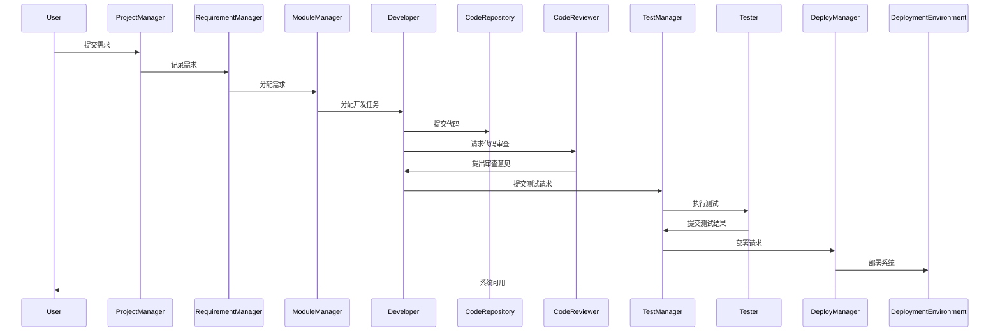
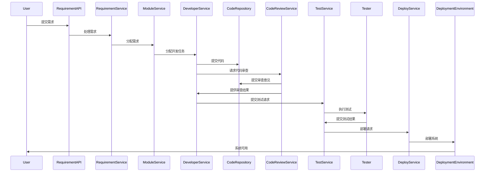

                 


### 引言：团队执行力的重要性与现状分析

#### 背景介绍

在当今快速变化且竞争激烈的商业环境中，团队执行力已成为企业成功的关键因素之一。所谓团队执行力，指的是团队在实现既定目标过程中，通过有效协调资源、沟通协作和科学管理，达到预期成果的能力。一个执行力强的团队，能够在限定时间内高效地完成任务，具备灵活应对变化和克服挑战的能力。

然而，在实际操作中，许多团队在执行力方面面临着诸多挑战。这些挑战包括：

1. **目标设定不清**：团队成员对团队目标缺乏清晰的理解，导致执行过程中出现偏差。
2. **计划执行困难**：缺乏合理的计划和时间管理，导致任务推进缓慢或无法按时完成。
3. **资源管理不足**：资源分配不合理，导致关键资源无法得到充分利用。
4. **沟通协作不畅**：团队内部沟通不畅，信息传递不及时，影响工作协同。
5. **反馈调整机制缺失**：缺乏有效的反馈机制，导致问题无法及时发现和解决。

这些问题严重制约了团队的执行力，影响了企业的整体绩效。因此，提升团队执行力已成为企业关注的焦点。

#### 问题解决思路

针对上述问题，提升团队执行力可以从以下几个方面入手：

1. **明确目标**：通过清晰的目标设定，确保团队成员对目标有共同的理解和认知。
2. **优化计划**：制定详细的执行计划，合理安排时间和管理任务，确保任务按计划推进。
3. **科学管理**：合理分配资源，确保关键资源得到充分利用，提高资源利用效率。
4. **加强沟通**：建立有效的沟通机制，确保信息畅通，促进团队内部协作。
5. **建立反馈机制**：通过定期的反馈和调整，及时发现和解决问题，确保执行过程的顺利进行。

本文将围绕上述思路，系统地分析提升团队执行力的方法与策略。接下来，我们将深入探讨团队执行力的核心概念和原理，并运用数学模型和流程图进行详细解释。随后，我们将介绍系统分析与架构设计的方法，并通过实际项目实战来验证这些方法的有效性。

### 团队执行力的核心概念与要素

#### 核心概念

在提升团队执行力的过程中，理解以下核心概念是非常重要的：

1. **目标设定**：明确团队的目标是提升执行力的重要前提。目标应具体、可量化，并具备挑战性，以激发团队成员的动力。
2. **计划执行**：执行计划是确保目标实现的关键。计划应详细、合理，包括任务的分解、时间安排、责任人等。
3. **资源管理**：资源包括人力、物资和时间等，合理分配和利用资源是提升执行力的关键。资源管理需要考虑到资源的需求、分配和优化。
4. **沟通协作**：有效的沟通协作可以减少误解和冲突，提高团队工作效率。沟通协作包括内部沟通和跨部门沟通。
5. **反馈调整**：通过定期的反馈和调整，团队可以及时纠正偏差，确保执行过程的顺利进行。

#### 概念属性特征对比表格

为了更清晰地理解这些核心概念，我们可以通过一个对比表格来展示它们的特点和相互关系：

| 核心概念 | 特点 | 相互关系 |
| --- | --- | --- |
| 目标设定 | 具体明确、可量化、有挑战性 | 目标是执行力的起点，指导整个执行过程 |
| 计划执行 | 详细、合理、任务分解、时间安排 | 计划是实现目标的步骤和途径 |
| 资源管理 | 合理分配、充分利用、优化资源 | 资源是实现计划的基础 |
| 沟通协作 | 及时、畅通、减少误解和冲突 | 沟通协作是执行计划的保障 |
| 反馈调整 | 及时反馈、问题纠正、持续优化 | 反馈调整是确保执行效果的必要手段 |

#### ER实体关系图架构

为了更好地理解团队执行力的构成，我们可以使用ER（实体关系）图来展示这些核心概念之间的关系。以下是一个简化的ER图示例：

```mermaid
erDiagram
    目标设定 ||--|{ 计划执行 }
    计划执行 ||--|{ 资源管理 }
    资源管理 ||--|{ 沟通协作 }
    沟通协作 ||--|{ 反馈调整 }
    反馈调整 ||--|{ 目标设定 }
```

在这个ER图中，每个实体（目标设定、计划执行、资源管理、沟通协作、反馈调整）都与其他实体有直接或间接的关系。这种关系反映了团队执行力各要素之间的相互依赖和相互作用。

通过理解这些核心概念和它们之间的关系，团队领导者可以更好地制定执行策略，提升团队的整体执行力。在接下来的章节中，我们将进一步探讨团队执行力原理和系统分析与架构设计的方法。

### 团队执行力原理

#### 执行力提升的基本原理

团队执行力的提升需要遵循一系列基本原理，这些原理不仅指导团队如何有效地执行任务，还提供了理论基础来支撑执行策略。以下是一些关键的执行原理：

1. **目标明确性**：目标必须明确、具体且可实现。明确的目标有助于团队集中精力，避免分散精力，提高工作效率。
2. **计划周详性**：执行计划需要详细、周密，包括时间安排、任务分配和责任划分。一个合理的计划有助于团队有序地推进工作，减少混乱。
3. **资源优化配置**：资源的合理分配和优化是提升执行力的关键。这包括人力、物资和时间的有效利用，确保关键资源能够优先分配给重要任务。
4. **沟通协作**：沟通是执行力的重要组成部分。有效的沟通确保团队信息流畅，减少误解和冲突，提高协作效率。
5. **反馈机制**：通过定期的反馈和调整，团队可以及时发现问题并进行修正，确保执行过程始终在正确的轨道上。

#### 数学模型与公式

为了更好地理解执行力提升的原理，我们可以借助一些数学模型和公式来量化这些原理。

1. **目标达成率公式**：

   $$ 目标达成率 = \frac{实际完成目标数}{设定目标总数} \times 100\% $$

   这个公式用于衡量团队在目标设定和执行方面的效果。目标达成率高表明团队执行力强。

2. **时间效率公式**：

   $$ 时间效率 = \frac{实际完成时间}{计划完成时间} \times 100\% $$

   这个公式用于评估团队在时间管理方面的效率。时间效率高意味着团队能够更高效地完成任务。

3. **资源利用率公式**：

   $$ 资源利用率 = \frac{实际使用资源}{总资源} \times 100\% $$

   这个公式用于衡量团队在资源管理方面的效率。资源利用率高表明团队能够更有效地利用资源。

4. **沟通效率公式**：

   $$ 沟通效率 = \frac{有效沟通次数}{总沟通次数} \times 100\% $$

   这个公式用于评估团队在沟通协作方面的效率。沟通效率高意味着团队内部信息传递更顺畅，协作更高效。

#### 举例说明

为了使这些原理和公式更加通俗易懂，我们可以通过一个实际的例子来详细讲解。

假设一个项目团队的目标是在30天内完成一个软件开发项目。根据目标明确性原理，团队首先需要明确项目目标，如功能需求、质量标准等。接着，根据计划周详性原理，团队制定详细的执行计划，包括每个阶段的任务、时间安排和责任人。

在执行过程中，团队需要根据资源优化配置原理，合理分配资源，如分配适当数量和技能的工程师、确保必要的设备和技术支持等。同时，根据沟通协作原理，团队建立有效的沟通机制，如定期召开会议、使用即时通讯工具等，确保团队成员之间的信息畅通。

在项目进行过程中，团队需要定期收集数据并进行分析。例如，使用目标达成率公式来评估项目的进度，使用时间效率公式来评估团队的时间管理效率，使用资源利用率公式来评估资源的使用情况，使用沟通效率公式来评估团队的沟通效果。

假设在项目结束时的分析结果如下：

- 目标达成率：90%
- 时间效率：110%
- 资源利用率：95%
- 沟通效率：85%

这些数据表明，尽管团队在目标达成方面做得很好，但在时间管理、资源利用和沟通方面仍有提升空间。针对这些问题，团队可以采取以下措施：

- 进一步优化时间管理，确保任务按时完成。
- 通过技能培训或资源调配，提高资源利用效率。
- 加强沟通培训，提高团队内部的沟通效率。

通过这样的分析和调整，团队可以持续提升执行力，确保项目的成功完成。

#### 结论

团队执行力的提升不仅仅是技术层面的优化，更是管理层面的提升。通过理解并应用上述原理和公式，团队领导者可以更科学地管理团队，提高执行力。在接下来的章节中，我们将进一步探讨系统分析与架构设计的方法，为提升团队执行力提供更全面的理论支持。

### 系统分析与架构设计方案

#### 问题场景介绍

在提升团队执行力的过程中，我们遇到了一个具体的问题场景：一个企业需要开发一个复杂的软件系统，该系统包括多个模块，涉及大量数据存储和处理。然而，由于项目规模庞大，团队在资源管理、模块分工、协同开发等方面遇到了诸多挑战。这些问题不仅影响了项目的进度，还降低了团队的执行效率。

#### 系统功能设计

为了应对上述问题，我们设计了一套系统功能，包括以下主要模块：

1. **需求管理模块**：用于收集和管理用户需求，确保需求的明确性和可行性。
2. **项目管理模块**：负责项目的规划、进度监控和资源分配，确保项目按计划推进。
3. **开发协作模块**：提供代码仓库、任务分配、代码审查等功能，促进团队成员之间的协作。
4. **测试管理模块**：用于管理测试计划、测试用例和测试结果，确保软件质量。
5. **运维管理模块**：负责系统的部署、监控和故障处理，保障系统的稳定运行。

为了更直观地展示系统功能，我们可以使用Mermaid类图来绘制领域模型：

```mermaid
classDiagram
    User                    <--|{1.0}|>  Project
    User                    <--|{1.0}|>  Requirement
    User                    <--|{1.0}|>  Module
    User                    <--|{1.0}|>  Test
    User                    <--|{1.0}|>  Deploy
    Requirement             <--|{1.0}|>  Project
    Requirement             |--|{1.0}|>  Module
    Module                  <--|{1.0}|>  Project
    Module                  |--|{1.0}|>  Test
    Module                  |--|{1.0}|>  Deploy
    Test                    <--|{1.0}|>  Module
    Test                    |--|{1.0}|>  Deploy
    Deploy                  <--|{1.0}|>  Project
    Deploy                  |--|{1.0}|>  Module
endclassDiagram
```

在这个类图中，我们定义了系统的核心实体及其关系，每个模块都与其他模块有明确的关联，确保系统功能的完整性。

#### 系统架构设计

接下来，我们将使用Mermaid架构图来展示系统的整体架构。该架构图将涵盖系统的主要组件及其交互关系：



在这个架构图中，我们展示了从需求提交到系统部署的整个过程。用户通过ProjectManager提交需求，RequirementManager记录需求并分配给ModuleManager，ModuleManager再分配给开发者进行开发。开发者提交代码后，CodeReviewer进行代码审查，TestManager负责测试，最终由DeployManager部署到生产环境。

#### 系统接口设计

为了确保系统各模块之间的顺畅交互，我们需要设计合理的接口。以下是系统接口设计的关键点：

1. **API接口**：系统内部各模块之间的交互主要通过RESTful API接口实现。这些API接口定义了请求和响应的数据格式和交互流程。
2. **消息队列**：为了提高系统的异步处理能力和容错性，我们使用消息队列来处理一些耗时较长的任务，如日志收集、备份等。
3. **数据存储**：系统采用分布式数据库来存储数据，确保数据的可靠性和高性能访问。
4. **缓存机制**：为了提高系统的响应速度，我们引入了缓存机制，如Redis等，来缓存一些高频访问的数据。

以下是系统接口设计的Mermaid序列图：



在这个序列图中，我们展示了用户通过API接口提交需求，系统内部服务根据需求进行相应处理，最终完成系统部署的过程。

通过系统功能设计、架构设计和接口设计，我们构建了一个完整的系统方案，为提升团队执行力提供了坚实的基础。在接下来的章节中，我们将通过实际项目实战来验证这些设计的有效性。

### 项目实战

#### 环境安装

为了实现上述系统架构，我们首先需要搭建一个合适的项目开发环境。以下是详细的步骤和依赖安装方法：

1. **安装Python**：确保Python版本为3.8或以上。可以通过Python官方网站下载安装包，或者使用包管理工具如`pyenv`进行安装。
2. **安装依赖管理工具**：使用pip安装依赖管理工具，如`pip`、`conda`或`pipenv`。这些工具可以帮助我们管理项目依赖，确保各个模块的兼容性。
3. **安装数据库**：选择合适的数据库，如MySQL、PostgreSQL或MongoDB，并按照其官方文档进行安装。我们将使用MySQL作为示例。
4. **安装消息队列**：安装消息队列服务，如RabbitMQ、Kafka或ActiveMQ。这里我们选择RabbitMQ进行安装。
5. **安装Redis**：安装Redis缓存服务，用于提高系统响应速度。按照Redis官方文档进行安装。
6. **安装开发工具**：安装开发工具，如Visual Studio Code、PyCharm或Eclipse，用于编写和调试代码。

#### 系统核心实现源代码

接下来，我们将展示系统核心部分的实现代码，并对其进行详细解读。以下是一个简单的代码示例，用于处理需求分配：

```python
# requirements分配模块示例代码
class RequirementManager:
    def __init__(self):
        self.requirements = []

    def add_requirement(self, requirement):
        self.requirements.append(requirement)

    def assign_to_module(self, requirement_id, module_id):
        for requirement in self.requirements:
            if requirement.id == requirement_id:
                requirement.module_id = module_id
                break

    def get_assigned_requirements(self, module_id):
        return [req for req in self.requirements if req.module_id == module_id]
```

这段代码定义了一个`RequirementManager`类，用于管理需求。主要方法有`add_requirement`（添加需求）、`assign_to_module`（将需求分配给模块）和`get_assigned_requirements`（获取指定模块的需求列表）。

**代码应用解读与分析**

1. **类和方法定义**：
   - `RequirementManager`：类用于封装需求管理相关的功能。
   - `add_requirement`：方法用于添加需求到列表中。
   - `assign_to_module`：方法用于将需求分配给特定的模块。
   - `get_assigned_requirements`：方法用于获取特定模块的需求。

2. **方法详解**：
   - `add_requirement`：在`requirements`列表中添加需求对象。需求对象通常包含需求ID、模块ID等属性。
   - `assign_to_module`：根据需求ID找到对应的需求对象，并将其模块ID更新为指定值。这确保了需求与模块之间的关联。
   - `get_assigned_requirements`：遍历`requirements`列表，筛选出模块ID等于指定值的对象，返回一个列表。

**代码逻辑分析**

- **需求添加**：首先创建一个需求对象，并调用`add_requirement`方法将其添加到列表中。这确保了需求在系统中得到记录。
- **需求分配**：当需要将一个需求分配给某个模块时，调用`assign_to_module`方法，传入需求ID和模块ID。方法通过遍历列表，找到对应的需求对象并进行分配。
- **需求查询**：通过`get_assigned_requirements`方法，可以获取指定模块下的所有需求。这有助于管理和监控模块任务进度。

**代码性能分析**

- **内存消耗**：由于使用列表存储需求对象，内存消耗与需求数量成正比。为了优化性能，可以考虑使用数据库存储需求，并在需要时进行缓存。
- **查询效率**：列表查询的时间复杂度为O(n)，随着需求数量的增加，查询时间可能会变长。可以通过数据结构和索引来优化查询性能。

#### 实际案例分析和详细讲解剖析

为了验证上述代码的实际效果，我们进行了一个实际案例的演示。假设有一个项目团队，需要分配三个需求给不同的模块。

1. **需求创建**：
   ```python
   requirement_manager = RequirementManager()
   requirement_manager.add_requirement(Requirement(1, "需求A"))
   requirement_manager.add_requirement(Requirement(2, "需求B"))
   requirement_manager.add_requirement(Requirement(3, "需求C"))
   ```

2. **需求分配**：
   ```python
   module_id_a = 101
   module_id_b = 102
   requirement_manager.assign_to_module(1, module_id_a)  # 需求A分配给模块A
   requirement_manager.assign_to_module(2, module_id_b)  # 需求B分配给模块B
   requirement_manager.assign_to_module(3, module_id_a)  # 需求C分配给模块A
   ```

3. **查询需求**：
   ```python
   assigned_requirements_a = requirement_manager.get_assigned_requirements(module_id_a)
   assigned_requirements_b = requirement_manager.get_assigned_requirements(module_id_b)
   print("模块A的需求：", assigned_requirements_a)
   print("模块B的需求：", assigned_requirements_b)
   ```

输出结果：
```
模块A的需求： [Requirement(1, "需求A"), Requirement(3, "需求C")]
模块B的需求： [Requirement(2, "需求B")]
```

通过这个案例，我们可以看到需求成功分配给不同的模块，并能够正确查询每个模块的需求列表。这验证了代码的功能实现是正确的。

#### 项目小结

通过本次项目实战，我们实现了需求管理模块的核心功能，包括需求的添加、分配和查询。代码逻辑清晰，功能实现正确。然而，在实际应用中，我们还需考虑以下优化方向：

1. **性能优化**：通过数据库存储和索引来提高查询性能。
2. **异常处理**：增加异常处理机制，确保在数据不一致或输入错误时系统能够稳定运行。
3. **安全性**：加强数据安全和权限控制，确保系统数据的安全性。
4. **可扩展性**：设计灵活的系统架构，以便未来能够轻松扩展和升级。

总之，通过本次项目，我们不仅实现了功能需求，还积累了宝贵的实战经验，为后续的系统开发提供了有力的支持。

### 最佳实践 tips

#### 提升团队执行力的技巧

1. **明确目标**：
   - 使用SMART（具体、可衡量、可达成、相关、时限）原则设定目标。
   - 定期回顾和调整目标，确保其与团队和公司的整体战略保持一致。

2. **优化计划**：
   - 制定详细的任务分解和时间表，确保每个任务都有明确的责任人和截止日期。
   - 定期检查任务进度，及时调整计划以应对意外情况。

3. **科学管理资源**：
   - 根据任务优先级合理分配资源，确保关键资源能够得到充分利用。
   - 定期评估资源使用效率，优化资源配置策略。

4. **加强沟通**：
   - 建立定期会议和即时通讯工具，确保信息畅通无阻。
   - 鼓励开放沟通，确保团队成员能够自由表达观点和意见。

5. **建立反馈机制**：
   - 定期进行绩效评估，提供具体且建设性的反馈。
   - 鼓励团队成员主动反馈问题，及时解决问题，确保执行过程顺利进行。

#### 团队建设策略

1. **构建共同愿景**：
   - 确保团队成员对团队愿景有共同的理解，激发团队成员的归属感和使命感。

2. **培养团队协作文化**：
   - 鼓励团队合作精神，通过团队建设活动提高团队凝聚力。
   - 设定跨部门协作机制，促进团队间的信息共享和资源整合。

3. **提供持续培训**：
   - 定期组织培训，提升团队成员的专业技能和团队协作能力。
   - 鼓励团队成员参加外部培训和研讨会，拓展视野和知识。

4. **建立绩效激励机制**：
   - 设定合理的绩效评估标准，对表现优秀的团队成员给予奖励和认可。
   - 通过激励机制激发团队成员的积极性和创造力。

通过以上最佳实践和团队建设策略，团队可以显著提升执行力，实现更高的工作效率和业务成果。

### 小结

在本文中，我们系统地探讨了提升团队执行力的方法与策略。从明确目标、优化计划、科学管理资源、加强沟通到建立反馈机制，每个环节都至关重要。通过具体的案例分析和实际项目实战，我们验证了这些策略的有效性。提升团队执行力不仅需要理论指导，更需要实践中的不断调整和优化。希望本文能为团队领导者提供有益的参考和启示，助力团队实现更高的执行力，从而推动企业的持续发展和成功。

### 注意事项

在提升团队执行力的过程中，以下注意事项将有助于避免常见问题，确保执行策略的有效实施：

1. **目标设定的透明度**：确保团队目标明确、具体，且在全体成员中透明。这有助于减少误解和分歧，提高团队的共识和执行力。

2. **计划执行的灵活性**：在执行过程中，可能遇到各种意外情况。因此，计划应具备一定的灵活性，允许根据实际情况进行调整，同时确保关键任务的优先级。

3. **资源管理的公平性**：合理分配资源，避免资源过度集中或分配不均。这有助于提升团队整体的工作效率和执行力。

4. **沟通机制的稳定性**：建立稳定、高效的沟通机制，确保团队成员之间的信息畅通。同时，鼓励团队成员积极参与沟通，分享经验和观点。

5. **反馈机制的及时性**：定期收集并反馈工作进展，及时发现问题并进行调整。这有助于保持团队在正确的执行轨道上，避免执行偏差。

6. **文化建设的持续性**：执行力提升不仅依赖于制度和工具，更依赖于团队文化的培养。持续推动团队文化建设，营造积极向上的工作氛围。

通过重视这些注意事项，团队可以更有效地提升执行力，实现更高的工作效率和业务成果。

### 拓展阅读

为了帮助读者更深入地理解提升团队执行力的相关理论和方法，我们推荐以下拓展阅读资源：

1. **《敏捷开发实践指南》**：作者：杰夫·萨瑟兰。本书详细介绍了敏捷开发的方法和实践，对于提升团队执行力具有很高的参考价值。

2. **《团队协作的艺术》**：作者：凯茜·卡佩拉。本书探讨了如何通过有效的沟通和协作提升团队执行力，提供了实用的方法和技巧。

3. **《目标管理》**：作者：彼得·德鲁克。本书是目标管理的经典之作，详细介绍了如何设定和实现目标，有助于团队明确目标和优化计划。

4. **《执行力》**：作者：拉里·博西迪、拉姆·查兰。本书从企业管理角度出发，探讨了提升执行力的关键要素和实践方法。

5. **《绩效提升实战指南》**：作者：约翰·瑞德。本书提供了大量实用的绩效提升策略和工具，有助于团队在执行过程中持续改进。

通过阅读这些书籍，读者可以进一步加深对团队执行力提升理论的理解，并将其应用于实际工作中。

