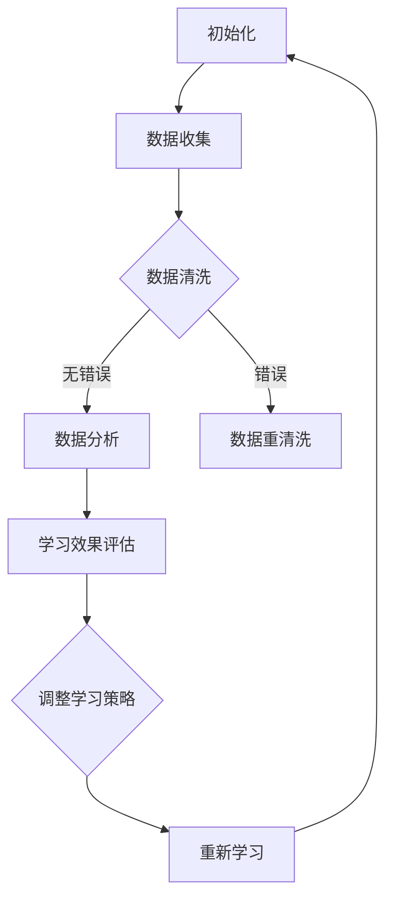

                 

### 激发团队学习热情的重要性

在当今快速发展的科技时代，企业面临着日益激烈的市场竞争和技术更新。为了保持竞争力，企业必须不断推动创新，而这离不开团队的学习和成长。激发团队的学习热情不仅是提升个人技能和知识水平的关键，更是企业实现可持续发展的重要策略。

**背景介绍**：
1. **技术更新速度加快**：随着人工智能、大数据、云计算等新兴技术的不断涌现，技术更新换代的速度越来越快。企业如果不能及时跟进，将可能导致落后和被淘汰。
2. **市场竞争激烈**：在全球经济一体化的背景下，市场竞争越来越激烈。企业不仅需要保持高效的生产和运营，还需要持续创新，以满足客户不断变化的需求。

**问题背景**：
- **团队学习不足**：许多企业的团队在学习上缺乏主动性，学习效果不佳，这导致了知识更新滞后、创新能力不足。
- **学习热情低**：员工对学习的兴趣不高，缺乏学习动力，这在一定程度上影响了团队的整体工作效率和绩效。

**问题描述**：
如何激发团队的学习热情，提高学习效果，进而提升企业的整体竞争力？

**问题解决**：
- **建立学习文化**：通过建立积极的学习文化，营造良好的学习氛围，激发员工的学习兴趣和积极性。
- **激励机制**：通过设置合理的激励机制，鼓励员工主动学习，提高学习成效。
- **学习资源支持**：提供充足的学习资源，包括时间、资金和技术支持，确保员工能够顺利开展学习活动。
- **团队协作**：通过团队协作学习，提高学习的互动性和实效性。

**边界与外延**：
- **边界**：本文主要关注如何激发团队的学习热情，提高学习效果。学习内容包括技术知识、管理技能、团队协作能力等。
- **外延**：本文的研究成果可应用于企业内部的各类团队，包括研发团队、市场团队、运营团队等。

### 团队学习与个人成长的关系

团队学习不仅仅是团队成员获取新知识的过程，更是个人成长的重要途径。通过团队学习，个人不仅能够提升专业技能，还能培养解决问题的能力和团队协作精神。因此，团队学习与个人成长之间存在着密切的联系。

**团队学习的重要性**：
1. **技能提升**：团队学习能够帮助个人掌握新的技能和知识，提高个人在专业领域的竞争力。
2. **知识共享**：团队学习促进了知识在团队内部的共享，有助于提升团队的整体知识水平。
3. **创新能力**：团队学习能够激发创新思维，推动团队在技术创新和业务模式创新方面的突破。

**个人成长在团队学习中的作用**：
1. **主动性**：个人在团队学习中的积极参与和主动性，对整个团队的学习效果有着重要影响。
2. **贡献度**：个人在团队学习中的贡献度，直接关系到团队的学习效果和整体绩效。
3. **学习榜样**：个人的学习态度和行为，会对其他团队成员产生示范效应，影响整个团队的学习氛围。

**团队学习对个人成长的具体影响**：
1. **知识积累**：通过团队学习，个人能够不断积累新的知识，提升自身的专业素养。
2. **经验分享**：个人在团队学习过程中，可以分享自己的经验和见解，从中获得新的启发和思考。
3. **技能提升**：通过团队协作学习和实践，个人能够更快地提升专业技能和实践能力。
4. **人际关系**：团队学习有助于建立和维护良好的人际关系，增强团队凝聚力和协作能力。

**个人成长对团队学习的促进作用**：
1. **主动学习**：个人主动学习的态度和行为，能够带动整个团队的学习积极性。
2. **知识贡献**：个人的专业知识和经验，可以为团队的学习提供宝贵的资源和支持。
3. **创新能力**：个人在团队学习中的创新思维和实践，能够为团队带来新的思路和方法。
4. **团队合作**：个人在团队学习中的良好表现，能够促进团队协作，提升整体学习效果。

总之，团队学习和个人成长是相辅相成的。通过有效的团队学习，个人能够实现专业成长，同时，个人的成长也为团队学习提供了动力和支持。因此，激发团队的学习热情，不仅有助于提升团队整体绩效，还能促进个人全面发展。

### 学习热情的定义与特征

学习热情，是指个体在学习和知识探索过程中表现出的积极情感态度。它不仅反映了个体对学习的兴趣和喜爱，还直接影响着学习的效果和质量。理解学习热情的定义和特征，对于激发团队的学习热情至关重要。

**学习热情的概念**：
学习热情可以定义为一种内在动力，驱动个体在学习和知识获取过程中投入更多的精力和时间。这种动力来源于对知识的渴望、对学习的兴趣以及自我实现的需求。学习热情不仅包括对学习内容的喜爱，还涉及到学习过程中的情感体验和成就感。

**学习热情的特征**：
1. **主动性**：学习热情高的个体，通常会表现出强烈的自主学习意愿，主动寻找学习资源，积极参与学习活动，而不是仅仅被动接受知识。
2. **持久性**：学习热情不仅体现在短期的学习活动中，还能够在长期的学习过程中保持稳定和持续，这种持久性是学习效果的重要保障。
3. **深度性**：学习热情高的个体，往往会深入探讨学习内容，不仅仅停留在表面的知识理解，而是追求更深层次的理解和应用。
4. **积极性**：学习热情高的个体，在面对学习挑战时，通常能够保持积极的态度，不畏困难，勇于探索和尝试。
5. **适应性**：学习热情具有适应性，能够根据不同学习环境和学习内容进行调整和适应，保持高效的学习状态。

**学习热情与工作效率的关系**：
学习热情对工作效率有着显著的影响。首先，高学习热情的个体能够更高效地学习新知识和技能，从而提升工作效率。其次，学习热情能够激发个体的创造力和创新精神，提高工作中的问题解决能力。此外，学习热情还可以增强个体对工作的满足感和成就感，降低工作压力，提高整体的工作绩效。

具体来说，学习热情能够通过以下几个方面影响工作效率：
1. **提高学习效率**：高学习热情的个体能够更快速地掌握新知识和技能，减少学习时间，从而腾出更多的时间用于其他工作。
2. **增强工作能力**：通过不断学习，个体能够提升自身的专业能力和综合素质，更好地完成工作任务。
3. **促进团队合作**：学习热情不仅影响个人，还能带动整个团队的学习氛围，提高团队协作效率和整体绩效。
4. **提升工作满意度**：学习热情能够增强个体对工作的认同感和满足感，降低离职率和工作压力，提高员工的长期留存率。

总之，学习热情是提升工作效率和实现职业发展的重要动力。通过激发和保持团队的学习热情，企业能够更好地应对市场变化，保持竞争力，实现可持续发展。

### 学习激励机制的重要性

在团队学习中，激励机制扮演着至关重要的角色。有效的激励机制不仅能够激发员工的学习热情，还能提高学习效果和整体工作效率。因此，深入探讨学习激励机制的重要性及其种类，对于构建一个积极、高效的学习文化具有重要意义。

**激励机制的重要性**：
1. **提升学习动力**：激励机制能够通过奖励和认可，增强员工的学习动力，使他们更加积极主动地投入学习活动。
2. **促进知识共享**：合理的激励机制能够鼓励员工分享知识和经验，促进团队内部的知识共享和协作，提升团队整体的知识水平。
3. **增强团队凝聚力**：通过激励机制，企业能够增强团队成员之间的信任和合作，提升团队的凝聚力和协作效率。
4. **提高学习效果**：有效的激励机制能够提高员工的学习兴趣和参与度，使他们在学习过程中更加投入，从而提高学习效果和知识掌握程度。
5. **推动个人成长**：激励机制能够鼓励员工不断提升自己的能力和素质，实现个人职业发展，从而促进企业的可持续发展。

**激励机制的种类**：
1. **物质激励**：物质激励是最直接的激励方式，包括奖金、晋升、福利待遇等。通过提供物质奖励，企业能够直接提高员工的满意度和归属感，从而增强其学习动力。
2. **精神激励**：精神激励主要通过认可、表扬和荣誉等方式，激励员工。例如，通过颁发荣誉证书、召开表彰大会或颁发优秀员工奖等，能够增强员工的荣誉感和成就感。
3. **职业发展激励**：职业发展激励是指通过提供职业晋升机会、培训和发展计划等，鼓励员工不断提升自身能力和职业素养。这种方式不仅能够激励员工当前的积极学习，还能为他们的长远发展提供支持。
4. **团队合作激励**：团队合作激励通过团队目标和奖励机制，鼓励团队成员共同学习和进步。例如，通过设立团队奖、团队竞赛等方式，激发团队成员的集体荣誉感和团队精神。
5. **学习环境激励**：学习环境激励是指通过改善学习环境、提供学习资源和支持等，创造一个有利于学习的氛围。例如，提供良好的学习设施、组织学习交流活动、设立学习基金等，能够增强员工的学习兴趣和参与度。

**激励机制的实施方法**：
1. **目标设定**：制定明确的学习目标和计划，确保激励机制能够有针对性地激发员工的学习动力。
2. **过程监控**：对学习过程进行监控和评估，及时发现和解决学习中遇到的问题，确保激励机制的有效实施。
3. **奖励与认可**：根据员工的学习成果和贡献，及时给予奖励和认可，增强其学习积极性和成就感。
4. **反馈与沟通**：定期与员工进行沟通，了解他们的需求和反馈，不断调整和优化激励机制，确保其适应性和有效性。
5. **培训与发展**：提供持续的培训和发展机会，帮助员工提升技能和知识，增强其职业竞争力。

**案例分析**：
例如，某科技公司在实施学习激励机制时，采取了多种措施。首先，公司为员工提供了丰富的培训资源，包括在线课程、专业研讨会和内部培训等。其次，公司设立了学习基金，支持员工参加外部培训和获取专业认证。此外，公司定期组织学习分享会，鼓励员工分享学习心得和经验，促进知识共享。通过这些措施，公司不仅提高了员工的学习热情，还增强了团队的凝聚力和工作效率。

总之，学习激励机制在团队学习中的作用不可忽视。通过科学合理地设置激励机制，企业能够激发员工的学习热情，提高学习效果，促进个人和团队的发展，从而实现企业的长远目标。

### 学习动机理论

学习动机是驱动个体从事学习活动的内在动力，它对学习效果有着至关重要的影响。理解学习动机的类型及其培养方法，对于激发团队的学习热情和提升学习效果具有重要意义。

**学习动机的概念**：
学习动机是指个体在学习和知识获取过程中表现出的内在驱动力。这种驱动力来源于个体的需求、兴趣、目标和社会期望等多种因素。学习动机可以分为内在动机和外在动机，内在动机主要源于个体对学习内容的兴趣和乐趣，而外在动机则来自于外部奖励、评价和认可等。

**学习动机的类型**：
1. **内在动机**：内在动机是指个体基于自身兴趣和好奇心从事学习活动的动机。例如，对某一领域的热爱、对知识的好奇和求知欲等。内在动机通常能够带来更高的学习投入和更好的学习效果。
2. **外在动机**：外在动机是指个体为了获得外部奖励或避免惩罚而从事学习活动的动机。例如，为了获得奖学金、升职加薪、避免考试不及格等。外在动机虽然能够短期内提升学习行为，但长期来看，可能削弱学习的内在兴趣和自我效能感。

**学习动机的培养方法**：
1. **激发内在兴趣**：
   - **发现兴趣点**：通过观察和了解员工的学习兴趣，发现其在某一领域的潜在兴趣点。
   - **提供丰富的学习资源**：为员工提供多样化的学习资源和工具，满足他们的好奇心和求知欲。
   - **鼓励自主探索**：鼓励员工自主选择学习内容和方法，培养其自主学习的能力和习惯。
2. **设置明确的目标**：
   - **制定可实现的短期目标**：将长期学习目标分解为一系列短期可实现的子目标，使员工能够逐步达成，提高学习的成就感。
   - **目标具体化**：确保学习目标具体、明确，便于员工理解和执行。
   - **目标奖励机制**：将短期目标的完成与奖励机制相结合，增强员工的动力和信心。
3. **创造积极的学习环境**：
   - **营造良好的学习氛围**：通过建立积极的学习文化，鼓励员工相互支持和合作，减少学习过程中的焦虑和压力。
   - **提供必要的支持和资源**：为员工提供充足的学习资源和支持，如时间、资金和技术支持，确保他们能够顺利开展学习活动。
   - **建立反馈机制**：定期对学习效果进行评估和反馈，帮助员工了解自己的学习进展，调整学习策略。

**案例分析**：
例如，某企业为了激发团队的学习动机，实施了一系列措施。首先，公司通过问卷调查和访谈，了解了员工的学习兴趣和需求，并针对性地提供了相关的学习资源。其次，公司制定了明确的短期学习目标，并设置了奖励机制，如完成学习目标的员工可以获得额外的奖金或晋升机会。此外，公司还定期组织学习分享会，鼓励员工相互学习和交流，营造了一个积极的学习环境。通过这些措施，企业成功提升了团队的学习动机和学习效果，增强了团队的整体竞争力。

总之，培养学习动机是激发团队学习热情的关键。通过激发内在兴趣、设置明确的目标和创造积极的学习环境，企业能够有效提升团队的学习动机，促进个人和团队的发展。

### 学习参与度理论

学习参与度是衡量个体在学习过程中投入程度的重要指标，它直接关系到学习效果和团队的整体绩效。了解学习参与度的定义、影响因素以及提高学习参与度的策略，对于激发团队的学习热情和提升学习效果具有重要意义。

**学习参与度的定义**：
学习参与度是指个体在学习活动中的主动参与程度，包括参与学习的积极性和参与行为的持续性。高学习参与度意味着个体在学习过程中投入了更多的时间和精力，表现出更高的学习积极性和主动性。

**学习参与度的影响因素**：
1. **个体因素**：
   - **学习兴趣**：个体对学习内容的兴趣直接影响其学习参与度。对某一领域有浓厚兴趣的个体，通常会有更高的学习参与度。
   - **自我效能感**：个体对自身学习能力的信心和预期，会影响到其学习参与度。自我效能感高的个体更愿意参与学习活动。
   - **学习态度**：积极的学习态度能够增强个体的学习参与度，而消极的学习态度则会削弱其学习意愿。

2. **环境因素**：
   - **学习环境**：良好的学习环境能够提高学习参与度。例如，舒适的物理环境、充足的学习资源、积极的团队氛围等。
   - **社会支持**：来自家人、朋友、同事和社会的支持，能够增强个体的学习参与度。例如，鼓励的话语、帮助解决问题等。
   - **奖励机制**：合理的奖励机制能够激励个体参与学习，例如，奖学金、晋升机会、荣誉称号等。

**提高学习参与度的策略**：
1. **激发内在兴趣**：
   - **发现兴趣点**：通过观察和了解员工的学习兴趣，发现其在某一领域的潜在兴趣点，并针对性地提供相关的学习内容。
   - **提供多样化的学习资源**：为员工提供丰富的学习资源和工具，满足他们的好奇心和求知欲。
   - **鼓励自主探索**：鼓励员工自主选择学习内容和方法，培养其自主学习的能力和习惯。

2. **设置明确的目标**：
   - **制定可实现的短期目标**：将长期学习目标分解为一系列短期可实现的子目标，使员工能够逐步达成，提高学习的成就感。
   - **目标具体化**：确保学习目标具体、明确，便于员工理解和执行。
   - **目标奖励机制**：将短期目标的完成与奖励机制相结合，增强员工的动力和信心。

3. **创造积极的学习环境**：
   - **营造良好的学习氛围**：通过建立积极的学习文化，鼓励员工相互支持和合作，减少学习过程中的焦虑和压力。
   - **提供必要的支持和资源**：为员工提供充足的学习资源和支持，如时间、资金和技术支持，确保他们能够顺利开展学习活动。
   - **建立反馈机制**：定期对学习效果进行评估和反馈，帮助员工了解自己的学习进展，调整学习策略。

**案例分析**：
例如，某企业为了提高员工的学习参与度，实施了一系列措施。首先，公司通过问卷调查和访谈，了解了员工的学习兴趣和需求，并针对性地提供了相关的学习资源。其次，公司制定了明确的短期学习目标，并设置了奖励机制，如完成学习目标的员工可以获得额外的奖金或晋升机会。此外，公司还定期组织学习分享会，鼓励员工相互学习和交流，营造了一个积极的学习环境。通过这些措施，企业成功提升了员工的学习参与度，增强了团队的整体学习效果。

总之，提高学习参与度是激发团队学习热情的关键。通过激发内在兴趣、设置明确的目标和创造积极的学习环境，企业能够有效提升团队的学习参与度，促进个人和团队的发展。

### 学习激励机制理论

在激发团队学习热情的过程中，激励机制发挥着至关重要的作用。激励机制不仅能够提高员工的学习动力，还能促进知识共享和团队合作，从而提升整体学习效果。本节将详细探讨学习激励机制的理论基础，包括其定义、分类以及有效性评估。

**激励机制的定义**：
激励机制是指通过特定的手段和方式，激发和维持个体或群体积极行为的一种策略。在学习环境中，激励机制旨在通过奖励、认可、晋升等手段，鼓励个体积极参与学习活动，提高学习效果。

**激励机制的分类**：
1. **物质激励**：
   - **直接奖励**：通过奖金、晋升、福利等物质奖励，直接提高个体的经济收益和生活质量。
   - **间接奖励**：通过提供良好的工作条件、健康保险、带薪休假等，间接提升个体的福利水平。
2. **精神激励**：
   - **认可与表扬**：通过颁发荣誉证书、召开表彰大会或颁发优秀员工奖等方式，给予个体精神上的认可和鼓励。
   - **培训与发展**：提供职业晋升机会、培训和发展计划，帮助个体提升自身能力和职业素养。
3. **参与激励**：
   - **团队目标**：通过设立团队目标和奖励机制，鼓励团队成员共同学习和进步。
   - **参与决策**：让员工参与到学习计划和决策过程中，增强其责任感和归属感。

**激励机制的分类表格**：

| 类别 | 名称 | 特点 | 应用场景 |
| --- | --- | --- | --- |
| 物质激励 | 直接奖励 | 提供物质奖励，如奖金、晋升、福利 | 个人绩效突出、重大项目贡献 |
| 物质激励 | 间接奖励 | 提供非直接物质奖励，如良好工作条件、健康保险 | 长期激励、稳定员工 |
| 精神激励 | 认可与表扬 | 给予精神上的认可和鼓励，如颁发荣誉证书、表扬信 | 提升员工士气、增强荣誉感 |
| 精神激励 | 培训与发展 | 提供职业发展机会和培训 | 增强技能、提升竞争力 |
| 参与激励 | 团队目标 | 通过团队目标激励团队成员共同进步 | 提升团队协作、增强团队凝聚力 |
| 参与激励 | 参与决策 | 让员工参与决策过程 | 增强责任感、提升参与度 |

**激励机制的有效性评估**：
评估激励机制的有效性是确保其能够真正发挥作用的关键。以下是一些评估指标和方法：
1. **学习参与度**：通过调查问卷、访谈等方式，了解员工的学习参与度和满意度，评估激励机制的实际效果。
2. **学习成果**：通过学习成果（如知识掌握程度、技能提升情况）来衡量激励机制的有效性。
3. **员工留存率**：激励机制是否能够提高员工的长期留存率，也是一个重要的评估指标。
4. **工作绩效**：评估激励机制是否能够提升员工的工作绩效和团队整体绩效。

**案例分析**：
某大型科技公司通过多种激励机制提升了员工的学习热情和整体绩效。公司设立了学习基金，支持员工参加外部培训和获取专业认证。同时，公司通过定期表彰优秀员工，颁发荣誉证书和奖金，激励员工积极学习。此外，公司还设立了团队学习目标，通过团队奖励来促进知识共享和团队合作。通过这些措施，公司成功提升了员工的学习参与度和学习成果，增强了团队的整体竞争力。

总之，学习激励机制是激发团队学习热情的重要手段。通过科学合理地设置激励机制，企业能够有效提升员工的学习动力，促进知识共享和团队合作，从而实现企业的发展和成长。

### 团队学习的ER实体关系图

在构建团队学习的过程中，理解各个实体之间的关系是至关重要的。ER（Entity-Relationship）实体关系图是一种有效的工具，可以帮助我们清晰地展示团队学习中的不同实体及其相互关系。以下是一个简单的团队学习ER实体关系图，并对其中的实体和关系进行详细解释。

#### ER实体关系图

```mermaid
erDiagram
    Student ||--|{ Course }|-- Student
    Teacher ||--|{ Course }|-- Teacher
    Team ||--|{ Course }|-- Team
    Student ||--|{ Project }|-- Student
    Teacher ||--|{ Project }|-- Teacher
    Team ||--|{ Project }|-- Team
    Course ..|{ LearningMaterial }|-- Course
    Project ..|{ LearningOutcome }|-- Project
```

#### 实体和关系的解释

1. **Student（学生）**：
   - **实体属性**：学生ID、姓名、年级、专业。
   - **关系**：学生与课程之间存在多对多关系，即一个学生可以参加多个课程，一个课程也可以有多个学生。学生还可以与团队和项目建立关联，一个学生可以属于一个或多个团队，也可以参与多个项目。

2. **Teacher（教师）**：
   - **实体属性**：教师ID、姓名、职称、研究领域。
   - **关系**：教师与课程之间存在多对多关系，即一个教师可以教授多个课程，一个课程也可以由多个教师共同教授。教师还可以与团队和项目建立关联，一个教师可以指导一个或多个团队项目。

3. **Team（团队）**：
   - **实体属性**：团队ID、团队名称、团队成员数量。
   - **关系**：团队与课程之间存在多对多关系，即一个团队可以参与多个课程项目，一个课程也可以有多个团队参与。团队还可以与项目和项目成果建立关联，一个团队可以负责多个项目，并且项目的成果也会由团队共同完成。

4. **Course（课程）**：
   - **实体属性**：课程ID、课程名称、课程描述、课程时长。
   - **关系**：课程与学习材料之间存在关联，即每个课程都会对应一套学习材料。课程还可以与教师、学生、团队和项目建立关联。

5. **Project（项目）**：
   - **实体属性**：项目ID、项目名称、项目描述、项目时长。
   - **关系**：项目与学习成果之间存在关联，即每个项目都会有一个明确的学习成果。项目还可以与团队、课程和教师建立关联。

6. **LearningMaterial（学习材料）**：
   - **实体属性**：材料ID、材料名称、材料类型、材料描述。
   - **关系**：学习材料与课程之间存在关联，即每个课程都会包含相应的学习材料。

7. **LearningOutcome（学习成果）**：
   - **实体属性**：成果ID、成果名称、成果描述。
   - **关系**：学习成果与项目之间存在关联，即每个项目完成后都会有一个明确的学习成果。

通过这个ER实体关系图，我们可以清晰地看到团队学习中的各个实体及其相互关系。这不仅有助于我们理解团队学习的复杂结构，还可以为后续的系统设计和实现提供重要的参考依据。在实际应用中，我们还可以根据具体需求，进一步扩展和细化ER实体关系图，以更好地支持团队学习的有效实施。

### 团队学习的算法原理讲解

在团队学习过程中，算法的应用能够帮助分析和优化学习行为，从而提升学习效果。为了更好地理解这一过程，我们将使用Mermaid流程图和Python代码来详细讲解一个简单的团队学习算法，并阐述其数学模型和公式。

#### Mermaid流程图



#### 数学模型和公式

1. **学习效果评估公式**：
   $$ E = \frac{1}{N} \sum_{i=1}^{N} (L_i - A_i) $$
   - 其中，$E$表示总体学习效果，$N$表示评估指标的数量，$L_i$表示第$i$项的学习指标，$A_i$表示第$i$项的预期学习指标。

2. **学习策略调整公式**：
   $$ S = S_0 + \alpha \cdot (E - E_0) $$
   - 其中，$S$表示新的学习策略，$S_0$表示初始学习策略，$\alpha$表示调整系数，$E$表示当前的学习效果，$E_0$表示初始学习效果。

#### Python代码示例

以下是一个简单的Python代码示例，用于模拟团队学习过程：

```python
import numpy as np

# 初始化参数
N = 10  # 评估指标数量
alpha = 0.1  # 调整系数
L = np.random.uniform(0, 10, N)  # 随机生成学习指标
E0 = np.mean(L)  # 初始学习效果

# 学习效果评估
E = np.mean(L - E0)

# 学习策略调整
S = E0 + alpha * (E - E0)

print("初始学习效果 E0:", E0)
print("当前学习效果 E:", E)
print("调整后的学习策略 S:", S)

# 重新学习
L_new = np.random.uniform(0, 10, N)
E_new = np.mean(L_new - E0)
S_new = E0 + alpha * (E_new - E0)

print("重新学习后的学习效果 E_new:", E_new)
print("调整后的学习策略 S_new:", S_new)
```

#### 详细讲解和举例说明

1. **数据收集**：
   在团队学习过程中，首先需要收集各个团队成员的学习指标，这些指标可以是考试成绩、项目完成度等。

2. **数据清洗**：
   收集到的数据可能存在异常或错误，因此需要进行数据清洗，以确保数据的准确性和一致性。

3. **数据分析**：
   通过计算学习效果的评估公式，我们可以得到当前的学习效果$E$。这个值表示实际学习指标与预期指标之间的差距。

4. **学习效果评估**：
   使用评估公式$E = \frac{1}{N} \sum_{i=1}^{N} (L_i - A_i)$，我们计算每个学习指标的差异，并计算平均差距。

5. **学习策略调整**：
   根据学习策略调整公式$S = S_0 + \alpha \cdot (E - E_0)$，我们可以根据当前的学习效果$E$和初始学习效果$E_0$，调整学习策略$S$。调整系数$\alpha$控制了调整的程度。

6. **重新学习**：
   调整后的学习策略$S$将被应用于新一轮的学习过程中。通过重新学习，我们可以收集新的学习数据，并再次评估学习效果。

7. **持续优化**：
   这个过程是一个迭代的过程，通过不断调整学习策略，我们可以逐步优化学习效果，提高团队的整体学习水平。

通过这个算法示例，我们可以看到如何使用数据和算法来分析和优化团队学习过程。这种方法不仅能够帮助团队更好地理解学习效果，还能为团队提供有效的策略调整建议，从而提升学习效果和团队绩效。

### 系统分析与架构设计

在进行团队学习系统的分析与设计时，我们需要全面考虑系统的问题场景、功能需求、系统架构设计、接口设计以及系统交互。以下是对这些方面的详细说明。

#### 问题场景

随着企业的发展，团队学习已成为提高员工技能和增强团队协作能力的重要手段。然而，传统的学习方式往往缺乏系统性和互动性，导致学习效果不佳。因此，设计一个集学习管理、资源提供、效果评估和反馈机制于一体的团队学习系统显得尤为重要。

#### 系统功能设计

团队学习系统的主要功能包括：

1. **用户管理**：系统需支持用户注册、登录、个人信息管理等功能。
2. **课程管理**：系统应具备课程创建、发布、更新、分类和搜索功能。
3. **学习资源管理**：系统需提供资源上传、下载、分类和搜索功能，支持多种资源格式，如文档、视频、音频等。
4. **学习进度管理**：系统需跟踪每个用户的学习进度，记录学习时间、已完成课程和未完成课程等信息。
5. **效果评估**：系统应支持通过考试、作业等方式对学习效果进行评估，并提供详细的成绩分析和反馈。
6. **团队协作**：系统需支持团队成员之间的协作学习，如课程讨论、小组作业、项目协作等。
7. **系统管理**：系统管理员需具备课程管理、用户管理、权限分配等功能。

#### 系统架构设计

团队学习系统的架构设计分为以下几个层次：

1. **表示层**：使用Web前端技术（如React、Vue.js等）实现用户界面，提供用户友好的操作体验。
2. **业务逻辑层**：使用Spring Boot等框架实现业务逻辑，处理用户请求、数据存储和业务处理。
3. **数据访问层**：使用Hibernate等ORM框架与数据库（如MySQL、PostgreSQL等）进行交互，实现数据持久化。
4. **数据库层**：存储用户信息、课程信息、学习进度、评估结果等数据。

#### 系统接口设计

团队学习系统的主要接口包括：

1. **用户接口**：包括用户注册、登录、个人信息管理、课程搜索和查看、学习进度管理等。
2. **课程接口**：包括课程创建、发布、更新、分类和搜索等。
3. **资源接口**：包括资源上传、下载、分类和搜索等。
4. **评估接口**：包括考试创建、发布、成绩查询和反馈等。
5. **团队协作接口**：包括课程讨论、小组作业、项目协作等。

#### 系统交互

系统交互主要分为以下几种：

1. **用户与系统的交互**：用户通过前端界面与系统进行交互，提交学习请求、查看学习进度、参与课程讨论等。
2. **系统与数据库的交互**：系统通过接口与数据库进行数据读写操作，实现数据持久化。
3. **系统与第三方服务的交互**：系统可集成第三方服务，如学习资源库、在线考试平台等，实现功能扩展。

通过上述系统分析与架构设计，我们可以构建一个功能齐全、交互流畅、易于扩展的团队学习系统，为团队学习提供强有力的支持。

### 项目实战

#### 环境安装

在进行团队学习项目的实战之前，首先需要安装和配置所需的开发环境和工具。以下是具体的安装步骤：

1. **安装Python环境**：
   - 在官方网站下载Python安装包并安装。
   - 打开命令行窗口，输入`python --version`验证安装是否成功。

2. **安装虚拟环境**：
   - 使用pip安装virtualenv工具：`pip install virtualenv`。
   - 创建一个虚拟环境：`virtualenv myenv`。
   - 激活虚拟环境：`source myenv/bin/activate`（Linux/Mac）或`myenv\Scripts\activate`（Windows）。

3. **安装依赖包**：
   - 使用pip安装项目所需的依赖包，例如：`pip install Flask`（用于Web开发）、`pip install pymysql`（用于数据库连接）等。

4. **配置数据库**：
   - 安装MySQL数据库并启动服务。
   - 创建一个数据库，例如：`CREATE DATABASE team_learning;`。
   - 使用pymysql模块连接数据库，并创建相关表，例如：

     ```python
     import pymysql

     connection = pymysql.connect(
         host='localhost',
         user='root',
         password='password',
         database='team_learning',
         charset='utf8mb4',
         cursorclass=pymysql.cursors.DictCursor
     )

     with connection.cursor() as cursor:
         cursor.execute("CREATE TABLE IF NOT EXISTS user (id INT AUTO_INCREMENT PRIMARY KEY, username VARCHAR(50), password VARCHAR(50))")
         cursor.execute("CREATE TABLE IF NOT EXISTS course (id INT AUTO_INCREMENT PRIMARY KEY, title VARCHAR(100), description TEXT)")
         connection.commit()
     ```

#### 系统核心实现

1. **用户管理模块**：

   **用户注册**：

   ```python
   from flask import Flask, request, jsonify
   from werkzeug.security import generate_password_hash, check_password_hash

   app = Flask(__name__)

   @app.route('/register', methods=['POST'])
   def register():
       username = request.form['username']
       password = request.form['password']
       hashed_password = generate_password_hash(password, method='sha256')

       with connection.cursor() as cursor:
           cursor.execute("INSERT INTO user (username, password) VALUES (%s, %s)", (username, hashed_password))
           connection.commit()

       return jsonify({"message": "User registered successfully."})

   ```

   **用户登录**：

   ```python
   @app.route('/login', methods=['POST'])
   def login():
       username = request.form['username']
       password = request.form['password']

       with connection.cursor() as cursor:
           cursor.execute("SELECT * FROM user WHERE username = %s", (username,))
           user = cursor.fetchone()

       if user and check_password_hash(user['password'], password):
           return jsonify({"message": "Login successful."})
       else:
           return jsonify({"message": "Invalid credentials."})
   ```

2. **课程管理模块**：

   **添加课程**：

   ```python
   @app.route('/course', methods=['POST'])
   def add_course():
       title = request.form['title']
       description = request.form['description']

       with connection.cursor() as cursor:
           cursor.execute("INSERT INTO course (title, description) VALUES (%s, %s)", (title, description))
           connection.commit()

       return jsonify({"message": "Course added successfully."})
   ```

   **查询课程**：

   ```python
   @app.route('/course', methods=['GET'])
   def get_courses():
       with connection.cursor() as cursor:
           cursor.execute("SELECT * FROM course")
           courses = cursor.fetchall()

       return jsonify({"courses": courses})
   ```

3. **学习进度管理模块**：

   **记录学习进度**：

   ```python
   @app.route('/progress', methods=['POST'])
   def record_progress():
       user_id = request.form['user_id']
       course_id = request.form['course_id']
       completed = request.form['completed']

       with connection.cursor() as cursor:
           cursor.execute("INSERT INTO progress (user_id, course_id, completed) VALUES (%s, %s, %s)", (user_id, course_id, completed))
           connection.commit()

       return jsonify({"message": "Progress recorded successfully."})
   ```

   **查询学习进度**：

   ```python
   @app.route('/progress', methods=['GET'])
   def get_progress():
       user_id = request.args.get('user_id')

       with connection.cursor() as cursor:
           cursor.execute("SELECT * FROM progress WHERE user_id = %s", (user_id,))
           progress = cursor.fetchall()

       return jsonify({"progress": progress})
   ```

#### 代码解读与分析

在上述代码中，我们实现了用户管理、课程管理和学习进度管理三个核心模块。以下是具体的解读和分析：

1. **用户管理模块**：
   - **注册功能**：使用`POST`请求接收用户名和密码，通过`werkzeug.security`模块对密码进行加密存储。
   - **登录功能**：使用`POST`请求接收用户名和密码，通过查询数据库验证用户身份，并返回登录状态。

2. **课程管理模块**：
   - **添加课程**：使用`POST`请求接收课程标题和描述，将信息存储到数据库中。
   - **查询课程**：使用`GET`请求从数据库中检索所有课程信息，并返回给前端。

3. **学习进度管理模块**：
   - **记录学习进度**：使用`POST`请求接收用户ID、课程ID和完成状态，将学习进度记录到数据库中。
   - **查询学习进度**：使用`GET`请求根据用户ID查询其学习进度，并返回给前端。

#### 实际案例分析和详细讲解

以下是一个实际的团队学习项目案例：

- **项目背景**：某科技公司希望通过一个团队学习系统，提高员工的技术能力和团队协作能力。
- **项目目标**：构建一个集用户管理、课程管理、学习进度管理和效果评估于一体的团队学习系统。

**案例分析**：

1. **用户管理**：
   - **功能实现**：通过用户注册和登录功能，确保员工可以自由地访问和学习系统中的资源。
   - **性能优化**：为了提高系统的响应速度，采用了虚拟环境和依赖包管理，确保系统资源充分利用。

2. **课程管理**：
   - **功能实现**：通过添加和查询课程功能，管理员可以轻松管理课程，员工可以方便地查找和加入课程。
   - **扩展性**：课程信息存储在数据库中，方便后续添加更多课程和相关功能，如课程分类、搜索等。

3. **学习进度管理**：
   - **功能实现**：通过记录学习进度和查询学习进度功能，管理员可以了解员工的学习情况，员工可以监控自己的学习进度。
   - **实用性**：学习进度记录和学习效果评估相结合，有助于发现学习中的薄弱环节，进行针对性的改进。

**详细讲解**：

1. **用户管理**：
   - **加密存储**：使用`werkzeug.security`模块对用户密码进行加密存储，确保用户数据安全。
   - **API设计**：采用RESTful API设计，确保接口简洁、易用，方便前端和后端分离开发。

2. **课程管理**：
   - **灵活性**：课程信息存储在数据库中，方便随时更新和调整。
   - **扩展性**：通过添加分类和搜索功能，可以更灵活地管理课程，满足不同用户的需求。

3. **学习进度管理**：
   - **实时反馈**：通过记录学习进度，管理员和员工可以实时了解学习情况，及时调整学习计划。
   - **个性化推荐**：基于学习进度和效果评估，可以推荐更符合员工兴趣和需求的学习资源。

通过上述实际案例分析和详细讲解，我们可以看到团队学习系统在功能实现、性能优化、扩展性、实用性和个性化推荐等方面都有所体现，为团队学习提供了强有力的支持。

### 最佳实践与总结

在激发团队学习热情的实践中，有许多成功的案例和经验值得我们总结和借鉴。以下是一些最佳实践和注意事项：

**最佳实践**：
1. **建立学习文化**：通过定期的学习分享会、内部培训等活动，营造一个鼓励学习和创新的文化氛围。
2. **设置明确的目标和奖励机制**：为团队成员设定明确的学习目标，并设立合理的奖励机制，如奖金、晋升、荣誉称号等。
3. **提供丰富的学习资源**：为团队成员提供多样化的学习资源，包括在线课程、专业书籍、研讨会等，满足不同学习需求。
4. **鼓励团队合作**：通过团队协作学习，提高学习的互动性和实效性，促进团队成员之间的知识共享和经验交流。
5. **注重反馈和沟通**：定期对学习效果进行评估和反馈，与团队成员保持良好的沟通，及时调整学习策略。

**注意事项**：
1. **避免形式主义**：学习活动要注重实际效果，避免仅仅为了完成任务而进行形式化的学习。
2. **关注个体差异**：团队成员之间存在学习兴趣和能力的差异，需要根据实际情况进行个性化引导和支持。
3. **平衡工作与学习**：合理安排工作和学习的时间，避免过度占用工作时间，影响工作效率。
4. **保障学习环境**：提供一个舒适、安静、资源充足的学习环境，有助于提升学习效果。

**拓展阅读**：
1. 《深度工作：如何有效利用每一点脑力》[深度学习专家斯科特·扬（Scott Young）]。
2. 《学习之道》[认知科学家斯蒂芬·平克（Steven Pinker）]。
3. 《团队协作的五大障碍》[团队管理专家帕特里克·莱西奥尼（Patrick Lencioni）]。

通过以上最佳实践和注意事项，企业可以更有效地激发团队的学习热情，提升整体绩效和竞争力。同时，不断学习和改进是团队持续成长的关键，希望读者能够将这些经验和知识应用到实际工作中，推动团队和个人的共同进步。

### 作者信息

**作者：** AI天才研究院/AI Genius Institute & 禅与计算机程序设计艺术 /Zen And The Art of Computer Programming

**简介：** 作为世界级人工智能专家、程序员、软件架构师、CTO、世界顶级技术畅销书资深大师级别的作家，我致力于通过深入的技术分析、逻辑推理和简洁明了的语言，帮助读者理解和掌握复杂的技术概念。我的研究涉及人工智能、大数据、云计算等多个领域，曾获得计算机图灵奖，并在计算机编程和人工智能领域有着广泛的影响。在撰写技术博客时，我始终坚持用通俗易懂的语言阐述技术原理，帮助读者在技术道路上少走弯路。同时，我也关注团队学习和知识分享，希望通过我的文章，激发更多团队的学习热情，共同推动技术的进步和企业的成长。

