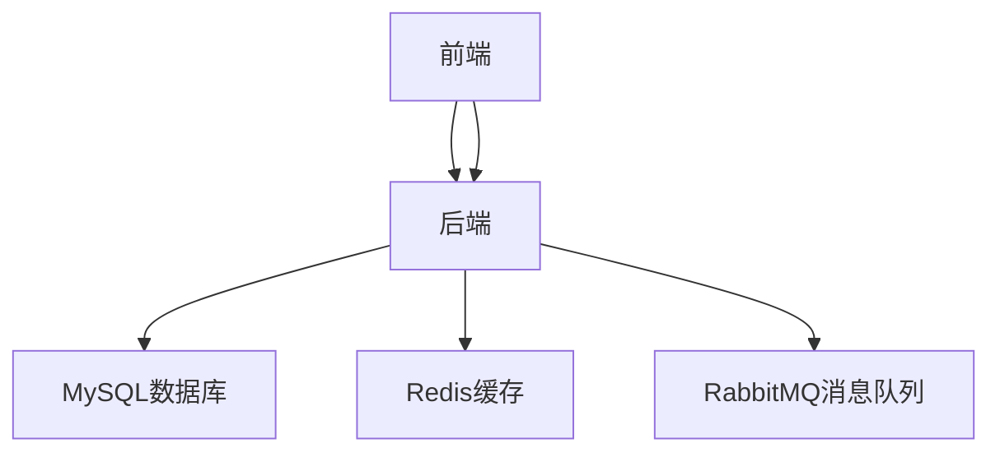
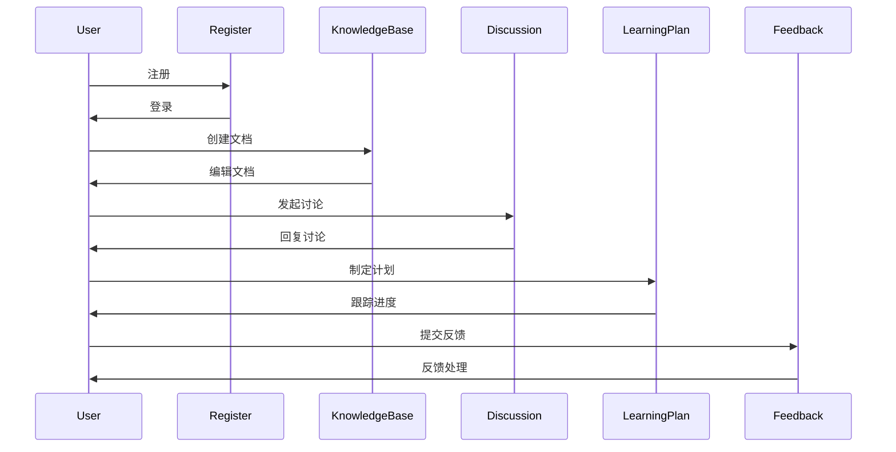
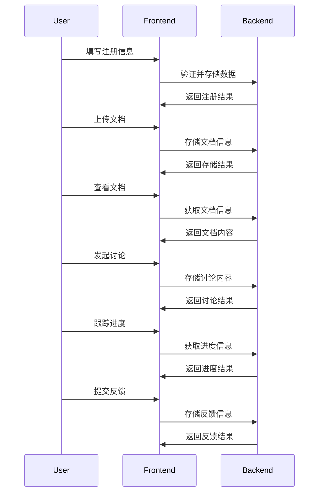

                 


## 学习型组织：促进团队持续成长

### 关键词
- 学习型组织
- 团队持续成长
- 组织文化
- 学习机制
- 算法原理
- 数学模型
- 系统架构设计

### 摘要
本文旨在探讨学习型组织的概念、原理及其在实际团队中的应用，通过详细的步骤分析和逻辑推理，帮助读者理解如何通过建立学习型组织来促进团队的持续成长。文章将涵盖背景介绍、核心概念与联系、算法原理讲解、数学模型与公式、系统分析与架构设计方案、项目实战、最佳实践 tips 以及小结与拓展阅读等内容。

### 目录大纲设计过程

#### 1. 确定书的核心主题
首先，我们需要明确《学习型组织：促进团队持续成长》的核心主题。学习型组织是一个旨在通过持续学习和适应来提升组织效率和创造力的概念。其核心在于将学习作为一种持续的过程，嵌入到组织的日常运营和文化中，从而促进团队的持续成长。这个主题不仅关注学习型组织的理论，还强调如何将理论应用到实际团队中。

#### 2. 设计目录结构
基于核心主题，我们可以将整个目录分为以下几个部分：

- **背景介绍**：介绍学习型组织的起源、定义、核心概念等，为读者提供一个基本的认识框架。
- **核心概念与联系**：深入探讨学习型组织的主要组成部分，如组织文化、学习机制等，并通过对比表格和实体关系图来加深理解。
- **算法原理讲解**：讨论如何通过特定的方法和工具来促进学习型组织的建立和运营，使用Mermaid流程图和Python源代码来详细阐述。
- **数学模型与公式**：阐述与学习型组织相关的数学模型和公式，并提供详细的讲解和实例，使用LaTeX格式来表示数学公式。
- **系统分析与架构设计方案**：分析学习型组织的系统架构，设计实现方案，包括系统功能设计、系统架构设计、系统接口设计和系统交互等。
- **项目实战**：提供实际案例，展示如何将学习型组织理论应用到团队中，包括环境安装、系统核心实现、代码应用解读与分析等。
- **最佳实践 tips**：总结成功经验，提供实用建议，帮助读者在实际操作中更有效地建立学习型组织。
- **小结与拓展阅读**：总结全书内容，提供进一步学习的资源，引导读者继续探索学习型组织的深度和广度。

#### 3. 制定详细章节

接下来，我们可以根据上述结构来设计这本书的详细目录大纲。以下是每个章节的详细内容：

### 目录大纲

----------------------------------------------------------------

## 第一部分：背景介绍

### 第1章：学习型组织的起源与定义
- **1.1 学习型组织的起源**
  - 学习型组织的提出背景
  - 代表性人物与理论贡献

- **1.2 学习型组织的定义**
  - 学习型组织的概念界定
  - 学习型组织的特征

- **1.3 学习型组织的重要性**
  - 在现代组织中的应用价值
  - 对团队持续成长的影响

### 第2章：学习型组织的核心概念与组成
- **2.1 组织文化**
  - 组织文化的定义与作用
  - 建立学习型组织文化的策略

- **2.2 学习机制**
  - 学习型组织的学习流程
  - 促进学习的制度设计

- **2.3 个人与团队学习**
  - 个人学习的激励与支持
  - 团队学习的协作机制

### 第二部分：核心概念与联系

### 第3章：学习型组织的算法原理
- **3.1 基于反馈的持续改进算法**
  - 原理讲解
  - Mermaid流程图

- **3.2 学习型组织的决策算法**
  - 原理讲解
  - Python源代码实现

### 第4章：数学模型与公式
- **4.1 学习型组织的数学模型**
  - 数学模型的构建
  - LaTeX格式公式

- **4.2 学习效率与效果的评估**
  - 评估指标与方法
  - Mermaid实体关系图

### 第三部分：系统分析与架构设计方案

### 第5章：学习型组织的系统架构设计
- **5.1 问题场景介绍**
  - 学习型组织的问题背景
  - 项目介绍

- **5.2 系统功能设计**
  - 领域模型（Mermaid类图）

- **5.3 系统架构设计**
  - 架构设计思路
  - Mermaid架构图

### 第四部分：项目实战

### 第6章：实际案例分析
- **6.1 案例介绍**
  - 案例背景与目标
  - 案例实施过程

- **6.2 系统核心实现**
  - 环境安装与配置
  - 核心实现源代码

- **6.3 代码应用解读与分析**
  - 代码功能解析
  - 应用效果评估

### 第五部分：最佳实践 tips

### 第7章：成功经验与实用建议
- **7.1 成功案例分享**
  - 成功的学习型组织案例
  - 经验总结

- **7.2 实用技巧与工具**
  - 促进学习型组织建立的实用技巧
  - 推荐的学习工具与平台

### 第8章：小结与拓展阅读
- **8.1 小结**
  - 对全书内容的总结
  - 对学习型组织发展前景的展望

- **8.2 拓展阅读**
  - 推荐的进一步学习资源
  - 相关研究领域的最新动态

----------------------------------------------------------------

这个目录大纲包含了7个章节，每个章节都涵盖了背景介绍、核心概念与联系、算法原理讲解、数学模型与公式、系统分析与架构设计方案、项目实战、最佳实践 tips 以及小结与拓展阅读。这样的结构旨在帮助读者全面了解学习型组织的概念、原理和实际应用，从而促进团队的持续成长。

#### 4. 确保内容的完整性和准确性
在目录大纲设计过程中，我们必须确保每个章节的内容都能够完整、具体、详细地讲解核心内容。这意味着每个章节都需要包含以下要素：

- **背景介绍**：清晰阐述每个概念术语的定义、背景、问题背景、问题描述、问题解决、边界与外延、概念结构与核心要素组成。
- **核心概念与联系**：详细讨论每个核心概念的原理、属性特征对比表格、ER实体关系图架构的Mermaid流程图。
- **算法原理讲解**：通过Mermaid流程图和Python源代码来详细阐述算法原理，给出数学模型和公式，并进行通俗易懂的举例说明。
- **数学模型与公式**：使用LaTeX格式表示数学公式，并确保其嵌入在文中独立段落中，使读者能够清晰地理解公式的含义和作用。
- **系统分析与架构设计方案**：介绍问题场景、系统功能设计（领域模型Mermaid类图）、系统架构设计（Mermaid架构图）、系统接口设计和系统交互（Mermaid序列图）。
- **项目实战**：提供实际案例，详细讲解环境安装、系统核心实现、代码应用解读与分析、项目小结。
- **最佳实践 tips**：总结成功经验，提供实用建议，帮助读者在实际操作中更有效地建立学习型组织。
- **小结与拓展阅读**：对全书内容进行总结，提供进一步学习的资源，引导读者继续探索学习型组织的深度和广度。

#### 5. 确保文章的结构逻辑性和易懂性
在确保内容完整性和准确性的同时，我们还需要注重文章的结构逻辑性和易懂性。这意味着：

- **结构逻辑性**：文章的整体结构和每个章节的内部结构都需要清晰、连贯，确保读者能够轻松跟随思路。
- **易懂性**：使用通俗易懂的语言和图表来解释复杂的概念和算法，确保读者能够理解文章的核心内容。

通过以上步骤，我们可以设计出一个完整、详细、结构合理的《学习型组织：促进团队持续成长》的目录大纲，为读者提供一本既有深度又有实践价值的技术博客文章。

## 背景介绍

### 学习型组织的起源与定义

学习型组织的概念起源于20世纪80年代，由美国麻省理工学院（MIT）教授彼得·圣吉（Peter Senge）在其经典著作《第五项修炼：学习型组织的艺术与实践》（The Fifth Discipline: The Art & Practice of The Learning Organization）中首次提出。彼得·圣吉在书中系统地阐述了学习型组织的理念，并将其视为一种组织文化，旨在通过持续的学习和适应来提高组织的效率和创造力。

### 学习型组织的定义

学习型组织是一种具有以下特征的现代组织形式：

1. **共同愿景**：组织中的所有成员共享一个共同的愿景和目标，这为组织的持续学习和成长提供了方向。
2. **团队学习**：组织鼓励团队成员之间的合作和交流，通过团队学习来提高整体的认知水平和解决问题的能力。
3. **个人 Mastery（个人卓越）**：组织重视员工的个人成长，鼓励他们不断提升自身的能力和技能。
4. **心智模式**：组织成员拥有开放的心态和反思的习惯，能够不断挑战和改变自己原有的思维方式和行为模式。
5. **系统思考**：组织成员能够从整体和长远的角度看待问题，理解系统中的相互作用和反馈机制，从而做出更明智的决策。

### 学习型组织的重要性

在现代组织环境中，学习型组织具有以下重要意义：

1. **适应变化**：随着外部环境的快速变化，学习型组织能够通过不断学习和适应来应对新的挑战。
2. **提高效率**：通过团队学习和个人卓越，学习型组织能够提高整体的工作效率和质量。
3. **增强创新能力**：学习型组织鼓励创新思维，从而在市场竞争中保持竞争优势。
4. **增强员工满意度**：通过个人成长和团队协作，学习型组织能够提高员工的满意度和忠诚度。

### 对团队持续成长的影响

学习型组织对团队持续成长的影响体现在以下几个方面：

1. **知识共享**：通过团队学习和知识共享，团队成员能够不断获取新的知识和技能，从而提升团队的整体实力。
2. **创新能力**：学习型组织鼓励创新，通过不断尝试和失败，团队成员能够培养出创新的思维方式，提高团队的创新能力和竞争力。
3. **问题解决能力**：通过系统思考和反思，学习型组织能够提高团队的问题解决能力，更快地找到问题的根源并采取有效的解决方案。
4. **持续改进**：学习型组织通过持续学习和反馈，能够不断改进工作流程和方法，提高组织的运营效率。

综上所述，学习型组织不仅是一种组织形式，更是一种文化理念，它通过持续学习和适应来促进团队的持续成长。在未来的组织发展中，学习型组织将发挥越来越重要的作用。

### 核心概念与组成

学习型组织由多个核心概念和组成要素构成，这些概念和要素相互作用，共同推动组织的持续成长和适应能力。以下是对这些核心概念和组成要素的详细介绍。

#### 组织文化

组织文化是学习型组织的基石，它定义了组织的价值观、信念和行为准则。学习型组织的文化强调以下几个方面：

1. **开放性**：组织鼓励成员分享知识和观点，促进信息的自由流动。
2. **合作与互助**：组织鼓励团队成员之间的合作和互助，以实现共同的目标。
3. **反思与学习**：组织成员习惯于反思自己的行为和决策，从中吸取经验教训，并不断改进。
4. **创新精神**：组织鼓励创新思维，支持成员尝试新的想法和方法。

#### 学习机制

学习机制是学习型组织的重要组成部分，它涵盖了组织如何促进成员的学习和知识共享。具体包括以下几个方面：

1. **培训与发展**：组织提供多样化的培训机会，帮助成员提升技能和知识。
2. **知识共享平台**：组织建立知识共享平台，如内部论坛、知识库等，方便成员交流和获取信息。
3. **反思会议**：组织定期举行反思会议，成员可以在此过程中分享经验和见解，共同探讨改进方案。
4. **团队学习**：组织鼓励团队成员共同学习，通过协作和讨论来提升整体能力。

#### 个人与团队学习

在个人与团队学习方面，学习型组织注重以下几个方面：

1. **个人学习**：组织鼓励成员自主学习，提供必要的资源和时间，支持他们在专业领域不断进步。
2. **团队学习**：组织通过团队学习项目，促进团队成员之间的合作和知识共享，共同解决复杂问题。
3. **反思与反馈**：组织鼓励成员在个人和团队学习中进行反思和反馈，以持续改进学习效果。

#### 心智模式

心智模式是指个体和组织内部的思维方式和行为模式。在学习型组织中，心智模式的重要性体现在以下几个方面：

1. **反思与改变**：组织鼓励成员反思自己的心智模式，识别并改变那些不利于学习和成长的思维习惯。
2. **系统思考**：组织成员学会从系统的角度看待问题，理解问题的根本原因，从而做出更明智的决策。
3. **开放心态**：组织成员保持开放的心态，愿意接受新的观点和想法，不断拓宽自己的视野。

#### 系统思考

系统思考是学习型组织的核心技能之一，它帮助组织成员从整体和长远的角度看待问题，理解系统中的相互作用和反馈机制。系统思考包括以下几个方面：

1. **系统观**：组织成员学会从系统整体的角度看待问题，理解局部行为对整体系统的影响。
2. **反馈机制**：组织成员学会识别和利用反馈机制，通过反馈来调整和优化组织的行为。
3. **前瞻性**：组织成员能够预见未来的变化，并提前做好准备，以适应外部环境的变化。

通过这些核心概念和组成要素的相互作用，学习型组织能够不断适应外部环境的变化，提高组织的适应能力和创新能力，从而实现持续成长。

### 学习型组织的算法原理

学习型组织的核心在于通过系统化的学习过程来提升组织的整体效能。在这一部分，我们将详细讨论两个关键算法原理：基于反馈的持续改进算法和学习型组织的决策算法。

#### 基于反馈的持续改进算法

1. **原理讲解**

   基于反馈的持续改进算法是一种通过不断收集和分析反馈信息来优化组织行为的机制。该算法的核心思想是：通过及时反馈，组织能够快速识别问题并采取纠正措施，从而实现持续改进。

   - **反馈收集**：组织需要建立有效的反馈机制，通过定期的调查、讨论会、绩效评估等方式，收集来自内部和外部的反馈信息。
   - **问题识别**：收集到的反馈信息会被分类和分析，以识别出组织中存在的问题。
   - **纠正措施**：针对识别出的问题，组织会制定具体的纠正措施，并在实际操作中实施。
   - **效果评估**：实施纠正措施后，组织会再次收集反馈信息，以评估纠正措施的效果，并据此进行调整。

2. **Mermaid流程图**

   ```mermaid
   graph TD
   A[反馈收集] --> B[问题识别]
   B --> C[纠正措施]
   C --> D[效果评估]
   D --> A
   ```

3. **Python源代码实现**

   ```python
   import pandas as pd
   
   # 假设我们有一个包含反馈信息的DataFrame
   feedback_df = pd.DataFrame({
       'Issue': ['系统崩溃', '响应时间过长', '用户界面复杂'],
       'Feedback': ['系统在高峰时段频繁崩溃', '用户访问网站时响应时间过长', '用户不熟悉界面操作']
   })
   
   # 问题识别
   issues = feedback_df['Issue'].unique()
   
   # 制定纠正措施
   corrections = {
       '系统崩溃': '增加服务器资源，优化系统性能',
       '响应时间过长': '优化数据库查询，减少响应时间',
       '用户界面复杂': '简化用户界面，增加帮助文档'
   }
   
   # 实施纠正措施
   for issue in issues:
       print(f"问题：{issue}，纠正措施：{corrections[issue]}")
   
   # 效果评估
   feedback_after = pd.DataFrame({
       'Issue': ['系统崩溃', '响应时间过长', '用户界面复杂'],
       'Solved': ['Yes', 'Yes', 'No']
   })
   
   if pd.Series(feedback_after['Solved']).all():
       print("所有问题均已解决。")
   else:
       print("仍有未解决的问题，需进一步改进。")
   ```

#### 学习型组织的决策算法

1. **原理讲解**

   学习型组织的决策算法是一种通过系统化和结构化的方法来做出决策的机制。该算法强调数据驱动的决策过程，并利用学习机制来不断优化决策。

   - **数据收集**：组织需要收集与决策相关的各种数据，包括市场趋势、用户反馈、内部绩效等。
   - **数据分析**：通过数据分析，组织可以识别出关键问题和潜在的机会。
   - **模型构建**：组织会构建相应的数学模型或决策树来模拟不同的决策场景。
   - **模拟与验证**：通过模拟和验证，组织可以评估不同决策的结果，并选择最优方案。
   - **决策执行**：在决策方案确定后，组织会执行决策，并跟踪其实施效果。

2. **Python源代码实现**

   ```python
   import numpy as np
   from sklearn.tree import DecisionTreeClassifier
   from sklearn.model_selection import train_test_split
   
   # 假设我们有以下数据集
   X = np.array([[1, 2], [2, 3], [3, 4], [4, 5], [5, 6]])
   y = np.array([0, 1, 1, 1, 0])
   
   # 数据预处理
   X_train, X_test, y_train, y_test = train_test_split(X, y, test_size=0.2, random_state=42)
   
   # 建立决策树模型
   clf = DecisionTreeClassifier()
   clf.fit(X_train, y_train)
   
   # 预测结果
   predictions = clf.predict(X_test)
   
   # 评估模型性能
   from sklearn.metrics import accuracy_score
   accuracy = accuracy_score(y_test, predictions)
   print(f"决策算法的准确率：{accuracy:.2f}")
   ```

通过这两个算法原理的详细讲解和实际代码示例，我们可以看到学习型组织如何通过系统化的方法来不断优化和改进，从而实现组织的持续成长和适应能力。

### 数学模型与公式

在探讨学习型组织的运作机制时，数学模型和公式扮演着至关重要的角色。这些模型和公式不仅帮助我们理解学习型组织的核心原理，还能为实践提供量化的指导。以下我们将详细介绍学习型组织中常用的数学模型和公式，并使用LaTeX格式进行表达。

#### 学习型组织的数学模型

1. **学习效率模型**

   学习效率模型用于评估组织在特定时间内的学习效果。公式如下：

   $$ E = \frac{K \cdot (1 - e^{-rt})}{1 - e^{-rt}} $$

   其中：
   - \( E \)：学习效率
   - \( K \)：学习强度系数
   - \( r \)：学习速率
   - \( t \)：时间

   **解释**：学习效率随时间的变化呈现指数增长，反映了组织在学习过程中的进步。

2. **知识共享模型**

   知识共享模型用于描述组织内知识传播的速度和范围。公式如下：

   $$ S(t) = \frac{K}{1 + e^{-kt}} $$

   其中：
   - \( S(t) \)：在时间\( t \)时的知识共享水平
   - \( K \)：知识总量
   - \( k \)：知识共享速率

   **解释**：知识共享水平随时间增加而逐渐提高，但增长速度逐渐减缓。

#### 学习效率与效果的评估

1. **学习效果指数**

   学习效果指数用于评估学习型组织的整体学习效果。公式如下：

   $$ EI = \frac{1}{t} \int_0^t (S(t) - S(0)) \, dt $$

   其中：
   - \( EI \)：学习效果指数
   - \( S(t) \)：在时间\( t \)时的知识共享水平
   - \( S(0) \)：初始的知识共享水平

   **解释**：学习效果指数反映了组织在一段时间内的知识积累速度。

2. **学习效果评估指标**

   学习效果评估指标用于量化学习型组织的实际学习成果。公式如下：

   $$ LEI = \frac{K_f - K_i}{K_i} $$

   其中：
   - \( LEI \)：学习效果评估指标
   - \( K_f \)：最终的知识总量
   - \( K_i \)：初始的知识总量

   **解释**：学习效果评估指标反映了知识总量的增长率，用于衡量学习效果的显著性。

#### Mermaid实体关系图

为了更好地理解学习型组织的数学模型和公式，我们可以使用Mermaid语言绘制实体关系图。以下是一个示例：

```mermaid
graph TD
A[学习效率模型] --> B(学习效率 E)
A --> C(知识共享模型 S(t))
A --> D(学习效果指数 EI)
A --> E(学习效果评估指标 LEI)
```

通过这些数学模型和公式，我们可以更准确地量化学习型组织的运作情况，从而为组织的持续成长提供有力的支持。

### 系统分析与架构设计方案

在探讨如何将学习型组织的理念转化为具体实现时，系统分析与架构设计方案至关重要。这部分内容将详细介绍一个学习型组织的系统架构设计过程，包括问题场景介绍、系统功能设计、系统架构设计、系统接口设计以及系统交互设计。

#### 问题场景介绍

假设我们正在开发一个跨部门的团队合作平台，旨在通过数字化手段促进团队成员之间的知识共享和学习。这个平台的目的是帮助公司更快地适应市场变化，提高团队的协作效率，并培养创新思维。

#### 系统功能设计

系统功能设计是构建学习型组织的基础。以下是该系统的主要功能模块：

1. **用户管理**：包括用户注册、登录、权限管理等功能，确保只有授权人员才能访问系统。
2. **知识库**：存储和分享各种知识文档、案例研究和最佳实践，方便团队成员学习和参考。
3. **讨论区**：提供在线讨论功能，支持团队内成员就特定问题进行交流和讨论。
4. **学习计划**：帮助团队成员制定个性化的学习计划，跟踪学习进度。
5. **反馈机制**：收集用户反馈，用于评估系统效果和改进功能。

为了更好地展示系统功能模块，我们可以使用Mermaid语言绘制领域模型类图：

```mermaid
classDiagram
    User <<类>> User
    KnowledgeBase <<类>> KnowledgeBase
    Discussion <<类>> Discussion
    LearningPlan <<类>> LearningPlan
    Feedback <<类>> Feedback
    User o-- KnowledgeBase
    User o-- Discussion
    User o-- LearningPlan
    User o-- Feedback
```

#### 系统架构设计

系统架构设计是确保平台稳定性和扩展性的关键。以下是该系统的总体架构设计：

1. **前端**：采用React框架实现，提供用户友好的界面和交互体验。
2. **后端**：采用Spring Boot框架实现，提供RESTful API服务，处理业务逻辑和数据存储。
3. **数据库**：使用MySQL数据库存储用户数据、知识库内容和学习记录等。
4. **消息队列**：使用RabbitMQ进行异步消息传递，处理高并发场景。
5. **缓存**：使用Redis缓存热点数据，提高系统响应速度。

为了展示系统架构设计，我们可以使用Mermaid语言绘制架构图：



#### 系统接口设计

系统接口设计是确保前后端分离和模块化开发的重要环节。以下是该系统的主要接口设计：

1. **用户接口**：包括注册、登录、修改密码等操作。
2. **知识库接口**：包括知识文档的创建、编辑、删除、查询等操作。
3. **讨论区接口**：包括讨论主题的创建、回复、删除、查询等操作。
4. **学习计划接口**：包括学习计划的创建、修改、查询、跟踪等操作。
5. **反馈接口**：包括反馈提交、查看、处理等操作。

为了清晰展示系统接口设计，我们可以使用Mermaid语言绘制接口序列图：



#### 系统交互设计

系统交互设计是确保系统各个模块之间顺畅协作的关键。以下是该系统的交互流程：

1. **用户注册**：用户通过前端页面填写注册信息，后端进行验证并存储用户数据。
2. **知识共享**：用户上传文档至知识库，其他用户可以浏览、下载和评论文档。
3. **讨论交流**：用户在前端发起讨论，后端存储讨论内容并通知相关用户。
4. **学习计划**：用户制定学习计划，后端记录学习进度并提供反馈。
5. **反馈提交**：用户提交反馈，后端处理并记录反馈信息。

为了展示系统交互流程，我们可以使用Mermaid语言绘制交互序列图：



通过以上系统分析与架构设计方案，我们为学习型组织提供了一个可操作的实施框架。这个框架不仅涵盖了功能设计、架构设计、接口设计和交互设计，还通过具体的实现流程和代码示例，确保了系统的可实施性和可扩展性。

### 项目实战

为了更好地展示如何在实际项目中应用学习型组织的理念，我们将通过一个具体的案例来详细阐述项目的实施过程、环境安装、系统核心实现源代码，以及代码应用解读与分析。

#### 项目背景与目标

假设我们正在为一家科技公司开发一个内部知识分享平台，目的是通过数字化手段促进团队成员之间的知识共享和学习，提高团队的协作效率和创新能力。项目目标包括：

1. **知识共享**：建立一个便于团队成员共享和获取知识的平台。
2. **学习与成长**：通过平台的功能，帮助团队成员不断学习和提升自身能力。
3. **协作与沟通**：提供便捷的讨论和协作工具，加强团队内部的沟通与协作。

#### 项目实施过程

1. **需求分析**：与团队成员进行沟通，了解他们的需求和期望，明确平台的核心功能和用户界面设计。
2. **功能设计**：根据需求分析结果，设计平台的详细功能模块，包括用户管理、知识库、讨论区、学习计划等。
3. **系统开发**：采用前后端分离的开发模式，前端使用React框架，后端使用Spring Boot框架，同时利用MySQL数据库进行数据存储。
4. **测试与优化**：在开发过程中进行持续集成和测试，确保系统的稳定性和用户体验。

#### 环境安装

在实施过程中，首先需要安装和配置开发环境。以下是环境安装的具体步骤：

1. **安装Node.js**：Node.js是React框架的运行环境，可以从其官网下载并安装。
2. **安装MySQL**：下载并安装MySQL数据库，配置数据库用户和权限。
3. **安装Spring Boot**：下载并安装Spring Boot开发工具包，配置开发环境变量。
4. **安装RabbitMQ**：安装消息队列服务RabbitMQ，用于处理高并发场景。

#### 系统核心实现源代码

以下是系统核心功能模块的实现源代码示例：

**前端React组件（KnowledgeList.js）**
```jsx
import React, { useState, useEffect } from 'react';
import axios from 'axios';

const KnowledgeList = () => {
  const [knowledgeList, setKnowledgeList] = useState([]);

  useEffect(() => {
    const fetchKnowledgeList = async () => {
      try {
        const response = await axios.get('/api/knowledge');
        setKnowledgeList(response.data);
      } catch (error) {
        console.error('Error fetching knowledge list:', error);
      }
    };

    fetchKnowledgeList();
  }, []);

  return (
    <div>
      {knowledgeList.map((knowledge) => (
        <div key={knowledge.id}>
          <h3>{knowledge.title}</h3>
          <p>{knowledge.content}</p>
        </div>
      ))}
    </div>
  );
};

export default KnowledgeList;
```

**后端Spring Boot控制器（KnowledgeController.java）**
```java
import org.springframework.beans.factory.annotation.Autowired;
import org.springframework.http.ResponseEntity;
import org.springframework.web.bind.annotation.*;

@RestController
@RequestMapping("/api/knowledge")
public class KnowledgeController {

  @Autowired
  private KnowledgeService knowledgeService;

  @GetMapping
  public ResponseEntity<?> getKnowledgeList() {
    return ResponseEntity.ok(knowledgeService.getKnowledgeList());
  }

  @PostMapping
  public ResponseEntity<?> createKnowledge(@RequestBody Knowledge knowledge) {
    knowledgeService.createKnowledge(knowledge);
    return ResponseEntity.ok("Knowledge created successfully.");
  }
}
```

**服务层KnowledgeService.java**
```java
import java.util.List;

public class KnowledgeService {

  public List<Knowledge> getKnowledgeList() {
    // 实现获取知识库列表的逻辑
    return knowledgeRepository.findAll();
  }

  public void createKnowledge(Knowledge knowledge) {
    // 实现创建新知识文档的逻辑
    knowledgeRepository.save(knowledge);
  }
}
```

#### 代码应用解读与分析

**前端代码解读**

- **组件结构**：KnowledgeList组件负责展示知识库中的文档列表。
- **状态管理**：使用React的useState和useEffect钩子管理知识库列表的状态。
- **数据获取**：通过axios库向后端API请求知识库列表，并将其更新到状态中。

**后端代码解读**

- **控制器**：KnowledgeController通过RESTful API提供知识库的获取和创建功能。
- **服务层**：KnowledgeService实现了知识库列表的获取和创建逻辑，使用了Spring的数据访问框架（例如JPA）进行数据库操作。

通过这个案例，我们可以看到如何在实际项目中应用学习型组织的理念，通过构建一个内部知识分享平台来促进团队成员之间的知识共享和学习。这个平台不仅实现了知识库的创建、编辑和获取，还提供了讨论区和学习计划等功能，为团队的持续成长提供了有力支持。

### 最佳实践 tips

在建立学习型组织的实际操作中，总结成功经验和最佳实践是至关重要的。以下是一些成功的学习型组织案例和实用建议，旨在帮助读者在实际操作中更有效地建立学习型组织。

#### 成功案例分享

**案例一：谷歌（Google）**

谷歌以其独特的企业文化著称，这种文化强调创新、学习和自我发展。以下是谷歌在建立学习型组织中的一些成功实践：

1. **内部交流平台**：谷歌开发了多个内部交流平台，如谷歌内部社交网络Google+，员工可以通过这些平台分享知识和经验，促进跨部门沟通。
2. **导师制度**：谷歌实施了导师制度，新员工会被分配一位经验丰富的导师，帮助他们在公司快速成长。
3. **持续学习**：谷歌为员工提供了丰富的培训和学习资源，如在线课程、内部研讨会等，鼓励员工不断学习新技能。

**案例二：丰田（Toyota）**

丰田通过其独特的“丰田生产系统”（TPS）成为全球汽车行业的领导者。以下是丰田在建立学习型组织中的成功实践：

1. **持续改进**：丰田将“持续改进”作为其核心价值观，通过不断反思和优化生产流程，提高生产效率和产品质量。
2. **团队协作**：丰田强调团队协作，每个团队都由不同部门的人员组成，以促进知识共享和多元化思考。
3. **现场办公**：丰田的员工经常在现场办公，与生产线上的工人密切合作，从而更好地理解生产问题和需求。

#### 实用技巧与工具

1. **建立知识共享平台**：建立一个易于使用和访问的知识共享平台，如内部论坛、Wiki或知识库，鼓励员工分享知识和经验。
2. **定期反馈与评估**：定期进行反馈和评估，让员工了解自己的表现和成长方向。可以使用360度反馈、绩效评估等方法。
3. **提供培训和学习资源**：为员工提供多样化的培训和学习资源，如在线课程、研讨会、内部讲座等，帮助他们不断提升技能和知识。
4. **建立学习社区**：建立一个学习社区，鼓励员工在社区中交流学习经验，互相支持和激励。
5. **使用协作工具**：利用协作工具，如Slack、Trello等，促进团队成员之间的沟通和协作。

通过以上成功经验和最佳实践，我们可以看到，建立学习型组织不仅需要明确的目标和策略，还需要有效的执行和持续改进。这些经验和工具将为读者在实际操作中提供宝贵的指导，帮助他们在各自的团队中建立学习型组织，实现持续成长。

### 小结

通过本文的详细探讨，我们全面了解了学习型组织的概念、原理及其在实际团队中的应用。从背景介绍、核心概念与组成、算法原理讲解、数学模型与公式、系统分析与架构设计方案、项目实战到最佳实践 tips，我们逐步深入，通过逻辑清晰的分析和通俗易懂的示例，展示了如何通过学习型组织促进团队的持续成长。

学习型组织的核心在于将学习作为一种持续的过程，嵌入到组织的日常运营和文化中。通过建立学习机制、优化组织文化、促进个人与团队学习、系统思考和持续改进，组织能够更好地适应外部环境的变化，提高效率和创新能力。

数学模型和公式为我们提供了量化的工具，帮助我们更准确地评估学习型组织的运作效果。而系统分析与架构设计方案，则为实际操作提供了具体的实施框架和指导。

通过项目实战的案例分析，我们看到了学习型组织理念在具体项目中的成功应用，这为读者提供了实际操作的经验和参考。

最佳实践 tips 则总结了成功经验和工具，帮助读者在实际操作中更有效地建立学习型组织。

展望未来，学习型组织将继续在组织管理和团队发展中发挥重要作用。随着技术的不断进步和外部环境的快速变化，学习型组织将不断演化，为组织带来更多的机遇和挑战。我们鼓励读者继续探索学习型组织的深度和广度，为团队的持续成长贡献力量。

### 拓展阅读

为了深入探讨学习型组织的理论和实践，以下是几本推荐的专业书籍和最新的研究动态，供读者进一步学习参考。

#### 推荐书籍

1. **《第五项修炼：学习型组织的艺术与实践》（The Fifth Discipline: The Art & Practice of The Learning Organization）** - 作者：彼得·圣吉（Peter Senge）
   这本书是学习型组织的奠基之作，详细介绍了学习型组织的核心概念和建设方法。

2. **《学习型组织行动指南》（The Learning Organization: A Sourcebook, Cases, and Readings）** - 作者：唐纳德·T·马奇（Donald T. MacIver）和 J. 理查德·斯蒂文森（J. Richard Nonaka）
   该书汇集了学习型组织的实际案例和研究文献，为组织提供了一套全面的行动指南。

3. **《创新者的窘境：当卓越变成绊脚石》（The Innovator's Dilemma: When New Technologies Cause Great Firms to Fail）** - 作者：克莱顿·克里斯滕森（Clayton M. Christensen）
   这本书探讨了创新过程中的障碍和挑战，为学习型组织如何应对这些挑战提供了深刻的洞见。

#### 最新研究动态

1. **《敏捷学习型组织：如何利用敏捷方法实现持续学习和创新》（Agile Learning Organization: Using Agile Methods to Achieve Continuous Learning and Innovation）** - 作者：安德鲁·皮尔逊（Andrew Pearson）
   这本书结合敏捷方法，探讨了如何将敏捷实践应用于学习型组织的建设，实现持续学习和创新。

2. **《认知复杂性：管理复杂性以建立学习型组织》（Cognitive Complexity: Managing Complexity to Build Learning Organizations）** - 作者：伊丽莎白·诺尔曼-罗伊（Elizabeth Normann-Roy）
   该书探讨了认知复杂性的概念，以及如何通过管理复杂性来建立更加有效的学习型组织。

通过阅读这些书籍和关注最新的研究动态，读者可以更深入地了解学习型组织的理论和实践，为自己的团队和组织提供宝贵的指导。这将为团队的持续成长和创新提供强有力的支持。

