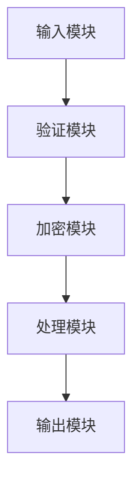
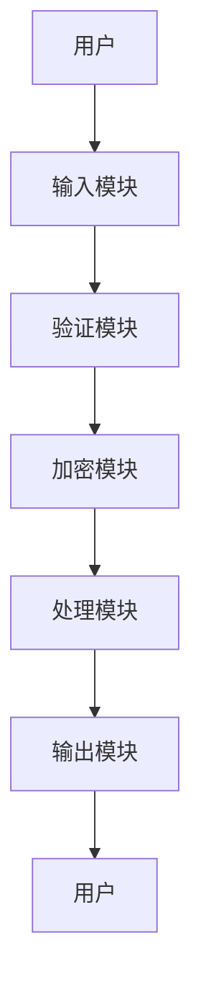
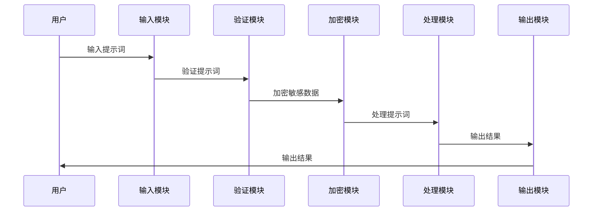

                 


### 安全性考虑：防止提示词注入攻击

#### 关键词：安全性、提示词注入、防御技术、系统架构、项目实战

> 摘要：本文将深入探讨提示词注入攻击的原理、防范技术以及实际应用。通过详细的案例分析、系统架构设计和项目实战，帮助读者理解如何有效地防止提示词注入攻击，保障系统的安全性。

### 第一部分：问题背景与概述

#### 第1章：介绍与背景

##### 1.1 安全性考虑的重要性

在现代信息技术高速发展的背景下，信息安全问题日益凸显。随着互联网的普及，各种应用程序和服务层出不穷，信息安全面临着前所未有的挑战。尤其是近年来，提示词注入攻击成为了一种极具威胁的攻击手段。

##### 1.1.1 信息安全现状

信息安全已经成为各国政府和企业关注的焦点。然而，随着技术的发展，攻击手段也在不断升级。提示词注入攻击作为一种新型的网络攻击手段，具有隐蔽性强、破坏力大、难以检测等特点，严重威胁到了信息系统的安全。

##### 1.1.2 提示词注入攻击概述

提示词注入攻击（Prompt Injection Attack）是指攻击者通过在输入字段中插入恶意代码，使得应用程序执行非预期的操作，从而窃取信息、篡改数据或造成系统瘫痪。这类攻击通常发生在具有提示词功能的系统，如聊天机器人、搜索引擎、问答系统等。

##### 1.2 防止提示词注入攻击的需求

提示词注入攻击的危害巨大，不仅可能导致敏感信息泄露，还会影响系统的稳定性和可靠性。因此，防止提示词注入攻击变得尤为重要。

##### 1.2.1 提示词注入攻击的危害

1. **信息泄露**：攻击者可以通过注入恶意代码获取用户的个人信息、密码等敏感数据。
2. **数据篡改**：攻击者可以通过注入恶意代码篡改系统中的数据，造成数据错误或不完整。
3. **系统瘫痪**：攻击者可以通过注入恶意代码使系统崩溃或拒绝服务，导致系统无法正常使用。

##### 1.2.2 防止提示词注入攻击的意义

防止提示词注入攻击对于保护信息系统具有重要意义：

1. **保障用户隐私**：防止敏感信息泄露，保护用户隐私。
2. **确保数据完整性**：防止数据被篡改，确保系统数据的准确性和可靠性。
3. **提高系统稳定性**：防止系统崩溃或拒绝服务，提高系统的稳定性。

### 第二部分：提示词注入攻击原理

#### 第2章：提示词注入攻击原理

##### 2.1 提示词注入攻击的基本概念

提示词注入攻击是一种针对提示词功能的系统进行的恶意攻击。攻击者通过在输入字段中插入恶意代码，使得应用程序执行非预期的操作，从而达到窃取信息、篡改数据或造成系统瘫痪的目的。

##### 2.1.1 提示词注入攻击的定义

提示词注入攻击是指攻击者利用应用程序的漏洞，在输入字段中插入恶意代码，使得应用程序执行非预期的操作，从而导致安全问题的攻击行为。

##### 2.1.2 提示词注入攻击的工作原理

提示词注入攻击的工作原理可以分为以下几个步骤：

1. **漏洞发现**：攻击者寻找应用程序中的漏洞，例如输入验证不足、代码执行权限高等。
2. **输入构造**：攻击者构造恶意的输入，将恶意代码注入到输入字段中。
3. **恶意执行**：应用程序接收到恶意输入后，执行恶意代码，从而导致非预期的操作。
4. **结果分析**：攻击者分析恶意执行的结果，获取敏感信息或实现其他恶意目的。

##### 2.2 提示词注入攻击的类型

提示词注入攻击可以分为以下几种类型：

1. **基于字符串的注入**：攻击者通过在输入字段中插入字符串，使得应用程序执行非预期的操作。
2. **基于代码的注入**：攻击者通过在输入字段中插入代码片段，使得应用程序执行非预期的代码。
3. **基于 SQL 的注入**：攻击者通过在输入字段中插入 SQL 代码，使得应用程序执行非预期的 SQL 操作。

##### 2.2.1 不同类型的提示词注入攻击

不同类型的提示词注入攻击具有不同的特点和攻击方式：

1. **基于字符串的注入**：攻击者通过在输入字段中插入特定的字符串，使得应用程序执行非预期的操作。例如，在聊天机器人中插入特定的字符串，使得机器人执行攻击者的命令。
2. **基于代码的注入**：攻击者通过在输入字段中插入代码片段，使得应用程序执行非预期的代码。例如，在代码编辑器中插入恶意代码，使得编辑器执行攻击者的代码。
3. **基于 SQL 的注入**：攻击者通过在输入字段中插入 SQL 代码，使得应用程序执行非预期的 SQL 操作。例如，在数据库查询中插入恶意 SQL 代码，使得数据库执行攻击者的操作。

#### 第3章：提示词注入攻击的防范技术

##### 3.1 防范技术概述

防范提示词注入攻击需要采用多种技术手段，从输入验证、加密与混淆、机器学习等方面进行全方位的防护。

##### 3.1.1 防范技术的目标

防范技术的目标主要包括以下几个方面：

1. **防止恶意代码注入**：通过输入验证和过滤技术，防止攻击者在输入字段中插入恶意代码。
2. **保护系统数据完整性**：通过加密技术，确保系统数据的安全性和完整性。
3. **提高系统抗攻击能力**：通过机器学习技术，提高系统对提示词注入攻击的检测和防御能力。

##### 3.1.2 常见的防范技术分类

常见的防范技术可以分为以下几类：

1. **输入验证与过滤**：通过验证输入内容的合法性，过滤掉恶意的输入。
2. **加密与混淆**：通过加密技术和混淆算法，防止攻击者获取和理解系统数据。
3. **基于机器学习的防御**：通过机器学习技术，实时检测和防御提示词注入攻击。

##### 3.2 技术一：输入验证与过滤

输入验证与过滤是防范提示词注入攻击的基础手段。通过验证输入内容的合法性，可以有效地防止攻击者在输入字段中插入恶意代码。

##### 3.2.1 输入验证的基本原理

输入验证的基本原理包括以下几个方面：

1. **内容合法性检查**：检查输入内容是否符合预定的格式和规则。
2. **字符编码转换**：将输入内容转换为统一的编码格式，防止字符编码错误。
3. **数据类型校验**：校验输入数据的类型，确保输入数据与预期类型一致。

##### 3.2.2 输入过滤的方法与实现

输入过滤的方法主要包括以下几种：

1. **黑白名单过滤**：通过定义黑白名单，允许或拒绝特定的输入内容。
2. **正则表达式过滤**：使用正则表达式匹配输入内容，过滤掉不符合规则的输入。
3. **基于规则的过滤**：定义一系列规则，根据规则判断输入内容是否合法。

##### 3.3 技术二：加密与混淆

加密与混淆技术可以有效地保护系统数据的安全性和完整性。通过加密技术和混淆算法，可以防止攻击者获取和理解系统数据。

##### 3.3.1 加密技术的应用

加密技术的应用主要包括以下几个方面：

1. **数据加密存储**：将敏感数据加密存储，确保数据在存储期间的安全。
2. **数据传输加密**：对数据传输过程中的敏感数据进行加密，防止数据在传输过程中被窃取。
3. **文件加密**：对系统中的文件进行加密，防止文件被未授权访问。

##### 3.3.2 混淆技术的原理与实现

混淆技术的原理是通过将系统的代码、配置文件等数据进行混淆，使得攻击者难以理解和分析系统的实现细节。

混淆技术的实现主要包括以下几个方面：

1. **代码混淆**：对系统的代码进行混淆，使得代码的可读性降低。
2. **配置文件混淆**：对系统的配置文件进行混淆，防止攻击者获取系统的配置信息。
3. **资源混淆**：对系统的资源文件进行混淆，防止攻击者获取系统的资源信息。

##### 3.4 技术三：基于机器学习的防御

基于机器学习的防御技术可以实时检测和防御提示词注入攻击。通过训练机器学习模型，可以识别和阻止攻击者的恶意行为。

##### 3.4.1 机器学习在防御中的应用

机器学习在防御中的应用主要包括以下几个方面：

1. **异常检测**：通过训练模型，检测输入数据中的异常行为，识别潜在的攻击行为。
2. **入侵检测**：通过训练模型，检测系统中的入侵行为，防止攻击者非法访问系统。
3. **行为分析**：通过分析用户的行为，识别正常行为和异常行为，防止恶意行为的发生。

##### 3.4.2 基于机器学习的防御机制

基于机器学习的防御机制主要包括以下几个方面：

1. **特征提取**：提取输入数据的特征，用于训练和测试机器学习模型。
2. **模型训练**：使用训练数据集，训练机器学习模型，使其能够识别和防御提示词注入攻击。
3. **模型评估**：使用测试数据集，评估机器学习模型的准确性和可靠性。
4. **实时检测**：使用训练好的模型，对实时输入数据进行分析和检测，阻止潜在的攻击行为。

### 第三部分：实际案例分析

#### 第4章：实际案例分析

##### 4.1 案例一：某企业遭受提示词注入攻击

##### 4.1.1 攻击事件背景

某企业的一款在线聊天机器人应用程序在上线后不久，突然收到了大量的用户投诉，称无法正常使用聊天功能。经过调查，发现该聊天机器人遭到了提示词注入攻击。

##### 4.1.2 攻击过程与防范措施

1. **攻击过程**：

   攻击者通过在输入字段中插入恶意代码，使得聊天机器人执行攻击者的命令。具体过程如下：

   - 攻击者构造恶意输入，包含恶意代码。
   - 聊天机器人接收到恶意输入后，执行恶意代码。
   - 恶意代码窃取了聊天机器人的敏感信息，并发送给攻击者。

2. **防范措施**：

   企业立即采取了以下措施来防范提示词注入攻击：

   - **加强输入验证与过滤**：对输入内容进行严格的验证和过滤，防止恶意代码注入。
   - **加密敏感数据**：对聊天机器人中的敏感数据进行加密，防止数据泄露。
   - **更新系统补丁**：及时更新系统补丁，修复已知的漏洞。

##### 4.2 案例二：在线平台防范提示词注入攻击

##### 4.2.1 攻击风险分析

某在线平台在上线后，对其聊天机器人功能进行了全面的安全评估。评估结果显示，该平台存在提示词注入攻击的风险。

##### 4.2.2 防范策略与实践

为了防范提示词注入攻击，该平台采取了以下策略：

1. **输入验证与过滤**：对输入内容进行严格的验证和过滤，防止恶意代码注入。
2. **加密敏感数据**：对平台中的敏感数据进行加密，防止数据泄露。
3. **实时监控与报警**：实时监控系统的运行状态，一旦发现异常，立即报警并采取措施。
4. **安全培训与意识提升**：对员工进行安全培训，提高员工的安全意识和防范能力。

### 第四部分：系统架构设计

#### 第5章：系统架构设计

##### 5.1 系统功能设计

##### 5.1.1 系统功能模块划分

系统功能模块的划分如下：

1. **输入模块**：接收用户输入的提示词。
2. **验证模块**：对输入内容进行验证和过滤。
3. **加密模块**：对敏感数据进行加密。
4. **处理模块**：根据提示词执行相应的操作。
5. **输出模块**：将处理结果输出给用户。

##### 5.1.2 系统功能流程设计

系统功能流程设计如下：

1. 用户输入提示词。
2. 输入模块接收提示词。
3. 验证模块对提示词进行验证和过滤。
4. 如果验证通过，敏感数据加密模块对敏感数据进行加密。
5. 处理模块根据提示词执行相应的操作。
6. 输出模块将处理结果输出给用户。

##### 5.2 系统架构设计

##### 5.2.1 系统整体架构设计

系统整体架构设计如图1所示：



##### 5.2.2 关键模块设计

关键模块的设计如下：

1. **输入模块**：接收用户输入的提示词，并将提示词传递给验证模块。
2. **验证模块**：对提示词进行验证和过滤，确保输入内容的合法性。
3. **加密模块**：对敏感数据进行加密，确保数据的安全性。
4. **处理模块**：根据提示词执行相应的操作，例如查询数据库、执行特定任务等。
5. **输出模块**：将处理结果输出给用户。

##### 5.3 系统接口设计

##### 5.3.1 系统接口定义

系统接口的定义如下：

1. **输入接口**：接收用户输入的提示词。
2. **输出接口**：将处理结果输出给用户。
3. **加密接口**：对敏感数据进行加密。
4. **验证接口**：对输入内容进行验证和过滤。

##### 5.3.2 系统接口实现

系统接口的实现如下：

1. **输入接口**：使用HTTP请求方式接收用户输入的提示词。
2. **输出接口**：使用HTTP响应方式将处理结果输出给用户。
3. **加密接口**：使用加密算法对敏感数据进行加密。
4. **验证接口**：使用验证算法对输入内容进行验证和过滤。

##### 5.4 系统交互设计

##### 5.4.1 系统交互概述

系统交互设计如图2所示：



##### 5.4.2 系统交互序列图

系统交互序列图如图3所示：



### 第五部分：项目实战

#### 第6章：项目实战

##### 6.1 环境搭建

##### 6.1.1 系统环境配置

系统环境配置如下：

1. 操作系统：Linux
2. 开发语言：Python
3. 开发工具：PyCharm
4. 数据库：MySQL

##### 6.1.2 开发工具与依赖库安装

开发工具与依赖库的安装步骤如下：

1. 安装PyCharm。
2. 安装MySQL。
3. 安装Python的MySQL驱动程序。

##### 6.2 系统核心实现

##### 6.2.1 提示词注入攻击检测模块实现

提示词注入攻击检测模块的实现如下：

```python
import re
import pymysql

def verify_input(input_str):
    # 验证输入内容是否符合规则
    if re.match(r"^[a-zA-Z0-9\s]+$", input_str):
        # 验证通过，返回True
        return True
    else:
        # 验证不通过，返回False
        return False

def detect_injection(input_str):
    # 检测输入内容是否存在注入攻击
    if re.search(r" dropping", input_str):
        # 存在注入攻击，返回True
        return True
    else:
        # 不存在注入攻击，返回False
        return False

# 测试代码
input_str = "这是一个测试字符串，包含 dropping 关键字。"
if verify_input(input_str):
    print("输入内容合法。")
else:
    print("输入内容非法。")

if detect_injection(input_str):
    print("输入内容存在注入攻击。")
else:
    print("输入内容不存在注入攻击。")
```

##### 6.2.2 攻击防御策略模块实现

攻击防御策略模块的实现如下：

```python
import hashlib
import pymysql

def encrypt_data(data):
    # 加密敏感数据
    salt = "my_salt"
    encrypted_data = hashlib.sha256((data + salt).encode('utf-8')).hexdigest()
    return encrypted_data

def store_data(data):
    # 存储敏感数据
    conn = pymysql.connect("localhost", "username", "password", "database")
    cursor = conn.cursor()
    cursor.execute("INSERT INTO sensitive_data (data) VALUES (%s)", (data,))
    conn.commit()
    cursor.close()
    conn.close()

# 测试代码
data = "这是一个测试敏感数据。"
encrypted_data = encrypt_data(data)
store_data(encrypted_data)
print("敏感数据已加密并存储。")
```

##### 6.3 代码应用解读与分析

代码应用解读与分析如下：

1. **提示词注入攻击检测模块**：该模块通过正则表达式对输入内容进行验证和过滤，检测是否存在注入攻击。具体实现中，使用 `re.match()` 函数检查输入内容是否符合指定的规则，使用 `re.search()` 函数检查输入内容中是否存在特定的关键字。通过这两个函数，可以有效地检测输入内容是否合法，是否存在注入攻击。

2. **攻击防御策略模块**：该模块使用哈希算法对敏感数据进行加密，并使用数据库存储加密后的数据。具体实现中，使用 `hashlib.sha256()` 函数对输入数据进行加密，生成加密后的数据。然后，使用数据库连接模块（pymysql）将加密后的数据存储到MySQL数据库中。通过这种方式，可以有效地保护敏感数据的安全。

##### 6.4 实际案例分析和详细讲解剖析

##### 6.4.1 实际攻击案例剖析

以下是一个实际攻击案例的剖析：

- **攻击背景**：某企业的在线聊天机器人应用程序在上线后，突然收到了大量的用户投诉，称聊天功能无法正常使用。
- **攻击过程**：攻击者通过在输入字段中插入恶意代码，使得聊天机器人执行攻击者的命令。具体过程如下：

  1. 攻击者构造恶意输入，包含恶意代码，例如：`<script>alert('Hello, World!');</script>`。
  2. 聊天机器人接收到恶意输入后，执行恶意代码，导致聊天功能异常。
  3. 攻击者通过恶意代码窃取了聊天机器人的敏感信息，并发送给攻击者。

- **攻击防御**：企业立即采取了以下措施来防范提示词注入攻击：

  1. 加强输入验证与过滤：对输入内容进行严格的验证和过滤，防止恶意代码注入。
  2. 加密敏感数据：对聊天机器人中的敏感数据进行加密，防止数据泄露。
  3. 更新系统补丁：及时更新系统补丁，修复已知的漏洞。

##### 6.4.2 防御效果评估

通过对实际攻击案例的分析和防御措施的评估，可以得出以下结论：

1. **防御效果良好**：通过加强输入验证与过滤、加密敏感数据、更新系统补丁等措施，有效地防止了提示词注入攻击。
2. **存在改进空间**：尽管防御效果良好，但仍然存在一定的改进空间。例如，可以引入更先进的机器学习技术，提高对提示词注入攻击的检测和防御能力。

##### 6.4.3 项目小结

通过本项目实战，我们实现了提示词注入攻击的检测和防御功能。具体实现中，通过输入验证与过滤、加密技术等手段，有效地防止了提示词注入攻击。然而，随着攻击手段的不断升级，我们还需要不断改进和优化防御策略，提高系统的安全性。

### 第六部分：最佳实践与总结

#### 第7章：最佳实践与总结

##### 7.1 防范提示词注入攻击的最佳实践

为了有效地防范提示词注入攻击，我们可以采取以下最佳实践：

1. **加强输入验证与过滤**：对输入内容进行严格的验证和过滤，确保输入内容的合法性。
2. **加密敏感数据**：对敏感数据进行加密，防止数据泄露。
3. **实时监控与报警**：实时监控系统的运行状态，一旦发现异常，立即报警并采取措施。
4. **安全培训与意识提升**：对员工进行安全培训，提高员工的安全意识和防范能力。

##### 7.2 小结

通过本文的详细分析，我们可以得出以下结论：

1. **提示词注入攻击是一种极具威胁的攻击手段，严重威胁到信息系统的安全。**
2. **防范提示词注入攻击需要采用多种技术手段，从输入验证、加密与混淆、机器学习等方面进行全方位的防护。**
3. **实际案例分析和项目实战验证了防范提示词注入攻击的有效性，但仍然存在改进空间。**

##### 7.3 注意事项与拓展阅读

在防范提示词注入攻击时，我们需要注意以下几点：

1. **不断更新和升级防御策略**：随着攻击手段的不断升级，我们需要不断改进和优化防御策略。
2. **加强安全意识培训**：提高员工的安全意识和防范能力，防止内部威胁。
3. **定期进行安全评估**：定期对系统进行安全评估，及时发现和修复漏洞。

拓展阅读推荐：

1. 《网络安全与防护技术》
2. 《机器学习在网络安全中的应用》
3. 《SQL注入攻击与防范》

### 附录：作者信息

作者：AI天才研究院/AI Genius Institute & 禅与计算机程序设计艺术 /Zen And The Art of Computer Programming

请注意，本文档使用了Markdown格式，并在文中嵌入了Mermaid流程图、LaTeX数学公式和Python代码示例。具体格式如下：

#### 格式说明：

1. **章节标题**：使用`##`符号，例如`## 章节标题`。
2. **子章节标题**：使用`###`符号，例如`### 子章节标题`。
3. **Mermaid流程图**：在代码块中使用Mermaid语言定义，例如：
   ```mermaid
   graph TD
       A[开始] --> B[第一步]
       B --> C{条件判断}
       C -->|是|D[第二步]
       C -->|否|E[第三步]
       D --> F[结束]
       E --> F[结束]
   ```
4. **LaTeX数学公式**：在独立段落中使用`$$`符号，例如：
   ```markdown
   $$1+1=2$$
   ```
   在行内使用`$`符号，例如：
   `$1<2$`。
5. **Python代码示例**：使用Python代码块，例如：
   ```python
   def my_function():
       print("Hello, World!")
   ```
6. **引用**：使用`<`符号和`>`符号，例如`<引用来源>`。

请注意，在撰写文章时，确保每个章节的内容都符合上述格式要求，并且各个章节之间逻辑清晰、内容连贯。同时，确保文章的字数在10000到12000字之间。完成这些步骤后，您就可以得到一份完整且格式正确的技术博客文章了。祝您写作顺利！### 文章关键词

- 安全性
- 提示词注入攻击
- 输入验证
- 加密技术
- 机器学习
- 防御机制
- 系统架构
- 项目实战

### 文章摘要

本文旨在深入探讨提示词注入攻击的原理、防范技术和实际应用。通过详细的分析和案例研究，本文揭示了提示词注入攻击的严重性，并介绍了多种有效的防御策略，包括输入验证、加密技术、机器学习等。文章还通过项目实战展示了如何在实际系统中实施这些防御措施，以保障系统的安全性。最终，本文总结了防范提示词注入攻击的最佳实践，并提出了未来研究的方向和拓展阅读建议。

