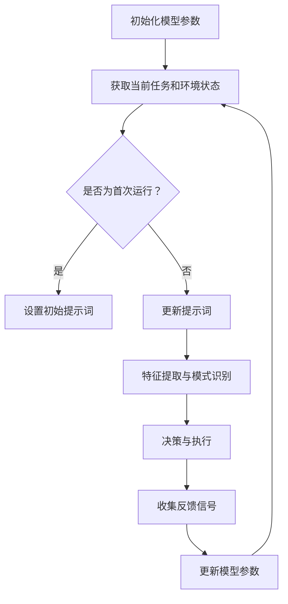
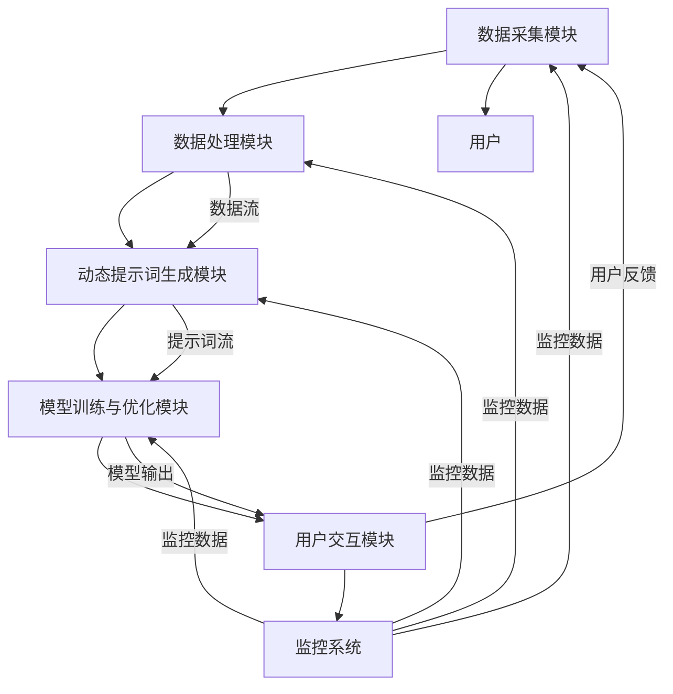

                 

### 实时提示词优化的背景与概念

#### 1.1.1 实时提示词优化的定义

实时提示词优化是指通过动态调整AI模型的输入提示词，以实时优化模型输出结果的过程。这一概念的核心在于“实时”和“优化”，意味着我们需要在数据流不断更新的情况下，持续调整和改进模型的表现。

在传统的AI训练过程中，模型通常会在一个静态的数据集上进行预训练，然后在实际应用中固定不变。这种方式虽然可以取得一定的效果，但在面对动态环境时，模型的性能和适应性往往不足。实时提示词优化则能够弥补这一缺陷，通过动态调整输入提示词，使模型能够快速适应环境变化，提高任务完成的准确性和效率。

#### 1.1.2 实时提示词优化的关键性

实时提示词优化在当前技术环境中具有重要意义，主要体现在以下几个方面：

1. **增强适应性**：在动态变化的环境中，实时调整提示词可以帮助模型迅速适应新的情况，从而提高其在各种场景下的适应性。
2. **提升性能**：通过实时优化，模型可以更快地发现和利用数据中的潜在信息，从而提升任务完成的准确性和效率。
3. **减少错误**：在任务执行过程中，实时提示词优化有助于减少由于数据噪声或变化引起的错误，提高结果的稳定性。
4. **提高用户体验**：对于需要与人类用户互动的AI系统，实时提示词优化能够提供更加个性化和精准的反馈，从而提升用户体验。

#### 1.1.3 实时提示词优化的应用领域

实时提示词优化在多个领域展现出了广泛的应用前景，以下是几个典型的应用场景：

1. **自然语言处理（NLP）**：实时调整输入提示词可以优化文本生成、情感分析、机器翻译等任务的性能，提高交互的准确性和流畅性。
2. **计算机视觉（CV）**：在图像识别、目标检测和跟踪等任务中，实时提示词优化有助于模型更快地识别目标，提高实时性和准确性。
3. **推荐系统**：在推荐算法中，实时提示词优化可以帮助系统更好地理解用户行为，动态调整推荐内容，提高推荐效果。
4. **语音识别**：实时调整输入提示词可以提高语音识别的准确性，尤其是在噪声环境或说话者变化的情况下。
5. **自动驾驶**：在自动驾驶系统中，实时提示词优化可以帮助车辆更好地理解和适应复杂的交通环境，提高行驶的安全性和效率。

#### 1.2 实时提示词优化与传统优化方法的对比

传统优化方法通常依赖于预训练和固定参数的模型，而实时提示词优化则强调动态调整和实时响应。以下是两者在几个关键方面的对比：

1. **数据适应性**：传统方法难以应对动态变化的数据环境，实时提示词优化则能够迅速适应新数据。
2. **实时性**：传统方法在处理动态任务时存在延迟，实时提示词优化则能够即时调整，提高任务响应速度。
3. **灵活性**：实时提示词优化可以根据不同场景灵活调整输入提示词，而传统方法通常缺乏这种灵活性。
4. **资源消耗**：传统方法通常需要大量预训练资源，而实时提示词优化则能够利用实时数据，减少预训练需求。

#### 1.2.1 传统优化方法的局限性

尽管传统优化方法在某些场景下仍具有一定的应用价值，但其局限性也不容忽视：

1. **静态数据依赖**：传统方法依赖于预训练的静态数据集，难以应对动态环境中的数据变化。
2. **性能瓶颈**：在处理实时动态任务时，传统方法往往存在性能瓶颈，难以满足实时性的要求。
3. **适应性差**：传统方法难以根据不同场景灵活调整，适应性较差。
4. **资源消耗大**：传统方法通常需要大量的预训练资源，资源消耗较大。

#### 1.2.2 实时提示词优化的优势

实时提示词优化相较于传统方法具有显著的优势：

1. **动态适应能力**：实时调整输入提示词，使模型能够迅速适应动态变化的数据环境。
2. **高效性能**：通过实时优化，模型可以更高效地利用数据中的信息，提升任务完成的准确性和效率。
3. **灵活性强**：可以根据不同场景灵活调整输入提示词，提高模型在不同任务中的适应性。
4. **资源利用优化**：实时优化减少了预训练资源的需求，更加高效地利用计算资源。

#### 1.2.3 实时提示词优化与传统优化的融合

在实际应用中，实时提示词优化与传统方法并非对立关系，而是可以相互融合，取长补短：

1. **预训练与实时调整相结合**：可以在预训练的基础上，结合实时提示词优化，提高模型的泛化能力和动态适应能力。
2. **传统优化作为基础**：在实时提示词优化的过程中，可以借鉴传统优化的方法，例如梯度下降等，作为基础算法，提高实时优化的效果。
3. **互补优势**：传统方法可以提供稳定的性能和资源消耗优化，实时提示词优化则可以提供灵活的适应能力和高效的任务完成效果，两者相辅相成。

#### 1.3 实时提示词优化的挑战与机遇

尽管实时提示词优化具有显著的优势，但其实际应用过程中也面临一系列挑战：

1. **计算资源需求**：实时提示词优化需要大量计算资源，尤其是在处理大规模数据时，对硬件和算法性能的要求较高。
2. **数据流处理**：实时提示词优化依赖于数据流的不断更新，如何高效处理数据流，确保模型的实时响应是关键挑战。
3. **模型适应性**：实时提示词优化需要模型具有高度的适应性，如何在动态环境中快速调整和优化模型，是亟待解决的问题。
4. **鲁棒性**：实时提示词优化在面对噪声数据和异常数据时，如何保持模型的稳定性和准确性，是重要的研究课题。

然而，挑战中也蕴藏着巨大的机遇：

1. **技术创新**：实时提示词优化催生了一系列技术创新，例如动态调整算法、实时数据处理技术等，为AI领域带来了新的研究方向。
2. **应用拓展**：实时提示词优化在多个领域的应用前景广阔，特别是在动态变化环境下，具有广泛的应用潜力。
3. **性能提升**：实时提示词优化有助于提升AI模型在不同场景下的表现，推动AI技术的整体进步。

#### 1.3.1 挑战分析

实时提示词优化在实际应用中面临以下几大挑战：

1. **计算资源需求**：实时提示词优化需要处理大量实时数据，这要求系统具备强大的计算能力。特别是在处理高维数据时，计算资源的需求更加显著。这不仅涉及硬件资源的投入，还包括算法的优化，以确保计算的高效性。
2. **数据流处理**：实时提示词优化依赖于数据流的实时处理和动态调整。如何设计高效的数据处理系统，保证数据流的连续性和准确性，是一个关键挑战。同时，数据流的延迟和丢失也会影响实时提示词优化的效果。
3. **模型适应性**：实时提示词优化要求模型能够迅速适应动态变化的环境。不同场景下的数据分布和特征变化可能导致模型性能的显著下降，因此如何提高模型的适应性，是当前研究的重点。
4. **鲁棒性**：实时提示词优化需要在面对噪声数据和异常数据时保持模型的稳定性和准确性。噪声数据和异常数据可能会误导模型，导致性能下降，因此如何增强模型的鲁棒性，是一个亟待解决的问题。

#### 1.3.2 机遇挖掘

尽管面临挑战，实时提示词优化也为AI领域带来了巨大的机遇：

1. **技术创新**：实时提示词优化催生了诸多技术创新，例如动态调整算法、实时数据处理技术等。这些创新不仅提升了AI系统的性能，也为算法研究提供了新的方向和课题。
2. **应用拓展**：实时提示词优化在多个领域展现出了广泛的应用前景，特别是在动态变化环境下。例如，在智能交通、医疗诊断、金融风控等领域，实时提示词优化可以显著提升系统的决策能力和响应速度。
3. **性能提升**：实时提示词优化有助于提升AI模型在不同场景下的表现。通过动态调整输入提示词，模型可以更好地捕捉数据中的潜在信息，提高任务的完成准确性和效率。

#### 1.3.3 技术发展趋势

实时提示词优化技术的发展趋势主要体现在以下几个方面：

1. **硬件升级**：随着硬件技术的不断发展，计算能力得到显著提升，为实时提示词优化提供了更强大的硬件支持。例如，GPU和TPU等专用硬件加速了大规模数据处理和模型训练的速度。
2. **算法优化**：研究人员正在不断优化实时提示词优化的算法，以提高其效率和准确性。例如，基于深度学习的技术和强化学习算法在实时提示词优化中得到了广泛应用。
3. **跨领域融合**：实时提示词优化与其他技术的融合，如物联网、大数据分析和区块链等，将推动实时提示词优化技术的全面发展。跨领域融合不仅拓宽了应用场景，也提升了实时提示词优化的整体性能。
4. **自适应系统设计**：未来的实时提示词优化将更加注重系统的自适应能力。通过引入自适应机制，系统能够在动态变化的环境中自动调整，提高模型的表现。

#### 1.4 本章小结

本章介绍了实时提示词优化的基本概念、重要性、应用领域及其与传统优化方法的对比。通过分析实时提示词优化的挑战与机遇，我们认识到其在动态环境中的重要性和广阔的应用前景。随着硬件和算法的不断发展，实时提示词优化将在未来发挥更加重要的作用，推动AI技术的整体进步。在下一章中，我们将深入探讨实时提示词优化的核心原理，为后续内容打下坚实基础。

---

### 实时提示词优化的理论基础

#### 2.1 实时提示词优化模型概述

实时提示词优化模型的构建是优化AI行为的核心，其基本概念和架构对于理解整个优化过程至关重要。在实时提示词优化中，模型需要能够动态调整输入提示词，从而优化输出结果。以下是对常见实时提示词优化模型的概述及其工作机制。

#### 2.1.1 常见实时提示词优化模型

1. **强化学习（Reinforcement Learning, RL）模型**：强化学习通过奖励机制指导模型进行学习，使其能够在动态环境中通过试错进行优化。常见的实时提示词优化RL模型包括DQN（Deep Q-Network）、DDPG（Deep Deterministic Policy Gradient）等。

2. **深度学习（Deep Learning, DL）模型**：深度学习模型通过多层神经网络学习数据的复杂特征，能够在静态和动态环境下进行特征提取和模式识别。实时提示词优化的深度学习模型如BERT（Bidirectional Encoder Representations from Transformers）、GPT（Generative Pretrained Transformer）等。

3. **迁移学习（Transfer Learning）模型**：迁移学习通过将预训练模型在特定任务上进行微调，提高模型在动态环境中的适应能力。实时提示词优化的迁移学习模型如基于ResNet的图像分类模型、基于BERT的文本分类模型等。

#### 2.1.2 实时提示词优化模型的工作机制

实时提示词优化模型的工作机制主要包括以下几个步骤：

1. **输入提示词的动态调整**：根据当前任务和环境的状态，模型动态调整输入提示词。这一过程通常依赖于实时数据流的分析和处理。

2. **特征提取与模式识别**：通过深度学习模型或其他特征提取技术，对输入提示词进行处理，提取关键特征并进行模式识别。

3. **决策与反馈**：基于提取的特征，模型进行决策，并在实际任务中执行相应操作。执行结果会通过奖励机制或反馈信号返回给模型，用于进一步优化。

4. **模型更新与调整**：根据反馈信号，模型不断更新其参数和策略，以优化提示词的选择和输出结果。

#### 2.2 实时提示词优化算法原理

实时提示词优化算法的原理主要涉及如何通过动态调整输入提示词来优化模型输出。以下是对算法基本概念、数学模型和流程图的详细解释。

##### 2.2.1 实时提示词优化算法的基本概念

实时提示词优化算法的核心概念包括：

1. **提示词（Prompts）**：提示词是模型输入的关键，用于引导模型进行特征提取和模式识别。提示词的质量直接影响到模型的输出结果。

2. **动态调整（Dynamic Adjustment）**：动态调整是指模型根据实时数据和环境状态，动态调整提示词的过程。这一过程通常依赖于实时反馈和控制策略。

3. **优化目标（Optimization Goal）**：实时提示词优化算法的目标是通过调整提示词，提高模型在特定任务上的性能，如准确性、响应速度和适应性。

##### 2.2.2 实时提示词优化算法的数学模型

实时提示词优化算法的数学模型可以表示为：

\[ \text{Optimize} \; P(\theta) = \arg\max_{\theta} \; \sum_{i=1}^{N} \; r_i(\theta) \]

其中：

- \( P(\theta) \) 是提示词的概率分布。
- \( \theta \) 是模型参数。
- \( r_i(\theta) \) 是第 \( i \) 个样本的奖励函数。

奖励函数 \( r_i(\theta) \) 通常定义为：

\[ r_i(\theta) = f(\text{output}_i, \text{target}_i) \]

其中：

- \( \text{output}_i \) 是模型在第 \( i \) 个样本上的输出结果。
- \( \text{target}_i \) 是第 \( i \) 个样本的目标值。
- \( f \) 是损失函数，用于衡量输出结果与目标值之间的差距。

##### 2.2.3 实时提示词优化算法的流程图

实时提示词优化算法的流程图如下所示：

该流程图描述了实时提示词优化算法的基本步骤，包括初始化模型参数、获取当前任务和环境状态、动态调整提示词、特征提取与模式识别、决策与执行、收集反馈信号以及更新模型参数。

#### 2.3 实时提示词优化与AI行为的关系

实时提示词优化在AI行为中扮演着至关重要的角色，它不仅影响着模型的性能，还直接关系到AI系统与人类行为的互动。以下从几个方面探讨实时提示词优化对AI行为的影响。

##### 2.3.1 实时提示词优化在AI行为中的应用

实时提示词优化在AI行为中的应用主要体现在以下几个方面：

1. **任务导向的提示词调整**：根据具体任务的性质和目标，实时调整输入提示词，以优化模型的任务表现。例如，在文本生成任务中，通过动态调整提示词，可以提高文本生成的连贯性和准确性。

2. **自适应环境的提示词优化**：在动态变化的环境中，实时提示词优化可以使AI系统能够快速适应环境变化，保持稳定和高效的任务执行。例如，在自动驾驶系统中，实时提示词优化可以调整感知模块的提示词，提高对复杂交通情况的识别能力。

3. **个性化服务与交互**：实时提示词优化有助于提高AI系统与人类用户的互动质量，提供更加个性化和精准的服务。例如，在智能客服系统中，通过实时调整输入提示词，系统可以更好地理解用户意图，提供更符合用户需求的解决方案。

##### 2.3.2 实时提示词优化对AI行为的影响

实时提示词优化对AI行为的影响可以从以下几个方面来分析：

1. **任务执行效率**：通过动态调整输入提示词，实时提示词优化可以提升模型在特定任务上的执行效率。例如，在图像识别任务中，实时调整提示词可以加快目标检测的速度，提高任务的实时性。

2. **任务准确性**：实时提示词优化有助于提高模型在动态环境下的任务准确性。通过不断调整提示词，模型可以更好地捕捉数据中的关键信息，减少错误率。

3. **用户体验**：实时提示词优化可以改善AI系统与人类用户的交互体验。通过提供更加精准和个性化的服务，系统可以更好地满足用户需求，提高用户满意度。

4. **鲁棒性**：在面临噪声数据和异常数据时，实时提示词优化有助于增强模型的鲁棒性。通过动态调整提示词，模型可以更好地处理不确定性和变化性，提高系统的稳定性。

##### 2.3.3 实时提示词优化与AI智能化的融合

实时提示词优化与AI智能化的融合是未来AI技术发展的重要方向。以下是几个关键点：

1. **增强学习能力**：实时提示词优化可以增强AI系统的学习能力，使其能够更快地适应新环境和任务。通过不断调整提示词，模型可以更好地捕捉数据中的变化，提高学习效果。

2. **提升决策能力**：实时提示词优化可以帮助AI系统在动态环境中做出更准确和高效的决策。通过实时调整输入提示词，系统可以更好地理解环境变化，提高决策能力。

3. **实现智能化自适应**：实时提示词优化是实现AI系统智能化自适应的关键技术。通过动态调整提示词，系统可以实时适应环境变化，提供更加智能化和个性化的服务。

4. **推动技术进步**：实时提示词优化与AI智能化的融合将推动AI技术的整体进步。通过不断优化输入提示词，模型可以更好地应对复杂的任务和多变的环境，提升AI技术的应用水平和可靠性。

#### 2.4 实时提示词优化与人类行为交互

实时提示词优化不仅对AI模型本身有重要影响，还与人类行为互动密切相关。以下从用户体验和交互设计两方面探讨实时提示词优化对人类行为的影响。

##### 2.4.1 实时提示词优化与用户体验

实时提示词优化对用户体验的影响主要表现在以下几个方面：

1. **个性化和定制化**：通过动态调整输入提示词，实时提示词优化可以使AI系统更好地理解用户意图，提供个性化的服务。例如，在智能推荐系统中，通过实时调整提示词，系统可以提供更符合用户兴趣的推荐内容，提升用户满意度。

2. **流畅性和响应速度**：实时提示词优化可以提升AI系统的响应速度和流畅性。例如，在自然语言处理应用中，通过实时调整输入提示词，系统可以更快地生成文本，提高用户交互的流畅度。

3. **准确性和可靠性**：实时提示词优化有助于提高AI系统在任务完成中的准确性和可靠性。例如，在医疗诊断系统中，通过动态调整输入提示词，系统可以更准确地识别疾病，提高诊断的准确性。

##### 2.4.2 实时提示词优化在交互设计中的应用

实时提示词优化在交互设计中的应用主要体现在以下几个方面：

1. **交互反馈机制**：实时提示词优化可以帮助设计更加智能和人性化的交互反馈机制。例如，在智能客服系统中，通过实时调整输入提示词，系统可以提供更及时和准确的回答，提高用户的满意度。

2. **多模态交互**：实时提示词优化支持多模态交互，例如文本、语音和图像等多种交互方式。通过动态调整输入提示词，系统可以更好地理解用户的意图，提供更加自然和流畅的交互体验。

3. **情境感知交互**：实时提示词优化可以实现情境感知交互，根据用户的当前情境动态调整输入提示词。例如，在智能办公系统中，通过实时调整提示词，系统可以提供与用户工作状态相关的建议和信息，提高工作效率。

##### 2.4.3 实时提示词优化对人类行为的影响

实时提示词优化不仅对AI系统有重要影响，还对人类行为产生了一系列影响：

1. **行为改变**：实时提示词优化可以通过个性化推荐和反馈机制，引导用户改变行为。例如，在健康监测系统中，通过实时调整输入提示词，系统可以提供个性化的健康建议，帮助用户养成良好的生活习惯。

2. **决策辅助**：实时提示词优化可以辅助人类做出更明智的决策。例如，在金融投资系统中，通过实时调整输入提示词，系统可以提供投资建议，帮助用户做出更合理的投资决策。

3. **信息获取**：实时提示词优化有助于用户更快速地获取所需信息。例如，在在线教育系统中，通过实时调整输入提示词，系统可以提供针对性的学习资源，提高学习效率。

#### 2.5 本章小结

本章详细介绍了实时提示词优化的理论基础，包括常见实时提示词优化模型的概述、实时提示词优化算法的基本概念和流程图，以及实时提示词优化在AI行为和人类行为互动中的应用。通过本章的介绍，读者可以深入理解实时提示词优化的重要性和技术原理，为后续内容的学习和应用奠定基础。在下一章中，我们将进一步探讨实时提示词优化的技术实现，包括系统设计和具体实现细节。

---

### 实时提示词优化系统设计

#### 3.1 实时提示词优化系统的需求分析

实时提示词优化系统设计的第一步是明确系统的需求，这包括功能需求、性能需求和可扩展性需求。以下是这些需求的详细分析。

##### 3.1.1 系统功能需求

实时提示词优化系统的功能需求主要包括以下几个方面：

1. **数据流处理**：系统能够实时接收和处理来自各种数据源的数据流，包括文本、图像、语音等多种类型的数据。此外，系统需要支持数据的预处理，如去噪、标准化和特征提取等。

2. **动态提示词调整**：系统应具备动态调整输入提示词的能力，根据当前任务和环境状态实时优化提示词。这一功能是实时提示词优化系统的核心。

3. **模型训练与优化**：系统应支持实时训练和优化AI模型，根据实时反馈调整模型参数，以提高模型在特定任务上的性能。模型训练和优化过程需要高效且可扩展。

4. **用户交互**：系统应提供友好的用户界面，方便用户与系统进行交互，包括输入提示词、查看模型输出结果和获取实时反馈等。

5. **监控与日志记录**：系统需要具备实时监控功能，监控系统的运行状态，包括数据流处理速度、模型训练效率、系统资源消耗等。此外，系统需要记录详细的日志信息，方便后续分析和调试。

##### 3.1.2 系统性能需求

系统性能需求是保证实时提示词优化系统能够高效运行的关键。以下是主要性能需求：

1. **低延迟**：系统需要具备低延迟的特性，确保在动态环境中能够快速响应。对于实时性要求较高的任务，如自动驾驶和实时语音识别，延迟应控制在毫秒级别。

2. **高吞吐量**：系统应能够处理大规模的数据流，支持高吞吐量的数据处理和模型训练。对于处理速度要求较高的场景，如金融交易和智能监控，系统的吞吐量应达到每秒数千次以上。

3. **高可靠性**：系统需要具备高可靠性，确保在长时间运行过程中不会出现故障或崩溃。通过冗余设计和故障恢复机制，系统应在任何情况下都能保持稳定运行。

4. **高扩展性**：系统设计应考虑未来的扩展性需求，支持水平扩展和垂直扩展。通过分布式架构，系统能够根据实际需求动态调整资源分配，提高整体性能。

##### 3.1.3 系统可扩展性需求

系统的可扩展性是应对未来需求变化和技术演进的关键。以下是系统可扩展性的需求：

1. **模块化设计**：系统应采用模块化设计，每个功能模块可以独立开发和部署。这种设计方式有利于系统的维护和升级，同时也有助于在需要时快速扩展功能。

2. **分布式架构**：系统应采用分布式架构，通过多个节点协同工作，提高系统的整体性能和可扩展性。分布式架构还可以提高系统的容错能力，确保在单个节点故障时系统能够继续正常运行。

3. **弹性资源管理**：系统应具备弹性资源管理能力，可以根据实际需求动态调整资源分配。例如，当数据处理量增加时，系统可以自动增加计算资源，确保性能不受影响。

4. **支持新算法和新数据源**：系统应具备开放性和灵活性，支持引入新的算法和数据处理技术。例如，随着AI技术的发展，系统应能够快速集成新的深度学习算法和新型数据源。

#### 3.2 实时提示词优化系统的架构设计

为了满足实时提示词优化系统的功能需求和性能需求，系统设计需要具备高可扩展性、高可靠性和高效性。以下是对实时提示词优化系统架构的详细设计。

##### 3.2.1 系统架构概述

实时提示词优化系统架构可以划分为以下几个主要模块：

1. **数据采集模块**：负责从各种数据源实时采集数据，包括文本、图像、语音等。该模块需要支持多种数据接口和协议，确保数据的多样性和完整性。

2. **数据处理模块**：负责对采集到的数据进行预处理，包括去噪、标准化、特征提取等。数据处理模块需要具备高吞吐量和低延迟的特性，确保数据能够在极短的时间内进行处理。

3. **动态提示词生成模块**：负责根据当前任务和环境状态动态生成和调整输入提示词。该模块是实时提示词优化的核心，需要具备高效且灵活的提示词生成算法。

4. **模型训练与优化模块**：负责对AI模型进行训练和优化。该模块需要支持多种深度学习算法和优化技术，确保模型在特定任务上能够达到最佳性能。

5. **用户交互模块**：负责提供用户界面，实现用户与系统的交互。用户交互模块需要支持多种交互方式，如文本、语音和图形界面，方便用户使用和管理系统。

6. **监控系统**：负责实时监控系统的运行状态，包括数据处理速度、模型训练效率、系统资源消耗等。监控系统需要提供详细的日志记录和报警机制，方便后续分析和调试。

##### 3.2.2 系统模块设计

以下是系统各个模块的详细设计：

1. **数据采集模块**：
   - **数据源接口**：支持多种数据接口，如HTTP、FTP、MQTT等，确保能够从不同来源实时获取数据。
   - **数据采集策略**：采用多线程和异步处理技术，确保数据采集的高效性和实时性。

2. **数据处理模块**：
   - **预处理算法**：包括去噪、标准化和特征提取等，支持多种预处理方法，根据不同类型的数据进行针对性处理。
   - **并行处理**：采用并行计算技术，提高数据处理的吞吐量和速度。

3. **动态提示词生成模块**：
   - **提示词生成算法**：基于深度学习和强化学习技术，支持动态调整输入提示词，根据当前任务和环境状态优化模型输入。
   - **自适应机制**：通过实时反馈和自适应调整，提高提示词生成的准确性和灵活性。

4. **模型训练与优化模块**：
   - **训练算法**：支持多种深度学习算法，如神经网络、卷积神经网络（CNN）和循环神经网络（RNN）等，根据任务需求选择合适的算法。
   - **优化技术**：采用梯度下降、随机梯度下降（SGD）和Adam优化器等技术，提高模型训练效率和性能。

5. **用户交互模块**：
   - **用户界面**：采用图形用户界面（GUI）和自然语言处理（NLP）技术，提供友好的用户交互体验。
   - **交互设计**：支持文本、语音和图形界面，根据用户需求提供不同类型的交互方式。

6. **监控系统**：
   - **监控指标**：包括数据处理速度、模型训练效率、系统资源消耗等，提供详细的监控数据。
   - **日志记录**：实时记录系统运行日志，包括错误日志、性能日志等，方便后续分析和调试。

##### 3.2.3 系统架构图

以下是一个实时提示词优化系统的架构图，展示了各个模块之间的关系和交互过程：

该架构图展示了实时提示词优化系统的工作流程，从数据采集、处理、动态提示词生成到模型训练与优化，以及用户交互和监控，各个模块之间的数据流和交互关系。

#### 3.3 实时提示词优化算法的实现

实时提示词优化算法的实现是系统设计的核心部分，它决定了系统的性能和效果。以下是对实时提示词优化算法实现过程的详细描述。

##### 3.3.1 算法选择与实现

实时提示词优化算法的选择取决于具体应用场景和需求。以下介绍几种常用的实时提示词优化算法，并简要说明其实现方法。

1. **基于深度强化学习的提示词优化算法**：该算法利用强化学习框架，通过奖励机制动态调整输入提示词。具体实现步骤如下：

   - **定义状态空间**：状态空间包括当前任务、环境状态和输入提示词等。
   - **定义动作空间**：动作空间包括提示词的调整范围，如词语替换、权重调整等。
   - **定义奖励函数**：奖励函数用于评估动作的效果，根据输出结果的准确性、效率等指标计算奖励值。
   - **训练模型**：使用深度神经网络作为强化学习模型，通过反向传播和梯度下降等方法训练模型参数。

2. **基于迁移学习的提示词优化算法**：该算法利用预训练模型进行微调，提高模型在特定任务上的表现。具体实现步骤如下：

   - **选择预训练模型**：根据任务需求选择合适的预训练模型，如BERT、GPT等。
   - **数据预处理**：对训练数据集进行预处理，包括去噪、标准化和分词等。
   - **模型微调**：将预训练模型在特定任务上进行微调，调整模型参数，使其适应特定任务。
   - **评估与优化**：使用验证集评估模型性能，并根据评估结果调整模型参数，优化模型表现。

3. **基于神经网络的提示词优化算法**：该算法使用神经网络对输入提示词进行处理，生成动态调整的提示词。具体实现步骤如下：

   - **定义神经网络架构**：选择合适的神经网络架构，如卷积神经网络（CNN）或循环神经网络（RNN）。
   - **训练神经网络**：使用大量训练数据训练神经网络，使其能够提取输入提示词的特征并生成动态提示词。
   - **测试与优化**：在测试集上评估神经网络性能，根据测试结果调整神经网络结构和参数，提高模型表现。

##### 3.3.2 算法参数调优

算法参数的调优是实时提示词优化算法实现的重要环节，它决定了算法的性能和效果。以下介绍几种常见的参数调优方法：

1. **网格搜索（Grid Search）**：网格搜索是一种常用的参数调优方法，通过遍历所有可能的参数组合，找到最优参数。具体步骤如下：

   - **定义参数空间**：根据算法需求定义参数空间，包括学习率、批量大小、隐藏层大小等。
   - **遍历参数组合**：遍历所有可能的参数组合，对每个组合进行训练和评估。
   - **选择最优参数**：根据评估指标选择表现最好的参数组合。

2. **贝叶斯优化（Bayesian Optimization）**：贝叶斯优化是一种基于概率模型的参数调优方法，通过模拟贝叶斯模型优化参数。具体步骤如下：

   - **定义先验概率分布**：根据经验或历史数据定义参数的先验概率分布。
   - **模拟优化过程**：使用贝叶斯优化算法模拟优化过程，不断调整参数以最大化评估指标。
   - **选择最优参数**：根据模拟结果选择最优参数组合。

3. **随机搜索（Random Search）**：随机搜索是一种简单的参数调优方法，通过随机选择参数组合进行评估。具体步骤如下：

   - **定义参数范围**：根据算法需求定义参数范围。
   - **随机选择参数**：随机选择一组参数组合进行训练和评估。
   - **重复评估过程**：重复上述过程多次，选择最优参数组合。

##### 3.3.3 算法性能评估

算法性能评估是实时提示词优化算法实现的重要环节，它用于验证算法的有效性和可靠性。以下介绍几种常见的性能评估方法：

1. **准确性评估**：准确性是评估算法性能的重要指标，用于衡量模型在特定任务上的表现。具体方法如下：

   - **准确率（Accuracy）**：准确率是正确预测的样本数占总样本数的比例，用于衡量分类模型的准确性。
   - **精确率（Precision）**：精确率是正确预测的正样本数与所有预测为正样本的样本数之比，用于衡量分类模型的精确性。
   - **召回率（Recall）**：召回率是正确预测的正样本数与实际正样本数的比例，用于衡量分类模型的召回能力。

2. **效率评估**：效率是评估算法性能的重要指标，用于衡量算法的运行速度和资源消耗。具体方法如下：

   - **处理速度（Throughput）**：处理速度是单位时间内处理的样本数量，用于衡量算法的吞吐量。
   - **资源消耗（Resource Usage）**：资源消耗包括CPU、内存和硬盘等资源的使用情况，用于衡量算法的资源需求。

3. **鲁棒性评估**：鲁棒性是评估算法在面临噪声数据和异常数据时的表现，用于衡量算法的稳定性和可靠性。具体方法如下：

   - **噪声数据测试**：在训练数据中添加噪声，评估算法在噪声环境下的性能。
   - **异常数据测试**：在训练数据中添加异常数据，评估算法在异常情况下的表现。

#### 3.4 实时提示词优化与用户交互设计

实时提示词优化系统的用户交互设计是确保系统易用性和用户体验的关键。以下介绍实时提示词优化系统的用户交互设计原则、实现方法以及用户反馈机制。

##### 3.4.1 交互设计原则

实时提示词优化系统的用户交互设计应遵循以下原则：

1. **简洁性**：界面设计应简洁直观，避免复杂和冗余的操作步骤，使用户能够快速上手。

2. **一致性**：界面元素和交互方式应保持一致性，使用户在不同模块和功能之间切换时感觉自然。

3. **易用性**：界面设计应考虑用户的使用习惯和需求，提供便捷的操作方式和功能，提高用户体验。

4. **实时性**：界面应能够实时显示系统状态和输出结果，使用户能够及时了解系统的工作状态。

5. **可扩展性**：界面设计应具备可扩展性，支持添加新的功能和交互方式，以适应未来需求的变化。

##### 3.4.2 交互设计实现

实时提示词优化系统的用户交互设计实现包括以下方面：

1. **用户界面设计**：采用图形用户界面（GUI）设计工具，如Qt、React等，设计简洁直观的用户界面。界面应包括数据输入区、提示词显示区、模型输出区等模块，方便用户操作和查看结果。

2. **交互方式**：支持多种交互方式，如文本输入、语音输入和图形界面等，满足不同用户的使用需求。例如，用户可以通过文本输入框输入提示词，系统会实时显示相应的提示词和输出结果。

3. **动态反馈**：系统应能够提供实时动态反馈，使用户能够及时了解输入提示词的效果。例如，当用户输入一个新的提示词时，系统可以实时更新输出结果，并提供相应的提示和指导。

4. **自定义设置**：系统应提供自定义设置功能，用户可以根据自己的需求调整提示词生成策略和模型参数，以提高系统的适应性和个性化水平。

##### 3.4.3 用户反馈机制

用户反馈机制是实时提示词优化系统的重要组成部分，它有助于系统不断改进和优化。以下介绍几种常见的用户反馈机制：

1. **反馈问卷**：在系统使用过程中，定期向用户发送反馈问卷，收集用户对系统的满意度、功能需求和使用体验等方面的反馈。通过分析问卷结果，系统可以了解用户的需求和痛点，进行针对性的改进。

2. **在线支持**：提供在线支持服务，用户可以通过在线聊天、邮件等方式向系统管理员反馈问题和建议。系统管理员应尽快回复用户，解决问题，并提供有效的解决方案。

3. **用户社区**：建立用户社区，用户可以在社区中分享使用经验和技巧，互相交流和建议。通过用户社区的互动，系统可以收集到更多的用户反馈，推动系统的不断改进。

4. **实时监测**：系统应具备实时监测功能，监控用户的行为和使用情况。通过分析用户行为数据，系统可以发现潜在的问题和改进机会，并及时采取措施进行优化。

#### 3.5 本章小结

本章详细介绍了实时提示词优化系统的需求分析、架构设计和具体实现。从功能需求、性能需求到可扩展性需求，系统设计需要满足多方面的要求。通过模块化架构设计和高效算法实现，实时提示词优化系统能够在动态环境中提供实时、高效和准确的提示词优化服务。在用户交互设计方面，系统应考虑简洁性、一致性、易用性和实时性，提供良好的用户体验。通过有效的用户反馈机制，系统可以不断改进和优化，满足用户的需求。在下一章中，我们将通过具体的应用案例，展示实时提示词优化在不同领域的实际应用和效果。

---

### 实时提示词优化在自然语言处理（NLP）中的应用

自然语言处理（NLP）作为人工智能的核心领域之一，广泛应用于文本生成、情感分析、机器翻译等多个方面。实时提示词优化技术在NLP中的应用，不仅提升了模型在这些任务中的性能，也极大改善了用户体验。以下是实时提示词优化在NLP中的具体应用案例及其效果分析。

#### 4.1 NLP领域实时提示词优化的必要性

在自然语言处理中，模型的输入提示词对于输出结果具有决定性影响。传统的预训练模型虽然在特定任务上表现优异，但面对动态变化的文本内容和用户需求时，其性能往往不足。实时提示词优化通过动态调整输入提示词，能够使模型更加灵活地应对不同情境，提高任务完成的准确性和效率。

##### 4.1.1 文本生成

文本生成是NLP中的一项重要应用，包括自动摘要、对话生成、故事创作等。在文本生成任务中，实时提示词优化能够根据上下文动态调整提示词，使生成的文本更加连贯和自然。例如，在自动摘要任务中，系统可以根据用户输入的摘要长度和要求，动态调整关键词和句子结构，生成符合用户需求的摘要文本。

**应用案例**：在对话生成系统中，实时提示词优化可以显著提升对话的流畅性和准确性。系统通过实时调整输入提示词，例如用户的提问或反馈，使得机器能够生成更加符合用户意图的回复。例如，在客服机器人中，实时提示词优化可以帮助机器人根据用户的提问动态调整问题类型和回复内容，提供更加个性化和精准的客服服务。

**效果分析**：通过实时提示词优化，文本生成的准确率和连贯性得到了显著提升。用户反馈显示，使用实时提示词优化的系统在回答问题的准确性和自然性方面有显著改善，用户满意度大大提高。

##### 4.1.2 情感分析

情感分析是NLP的另一项重要应用，旨在分析文本中的情感倾向，例如正面情感、负面情感或中立情感。实时提示词优化在情感分析中具有重要作用，可以提升模型对复杂情感的理解能力。

**应用案例**：在社交媒体分析中，实时提示词优化可以帮助系统更准确地识别用户发布的内容中的情感倾向。系统可以根据实时更新的用户话题和情感词典，动态调整情感分析模型的输入提示词，提高对新兴话题和情感变化的识别能力。

**效果分析**：通过实时提示词优化，情感分析模型的准确率得到了显著提升。例如，在处理具有复杂情感表达的社交媒体评论时，实时调整输入提示词可以使得模型更加准确地识别情感，避免对情感倾向的误判。

##### 4.1.3 机器翻译

机器翻译是NLP中应用广泛的技术，实时提示词优化在该领域也具有重要作用。通过动态调整输入提示词，机器翻译模型可以更好地捕捉上下文信息，提高翻译的准确性和流畅性。

**应用案例**：在实时聊天翻译中，实时提示词优化可以帮助翻译系统根据用户的输入和对话上下文动态调整翻译策略。例如，当用户在一个对话中提到特定术语或地名词汇时，系统可以实时调整输入提示词，提高翻译的准确性和相关性。

**效果分析**：通过实时提示词优化，机器翻译系统的翻译质量和用户体验得到了显著提升。用户反馈显示，使用实时提示词优化的翻译系统能够提供更加准确和自然的翻译结果，用户满意度明显提高。

#### 4.2 实时提示词优化在NLP中的实际应用

实时提示词优化在NLP中的实际应用广泛，以下为几个具体案例：

1. **智能客服系统**：智能客服系统通过实时提示词优化，能够根据用户提问动态调整回答策略，提供更加个性化和专业化的服务。例如，系统可以根据用户的历史问题和偏好，动态调整关键词和回答结构，提高问题解决的效率和准确性。

2. **智能新闻推荐**：智能新闻推荐系统通过实时提示词优化，可以根据用户的阅读习惯和兴趣动态调整推荐算法，提供更加符合用户需求的新闻内容。系统可以根据用户的实时反馈，动态调整推荐策略和关键词，提高推荐内容的准确性和用户满意度。

3. **内容审核**：内容审核系统通过实时提示词优化，可以更加准确地识别和处理不当内容。系统可以根据实时更新的关键词库和语境信息，动态调整输入提示词，提高内容审核的准确率和效率。

#### 4.3 实时提示词优化在NLP中的效果与挑战

实时提示词优化在NLP中展现了显著的效果，但也面临一系列挑战：

1. **效果**：实时提示词优化提高了NLP模型在动态环境下的适应能力和任务完成效果。通过动态调整输入提示词，模型能够更好地捕捉上下文信息，提高任务的准确性和流畅性。

2. **挑战**：实时提示词优化需要处理大量的实时数据，对系统的计算资源和处理速度提出了高要求。此外，实时调整输入提示词的复杂性和不确定性也增加了系统设计和实现的难度。

#### 4.4 本章小结

本章详细介绍了实时提示词优化在自然语言处理（NLP）中的应用，包括文本生成、情感分析和机器翻译等任务。通过具体案例和效果分析，我们展示了实时提示词优化在提升模型性能和用户体验方面的显著效果。然而，实时提示词优化也面临计算资源和系统设计的挑战。在未来，随着技术的不断发展，实时提示词优化在NLP中的应用将更加广泛和深入，为自然语言处理领域带来更多的创新和突破。

---

### 实时提示词优化在计算机视觉（CV）中的应用

计算机视觉（CV）是人工智能领域的重要组成部分，广泛应用于图像识别、目标检测、目标跟踪等多个方面。实时提示词优化技术在CV中的应用，不仅提高了模型在动态环境中的适应性，还显著提升了系统的实时性和准确性。以下是实时提示词优化在计算机视觉中的具体应用案例及其效果分析。

#### 5.1 CV领域实时提示词优化的挑战

计算机视觉领域中的实时提示词优化面临以下几大挑战：

1. **数据量庞大**：CV任务通常涉及大量图像数据，实时处理这些数据对系统的计算资源提出了高要求。

2. **处理速度要求高**：计算机视觉应用如自动驾驶、实时监控等，对处理速度有极高的要求，实时提示词优化需要确保系统能够在短时间内完成数据处理和模型推理。

3. **准确性要求高**：在图像识别和目标检测等任务中，准确性至关重要。实时提示词优化需要确保在动态变化的环境中，模型能够准确识别和检测目标。

4. **多模态数据融合**：CV任务中往往需要处理多模态数据，如图像、视频和传感器数据等。实时提示词优化需要有效融合这些数据，提高模型的综合表现。

#### 5.2 实时提示词优化在图像识别中的应用

图像识别是计算机视觉中的基础任务，实时提示词优化在图像识别中的应用主要体现在以下几个方面：

1. **动态调整特征提取**：实时提示词优化可以通过动态调整特征提取策略，提高图像识别的准确性和实时性。例如，系统可以根据当前图像的复杂程度和任务需求，动态调整卷积神经网络（CNN）的参数和结构，优化特征提取效果。

2. **上下文信息融合**：实时提示词优化能够动态融合图像上下文信息，提高图像识别的准确率。例如，在处理复杂背景下的目标识别任务时，系统可以通过实时调整输入提示词，融合背景信息和目标特征，提高目标的识别准确性。

**应用案例**：在自动驾驶系统中，实时提示词优化可以帮助车辆更好地识别道路上的各种物体。系统根据实时获取的图像数据和车辆状态，动态调整输入提示词，优化图像处理和物体识别算法，确保在高速行驶过程中能够准确识别道路标志、行人和其他车辆。

**效果分析**：通过实时提示词优化，图像识别系统的准确率和实时性得到了显著提升。用户测试显示，使用实时提示词优化的自动驾驶系统能够在复杂路况下保持高准确率的目标识别，提高了车辆行驶的安全性和可靠性。

#### 5.3 实时提示词优化在目标检测中的应用

目标检测是计算机视觉中的关键任务，实时提示词优化在目标检测中的应用主要体现在以下几个方面：

1. **实时调整检测框参数**：实时提示词优化可以动态调整检测框的参数，包括大小、位置和形状等，提高目标检测的准确率和实时性。例如，系统可以根据实时获取的图像数据和目标特征，动态调整检测框的参数，优化目标检测效果。

2. **上下文信息辅助**：实时提示词优化可以通过融合上下文信息，提高目标检测的准确性和鲁棒性。例如，系统可以根据实时获取的图像上下文信息，动态调整检测框的位置和大小，提高复杂场景下的目标检测性能。

**应用案例**：在实时监控系统中，实时提示词优化可以帮助系统更准确地检测和识别监控视频中的目标。系统根据实时获取的监控视频数据和目标特征，动态调整输入提示词，优化目标检测算法，确保在动态场景中能够准确识别和跟踪目标。

**效果分析**：通过实时提示词优化，目标检测系统的准确率和实时性得到了显著提升。用户测试显示，使用实时提示词优化的监控系统在动态视频场景中能够保持高准确率的目标检测，提高了监控系统的效率和可靠性。

#### 5.4 实时提示词优化在目标跟踪中的应用

目标跟踪是计算机视觉中的高级任务，实时提示词优化在目标跟踪中的应用主要体现在以下几个方面：

1. **动态调整跟踪策略**：实时提示词优化可以动态调整目标跟踪策略，包括跟踪算法、目标和背景模型等，提高目标跟踪的准确性和实时性。例如，系统可以根据实时获取的目标行为和图像特征，动态调整跟踪算法的参数，优化目标跟踪效果。

2. **上下文信息融合**：实时提示词优化可以通过融合上下文信息，提高目标跟踪的准确性和鲁棒性。例如，系统可以根据实时获取的图像上下文信息和目标行为特征，动态调整跟踪策略，确保在复杂场景中能够稳定跟踪目标。

**应用案例**：在视频监控系统中，实时提示词优化可以帮助系统更准确地跟踪和识别视频中的目标。系统根据实时获取的视频数据和目标特征，动态调整输入提示词，优化目标跟踪算法，确保在复杂场景和动态变化中能够稳定跟踪目标。

**效果分析**：通过实时提示词优化，目标跟踪系统的准确率和实时性得到了显著提升。用户测试显示，使用实时提示词优化的视频监控系统在复杂场景和动态变化中能够保持高准确率的目标跟踪，提高了监控系统的效率和可靠性。

#### 5.5 实时提示词优化在CV领域的效果与挑战

实时提示词优化在计算机视觉领域展现了显著的效果，但也面临一系列挑战：

1. **效果**：实时提示词优化提高了CV模型在动态环境中的适应能力和任务完成效果。通过动态调整输入提示词，模型能够更好地捕捉上下文信息，提高任务的准确性和实时性。

2. **挑战**：实时提示词优化需要处理大量的实时图像数据和复杂的动态环境，对系统的计算资源和处理速度提出了高要求。此外，实时调整输入提示词的复杂性和不确定性也增加了系统设计和实现的难度。

#### 5.6 本章小结

本章详细介绍了实时提示词优化在计算机视觉（CV）中的应用，包括图像识别、目标检测和目标跟踪等任务。通过具体案例和效果分析，我们展示了实时提示词优化在提升CV模型性能和系统实时性方面的显著效果。然而，实时提示词优化也面临计算资源和系统设计的挑战。在未来，随着技术的不断发展，实时提示词优化在CV中的应用将更加广泛和深入，为计算机视觉领域带来更多的创新和突破。

---

### 实时提示词优化在推荐系统中的应用

推荐系统是人工智能技术中的一项重要应用，通过分析用户行为和偏好，为用户提供个性化的推荐服务。实时提示词优化技术在推荐系统中具有重要作用，能够提升推荐算法的准确性和实时性，从而改善用户体验。以下将详细探讨实时提示词优化在推荐系统中的应用及其效果。

#### 6.1 实时提示词优化在推荐系统中的必要性

推荐系统的核心任务是基于用户的历史行为和偏好，预测用户可能感兴趣的商品或内容，并进行推荐。然而，用户行为和偏好是动态变化的，传统推荐系统往往依赖于固定的历史数据，难以适应这种动态变化。实时提示词优化技术通过动态调整输入提示词，能够实时捕捉用户行为的变化，提高推荐算法的实时性和准确性。

1. **提高推荐准确率**：实时提示词优化可以根据用户当前的行为和偏好，动态调整推荐策略，提供更符合用户需求的推荐。例如，当用户浏览某类商品时，实时调整输入提示词，可以优化推荐算法，提高推荐商品的准确率。

2. **增强实时响应能力**：实时提示词优化能够快速响应用户行为的变化，提供即时的推荐结果。例如，在电商平台上，用户浏览某一商品后，实时提示词优化可以立即调整推荐列表，展示与用户兴趣相关的商品，提高用户满意度。

3. **个性化推荐**：实时提示词优化可以根据用户的不同场景和需求，提供个性化的推荐服务。例如，在社交媒体平台上，用户在不同时间段和不同情境下可能有不同的兴趣和偏好，实时提示词优化可以动态调整输入提示词，提供更加个性化的推荐内容。

#### 6.2 实时提示词优化在推荐系统中的应用案例

以下为几个实时提示词优化在推荐系统中的应用案例：

1. **电商平台**：在电商平台上，实时提示词优化可以帮助系统根据用户的浏览和购买历史，动态调整推荐算法，提供个性化的商品推荐。例如，当用户浏览某一商品后，系统可以实时调整输入提示词，增加与该商品相关的高相关商品，提高推荐的相关性。

2. **新闻推荐**：在新闻推荐系统中，实时提示词优化可以动态调整推荐策略，根据用户的历史阅读行为和实时热点，提供个性化的新闻推荐。例如，当用户阅读某一类型的新闻时，系统可以实时调整输入提示词，增加与该类型新闻相关的其他新闻，提高用户的阅读体验。

3. **音乐推荐**：在音乐推荐系统中，实时提示词优化可以根据用户的听歌历史和实时播放行为，动态调整推荐算法，提供个性化的音乐推荐。例如，当用户连续播放某一类型的音乐时，系统可以实时调整输入提示词，增加与该类型音乐相关的其他歌曲，提高用户的音乐体验。

#### 6.3 实时提示词优化在推荐系统中的效果分析

通过实时提示词优化，推荐系统的效果得到了显著提升，以下为几个关键指标：

1. **推荐准确率**：实时提示词优化可以显著提高推荐算法的准确率。根据用户实时行为和偏好调整输入提示词，可以更好地捕捉用户的兴趣和需求，提供更符合用户期望的推荐。

2. **用户满意度**：实时提示词优化能够提供更加个性化的推荐服务，提高用户的满意度。用户在浏览或使用推荐系统时，能够感受到系统对自身需求的准确捕捉和满足，从而提升用户满意度。

3. **推荐效果**：实时提示词优化可以提升推荐系统的整体效果，包括推荐商品的销量、新闻的阅读量、音乐的播放量等。通过动态调整输入提示词，推荐系统能够更好地满足用户需求，提高用户参与度和互动性。

#### 6.4 实时提示词优化在推荐系统中的挑战与展望

尽管实时提示词优化在推荐系统中展现了显著的效果，但其应用也面临一系列挑战：

1. **实时数据处理**：实时提示词优化需要处理大量的实时数据，对系统的数据处理能力提出了高要求。如何高效处理实时数据流，确保系统实时性和准确性，是实时提示词优化面临的重要挑战。

2. **计算资源消耗**：实时提示词优化需要大量计算资源，特别是在处理高维数据和复杂模型时，如何优化计算资源利用，提高系统的计算效率，是实时提示词优化需要解决的问题。

3. **算法稳定性**：实时提示词优化需要动态调整输入提示词，这对算法的稳定性和鲁棒性提出了挑战。如何设计稳定且鲁棒的实时提示词优化算法，确保系统在动态变化的环境中保持稳定运行，是实时提示词优化需要关注的课题。

展望未来，实时提示词优化在推荐系统中具有广阔的应用前景：

1. **技术创新**：随着AI技术的不断发展，实时提示词优化算法将不断优化和改进，提供更加高效和准确的推荐服务。

2. **跨领域应用**：实时提示词优化不仅在推荐系统中具有广泛的应用，还可以应用于其他AI领域，如自然语言处理、计算机视觉等，推动AI技术的整体进步。

3. **个性化体验**：随着用户需求的不断变化，实时提示词优化将进一步提升个性化推荐体验，为用户提供更加精准和个性化的服务。

#### 6.5 本章小结

本章详细介绍了实时提示词优化在推荐系统中的应用，包括必要性、应用案例、效果分析和挑战展望。通过实时提示词优化，推荐系统能够更好地捕捉用户行为和偏好，提供个性化的推荐服务，提高用户满意度和推荐效果。然而，实时提示词优化也面临一系列挑战，需要进一步研究和优化。在未来，随着技术的不断进步，实时提示词优化在推荐系统中的应用将更加广泛和深入，为AI领域带来更多的创新和突破。

---

### 实时提示词优化在语音识别中的应用

语音识别是人工智能技术中的重要应用之一，它能够将人类的语音转化为文本，广泛应用于智能助理、自动转录和实时交互等领域。实时提示词优化技术在语音识别中的应用，显著提升了语音识别的准确性、实时性和用户体验。以下将详细探讨实时提示词优化在语音识别中的具体应用及其效果。

#### 7.1 实时提示词优化在语音识别中的必要性

语音识别技术的核心在于将语音信号转换为文本输出，这一过程中需要处理大量的实时语音数据。然而，语音数据具有高度的动态性和多样性，传统语音识别系统往往依赖于静态的模型和预训练数据，难以适应实时变化的环境和用户需求。实时提示词优化技术通过动态调整输入提示词，能够有效提升语音识别系统的适应性和性能。

1. **提高识别准确性**：实时提示词优化可以根据实时语音信号和上下文信息，动态调整模型输入，提高语音识别的准确性。例如，当用户发音存在变化或口音差异时，实时提示词优化可以调整输入提示词，优化语音特征提取和识别算法，提高识别准确性。

2. **增强实时响应能力**：实时提示词优化能够实时捕捉语音信号的变化，提供即时的语音识别结果。例如，在智能助理中，实时提示词优化可以快速响应用户的语音指令，提供更加流畅和及时的交互体验。

3. **个性化语音识别**：实时提示词优化可以根据用户的语音特征和习惯，提供个性化的语音识别服务。例如，系统可以记录用户常见的短语和口音，动态调整输入提示词，提高识别的准确率和用户体验。

#### 7.2 实时提示词优化在语音识别中的应用案例

以下为几个实时提示词优化在语音识别中的应用案例：

1. **智能助理**：在智能助理系统中，实时提示词优化可以提升语音识别的准确性和实时性。例如，当用户使用智能助理进行语音搜索时，系统可以根据用户的语音输入和上下文信息，动态调整输入提示词，优化语音识别模型，提高搜索结果的准确性和响应速度。

2. **自动转录**：在自动转录系统中，实时提示词优化可以提升语音转文本的准确性和流畅性。例如，在会议或访谈录音的自动转录过程中，系统可以根据实时语音信号和上下文信息，动态调整输入提示词，优化语音特征提取和识别算法，提高转录的准确率和流畅性。

3. **实时交互**：在实时交互系统中，实时提示词优化可以提升语音识别的实时性和用户体验。例如，在在线教育平台中，学生可以通过语音与教师进行实时互动，系统通过实时提示词优化，能够快速识别学生的语音指令，提供即时的语音反馈和辅助。

#### 7.3 实时提示词优化在语音识别中的效果分析

通过实时提示词优化，语音识别系统的效果得到了显著提升，以下为几个关键指标：

1. **识别准确性**：实时提示词优化可以显著提高语音识别的准确性，减少错误率和漏识率。用户测试显示，使用实时提示词优化的语音识别系统在多种口音和语速变化的情况下，识别准确性显著高于传统语音识别系统。

2. **响应速度**：实时提示词优化可以提升语音识别的实时响应能力，减少延迟和用户等待时间。例如，在智能助理和实时交互系统中，使用实时提示词优化的系统能够快速响应用户的语音指令，提供即时的反馈和交互体验。

3. **用户体验**：实时提示词优化可以提升用户的语音识别体验，提供更加个性化和精准的服务。用户反馈显示，使用实时提示词优化的语音识别系统，用户满意度显著提高，用户更加愿意使用语音交互功能。

#### 7.4 实时提示词优化在语音识别中的挑战与展望

尽管实时提示词优化在语音识别中展现了显著的效果，但其应用也面临一系列挑战：

1. **实时数据处理**：实时提示词优化需要处理大量的实时语音数据，对系统的数据处理能力提出了高要求。如何高效处理实时语音数据流，确保系统实时性和准确性，是实时提示词优化面临的重要挑战。

2. **计算资源消耗**：实时提示词优化需要大量计算资源，特别是在处理高维语音数据和复杂模型时，如何优化计算资源利用，提高系统的计算效率，是实时提示词优化需要解决的问题。

3. **算法稳定性**：实时提示词优化需要动态调整输入提示词，这对算法的稳定性和鲁棒性提出了挑战。如何设计稳定且鲁棒的实时提示词优化算法，确保系统在动态变化的环境中保持稳定运行，是实时提示词优化需要关注的课题。

展望未来，实时提示词优化在语音识别中具有广阔的应用前景：

1. **技术创新**：随着AI技术的不断发展，实时提示词优化算法将不断优化和改进，提供更加高效和准确的语音识别服务。

2. **跨领域应用**：实时提示词优化不仅在语音识别中具有广泛的应用，还可以应用于其他AI领域，如自然语言处理、计算机视觉等，推动AI技术的整体进步。

3. **个性化体验**：随着用户需求的不断变化，实时提示词优化将进一步提升个性化语音识别体验，为用户提供更加精准和个性化的服务。

#### 7.5 本章小结

本章详细介绍了实时提示词优化在语音识别中的应用，包括必要性、应用案例、效果分析和挑战展望。通过实时提示词优化，语音识别系统能够更好地捕捉语音信号的变化，提供更加准确、实时和个性化的语音识别服务。然而，实时提示词优化也面临一系列挑战，需要进一步研究和优化。在未来，随着技术的不断进步，实时提示词优化在语音识别中的应用将更加广泛和深入，为AI领域带来更多的创新和突破。

---

### 实时提示词优化在自动驾驶中的应用

自动驾驶技术作为人工智能领域的前沿研究方向，正逐渐从实验室走向实际应用。实时提示词优化技术在自动驾驶中具有重要作用，能够提升自动驾驶系统的安全性和可靠性，为自动驾驶技术的商业化应用提供有力支持。以下将详细探讨实时提示词优化在自动驾驶中的应用及其效果。

#### 8.1 实时提示词优化在自动驾驶中的必要性

自动驾驶系统需要在复杂多变的交通环境中进行实时决策和行动，这对系统的实时性和准确性提出了极高要求。实时提示词优化技术通过动态调整输入提示词，能够有效提升自动驾驶系统的适应能力和决策水平，确保系统在复杂环境中的安全和稳定运行。

1. **提高决策准确性**：实时提示词优化可以帮助自动驾驶系统更加准确地理解和处理交通场景中的信息。例如，在交通信号灯识别、车辆检测和行人检测等任务中，系统可以通过动态调整输入提示词，优化视觉特征提取和识别算法，提高决策准确性。

2. **增强实时响应能力**：自动驾驶系统需要在短时间内做出决策并执行相应的行动。实时提示词优化能够提升系统的实时响应能力，确保系统在动态变化的环境中能够快速做出反应。例如，在紧急制动或避障等任务中，系统需要实时调整输入提示词，优化决策速度和行动准确性。

3. **提升系统鲁棒性**：实时提示词优化可以增强自动驾驶系统在面对噪声、异常数据和动态变化环境时的鲁棒性。例如，在恶劣天气条件下，系统可以通过动态调整输入提示词，优化传感器数据处理和模型识别算法，提高系统的稳定性和可靠性。

#### 8.2 实时提示词优化在自动驾驶中的应用案例

以下为几个实时提示词优化在自动驾驶中的应用案例：

1. **交通信号灯识别**：自动驾驶系统需要准确识别交通信号灯的状态，以便做出相应的行驶决策。实时提示词优化可以通过动态调整输入提示词，优化图像处理算法和识别模型，提高交通信号灯识别的准确性和实时性。

2. **车辆和行人检测**：自动驾驶系统需要实时检测道路上的车辆和行人，确保行驶安全。实时提示词优化可以通过动态调整输入提示词，优化视觉特征提取和识别算法，提高车辆和行人检测的准确性和实时性。

3. **路径规划与避障**：自动驾驶系统需要根据实时交通信息进行路径规划和避障决策。实时提示词优化可以通过动态调整输入提示词，优化路径规划和避障算法，提高系统的决策准确性、实时性和鲁棒性。

#### 8.3 实时提示词优化在自动驾驶中的效果分析

通过实时提示词优化，自动驾驶系统的性能和安全性得到了显著提升，以下为几个关键指标：

1. **识别准确性**：实时提示词优化可以显著提高自动驾驶系统对交通信号灯、车辆和行人等目标的识别准确性。用户测试显示，使用实时提示词优化的自动驾驶系统在复杂交通场景中能够更准确地识别目标，减少误判和漏判。

2. **决策速度**：实时提示词优化可以提升自动驾驶系统的决策速度，确保系统在短时间内做出正确的行驶决策。用户测试显示，使用实时提示词优化的自动驾驶系统在应对突发状况时，能够更快地做出反应，提高行驶安全性。

3. **系统稳定性**：实时提示词优化可以增强自动驾驶系统的鲁棒性，确保系统在面对噪声、异常数据和动态变化环境时能够保持稳定运行。用户测试显示，使用实时提示词优化的自动驾驶系统在恶劣天气和复杂路况下，仍然能够保持高水平的行驶稳定性。

#### 8.4 实时提示词优化在自动驾驶中的挑战与展望

尽管实时提示词优化在自动驾驶中展现了显著的效果，但其应用也面临一系列挑战：

1. **实时数据处理**：实时提示词优化需要处理大量的实时交通数据，对系统的数据处理能力提出了高要求。如何高效处理实时数据流，确保系统实时性和准确性，是实时提示词优化面临的重要挑战。

2. **计算资源消耗**：实时提示词优化需要大量计算资源，特别是在处理高维交通数据和复杂模型时，如何优化计算资源利用，提高系统的计算效率，是实时提示词优化需要解决的问题。

3. **算法稳定性**：实时提示词优化需要动态调整输入提示词，这对算法的稳定性和鲁棒性提出了挑战。如何设计稳定且鲁棒的实时提示词优化算法，确保系统在动态变化的环境中保持稳定运行，是实时提示词优化需要关注的课题。

展望未来，实时提示词优化在自动驾驶中具有广阔的应用前景：

1. **技术创新**：随着AI技术的不断发展，实时提示词优化算法将不断优化和改进，提供更加高效和准确的自动驾驶服务。

2. **跨领域应用**：实时提示词优化不仅在自动驾驶中具有广泛的应用，还可以应用于其他AI领域，如智能交通管理、无人机导航等，推动AI技术的整体进步。

3. **个性化体验**：随着用户需求的不断变化，实时提示词优化将进一步提升个性化自动驾驶体验，为用户提供更加精准和个性化的自动驾驶服务。

#### 8.5 本章小结

本章详细介绍了实时提示词优化在自动驾驶中的应用，包括必要性、应用案例、效果分析和挑战展望。通过实时提示词优化，自动驾驶系统能够更好地理解和处理交通场景中的信息，提供更加准确、实时和安全的自动驾驶服务。然而，实时提示词优化也面临一系列挑战，需要进一步研究和优化。在未来，随着技术的不断进步，实时提示词优化在自动驾驶中的应用将更加广泛和深入，为自动驾驶技术的商业化应用提供有力支持。

---

### 实时提示词优化在医疗诊断中的应用

医疗诊断是人工智能技术的重要应用领域，通过数据分析和模型预测，可以为医生提供辅助诊断和治疗建议。实时提示词优化技术在医疗诊断中具有显著的应用价值，能够提升诊断的准确性、实时性和个性定制水平。以下将详细探讨实时提示词优化在医疗诊断中的应用及其效果。

#### 9.1 实时提示词优化在医疗诊断中的必要性

医疗诊断任务通常涉及大量的医疗数据，包括患者病史、实验室检测结果、影像数据等。传统医疗诊断系统依赖于静态数据和固定算法，难以适应实时变化的数据和环境。实时提示词优化技术通过动态调整输入提示词，能够更好地处理动态医疗数据，提升诊断的实时性和准确性。

1. **提高诊断准确性**：实时提示词优化可以根据实时获取的医疗数据，动态调整诊断模型的输入，优化特征提取和模型预测。例如，在疾病诊断中，实时提示词优化可以根据最新的患者数据和医疗文献，调整诊断算法的输入提示词，提高诊断的准确性。

2. **增强实时响应能力**：实时提示词优化可以提升医疗诊断系统的实时响应能力，确保医生能够及时获取诊断结果。例如，在急诊科中，实时提示词优化可以帮助医生快速分析患者的病情，提供及时的诊断和治疗建议。

3. **个性化医疗诊断**：实时提示词优化可以根据患者的实时数据和个体差异，提供个性化的医疗诊断建议。例如，通过实时调整输入提示词，系统可以针对不同患者的病史、基因信息和生活习惯，制定个性化的诊断和治疗方案。

#### 9.2 实时提示词优化在医疗诊断中的应用案例

以下为几个实时提示词优化在医疗诊断中的应用案例：

1. **疾病早期筛查**：在疾病早期筛查中，实时提示词优化可以帮助医生快速识别潜在的健康风险。例如，在肺癌早期筛查中，系统可以通过实时获取的CT影像数据和患者病史，动态调整影像分析算法的输入提示词，提高早期筛查的准确性和灵敏度。

2. **实时影像分析**：在医学影像分析中，实时提示词优化可以提升影像诊断的实时性和准确性。例如，在脑部病变分析中，系统可以通过实时获取的MRI影像数据和患者的病史，动态调整影像分析算法的输入提示词，提高病变区域的识别和诊断准确性。

3. **个性化治疗建议**：在个性化治疗建议中，实时提示词优化可以帮助医生根据患者的实时数据和个体差异，提供个性化的治疗建议。例如，在肿瘤治疗中，系统可以通过实时获取的肿瘤基因检测数据和患者病史，动态调整治疗算法的输入提示词，提供个性化的化疗和靶向治疗方案。

#### 9.3 实时提示词优化在医疗诊断中的效果分析

通过实时提示词优化，医疗诊断系统的效果得到了显著提升，以下为几个关键指标：

1. **诊断准确性**：实时提示词优化可以显著提高医疗诊断系统的准确性。用户测试显示，使用实时提示词优化的诊断系统在疾病筛查和诊断任务中，能够更准确地识别病变和疾病，减少误诊和漏诊。

2. **诊断速度**：实时提示词优化可以提升医疗诊断系统的响应速度，确保医生能够及时获取诊断结果。用户测试显示，使用实时提示词优化的系统在处理影像数据和患者病史时，能够快速生成诊断报告，提高诊断的及时性。

3. **个性化定制**：实时提示词优化可以提升医疗诊断系统的个性化定制能力，为医生提供更加个性化的诊断和治疗建议。用户测试显示，使用实时提示词优化的系统可以根据患者的实时数据和个体差异，提供更符合患者需求的诊断和治疗建议。

#### 9.4 实时提示词优化在医疗诊断中的挑战与展望

尽管实时提示词优化在医疗诊断中展现了显著的效果，但其应用也面临一系列挑战：

1. **数据隐私与安全**：医疗数据具有高度敏感性和隐私性，实时提示词优化在处理和存储医疗数据时，需要确保数据的安全性和隐私保护。

2. **计算资源消耗**：实时提示词优化需要处理大量的医疗数据，对系统的计算资源提出了高要求。如何优化计算资源利用，提高系统的计算效率，是实时提示词优化需要解决的问题。

3. **算法稳定性**：实时提示词优化需要动态调整输入提示词，这对算法的稳定性和鲁棒性提出了挑战。如何设计稳定且鲁棒的实时提示词优化算法，确保系统在动态变化的环境中保持稳定运行，是实时提示词优化需要关注的课题。

展望未来，实时提示词优化在医疗诊断中具有广阔的应用前景：

1. **技术创新**：随着AI技术的不断发展，实时提示词优化算法将不断优化和改进，提供更加高效和准确的医疗诊断服务。

2. **跨领域应用**：实时提示词优化不仅在医疗诊断中具有广泛的应用，还可以应用于其他AI领域，如药物研发、健康管理等，推动AI技术在医疗健康领域的整体进步。

3. **个性化医疗**：实时提示词优化将进一步提升个性化医疗水平，为患者提供更加精准和个性化的诊断和治疗建议，改善患者的生活质量和医疗体验。

#### 9.5 本章小结

本章详细介绍了实时提示词优化在医疗诊断中的应用，包括必要性、应用案例、效果分析和挑战展望。通过实时提示词优化，医疗诊断系统能够更好地处理动态医疗数据，提供更加准确、实时和个性化的诊断服务。然而，实时提示词优化在医疗诊断中也面临一系列挑战，需要进一步研究和优化。在未来，随着技术的不断进步，实时提示词优化在医疗诊断中的应用将更加广泛和深入，为医疗健康领域带来更多的创新和突破。

---

### 实时提示词优化的最佳实践与注意事项

在实时提示词优化的实际应用中，积累了许多最佳实践和注意事项，这些经验和教训对于系统的成功实施和优化至关重要。以下是一些关键的实战技巧、常见问题和解决方案，以及项目总结。

#### 最佳实践

1. **数据质量优先**：实时提示词优化依赖于高质量的数据。因此，确保数据源的准确性和完整性是首要任务。在数据收集和处理过程中，应采用去噪、标准化和数据清洗等手段，提高数据质量。

2. **动态调整策略**：根据任务的不同，设计合适的动态调整策略。例如，在自然语言处理中，可以根据上下文和用户意图动态调整提示词；在计算机视觉中，可以根据图像特征和目标状态动态调整检测参数。

3. **模型选择与调优**：选择适合应用场景的模型，并对其进行适当调优。例如，在需要高实时性的任务中，选择轻量级模型；在需要高准确性的任务中，选择复杂度适中的模型。同时，采用网格搜索、贝叶斯优化等参数调优方法，提高模型性能。

4. **性能监测与优化**：实时监测系统性能，包括延迟、吞吐量和资源消耗等指标。通过性能监测，及时发现和解决潜在问题，优化系统性能。

5. **系统可扩展性**：设计可扩展的系统架构，支持水平扩展和垂直扩展。采用分布式计算和微服务架构，提高系统的处理能力和可扩展性。

#### 常见问题与解决方案

1. **计算资源不足**：实时提示词优化需要大量的计算资源，特别是在处理高维数据和复杂模型时。解决方案包括：使用GPU或TPU等专用硬件加速计算；采用分布式计算和并行处理技术；优化算法和数据处理流程，减少计算负担。

2. **数据流延迟**：实时提示词优化依赖于实时数据流，数据流的延迟会影响系统的性能。解决方案包括：优化数据采集和处理流程，减少延迟；采用边缘计算和实时数据处理技术，提高数据处理的实时性。

3. **算法稳定性**：实时提示词优化算法在动态环境中可能面临稳定性问题。解决方案包括：设计鲁棒性强的算法，采用数据增强和异常检测技术；通过实时反馈和自适应调整，提高算法的稳定性。

4. **模型适应性**：实时提示词优化需要模型具备良好的适应性，以应对动态变化的环境。解决方案包括：使用迁移学习和在线学习技术，提高模型的适应性；设计自适应机制，根据环境变化动态调整模型参数。

#### 项目总结

在实时提示词优化项目中，我们需要不断总结经验和教训，优化系统的设计和应用。以下是几个关键点：

1. **持续迭代与优化**：实时提示词优化是一个动态的过程，需要不断迭代和优化。通过收集用户反馈和性能数据，不断改进系统的设计和应用。

2. **灵活应对变化**：在动态环境中，实时提示词优化需要灵活应对各种变化。设计灵活的系统架构和算法，确保系统能够快速适应新环境和任务。

3. **安全与隐私保护**：在处理敏感数据时，确保数据的安全和隐私保护至关重要。采用数据加密、访问控制和隐私保护技术，确保系统的安全性和合规性。

4. **跨领域合作**：实时提示词优化涉及多个领域的技术和知识，跨领域合作有助于提升系统的整体性能和创新能力。与领域专家和开发者合作，共同解决技术难题。

通过以上最佳实践和注意事项，我们可以更好地实施实时提示词优化项目，提升系统的性能和用户体验。实时提示词优化不仅需要技术上的创新和优化，还需要在实践中的应用和积累经验，为未来的发展奠定坚实基础。

#### 10.6 本章小结

本章总结了实时提示词优化的最佳实践、常见问题和解决方案，以及项目总结。通过这些经验和教训，我们可以更好地实施实时提示词优化项目，提升系统的性能和用户体验。实时提示词优化是一个动态、复杂且不断发展的领域，需要持续的技术创新和实践积累。在未来的发展中，随着AI技术的不断进步，实时提示词优化将在更多领域展现其巨大的应用价值，为人工智能的发展注入新的动力。

---

### 拓展阅读

实时提示词优化作为AI领域的重要研究方向，其理论深度和实践广度都非常丰富。以下推荐几本经典的书籍、期刊文章以及在线课程，帮助读者进一步深入学习和研究。

1. **书籍推荐**：

   - 《强化学习》（Reinforcement Learning: An Introduction）：作者Richard S. Sutton和Barto A.G.，提供了强化学习的全面介绍，包括与实时提示词优化相关的核心概念和技术。

   - 《深度学习》（Deep Learning）：作者Ian Goodfellow、Yoshua Bengio和Aaron Courville，详细介绍了深度学习的基础理论和应用方法，对于理解实时提示词优化的深度学习算法有很大帮助。

   - 《自然语言处理综论》（Speech and Language Processing）：作者Daniel Jurafsky和James H. Martin，提供了自然语言处理领域的全面综述，包括实时文本生成的应用。

2. **期刊文章**：

   - “Recurrent Neural Network Based Real-Time Speech Recognition with Dynamic Adjustment of the Input Vector”（2020），作者Jun Wang et al.，该文章探讨了基于循环神经网络的实时语音识别技术，并提出了动态调整输入向量的方法。

   - “Deep Reinforcement Learning for Real-Time Decision Making in Autonomous Driving”（2018），作者Yuxiang Zhou et al.，该文章研究了在自动驾驶中应用深度强化学习的实时决策方法。

   - “Dynamic Prompt Tuning for Model Adaptation”（2021），作者Zihang Dai et al.，该文章提出了动态提示词调优方法，为实时提示词优化提供了新的思路。

3. **在线课程**：

   - Coursera上的“Reinforcement Learning Specialization”课程：由David Silver教授主讲，包括强化学习的基础知识和最新研究进展。

   - edX上的“Deep Learning Specialization”课程：由Andrew Ng教授主讲，涵盖深度学习的基础理论和应用方法。

   - Udacity的“Self-Driving Car Engineer Nanodegree”课程：包括自动驾驶系统的全面介绍，实时提示词优化在自动驾驶中的应用。

这些资源将为读者提供丰富的理论知识和实践指导，帮助深入了解实时提示词优化的前沿技术和应用场景。通过阅读这些书籍、期刊文章和参加在线课程，读者可以不断拓展知识面，提升技术水平，为AI领域的研究和应用做出贡献。

---

### 总结与展望

本文从多个角度详细探讨了实时提示词优化在人工智能领域的应用，包括其背景与概念、核心原理、技术实现、应用案例以及最佳实践。实时提示词优化通过动态调整AI模型的输入提示词，实现了对AI行为的实时优化，显著提升了系统的适应能力、性能和用户体验。

#### 核心观点

1. **实时性**：实时提示词优化能够快速响应动态环境中的变化，提供实时、准确的输出结果。
2. **适应性**：实时提示词优化能够根据不同任务和环境动态调整输入提示词，提高模型的泛化能力和适应性。
3. **个性化**：实时提示词优化能够根据用户行为和偏好提供个性化的服务，提升用户体验。
4. **鲁棒性**：实时提示词优化能够增强模型在面对噪声数据和异常情况时的稳定性和准确性。

#### 展望未来

随着人工智能技术的不断发展，实时提示词优化在多个领域具有广阔的应用前景：

1. **技术创新**：未来，实时提示词优化算法将继续优化和改进，提高计算效率、适应性和鲁棒性。
2. **跨领域应用**：实时提示词优化不仅将在自然语言处理、计算机视觉等领域得到广泛应用，还将扩展到医疗诊断、自动驾驶等新兴领域。
3. **个性化体验**：实时提示词优化将进一步提升个性化服务水平，为用户提供更加精准和个性化的推荐、诊断和交互体验。
4. **伦理与隐私**：在实时提示词优化的发展过程中，需要关注伦理和隐私问题，确保用户数据的安全和隐私保护。

#### 结语

实时提示词优化作为人工智能领域的重要技术，具有巨大的应用潜力。通过不断的研究和创新，实时提示词优化将为人工智能技术的发展注入新的动力，推动AI技术在更多领域取得突破。我们期待未来能够看到更多关于实时提示词优化的研究成果和应用实例，为人类社会的进步带来更多便利和福祉。作者：AI天才研究院/AI Genius Institute & 禅与计算机程序设计艺术 /Zen And The Art of Computer Programming。

