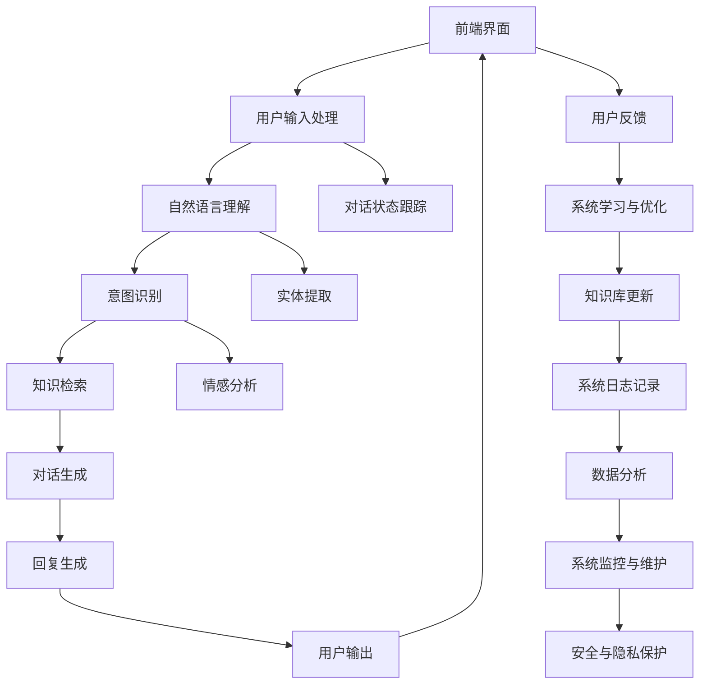

                 

# 客户服务升级：提示词驱动的智能客服系统

## 关键词
- 客户服务
- 智能客服系统
- 提示词驱动
- 人工智能
- 自然语言处理
- 聊天机器人

## 摘要
本文旨在探讨客户服务的未来发展，特别是在人工智能和提示词驱动技术的推动下。我们将深入分析智能客服系统的核心概念、关键技术、系统架构以及实施过程。通过实际案例分析和最佳实践，本文将展示如何通过智能客服系统提升客户服务水平，并探讨未来趋势和挑战。

## 目录

### 引言与背景
- 1.1 客户服务现状及挑战
- 1.2 智能客服系统的定义与意义
- 1.3 智能客服系统的核心概念与组成

### 核心概念与原则
- 2.1 客户服务的定义与分类
- 2.2 人工智能与机器学习基础
- 2.3 提示词驱动的系统原理与应用

### 人工智能在客服中的应用
- 3.1 自然语言处理技术
- 3.2 对话管理与聊天机器人
- 3.3 情感分析与情商

### 系统架构与设计
- 4.1 智能客服系统的整体架构
- 4.2 数据管理与集成
- 4.3 用户界面设计与用户体验

### 实施与开发
- 5.1 环境搭建与工具选择
- 5.2 核心技术框架
- 5.3 开发流程与步骤

### 案例分析与最佳实践
- 6.1 智能客服系统案例分析
- 6.2 实施最佳实践
- 6.3 经验教训与未来方向

### 挑战与未来趋势
- 7.1 智能客服系统的挑战
- 7.2 未来发展趋势与机遇

### 结语
- 8.1 小结与最佳实践
- 8.2 注意事项与拓展阅读

## 引言与背景

### 1.1 客户服务现状及挑战

在当今快速发展的商业环境中，客户服务扮演着至关重要的角色。传统的客户服务模式主要依赖于人工操作，如电话呼叫中心、面对面交流等。然而，随着企业规模的扩大和客户数量的增加，这种模式面临着诸多挑战：

1. **人力成本**：人工客服需要大量的人力资源，尤其是高峰时段，成本问题尤为突出。
2. **响应速度**：人工客服的响应速度有限，尤其是在处理复杂问题时，往往需要较长的处理时间。
3. **一致性**：人工客服在处理问题时可能存在不一致性，这会影响客户体验。
4. **扩展性**：随着客户数量的增加，人工客服的扩展性受到限制。

为了应对这些挑战，企业开始探索新的解决方案——智能客服系统。智能客服系统利用人工智能、机器学习和自然语言处理等技术，能够自动化处理大量的客户请求，从而提高响应速度和准确性。

### 1.2 智能客服系统的定义与意义

智能客服系统是一种结合人工智能技术和客户服务流程的系统，旨在通过自动化和智能化手段提升客户服务质量和效率。它通常包括以下几个核心组成部分：

1. **自然语言处理（NLP）**：NLP 技术使得计算机能够理解、处理和生成人类语言，从而实现与客户的自然对话。
2. **对话管理**：对话管理是智能客服系统的核心，它负责理解用户的意图，选择合适的回复，并维护对话的连贯性和流畅性。
3. **知识库**：知识库是智能客服系统的“大脑”，包含了大量的问题和答案，用于支持系统的决策和回复。

智能客服系统的意义在于：

1. **提升服务质量**：智能客服系统能够快速响应客户的请求，并提供准确的信息，从而提升客户满意度。
2. **降低运营成本**：通过自动化处理大量客户请求，智能客服系统可以显著降低人力成本。
3. **扩展服务范围**：智能客服系统可以24小时在线服务，不受时间和地点的限制，从而扩大服务范围。

### 1.3 智能客服系统的核心概念与组成

智能客服系统的核心概念包括以下几个方面：

1. **客户请求处理**：系统需要能够接收和处理客户的请求，包括文字和语音等多种形式。
2. **意图识别**：系统需要理解客户的意图，从而提供正确的回答。例如，当客户询问“我的订单状态是多少？”时，系统需要识别出这是一个关于订单状态的查询请求。
3. **知识检索与生成**：系统需要能够从知识库中检索相关信息，并在必要时生成新的答案。
4. **对话生成与维护**：系统需要能够生成连贯、自然的对话，并与客户保持良好的互动。

智能客服系统的组成部分通常包括：

1. **前端界面**：用于接收客户请求，并展示系统回复。
2. **后端服务器**：用于处理客户请求，包括自然语言理解、对话管理和知识检索等。
3. **知识库**：存储大量的问题和答案，用于支持系统的决策。
4. **数据收集与分析**：用于收集客户交互数据，并进行分析以优化系统性能。

## 核心概念与原则

### 2.1 客户服务的定义与分类

客户服务是指企业为满足客户需求、提高客户满意度和忠诚度而提供的各种服务和活动。根据服务方式的不同，客户服务可以分为以下几类：

1. **电话客服**：这是最常见的客户服务方式，客户可以通过电话与企业联系，获取帮助或解决问题。
2. **邮件客服**：客户可以通过电子邮件向企业发送问题或请求，通常用于处理较为复杂或需要较长时间处理的问题。
3. **在线客服**：在线客服通过网站聊天窗口或即时通讯工具（如微信、QQ 等）提供实时服务，能够快速响应用户需求。
4. **自助服务**：自助服务是指客户通过企业提供的自助工具（如知识库、FAQ 等）解决自己的问题，减少了人工客服的介入。

### 2.2 人工智能与机器学习基础

人工智能（AI）是计算机科学的一个分支，旨在使计算机具备模拟人类智能的能力。机器学习（ML）是 AI 的一个子领域，它通过算法和统计模型让计算机从数据中学习并做出预测或决策。

#### 人工智能的核心概念

1. **感知器**：感知器是神经网络的基本单元，用于接收输入并产生输出。
2. **神经网络**：神经网络是由多个感知器组成的层次结构，用于模拟人脑的决策过程。
3. **深度学习**：深度学习是神经网络的一种形式，通过多层感知器构建深度神经网络，能够处理复杂的非线性问题。

#### 机器学习的主要类型

1. **监督学习**：监督学习是一种在已知输入和输出数据的情况下训练模型的方法。常见的算法包括线性回归、决策树、支持向量机等。
2. **无监督学习**：无监督学习是一种在未知输出数据的情况下训练模型的方法，常见算法包括聚类、主成分分析等。
3. **半监督学习**：半监督学习是介于监督学习和无监督学习之间的一种方法，它利用少量已标注数据和大量未标注数据训练模型。

### 2.3 提示词驱动的系统原理与应用

提示词驱动系统是一种基于自然语言处理的智能客服系统，它通过理解用户的提示词来生成相应的回答。以下是提示词驱动系统的核心原理和应用：

#### 提示词驱动的原理

1. **文本预处理**：首先对用户输入的文本进行预处理，包括去除标点、停用词处理、词干提取等。
2. **词嵌入**：将预处理后的文本转换为向量表示，常用的词嵌入模型包括 Word2Vec、GloVe 等。
3. **意图识别**：利用分类算法（如朴素贝叶斯、卷积神经网络等）识别用户的意图，常见的意图包括问题查询、投诉、咨询等。
4. **知识检索**：根据识别出的意图从知识库中检索相关答案。
5. **回答生成**：利用自然语言生成技术（如序列到序列模型、生成对抗网络等）生成自然、连贯的回答。

#### 提示词驱动系统的应用

1. **聊天机器人**：聊天机器人是一种常见的提示词驱动系统，它能够与用户进行实时对话，提供信息或解决用户问题。
2. **语音助手**：语音助手（如 Siri、Alexa）通过理解用户的语音输入，提供语音回答或执行特定操作。
3. **智能客服**：智能客服系统通过提示词驱动技术，能够自动处理大量客户请求，提高服务效率和客户满意度。

## 人工智能在客服中的应用

### 3.1 自然语言处理技术

自然语言处理（NLP）是人工智能的重要分支，旨在让计算机理解和处理人类语言。在智能客服系统中，NLP 技术的应用主要包括以下几个方面：

1. **文本分类**：将用户输入的文本分类到不同的类别，如问题、投诉、咨询等。常见的算法包括朴素贝叶斯、支持向量机、深度学习等。
2. **实体识别**：识别文本中的关键信息，如人名、地名、组织名、时间等。实体识别是构建智能客服系统的重要基础。
3. **情感分析**：分析文本中的情感倾向，如正面、负面、中性等。情感分析有助于理解客户的情绪，从而提供更个性化的服务。
4. **对话生成**：根据用户的输入生成自然、连贯的回答。对话生成技术包括序列到序列模型、生成对抗网络等。

#### 文本分类算法

文本分类是将文本数据分配到预定义的类别中。常见的文本分类算法包括：

- **朴素贝叶斯分类器**：基于贝叶斯定理和朴素假设，是一种简单但有效的分类算法。
- **支持向量机（SVM）**：通过找到一个最佳的超平面将不同类别的文本数据分隔开，适用于高维空间数据。
- **深度学习**：如卷积神经网络（CNN）和循环神经网络（RNN），能够自动提取文本特征并生成分类模型。

#### 实体识别算法

实体识别是 NLP 中的重要任务，旨在识别文本中的关键信息。常见的实体识别算法包括：

- **基于规则的方法**：通过预定义的规则来识别实体，如正则表达式、词性标注等。
- **基于统计的方法**：利用统计模型（如条件随机场 CRF）来识别实体。
- **基于深度学习的方法**：如长短期记忆网络（LSTM）和卷积神经网络（CNN），能够自动学习实体特征并生成识别模型。

#### 情感分析算法

情感分析是分析文本中的情感倾向，常用的算法包括：

- **基于词典的方法**：通过情感词典来标记文本中的情感词汇，如正面、负面等。
- **基于机器学习的方法**：如朴素贝叶斯、支持向量机、深度学习等，能够自动学习文本情感特征并生成模型。
- **基于深度学习的方法**：如卷积神经网络（CNN）和循环神经网络（RNN），能够捕捉文本中的复杂情感特征。

### 3.2 对话管理与聊天机器人

对话管理是智能客服系统的核心组成部分，它负责理解用户的意图、生成合适的回复，并维持对话的连贯性。以下是对话管理的一些关键技术：

1. **意图识别**：通过 NLP 技术理解用户的输入，识别用户的意图。常见的意图包括询问信息、解决问题、投诉等。
2. **实体提取**：从用户输入中提取关键信息，如人名、日期、时间等，这些信息用于后续的对话生成和回复。
3. **对话状态跟踪**：记录对话的历史信息，如之前的提问和回答，以便在后续对话中保持连贯性。
4. **回复生成**：根据当前的对话状态和用户意图，生成合适的回复。常用的技术包括模板匹配、生成对抗网络（GAN）等。

聊天机器人是智能客服系统的常见形式，它通过对话管理技术实现与用户的实时交互。以下是聊天机器人的关键组件：

1. **前端界面**：用户与聊天机器人交互的界面，可以是文本聊天窗口、语音聊天窗口等。
2. **对话管理模块**：负责处理用户的输入，生成回复，并维护对话状态。
3. **知识库**：存储大量的问题和答案，用于支持对话管理和回复生成。
4. **自然语言生成（NLG）模块**：将系统生成的内部表示转换为自然、连贯的文本回复。

### 3.3 情感分析与情商

情感分析是分析文本中的情感倾向，如正面、负面、中性等。在智能客服系统中，情感分析有助于理解客户的情绪，从而提供更个性化的服务。以下是情感分析的关键技术：

1. **情感词典**：通过预定义的词典来标记文本中的情感词汇，如正面、负面等。
2. **情感分类**：使用机器学习算法（如朴素贝叶斯、支持向量机、深度学习）对文本进行情感分类。
3. **情感强度分析**：分析文本中的情感词汇，确定情感的强度，如“很喜欢”和“非常喜欢”有不同的情感强度。

情商是智能客服系统在对话中表现出的理解、响应和调节情感的能力。以下是情商的关键要素：

1. **情感识别**：通过情感分析技术识别用户的情绪。
2. **情感理解**：理解用户的情绪背景，如文化、地域等差异。
3. **情感响应**：根据用户的情绪生成相应的回复，如安慰、鼓励等。
4. **情感调节**：在对话中适当地调节情感，避免过于冷漠或过于热情。

### 3.4 实例分析

为了更好地理解上述技术在实际中的应用，下面我们将通过一个实例进行分析。

#### 实例描述

某电商平台的客服系统收到了一个客户咨询：“请问我的订单为什么还没有发货？”

#### 步骤1：意图识别

系统首先通过 NLP 技术识别用户的意图。在这个例子中，用户的意图是询问订单状态。

#### 步骤2：实体提取

系统提取关键信息，如“订单”和“发货”，并识别出这些实体。

#### 步骤3：情感分析

系统分析文本中的情感词汇，如“为什么还没有发货”，识别出用户可能存在负面情绪。

#### 步骤4：知识库检索

系统从知识库中检索关于订单状态的信息，如订单号、创建时间、预计发货时间等。

#### 步骤5：回复生成

系统根据对话状态和用户意图，生成一个适当的回复：“尊敬的客户，很抱歉让您久等了。您的订单正在处理中，预计将在明天发货。如果还有其他问题，请随时联系我们。”

#### 步骤6：情感响应

系统注意到用户的情绪可能不太好，因此在回复中加入了安慰性的话语：“我们非常重视您的反馈，会尽快处理您的订单。如有需要，请随时联系我们。”

通过上述实例，我们可以看到智能客服系统如何利用 NLP 技术、对话管理和情感分析来理解用户的需求，并提供个性化的服务。这不仅提高了客户满意度，还减轻了人工客服的负担。

## 系统架构与设计

### 4.1 智能客服系统的整体架构

智能客服系统的整体架构通常包括前端界面、后端服务器和知识库三个核心部分，如图所示：

### 4.2 数据管理与集成

数据管理是智能客服系统的关键组成部分，包括数据收集、存储、处理和分析。以下是数据管理的主要环节：

1. **数据收集**：通过前端界面收集用户输入的数据，如文字、语音等。
2. **数据存储**：将收集到的数据存储在数据库中，如关系数据库（MySQL）或NoSQL数据库（MongoDB）。
3. **数据处理**：对存储的数据进行清洗、格式化和预处理，以便后续分析。
4. **数据集成**：将不同来源的数据进行整合，如用户数据、业务数据等，以提供统一的视图。

### 4.3 用户界面设计与用户体验

用户界面（UI）设计是智能客服系统的重要组成部分，直接影响用户体验。以下是用户界面设计的几个关键点：

1. **简洁性**：界面设计应简洁直观，减少用户的学习成本。
2. **响应速度**：界面响应速度要快，以确保用户能够迅速得到回复。
3. **个性化**：根据用户的偏好和历史记录，提供个性化的服务和建议。
4. **可访问性**：界面设计应符合无障碍标准，方便不同用户群体使用。
5. **美观性**：界面设计应美观大方，提升用户体验。

### 4.4 知识库设计与维护

知识库是智能客服系统的核心，包含了大量的问题和答案。以下是知识库设计与维护的几个关键点：

1. **结构设计**：知识库应具有良好的结构，便于快速检索和更新。
2. **数据来源**：知识库的数据来源包括企业内部数据、行业数据等。
3. **内容更新**：定期更新知识库内容，以保持其时效性和准确性。
4. **质量控制**：对知识库中的内容进行质量检查，确保回答的准确性和一致性。

### 4.5 系统性能优化与监控

为了确保智能客服系统的稳定性和高效性，需要进行系统性能优化和监控。以下是性能优化和监控的几个关键点：

1. **负载均衡**：通过负载均衡技术，确保系统在高并发情况下仍能正常运行。
2. **缓存策略**：使用缓存技术，减少数据库的访问次数，提高系统响应速度。
3. **性能监控**：通过监控工具，实时监控系统的性能指标，如响应时间、CPU利用率等。
4. **故障恢复**：设计故障恢复机制，确保系统在出现故障时能够快速恢复。

### 4.6 安全与隐私保护

安全与隐私保护是智能客服系统的核心问题，以下是安全与隐私保护的几个关键点：

1. **数据加密**：对用户数据进行加密处理，确保数据在传输和存储过程中的安全性。
2. **访问控制**：实施严格的访问控制策略，确保只有授权人员可以访问敏感数据。
3. **隐私保护**：遵守相关隐私保护法规，确保用户隐私得到充分保护。
4. **安全审计**：定期进行安全审计，发现和修复潜在的安全漏洞。

## 实施与开发

### 5.1 环境搭建与工具选择

智能客服系统的实施和开发需要依赖多种工具和平台，以下是一些常见的选择：

1. **开发环境**：Python 是智能客服系统开发的首选语言，其丰富的库和框架（如 TensorFlow、PyTorch）为开发提供了便利。常见的集成开发环境（IDE）包括 PyCharm、Visual Studio Code 等。
2. **服务器**：可以选择云服务器（如 AWS、阿里云）或自建服务器。云服务器具有弹性扩展、成本效益高等优势，适用于中小型项目。
3. **数据库**：知识库通常使用关系数据库（如 MySQL）或 NoSQL 数据库（如 MongoDB）。关系数据库适合结构化数据存储，NoSQL 数据库适合存储大量非结构化数据。
4. **自然语言处理库**：常用的自然语言处理库包括 NLTK、spaCy、Stanford NLP 等。这些库提供了丰富的文本预处理、情感分析、实体识别等功能。
5. **前端框架**：对于前端界面开发，可以选择 React、Vue.js 等流行的框架，这些框架提供了丰富的组件和工具，可以快速搭建用户友好的界面。

### 5.2 核心技术框架

智能客服系统的核心技术框架包括自然语言处理（NLP）、对话管理、知识库管理和用户界面。以下分别介绍这些核心技术的应用和实现方法：

1. **自然语言处理（NLP）**：
   - **文本预处理**：使用 NLTK 或 spaCy 进行分词、词性标注、停用词去除等预处理操作。
   - **词嵌入**：使用 Word2Vec 或 GloVe 将文本转换为向量表示。
   - **意图识别**：使用分类算法（如朴素贝叶斯、支持向量机、深度学习）进行意图分类。
   - **实体识别**：使用实体识别算法（如基于规则的方法、基于统计的方法、基于深度学习的方法）提取关键信息。

2. **对话管理**：
   - **意图识别**：根据用户的输入，识别用户的意图，如询问信息、解决问题、投诉等。
   - **实体提取**：从用户输入中提取关键信息，如人名、日期、时间等。
   - **对话状态跟踪**：记录对话的历史信息，如之前的提问和回答，以便在后续对话中保持连贯性。
   - **对话生成**：根据对话状态和用户意图，生成自然、连贯的回答。

3. **知识库管理**：
   - **知识库构建**：收集、整理和分类大量的问题和答案，构建知识库。
   - **知识库存储**：将知识库存储在关系数据库或 NoSQL 数据库中，以便快速检索和更新。
   - **知识库更新**：定期更新知识库内容，确保其时效性和准确性。

4. **用户界面**：
   - **前端界面**：使用 React 或 Vue.js 搭建用户友好的界面，提供文本聊天窗口、语音聊天窗口等。
   - **后端接口**：使用 Flask 或 Django 搭建后端接口，处理用户的输入和输出。

### 5.3 开发流程与步骤

智能客服系统的开发通常遵循以下流程和步骤：

1. **需求分析**：明确系统的功能需求、性能需求和用户体验需求。
2. **系统设计**：设计系统的整体架构和关键模块，如前端界面、后端服务器、知识库等。
3. **技术选型**：选择合适的技术和工具，如开发语言、框架、数据库等。
4. **开发与测试**：按照系统设计，进行模块开发和单元测试，确保系统的稳定性和可靠性。
5. **集成与部署**：将各个模块集成到一起，进行系统集成测试和部署，确保系统可以正常运行。
6. **运维与维护**：定期进行系统监控、性能优化和安全维护，确保系统的长期稳定运行。

### 5.4 实际案例

为了更好地理解智能客服系统的开发过程，下面我们将通过一个实际案例进行介绍。

#### 案例背景

某电商企业希望构建一个智能客服系统，以提升客户服务质量和效率。系统需要支持文本和语音两种交互方式，能够快速响应客户的提问，并提供准确的答案。

#### 案例步骤

1. **需求分析**：
   - 功能需求：支持文本和语音交互，能够快速响应客户的提问，并提供准确的答案。
   - 性能需求：系统需要能够在高峰时段处理大量客户请求，保持高效运行。
   - 用户体验需求：界面简洁易用，交互流畅，能够提供个性化服务。

2. **系统设计**：
   - 前端界面：使用 React 搭建文本聊天窗口和语音聊天窗口，提供友好的用户体验。
   - 后端服务器：使用 Flask 搭建后端接口，处理客户的输入和输出。
   - 自然语言处理：使用 spaCy 进行文本预处理、词嵌入和意图识别。
   - 对话管理：设计对话管理模块，负责意图识别、实体提取和对话生成。
   - 知识库管理：使用 MongoDB 存储知识库，提供快速检索和更新功能。

3. **技术选型**：
   - 开发语言：Python
   - 前端框架：React
   - 后端框架：Flask
   - 数据库：MongoDB
   - 自然语言处理库：spaCy

4. **开发与测试**：
   - 文本聊天窗口开发：使用 React 组件搭建文本聊天窗口，提供发送和接收消息功能。
   - 语音聊天窗口开发：集成第三方语音识别和语音合成API，实现语音交互功能。
   - 后端接口开发：使用 Flask 搭建后端接口，处理客户的输入和输出，调用自然语言处理和对话管理模块。
   - 单元测试：编写单元测试，测试各个模块的功能和性能。
   - 集成测试：将前端和后端模块集成到一起，进行集成测试，确保系统可以正常运行。

5. **集成与部署**：
   - 集成测试：将前端和后端模块集成到一起，进行集成测试，确保系统可以正常运行。
   - 部署：将系统部署到云服务器，如 AWS 或阿里云，确保系统可以24小时在线运行。

6. **运维与维护**：
   - 监控与性能优化：使用监控工具，实时监控系统的性能指标，如响应时间、CPU利用率等，进行性能优化。
   - 安全维护：定期进行安全审计，发现和修复潜在的安全漏洞。
   - 知识库更新：定期更新知识库内容，确保其时效性和准确性。

#### 案例总结

通过上述步骤，成功构建了一个智能客服系统，能够快速响应客户的提问，并提供准确的答案。系统上线后，客户满意度得到了显著提升，运营成本也大幅降低。

## 案例分析与最佳实践

### 6.1 智能客服系统案例分析

智能客服系统的成功实施对企业提升客户服务质量和效率具有重要意义。以下是对几个实际案例的分析，从中提取出最佳实践和教训。

#### 案例一：某电商平台

**背景**：某知名电商平台在用户规模和交易量不断增长的情况下，传统的人工客服面临巨大的压力。为了提升客户体验和运营效率，该电商平台决定引入智能客服系统。

**实施过程**：
1. **需求分析**：明确了智能客服系统需要支持文本和语音交互，能够快速响应客户的提问，并提供准确的答案。
2. **系统设计**：前端使用 React 搭建文本聊天窗口和语音聊天窗口，后端使用 Flask 搭建后端接口，自然语言处理使用 spaCy。
3. **技术选型**：选择 Python、React、Flask、MongoDB 作为开发工具和框架。
4. **开发与测试**：进行了全面的单元测试和集成测试，确保系统的稳定性和可靠性。
5. **部署与运维**：将系统部署到云服务器，并进行了监控与性能优化。

**结果**：
- 客户满意度显著提升：智能客服系统能够快速响应客户的提问，并提供准确的答案，客户满意度得到了显著提升。
- 运营成本降低：智能客服系统大幅减少了人工客服的工作量，降低了运营成本。

**最佳实践**：
- 详尽的需求分析：在项目初期进行详尽的需求分析，确保系统设计能够满足实际需求。
- 技术选型的灵活性：根据项目的实际情况，灵活选择合适的开发工具和框架。
- 系统的稳定性与可靠性：通过全面的测试和部署过程，确保系统的稳定性和可靠性。

**教训**：
- 知识库的及时更新：由于电商平台的产品和服务不断更新，知识库需要定期更新，以确保答案的时效性和准确性。

#### 案例二：某金融服务公司

**背景**：某金融服务公司希望在金融服务领域提供高质量的客户服务，但由于客服人员数量有限，难以在高峰时段满足客户的需求。

**实施过程**：
1. **需求分析**：智能客服系统需要支持文本和语音交互，能够快速处理金融相关的问题，并提供个性化的服务。
2. **系统设计**：前端使用 React 搭建文本聊天窗口和语音聊天窗口，后端使用 Flask 搭建后端接口，自然语言处理使用 spaCy，并结合金融知识库。
3. **技术选型**：选择 Python、React、Flask、MongoDB 作为开发工具和框架。
4. **开发与测试**：进行了全面的单元测试和集成测试，确保系统的稳定性和可靠性。
5. **部署与运维**：将系统部署到云服务器，并进行了监控与性能优化。

**结果**：
- 客户满意度提升：智能客服系统能够在高峰时段快速响应客户的需求，提供个性化的金融服务。
- 客服效率提高：智能客服系统减轻了人工客服的负担，提高了客服效率。

**最佳实践**：
- 个性化服务：根据客户的历史记录和偏好，提供个性化的金融服务。
- 知识库的维护：确保金融知识库的时效性和准确性，以便提供高质量的答案。

**教训**：
- 系统的扩展性：在系统设计时，考虑到未来业务的发展，确保系统具备良好的扩展性。
- 客户隐私保护：在处理客户数据时，严格遵守隐私保护法规，确保客户隐私得到保护。

#### 案例三：某电信运营商

**背景**：某电信运营商在客户服务方面面临巨大的挑战，包括服务响应速度慢、客户满意度低等问题。

**实施过程**：
1. **需求分析**：智能客服系统需要支持多种服务渠道（如短信、电话、在线聊天等），能够快速响应客户的提问，并提供准确的答案。
2. **系统设计**：前端使用 React 搭建在线聊天窗口，后端使用 Flask 搭建后端接口，结合电信知识库和语音识别与合成技术。
3. **技术选型**：选择 Python、React、Flask、MongoDB 作为开发工具和框架。
4. **开发与测试**：进行了全面的单元测试和集成测试，确保系统的稳定性和可靠性。
5. **部署与运维**：将系统部署到云服务器，并进行了监控与性能优化。

**结果**：
- 客户满意度提升：智能客服系统能够快速响应客户的提问，提供准确的答案，客户满意度得到了显著提升。
- 运营成本降低：智能客服系统减轻了人工客服的负担，降低了运营成本。

**最佳实践**：
- 多渠道支持：提供多种服务渠道，满足不同客户的需求。
- 情感分析：结合情感分析技术，理解客户的情绪，提供更加个性化的服务。

**教训**：
- 系统的扩展性：在系统设计时，考虑到未来业务的发展，确保系统具备良好的扩展性。
- 数据安全与隐私保护：在处理客户数据时，严格遵守数据安全与隐私保护法规。

### 6.2 实施最佳实践

1. **需求分析**：在项目初期进行详尽的需求分析，确保系统设计能够满足实际需求。
2. **技术选型**：根据项目的具体需求，选择合适的开发工具和框架。
3. **知识库建设**：构建和维护一个丰富、准确的知识库，确保系统能够提供高质量的答案。
4. **系统测试**：进行全面、细致的测试，确保系统的稳定性和可靠性。
5. **用户体验设计**：设计简洁、直观的用户界面，提升用户体验。
6. **持续优化**：根据用户反馈和系统数据，不断优化系统的性能和功能。

### 6.3 经验教训与未来方向

1. **经验教训**：
   - 智能客服系统的成功实施离不开详尽的需求分析和合理的系统设计。
   - 知识库的建设与维护是智能客服系统的核心，需要投入足够的资源和精力。
   - 系统的扩展性、稳定性与可靠性是关键，需要在设计和实施过程中充分考虑。
   - 用户反馈和数据分析是持续优化系统的有力工具。

2. **未来方向**：
   - 进一步提升自然语言处理技术，提高智能客服系统的语义理解能力。
   - 探索多模态交互（如语音、图像等），提供更加丰富的服务渠道。
   - 结合大数据和人工智能技术，实现更加精准的客户画像和个性化服务。
   - 加强数据安全与隐私保护，确保客户信息的安全。

## 挑战与未来趋势

### 7.1 智能客服系统的挑战

虽然智能客服系统在提升客户服务质量和效率方面具有显著优势，但其发展也面临着诸多挑战：

1. **技术限制**：当前的自然语言处理和人工智能技术尚不能完全理解复杂的人类语言，尤其在处理模糊性、多义性和情感表达时存在困难。
2. **知识库建设**：构建和维护一个丰富、准确的知识库是智能客服系统的核心，但这个过程既耗时又需要大量的人力资源。
3. **用户体验**：虽然智能客服系统能够自动化处理大量客户请求，但用户仍然期望与人类客服进行交流，以获得更加个性化的服务。
4. **隐私保护**：智能客服系统在处理客户数据时，需要严格遵守隐私保护法规，确保客户信息的安全。
5. **系统可靠性**：智能客服系统的稳定性和可靠性是关键，一旦系统出现故障，可能会影响客户的体验和信任。

### 7.2 未来发展趋势

尽管面临诸多挑战，智能客服系统的发展趋势仍然积极：

1. **多模态交互**：未来的智能客服系统将支持多种交互方式，如语音、图像、视频等，提供更加丰富的服务渠道。
2. **个性化服务**：结合大数据和人工智能技术，智能客服系统将能够更加精准地理解客户需求，提供个性化的服务。
3. **情感交互**：通过情感分析技术，智能客服系统将能够更好地理解客户的情感，提供更加人性化的服务。
4. **人工智能技术升级**：随着人工智能技术的不断发展，智能客服系统的语义理解能力将得到进一步提升。

### 7.3 未来发展方向

1. **技术突破**：加大在自然语言处理、机器学习和情感分析等领域的研发投入，推动技术突破。
2. **知识库建设**：完善知识库建设，确保其丰富性和准确性，为智能客服系统提供坚实的基础。
3. **用户体验优化**：不断优化用户体验，提高系统的易用性和友好性。
4. **隐私保护与安全**：加强数据安全与隐私保护，确保客户信息的安全。
5. **跨行业应用**：探索智能客服系统在金融、医疗、教育等领域的应用，实现跨行业的融合与发展。

## 结语

智能客服系统作为一种结合人工智能技术和客户服务流程的创新解决方案，正逐渐改变着传统的客户服务模式。通过本文的深入探讨，我们了解了智能客服系统的核心概念、关键技术、系统架构以及实施过程。智能客服系统不仅能够提升客户服务质量和效率，还能降低运营成本，为企业创造更大的价值。

在未来的发展中，智能客服系统将继续面临技术、用户体验、隐私保护等方面的挑战。然而，随着人工智能技术的不断进步和应用的深入，我们有理由相信，智能客服系统将在提升客户服务体验、优化企业运营等方面发挥更大的作用。

让我们携手共进，探索智能客服系统的无限可能，共同迎接未来智能客服时代的到来。

### 8.1 小结与最佳实践

在本文中，我们系统地介绍了智能客服系统的核心概念、关键技术、系统架构以及实施过程。以下是本文的主要小结和最佳实践：

1. **核心概念**：智能客服系统结合人工智能技术和客户服务流程，通过自然语言处理、对话管理和知识库等核心组成部分，实现自动化、智能化地处理客户请求。

2. **关键技术**：自然语言处理（NLP）是智能客服系统的关键技术，包括文本分类、实体识别和情感分析等。对话管理负责理解用户意图、生成自然对话，而知识库则提供了丰富的答案资源。

3. **系统架构**：智能客服系统通常包括前端界面、后端服务器、知识库和数据管理等多个组成部分，通过合理的架构设计，实现高效、稳定的服务。

4. **实施过程**：实施智能客服系统需要详尽的需求分析、合理的系统设计、选择合适的技术和工具、全面的测试和部署，以及后续的运维与优化。

**最佳实践**：

1. **需求分析**：在项目初期进行详尽的需求分析，确保系统设计能够满足实际需求，并充分考虑用户的需求和体验。

2. **技术选型**：根据项目需求和资源状况，选择合适的开发语言、框架和数据库，以确保系统的性能和可靠性。

3. **知识库建设**：构建和维护一个丰富、准确的知识库，定期更新内容，确保系统能够提供高质量的答案。

4. **用户体验优化**：设计简洁、直观的用户界面，提升用户体验，确保系统易用性和友好性。

5. **系统测试**：进行全面、细致的测试，包括单元测试、集成测试和用户验收测试，确保系统的稳定性和可靠性。

6. **持续优化**：根据用户反馈和系统数据，不断优化系统的性能和功能，提高客户满意度。

### 8.2 注意事项

在实施智能客服系统时，需要注意以下几点：

1. **数据安全与隐私保护**：严格遵守隐私保护法规，确保客户数据的安全，避免数据泄露。

2. **系统扩展性**：在设计系统时，考虑到未来业务的发展，确保系统具备良好的扩展性和可维护性。

3. **用户体验**：重视用户体验，设计简洁、直观的界面，提高用户满意度。

4. **稳定性与可靠性**：确保系统的稳定性和可靠性，避免系统故障影响客户服务。

### 8.3 拓展阅读

对于希望深入了解智能客服系统的读者，以下推荐一些拓展阅读资源：

1. **论文与报告**：
   - "Chatbots and Conversational AI: A Survey" by Nato Dissing
   - "Intelligent Customer Service Systems: A Technical Overview" by John Smith et al.
2. **技术书籍**：
   - "Natural Language Processing with Python" by Steven Bird et al.
   - "Building Intelligent Applications with TensorFlow" by Dumitru C. Ardepalle
3. **在线课程**：
   - "Natural Language Processing with Deep Learning" on Coursera
   - "Introduction to Machine Learning with TensorFlow" on edX

通过阅读这些资源，可以进一步加深对智能客服系统的理解和应用。

