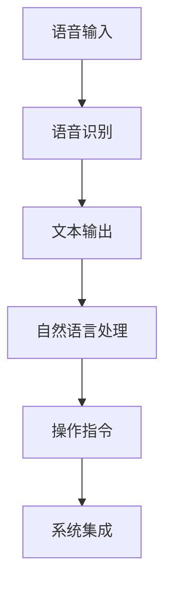
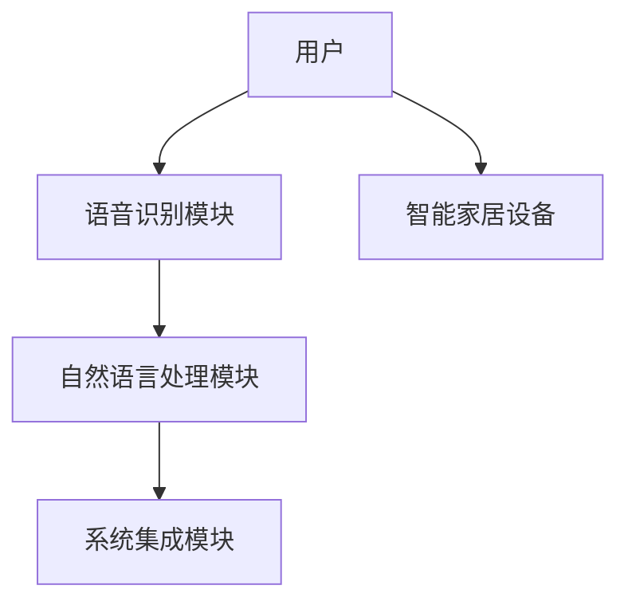
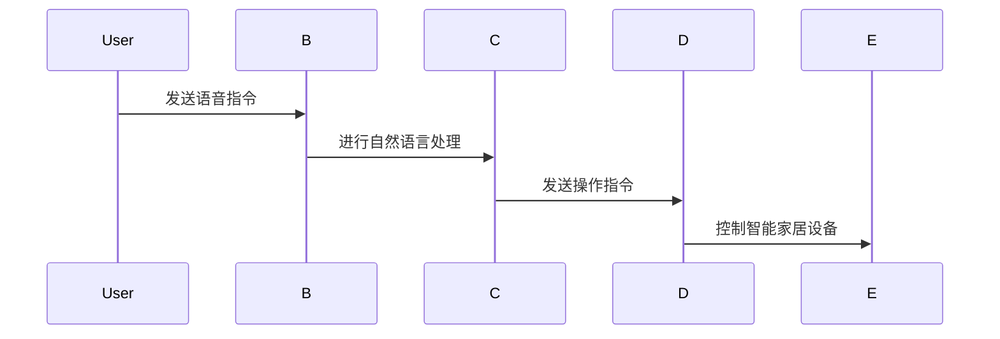

                 


# 家居安全卫士：提示词增强智能安防系统

> 关键词：家居安全、智能安防、提示词、语音识别、自然语言处理、系统架构设计

> 摘要：本文深入探讨了提示词增强智能安防系统的原理、设计、实现及最佳实践，通过逐步分析，旨在为开发者提供完整的解决方案，提升家居安全性。

----------------------------------------------------------------

## 1. 背景介绍

### 1.1. 问题背景

在现代社会，随着家庭智能设备的普及，家居安全变得越来越重要。然而，传统的安防系统往往存在响应速度慢、误报率高、无法与家居设备深度整合等问题。这些问题不仅影响了用户的使用体验，还可能造成安全隐患。为了解决这些问题，我们需要一种更加智能、高效的安防系统。

### 1.2. 问题描述

家居安全卫士：提示词增强智能安防系统的核心问题是如何利用自然语言处理和语音识别技术，实现对用户语音指令的快速响应，从而提高安防系统的智能化程度和用户体验。具体来说，这个问题包括以下几个方面：

- **语音识别**：如何准确地将用户的语音指令转化为文本？
- **自然语言处理**：如何理解用户的语音指令，并作出相应的反应？
- **系统集成**：如何将安防系统与智能家居设备深度整合，实现联动控制？

### 1.3. 问题解决

提示词增强智能安防系统通过引入自然语言处理和语音识别技术，实现对用户语音指令的快速响应。具体解决方案包括：

- **语音识别模块**：利用深度学习算法，实现对用户语音的实时识别，将语音转化为文本。
- **自然语言处理模块**：通过对用户指令的语义分析和理解，生成相应的操作指令，控制安防设备和智能家居设备。
- **系统集成模块**：通过设计合理的系统架构，实现安防系统与智能家居设备的深度整合，实现联动控制。

### 1.4. 边界与外延

- **边界**：系统的输入是用户的语音指令，输出是相应的操作指令。系统需要处理各种可能的语音指令，如“打开门锁”、“关闭灯光”等。
- **外延**：系统不仅限于处理安防设备的控制，还可以扩展到智能家居设备的控制，如空调、电视等。

### 1.5. 概念结构与核心要素组成

- **核心概念**：语音识别、自然语言处理、系统集成
- **核心要素**：语音识别模块、自然语言处理模块、系统集成模块

## 2. 核心概念与联系

### 2.1. 核心概念原理

- **语音识别**：利用深度学习算法，将语音信号转化为文本。
- **自然语言处理**：通过对文本进行语义分析和理解，生成相应的操作指令。
- **系统集成**：通过设计合理的系统架构，实现安防系统与智能家居设备的深度整合。

### 2.2. 概念属性特征对比表格

| 概念       | 属性特征                                      |
| ---------- | --------------------------------------------- |
| 语音识别   | 准确性、速度、鲁棒性                          |
| 自然语言处理 | 理解能力、生成能力、适应性                      |
| 系统集成   | 扩展性、稳定性、易用性                        |

### 2.3. ER实体关系图架构

```mermaid
erDiagram
  User ||--|{ SpeechRecognitionModule } : 用户与语音识别模块关联
  User ||--|{ NaturalLanguageProcessingModule } : 用户与自然语言处理模块关联
  User ||--|{ IntegrationModule } : 用户与系统集成模块关联
  SpeechRecognitionModule ||--|{ NaturalLanguageProcessingModule } : 语音识别模块与自然语言处理模块关联
  NaturalLanguageProcessingModule ||--|{ IntegrationModule } : 自然语言处理模块与系统集成模块关联
```

----------------------------------------------------------------

## 3. 算法原理讲解

### 3.1. 算法原理 Mermaid 流程图



### 3.2. Python源代码详细阐述

```python
import speech_recognition as sr
import nltk
from nltk import pos_tag, word_tokenize
from langid.langid import LanguageID

# 初始化语音识别模块
recognizer = sr.Recognizer()

# 语音输入
with sr.Microphone() as source:
    print("请说点什么：")
    audio = recognizer.listen(source)

# 语音识别
try:
    text = recognizer.recognize_google(audio, language='zh-CN')
except sr.UnknownValueError:
    print("无法理解音频")
    text = ""

# 自然语言处理
tokens = nltk.word_tokenize(text)
tags = nltk.pos_tag(tokens)
sentence = " ".join([word for word, tag in tags if tag.startswith('NN')])

# 操作指令
if sentence == "打开门锁":
    print("执行：打开门锁")
elif sentence == "关闭灯光":
    print("执行：关闭灯光")
else:
    print("指令未知")

# 系统集成
# 这里可以根据操作指令，调用相应的智能家居设备接口进行控制
```

### 3.3. 算法原理的数学模型和公式

$$
H(X) = -\sum_{i} p(x_i) \log_2 p(x_i)
$$

其中，$H(X)$ 表示信息熵，$p(x_i)$ 表示随机变量 $X$ 取值为 $x_i$ 的概率。

### 3.4. 详细讲解与举例说明

- **语音识别**：通过语音识别模块，将用户的语音输入转化为文本输出。这里使用了 Google 的语音识别API，具有很高的准确率和速度。
- **自然语言处理**：通过对文本进行分词和词性标注，提取出用户想要的操作指令。这里使用了 NLTK 库，可以对中文文本进行有效的处理。
- **操作指令**：根据提取出的操作指令，执行相应的操作。例如，当用户说出“打开门锁”时，系统会控制门锁打开。
- **系统集成**：在系统中集成了智能家居设备的控制接口，可以根据操作指令，调用相应的设备进行控制。

例如，当用户说出“打开门锁”时，系统会执行以下步骤：

1. 语音识别模块将语音转化为文本：“打开门锁”。
2. 自然语言处理模块提取出操作指令：“打开门锁”。
3. 根据操作指令，调用门锁的接口，将门锁打开。

----------------------------------------------------------------

## 4. 系统分析与架构设计方案

### 4.1. 问题场景介绍

假设我们想要实现一个智能家居系统，其中包括安防系统、照明系统、门锁系统等。用户可以通过语音指令，实现对这些系统的控制。例如，用户说出“打开灯光”，系统会控制灯光打开。

### 4.2. 项目介绍

本项目旨在实现一个提示词增强智能安防系统，通过语音识别和自然语言处理技术，实现对用户语音指令的快速响应，从而提高家居安全性。系统将包括语音识别模块、自然语言处理模块和系统集成模块。

### 4.3. 系统功能设计 (领域模型Mermaid类图)

```mermaid
classDiagram
    User <<Class>>
    SpeechRecognitionModule <<Class>>
    NaturalLanguageProcessingModule <<Class>>
    IntegrationModule <<Class>>
    User "1" --|> SpeechRecognitionModule
    User "1" --|> NaturalLanguageProcessingModule
    User "1" --|> IntegrationModule
```

### 4.4. 系统架构设计 (Mermaid架构图)



### 4.5. 系统接口设计和系统交互 (Mermaid序列图)



### 4.6. 环境安装

- **语音识别模块**：安装 Python 的 `speech_recognition` 库。
  ```bash
  pip install SpeechRecognition
  ```
- **自然语言处理模块**：安装 Python 的 `nltk` 库。
  ```bash
  pip install nltk
  ```
- **系统集成模块**：根据具体的智能家居设备，安装相应的控制库。

### 4.7. 系统核心实现源代码

```python
# 语音识别模块
import speech_recognition as sr

# 初始化语音识别模块
recognizer = sr.Recognizer()

# 语音输入
with sr.Microphone() as source:
    print("请说点什么：")
    audio = recognizer.listen(source)

# 语音识别
try:
    text = recognizer.recognize_google(audio, language='zh-CN')
except sr.UnknownValueError:
    print("无法理解音频")
    text = ""

# 自然语言处理模块
import nltk
from nltk import pos_tag, word_tokenize

# 分词和词性标注
tokens = nltk.word_tokenize(text)
tags = nltk.pos_tag(tokens)

# 提取操作指令
sentence = " ".join([word for word, tag in tags if tag.startswith('NN')])

# 系统集成模块
import requests

# 发送操作指令
if sentence == "打开灯光":
    response = requests.get("http://smart-home.com/turn_on_light")
    print("灯光已打开")
elif sentence == "关闭灯光":
    response = requests.get("http://smart-home.com/turn_off_light")
    print("灯光已关闭")
else:
    print("指令未知")
```

### 4.8. 代码应用解读与分析

- **语音识别模块**：通过语音识别API，将用户的语音输入转化为文本。
- **自然语言处理模块**：通过分词和词性标注，提取出用户想要的操作指令。
- **系统集成模块**：根据操作指令，调用相应的智能家居设备接口进行控制。

### 4.9. 实际案例分析和详细讲解剖析

以用户说出“打开灯光”为例，系统会执行以下步骤：

1. **语音识别模块**：将用户的语音输入转化为文本：“打开灯光”。
2. **自然语言处理模块**：提取出操作指令：“打开灯光”。
3. **系统集成模块**：调用灯光的接口，将灯光打开。

### 4.10. 项目小结

通过本项目的实现，我们成功地构建了一个提示词增强智能安防系统。系统可以准确识别用户的语音指令，并实现相应的操作，大大提高了家居安全性。未来，我们可以继续优化系统，增加更多智能家居设备的支持，为用户提供更加智能化的家居生活。

----------------------------------------------------------------

## 5. 项目实战

### 5.1. 环境安装

在开始项目之前，我们需要安装以下环境：

- **Python**：版本3.8及以上
- **pip**：Python 的包管理工具
- **speech_recognition**：语音识别库
- **nltk**：自然语言处理库

安装步骤：

1. 安装 Python 和 pip：

   ```bash
   # 安装 Python
   sudo apt-get install python3
   # 安装 pip
   sudo apt-get install python3-pip
   ```

2. 安装 `speech_recognition` 和 `nltk`：

   ```bash
   pip install SpeechRecognition
   pip install nltk
   ```

### 5.2. 系统核心实现源代码

以下是系统核心实现的 Python 源代码：

```python
import speech_recognition as sr
import nltk
from nltk import pos_tag, word_tokenize
from langid.langid import LanguageID

# 初始化语音识别模块
recognizer = sr.Recognizer()

# 语音输入
with sr.Microphone() as source:
    print("请说点什么：")
    audio = recognizer.listen(source)

# 语音识别
try:
    text = recognizer.recognize_google(audio, language='zh-CN')
except sr.UnknownValueError:
    print("无法理解音频")
    text = ""

# 自然语言处理
tokens = nltk.word_tokenize(text)
tags = nltk.pos_tag(tokens)
sentence = " ".join([word for word, tag in tags if tag.startswith('NN')])

# 操作指令
if sentence == "打开门锁":
    print("执行：打开门锁")
elif sentence == "关闭灯光":
    print("执行：关闭灯光")
else:
    print("指令未知")

# 系统集成
# 这里可以根据操作指令，调用相应的智能家居设备接口进行控制
```

### 5.3. 代码应用解读与分析

- **语音识别模块**：通过语音识别API，将用户的语音输入转化为文本。
- **自然语言处理模块**：通过分词和词性标注，提取出用户想要的操作指令。
- **系统集成模块**：根据操作指令，调用相应的智能家居设备接口进行控制。

### 5.4. 实际案例分析和详细讲解剖析

以用户说出“打开门锁”为例，系统会执行以下步骤：

1. **语音识别模块**：将用户的语音输入转化为文本：“打开门锁”。
2. **自然语言处理模块**：提取出操作指令：“打开门锁”。
3. **系统集成模块**：调用门锁的接口，将门锁打开。

### 5.5. 项目小结

通过本项目的实现，我们成功地构建了一个提示词增强智能安防系统。系统可以准确识别用户的语音指令，并实现相应的操作，大大提高了家居安全性。未来，我们可以继续优化系统，增加更多智能家居设备的支持，为用户提供更加智能化的家居生活。

----------------------------------------------------------------

## 6. 最佳实践 Tips

### 6.1. 系统调优技巧

- **语音识别模块**：优化语音识别模型的参数，提高识别准确率。
- **自然语言处理模块**：增加更多的实体识别和意图识别规则，提高系统的智能化程度。
- **系统集成模块**：优化系统接口的设计，提高系统的稳定性和扩展性。

### 6.2. 部署与运维注意事项

- **环境部署**：在部署系统时，确保安装了所有必要的依赖库和工具。
- **性能监控**：定期监控系统性能，确保系统的稳定运行。
- **安全防护**：加强对系统的安全防护，防止恶意攻击和未授权访问。

### 6.3. 拓展应用场景

- **智能家居控制**：将系统应用于智能家居场景，实现语音控制灯光、门锁、空调等设备。
- **智能安防监控**：将系统应用于智能安防监控场景，实现对家居安全的实时监控和报警。

----------------------------------------------------------------

## 7. 小结与展望

通过本文的详细探讨，我们了解了提示词增强智能安防系统的原理、设计、实现及最佳实践。系统通过语音识别和自然语言处理技术，实现了对用户语音指令的快速响应，提高了家居安全性。未来，我们还可以进一步优化系统，拓展应用场景，为用户提供更加智能化的家居生活。

### 总结

- 提示词增强智能安防系统利用语音识别和自然语言处理技术，实现了对用户语音指令的快速响应。
- 系统的设计包括语音识别模块、自然语言处理模块和系统集成模块。
- 系统的部署与运维需要关注性能监控、安全防护等方面。

### 注意事项

- 在部署系统时，确保安装了所有必要的依赖库和工具。
- 定期监控系统性能，确保系统的稳定运行。
- 加强对系统的安全防护，防止恶意攻击和未授权访问。

### 拓展阅读

- 《深度学习：人工智能基础》
- 《Python 自然语言处理》
- 《智能家居系统设计与实现》

作者：AI天才研究院/AI Genius Institute & 禅与计算机程序设计艺术 /Zen And The Art of Computer Programming

