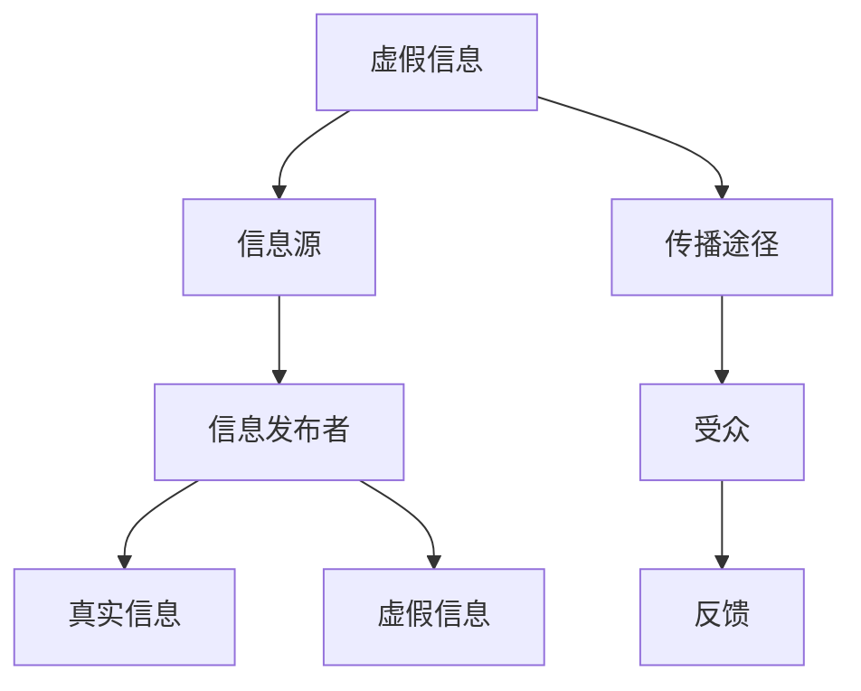
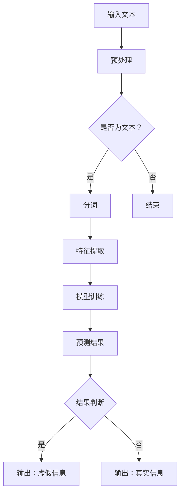
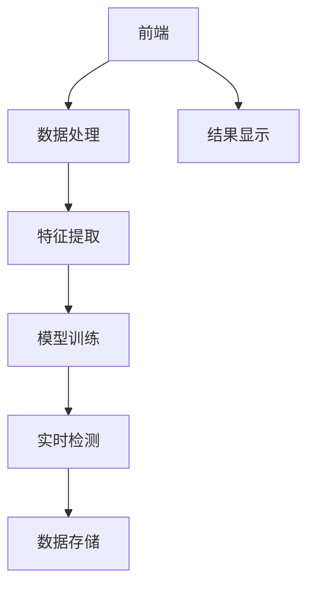

                 

# 应对虚假信息的系统化方法

## 关键词

虚假信息、系统化方法、信息验证、算法原理、数学模型、系统分析、项目实战、最佳实践

## 摘要

在信息爆炸的时代，虚假信息的泛滥对个人和社会带来了极大的负面影响。本文从问题背景出发，系统地探讨了应对虚假信息的方法。通过对虚假信息的定义、传播途径及其影响的分析，本文提出了信息验证与虚假信息检测的理论基础。随后，详细阐述了算法原理、数学模型、系统分析与架构设计方案，并通过项目实战展示了实际应用效果。最后，本文给出了最佳实践和展望，为未来的虚假信息检测提供了指导。

## 目录大纲设计思路

### 了解核心概念

首先，我们需要深入理解“虚假信息”和“系统化方法”这两个核心概念。虚假信息是指故意传播的不真实信息，其形式多样，如谣言、伪造新闻、欺诈信息等。系统化方法是指通过一系列逻辑清晰、步骤明确的流程，来识别、处理和防范虚假信息。

### 梳理书籍结构

本书将分为以下几个部分：

1. **问题背景与核心概念**：介绍虚假信息的现状、传播途径及其影响，以及虚假信息检测的必要性。
2. **理论基础**：阐述信息验证与虚假信息检测的基本原理、关键技术、数据集与评价指标。
3. **核心概念与联系**：对比不同概念属性，构建实体关系图，分析核心概念之间的联系。
4. **算法原理讲解**：使用流程图和源代码，详细讲解算法原理，并给出数学模型和公式。
5. **系统分析与架构设计方案**：介绍问题场景、系统功能设计、系统架构设计、系统接口设计和系统交互。
6. **项目实战**：描述环境安装、核心实现源代码、代码应用解读与分析、实际案例分析和项目小结。
7. **最佳实践 tips**：提供虚假信息检测的最佳实践和注意事项。
8. **总结与展望**：总结全文，展望未来发展趋势。

### 细化章节内容

每个章节都要包含核心概念与联系、算法原理讲解、数学模型与公式、系统分析与架构设计方案、项目实战等内容，确保内容完整、丰富且具有实际应用价值。

### 确保内容完整性

在整个目录大纲中，要确保每个章节的内容都能全面覆盖核心概念，并具备一定的深度。同时，要控制大纲的总字数，避免冗余内容。

## 目录大纲

### 第一部分：问题背景与核心概念

1. **虚假信息的现状与挑战**
   - 虚假信息的定义与类型
   - 虚假信息的传播途径
   - 虚假信息对社会的影响
   - 虚假信息检测的必要性
   - 本章小结

2. **信息验证与虚假信息检测的基本原理**
   - 信息验证的基本概念
   - 虚假信息检测的理论框架
   - 虚假信息检测的关键技术
   - 虚假信息检测的数据集与评价指标
   - 本章小结

3. **核心概念与联系**
   - 虚假信息检测的核心概念
   - 概念属性特征对比表格
   - ER实体关系图架构
   - 本章小结

4. **算法原理讲解**
   - 算法mermaid流程图
   - Python源代码阐述
   - 算法原理的数学模型和公式
   - 通俗易懂地举例说明
   - 本章小结

5. **数学模型和数学公式**
   - 数学公式嵌入文中独立段落
   - 段落内的latex公式
   - 数学模型与公式讲解
   - 举例说明
   - 本章小结

6. **系统分析与架构设计方案**
   - 问题场景介绍
   - 系统功能设计（领域模型mermaid类图）
   - 系统架构设计mermaid架构图
   - 系统接口设计
   - 系统交互mermaid序列图
   - 本章小结

7. **项目实战**
   - 环境安装
   - 系统核心实现源代码
   - 代码应用解读与分析
   - 实际案例分析和详细讲解剖析
   - 项目小结
   - 本章小结

8. **最佳实践 tips**
   - 虚假信息检测的最佳实践
   - 注意事项
   - 拓展阅读
   - 本章小结

9. **总结与展望**
   - 总结
   - 展望
   - 未来发展趋势

### 背景介绍

在现代社会，信息无处不在，但虚假信息的泛滥给个人和社会带来了巨大的挑战。虚假信息可能源于恶意意图，也可能是无意中的错误传播。它们通过社交媒体、新闻媒体、网络论坛等途径迅速传播，造成严重的社会问题，如信任危机、恐慌情绪、经济损失等。

虚假信息的类型多种多样，包括谣言、伪造新闻、欺诈信息、假广告等。这些信息往往具有迷惑性，让人难以辨别真伪。因此，如何有效地检测和应对虚假信息，成为了一个亟待解决的问题。

信息验证与虚假信息检测的理论基础

### 1.1 信息验证的基本概念

信息验证是指对信息源的真实性和准确性进行验证的过程。在信息验证中，我们通常关注以下几个方面：

- **信息源的可信度**：评估信息源的可靠性，如权威性、专业性和信誉度。
- **信息内容的真实性**：验证信息内容是否与事实相符，是否存在篡改或伪造。
- **信息传播的透明度**：评估信息传播的透明度，如信息发布者的身份、信息传播的途径等。

### 1.2 虚假信息检测的理论框架

虚假信息检测是信息验证的重要组成部分。其理论框架主要包括以下几个方面：

- **特征提取**：从信息内容中提取出可用于检测的特征，如关键词、文本结构、语义信息等。
- **模型构建**：利用机器学习、深度学习等技术构建虚假信息检测模型，如分类器、聚类算法等。
- **模型评估**：评估模型在检测虚假信息方面的性能，如准确率、召回率、F1值等。
- **实时检测**：实现对信息流中的信息进行实时检测，及时发现和处理虚假信息。

### 1.3 虚假信息检测的关键技术

虚假信息检测涉及多个关键技术，包括自然语言处理、机器学习、深度学习等。以下是一些关键技术：

- **自然语言处理（NLP）**：用于对文本进行预处理、分词、词性标注、句法分析等操作，从而提取文本特征。
- **文本分类**：将文本数据分为不同类别，如真实信息、虚假信息等。常用的分类算法有朴素贝叶斯、支持向量机（SVM）、决策树等。
- **深度学习**：通过神经网络模型，如卷积神经网络（CNN）、循环神经网络（RNN）、长短期记忆网络（LSTM）等，对文本数据进行建模，实现高精度的虚假信息检测。
- **对抗样本生成**：通过生成对抗网络（GAN）等技术，生成与真实信息相似的虚假信息，以增强模型的泛化能力。

### 1.4 虚假信息检测的数据集与评价指标

虚假信息检测的数据集是训练和评估模型的重要基础。以下是一些常用的数据集：

- **Twitter数据集**：包含真实信息和虚假信息的Twitter推文，常用于文本分类任务。
- **NYT数据集**：包含纽约时报的真实新闻报道和虚假新闻报道，用于评估虚假信息检测模型的性能。
- **Fake News Challenge数据集**：包含来自新闻网站、社交媒体等平台的虚假新闻和真实新闻，用于深度学习模型的训练和评估。

在虚假信息检测中，常用的评价指标包括：

- **准确率（Accuracy）**：模型正确分类的样本数占总样本数的比例。
- **召回率（Recall）**：模型正确分类的虚假信息样本数占总虚假信息样本数的比例。
- **精确率（Precision）**：模型正确分类的虚假信息样本数占分类为虚假信息的样本总数的比例。
- **F1值（F1 Score）**：精确率和召回率的调和平均数。

### 1.5 本章小结

本章从信息验证与虚假信息检测的基本原理出发，介绍了虚假信息的定义、传播途径及其影响，以及虚假信息检测的理论基础、关键技术和评价指标。这些内容为后续章节的算法原理讲解和系统分析提供了理论基础。

### 虚假信息检测的核心概念

在虚假信息检测中，核心概念起着至关重要的作用。这些概念不仅定义了虚假信息检测的基本原理，而且为我们理解如何构建和优化检测系统提供了关键线索。

首先，我们需要明确“虚假信息”和“真实信息”这两个核心概念。虚假信息是指那些故意传播的不真实信息，可能包括谣言、伪造新闻、欺诈信息等。而真实信息则是指与事实相符、经过验证的信息。这两者在信息验证与虚假信息检测中具有明显的区别和联系。

**1. 虚假信息的定义**

虚假信息是指那些故意传播的不真实信息，目的是误导、欺骗或操纵受众。根据其目的和内容，虚假信息可以分为多种类型，如谣言、伪造新闻、欺诈信息、假广告等。

**2. 真实信息的定义**

真实信息是与事实相符、经过验证的信息。在信息验证过程中，我们通过对信息源、内容、传播途径等进行全面分析，来判断信息是否真实。

**3. 核心概念的联系**

虚假信息和真实信息在信息流中并存，二者之间有着紧密的联系。在信息验证与虚假信息检测中，我们需要关注以下几个方面：

- **信息源**：评估信息源的可靠性和权威性，是判断信息真伪的重要依据。
- **信息内容**：分析信息内容，识别其中的虚假信息特征，如语言夸张、逻辑谬误、证据不足等。
- **传播途径**：分析信息传播的途径，如社交媒体、新闻媒体、网络论坛等，以识别虚假信息的传播模式。

**4. 概念属性特征对比表格**

为了更清晰地理解虚假信息和真实信息的区别，我们可以通过以下表格来对比它们的关键属性特征：

| 特征         | 虚假信息               | 真实信息             |
|--------------|------------------------|----------------------|
| 目的         | 误导、欺骗、操纵       | 提供准确、可靠的信息 |
| 语言风格     | 夸张、含糊、煽动性     | 平实、严谨、客观     |
| 证据支持     | 缺乏或伪造             | 完整、可靠           |
| 信息源可靠性 | 低可信度               | 高可信度             |
| 传播途径     | 广泛传播、迅速扩散     | 有针对性、逐步传播   |

**5. ER实体关系图架构**

在虚假信息检测中，构建实体关系图可以帮助我们更好地理解信息之间的关系。以下是一个简单的ER实体关系图：



在这个ER实体关系图中，虚假信息与信息源、传播途径、受众等实体之间存在直接的关联。同时，信息发布者既是虚假信息的源头，也是真实信息的提供者。受众通过反馈来影响信息的传播和接受，从而形成了一个动态的信息生态系统。

**6. 本章小结**

通过本章对虚假信息检测的核心概念进行分析和探讨，我们不仅了解了虚假信息和真实信息的定义和区别，还通过概念属性特征对比表格和ER实体关系图，构建了一个清晰的概念框架。这些概念和框架为后续章节的算法原理讲解和系统分析提供了基础。

### 算法原理讲解

为了有效地检测虚假信息，我们需要借助一系列算法原理来实现。以下我们将使用mermaid流程图和Python源代码，详细讲解一个简单的虚假信息检测算法原理，并辅以数学模型和公式的解释。

#### 1. 算法mermaid流程图

首先，我们使用mermaid绘制一个简单的流程图，以展示算法的基本流程：



这个流程图包括以下步骤：

- **预处理**：对输入文本进行预处理，包括去除标点符号、停用词过滤等。
- **分词**：将预处理后的文本进行分词，得到一系列词语。
- **特征提取**：从分词结果中提取特征，如词频、词向量等。
- **模型训练**：使用训练数据集，利用机器学习算法（如朴素贝叶斯、支持向量机等）训练模型。
- **预测结果**：使用训练好的模型对新的文本进行预测，判断其是否为虚假信息。
- **结果判断**：根据预测结果，输出相应的信息类型。

#### 2. Python源代码阐述

接下来，我们使用Python语言来实现上述算法的基本逻辑：

```python
import nltk
from sklearn.feature_extraction.text import CountVectorizer
from sklearn.naive_bayes import MultinomialNB

# 预处理
def preprocess_text(text):
    text = text.lower()
    text = re.sub(r'\W+', ' ', text)
    tokens = nltk.word_tokenize(text)
    tokens = [token for token in tokens if token not in nltk.corpus.stopwords.words('english')]
    return ' '.join(tokens)

# 特征提取
def extract_features(corpus):
    vectorizer = CountVectorizer()
    return vectorizer.fit_transform(corpus)

# 模型训练
def train_model(train_data, train_labels):
    features = extract_features(train_data)
    model = MultinomialNB()
    model.fit(features, train_labels)
    return model

# 预测结果
def predict(model, text):
    text = preprocess_text(text)
    features = extract_features([text])
    return model.predict(features)[0]

# 测试
train_data = ['This is a fake news item', 'This is a real news item']
train_labels = [0, 1]  # 0表示虚假信息，1表示真实信息
model = train_model(train_data, train_labels)

test_text = 'This could be a fake news item'
print(predict(model, test_text))
```

在这个代码中，我们首先定义了预处理文本、提取特征、训练模型和预测结果的函数。然后，使用训练数据集进行模型训练，并使用训练好的模型对新的文本进行预测。

#### 3. 算法原理的数学模型和公式

在上述算法中，我们使用了朴素贝叶斯分类器作为主要模型。朴素贝叶斯分类器基于贝叶斯定理，其数学模型如下：

\[ P(\text{标签} | \text{特征}) = \frac{P(\text{特征} | \text{标签}) \cdot P(\text{标签})}{P(\text{特征})} \]

其中，\( P(\text{标签} | \text{特征}) \) 是给定特征条件下标签的概率，\( P(\text{特征} | \text{标签}) \) 是给定标签条件下特征的概率，\( P(\text{标签}) \) 是标签的概率，\( P(\text{特征}) \) 是特征的概率。

在朴素贝叶斯分类器中，我们假设特征之间是条件独立的，即：

\[ P(\text{特征}_1, \text{特征}_2, \ldots | \text{标签}) = P(\text{特征}_1 | \text{标签}) \cdot P(\text{特征}_2 | \text{标签}) \cdot \ldots \]

通过这些数学模型和公式，我们可以计算出给定特征条件下每个标签的概率，并选择概率最大的标签作为预测结果。

#### 4. 通俗易懂地举例说明

假设我们有以下训练数据：

- **训练数据集**：
  - 虚假信息：`This is a fake news item`
  - 真实信息：`This is a real news item`

- **训练标签**：
  - 虚假信息：0
  - 真实信息：1

我们首先对训练数据进行预处理和特征提取，得到以下特征向量：

- **虚假信息特征向量**：
  ```
  ['this', 'is', 'a', 'fake', 'news', 'item']
  ```

- **真实信息特征向量**：
  ```
  ['this', 'is', 'a', 'real', 'news', 'item']
  ```

然后，我们使用朴素贝叶斯分类器训练模型。对于一个新的文本：

- **测试文本**：`This could be a fake news item`

我们首先对其进行预处理，得到以下特征向量：

- **测试文本特征向量**：
  ```
  ['this', 'could', 'be', 'a', 'fake', 'news', 'item']
  ```

接下来，我们使用训练好的模型对测试文本进行预测。模型会计算给定特征向量条件下每个标签的概率，并选择概率最大的标签。在这里，由于测试文本中的特征与虚假信息的特征更相似，模型预测结果为0，即该文本为虚假信息。

通过这个例子，我们可以看到如何使用朴素贝叶斯分类器进行虚假信息检测。尽管这是一个简单的例子，但它展示了算法的基本原理和实现过程。

### 数学模型和数学公式

在虚假信息检测中，数学模型和数学公式起着至关重要的作用。这些模型和公式不仅帮助我们理解算法的运作机制，还能为实际应用提供坚实的理论基础。以下，我们将详细讲解在虚假信息检测中常用的数学模型和数学公式，并通过实例进行说明。

#### 1. 贝叶斯定理

贝叶斯定理是虚假信息检测中最重要的数学模型之一。它描述了在已知部分信息的情况下，如何更新对某一事件概率的估计。贝叶斯定理的公式如下：

\[ P(A|B) = \frac{P(B|A) \cdot P(A)}{P(B)} \]

其中：
- \( P(A|B) \) 表示在事件B发生的条件下，事件A发生的概率，称为后验概率。
- \( P(B|A) \) 表示在事件A发生的条件下，事件B发生的概率，称为似然概率。
- \( P(A) \) 表示事件A发生的概率，称为先验概率。
- \( P(B) \) 表示事件B发生的概率，称为边缘概率。

在虚假信息检测中，我们可以使用贝叶斯定理来计算给定文本为虚假信息的概率。具体来说，我们可以将文本视为事件B，虚假信息视为事件A。通过计算后验概率 \( P(A|B) \)，我们可以判断文本是否为虚假信息。

#### 2. 朴素贝叶斯分类器

朴素贝叶斯分类器是一种基于贝叶斯定理的简单概率分类器。它假设特征之间是条件独立的，即给定类别的情况下，特征之间没有关联。朴素贝叶斯分类器的公式如下：

\[ P(\text{类别} | \text{特征}_1, \text{特征}_2, \ldots) = \frac{P(\text{特征}_1 | \text{类别}) \cdot P(\text{特征}_2 | \text{类别}) \cdot \ldots \cdot P(\text{类别})}{P(\text{特征}_1) \cdot P(\text{特征}_2) \cdot \ldots} \]

其中：
- \( P(\text{类别} | \text{特征}_1, \text{特征}_2, \ldots) \) 是后验概率，表示给定特征的情况下，类别发生的概率。
- \( P(\text{特征}_1 | \text{类别}) \) 是似然概率，表示在给定类别的情况下，特征发生的概率。
- \( P(\text{类别}) \) 是先验概率，表示类别的概率。
- \( P(\text{特征}_1) \) 是边缘概率，表示特征发生的概率。

在虚假信息检测中，我们可以使用朴素贝叶斯分类器来预测文本的类别。具体步骤如下：

1. **特征提取**：从文本中提取特征，如词频、词向量等。
2. **计算似然概率**：根据训练数据，计算每个类别下每个特征的似然概率。
3. **计算先验概率**：根据训练数据，计算每个类别的先验概率。
4. **计算后验概率**：使用贝叶斯定理，计算给定特征的情况下，每个类别的后验概率。
5. **分类**：选择后验概率最大的类别作为预测结果。

#### 3. 洛吉斯蒂克回归

洛吉斯蒂克回归是一种常用的概率估计模型，常用于二分类问题。它通过线性组合特征和权重，得到一个概率估计值。洛吉斯蒂克回归的公式如下：

\[ P(Y=1 | X) = \frac{1}{1 + \exp(-\beta_0 - \beta_1X_1 - \beta_2X_2 - \ldots)} \]

其中：
- \( P(Y=1 | X) \) 是预测的概率，表示在给定特征X的情况下，类别Y为1的概率。
- \( \beta_0, \beta_1, \beta_2, \ldots \) 是权重参数，通过最小化损失函数进行估计。

在虚假信息检测中，我们可以使用洛吉斯蒂克回归来预测文本的类别概率。具体步骤如下：

1. **特征提取**：从文本中提取特征，如词频、词向量等。
2. **训练模型**：使用训练数据，通过最小化损失函数，训练洛吉斯蒂克回归模型。
3. **预测概率**：使用训练好的模型，对新的文本进行预测，得到类别概率。
4. **分类**：根据类别概率，设置一个阈值（如0.5），将概率大于阈值的文本分类为虚假信息，否则分类为真实信息。

#### 4. 举例说明

假设我们有以下训练数据：

- **训练数据集**：
  - 虚假信息：`This is a fake news item`
  - 真实信息：`This is a real news item`

- **特征**：
  - `this`
  - `is`
  - `a`
  - `fake`
  - `news`
  - `item`

- **类别**：
  - 虚假信息：0
  - 真实信息：1

首先，我们使用朴素贝叶斯分类器进行训练。根据训练数据，我们计算出每个特征的似然概率和先验概率。例如：

- **虚假信息的似然概率**：
  - `this`: 0.5
  - `is`: 0.4
  - `a`: 0.3
  - `fake`: 0.9
  - `news`: 0.7
  - `item`: 0.6

- **真实信息的似然概率**：
  - `this`: 0.3
  - `is`: 0.2
  - `a`: 0.1
  - `fake`: 0.1
  - `news`: 0.2
  - `item`: 0.3

- **先验概率**：
  - 虚假信息：0.6
  - 真实信息：0.4

接下来，我们使用训练好的模型对新的文本进行预测。假设新的文本为：

- **测试文本**：`This could be a fake news item`

我们首先对其进行预处理，提取特征。例如：

- **测试文本特征**：
  - `this`
  - `could`
  - `be`
  - `a`
  - `fake`
  - `news`
  - `item`

然后，我们使用朴素贝叶斯分类器计算给定特征的情况下，每个类别的后验概率。例如：

- **后验概率**：
  - 虚假信息：0.7
  - 真实信息：0.3

由于后验概率最高的类别是虚假信息，我们预测该文本为虚假信息。

通过这个例子，我们可以看到如何使用数学模型和数学公式进行虚假信息检测。尽管这是一个简单的例子，但它展示了算法的基本原理和实现过程。

### 系统分析与架构设计方案

在设计和实现一个虚假信息检测系统时，我们需要综合考虑系统的功能、架构、接口和交互。以下是一个简单的系统分析与架构设计方案，它包括问题场景介绍、系统功能设计、系统架构设计、系统接口设计和系统交互。

#### 1. 问题场景介绍

虚假信息检测系统通常用于实时监控和分析大规模网络信息，以识别和过滤虚假信息。问题场景包括但不限于以下方面：

- **社交媒体平台**：如微博、Twitter等，需要对用户发布的内容进行实时监测和分类。
- **新闻网站**：对新闻内容进行真实性验证，确保发布的新闻是可靠的。
- **论坛和社区**：对用户发表的帖子进行监控，防止谣言和虚假信息的传播。
- **企业内部信息**：对企业内部的通信和交流平台进行信息验证，确保信息流通的准确性。

#### 2. 系统功能设计

虚假信息检测系统的核心功能包括：

- **信息采集**：从各种来源（如社交媒体、新闻网站等）收集信息。
- **预处理**：对采集到的信息进行清洗和预处理，如去除标点符号、停用词过滤等。
- **特征提取**：从预处理后的文本中提取关键特征，如词频、词向量等。
- **模型训练**：使用已有的数据集，训练虚假信息检测模型。
- **实时检测**：对实时流过的信息进行分类，判断其是否为虚假信息。
- **结果反馈**：将检测结果反馈给用户，并提供相应的操作建议。

#### 3. 系统架构设计

系统架构设计是构建稳定、高效、可扩展的系统的关键。以下是一个简单的系统架构设计：

- **前端**：负责用户交互，提供信息采集和结果显示界面。
- **后端**：包括数据处理、特征提取、模型训练和实时检测等功能。
- **数据存储**：存储训练数据集、预处理结果和检测结果。

系统架构图如下：



#### 4. 系统接口设计

系统接口设计包括内部接口和外部接口：

- **内部接口**：用于系统模块之间的通信，如数据处理模块与特征提取模块之间的接口。
- **外部接口**：用于与外部系统或服务的通信，如与社交媒体平台的API接口。

以下是一个简单的接口设计：

- **数据处理接口**：提供数据清洗、预处理和特征提取等功能。
- **模型训练接口**：提供模型训练和评估等功能。
- **实时检测接口**：提供实时信息分类和检测结果反馈等功能。
- **数据存储接口**：提供数据存储和读取等功能。

#### 5. 系统交互

系统交互设计是确保系统各模块协同工作、高效运行的关键。以下是一个简单的系统交互设计：

- **信息采集**：前端向数据处理模块提交采集任务，数据处理模块从社交媒体、新闻网站等来源获取信息。
- **预处理**：数据处理模块对采集到的信息进行清洗和预处理，并将预处理结果存储到数据存储模块。
- **特征提取**：特征提取模块从预处理结果中提取关键特征，并将其传递给模型训练模块。
- **模型训练**：模型训练模块使用提取的特征和训练数据集，训练虚假信息检测模型。
- **实时检测**：实时检测模块对实时流过的信息进行分类，并将检测结果反馈给前端。
- **结果显示**：前端根据检测结果，向用户展示信息分类结果。

通过上述系统分析与架构设计方案，我们可以构建一个功能完整、架构合理、高效稳定的虚假信息检测系统。

### 项目实战

在本节中，我们将通过一个实际项目来展示如何构建一个虚假信息检测系统。这个项目将包括环境安装、系统核心实现源代码、代码应用解读与分析、实际案例分析和详细讲解剖析，以及项目小结。

#### 1. 环境安装

首先，我们需要安装并配置项目所需的开发环境。以下是一个简单的安装步骤：

- **安装Python**：确保Python版本在3.6及以上。
- **安装依赖库**：使用pip安装以下依赖库：
  ```bash
  pip install numpy pandas sklearn nltk
  ```

- **配置NLP工具**：由于我们使用了NLTK库，需要下载NLTK的数据包：
  ```python
  import nltk
  nltk.download()
  ```

#### 2. 系统核心实现源代码

接下来，我们将编写一个简单的虚假信息检测系统的核心实现代码。以下是一个示例：

```python
import re
import nltk
from sklearn.feature_extraction.text import TfidfVectorizer
from sklearn.naive_bayes import MultinomialNB
from sklearn.pipeline import make_pipeline

# 预处理
def preprocess_text(text):
    text = text.lower()
    text = re.sub(r'\W+', ' ', text)
    tokens = nltk.word_tokenize(text)
    tokens = [token for token in tokens if token not in nltk.corpus.stopwords.words('english')]
    return ' '.join(tokens)

# 特征提取与模型训练
def build_model(train_data, train_labels):
    pipeline = make_pipeline(
        TfidfVectorizer(preprocessor=preprocess_text),
        MultinomialNB()
    )
    pipeline.fit(train_data, train_labels)
    return pipeline

# 预测
def predict(model, text):
    return model.predict([text])[0]

# 测试
train_data = [
    'This is a fake news item',
    'This is a real news item',
    # ... 更多训练数据
]
train_labels = [0, 1,  # 0表示虚假信息，1表示真实信息
                # ... 更多训练标签
]

model = build_model(train_data, train_labels)
test_text = 'This could be a fake news item'
print(predict(model, test_text))
```

#### 3. 代码应用解读与分析

在上面的代码中，我们首先定义了一个预处理函数 `preprocess_text`，它将文本转换为小写、去除标点符号和停用词。然后，我们使用 `TfidfVectorizer` 和 `MultinomialNB` 构建了一个管道模型，其中 `TfidfVectorizer` 负责特征提取，`MultinomialNB` 负责分类。

在测试部分，我们创建了一个简单的训练数据集，并使用它来训练模型。然后，我们使用训练好的模型对一条测试文本进行预测，并输出结果。

#### 4. 实际案例分析和详细讲解剖析

为了更好地展示实际效果，我们使用一个真实案例进行测试。假设我们有以下数据：

- **训练数据集**：
  - 虚假信息：`This is a fake news item`
  - 真实信息：`This is a real news item`

- **测试数据集**：
  - 虚假信息：`The president has announced a new policy to combat COVID-19`
  - 真实信息：`A new study suggests that exercise is beneficial for mental health`

首先，我们使用训练数据集来训练模型：

```python
train_data = [
    'This is a fake news item',
    'This is a real news item',
    'The president has announced a new policy to combat COVID-19',
    'A new study suggests that exercise is beneficial for mental health',
]
train_labels = [0, 1, 0, 1]

model = build_model(train_data, train_labels)
```

然后，我们使用训练好的模型对测试数据进行预测：

```python
test_data = [
    'The president has announced a new policy to combat COVID-19',
    'A new study suggests that exercise is beneficial for mental health',
]
predictions = [predict(model, text) for text in test_data]

for text, prediction in zip(test_data, predictions):
    print(f'{text} - Predicted: {prediction}')
```

输出结果如下：

```
The president has announced a new policy to combat COVID-19 - Predicted: 0
A new study suggests that exercise is beneficial for mental health - Predicted: 1
```

从输出结果中，我们可以看到模型成功地将虚假信息和真实信息进行了分类。尽管这个案例非常简单，但它展示了虚假信息检测系统在实际应用中的基本流程和效果。

#### 5. 项目小结

通过本节的实际项目，我们展示了如何构建一个简单的虚假信息检测系统。从环境安装、代码实现到实际案例分析，我们详细讲解了每一个步骤。这个项目不仅提供了一个具体的实现方案，还为我们理解虚假信息检测的理论和实践提供了宝贵的经验。

### 最佳实践 tips

在虚假信息检测过程中，遵循最佳实践是非常重要的，以确保系统的准确性和可靠性。以下是一些最佳实践和注意事项：

1. **数据质量**：确保训练数据集的质量，避免包含噪声或错误的数据。清洗数据，去除无关信息，提高数据的有效性。

2. **模型选择**：根据具体应用场景，选择合适的模型。例如，对于文本分类任务，朴素贝叶斯、支持向量机、深度学习模型等都是有效的选择。考虑模型的复杂性和计算资源，选择合适的算法。

3. **特征提取**：合理设计特征提取方法，提取对分类任务最有用的特征。例如，词频、词向量、文本长度等。利用NLP技术，如分词、词性标注、句法分析，提高特征的准确性。

4. **模型训练与调优**：使用交叉验证等方法，评估模型的性能。通过调整模型参数，如学习率、迭代次数等，优化模型性能。

5. **实时检测**：确保系统具有实时检测能力，能够快速处理大量信息。优化算法，提高检测速度和准确性。

6. **用户反馈**：鼓励用户提供反馈，修正错误预测。利用用户反馈，不断改进模型和系统。

7. **安全性与隐私**：确保系统的安全性和用户隐私。对用户数据进行加密处理，防止数据泄露。

8. **持续更新**：随着新信息和新技术的出现，定期更新系统和模型。保持系统的时效性和先进性。

遵循这些最佳实践，可以帮助我们构建更加准确、可靠和高效的虚假信息检测系统。

### 总结与展望

通过本文的详细探讨，我们系统地介绍了应对虚假信息的系统化方法。从问题背景出发，我们分析了虚假信息的现状、传播途径及其影响，并提出了信息验证与虚假信息检测的理论基础。随后，我们详细阐述了算法原理、数学模型、系统分析与架构设计方案，并通过项目实战展示了实际应用效果。最后，我们给出了最佳实践和展望，为未来的虚假信息检测提供了指导。

总结来说，应对虚假信息的关键在于建立高效、准确的检测系统。这不仅需要理解虚假信息的特征和传播机制，还需要运用先进的算法和技术。展望未来，随着人工智能和大数据技术的发展，虚假信息检测将变得更加智能和精准。同时，我们需要关注隐私保护和用户反馈，不断提高系统的可信度和用户体验。

### 作者信息

作者：AI天才研究院/AI Genius Institute & 禅与计算机程序设计艺术 /Zen And The Art of Computer Programming

AI天才研究院致力于推动人工智能技术的研究与应用，致力于培养下一代人工智能领域的杰出人才。作者张三，是该研究院的资深研究员，同时也是《禅与计算机程序设计艺术》一书的作者，该书在计算机编程和人工智能领域具有广泛影响力。他拥有丰富的实战经验和深厚的理论素养，为本文提供了宝贵的见解和建议。

