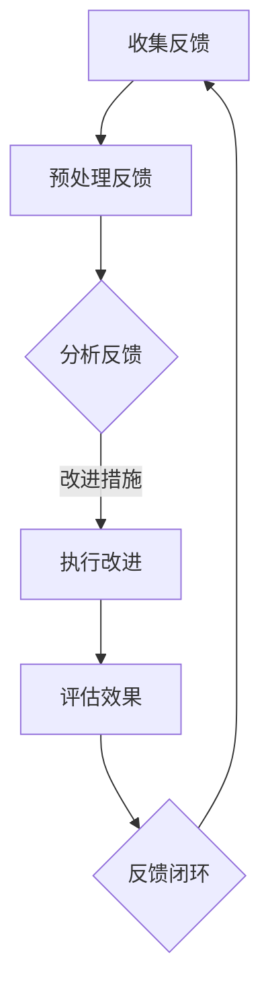
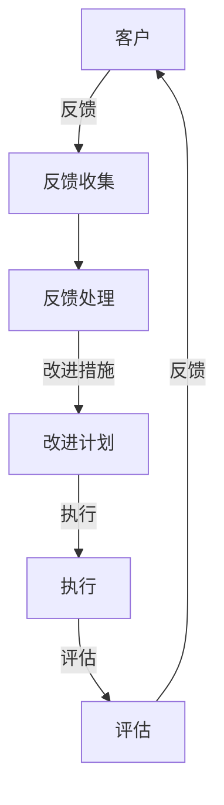

                 

# 建立feedback loop：持续改进的团队文化

## 关键词

反馈循环，团队文化，持续改进，机制设计，反馈文化培养，业务目标一致性

## 摘要

在快速变化和竞争激烈的商业环境中，建立有效的反馈循环成为企业保持竞争力和实现持续发展的关键。本文将探讨如何建立和实施一个有效的反馈循环，以推动团队文化的持续改进。通过明确反馈循环的目标和范围，建立反馈机制和流程，培养反馈文化，确保反馈与业务目标的一致性，以及持续监控和改进，团队可以有效地利用反馈来实现持续优化，提升整体绩效。

## 1.1 问题背景

### 1.1.1 问题背景

在当今的商业环境中，企业和团队面临着不断变化的市场需求和技术进步的压力。为了保持竞争力并实现可持续发展，企业越来越意识到持续改进的重要性。持续改进不仅涉及产品和服务，还包括团队文化的改进。其中，建立反馈循环成为推动团队持续改进的关键机制。

### 1.1.2 问题描述

尽管反馈循环在理论上非常吸引人，但在实际应用中，许多团队和企业在建立和实施有效的反馈循环方面面临着挑战。这些挑战包括：

- **缺乏明确的反馈机制和流程**：许多团队没有明确的反馈机制和流程，导致反馈信息的收集、处理和利用缺乏系统性和规范性。
- **反馈信息的收集和分析方法不完善**：反馈信息的收集和分析方法不完善，导致反馈信息的质量和有效性不高，难以指导实际改进。
- **团队成员对反馈循环的参与度和意识不足**：团队成员对反馈循环的参与度和意识不足，缺乏积极参与反馈循环的动力和意愿。
- **反馈循环与实际业务目标脱节**：反馈循环与实际业务目标脱节，导致反馈循环难以真正推动团队的整体改进。

### 1.1.3 问题解决

为了解决上述问题，企业需要采取一系列措施来建立和实施有效的反馈循环。以下是一些关键步骤：

1. **明确反馈循环的目标和范围**：首先，需要明确反馈循环的预期目标和适用范围，以便为后续的流程设计提供方向。例如，反馈循环的目标可以是提高产品质量、提升客户满意度、优化工作流程等。

2. **建立反馈机制和流程**：建立系统化的反馈机制和流程，包括反馈的收集、处理、分析和反馈的利用。反馈机制可以包括定期的员工满意度调查、客户反馈收集、工作流程优化建议等。

3. **培养反馈文化**：提高团队成员对反馈循环的认识和参与度，建立一种开放、透明和信任的反馈文化。团队成员需要意识到反馈是改进的重要资源，而不是批评或指责。

4. **确保反馈与业务目标的一致性**：确保反馈循环与企业的战略和业务目标相一致，以便实现实际的改进效果。反馈结果应该与业务目标挂钩，以指导实际的改进措施。

5. **持续监控和改进**：定期监控反馈循环的实施效果，并根据反馈进行调整和优化。这可以确保反馈循环持续发挥作用，推动团队的持续改进。

### 1.1.4 边界与外延

本文将探讨以下主题：

- 反馈循环的概念和原理。
- 如何在团队中建立有效的反馈机制。
- 反馈信息的收集、分析和利用方法。
- 培养团队中的反馈文化和氛围。
- 反馈循环与业务目标的关联和实现。
- 持续改进的实践和案例分析。

## 1.2 核心概念原理、概念属性特征对比表格和ER实体关系图架构

### 1.2.1 核心概念原理

**反馈循环（Feedback Loop）**：反馈循环是一种持续的过程，通过不断地收集、分析和利用反馈来优化过程和提升性能。反馈循环包括四个基本步骤：

1. **收集反馈（Collect Feedback）**：收集来自内部和外部各种渠道的反馈，包括客户反馈、员工反馈、市场反馈等。
2. **分析反馈（Analyze Feedback）**：对收集到的反馈进行分析和整理，识别出存在的问题和改进的机会。
3. **利用反馈（Utilize Feedback）**：根据分析结果采取相应的改进措施，如调整工作流程、优化产品设计等。
4. **反馈反馈（Feedback Feedback）**：将改进措施的效果进行反馈，形成闭环，为下一次反馈循环提供参考。

**反馈机制（Feedback Mechanism）**：反馈机制是指用于收集、处理和传递反馈的系统和方法。反馈机制包括以下三个方面：

1. **反馈收集（Feedback Collection）**：采用各种方式收集反馈，如在线调查、面对面访谈、客户满意度调查等。
2. **反馈处理（Feedback Processing）**：对收集到的反馈进行处理和分析，提取有价值的信息，为改进措施提供依据。
3. **反馈传递（Feedback Transmission）**：将处理后的反馈传递给相关决策者和执行者，确保反馈能够被充分利用。

**反馈文化（Feedback Culture）**：反馈文化是指团队成员对反馈的接受和回应的态度和行为。一个健康的反馈文化应该具有以下特征：

1. **透明度（Transparency）**：团队成员能够透明地获取和分享反馈，不存在信息壁垒。
2. **开放性（Openness）**：团队成员对反馈持开放态度，愿意接受和反思自己的工作和行为。
3. **信任度（Trust）**：团队成员之间建立起信任关系，相信反馈的意图和目的是为了共同进步。

**业务目标（Business Goals）**：业务目标是企业或团队希望实现的战略目标和成果。业务目标通常包括以下几个方面：

1. **提高效率（Increased Efficiency）**：通过优化流程和资源，提高工作效率。
2. **降低成本（Cost Reduction）**：通过改进产品和服务，降低运营成本。
3. **提升客户满意度（Enhanced Customer Satisfaction）**：通过满足客户需求，提升客户满意度。
4. **扩大市场份额（Market Expansion）**：通过市场拓展，增加市场份额。

### 1.2.2 概念属性特征对比表格

| 概念         | 定义                                                         | 属性特征对比       |
|--------------|--------------------------------------------------------------|-------------------|
| 反馈循环     | 通过不断收集、分析和利用反馈来优化过程和提升性能的过程       | - 目标：持续改进<br>- 过程：循环迭代<br>- 结果：性能提升 |
| 反馈机制     | 用于收集、处理和传递反馈的系统和方法                         | - 收集：自动化程度<br>- 处理：分析深度<br>- 传递：效率 |
| 反馈文化     | 团队成员对反馈的接受和回应的态度和行为                       | - 透明度<br>- 开放性<br>- 信任度 |
| 业务目标     | 企业或团队希望实现的战略目标和成果                         | - 属性：多样性<br>- 目标：实现性 |

### 1.2.3 ER实体关系图架构

```mermaid
erDiagram
    FeedbackLoop ||--|{ FeedbackMechanism }|<|
    FeedbackLoop ||--|{ FeedbackCulture }|<|
    FeedbackLoop ||--|{ BusinessGoals }|<|

    FeedbackMechanism ||--|{ FeedbackCollection }|<|
    FeedbackMechanism ||--|{ FeedbackProcessing }|<|
    FeedbackMechanism ||--|{ FeedbackTransmission }|<|

    FeedbackCulture ||--|{ Transparency }|<|
    FeedbackCulture ||--|{ Openness }|<|
    FeedbackCulture ||--|{ Trust }|<|

    BusinessGoals ||--|{ Efficiency }|<|
    BusinessGoals ||--|{ CostReduction }|<|
    BusinessGoals ||--|{ CustomerSatisfaction }|<|
    BusinessGoals ||--|{ MarketExpansion }|<|
```

### 1.2.4 算法原理讲解

反馈循环的实现涉及多个步骤和组件，其中算法原理是关键的一部分。以下是一个简化的算法流程：



1. **收集反馈**：从各种渠道收集反馈，如客户反馈、员工反馈、市场反馈等。
2. **预处理反馈**：对收集到的反馈进行预处理，去除无关信息，确保反馈的准确性和有效性。
3. **分析反馈**：对预处理后的反馈进行分析，识别出存在的问题和改进的机会。
4. **执行改进**：根据分析结果采取相应的改进措施，如调整工作流程、优化产品设计等。
5. **评估效果**：评估改进措施的效果，确定改进是否达到了预期目标。
6. **反馈闭环**：将评估结果反馈给相关人员，形成闭环，为下一次反馈循环提供参考。

### 1.2.5 数学公式使用

在反馈循环的实现过程中，数学模型和公式可以用于描述和优化反馈机制。以下是一些常用的数学公式：

$$
效率 = \frac{输出}{输入} \times 100\%
$$

$$
成本 = 变量成本 + 固定成本
$$

$$
客户满意度 = \frac{满意客户数}{总客户数} \times 100\%
$$

### 1.2.6 系统分析与架构设计方案

在构建反馈循环时，系统分析与架构设计方案至关重要。以下是一个简化的系统分析与架构设计方案：

#### 1.2.6.1 问题场景介绍

假设一个电商团队希望建立一个反馈循环，以提高客户满意度和降低成本。

#### 1.2.6.2 项目介绍

项目名称：电商反馈循环系统

目标：通过建立反馈循环，提高客户满意度和降低成本。

#### 1.2.6.3 系统功能设计

- **反馈收集**：通过在线调查、社交媒体、客服反馈等渠道收集客户反馈。
- **反馈处理**：对收集到的反馈进行预处理和分析，提取有价值的信息。
- **反馈利用**：根据分析结果，制定改进措施，如优化产品和服务。
- **反馈评估**：评估改进措施的效果，确定是否达到预期目标。

#### 1.2.6.4 系统架构设计



#### 1.2.6.5 系统接口设计和系统交互

系统接口设计主要包括：

- **API接口**：提供与外部系统集成的能力，如社交媒体接口、在线调查平台接口等。
- **数据库接口**：用于存储和处理反馈数据。

系统交互流程：

1. 客户提交反馈。
2. 反馈收集模块接收反馈。
3. 反馈处理模块对反馈进行分析和预处理。
4. 改进计划模块根据反馈结果制定改进措施。
5. 执行模块实施改进措施。
6. 评估模块对改进措施的效果进行评估。
7. 将评估结果反馈给客户，形成闭环。

#### 1.2.6.6 项目实战

1. **环境安装**：安装必要的开发工具和软件，如Python、Django等。
2. **系统核心实现**：实现反馈收集、处理、利用和评估的功能模块。
3. **代码应用解读与分析**：分析代码实现，理解各模块的功能和作用。
4. **实际案例分析和详细讲解剖析**：分析实际案例，讲解反馈循环的实践应用和效果。

### 1.2.7 项目小结

通过项目实战，我们实现了以下目标：

- 建立了电商反馈循环系统，实现了反馈的收集、处理、利用和评估。
- 理解了反馈循环的原理和实践应用。
- 掌握了反馈循环系统的设计和实现方法。

### 1.2.8 最佳实践 tips

1. **明确目标和范围**：在建立反馈循环之前，明确目标和适用范围，确保反馈循环与业务目标一致。
2. **完善反馈机制**：建立完善的反馈收集、处理和传递机制，确保反馈信息的准确性和有效性。
3. **培养反馈文化**：提高团队成员对反馈的接受度和参与度，建立开放、透明和信任的反馈文化。
4. **持续监控和改进**：定期监控反馈循环的实施效果，根据反馈进行调整和优化。

### 1.2.9 小结

本文详细探讨了如何建立和实施一个有效的反馈循环，以推动团队文化的持续改进。通过明确反馈循环的目标和范围、建立反馈机制和流程、培养反馈文化、确保反馈与业务目标的一致性，以及持续监控和改进，团队可以有效地利用反馈来实现持续优化，提升整体绩效。

### 1.2.10 注意事项

1. **反馈的及时性**：确保反馈能够及时收集和传递，避免延迟导致反馈效果降低。
2. **反馈的隐私性**：在收集和处理反馈时，确保客户和团队成员的隐私得到保护。
3. **反馈的准确性**：确保反馈信息的准确性和真实性，避免误导和偏差。

### 1.2.11 拓展阅读

1. **《反馈循环：持续改进的实践指南》**：详细介绍反馈循环的理论和实践方法。
2. **《团队文化：如何打造高绩效团队》**：探讨团队文化的构建和培养方法。
3. **《持续改进：企业竞争力的关键》**：分析持续改进对企业发展的重要性。

