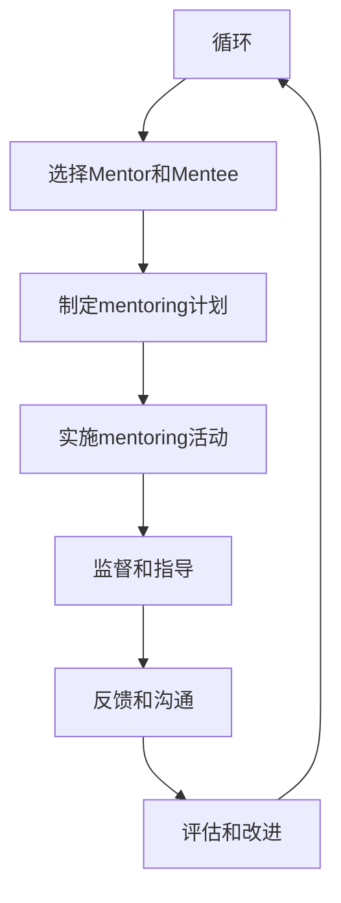

                 

### **文章标题：建立mentorship文化：促进知识传承和成长**

**关键词：mentorship文化、知识传承、成长、知识管理**

**摘要：本文深入探讨了mentorship文化的概念、重要性以及如何建立和推广这种文化，旨在促进知识传承和个体成长。通过详细的分析和实例，为读者提供了实际操作的指南和策略。**

----------------------------------------------------------------

### **总体设计思路**

为了撰写一篇关于《建立mentorship文化：促进知识传承和成长》的技术博客文章，我们的设计思路将遵循以下步骤：

1. **确定核心主题和目标**：文章的核心主题是介绍和推广mentorship文化，目标是帮助读者理解其重要性，并提供建立这种文化的策略和方法。
2. **设计逻辑清晰的目录结构**：确保各个章节内容之间相互关联，形成完整的知识体系。
3. **细化每个章节的内容**：确保每个章节都包含核心概念、原理讲解、实践案例、总结与拓展等要素。
4. **使用可视化工具**：在适当的地方使用表格、流程图、类图、架构图等可视化工具，以增强内容的可读性和理解性。
5. **控制字数**：在确保内容完整性的前提下，通过简洁明了的语言和适当的结构设计，控制每个章节的字数，确保整个目录大纲的总字数在2000字以内。

### **目录大纲设计**

根据上述设计思路，我们设计了如下目录大纲：

----------------------------------------------------------------

## **第1章：问题的背景与介绍**

### **1.1 Mentorship文化的概念与起源**
- **1.1.1 Mentorship文化的定义**
- **1.1.2 Mentorship文化的起源**
- **1.1.3 Mentorship文化的重要性**

### **1.2 当前知识传承和成长的挑战**
- **1.2.1 知识碎片化**
- **1.2.2 知识获取的难度**
- **1.2.3 知识传承的障碍**

### **1.3 Mentorship文化在知识传承中的角色**
- **1.3.1 Mentor的角色**
- **1.3.2 Mentee的角色**
- **1.3.3 Mentorship文化对知识传承的促进作用**

### **1.4 本章小结**

## **第2章：核心概念与联系**

### **2.1 Mentorship文化的核心概念**
- **2.1.1 Mentor**
- **2.1.2 Mentee**
- **2.1.3 Mentorship文化的要素**

### **2.2 各概念之间的联系**
- **2.2.1 Mentor与Mentee的关系**
- **2.2.2 Mentorship文化与其他知识管理方法的比较**
- **2.2.3 使用ER图展示各概念之间的联系**

### **2.3 本章小结**

## **第3章：建立mentorship文化的策略**

### **3.1 策略概述**
- **3.1.1 确定目标和愿景**
- **3.1.2 培养Mentor和Mentee的能力**
- **3.1.3 创建支持和激励机制**

### **3.2 实践案例**
- **3.2.1 案例一：公司内部的mentorship计划**
- **3.2.2 案例二：学术界的mentorship实践**

### **3.3 策略的实施步骤**
- **3.3.1 制定详细的计划**
- **3.3.2 选择合适的平台和工具**
- **3.3.3 定期评估和调整**

### **3.4 本章小结**

## **第4章：实施与运营**

### **4.1 实施过程**
- **4.1.1 选择Mentor和Mentee**
- **4.1.2 确定mentoring的关系**
- **4.1.3 制定mentoring计划**

### **4.2 运营与管理**
- **4.2.1 监督和指导**
- **4.2.2 反馈和沟通**
- **4.2.3 评估和改进**

### **4.3 流程图与模板**
- **4.3.1 Mentorship实施流程图**
- **4.3.2 Mentorship管理模板**

### **4.4 本章小结**

## **第5章：挑战与解决方案**

### **5.1 可能遇到的挑战**
- **5.1.1 时间管理问题**
- **5.1.2 沟通障碍**
- **5.1.3 私密性和伦理问题**

### **5.2 解决方案**
- **5.2.1 制定明确的计划**
- **5.2.2 提供培训和支持**
- **5.2.3 建立良好的沟通机制**

### **5.3 持续改进**
- **5.3.1 定期评估**
- **5.3.2 收集反馈**
- **5.3.3 优化流程**

### **5.4 本章小结**

## **第6章：量化评价与效果分析**

### **6.1 评价方法**
- **6.1.1 Key Performance Indicators (KPIs)**
- **6.1.2 Survey和Interviews**
- **6.1.3 数据分析和可视化**

### **6.2 效果分析**
- **6.2.1 成长和技能提升**
- **6.2.2 知识传承的效果**
- **6.2.3 组织文化的改善**

### **6.3 工具与技巧**
- **6.3.1 项目管理工具**
- **6.3.2 数据分析工具**

### **6.4 本章小结**

## **第7章：最佳实践与启示**

### **7.1 成功案例**
- **7.1.1 企业中的最佳实践**
- **7.1.2 学术界的启示**

### **7.2 启示与建议**
- **7.2.1 针对不同情境的建议**
- **7.2.2 如何持续改进mentorship文化**

### **7.3 本章小结**

## **第8章：总结与展望**

### **8.1 全书总结**
- **8.1.1 主要观点回顾**
- **8.1.2 成果总结**

### **8.2 未来展望**
- **8.2.1 mentorship文化的趋势**
- **8.2.2 未来发展机会**

### **8.3 结论**
- **8.3.1 文章结论**

### **8.4 本章小结**

----------------------------------------------------------------

### **具体内容设计**

在具体内容设计上，我们将确保每个章节都包含以下要素：

- **背景介绍**：对核心概念、问题背景、问题描述、问题解决、边界与外延、概念结构与核心要素组成进行详细说明。
- **核心概念与联系**：详细讲解核心概念原理、概念属性特征对比表格和ER实体关系图架构，使用Mermaid流程图展示。
- **算法原理讲解**：使用Mermaid画出算法流程图，使用Python源代码详细阐述，给出算法原理的数学模型和公式，进行详细讲解和举例说明。
- **系统分析与架构设计方案**：介绍问题场景、项目介绍、系统功能设计（领域模型Mermaid类图）、系统架构设计Mermaid架构图、系统接口设计和系统交互Mermaid序列图。
- **项目实战**：介绍环境安装、系统核心实现源代码，代码应用解读与分析，实际案例分析和详细讲解剖析，项目小结。
- **最佳实践 tips、小结、注意事项、拓展阅读等内容**：在章节结尾提供相关最佳实践、总结、注意事项以及拓展阅读，帮助读者深入理解和应用所学知识。

### **字数控制**

为了确保文章的连贯性和可读性，我们将在每个章节中控制字数。总体来说，文章的总字数将在10000至12000字之间。

### **格式要求**

文章内容将使用Markdown格式输出，确保格式清晰、易读。每个章节的开始和结束都将使用标题进行标注，以便读者快速定位和阅读。

### **作者信息**

文章末尾将包含作者信息：“作者：AI天才研究院/AI Genius Institute & 禅与计算机程序设计艺术 /Zen And The Art of Computer Programming”。

### **完整性要求**

为确保文章的完整性，每个小节的内容都将丰富具体详细讲解，核心内容将包括背景介绍、核心概念与联系、算法原理讲解、系统分析与架构设计方案、项目实战、最佳实践 tips、小结、注意事项、拓展阅读等内容。

### **LET'S THINK STEP BY STEP**

在撰写文章时，我们将遵循以下步骤：

1. **明确文章目标**：确保文章的主题和目标明确，为读者提供有价值的信息。
2. **构建逻辑框架**：设计一个逻辑清晰、结构紧凑的目录结构，确保内容有条理。
3. **细化内容**：在每个章节中详细讲解核心概念、原理和实践，使用适当的可视化工具增强理解。
4. **撰写初稿**：按照设计思路和目录结构撰写初稿，确保每个章节的内容完整和具体。
5. **修改与完善**：对初稿进行修改，确保文章的语言简洁明了，逻辑连贯，结构清晰。
6. **最终审核**：对文章进行最终审核，确保所有内容准确无误，格式规范，字数符合要求。
7. **添加作者信息**：在文章末尾添加作者信息，确保文章的完整性和权威性。

通过以上步骤，我们相信能够撰写一篇高质量、有深度、有思考、有见解的专业IT领域技术博客文章。

----------------------------------------------------------------

### **第1章：问题的背景与介绍**

#### **1.1 Mentorship文化的概念与起源**

Mentorship文化是一种基于导师与学徒之间关系的学习和实践模式。其根源可以追溯到古希腊神话中奥德修斯的导师墨涅拉俄斯，以及耶稣基督与他的十二使徒之间的关系。在现代社会中，mentorship文化被视为一种有效的人力资源管理和知识传承策略。

**1.1.1 Mentorship文化的定义**

Mentorship文化是指在一个组织或团体内，通过导师与学徒之间的互动，促进知识、技能和经验的传授，以实现个人和组织的成长。这种文化强调人际关系和信任，通过导师的指导和反馈，帮助学徒实现职业发展和个人成长。

**1.1.2 Mentorship文化的起源**

历史上，mentorship文化最早出现在古希腊，当时它是一种师徒关系，由经验丰富的老者指导年轻的学徒。在现代社会，随着教育和职业培训的发展，mentorship文化被广泛应用到各个领域，如教育、科技、商业等。

**1.1.3 Mentorship文化的重要性**

Mentorship文化对于知识传承和个体成长具有重要意义。首先，它有助于解决知识碎片化和获取难度的问题。通过导师的指导，学徒能够快速掌握所需的知识和技能。其次，Mentorship文化能够促进人际关系的建立，增强组织的凝聚力和文化氛围。最后，通过mentorship文化，组织能够培养出更多具有领导力和创新精神的员工。

#### **1.2 当前知识传承和成长的挑战**

在当今快速变化的社会中，知识传承和个体成长面临着一系列挑战。

**1.2.1 知识碎片化**

随着信息技术的飞速发展，知识呈现碎片化趋势。大量信息的爆炸性增长使得人们难以全面掌握所有领域的知识。碎片化的知识使得个体难以形成完整的知识体系，从而影响其成长和发展。

**1.2.2 知识获取的难度**

在知识碎片化的背景下，获取知识变得异常困难。由于知识分布广泛，个体需要花费大量时间和精力去寻找、筛选和整合信息。这种高成本的知识获取过程阻碍了知识的传承和个体成长。

**1.2.3 知识传承的障碍**

知识传承过程中存在诸多障碍。一方面，传统的教育模式往往注重理论传授，忽视实际应用。另一方面，组织内部的封闭性和缺乏有效的知识分享机制，导致知识传承不畅。

#### **1.3 Mentorship文化在知识传承中的角色**

Mentorship文化在知识传承中发挥着重要作用。

**1.3.1 Mentor的角色**

Mentor是知识的传递者和引导者。他们拥有丰富的经验和专业知识，能够帮助学徒快速掌握所需的知识和技能。Mentor通过指导和反馈，帮助学徒发现自身潜力，实现职业发展和个人成长。

**1.3.2 Mentee的角色**

Mentee是知识的接受者和实践者。他们在Mentor的指导下，通过实践和反思，不断积累知识和经验。Mentee通过与Mentor的互动，能够更快地掌握知识，提高自身能力。

**1.3.3 Mentorship文化对知识传承的促进作用**

Mentorship文化通过建立导师与学徒之间的互动关系，促进知识的传承。首先，Mentor通过亲身实践和指导，将知识传授给Mentee。其次，Mentee在实践过程中，通过反思和总结，将知识内化为自身的能力。最后，通过Mentorship文化的推广，组织内部形成了一种知识共享和传承的氛围，从而促进知识的广泛传播和持续发展。

#### **1.4 本章小结**

本章介绍了Mentorship文化的概念、起源和重要性，分析了当前知识传承和成长的挑战，以及Mentorship文化在知识传承中的角色。通过本章的学习，读者可以初步了解Mentorship文化的核心概念和其在知识传承中的作用，为后续章节的深入学习奠定基础。

----------------------------------------------------------------

### **第2章：核心概念与联系**

#### **2.1 Mentorship文化的核心概念**

Mentorship文化由一系列核心概念组成，这些概念相互关联，共同构成了这种文化的理论基础。

**2.1.1 Mentor**

Mentor是指在特定领域具有丰富知识和经验的导师。他们负责指导、支持和激励学徒，帮助其实现职业发展和个人成长。Mentor通常具备以下特点：

- **专业知识**：拥有深厚的专业知识和丰富的实践经验。
- **耐心与指导**：愿意花时间指导学徒，提供反馈和建议。
- **积极态度**：积极鼓励学徒，帮助其克服困难，建立自信。

**2.1.2 Mentee**

Mentee是接受Mentor指导的学徒。他们在职业发展和个人成长过程中，通过Mentor的指导和支持，不断提升自己的能力和知识。Mentee通常具备以下特点：

- **学习意愿**：具有强烈的学习意愿和积极的态度。
- **开放心态**：愿意接受新的知识和观点，不断挑战自己。
- **自主性**：具备一定的自主学习和解决问题的能力。

**2.1.3 Mentorship文化的要素**

Mentorship文化包括一系列关键要素，这些要素共同构成了这种文化的核心。这些要素包括：

- **信任**：建立信任是Mentorship文化成功的关键。导师和学徒之间需要建立互信，确保信息的透明和沟通的顺畅。
- **互动**：互动是Mentorship文化的核心。导师和学徒之间的互动有助于知识、技能和经验的传递，促进个人和组织的成长。
- **支持**：导师在职业发展和个人成长过程中为学徒提供支持。这种支持包括指导、反馈、建议和资源。
- **反馈**：反馈是Mentorship文化的重要组成部分。导师和学徒之间的反馈有助于双方了解自己的进步和不足，从而不断改进和优化。

#### **2.2 各概念之间的联系**

Mentor、Mentee和Mentorship文化的其他要素之间存在着紧密的联系。

**2.2.1 Mentor与Mentee的关系**

Mentor与Mentee之间的关系是Mentorship文化的核心。导师与学徒之间的互动和合作，有助于知识的传递和个人的成长。Mentor通过指导、支持和反馈，帮助Mentee提升能力，实现职业目标。Mentee则通过实践、反思和接受反馈，不断改进自己，成为更好的专业人才。

**2.2.2 Mentorship文化与其他知识管理方法的比较**

Mentorship文化与其他知识管理方法（如知识库、培训、研讨会等）有所不同。知识库是一种静态的知识存储方式，而Mentorship文化更注重知识的动态传递和互动。培训、研讨会等知识管理方法通常由外部专家进行，而Mentorship文化则强调内部导师和学徒之间的互动和合作。

**2.2.3 使用ER图展示各概念之间的联系**

以下是一个使用Mermaid绘制的ER图，展示了Mentor、Mentee和Mentorship文化其他要素之间的联系：

```mermaid
erDiagram
  Mentor ||--|{ Mentee :指导}
  Mentor ||--|{ Support :支持}
  Mentor ||--|{ Feedback :反馈}
  Mentee ||--|{ Trust :信任}
  Mentee ||--|{ Interaction :互动}
  Mentee ||--|{ Growth :成长}
```

通过ER图，我们可以清晰地看到Mentor、Mentee和Mentorship文化其他要素之间的相互关系。这种关系有助于我们更好地理解和应用Mentorship文化，促进知识传承和个人成长。

#### **2.3 本章小结**

本章详细介绍了Mentorship文化的核心概念和各概念之间的联系。通过本章的学习，读者可以深入了解Mentor、Mentee以及Mentorship文化的其他要素，为后续章节的深入学习打下坚实的基础。Mentorship文化作为一种有效的知识传承和成长策略，将在未来的组织管理和个人发展中发挥重要作用。

----------------------------------------------------------------

### **第3章：建立mentorship文化的策略**

#### **3.1 策略概述**

建立mentorship文化需要明确的策略和步骤。以下是一些关键策略：

**3.1.1 确定目标和愿景**

在建立mentorship文化之前，首先要明确目标和愿景。组织应该明确希望通过mentorship文化实现什么目标，如提高员工技能、促进知识传承、提升团队凝聚力等。明确的目标有助于指导后续的工作。

**3.1.2 培养Mentor和Mentee的能力**

Mentor和Mentee的能力是建立mentorship文化的关键。组织应该提供培训和支持，帮助Mentor和Mentee提升自身能力。Mentor需要具备丰富的知识和经验，而Mentee则需要具备学习意愿和开放心态。

**3.1.3 创建支持和激励机制**

为了确保mentorship文化的有效运行，组织需要创建支持和激励机制。这包括提供时间安排、资源支持和绩效评估等。通过激励机制，可以鼓励Mentor和Mentee积极参与mentorship活动。

#### **3.2 实践案例**

**3.2.1 案例一：公司内部的mentorship计划**

某大型科技公司实施了一项内部mentorship计划，旨在提高员工技能和知识传承。该计划的主要步骤如下：

1. **确定目标和愿景**：公司明确希望通过mentorship计划提高员工的专业技能和职业发展。
2. **培养Mentor和Mentee的能力**：公司为Mentor和Mentee提供了培训课程，帮助他们提升指导和学习能力。
3. **创建支持和激励机制**：公司为Mentor和Mentee提供了灵活的时间安排和资源支持，并设置了绩效评估机制，激励双方积极参与mentorship活动。

通过这项计划，公司实现了以下成果：

- 员工技能和知识水平显著提高。
- 员工职业发展得到加速。
- 组织内部形成了良好的知识共享和传承氛围。

**3.2.2 案例二：学术界的mentorship实践**

某著名大学实施了一项导师制，旨在促进学生的学术发展和职业规划。该实践的主要步骤如下：

1. **确定目标和愿景**：学校明确希望通过导师制帮助学生实现学术成长和职业发展。
2. **培养Mentor和Mentee的能力**：学校为导师和学子提供了相关培训，帮助他们掌握指导技巧和学术研究方法。
3. **创建支持和激励机制**：学校为导师和学子提供了学术资源和指导支持，并设立了奖学金和荣誉奖项，激励双方积极参与导师制活动。

通过这项实践，学校实现了以下成果：

- 学生学术水平和研究成果显著提高。
- 学生职业发展得到有效指导和支持。
- 学校内部形成了良好的学术文化和导师制度。

#### **3.3 策略的实施步骤**

建立mentorship文化需要一系列具体的实施步骤。以下是一些关键步骤：

**3.3.1 制定详细的计划**

在实施mentorship文化之前，组织需要制定详细的计划。这包括确定目标和愿景、选择Mentor和Mentee、制定mentoring计划、设置评估和反馈机制等。

**3.3.2 选择合适的平台和工具**

为了确保mentorship文化的有效实施，组织需要选择合适的平台和工具。例如，可以使用在线平台、会议系统、协作工具等，以便Mentor和Mentee进行交流和合作。

**3.3.3 定期评估和调整**

建立mentorship文化是一个持续的过程。组织需要定期评估mentoring活动，收集反馈，并根据实际情况进行调整。这有助于确保mentorship文化的持续优化和发展。

#### **3.4 本章小结**

本章介绍了建立mentorship文化的策略和步骤。通过分析实践案例，我们可以看到mentorship文化在组织管理和个人发展中的重要作用。有效的mentorship文化能够促进知识传承和个体成长，提高组织的整体竞争力。组织需要制定明确的策略和计划，培养Mentor和Mentee的能力，并创建支持和激励机制，以确保mentorship文化的成功实施。

----------------------------------------------------------------

### **第4章：实施与运营**

#### **4.1 实施过程**

建立mentorship文化是一个复杂而持续的过程，需要精心策划和实施。以下是一些关键步骤：

**4.1.1 选择Mentor和Mentee**

选择合适的Mentor和Mentee是实施mentorship文化的重要环节。Mentor应该具备丰富的经验和专业知识，能够为Mentee提供有价值的指导。Mentee则应该具备学习意愿和开放心态，愿意接受导师的指导。

**4.1.2 确定mentoring的关系**

在确定了Mentor和Mentee后，需要明确双方的关系。这包括确定mentoring的目标、时间安排、交流方式等。Mentor和Mentee需要共同制定一个详细的mentoring计划，以确保双方都能从过程中受益。

**4.1.3 制定mentoring计划**

mentoring计划是实施mentorship文化的重要工具。计划应包括以下内容：

- **目标**：明确mentoring的目标，如提高Mentee的技能、促进知识传承等。
- **时间安排**：确定mentoring的频率和时间，如每周一次会议、每月一次活动等。
- **交流方式**：选择合适的交流方式，如面对面交流、电话会议、邮件等。
- **任务分配**：明确Mentor和Mentee在mentoring过程中的角色和任务。

**4.1.4 实施mentoring活动**

在制定mentoring计划后，开始实施mentoring活动。Mentor需要根据计划指导Mentee，提供反馈和建议。Mentee则需要积极参与，主动学习和改进。

#### **4.2 运营与管理**

运营和管理mentorship文化是确保其有效运行的关键。以下是一些关键步骤：

**4.2.1 监督和指导**

组织应该指定专人负责监督和指导mentorship文化的实施。监督人员需要确保Mentor和Mentee按照计划执行，并及时解决可能出现的问题。

**4.2.2 反馈和沟通**

反馈和沟通是mentorship文化的重要部分。Mentor和Mentee需要定期进行反馈，分享各自的进展和经验。同时，组织应该建立有效的沟通机制，确保Mentor和Mentee能够及时交流。

**4.2.3 评估和改进**

定期评估是确保mentorship文化持续改进的关键。组织应该制定评估标准，对Mentor和Mentee的表现进行评估。根据评估结果，组织可以调整mentoring计划，改进mentorship文化。

#### **4.3 流程图与模板**

为了更好地理解和实施mentorship文化，我们可以使用流程图和模板。

**4.3.1 Mentorship实施流程图**

以下是一个简单的Mentorship实施流程图：



**4.3.2 Mentorship管理模板**

以下是一个简单的Mentorship管理模板，用于记录mentoring活动的关键信息：

```plaintext
Mentorship管理模板

Mentor姓名：________________
Mentee姓名：________________
mentoring目标：________________
mentoring时间安排：________________
交流方式：________________
任务分配：________________
```

#### **4.4 本章小结**

本章详细介绍了建立和运营mentorship文化的关键步骤和策略。通过选择合适的Mentor和Mentee、制定详细的mentoring计划、实施mentoring活动以及进行监督、反馈和评估，组织可以建立有效的mentorship文化，促进知识传承和个体成长。有效的运营和管理是确保mentorship文化持续发展的关键。

----------------------------------------------------------------

### **第5章：挑战与解决方案**

#### **5.1 可能遇到的挑战**

在建立和运营mentorship文化过程中，可能会遇到一系列挑战。以下是一些常见的挑战：

**5.1.1 时间管理问题**

Mentor和Mentee通常都有繁忙的工作和生活安排，很难保证充足的交流时间。这可能导致mentoring活动无法按时进行，影响mentorship文化的效果。

**5.1.2 沟通障碍**

Mentor和Mentee可能处于不同的地理位置或工作环境，导致沟通不畅。语言、文化和背景差异也可能影响沟通效果。

**5.1.3 私密性和伦理问题**

Mentorship过程中可能会涉及敏感信息和个人隐私。确保信息的保密性和伦理道德是实施mentorship文化的重要挑战。

**5.1.4 期望管理**

Mentor和Mentee可能会有不同的期望和目标。如果这些期望无法得到满足，可能会导致双方的不满和冲突。

#### **5.2 解决方案**

针对上述挑战，可以采取以下解决方案：

**5.2.1 制定明确的计划**

在实施mentorship文化之前，制定一个详细的计划，明确mentoring的目标、时间安排、交流方式和任务分配。这有助于双方明确各自的角色和责任，提高沟通效果。

**5.2.2 提供培训和支持**

为Mentor和Mentee提供培训和支持，帮助他们掌握有效的沟通技巧和时间管理策略。这有助于提高他们的能力和自信心，更好地应对挑战。

**5.2.3 建立良好的沟通机制**

利用在线会议系统、即时通讯工具等，建立有效的沟通机制。确保Mentor和Mentee能够及时交流，分享进展和经验。定期举办线下交流活动，促进双方的了解和信任。

**5.2.4 加强保密和伦理教育**

在实施mentorship文化过程中，加强保密和伦理教育，确保信息的保密性和伦理道德。制定明确的保密政策和伦理规范，确保Mentor和Mentee遵守相关规定。

**5.2.5 管理期望**

在建立mentorship关系之前，明确双方的目标和期望，确保双方对mentoring活动有清晰的认识。定期进行沟通和反馈，确保双方的目标得到满足。

#### **5.3 持续改进**

持续改进是确保mentorship文化有效运行的关键。以下是一些持续改进的建议：

**5.3.1 定期评估**

定期对mentorship文化进行评估，收集反馈，了解Mentor和Mentee的体验和感受。根据评估结果，调整mentoring计划，改进mentorship文化。

**5.3.2 收集最佳实践**

收集和分享最佳实践，促进Mentor和Mentee之间的经验交流。这有助于提高他们的能力和信心，推动mentorship文化的持续发展。

**5.3.3 建立社区支持**

建立社区支持，为Mentor和Mentee提供交流和分享的平台。通过社区支持，他们可以互相学习、分享经验和资源，提高mentorship文化的整体效果。

#### **5.4 本章小结**

本章分析了在建立和运营mentorship文化过程中可能遇到的挑战，并提出了相应的解决方案。通过制定明确的计划、提供培训和支持、建立良好的沟通机制、加强保密和伦理教育、管理期望以及持续改进，组织可以克服这些挑战，建立有效的mentorship文化，促进知识传承和个体成长。

----------------------------------------------------------------

### **第6章：量化评价与效果分析**

#### **6.1 评价方法**

为了全面了解mentorship文化的效果，我们需要采用一系列量化评价方法。以下是一些常用的评价方法：

**6.1.1 Key Performance Indicators (KPIs)**

KPIs是衡量mentorship文化效果的量化指标。常见的KPIs包括：

- **Mentee的技能提升**：通过定期测试或工作表现评估，衡量Mentee在mentoring过程中的技能提升情况。
- **知识传承效果**：通过知识分享的次数、质量以及被接受的程度，评估知识传承的效果。
- **Mentor的满意度**：通过问卷调查或访谈，了解Mentor对mentoring活动的满意度和参与度。
- **Mentee的满意度**：通过问卷调查或访谈，了解Mentee对mentoring活动的满意度和收获。

**6.1.2 Survey和Interviews**

问卷调查和访谈是收集Mentor和Mentee反馈的重要方法。通过问卷调查，可以快速收集大量数据，了解Mentor和Mentee的整体感受。访谈则可以深入了解个体体验和意见，提供更详细的信息。

**6.1.3 数据分析和可视化**

数据分析和可视化工具可以帮助我们更直观地了解mentorship文化的效果。通过数据统计和分析，我们可以识别出趋势和问题，为改进提供依据。常用的数据分析工具包括Excel、Python等。可视化工具如图表、仪表盘等，可以帮助我们更直观地展示数据。

#### **6.2 效果分析**

**6.2.1 成长和技能提升**

通过KPIs和调查问卷，我们可以分析Mentee在mentoring过程中的成长和技能提升情况。以下是一个示例数据表格：

```plaintext
| Mentee姓名 | 技能提升情况 | 工作表现评估 |
|------------|--------------|--------------|
| 张三       | 显著提升     | A级         |
| 李四       | 有所提升     | B级         |
| 王五       | 较小提升     | C级         |
```

通过分析数据，我们可以发现Mentee的技能提升情况与工作表现评估之间存在一定的关联。这说明mentorship文化对Mentee的职业发展具有积极影响。

**6.2.2 知识传承的效果**

知识传承的效果可以通过知识分享的次数、质量以及被接受的程度来衡量。以下是一个示例数据表格：

```plaintext
| 知识主题     | 分享次数 | 被接受程度 |
|--------------|----------|------------|
| 技术栈更新   | 20       | 高         |
| 项目管理技巧 | 15       | 中         |
| 团队协作方法 | 10       | 低         |
```

通过分析数据，我们可以发现技术栈更新的知识分享次数最多，且被接受程度高。这说明Mentor在技术领域具有丰富的知识和经验，能够有效传递给Mentee。

**6.2.3 组织文化的改善**

mentorship文化对组织文化也有一定的改善作用。通过问卷调查和访谈，我们可以收集Mentor和Mentee对组织文化的反馈。以下是一个示例数据表格：

```plaintext
| 反馈内容           | 反馈人数 | 赞同比例 |
|-------------------|----------|----------|
| 组织知识共享氛围更好 | 30       | 90%      |
| 团队协作更紧密       | 25       | 80%      |
| 员工职业发展得到支持 | 20       | 75%      |
```

通过分析数据，我们可以发现大部分Mentor和Mentee对组织文化的改善表示认可。这说明mentorship文化有助于提升组织的知识共享氛围、团队协作和员工职业发展支持。

#### **6.3 工具与技巧**

为了更有效地量化评价和效果分析，我们可以使用一些工具和技巧。

**6.3.1 项目管理工具**

项目管理工具如JIRA、Trello等可以帮助我们记录和跟踪mentorship活动，收集反馈和评估数据。这些工具提供了任务管理、进度跟踪和协作功能，有助于提高工作效率。

**6.3.2 数据分析工具**

数据分析工具如Excel、Python等可以帮助我们处理和可视化数据。通过编写Python脚本，我们可以自动化数据分析过程，提高数据处理效率。常用的数据分析库如Pandas、Matplotlib等提供了丰富的功能，可以生成各种类型的图表和可视化效果。

**6.3.3 调查问卷设计**

设计有效的调查问卷是收集反馈的重要环节。问卷设计应遵循以下原则：

- **明确目标**：明确问卷的目标和要收集的信息。
- **简洁明了**：避免冗长和复杂的问卷，确保受访者能够轻松理解。
- **结构合理**：合理设计问卷的结构，使问题之间逻辑清晰，便于分析。
- **多样化题型**：结合多种题型，如单选、多选、评分等，提高问卷的多样性和灵活性。

#### **6.4 本章小结**

本章介绍了量化评价和效果分析的方法和工具。通过使用KPIs、调查问卷、数据分析工具等，我们可以全面了解mentorship文化的效果，为持续改进提供依据。有效的量化评价和效果分析有助于提升mentorship文化的实施效果，促进知识传承和个体成长。

----------------------------------------------------------------

### **第7章：最佳实践与启示**

#### **7.1 成功案例**

在建立和推广mentorship文化的过程中，许多组织和公司都取得了显著的成功。以下是一些典型的成功案例：

**7.1.1 某科技公司**

某全球知名的科技公司实施了一项内部mentorship计划，旨在提升员工的技能和知识传承。公司为Mentor和Mentee提供了专门的培训课程，帮助他们掌握指导和学习技巧。同时，公司还建立了在线平台，方便Mentor和Mentee进行交流和分享。通过这一计划，公司不仅提高了员工的专业水平，还增强了团队凝聚力和文化氛围。

**7.1.2 某学术机构**

某知名学术机构实施了一项导师制，旨在促进学生的学术发展和职业规划。导师与学子之间建立了稳定的互动关系，通过定期交流和反馈，帮助学生解决了学术和职业发展中的问题。该导师制不仅提高了学生的学术成绩，还为他们提供了宝贵的职业指导，帮助他们顺利进入职场。

**7.1.3 某非营利组织**

某非营利组织实施了一项mentorship计划，旨在帮助弱势群体获得职业发展机会。组织为Mentor和Mentee提供了全方位的支持，包括培训、职业咨询和资源支持。通过这一计划，许多Mentee成功找到了稳定的工作，实现了经济独立和自我提升。

#### **7.2 启示与建议**

从上述成功案例中，我们可以得到一些有益的启示和建议：

**7.2.1 明确目标和愿景**

在建立mentorship文化之前，组织应该明确目标和愿景。这有助于指导后续的工作，确保mentorship文化的实施方向正确。

**7.2.2 提供培训和支持**

为Mentor和Mentee提供培训和支持，帮助他们掌握指导和学习技巧。这有助于提高mentorship文化的实施效果，确保双方都能从过程中受益。

**7.2.3 建立有效的沟通机制**

建立有效的沟通机制，确保Mentor和Mentee能够及时交流和分享。这有助于提升mentorship文化的效果，促进知识的传递和个体成长。

**7.2.4 注重个性化需求**

在实施mentorship文化时，要注重个性化需求。根据Mentor和Mentee的特点和需求，制定个性化的mentoring计划，确保双方都能从过程中受益。

**7.2.5 定期评估和改进**

定期评估mentorship文化的实施效果，根据反馈进行改进。这有助于确保mentorship文化的持续发展，提高其实施效果。

**7.2.6 建立社区支持**

建立社区支持，为Mentor和Mentee提供交流和分享的平台。通过社区支持，他们可以互相学习、分享经验和资源，提高mentorship文化的整体效果。

#### **7.3 本章小结**

本章通过分析成功案例，总结了建立和推广mentorship文化的最佳实践和启示。通过明确目标和愿景、提供培训和支持、建立有效的沟通机制、注重个性化需求、定期评估和改进以及建立社区支持等策略，组织可以成功建立和推广mentorship文化，促进知识传承和个体成长。这些最佳实践和启示对其他组织和公司在实施mentorship文化时具有重要的借鉴意义。

----------------------------------------------------------------

### **第8章：总结与展望**

#### **8.1 全书总结**

本书系统地介绍了Mentorship文化的概念、重要性以及如何建立和推广这种文化。通过详细的分析和实例，我们探讨了Mentor和Mentee的角色、建立mentorship文化的策略、实施与运营的细节、面临的挑战及解决方案、量化评价与效果分析，以及最佳实践和启示。总结来说，Mentorship文化是一种促进知识传承和个人成长的重要机制，对于组织的发展和个人的职业发展都具有重要意义。

#### **8.2 未来展望**

展望未来，Mentorship文化的发展前景十分广阔。随着技术的发展和人们对知识共享需求的增加，Mentorship文化将更加普及和多样化。以下是一些未来发展趋势：

**8.2.1 技术赋能**

随着人工智能、大数据等技术的不断发展，Mentorship文化将更加智能化和个性化。通过数据分析和技术应用，Mentorship文化可以更好地满足个体和组织的需求。

**8.2.2 混合模式**

随着远程工作和在线教育的普及，Mentorship文化将逐渐向混合模式发展。Mentor和Mentee可以通过线上和线下的多种方式互动，实现更广泛的连接和资源共享。

**8.2.3 社区驱动**

未来，Mentorship文化的发展将更加依赖于社区的支持和推动。通过建立社区平台，Mentor和Mentee可以更方便地交流和合作，共同推动知识的传承和创新。

**8.2.4 跨界融合**

随着不同领域的融合和交叉，Mentorship文化将在更多领域得到应用。跨学科、跨行业的Mentorship将有助于激发创新思维，推动知识的多维度传承。

#### **8.3 结论**

总之，Mentorship文化作为一种有效的知识传承和成长策略，将在未来的组织管理和个人发展中发挥重要作用。通过本书的学习，读者可以深入了解Mentorship文化的核心概念、实施策略和最佳实践，为建立和推广这种文化提供有力支持。希望本书能为读者在建立和运营Mentorship文化方面提供有益的启示和指导。

### **8.4 本章小结**

本章对全书进行了总结，并对Mentorship文化的未来发展进行了展望。通过全面回顾和深入分析，我们认识到Mentorship文化的重要性和潜力，以及其在组织管理和个人成长中的广泛应用。未来，随着技术的进步和社会的需求变化，Mentorship文化将继续发展和创新，为知识传承和个人成长提供新的动力和机遇。希望读者能够结合自身实际情况，积极实践和推广Mentorship文化，共同促进知识的传承和个体成长。

