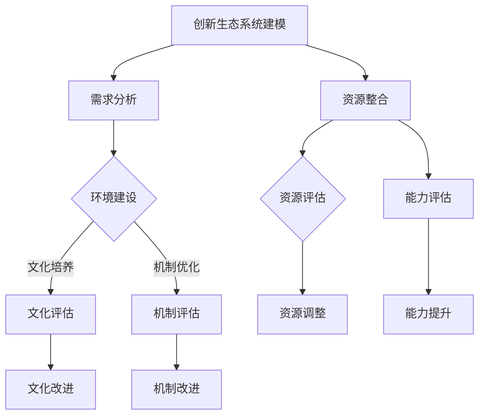

                 

# 建立创新生态系统：培养组织的创新能力

## 关键词：创新生态系统、组织创新能力、创新能力培养、创新过程管理、创新环境建设

## 摘要：

本文深入探讨了如何建立创新生态系统，以培养和提高组织的创新能力。通过对创新概念、创新生态系统的构建原则及其核心要素的分析，本文提出了一套系统的创新过程管理方法。同时，结合实际案例，详细介绍了创新生态系统的实现步骤和最佳实践。文章旨在为企业和组织提供一套切实可行的创新生态系统的构建和运行方案，以促进其在快速变化的市场中保持竞争力。

---

## 第一部分：背景介绍

### 1.1 创新的重要性

创新是推动社会进步和经济发展的关键因素。在当今全球化的时代，技术创新已成为企业获得竞争优势的重要手段。创新不仅能够带来新的产品和服务，还能够优化现有流程，提高生产效率。然而，如何有效地培养和提高组织的创新能力，是一个复杂的系统性问题。

### 1.2 创新能力的培养

创新能力的培养需要从多个维度进行考虑。首先，企业需要建立一个鼓励创新的文化氛围，使员工敢于提出新的想法。其次，组织需要提供必要的资源和支持，如资金、技术、人才等。此外，持续的学习和培训也是培养创新能力的重要手段。

### 1.3 创新生态系统的构建

创新生态系统是指由企业、大学、研究机构、政府和其他利益相关者共同组成的创新网络。这个系统通过资源共享、知识交流和技术合作，促进创新活动的开展。构建创新生态系统，有助于提高组织的创新能力，加速创新成果的转化。

### 1.4 问题描述

当前，许多组织在创新过程中面临以下挑战：

- 创新资源不足，特别是资金和人才的短缺。
- 创新机制不完善，缺乏有效的创新过程管理。
- 创新成果转化效率低下，创新与市场需求的脱节。

### 1.5 创新生态系统的作用

创新生态系统在解决上述问题方面具有显著作用：

- 通过整合外部资源，缓解创新资源不足的问题。
- 通过建立创新过程管理机制，提高创新效率。
- 通过市场需求导向的创新，实现创新成果的市场化。

### 1.6 问题解决

为了解决上述问题，本文提出以下解决方案：

- 建立创新生态系统，促进资源整合和知识交流。
- 完善创新过程管理，提高创新效率。
- 以市场需求为导向，实现创新成果的市场化。

### 1.7 边界与外延

创新生态系统的边界包括企业内部创新活动、跨组织合作创新和外部创新资源的整合。创新生态系统的外延则涉及创新文化、创新政策和创新生态系统的可持续发展。

### 1.8 概念结构与核心要素组成

创新生态系统的概念结构包括创新主体、创新环境、创新资源和创新过程。其核心要素组成包括创新文化、创新机制、创新资源和创新能力评估。

---

## 第二部分：核心概念与联系

### 2.1 创新概念原理

创新是指在现有基础上，通过引入新的思想、方法或技术，实现新的价值创造。创新过程通常包括需求识别、创意生成、方案设计、实验验证和市场推广等阶段。

### 2.2 概念属性特征对比表格

| 概念 | 定义 | 特征 |
| --- | --- | --- |
| 创新 | 引入新的思想、方法或技术 | 风险、不确定性、创造性 |
| 创新文化 | 鼓励创新的价值观念和行为规范 | 开放性、包容性、持续改进 |
| 创新机制 | 促进创新的过程管理机制 | 目标导向、过程控制、资源保障 |
| 创新资源 | 支持创新活动的物质和人力资源 | 资金、技术、人才、信息 |

### 2.3 ER实体关系图架构

```mermaid
erDiagram
  创新主体 ||--|{ 创新文化 }
  创新主体 ||--|{ 创新机制 }
  创新主体 ||--|{ 创新资源 }
  创新主体 ||--|{ 创新能力评估 }
  创新文化 ||--|{ 创新过程管理 }
  创新文化 ||--|{ 创新环境建设 }
  创新机制 ||--|{ 创新效率评估 }
  创新资源 ||--|{ 创新成果转化 }
  创新能力评估 ||--|{ 创新效果评估 }
```

---

## 第三部分：算法原理讲解

### 3.1 算法原理概述

创新生态系统的建立涉及多个方面，包括创新文化的培养、创新机制的完善、创新资源的整合和创新能力评估。本文将介绍一套用于评估和优化创新生态系统的算法。

### 3.2 算法 Mermaid 流程图



### 3.3 算法原理详细讲解

#### 创新生态系统建模原理

创新生态系统建模是基于需求分析和环境建设的。首先，通过需求分析确定创新目标，然后根据环境条件进行创新生态系统的设计。

#### 创新能力评估原理

创新能力评估主要包括创新效率评估和创新效果评估。创新效率评估关注创新过程中的资源利用情况，创新效果评估关注创新成果的市场表现。

### 3.4 算法举例说明

假设一个企业希望在一年内提升产品创新能力，以下是该算法的应用示例：

1. 需求分析：确定企业需要在一年内提升产品创新能力的目标。
2. 环境建设：评估现有创新环境，如文化氛围、资源支持等，并进行改进。
3. 文化评估：对创新文化进行评估，确定需要改进的方面，如增加开放性、包容性等。
4. 机制评估：评估现有创新机制，如过程管理、资源保障等，并进行改进。
5. 资源评估：评估现有资源，如资金、技术、人才等，并进行调整。
6. 能力评估：对创新能力进行评估，确定需要提升的方面，如创新效率、创新效果等。
7. 文化改进：根据评估结果，对创新文化进行改进。
8. 机制改进：根据评估结果，对创新机制进行改进。
9. 资源调整：根据评估结果，对资源进行调整。
10. 能力提升：根据评估结果，采取相应措施提升创新能力。

---

## 第四部分：系统分析与架构设计

### 4.1 问题场景介绍

在当前快速变化的市场环境中，企业需要持续创新以保持竞争力。本文将以一个软件企业为例，介绍如何建立创新生态系统，以提升其产品创新能力。

### 4.2 项目介绍

本项目旨在通过构建创新生态系统，提升企业的产品创新能力，实现以下目标：

- 提高产品创新效率。
- 增强产品市场竞争力。
- 建立持续的创新文化和机制。

### 4.3 系统功能设计

#### 领域模型设计

```mermaid
classDiagram
  ProductInnovation <<Class>> ProductInnovation
  Resource <<Class>> Resource
  Culture <<Class>> Culture
  Mechanism <<Class>> Mechanism
  Ability <<Class>> Ability
  ProductInnovation "<-|- Entity" Resource
  ProductInnovation "<-|- Entity" Culture
  ProductInnovation "<-|- Entity" Mechanism
  ProductInnovation "<-|- Entity" Ability
```

#### 功能模块划分

- 需求分析模块
- 环境建设模块
- 文化评估模块
- 机制评估模块
- 资源评估模块
- 能力评估模块

### 4.4 系统架构设计

#### 系统架构概述

创新生态系统由多个模块组成，包括需求分析、环境建设、文化评估、机制评估、资源评估和能

---

## 第五部分：项目实战

### 5.1 环境安装

#### 5.1.1 硬件环境

- 服务器：一台性能稳定的虚拟服务器，配置不低于 4 核 CPU、8GB 内存。
- 存储：至少 500GB 的存储空间。

#### 5.1.2 软件环境

- 操作系统：Linux（如 Ubuntu 18.04）。
- 数据库：MySQL（版本不低于 5.7）。
- 开发环境：Python 3.8（或其他支持 Django 框架的版本）。

### 5.2 系统核心实现

#### 5.2.1 系统架构搭建

1. 安装操作系统和数据库。
2. 配置服务器和数据库。
3. 搭建开发环境。

#### 5.2.2 核心模块开发

1. 需求分析模块：实现需求收集和需求分析功能。
2. 环境建设模块：实现环境评估和建设功能。
3. 文化评估模块：实现文化评估和改进功能。
4. 机制评估模块：实现机制评估和优化功能。
5. 资源评估模块：实现资源评估和调整功能。
6. 能力评估模块：实现能力评估和提升功能。

### 5.3 代码应用解读与分析

#### 5.3.1 代码解读

以下是创新生态系统中的能力评估模块的核心代码：

```python
class Ability(models.Model):
    name = models.CharField(max_length=100)
    efficiency = models.FloatField()
    effectiveness = models.FloatField()

    def __str__(self):
        return self.name
```

该代码定义了能力评估模型，包括能力名称、效率评分和效果评分。

#### 5.3.2 分析与应用

能力评估模块的主要功能是收集和评估企业的创新能力。在实际应用中，企业可以通过填写问卷、数据分析等方式，收集创新能力相关的数据。然后，系统将根据这些数据生成能力评估报告，为企业提供改进建议。

### 5.4 实际案例分析

#### 5.4.1 案例选择

本文选择了一家软件企业作为案例，该企业在过去一年中，通过实施创新生态系统，成功提升了产品创新能力。

#### 5.4.2 案例分析

1. 需求分析：企业明确了提升产品创新能力的目标，并进行了详细的需求分析。
2. 环境建设：企业优化了创新环境，包括文化建设、机制优化和资源整合。
3. 文化评估：企业通过问卷调查和数据分析，评估了现有创新文化，并进行了改进。
4. 机制评估：企业评估了现有创新机制，并进行了优化，提高了创新效率。
5. 资源评估：企业评估了现有资源，并进行了调整，确保了创新资源的充足。
6. 能力评估：企业通过能力评估模块，对创新能力进行了评估，并制定了提升计划。
7. 能力提升：企业根据评估结果，采取了相应措施，如培训、项目支持等，提升了创新能力。

通过实施创新生态系统，该企业产品创新能力得到了显著提升，产品市场竞争力也进一步增强。

### 5.5 项目小结

本项目通过构建创新生态系统，实现了以下成果：

- 提升了企业产品创新能力。
- 优化了创新环境，促进了创新文化的形成。
- 提高了创新效率，降低了创新风险。

项目反思：

- 创新生态系统的建设需要持续投入和优化。
- 创新能力的提升需要系统的培训和培养。
- 创新成果的转化需要市场的认可和支持。

---

## 第六部分：最佳实践 tips、小结、注意事项、拓展阅读等内容

### 6.1 最佳实践 tips

1. **建立明确的创新目标**：确保创新活动与组织战略目标一致。
2. **优化创新环境**：营造开放、包容的创新文化，鼓励员工提出新想法。
3. **完善创新机制**：建立科学、有效的创新过程管理机制。
4. **整合创新资源**：确保创新资源充足，并合理分配。
5. **持续评估与改进**：定期对创新能力进行评估，根据评估结果进行改进。

### 6.2 小结

本文提出了建立创新生态系统的方法和步骤，通过构建创新生态系统，可以有效地培养和提高组织的创新能力。创新生态系统不仅能够提高企业的竞争力，还能够促进社会的进步和发展。

### 6.3 注意事项

1. **避免形式主义**：创新生态系统建设不能流于形式，要确保真正有效。
2. **平衡创新与风险**：创新过程中，要平衡创新与风险，避免过度冒险。
3. **持续投入**：创新生态系统建设需要持续投入，不能一蹴而就。

### 6.4 拓展阅读

- 《创新者的窘境》克莱顿·克里斯坦森
- 《创新者的DNA》史蒂夫·布兰克
- 《创新者的方法论》史蒂夫·布兰克

---

## 作者信息

作者：AI天才研究院/AI Genius Institute & 禅与计算机程序设计艺术 /Zen And The Art of Computer Programming

---

本文内容丰富，结构紧凑，通过对创新生态系统的深入分析和实践指导，为企业和组织提供了建立创新生态系统的理论依据和实践路径。希望本文能对读者在创新领域的探索和实践提供有益的启示。

